<!--
CO_OP_TRANSLATOR_METADATA:
{
  "original_hash": "e2f686f2eb794941761252ac5e8e090b",
  "translation_date": "2025-06-25T10:45:07+00:00",
  "source_file": "02-exploring-and-comparing-different-llms/README.md",
  "language_code": "da"
}
-->
# Udforskning og sammenligning af forskellige LLM'er

[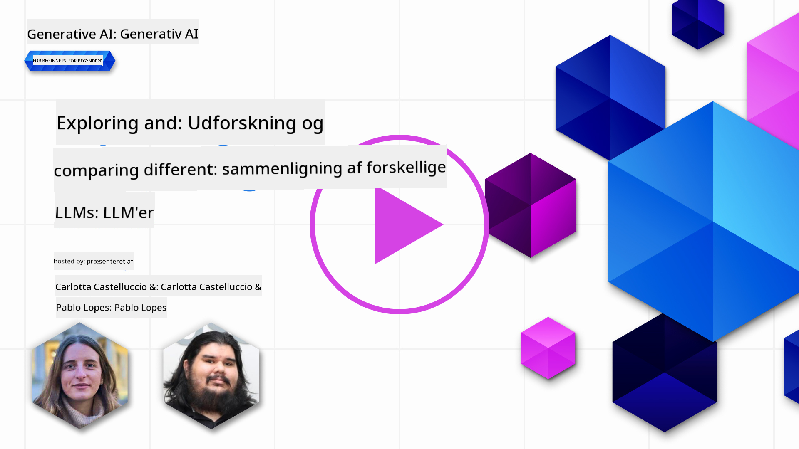](https://aka.ms/gen-ai-lesson2-gh?WT.mc_id=academic-105485-koreyst)

> _Klik på billedet ovenfor for at se videoen af denne lektion_

I den tidligere lektion har vi set, hvordan Generativ AI ændrer teknologilandskabet, hvordan Large Language Models (LLM'er) fungerer, og hvordan en virksomhed - som vores startup - kan anvende dem til deres brugsscenarier og vokse! I dette kapitel ser vi nærmere på at sammenligne og kontrastere forskellige typer af store sprogmodeller (LLM'er) for at forstå deres fordele og ulemper.

Det næste skridt i vores startups rejse er at udforske det nuværende landskab af LLM'er og forstå, hvilke der er egnede til vores brugsscenarie.

## Introduktion

Denne lektion vil dække:

- Forskellige typer af LLM'er i det nuværende landskab.
- Testning, iteration og sammenligning af forskellige modeller til dit brugsscenarie i Azure.
- Hvordan man implementerer en LLM.

## Læringsmål

Efter at have gennemført denne lektion vil du være i stand til at:

- Vælge den rigtige model til dit brugsscenarie.
- Forstå, hvordan man tester, itererer og forbedrer modellens ydeevne.
- Vide, hvordan virksomheder implementerer modeller.

## Forstå forskellige typer af LLM'er

LLM'er kan have flere kategoriseringer baseret på deres arkitektur, træningsdata og brugsscenarie. Forståelse af disse forskelle vil hjælpe vores startup med at vælge den rigtige model til scenariet og forstå, hvordan man tester, itererer og forbedrer ydeevnen.

Der er mange forskellige typer af LLM-modeller, dit valg af model afhænger af, hvad du ønsker at bruge dem til, dine data, hvor meget du er villig til at betale og mere.

Afhængigt af om du ønsker at bruge modellerne til tekst, lyd, video, billedgenerering osv., kan du vælge en anden type model.

- **Lyd- og talegenkendelse**. Til dette formål er Whisper-type modeller et godt valg, da de er generelle og rettet mod talegenkendelse. De er trænet på forskelligartet lyd og kan udføre flersproget talegenkendelse. Læs mere om [Whisper type modeller her](https://platform.openai.com/docs/models/whisper?WT.mc_id=academic-105485-koreyst).

- **Billedgenerering**. Til billedgenerering er DALL-E og Midjourney to meget kendte valg. DALL-E tilbydes af Azure OpenAI. [Læs mere om DALL-E her](https://platform.openai.com/docs/models/dall-e?WT.mc_id=academic-105485-koreyst) og også i kapitel 9 af dette pensum.

- **Tekstgenerering**. De fleste modeller er trænet på tekstgenerering, og du har et stort udvalg af muligheder fra GPT-3.5 til GPT-4. De kommer til forskellige omkostninger, hvor GPT-4 er den dyreste. Det er værd at se nærmere på [Azure OpenAI playground](https://oai.azure.com/portal/playground?WT.mc_id=academic-105485-koreyst) for at evaluere, hvilke modeller der bedst passer til dine behov med hensyn til kapacitet og omkostninger.

- **Multi-modalitet**. Hvis du ønsker at håndtere flere typer data i input og output, kan du overveje modeller som [gpt-4 turbo med vision eller gpt-4o](https://learn.microsoft.com/azure/ai-services/openai/concepts/models#gpt-4-and-gpt-4-turbo-models?WT.mc_id=academic-105485-koreyst) - de nyeste udgivelser af OpenAI-modeller - som er i stand til at kombinere naturlig sprogbehandling med visuel forståelse, hvilket muliggør interaktioner gennem multi-modale grænseflader.

Valg af en model betyder, at du får nogle grundlæggende funktioner, der dog ikke altid er nok. Ofte har du virksomheds-specifikke data, som du på en eller anden måde skal fortælle LLM'en om. Der er et par forskellige måder at nærme sig det på, mere om det i de kommende afsnit.

### Foundation Models versus LLM'er

Udtrykket Foundation Model blev [skabt af Stanford-forskere](https://arxiv.org/abs/2108.07258?WT.mc_id=academic-105485-koreyst) og defineret som en AI-model, der følger nogle kriterier, såsom:

- **De er trænet ved hjælp af usupervised learning eller selv-supervised learning**, hvilket betyder, at de er trænet på ulabeleret multi-modal data, og de kræver ikke menneskelig annotation eller mærkning af data til deres træningsproces.
- **De er meget store modeller**, baseret på meget dybe neurale netværk trænet på milliarder af parametre.
- **De er normalt beregnet til at fungere som et 'fundament' for andre modeller**, hvilket betyder, at de kan bruges som et udgangspunkt for andre modeller, der kan bygges ovenpå, hvilket kan gøres ved finjustering.

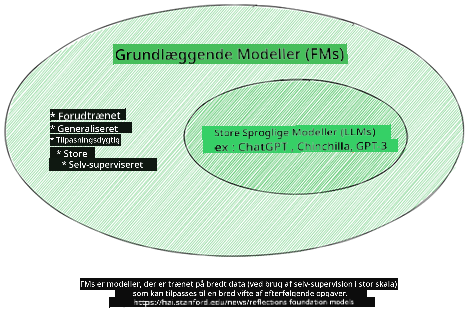

Billedkilde: [Essential Guide to Foundation Models and Large Language Models | af Babar M Bhatti | Medium
](https://thebabar.medium.com/essential-guide-to-foundation-models-and-large-language-models-27dab58f7404)

For yderligere at tydeliggøre denne skelnen, lad os tage ChatGPT som et eksempel. For at bygge den første version af ChatGPT, fungerede en model kaldet GPT-3.5 som fundamentmodel. Dette betyder, at OpenAI brugte nogle chat-specifikke data til at skabe en tilpasset version af GPT-3.5, der var specialiseret i at præstere godt i samtalescenarier, såsom chatbots.

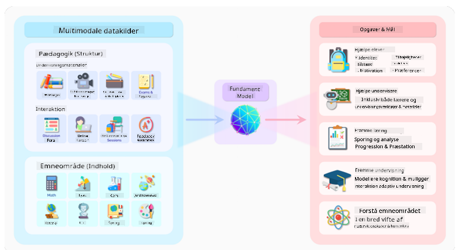

Billedkilde: [2108.07258.pdf (arxiv.org)](https://arxiv.org/pdf/2108.07258.pdf?WT.mc_id=academic-105485-koreyst)

### Open Source versus Proprietære Modeller

En anden måde at kategorisere LLM'er på er, om de er open source eller proprietære.

Open source-modeller er modeller, der gøres tilgængelige for offentligheden og kan bruges af alle. De gøres ofte tilgængelige af det firma, der har skabt dem, eller af forskningssamfundet. Disse modeller kan inspiceres, modificeres og tilpasses til de forskellige brugsscenarier i LLM'er. De er dog ikke altid optimeret til produktionsbrug og kan måske ikke præstere lige så godt som proprietære modeller. Desuden kan finansieringen til open source-modeller være begrænset, og de vedligeholdes måske ikke på lang sigt eller opdateres med den nyeste forskning. Eksempler på populære open source-modeller inkluderer [Alpaca](https://crfm.stanford.edu/2023/03/13/alpaca.html?WT.mc_id=academic-105485-koreyst), [Bloom](https://huggingface.co/bigscience/bloom) og [LLaMA](https://llama.meta.com).

Proprietære modeller er modeller, der ejes af en virksomhed og ikke gøres tilgængelige for offentligheden. Disse modeller er ofte optimeret til produktionsbrug. De er dog ikke tilladt at inspicere, modificere eller tilpasse til forskellige brugsscenarier. Desuden er de ikke altid tilgængelige gratis og kan kræve et abonnement eller betaling for at bruge. Brugerne har heller ikke kontrol over de data, der bruges til at træne modellen, hvilket betyder, at de skal stole på, at model-ejeren sikrer forpligtelse til databeskyttelse og ansvarlig brug af AI. Eksempler på populære proprietære modeller inkluderer [OpenAI-modeller](https://platform.openai.com/docs/models/overview?WT.mc_id=academic-105485-koreyst), [Google Bard](https://sapling.ai/llm/bard?WT.mc_id=academic-105485-koreyst) eller [Claude 2](https://www.anthropic.com/index/claude-2?WT.mc_id=academic-105485-koreyst).

### Indlejring versus Billedgenerering versus Tekst- og Kodegenerering

LLM'er kan også kategoriseres efter det output, de genererer.

Indlejringer er et sæt modeller, der kan konvertere tekst til en numerisk form, kaldet indlejring, som er en numerisk repræsentation af inputteksten. Indlejringer gør det lettere for maskiner at forstå forholdet mellem ord eller sætninger og kan bruges som input af andre modeller, såsom klassifikationsmodeller eller klynge-modeller, der præsterer bedre på numeriske data. Indlejringsmodeller bruges ofte til transfer learning, hvor en model bygges til en surrogatopgave, hvor der er en overflod af data, og derefter genbruges modelvægtene (indlejringer) til andre nedstrøms opgaver. Et eksempel på denne kategori er [OpenAI-indlejringer](https://platform.openai.com/docs/models/embeddings?WT.mc_id=academic-105485-koreyst).

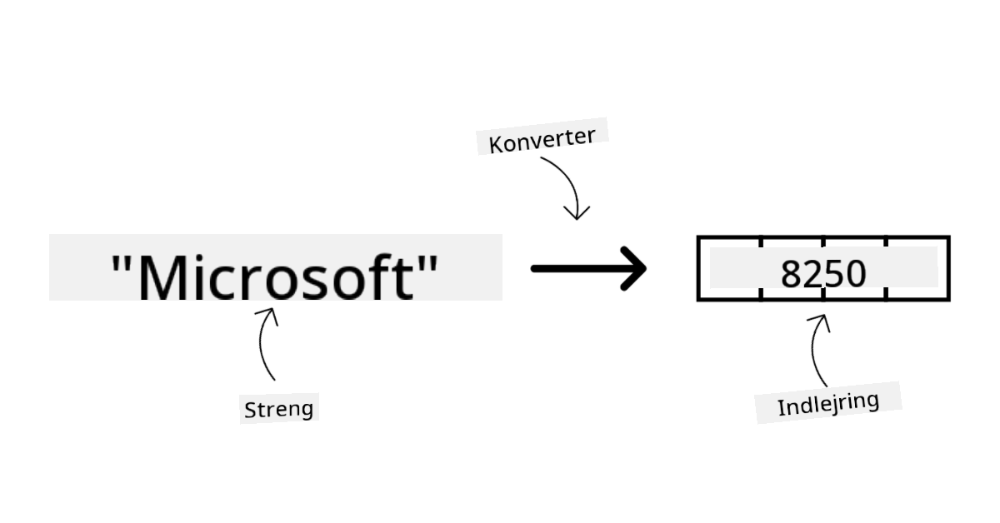

Billedgenereringsmodeller er modeller, der genererer billeder. Disse modeller bruges ofte til billedredigering, billedsyntese og billedoversættelse. Billedgenereringsmodeller er ofte trænet på store datasæt af billeder, såsom [LAION-5B](https://laion.ai/blog/laion-5b/?WT.mc_id=academic-105485-koreyst), og kan bruges til at generere nye billeder eller redigere eksisterende billeder med inpainting, super-opløsning og farvelægningsteknikker. Eksempler inkluderer [DALL-E-3](https://openai.com/dall-e-3?WT.mc_id=academic-105485-koreyst) og [Stable Diffusion-modeller](https://github.com/Stability-AI/StableDiffusion?WT.mc_id=academic-105485-koreyst).

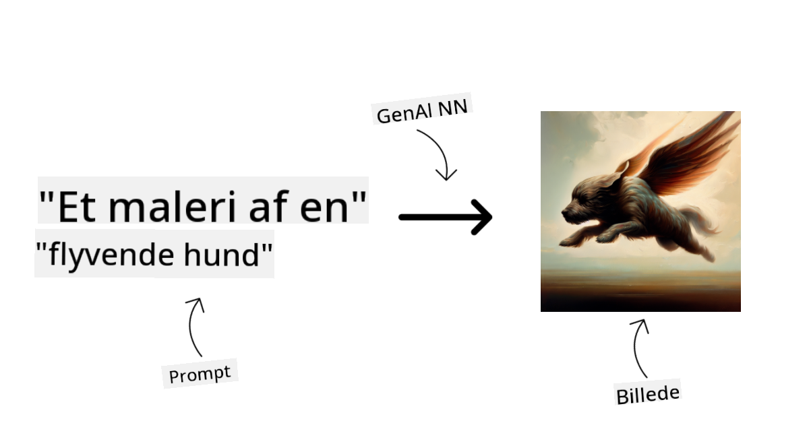

Tekst- og kodegenereringsmodeller er modeller, der genererer tekst eller kode. Disse modeller bruges ofte til tekstsammenfatning, oversættelse og spørgsmål-besvarelse. Tekstgenereringsmodeller er ofte trænet på store datasæt af tekst, såsom [BookCorpus](https://www.cv-foundation.org/openaccess/content_iccv_2015/html/Zhu_Aligning_Books_and_ICCV_2015_paper.html?WT.mc_id=academic-105485-koreyst), og kan bruges til at generere ny tekst eller besvare spørgsmål. Kodegenereringsmodeller, som [CodeParrot](https://huggingface.co/codeparrot?WT.mc_id=academic-105485-koreyst), er ofte trænet på store datasæt af kode, såsom GitHub, og kan bruges til at generere ny kode eller rette fejl i eksisterende kode.

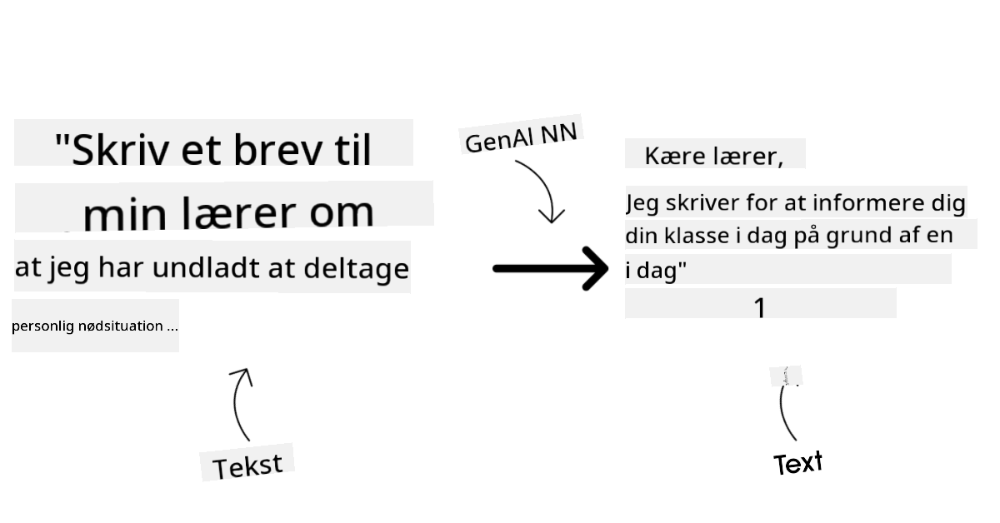

### Encoder-Decoder versus Kun Decoder

For at tale om de forskellige typer af arkitekturer af LLM'er, lad os bruge en analogi.

Forestil dig, at din leder gav dig en opgave med at skrive en quiz til de studerende. Du har to kolleger; den ene står for at skabe indholdet, og den anden står for at gennemgå det.

Indholdsskaberens rolle er som en Kun Decoder-model, de kan se på emnet og se, hvad du allerede har skrevet, og så kan de skrive et kursus baseret på det. De er meget gode til at skrive engagerende og informativt indhold, men de er ikke særlig gode til at forstå emnet og læringsmålene. Nogle eksempler på Decoder-modeller er GPT-familie modeller, såsom GPT-3.

Gennemgangerens rolle er som en Kun Encoder-model, de ser på det skrevne kursus og svarene, bemærker forholdet mellem dem og forstår konteksten, men de er ikke gode til at generere indhold. Et eksempel på en Kun Encoder-model ville være BERT.

Forestil dig, at vi også kan have en person, der både kan skabe og gennemgå quizzen, det er en Encoder-Decoder-model. Nogle eksempler ville være BART og T5.

### Service versus Model

Lad os nu tale om forskellen mellem en service og en model. En service er et produkt, der tilbydes af en Cloud Service Provider og er ofte en kombination af modeller, data og andre komponenter. En model er kernekomponenten i en service og er ofte en fundamentmodel, såsom en LLM.

Services er ofte optimeret til produktionsbrug og er ofte lettere at bruge end modeller via en grafisk brugergrænseflade. Dog er services ikke altid tilgængelige gratis og kan kræve et abonnement eller betaling for at bruge, i bytte for at udnytte serviceejerens udstyr og ressourcer, optimere udgifter og nemt skalere. Et eksempel på en service er [Azure OpenAI Service](https://learn.microsoft.com/azure/ai-services/openai/overview?WT.mc_id=academic-105485-koreyst), som tilbyder en pay-as-you-go-plan, hvilket betyder, at brugerne bliver opkrævet proportionalt med, hvor meget de bruger servicen. Derudover tilbyder Azure OpenAI Service virksomhedsklasse sikkerhed og en ansvarlig AI-ramme oven på modellernes kapaciteter.

Modeller er blot det neurale netværk med parametrene, vægtene og andre. Dette giver virksomheder mulighed for at køre lokalt, men de skal dog købe udstyr, bygge en struktur til at skalere og købe en licens eller bruge en open source-model. En model som LLaMA er tilgængelig til brug, hvilket kræver computerkraft til at køre modellen.

## Hvordan man tester og itererer med forskellige modeller for at forstå ydeevne på Azure

Når vores team har udforsket det nuværende LLM-landskab og identificeret nogle gode kandidater til deres scenarier, er det næste skridt at teste dem på deres data og arbejdsbelastning. Dette er en iterativ proces, udført ved eksperimenter og målinger.
De fleste af de modeller, vi nævnte i tidligere afsnit (OpenAI-modeller, open source-modeller som Llama2, og Hugging Face-transformers) er tilgængelige i [Modelkataloget](https://learn.microsoft.com/azure/ai-studio/how-to/model-catalog-overview?WT.mc_id=academic-105485-koreyst) i [Azure AI Studio](https://ai.azure.com/?WT.mc_id=academic-105485-koreyst).

[Azure AI Studio](https://learn.microsoft.com/azure/ai-studio/what-is-ai-studio?WT.mc_id=academic-105485-koreyst) er en cloud-platform designet til udviklere til at bygge generative AI-applikationer og håndtere hele udviklingslivscyklussen - fra eksperimentering til evaluering - ved at kombinere alle Azure AI-tjenester i et enkelt hub med en praktisk GUI. Modelkataloget i Azure AI Studio giver brugeren mulighed for at:

- Finde den fundamentmodel af interesse i kataloget - enten proprietær eller open source, filtrering efter opgave, licens eller navn. For at forbedre søgbarheden er modellerne organiseret i samlinger, som Azure OpenAI-samlingen, Hugging Face-samlingen og mere.

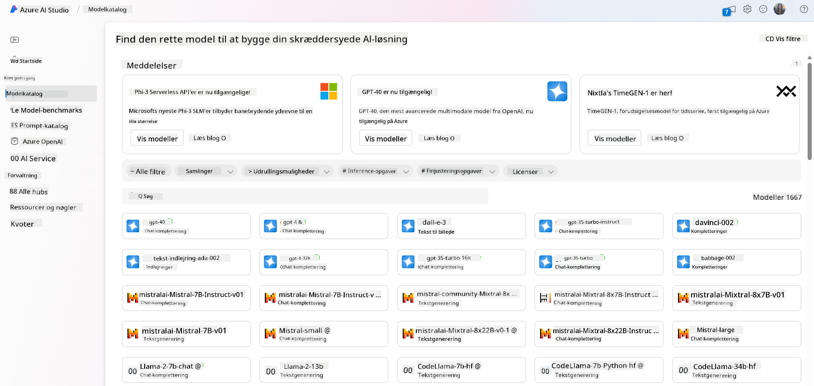

- Gennemgå modelkortet, inklusive en detaljeret beskrivelse af tilsigtet brug og træningsdata, kodeeksempler og evalueringsresultater i det interne evalueringsbibliotek.

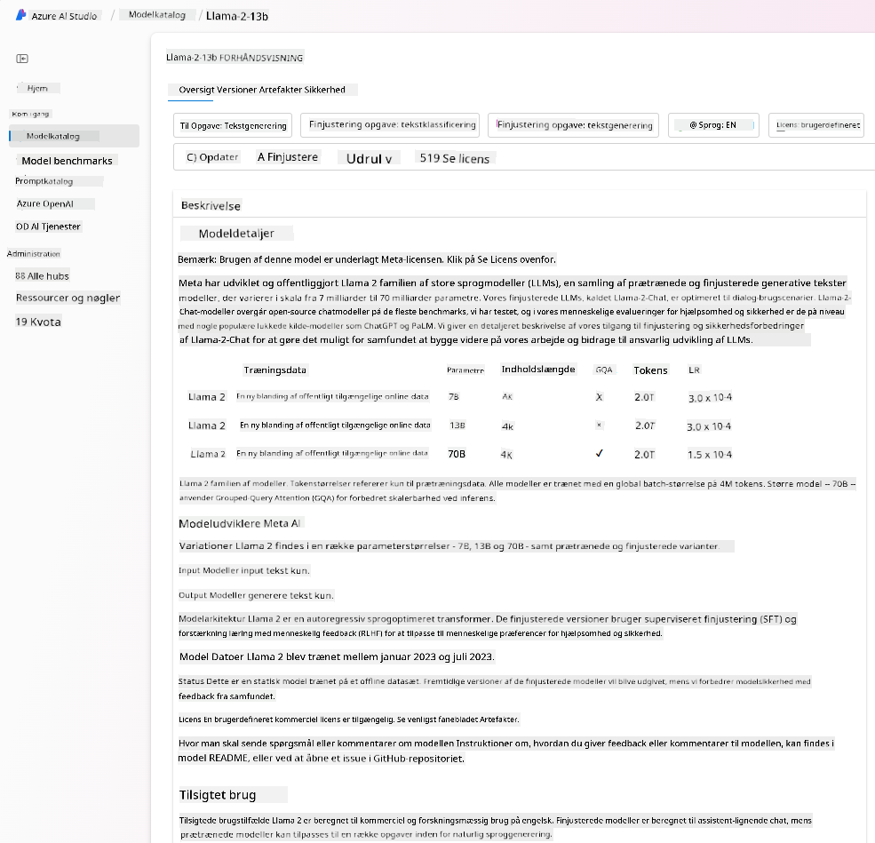
- Sammenlign benchmarks på tværs af modeller og datasæt tilgængelige i branchen for at vurdere, hvilken der passer til forretningsscenariet, via [Model Benchmarks](https://learn.microsoft.com/azure/ai-studio/how-to/model-benchmarks?WT.mc_id=academic-105485-koreyst) panelet.

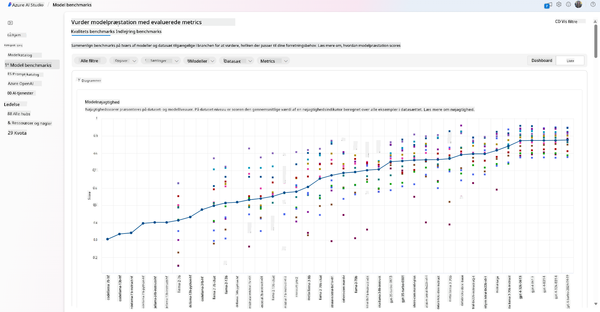

- Finjuster modellen på brugerdefinerede træningsdata for at forbedre modelens ydeevne i en specifik arbejdsbyrde, ved at udnytte eksperimenterings- og sporingsmulighederne i Azure AI Studio.

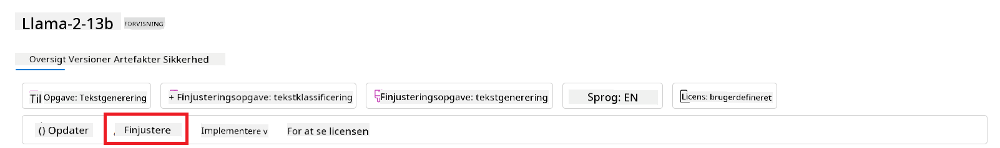

- Udrul den originale forudtrænede model eller den finjusterede version til en fjern realtidsinferens - administreret beregning - eller serverløs api-endpoint - [pay-as-you-go](https://learn.microsoft.com/azure/ai-studio/how-to/model-catalog-overview#model-deployment-managed-compute-and-serverless-api-pay-as-you-go?WT.mc_id=academic-105485-koreyst) - for at give applikationer mulighed for at bruge den.

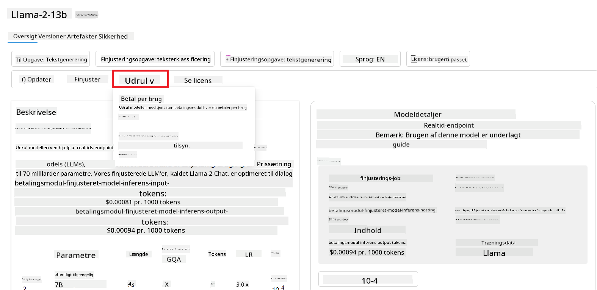

> [!NOTE]
> Ikke alle modeller i kataloget er i øjeblikket tilgængelige for finjustering og/eller pay-as-you-go udrulning. Tjek modelkortet for detaljer om modellens kapaciteter og begrænsninger.

## Forbedring af LLM-resultater

Vi har sammen med vores startup-team udforsket forskellige typer LLM'er og en Cloud Platform (Azure Machine Learning), der giver os mulighed for at sammenligne forskellige modeller, evaluere dem på testdata, forbedre ydeevnen og udrulle dem på inferensendpunkter.

Men hvornår skal de overveje at finjustere en model frem for at bruge en forudtrænet? Er der andre tilgange til at forbedre modellens ydeevne på specifikke arbejdsbyrder?

Der er flere tilgange, en virksomhed kan bruge for at få de resultater, de har brug for fra en LLM. Du kan vælge forskellige typer modeller med forskellige grader af træning, når du udruller en LLM i produktion, med forskellige niveauer af kompleksitet, omkostninger og kvalitet. Her er nogle forskellige tilgange:

- **Prompt engineering med kontekst**. Ideen er at give nok kontekst, når du prompt, for at sikre, at du får de svar, du har brug for.

- **Retrieval Augmented Generation, RAG**. Dine data kan eksistere i en database eller web-endpoint for eksempel, for at sikre at disse data, eller en delmængde af dem, inkluderes på tidspunktet for prompting, kan du hente de relevante data og gøre dem til en del af brugerens prompt.

- **Finjusteret model**. Her har du trænet modellen yderligere på dine egne data, hvilket har gjort modellen mere præcis og lydhør over for dine behov, men det kan være dyrt.

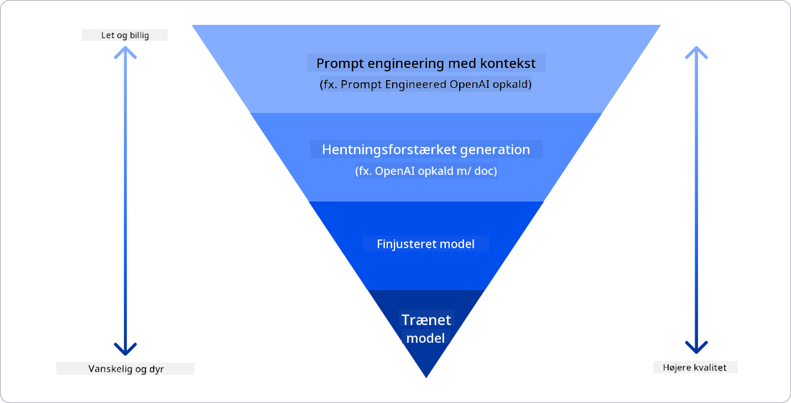

Billedkilde: [Four Ways that Enterprises Deploy LLMs | Fiddler AI Blog](https://www.fiddler.ai/blog/four-ways-that-enterprises-deploy-llms?WT.mc_id=academic-105485-koreyst)

### Prompt Engineering med Kontekst

Forudtrænede LLM'er fungerer meget godt på generaliserede opgaver inden for naturligt sprog, selv ved at kalde dem med en kort prompt, som en sætning der skal fuldføres eller et spørgsmål – det såkaldte “zero-shot” læring.

Men jo mere brugeren kan formulere deres forespørgsel med en detaljeret anmodning og eksempler – konteksten – jo mere præcis og tæt på brugerens forventninger vil svaret være. I dette tilfælde taler vi om “one-shot” læring, hvis prompten kun inkluderer ét eksempel, og “few shot learning” hvis den inkluderer flere eksempler.
Prompt engineering med kontekst er den mest omkostningseffektive tilgang til at starte med.

### Retrieval Augmented Generation (RAG)

LLM'er har den begrænsning, at de kun kan bruge de data, der er blevet brugt under deres træning til at generere et svar. Dette betyder, at de ikke ved noget om de fakta, der skete efter deres træningsproces, og de kan ikke få adgang til ikke-offentlig information (som virksomhedsdata).
Dette kan overvindes gennem RAG, en teknik der forstærker prompt med eksterne data i form af dokumentfragmenter, idet der tages hensyn til promptens længdebegrænsninger. Dette understøttes af Vector database værktøjer (som [Azure Vector Search](https://learn.microsoft.com/azure/search/vector-search-overview?WT.mc_id=academic-105485-koreyst)) der henter de nyttige fragmenter fra forskellige foruddefinerede datakilder og tilføjer dem til promptens kontekst.

Denne teknik er meget nyttig, når en virksomhed ikke har nok data, nok tid eller ressourcer til at finjustere en LLM, men stadig ønsker at forbedre ydeevnen på en specifik arbejdsbyrde og reducere risikoen for fabrikationer, dvs. mystificering af virkeligheden eller skadelig indhold.

### Finjusteret model

Finjustering er en proces, der udnytter transfer læring til at 'tilpasse' modellen til en downstream opgave eller til at løse et specifikt problem. I modsætning til few-shot learning og RAG resulterer det i en ny model, der genereres med opdaterede vægte og bias. Det kræver et sæt træningseksempler bestående af en enkelt input (prompten) og dets tilknyttede output (fuldførelsen).
Dette ville være den foretrukne tilgang hvis:

- **Brug af finjusterede modeller**. En virksomhed ønsker at bruge finjusterede mindre kapable modeller (som embedding modeller) frem for højtydende modeller, hvilket resulterer i en mere omkostningseffektiv og hurtig løsning.

- **Overvejelse af latency**. Latency er vigtigt for en specifik use-case, så det er ikke muligt at bruge meget lange prompts eller antallet af eksempler, der skal læres fra modellen, passer ikke med promptens længdebegrænsning.

- **At holde sig opdateret**. En virksomhed har mange høj-kvalitets data og grundsandhed etiketter og de ressourcer, der kræves for at vedligeholde disse data opdateret over tid.

### Trænet model

At træne en LLM fra bunden er uden tvivl den mest vanskelige og mest komplekse tilgang at vedtage, hvilket kræver massive mængder data, kvalificerede ressourcer og passende beregningskraft. Denne mulighed bør kun overvejes i et scenarie, hvor en virksomhed har en domænespecifik use-case og en stor mængde domænecentreret data.

## Videnstest

Hvad kunne være en god tilgang til at forbedre LLM-fuldførelsesresultater?

1. Prompt engineering med kontekst
1. RAG
1. Finjusteret model

A:3, hvis du har tid og ressourcer og høj kvalitet data, er finjustering den bedre mulighed for at holde sig opdateret. Men hvis du kigger på at forbedre tingene og mangler tid, er det værd at overveje RAG først.

## 🚀 Udfordring

Læs mere om, hvordan du kan [bruge RAG](https://learn.microsoft.com/azure/search/retrieval-augmented-generation-overview?WT.mc_id=academic-105485-koreyst) til din virksomhed.

## Godt arbejde, fortsæt din læring

Efter at have afsluttet denne lektion, tjek vores [Generative AI Learning collection](https://aka.ms/genai-collection?WT.mc_id=academic-105485-koreyst) for at fortsætte med at opgradere din viden om Generative AI!

Gå videre til Lektion 3, hvor vi vil se på, hvordan man [bygger med Generative AI Ansvarligt](../03-using-generative-ai-responsibly/README.md?WT.mc_id=academic-105485-koreyst)!

**Ansvarsfraskrivelse**:  
Dette dokument er blevet oversat ved hjælp af AI-oversættelsestjenesten [Co-op Translator](https://github.com/Azure/co-op-translator). Selvom vi bestræber os på nøjagtighed, skal du være opmærksom på, at automatiserede oversættelser kan indeholde fejl eller unøjagtigheder. Det originale dokument på dets oprindelige sprog bør betragtes som den autoritative kilde. For kritisk information anbefales professionel menneskelig oversættelse. Vi er ikke ansvarlige for eventuelle misforståelser eller fejltolkninger, der måtte opstå ved brugen af denne oversættelse.