# Udforskning og sammenligning af forskellige LLM'er

> _Klik på billedet ovenfor for at se videoen af denne lektion_

Med den forrige lektion har vi set, hvordan Generativ AI ændrer teknologilandskabet, hvordan Store Sprogmodeller (LLM'er) fungerer, og hvordan en virksomhed – som vores startup – kan anvende dem til deres brugsscenarier og vokse! I dette kapitel ser vi på at sammenligne og kontrastere forskellige typer store sprogmodeller (LLM'er) for at forstå deres fordele og ulemper.

Næste skridt på vores startups rejse er at udforske det nuværende landskab af LLM'er og forstå, hvilke der er egnede til vores brugsscenarie.

## Introduktion

Denne lektion vil dække:

- Forskellige typer af LLM'er i det nuværende landskab.
- Testning, iteration og sammenligning af forskellige modeller til dit brugsscenarie i Azure.
- Hvordan man implementerer en LLM.

## Læringsmål

Efter at have gennemført denne lektion vil du kunne:

- Vælge den rigtige model til dit brugsscenarie.
- Forstå hvordan man tester, itererer og forbedrer ydelsen af din model.
- Vide hvordan virksomheder implementerer modeller.

## Forstå forskellige typer af LLM'er

LLM'er kan have flere kategoriseringer baseret på deres arkitektur, træningsdata og brugsscenarie. At forstå disse forskelle vil hjælpe vores startup med at vælge den rigtige model til situationen og forstå, hvordan man tester, itererer og forbedrer ydeevnen.

Der findes mange forskellige typer af LLM-modeller, og dit valg af model afhænger af, hvad du ønsker at bruge dem til, dine data, hvor meget du er villig til at betale og mere.

Afhængigt af, om du vil bruge modellerne til tekst, lyd, video, billedgenerering osv., kan du vælge en anden type model.

- **Lyd- og talegenkendelse**. Whisper-lignende modeller er stadig nyttige alsidige talegenkendelsesmodeller, men i produktion vælges også nyere tale-til-tekst modeller som `gpt-4o-transcribe`, `gpt-4o-mini-transcribe` og diariseringsvarianter. Vurder sprogunderstøttelse, diariseringsfunktion, realtidsunderstøttelse, latenstid og omkostninger for dit scenarie. Læs mere i [OpenAI dokumentationen for tale-til-tekst](https://platform.openai.com/docs/guides/speech-to-text?WT.mc_id=academic-105485-koreyst).

- **Billedgenerering**. DALL-E og Midjourney er velkendte muligheder for billedgenerering, men de nuværende OpenAI billed-API'er fokuserer på GPT billedmodeller som `gpt-image-2`, mens Stable Diffusion, Imagen, Flux og andre modelfamilier også er almindelige valg. Sammenlign promptoverholdelse, redigeringsunderstøttelse, stilkontrol, sikkerhedskrav og licensering. Læs mere i [OpenAI guiden til billedgenerering](https://platform.openai.com/docs/guides/images?WT.mc_id=academic-105485-koreyst) og i kapitel 9 i denne læseplan.

- **Tekstgenerering**. Tekstmodeller spænder nu over frontlinjemodeller, ræsonnementmodeller, mindre lav-latens modeller og open-weight modeller. Nuværende eksempler inkluderer OpenAI GPT-5.x modeller, Anthropic Claude 4.x modeller, Google Gemini 3.x modeller, Meta Llama 4 modeller og Mistral modeller. Vælg ikke kun efter udgivelsesdato eller pris; sammenlign opgavekvalitet, latenstid, kontekstvinduet, værktøjsbrug, sikkerhedsadfærd, regional tilgængelighed og samlede omkostninger. [Microsoft Foundry modelkatalog](https://ai.azure.com/catalog?WT.mc_id=academic-105485-koreyst) er et godt sted at sammenligne modeller tilgængelige i Azure.

- **Multi-modality**. Mange nuværende modeller kan bearbejde mere end tekst. Nogle accepterer billede, lyd eller video input; nogle kan kalde værktøjer; og specialiserede modeller kan generere billeder, lyd eller video. For eksempel understøtter nuværende OpenAI modeller tekst og billede input, Gemini modeller kan understøtte tekst, kode, billede, lyd og video input afhængigt af varianten, og Llama 4 Scout og Maverick er open-weight nativt multimodale modeller. Tjek altid hver model kort for understøttede input- og outputmodaliteter, før du bygger en arbejdsproces omkring dem.

At vælge en model betyder, at du får nogle grundlæggende kapaciteter, som dog måske ikke er nok. Ofte har du firma-specifikke data, som du på en eller anden måde skal fortælle LLM’en om. Der er nogle forskellige muligheder for, hvordan man angriber det, mere om det i de kommende sektioner.

### Foundation Models versus LLM'er

Udtrykket Foundation Model blev [opfundet af forskere fra Stanford](https://arxiv.org/abs/2108.07258?WT.mc_id=academic-105485-koreyst) og defineret som en AI-model, der opfylder visse kriterier, såsom:

- **De er trænet ved hjælp af unsupervised learning eller self-supervised learning**, hvilket betyder, at de er trænet på unlabeled multimodale data, og de kræver ikke menneskelig annotering eller mærkning af data for deres træningsproces.
- **De er meget store modeller**, baseret på meget dybe neurale netværk trænet på milliarder af parametre.
- **De er normalt tiltænkt at tjene som en ‘foundation’ for andre modeller**, hvilket betyder, at de kan bruges som udgangspunkt for andre modeller, der bygges ovenpå, hvilket kan ske ved finjustering.

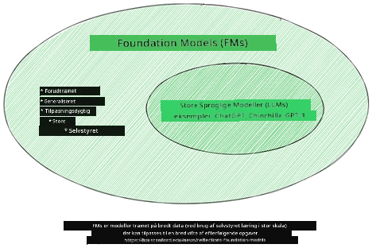

Billedkilde: [Essential Guide to Foundation Models and Large Language Models | af Babar M Bhatti | Medium
](https://thebabar.medium.com/essential-guide-to-foundation-models-and-large-language-models-27dab58f7404)

For at tydeliggøre denne sondring, lad os tage ChatGPT som et historisk eksempel. Tidlige versioner af ChatGPT brugte GPT-3.5 som foundation model. OpenAI brugte derefter chat-specifikke data og justeringsteknikker til at skabe en finjusteret version, der fungerede bedre i samtalescenarier, såsom chatbots. Moderne AI-tjenester ruter ofte mellem flere modelvarianter, så tjenestens navn og den underliggende modelnavn er ikke altid det samme.

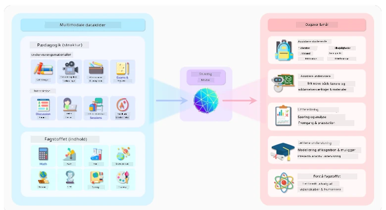

Billedkilde: [2108.07258.pdf (arxiv.org)](https://arxiv.org/pdf/2108.07258.pdf?WT.mc_id=academic-105485-koreyst)

### Open-Weight/Open-Source versus Proprietære modeller

En anden måde at kategorisere LLM'er på er, om de er open-weight, open-source eller proprietære.

Open-source og open-weight modeller gør modelartefakter tilgængelige til inspektion, download eller tilpasning, men deres licenser varierer. Nogle er fuldt open source, mens andre er open-weight modeller med brugsrestriktioner. De kan være nyttige, når en virksomhed har brug for mere kontrol over implementering, datalokalisering, omkostninger eller tilpasning. Men teams skal stadig vurdere licensbetingelser, serveringsomkostninger, vedligeholdelse, sikkerhedsopdateringer og evalueringskvalitet, før de bruger dem i produktion. Eksempler inkluderer [Meta Llama 4](https://ai.meta.com/blog/llama-4-multimodal-intelligence/?WT.mc_id=academic-105485-koreyst), nogle [Mistral modeller](https://docs.mistral.ai/models/overview?WT.mc_id=academic-105485-koreyst) og mange modeller hostet på [Hugging Face](https://huggingface.co/models?WT.mc_id=academic-105485-koreyst).

Proprietære modeller ejes og hostes af en udbyder. Disse modeller er ofte optimeret til administreret produktionsbrug og kan tilbyde stærk support, sikkerhedssystemer, værktøjsintegration og skalerbarhed. Dog kan kunder som regel ikke inspicere eller ændre modelvægt, og de skal gennemgå udbyderens betingelser for privatliv, opbevaring, compliance og acceptabel brug. Eksempler inkluderer [OpenAI modeller](https://platform.openai.com/docs/models?WT.mc_id=academic-105485-koreyst), [Google Gemini](https://deepmind.google/models/gemini/pro/?WT.mc_id=academic-105485-koreyst) og [Anthropic Claude](https://platform.claude.com/docs/en/about-claude/models/overview?WT.mc_id=academic-105485-koreyst).

### Embedding versus billedgenerering versus tekst- og kodegenerering

LLM'er kan også kategoriseres efter den output, de genererer.

Embeddings er en række modeller, der kan omdanne tekst til en numerisk form, kaldet embedding, som er en numerisk repræsentation af inputteksten. Embeddings gør det lettere for maskiner at forstå relationer mellem ord eller sætninger og kan bruges som input af andre modeller, såsom klassifikationsmodeller eller klyngemodeller, der har bedre præstation på numeriske data. Embedding-modeller bruges ofte til transfer learning, hvor en model opbygges til en efterligningsopgave, som der findes rigeligt data til, og derefter genbruges modelvægtene (embeddings) til andre nedstrøms opgaver. Et eksempel på denne kategori er [OpenAI embeddings](https://platform.openai.com/docs/models/embeddings?WT.mc_id=academic-105485-koreyst).

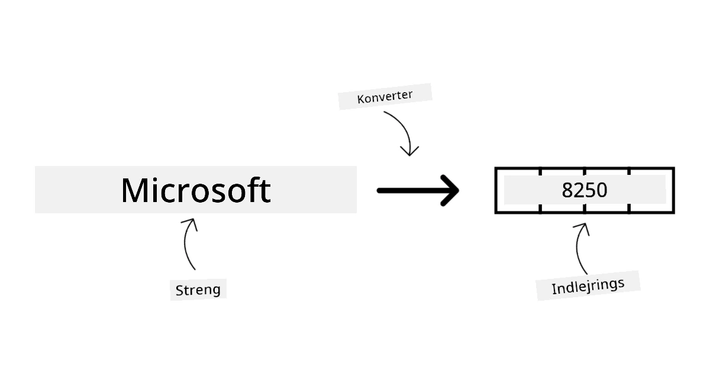

Billedgenereringsmodeller er modeller, der genererer billeder. Disse modeller bruges ofte til billedredigering, billedsyntese og billedoversættelse. Billedgenereringsmodeller trænes ofte på store datasæt af billeder, såsom [LAION-5B](https://laion.ai/blog/laion-5b/?WT.mc_id=academic-105485-koreyst), og kan bruges til at generere nye billeder eller redigere eksisterende billeder med inpainting, super-opløsning og koloreringsteknikker. Eksempler inkluderer [GPT Image modeller](https://platform.openai.com/docs/guides/images?WT.mc_id=academic-105485-koreyst), [Stable Diffusion modeller](https://github.com/Stability-AI/StableDiffusion?WT.mc_id=academic-105485-koreyst) og Imagen modeller.

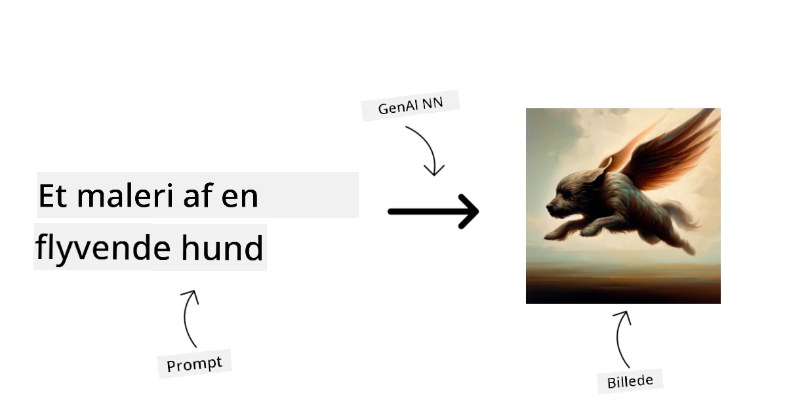

Tekst- og kodegenereringsmodeller er modeller, der genererer tekst eller kode. Disse modeller bruges ofte til tekstopsummering, oversættelse og spørgsmål-svar. Tekstgenereringsmodeller trænes ofte på store tekstdatasæt, såsom [BookCorpus](https://www.cv-foundation.org/openaccess/content_iccv_2015/html/Zhu_Aligning_Books_and_ICCV_2015_paper.html?WT.mc_id=academic-105485-koreyst), og kan bruges til at generere ny tekst eller besvare spørgsmål. Kodegenereringsmodeller, som [CodeParrot](https://huggingface.co/codeparrot?WT.mc_id=academic-105485-koreyst), trænes ofte på store kode-datasæt, såsom GitHub, og kan bruges til at generere ny kode eller rette fejl i eksisterende kode.

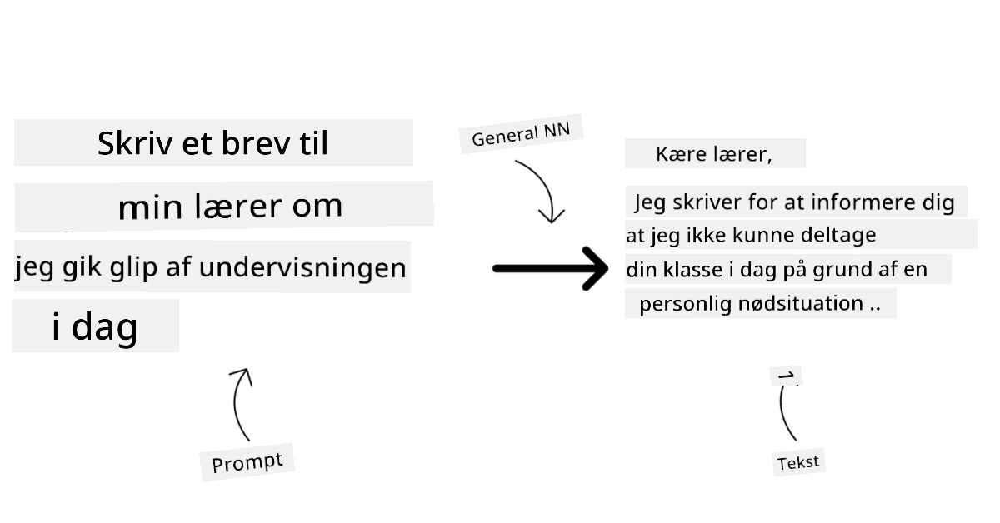

### Encoder-Decoder versus kun Decoder

For at tale om de forskellige typer af arkitekturer for LLM'er, lad os bruge en analogi.

Forestil dig, at din leder gav dig opgaven at skrive en quiz til eleverne. Du har to kolleger; den ene står for at skabe indholdet, og den anden står for at gennemgå det.

Indholdsskaberen er som en decoder-only model: de kan se på emnet, se hvad du allerede har skrevet, og derefter fortsætte med at generere indhold baseret på den kontekst. De er meget gode til at skrive engagerende og informativt indhold, men de er ikke altid det bedste valg, når opgaven kun er at klassificere, hente eller kode information. Eksempler på decoder-only model-familier inkluderer GPT og Llama modeller.

Gennemgåeren er som en Encoder-only model, de ser på det skrevne kursus og svarene, lægger mærke til relationen mellem dem og forstår konteksten, men de er ikke gode til at generere indhold. Et eksempel på Encoder-only model ville være BERT.

Forestil dig, at vi også kan have en, der kunne skabe og gennemgå quizzen, dette er en Encoder-Decoder model. Nogle eksempler ville være BART og T5.

### Service versus Model

Nu skal vi tale om forskellen mellem en service og en model. En service er et produkt, der tilbydes af en Cloud Service Provider, og er ofte en kombination af modeller, data og andre komponenter. En model er den centrale komponent i en service og er ofte en foundation model, såsom en LLM.

Services er ofte optimeret til produktionsbrug og er ofte nemmere at bruge end modeller via en grafisk brugergrænseflade. Dog er services ikke altid gratis og kan kræve abonnement eller betaling for brug, i bytte for at udnytte serviceejerenes udstyr og ressourcer, optimere udgifter og skalere let. Et eksempel på en service er [Azure OpenAI Service](https://learn.microsoft.com/azure/ai-services/openai/overview?WT.mc_id=academic-105485-koreyst), som tilbyder en pay-as-you-go prisplan, hvilket betyder, at brugere bliver opkrævet proportionelt efter, hvor meget de bruger servicen. Azure OpenAI Service tilbyder også sikkerhed på virksomhedsniveau og et ansvarligt AI-rammeværk ovenpå modellernes kapaciteter.

Modeller er de neurale netværksartefakter: parametre, vægte, arkitektur, tokenizer og understøttende konfiguration. At køre en model lokalt eller i et privat miljø kræver passende hardware, serveringsinfrastruktur, overvågning samt enten en kompatibel open-source/open-weight licens eller en kommerciel licens. Open-weight modeller såsom Llama 4 eller Mistral modeller kan hostes selv, men kræver stadig beregningskraft og operationel ekspertise.

## Hvordan man tester og itererer med forskellige modeller for at forstå ydelsen på Azure

Når vores team først har undersøgt det nuværende LLM-landskab og identificeret nogle gode kandidater til deres scenarier, er det næste skridt at teste dem på deres data og arbejdsbyrde. Dette er en iterativ proces, der udføres gennem eksperimenter og målinger.
De fleste af de modeller, vi nævnte i tidligere afsnit (OpenAI-modeller, åbenvægtsmodeller som Llama 4 og Mistral, og Hugging Face-modeller) er tilgængelige i [Microsoft Foundry Models](https://learn.microsoft.com/azure/foundry/concepts/foundry-models-overview?WT.mc_id=academic-105485-koreyst).

[Microsoft Foundry](https://learn.microsoft.com/azure/foundry/what-is-foundry?WT.mc_id=academic-105485-koreyst), tidligere Azure AI Studio/Azure AI Foundry, er en samlet Azure-platform til opbygning af AI-apps og agenter. Den hjælper udviklere med at håndtere livscyklussen fra eksperimentering og evaluering til implementering, overvågning og styring. Modelkataloget i Microsoft Foundry giver brugeren mulighed for:

- At finde det grundlæggende model af interesse i kataloget, inklusive modeller solgt af Azure og modeller fra partnere og fællesskabsudbydere. Brugere kan filtrere efter opgave, udbyder, licens, implementeringsmulighed eller navn.

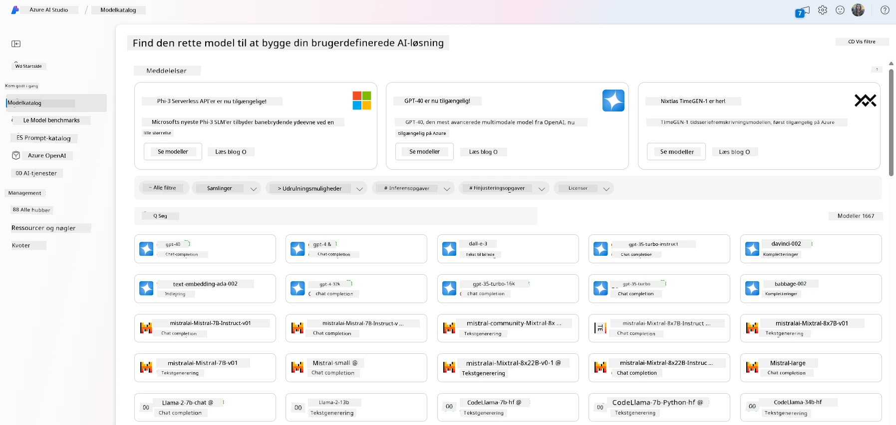

- At gennemgå modelkortet, inklusive en detaljeret beskrivelse af den tilsigtede brug og træningsdata, kodeeksempler og evalueringsresultater på det interne evalueringsbibliotek.

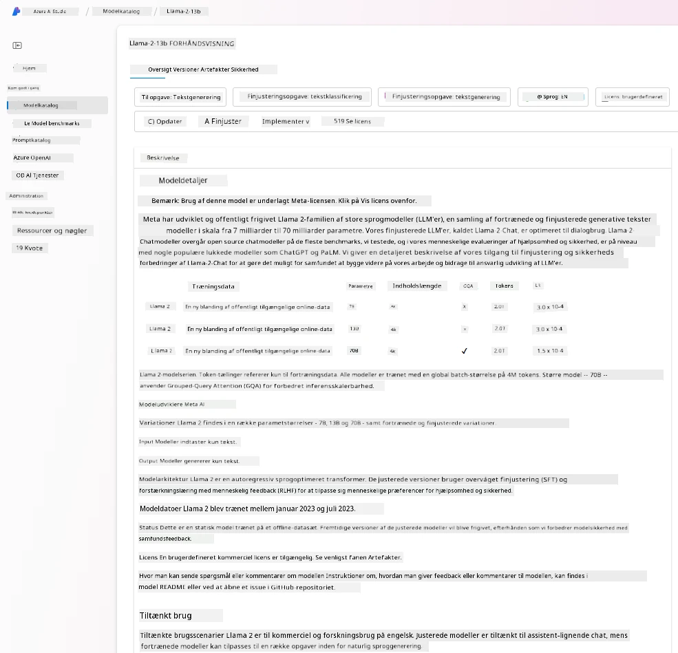

- At sammenligne benchmarks på tværs af modeller og datasæt tilgængelige i branchen for at vurdere, hvilken der opfylder forretningsscenariet, gennem [Model Benchmarks](https://learn.microsoft.com/azure/ai-studio/how-to/model-benchmarks?WT.mc_id=academic-105485-koreyst)-panelet.

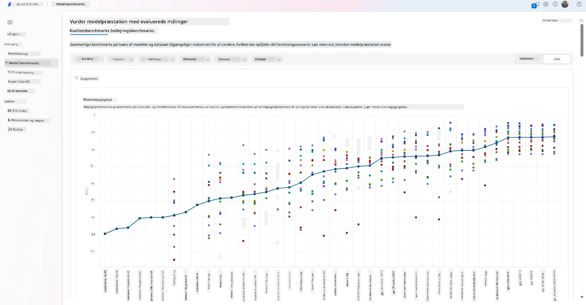

- At finjustere understøttede modeller på brugerdefinerede træningsdata for at forbedre modelpræstationen i en bestemt arbejdsbyrde ved at udnytte eksperimenterings- og sporingsfunktioner i Microsoft Foundry.

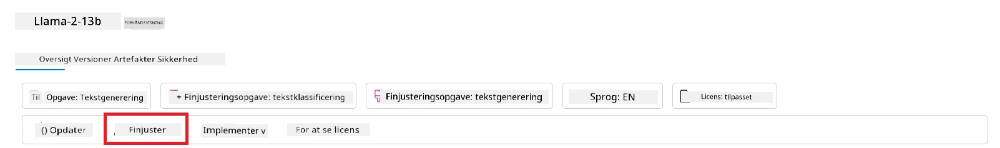

- At implementere den oprindelige præ-trænede model eller den finjusterede version til en fjern realtidsinferenz-endpoint, ved at bruge administrerede compute- eller serverløse implementeringsmuligheder, for at gøre det muligt for applikationer at forbruge den.

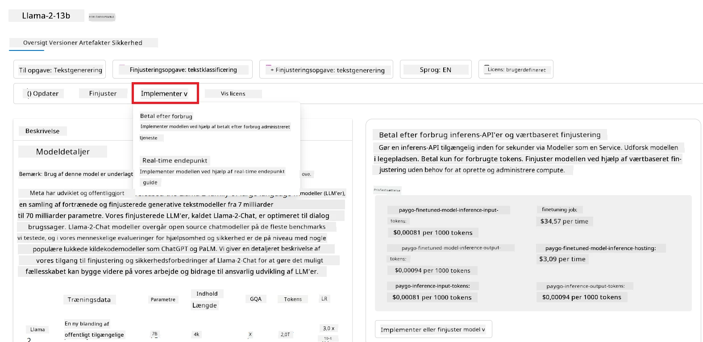

> [!NOTE]
> Ikke alle modeller i kataloget er i øjeblikket tilgængelige til finjustering og/eller pay-as-you-go-implementering. Tjek modelkortet for detaljer om modellens kapaciteter og begrænsninger.

## Forbedring af LLM-resultater

Vi har med vores startup-team udforsket forskellige slags LLM'er og en cloudplatform (Microsoft Foundry), der gør det muligt at sammenligne forskellige modeller, evaluere dem på testdata, forbedre præstationen og implementere dem på inferenzendepunkter.

Men hvornår bør de overveje at finjustere en model i stedet for at bruge en præ-trænet? Er der andre tilgange til at forbedre modelpræstationen på specifikke arbejdsbyrder?

Der er flere tilgange, en virksomhed kan anvende for at opnå de resultater, de har brug for fra en LLM. Du kan vælge forskellige typer modeller med forskellige grader af træning, når du implementerer en LLM i produktion, med forskellige niveauer af kompleksitet, omkostning og kvalitet. Her er nogle forskellige tilgange:

- **Prompt engineering med kontekst**. Ideen er at give nok kontekst ved prompten for at sikre, at du får de svar, du har brug for.

- **Retrieval Augmented Generation, RAG**. Dine data kan for eksempel eksistere i en database eller web-endpoint. For at sikre, at disse data, eller et delmængde af dem, medtages ved tidspunket for prompten, kan du hente relevante data og gøre det til en del af brugerens prompt.

- **Finjusteret model**. Her har du trænet modellen yderligere på dine egne data, hvilket har ført til, at modellen blev mere præcis og responsiv over for dine behov, men det kan være omkostningstungt.

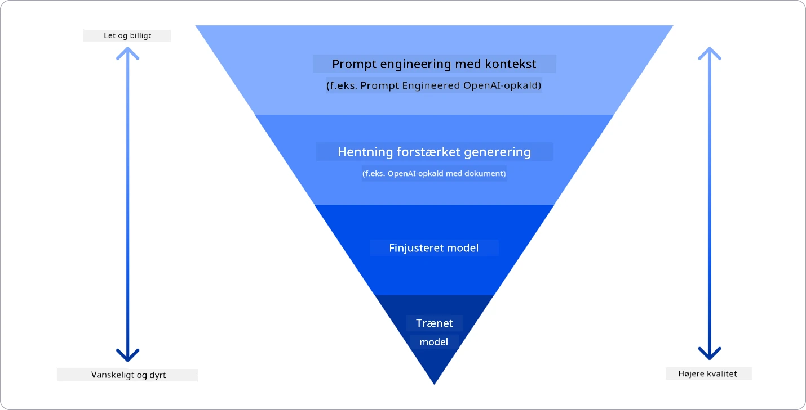

Billedkilde: [Four Ways that Enterprises Deploy LLMs | Fiddler AI Blog](https://www.fiddler.ai/blog/four-ways-that-enterprises-deploy-llms?WT.mc_id=academic-105485-koreyst)

### Prompt Engineering med Kontekst

Præ-trænede LLM'er fungerer rigtig godt på generaliserede opgaver inden for naturligt sprog, selv når de kaldes med en kort prompt, som en sætning der skal udfyldes eller et spørgsmål – det såkaldte ”zero-shot” læring.

Men jo mere brugeren kan indramme deres forespørgsel med en detaljeret anmodning og eksempler – konteksten – desto mere præcist og tæt på brugerens forventninger vil svaret være. I dette tilfælde taler vi om ”one-shot” læring, hvis prompten kun inkluderer ét eksempel, og ”few-shot learning”, hvis der er flere eksempler.
Prompt engineering med kontekst er den mest omkostningseffektive tilgang at starte med.

### Retrieval Augmented Generation (RAG)

LLM'er har den begrænsning, at de kun kan bruge de data, der er blevet brugt under deres træning til at generere et svar. Det betyder, at de ikke kender til begivenheder, der er sket efter deres træningsproces, og de kan ikke tilgå ikke-offentlige oplysninger (som virksomhedsdata).
Dette kan overvindes gennem RAG, en teknik, der udvider prompten med eksterne data i form af tekstblokke fra dokumenter, under hensyntagen til promptens længdebegrænsninger. Dette understøttes af Vector-databaseværktøjer (som [Azure Vector Search](https://learn.microsoft.com/azure/search/vector-search-overview?WT.mc_id=academic-105485-koreyst)), der henter nyttige tekstblokke fra forskellige foruddefinerede datakilder og tilføjer dem til promptens kontekst.

Denne teknik er meget nyttig, når en virksomhed ikke har nok data, tid eller ressourcer til at finjustere en LLM, men stadig ønsker at forbedre præstationen på en specifik arbejdsbyrde og reducere risici for hallucinerede, forældede eller upræcise svar.

### Finjusteret model

Finjustering er en proces, der udnytter transfer learning til at ’tilpasse’ modellen til en downstream-opgave eller til at løse et specifikt problem. Modsat få-skudslæring og RAG resulterer det i, at en ny model genereres med opdaterede vægte og biaser. Det kræver et sæt træningseksempler bestående af en enkelt input (prompten) og tilknyttet output (fuldførelsen).
Dette ville være den foretrukne tilgang, hvis:

- **Brug af mindre opgavespecifikke modeller**. En virksomhed ønsker at finjustere en mindre model til en snæver opgave frem for gentagne gange at prompta en større modelfrontier, hvilket resulterer i en mere omkostningseffektiv og hurtigere løsning.

- **Overvejelse af latenstid**. Latenstid er vigtig for et specifikt brugstilfælde, så det er ikke muligt at bruge meget lange prompts, eller antallet af eksempler, som modellen skal lære fra, passer ikke med promptens længdebegrænsning.

- **Tilpasning af stabil adfærd**. En virksomhed har mange høj-kvalitets eksempler og ønsker, at modellen konsekvent følger et opgavemønster, outputformat, tone eller domænespecifik stil. Hvis det primære problem er nye fakta eller privat viden, der ofte ændres, bør man bruge RAG i stedet for kun at stole på finjustering.

### Trænet model

At træne en LLM fra bunden er uden tvivl den sværeste og mest komplekse tilgang at anvende, som kræver enorme mængder data, dygtige ressourcer og passende beregningskraft. Denne mulighed bør kun overvejes i et scenarie, hvor en virksomhed har et domænespecifikt brugstilfælde og en stor mængde domænecentrerede data.

## Videnstest

Hvad kunne være en god tilgang til at forbedre LLM-fuldførelsesresultater?

1. Prompt engineering med kontekst
1. RAG
1. Finjusteret model

A: Alle tre kan hjælpe. Start med prompt engineering og kontekst for hurtige forbedringer, og brug RAG, når modellen har brug for aktuelle fakta eller private virksomhedsdata. Vælg finjustering, når du har nok høj-kvalitets eksempler og har behov for, at modellen konsekvent følger en opgave, format, tone eller domænemønster.

## 🚀 Udfordring

Læs mere om, hvordan du kan [bruge RAG](https://learn.microsoft.com/azure/search/retrieval-augmented-generation-overview?WT.mc_id=academic-105485-koreyst) for din virksomhed.

## Godt arbejde, fortsæt din læring

Efter at have gennemført denne lektion kan du tjekke vores [Generative AI Learning collection](https://aka.ms/genai-collection?WT.mc_id=academic-105485-koreyst) for at fortsætte med at forbedre din viden om Generativ AI!

Gå videre til Lektion 3, hvor vi ser på, hvordan man [bygger med Generativ AI på en ansvarlig måde](../03-using-generative-ai-responsibly/README.md?WT.mc_id=academic-105485-koreyst)!

---

<!-- CO-OP TRANSLATOR DISCLAIMER START -->
**Ansvarsfraskrivelse**:
Dette dokument er blevet oversat ved hjælp af AI-oversættelsestjenesten [Co-op Translator](https://github.com/Azure/co-op-translator). Selvom vi bestræber os på nøjagtighed, skal du være opmærksom på, at automatiserede oversættelser kan indeholde fejl eller unøjagtigheder. Det originale dokument på dets oprindelige sprog bør betragtes som den autoritative kilde. For kritisk information anbefales professionel menneskelig oversættelse. Vi påtager os intet ansvar for misforståelser eller fejltolkninger, der opstår som følge af brugen af denne oversættelse.
<!-- CO-OP TRANSLATOR DISCLAIMER END -->