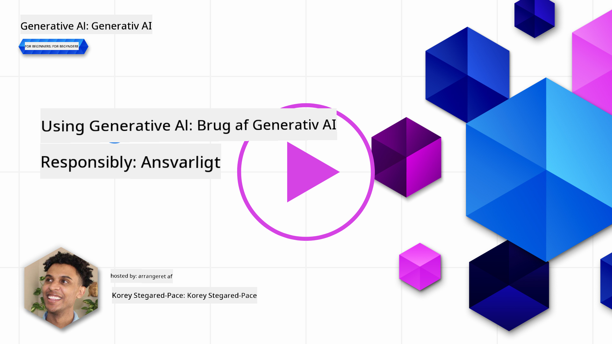
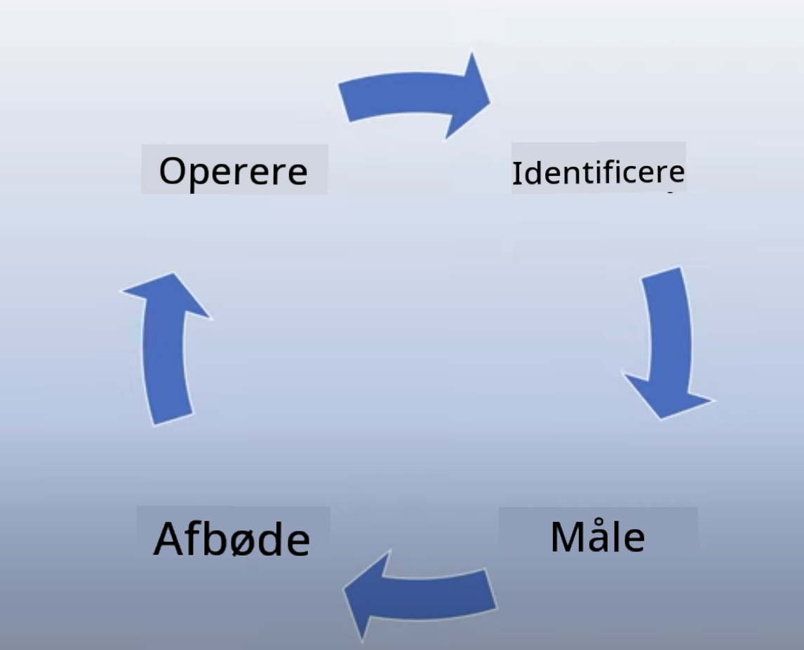

<!--
CO_OP_TRANSLATOR_METADATA:
{
  "original_hash": "7f8f4c11f8c1cb6e1794442dead414ea",
  "translation_date": "2025-07-09T08:57:35+00:00",
  "source_file": "03-using-generative-ai-responsibly/README.md",
  "language_code": "da"
}
-->
# Brug Generativ AI Ansvarligt

> _Klik på billedet ovenfor for at se videoen til denne lektion_

Det er nemt at blive fascineret af AI og især generativ AI, men du skal overveje, hvordan du bruger det ansvarligt. Du skal tænke over, hvordan du sikrer, at output er retfærdigt, ikke-skadeligt og mere. Dette kapitel har til formål at give dig den nødvendige kontekst, hvad du skal overveje, og hvordan du kan tage aktive skridt for at forbedre din AI-brug.

## Introduktion

Denne lektion vil dække:

- Hvorfor du bør prioritere Ansvarlig AI, når du bygger Generative AI-applikationer.
- De grundlæggende principper for Ansvarlig AI, og hvordan de relaterer til Generativ AI.
- Hvordan du omsætter disse principper for Ansvarlig AI til praksis gennem strategi og værktøjer.

## Læringsmål

Efter at have gennemført denne lektion vil du vide:

- Hvor vigtigt Ansvarlig AI er, når du bygger Generative AI-applikationer.
- Hvornår du skal tænke på og anvende de grundlæggende principper for Ansvarlig AI i dit arbejde med Generativ AI.
- Hvilke værktøjer og strategier der er tilgængelige for dig til at omsætte konceptet Ansvarlig AI til praksis.

## Principper for Ansvarlig AI

Spændingen omkring Generativ AI har aldrig været større. Denne begejstring har tiltrukket mange nye udviklere, opmærksomhed og finansiering til området. Selvom det er meget positivt for alle, der ønsker at bygge produkter og virksomheder med Generativ AI, er det også vigtigt, at vi går frem på en ansvarlig måde.

I løbet af dette kursus fokuserer vi på at bygge vores startup og vores AI-uddannelsesprodukt. Vi vil bruge principperne for Ansvarlig AI: Retfærdighed, Inklusion, Pålidelighed/Sikkerhed, Sikkerhed & Privatliv, Gennemsigtighed og Ansvarlighed. Med disse principper vil vi undersøge, hvordan de relaterer til vores brug af Generativ AI i vores produkter.

## Hvorfor bør du prioritere Ansvarlig AI

Når du bygger et produkt, fører en menneskecentreret tilgang, hvor du har brugerens bedste interesse for øje, til de bedste resultater.

Det unikke ved Generativ AI er dens evne til at skabe nyttige svar, information, vejledning og indhold til brugerne. Det kan gøres uden mange manuelle trin, hvilket kan føre til meget imponerende resultater. Uden ordentlig planlægning og strategier kan det desværre også føre til skadelige resultater for dine brugere, dit produkt og samfundet som helhed.

Lad os se på nogle (men ikke alle) af disse potentielt skadelige resultater:

### Hallucinationer

Hallucinationer er et udtryk, der bruges til at beskrive, når en LLM producerer indhold, som enten er fuldstændig meningsløst eller noget, vi ved er faktuelt forkert baseret på andre informationskilder.

Lad os tage et eksempel, hvor vi bygger en funktion til vores startup, der tillader studerende at stille historiske spørgsmål til en model. En studerende spørger: `Who was the sole survivor of Titanic?`

Modellen giver et svar som det nedenfor:

> _(Kilde: [Flying bisons](https://flyingbisons.com?WT.mc_id=academic-105485-koreyst))_

Dette er et meget selvsikkert og grundigt svar. Desværre er det forkert. Selv med en minimal mængde research ville man opdage, at der var mere end én overlevende fra Titanic-katastrofen. For en studerende, der lige er begyndt at undersøge emnet, kan dette svar være overbevisende nok til ikke at blive stillet spørgsmål ved og blive betragtet som fakta. Konsekvenserne kan føre til, at AI-systemet bliver upålideligt og negativt påvirker vores startups omdømme.

Med hver iteration af en given LLM har vi set forbedringer i at minimere hallucinationer. Selv med denne forbedring skal vi som applikationsudviklere og brugere stadig være opmærksomme på disse begrænsninger.

### Skadeligt indhold

Vi har tidligere dækket, når en LLM producerer forkerte eller meningsløse svar. En anden risiko, vi skal være opmærksomme på, er, når en model svarer med skadeligt indhold.

Skadeligt indhold kan defineres som:

- At give instruktioner eller opfordre til selvskade eller skade mod bestemte grupper.
- Hadsk eller nedværdigende indhold.
- At vejlede planlægning af enhver form for angreb eller voldelige handlinger.
- At give instruktioner om, hvordan man finder ulovligt indhold eller begår ulovlige handlinger.
- At vise seksuelt eksplicit indhold.

For vores startup vil vi sikre, at vi har de rette værktøjer og strategier på plads for at forhindre, at denne type indhold bliver set af studerende.

### Manglende retfærdighed

Retfærdighed defineres som "at sikre, at et AI-system er fri for bias og diskrimination, og at det behandler alle retfærdigt og lige." I verden af Generativ AI ønsker vi at sikre, at ekskluderende verdenssyn over for marginaliserede grupper ikke forstærkes af modellens output.

Denne type output er ikke kun ødelæggende for at skabe positive produktoplevelser for vores brugere, men de forårsager også yderligere samfundsmæssig skade. Som applikationsudviklere bør vi altid have en bred og mangfoldig brugerbase i tankerne, når vi bygger løsninger med Generativ AI.

## Hvordan man bruger Generativ AI ansvarligt

Nu hvor vi har identificeret vigtigheden af Ansvarlig Generativ AI, lad os se på 4 trin, vi kan tage for at bygge vores AI-løsninger ansvarligt:

### Mål potentielle skader

I softwaretest tester vi forventede handlinger fra en bruger på en applikation. På samme måde er det en god måde at måle potentielle skader på at teste et varieret sæt af prompts, som brugerne sandsynligvis vil anvende.

Da vores startup bygger et uddannelsesprodukt, vil det være godt at forberede en liste over uddannelsesrelaterede prompts. Det kan være til at dække et bestemt fag, historiske fakta og prompts om studieliv.

### Begræns potentielle skader

Det er nu tid til at finde måder, hvorpå vi kan forhindre eller begrænse den potentielle skade, som modellen og dens svar kan forårsage. Vi kan se på dette i 4 forskellige lag:

- **Model**. Vælg den rette model til den rette brugssag. Større og mere komplekse modeller som GPT-4 kan udgøre en større risiko for skadeligt indhold, når de anvendes til mindre og mere specifikke brugssituationer. Brug af træningsdata til finjustering reducerer også risikoen for skadeligt indhold.

- **Sikkerhedssystem**. Et sikkerhedssystem er et sæt værktøjer og konfigurationer på platformen, der servicerer modellen, og som hjælper med at begrænse skader. Et eksempel er indholdsfiltreringssystemet på Azure OpenAI-tjenesten. Systemer bør også kunne opdage jailbreak-angreb og uønsket aktivitet som forespørgsler fra bots.

- **Metaprompt**. Metaprompts og grounding er måder, hvorpå vi kan styre eller begrænse modellen baseret på bestemte adfærdsmønstre og information. Det kan være ved at bruge systeminput til at definere visse grænser for modellen. Derudover kan det sikre, at output er mere relevante for systemets omfang eller domæne.

Det kan også være ved at bruge teknikker som Retrieval Augmented Generation (RAG), så modellen kun henter information fra et udvalg af betroede kilder. Der er en lektion senere i dette kursus om [at bygge søgeapplikationer](../08-building-search-applications/README.md?WT.mc_id=academic-105485-koreyst).

- **Brugeroplevelse**. Det sidste lag er, hvor brugeren interagerer direkte med modellen gennem vores applikationsgrænseflade på en eller anden måde. Her kan vi designe UI/UX til at begrænse brugeren i, hvilke typer input de kan sende til modellen, samt hvilken tekst eller billeder der vises for brugeren. Når vi implementerer AI-applikationen, skal vi også være gennemsigtige omkring, hvad vores Generative AI-applikation kan og ikke kan.

Vi har en hel lektion dedikeret til [Design af UX for AI-applikationer](../12-designing-ux-for-ai-applications/README.md?WT.mc_id=academic-105485-koreyst).

- **Evaluer modellen**. Arbejde med LLM’er kan være udfordrende, fordi vi ikke altid har kontrol over de data, modellen er trænet på. Ikke desto mindre bør vi altid evaluere modellens ydeevne og output. Det er stadig vigtigt at måle modellens nøjagtighed, lighed, forankring og relevans af output. Dette hjælper med at skabe gennemsigtighed og tillid hos interessenter og brugere.

### Drift af en ansvarlig Generativ AI-løsning

At opbygge en operationel praksis omkring dine AI-applikationer er det sidste trin. Det inkluderer samarbejde med andre dele af vores startup som Juridisk og Sikkerhed for at sikre, at vi overholder alle lovgivningsmæssige krav. Før lancering ønsker vi også at lave planer for levering, håndtering af hændelser og rollback for at forhindre, at skader på vores brugere vokser.

## Værktøjer

Selvom arbejdet med at udvikle Ansvarlige AI-løsninger kan virke omfattende, er det indsatsen værd. Efterhånden som området for Generativ AI vokser, vil flere værktøjer, der hjælper udviklere med effektivt at integrere ansvarlighed i deres arbejdsgange, modnes. For eksempel kan [Azure AI Content Safety](https://learn.microsoft.com/azure/ai-services/content-safety/overview?WT.mc_id=academic-105485-koreyst) hjælpe med at opdage skadeligt indhold og billeder via en API-forespørgsel.

## Videnstjek

Hvilke ting skal du være opmærksom på for at sikre ansvarlig AI-brug?

1. At svaret er korrekt.  
1. Skadelig brug, at AI ikke bruges til kriminelle formål.  
1. At sikre, at AI er fri for bias og diskrimination.

A: 2 og 3 er korrekte. Ansvarlig AI hjælper dig med at overveje, hvordan du kan begrænse skadelige effekter, bias og mere.

## 🚀 Udfordring

Læs op på [Azure AI Content Safety](https://learn.microsoft.com/azure/ai-services/content-safety/overview?WT.mc_id=academic-105485-koreyst) og se, hvad du kan tage i brug til din egen anvendelse.

## Godt arbejde, fortsæt din læring

Efter at have gennemført denne lektion, kan du tjekke vores [Generative AI Learning collection](https://aka.ms/genai-collection?WT.mc_id=academic-105485-koreyst) for at fortsætte med at styrke din viden om Generativ AI!

Gå videre til Lektion 4, hvor vi ser på [Grundlæggende Prompt Engineering](../04-prompt-engineering-fundamentals/README.md?WT.mc_id=academic-105485-koreyst)!

**Ansvarsfraskrivelse**:  
Dette dokument er blevet oversat ved hjælp af AI-oversættelsestjenesten [Co-op Translator](https://github.com/Azure/co-op-translator). Selvom vi bestræber os på nøjagtighed, bedes du være opmærksom på, at automatiserede oversættelser kan indeholde fejl eller unøjagtigheder. Det oprindelige dokument på dets oprindelige sprog bør betragtes som den autoritative kilde. For kritisk information anbefales professionel menneskelig oversættelse. Vi påtager os intet ansvar for misforståelser eller fejltolkninger, der opstår som følge af brugen af denne oversættelse.