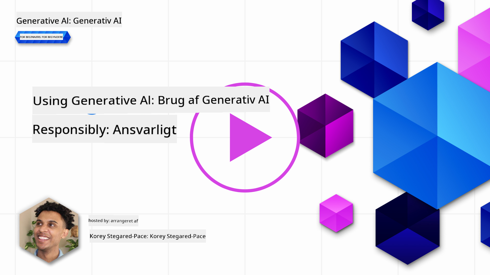
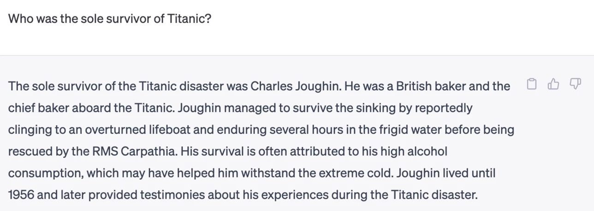
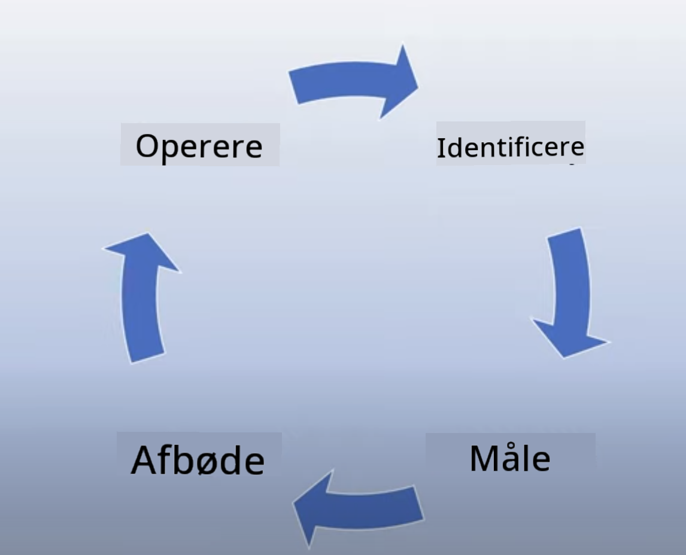
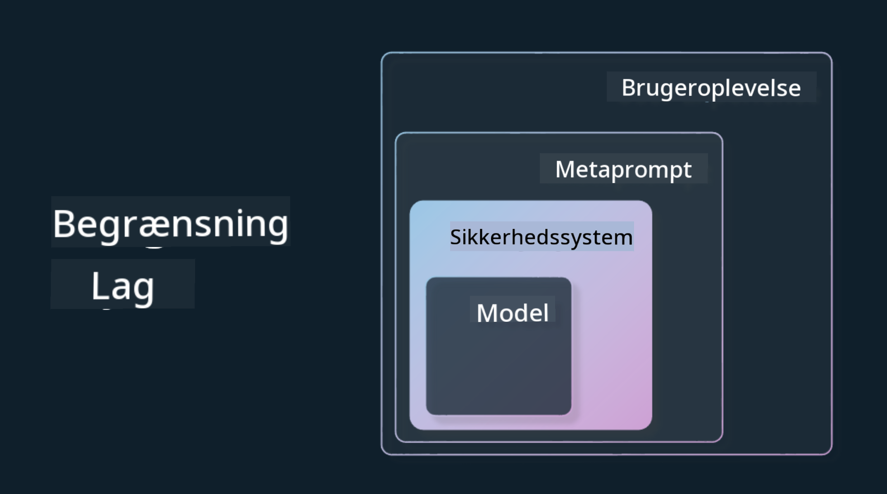

<!--
CO_OP_TRANSLATOR_METADATA:
{
  "original_hash": "13084c6321a2092841b9a081b29497ba",
  "translation_date": "2025-06-25T11:25:05+00:00",
  "source_file": "03-using-generative-ai-responsibly/README.md",
  "language_code": "da"
}
-->
# Ansvarlig brug af Generativ AI

> _Klik på billedet ovenfor for at se videoen af denne lektion_

Det er nemt at blive fascineret af AI og især generativ AI, men du skal overveje, hvordan du vil bruge det ansvarligt. Du skal tænke på ting som, hvordan man sikrer, at outputtet er retfærdigt, ikke-skadeligt og mere. Dette kapitel har til formål at give dig den nævnte kontekst, hvad du skal overveje, og hvordan du kan tage aktive skridt for at forbedre din AI-brug.

## Introduktion

Denne lektion vil dække:

- Hvorfor du bør prioritere Ansvarlig AI, når du bygger Generativ AI-applikationer.
- Kerneprincipperne for Ansvarlig AI og hvordan de relaterer til Generativ AI.
- Hvordan man omsætter disse principper for Ansvarlig AI til praksis gennem strategi og værktøjer.

## Læringsmål

Efter at have gennemført denne lektion vil du vide:

- Vigtigheden af Ansvarlig AI, når du bygger Generativ AI-applikationer.
- Hvornår man skal tænke og anvende kerneprincipperne for Ansvarlig AI, når man bygger Generativ AI-applikationer.
- Hvilke værktøjer og strategier der er tilgængelige for dig til at omsætte konceptet Ansvarlig AI til praksis.

## Ansvarlige AI-principper

Spændingen ved Generativ AI har aldrig været større. Denne spænding har bragt mange nye udviklere, opmærksomhed og finansiering til dette område. Mens dette er meget positivt for alle, der ønsker at bygge produkter og virksomheder ved hjælp af Generativ AI, er det også vigtigt, at vi går ansvarligt frem.

Gennem hele dette kursus fokuserer vi på at bygge vores startup og vores AI-uddannelsesprodukt. Vi vil bruge principperne for Ansvarlig AI: Retfærdighed, Inklusion, Pålidelighed/Sikkerhed, Sikkerhed & Privatliv, Gennemsigtighed og Ansvarlighed. Med disse principper vil vi udforske, hvordan de relaterer til vores brug af Generativ AI i vores produkter.

## Hvorfor bør du prioritere Ansvarlig AI

Når du bygger et produkt, fører en menneskecentreret tilgang ved at have brugerens bedste interesse i tankerne til de bedste resultater.

Det unikke ved Generativ AI er dets evne til at skabe nyttige svar, information, vejledning og indhold for brugere. Dette kan gøres uden mange manuelle trin, hvilket kan føre til meget imponerende resultater. Uden ordentlig planlægning og strategier kan det desværre også føre til nogle skadelige resultater for dine brugere, dit produkt og samfundet som helhed.

Lad os se på nogle (men ikke alle) af disse potentielt skadelige resultater:

### Hallucinationer

Hallucinationer er et udtryk, der bruges til at beskrive, når en LLM producerer indhold, der enten er fuldstændig meningsløst eller noget, vi ved er faktuelt forkert baseret på andre informationskilder.

Lad os tage for eksempel, at vi bygger en funktion til vores startup, der tillader studerende at stille historiske spørgsmål til en model. En studerende stiller spørgsmålet `Who was the sole survivor of Titanic?`

Modellen producerer et svar som det nedenfor:

> _(Kilde: [Flying bisons](https://flyingbisons.com?WT.mc_id=academic-105485-koreyst))_

Dette er et meget selvsikkert og grundigt svar. Desværre er det forkert. Selv med en minimal mængde research ville man opdage, at der var mere end én overlevende fra Titanic-katastrofen. For en studerende, der lige er begyndt at undersøge dette emne, kan dette svar være overbevisende nok til ikke at blive betvivlet og behandlet som en kendsgerning. Konsekvenserne af dette kan føre til, at AI-systemet bliver upålideligt og påvirker vores startups omdømme negativt.

Med hver iteration af en given LLM har vi set forbedringer i ydeevne omkring minimering af hallucinationer. Selv med denne forbedring skal vi som applikationsbyggere og brugere stadig være opmærksomme på disse begrænsninger.

### Skadeligt indhold

Vi dækkede i det tidligere afsnit, når en LLM producerer forkerte eller meningsløse svar. En anden risiko, vi skal være opmærksomme på, er, når en model svarer med skadeligt indhold.

Skadeligt indhold kan defineres som:

- At give instruktioner eller opmuntre til selvskade eller skade på bestemte grupper.
- Hadefuldt eller nedværdigende indhold.
- Vejledning i planlægning af enhver form for angreb eller voldelige handlinger.
- At give instruktioner om, hvordan man finder ulovligt indhold eller begår ulovlige handlinger.
- Visning af seksuelt eksplicit indhold.

For vores startup ønsker vi at sikre, at vi har de rigtige værktøjer og strategier på plads for at forhindre, at denne type indhold bliver set af studerende.

### Manglende retfærdighed

Retfærdighed defineres som “at sikre, at et AI-system er fri for bias og diskrimination, og at de behandler alle retfærdigt og lige.” I Generativ AI-verdenen ønsker vi at sikre, at ekskluderende verdenssyn af marginaliserede grupper ikke forstærkes af modellens output.

Disse typer output er ikke kun destruktive for at bygge positive produktopgaver for vores brugere, men de forårsager også yderligere samfundsskade. Som applikationsbyggere bør vi altid have en bred og mangfoldig brugerbase i tankerne, når vi bygger løsninger med Generativ AI.

## Hvordan man bruger Generativ AI ansvarligt

Nu hvor vi har identificeret vigtigheden af Ansvarlig Generativ AI, lad os se på 4 trin, vi kan tage for at bygge vores AI-løsninger ansvarligt:

### Mål potentielle skader

I softwaretest tester vi de forventede handlinger fra en bruger på en applikation. På samme måde er det en god måde at måle potentiel skade ved at teste et mangfoldigt sæt af prompts, som brugere sandsynligvis vil bruge.

Da vores startup bygger et uddannelsesprodukt, ville det være godt at forberede en liste over uddannelsesrelaterede prompts. Dette kunne være for at dække et bestemt emne, historiske fakta og prompts om studielivet.

### Afbød potentielle skader

Det er nu tid til at finde måder, hvorpå vi kan forhindre eller begrænse den potentielle skade forårsaget af modellen og dens svar. Vi kan se på dette i 4 forskellige lag:

- **Model**. Vælg den rigtige model til den rigtige brugssag. Større og mere komplekse modeller som GPT-4 kan forårsage en større risiko for skadeligt indhold, når de anvendes til mindre og mere specifikke brugssager. Brug af dine træningsdata til finjustering reducerer også risikoen for skadeligt indhold.

- **Sikkerhedssystem**. Et sikkerhedssystem er et sæt værktøjer og konfigurationer på platformen, der betjener modellen, som hjælper med at afbøde skade. Et eksempel på dette er indholdsfiltreringssystemet på Azure OpenAI-tjenesten. Systemer bør også opdage jailbreak-angreb og uønsket aktivitet som forespørgsler fra bots.

- **Metaprompt**. Metaprompts og grounding er måder, vi kan dirigere eller begrænse modellen baseret på bestemte adfærd og information. Dette kunne være ved at bruge systeminput til at definere bestemte grænser for modellen. Derudover give output, der er mere relevante for systemets omfang eller domæne.

Det kan også være ved at bruge teknikker som Retrieval Augmented Generation (RAG) for at få modellen til kun at hente information fra et udvalg af betroede kilder. Der er en lektion senere i dette kursus om [at bygge søgeapplikationer](../08-building-search-applications/README.md?WT.mc_id=academic-105485-koreyst)

- **Brugeroplevelse**. Det sidste lag er, hvor brugeren interagerer direkte med modellen gennem vores applikationsgrænseflade på en eller anden måde. På denne måde kan vi designe UI/UX til at begrænse brugeren på de typer input, de kan sende til modellen, samt tekst eller billeder, der vises til brugeren. Når vi implementerer AI-applikationen, skal vi også være gennemsigtige omkring, hvad vores Generative AI-applikation kan og ikke kan gøre.

Vi har en hel lektion dedikeret til [Designing UX for AI Applications](../12-designing-ux-for-ai-applications/README.md?WT.mc_id=academic-105485-koreyst)

- **Evaluer model**. At arbejde med LLM'er kan være udfordrende, fordi vi ikke altid har kontrol over de data, modellen blev trænet på. Uanset hvad, bør vi altid evaluere modellens ydeevne og output. Det er stadig vigtigt at måle modellens nøjagtighed, lighed, jordnærhed og relevans af outputtet. Dette hjælper med at give gennemsigtighed og tillid til interessenter og brugere.

### Drift af en ansvarlig Generativ AI-løsning

At opbygge en operationel praksis omkring dine AI-applikationer er den sidste fase. Dette inkluderer samarbejde med andre dele af vores startup som Legal og Security for at sikre, at vi overholder alle regulatoriske politikker. Før lanceringen vil vi også bygge planer omkring levering, håndtering af hændelser og rollback for at forhindre enhver skade på vores brugere fra at vokse.

## Værktøjer

Mens arbejdet med at udvikle Ansvarlige AI-løsninger kan virke som meget, er det et arbejde, der er værd at gøre. Efterhånden som området Generativ AI vokser, vil flere værktøjer til at hjælpe udviklere med effektivt at integrere ansvar i deres arbejdsprocesser modnes. For eksempel kan [Azure AI Content Safety](https://learn.microsoft.com/azure/ai-services/content-safety/overview?WT.mc_id=academic-105485-koreyst) hjælpe med at opdage skadeligt indhold og billeder via en API-forespørgsel.

## Videnscheck

Hvad er nogle ting, du skal tage dig af for at sikre ansvarlig AI-brug?

1. At svaret er korrekt.
2. Skadelig brug, at AI ikke bruges til kriminelle formål.
3. Sikre, at AI er fri for bias og diskrimination.

A: 2 og 3 er korrekte. Ansvarlig AI hjælper dig med at overveje, hvordan du kan afbøde skadelige virkninger og bias og mere.

## 🚀 Udfordring

Læs op på [Azure AI Content Safety](https://learn.microsoft.com/azure/ai-services/content-safety/overview?WT.mc_id=academic-105485-koreyst) og se, hvad du kan anvende til din brug.

## Godt arbejde, fortsæt din læring

Efter at have gennemført denne lektion, tjek vores [Generative AI Learning collection](https://aka.ms/genai-collection?WT.mc_id=academic-105485-koreyst) for at fortsætte med at opgradere din viden om Generativ AI!

Gå videre til Lektion 4, hvor vi vil se på [Prompt Engineering Fundamentals](../04-prompt-engineering-fundamentals/README.md?WT.mc_id=academic-105485-koreyst)!

**Ansvarsfraskrivelse**:  
Dette dokument er blevet oversat ved hjælp af AI-oversættelsestjenesten [Co-op Translator](https://github.com/Azure/co-op-translator). Selvom vi bestræber os på nøjagtighed, skal du være opmærksom på, at automatiserede oversættelser kan indeholde fejl eller unøjagtigheder. Det originale dokument på dets oprindelige sprog bør betragtes som den autoritative kilde. For kritisk information anbefales professionel menneskelig oversættelse. Vi er ikke ansvarlige for eventuelle misforståelser eller fejltolkninger, der måtte opstå ved brugen af denne oversættelse.