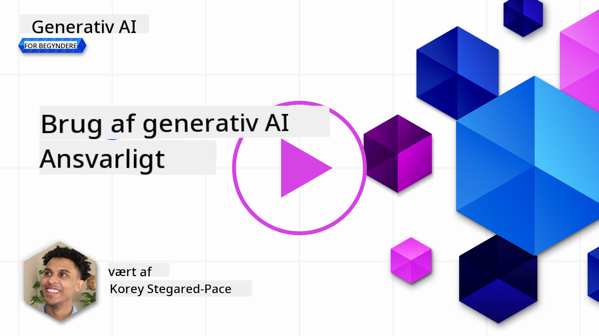
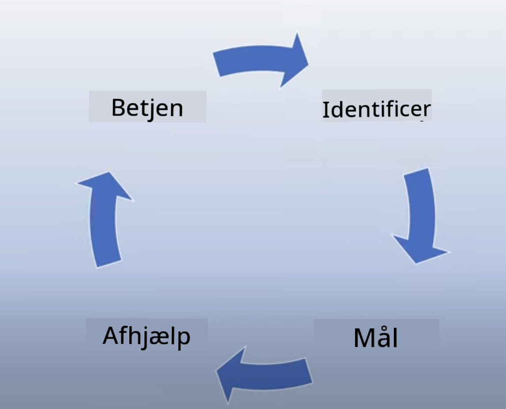
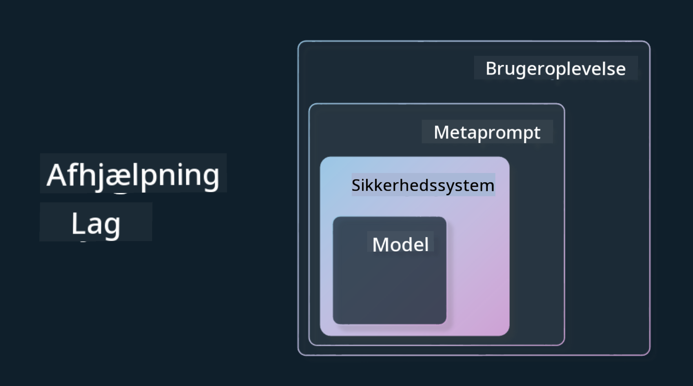

<!--
CO_OP_TRANSLATOR_METADATA:
{
  "original_hash": "4d57fad773cbeb69c5dd62e65c34200d",
  "translation_date": "2025-10-17T19:10:06+00:00",
  "source_file": "03-using-generative-ai-responsibly/README.md",
  "language_code": "da"
}
-->
# Brug af Generativ AI Ansvarligt

> _Klik på billedet ovenfor for at se videoen til denne lektion_

Det er nemt at blive fascineret af AI og især generativ AI, men det er vigtigt at overveje, hvordan man bruger det ansvarligt. Du skal tænke over, hvordan du sikrer, at output er retfærdigt, ikke skadeligt og mere. Dette kapitel har til formål at give dig den nævnte kontekst, hvad du skal overveje, og hvordan du kan tage aktive skridt for at forbedre din brug af AI.

## Introduktion

Denne lektion vil dække:

- Hvorfor du bør prioritere Ansvarlig AI, når du bygger applikationer med Generativ AI.
- Kerneprincipperne for Ansvarlig AI og hvordan de relaterer sig til Generativ AI.
- Hvordan du kan omsætte disse principper for Ansvarlig AI til praksis gennem strategier og værktøjer.

## Læringsmål

Efter at have gennemført denne lektion vil du vide:

- Vigtigheden af Ansvarlig AI, når du bygger applikationer med Generativ AI.
- Hvornår du skal tænke på og anvende kerneprincipperne for Ansvarlig AI, når du bygger applikationer med Generativ AI.
- Hvilke værktøjer og strategier der er tilgængelige for dig til at omsætte konceptet Ansvarlig AI til praksis.

## Principper for Ansvarlig AI

Interessen for Generativ AI har aldrig været større. Denne interesse har bragt mange nye udviklere, opmærksomhed og finansiering til dette område. Selvom dette er meget positivt for alle, der ønsker at bygge produkter og virksomheder med Generativ AI, er det også vigtigt, at vi går frem med ansvarlighed.

I hele dette kursus fokuserer vi på at bygge vores startup og vores AI-uddannelsesprodukt. Vi vil bruge principperne for Ansvarlig AI: Retfærdighed, Inklusion, Pålidelighed/Sikkerhed, Sikkerhed & Privatliv, Transparens og Ansvarlighed. Med disse principper vil vi undersøge, hvordan de relaterer sig til vores brug af Generativ AI i vores produkter.

## Hvorfor skal du prioritere Ansvarlig AI

Når du bygger et produkt, fører en menneskecentreret tilgang, hvor du har brugerens bedste interesse i tankerne, til de bedste resultater.

Det unikke ved Generativ AI er dens evne til at skabe nyttige svar, information, vejledning og indhold til brugerne. Dette kan gøres uden mange manuelle trin, hvilket kan føre til meget imponerende resultater. Uden ordentlig planlægning og strategier kan det desværre også føre til nogle skadelige resultater for dine brugere, dit produkt og samfundet som helhed.

Lad os se på nogle (men ikke alle) af disse potentielt skadelige resultater:

### Hallucinationer

Hallucinationer er et udtryk, der bruges til at beskrive, når en LLM producerer indhold, der enten er fuldstændig meningsløst eller noget, vi ved er faktuelt forkert baseret på andre informationskilder.

Lad os for eksempel sige, at vi bygger en funktion til vores startup, der giver studerende mulighed for at stille historiske spørgsmål til en model. En studerende spørger: `Hvem var den eneste overlevende fra Titanic?`

Modellen producerer et svar som det nedenfor:

> _(Kilde: [Flying bisons](https://flyingbisons.com?WT.mc_id=academic-105485-koreyst))_

Dette er et meget selvsikkert og grundigt svar. Desværre er det forkert. Selv med en minimal mængde research ville man opdage, at der var mere end én overlevende fra Titanic-katastrofen. For en studerende, der lige er begyndt at undersøge dette emne, kan dette svar være overbevisende nok til ikke at blive stillet spørgsmålstegn ved og behandlet som fakta. Konsekvenserne af dette kan føre til, at AI-systemet bliver upålideligt og negativt påvirker vores startups omdømme.

Med hver iteration af en given LLM har vi set forbedringer i ydeevnen omkring minimering af hallucinationer. Selv med denne forbedring skal vi som applikationsbyggere og brugere stadig være opmærksomme på disse begrænsninger.

### Skadeligt indhold

Vi dækkede i det tidligere afsnit, når en LLM producerer forkerte eller meningsløse svar. En anden risiko, vi skal være opmærksomme på, er, når en model svarer med skadeligt indhold.

Skadeligt indhold kan defineres som:

- At give instruktioner eller opmuntre til selvskade eller skade på visse grupper.
- Hadefuldt eller nedværdigende indhold.
- At vejlede planlægning af enhver form for angreb eller voldelige handlinger.
- At give instruktioner om, hvordan man finder ulovligt indhold eller begår ulovlige handlinger.
- At vise seksuelt eksplicit indhold.

For vores startup vil vi sikre, at vi har de rette værktøjer og strategier på plads for at forhindre, at denne type indhold bliver vist til studerende.

### Manglende retfærdighed

Retfærdighed defineres som "at sikre, at et AI-system er fri for bias og diskrimination, og at det behandler alle retfærdigt og lige." I verden af Generativ AI ønsker vi at sikre, at ekskluderende verdenssyn for marginaliserede grupper ikke forstærkes af modellens output.

Denne type output er ikke kun destruktiv for at bygge positive produktoplevelser for vores brugere, men de forårsager også yderligere skade på samfundet. Som applikationsbyggere bør vi altid have en bred og mangfoldig brugerbase i tankerne, når vi bygger løsninger med Generativ AI.

## Hvordan man bruger Generativ AI Ansvarligt

Nu hvor vi har identificeret vigtigheden af Ansvarlig Generativ AI, lad os se på 4 trin, vi kan tage for at bygge vores AI-løsninger ansvarligt:

### Mål potentielle skader

I softwaretest tester vi de forventede handlinger fra en bruger på en applikation. På samme måde er det en god idé at teste et mangfoldigt sæt af prompts, som brugerne sandsynligvis vil bruge, for at måle potentielle skader.

Da vores startup bygger et uddannelsesprodukt, ville det være godt at forberede en liste over uddannelsesrelaterede prompts. Dette kunne dække et bestemt emne, historiske fakta og prompts om studieliv.

### Begræns potentielle skader

Det er nu tid til at finde måder, hvor vi kan forhindre eller begrænse den potentielle skade forårsaget af modellen og dens svar. Vi kan se på dette i 4 forskellige lag:

- **Model**. Vælg den rigtige model til den rigtige brugssag. Større og mere komplekse modeller som GPT-4 kan medføre større risiko for skadeligt indhold, når de anvendes til mindre og mere specifikke brugssager. Brug af dine træningsdata til finjustering reducerer også risikoen for skadeligt indhold.

- **Sikkerhedssystem**. Et sikkerhedssystem er et sæt værktøjer og konfigurationer på platformen, der serverer modellen, som hjælper med at begrænse skade. Et eksempel på dette er indholdsfiltreringssystemet på Azure OpenAI-tjenesten. Systemer bør også opdage jailbreak-angreb og uønsket aktivitet som forespørgsler fra bots.

- **Metaprompt**. Metaprompts og grounding er måder, hvorpå vi kan dirigere eller begrænse modellen baseret på visse adfærdsmønstre og information. Dette kunne være brug af systeminput til at definere visse grænser for modellen. Derudover kan det give output, der er mere relevante for systemets omfang eller domæne.

Det kan også være brug af teknikker som Retrieval Augmented Generation (RAG) for at få modellen til kun at hente information fra et udvalg af betroede kilder. Der er en lektion senere i dette kursus om [at bygge søgeapplikationer](../08-building-search-applications/README.md?WT.mc_id=academic-105485-koreyst)

- **Brugeroplevelse**. Det sidste lag er, hvor brugeren interagerer direkte med modellen gennem vores applikations interface på en eller anden måde. På denne måde kan vi designe UI/UX til at begrænse brugeren i de typer input, de kan sende til modellen, samt tekst eller billeder, der vises til brugeren. Når vi implementerer AI-applikationen, skal vi også være transparente omkring, hvad vores Generative AI-applikation kan og ikke kan gøre.

Vi har en hel lektion dedikeret til [Design af UX for AI-applikationer](../12-designing-ux-for-ai-applications/README.md?WT.mc_id=academic-105485-koreyst)

- **Evaluér modellen**. Arbejde med LLM'er kan være udfordrende, fordi vi ikke altid har kontrol over de data, modellen blev trænet på. Uanset hvad, bør vi altid evaluere modellens ydeevne og output. Det er stadig vigtigt at måle modellens nøjagtighed, lighed, grounding og relevans af output. Dette hjælper med at give transparens og tillid til interessenter og brugere.

### Drift af en Ansvarlig Generativ AI-løsning

At bygge en operationel praksis omkring dine AI-applikationer er det sidste trin. Dette inkluderer samarbejde med andre dele af vores startup som Jura og Sikkerhed for at sikre, at vi overholder alle lovgivningsmæssige politikker. Før lancering vil vi også bygge planer omkring levering, håndtering af hændelser og rollback for at forhindre enhver skade på vores brugere i at vokse.

## Værktøjer

Selvom arbejdet med at udvikle Ansvarlige AI-løsninger kan virke som meget, er det arbejde, der er værd at gøre. Efterhånden som området for Generativ AI vokser, vil flere værktøjer, der hjælper udviklere med effektivt at integrere ansvarlighed i deres arbejdsgange, modnes. For eksempel kan [Azure AI Content Safety](https://learn.microsoft.com/azure/ai-services/content-safety/overview?WT.mc_id=academic-105485-koreyst) hjælpe med at opdage skadeligt indhold og billeder via en API-forespørgsel.

## Videnscheck

Hvad er nogle ting, du skal tage hensyn til for at sikre ansvarlig AI-brug?

1. At svaret er korrekt.
1. Skadelig brug, at AI ikke bruges til kriminelle formål.
1. At sikre, at AI er fri for bias og diskrimination.

A: 2 og 3 er korrekte. Ansvarlig AI hjælper dig med at overveje, hvordan du kan begrænse skadelige effekter og bias og mere.

## 🚀 Udfordring

Læs om [Azure AI Content Safety](https://learn.microsoft.com/azure/ai-services/content-safety/overview?WT.mc_id=academic-105485-koreyst) og se, hvad du kan adoptere til din brug.

## Godt arbejde, fortsæt din læring

Efter at have gennemført denne lektion, kan du tjekke vores [Generative AI Learning collection](https://aka.ms/genai-collection?WT.mc_id=academic-105485-koreyst) for at fortsætte med at opbygge din viden om Generativ AI!

Gå videre til Lektion 4, hvor vi vil se på [Grundlæggende om Prompt Engineering](../04-prompt-engineering-fundamentals/README.md?WT.mc_id=academic-105485-koreyst)!

---

**Ansvarsfraskrivelse**:  
Dette dokument er blevet oversat ved hjælp af AI-oversættelsestjenesten [Co-op Translator](https://github.com/Azure/co-op-translator). Selvom vi bestræber os på nøjagtighed, skal det bemærkes, at automatiserede oversættelser kan indeholde fejl eller unøjagtigheder. Det originale dokument på dets oprindelige sprog bør betragtes som den autoritative kilde. For kritisk information anbefales professionel menneskelig oversættelse. Vi er ikke ansvarlige for eventuelle misforståelser eller fejltolkninger, der opstår som følge af brugen af denne oversættelse.