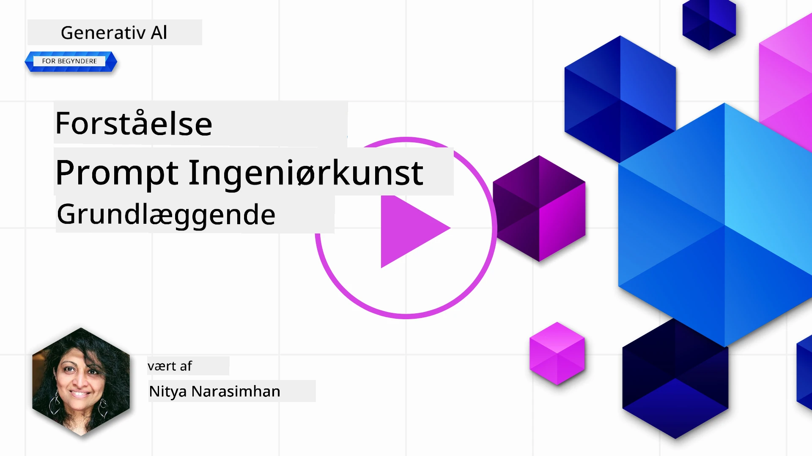
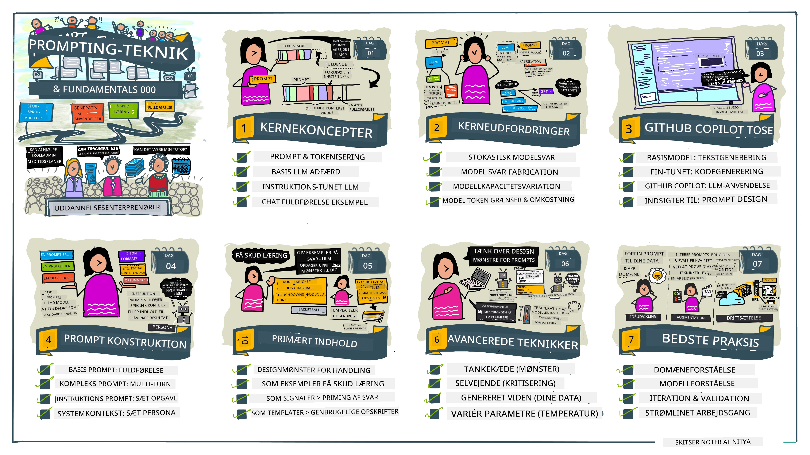
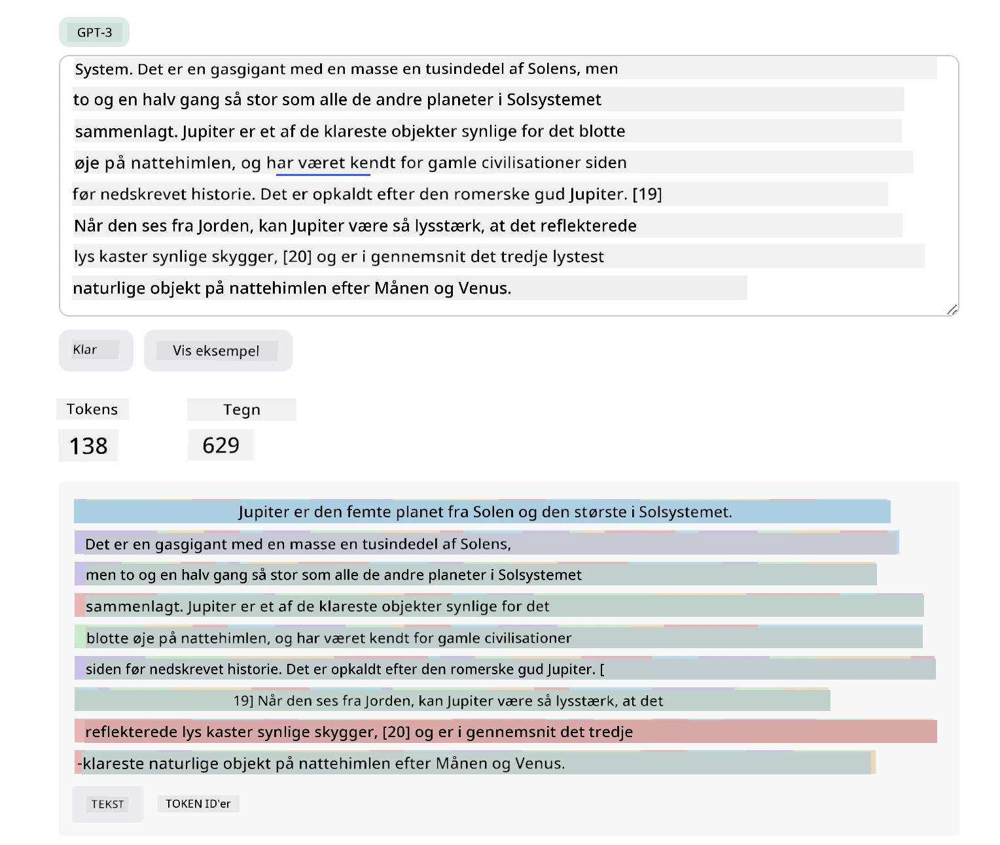
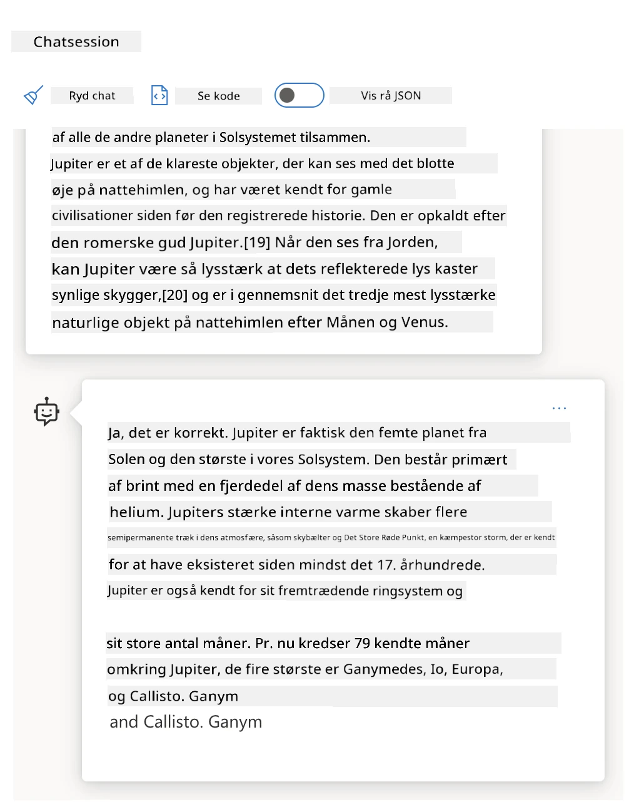
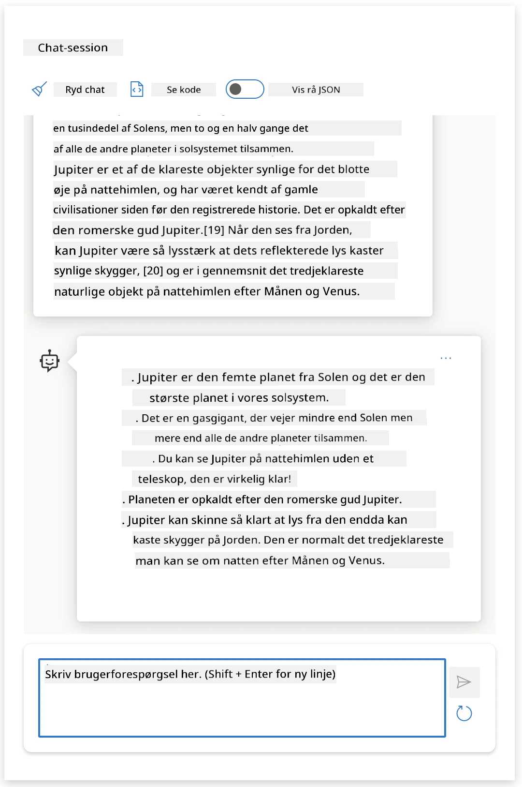
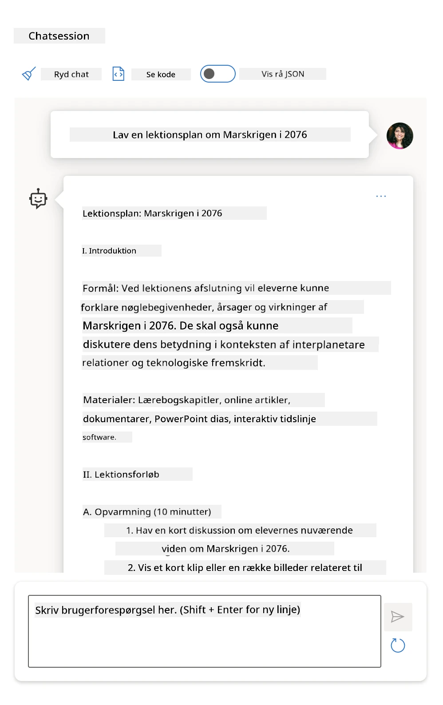
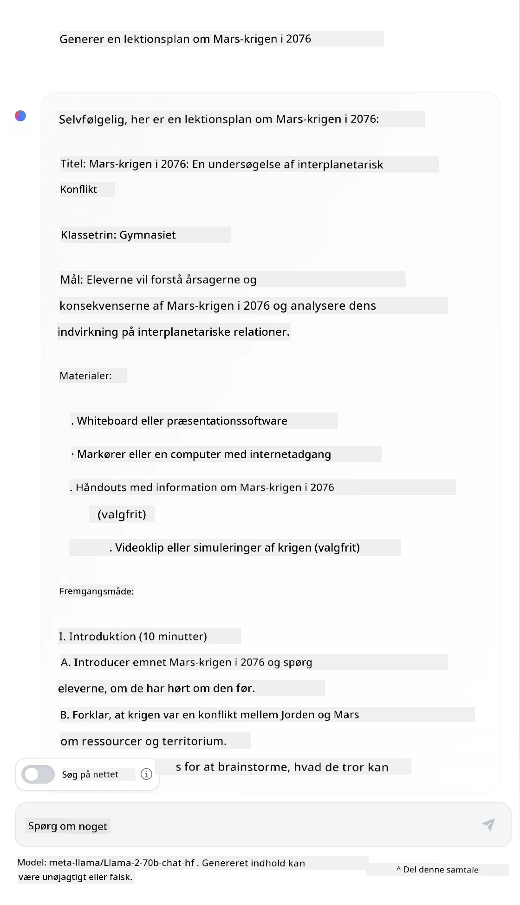

# Grundlæggende om Prompt Engineering

[](https://youtu.be/GElCu2kUlRs?si=qrXsBvXnCW12epb8)

## Introduktion
Dette modul dækker væsentlige begreber og teknikker til at skabe effektive prompts i generative AI-modeller. Måden, du skriver din prompt til en LLM, betyder også noget. En omhyggeligt udformet prompt kan opnå en bedre kvalitet af svar. Men hvad betyder begreber som _prompt_ og _prompt engineering_ egentlig? Og hvordan forbedrer jeg prompt _inputtet_, som jeg sender til LLM'en? Det er de spørgsmål, vi vil forsøge at besvare i dette kapitel og det næste.

_Generativ AI_ er i stand til at skabe nyt indhold (f.eks. tekst, billeder, lyd, kode osv.) som respons på brugerforespørgsler. Det opnås ved hjælp af _Large Language Models_ som OpenAIs GPT ("Generative Pre-trained Transformer") serie, der er trænet til brug af naturligt sprog og kode.

Brugere kan nu interagere med disse modeller ved brug af velkendte paradigmer som chat uden behov for teknisk ekspertise eller træning. Modellerne er _prompt-baserede_ - brugere sender en tekstinput (prompt) og modtager AI-svaret (completion). De kan derefter "chatte med AI'en" iterativt, i multi-turn samtaler, og forfine deres prompt indtil svaret matcher deres forventninger.

"Prompts" bliver nu det primære _programmeringsinterface_ for generative AI-apps, der fortæller modellerne, hvad de skal gøre, og påvirker kvaliteten af de returnerede svar. "Prompt Engineering" er et hastigt voksende studieområde, som fokuserer på _design og optimering_ af prompts for at levere konsistente og kvalitetsfulde svar i stor skala.

## Læringsmål

I denne lektion lærer vi, hvad Prompt Engineering er, hvorfor det er vigtigt, og hvordan vi kan skabe mere effektive prompts til en given model og et applikationsmål. Vi vil forstå kernebegreber og bedste praksis for prompt engineering - og lære om et interaktivt Jupyter Notebooks "sandbox"-miljø, hvor vi kan se disse begreber anvendt på virkelige eksempler.

Når vi har gennemført lektionen, vil vi kunne:

1. Forklare hvad prompt engineering er, og hvorfor det er vigtigt.
2. Beskrive komponenterne i en prompt og hvordan de bruges.
3. Lære bedste praksis og teknikker til prompt engineering.
4. Anvende de lærte teknikker på virkelige eksempler ved hjælp af en OpenAI-endpoint.

## Nøglebegreber

Prompt Engineering: Praksis med at designe og forfine input for at styre AI-modeller mod at producere ønskede output.
Tokenization: Processen med at konvertere tekst til mindre enheder, kaldet tokens, som en model kan forstå og behandle.
Instruction-Tuned LLMs: Large Language Models (LLMs), der er finjusteret med specifikke instruktioner for at forbedre deres svarpræcision og relevans.

## Læringssandbox

Prompt engineering er i øjeblikket mere en kunst end en videnskab. Den bedste måde at forbedre vores intuition for det er at _øve sig mere_ og anvende en trial-and-error tilgang, som kombinerer domænefaglig ekspertise med anbefalede teknikker og model-specifikke optimeringer.

Jupyter Notebook, der ledsager denne lektion, giver et _sandbox_-miljø, hvor du kan prøve det, du lærer – som du går frem, eller som en del af kodeudfordringen til sidst. For at gennemføre øvelserne skal du bruge:

1. **En Azure OpenAI API-nøgle** - serviceendpoint for en implementeret LLM.
2. **Et Python-runtime** - hvor Notebook kan køres.
3. **Lokale miljøvariabler** - _fuldfør [SETUP](./../00-course-setup/02-setup-local.md?WT.mc_id=academic-105485-koreyst) trin nu for at være klar_.

Notebooken kommer med _starter_ øvelser - men du opfordres til at tilføje dine egne _Markdown_ (beskrivelse) og _Code_ (prompt-forespørgsler) sektioner for at prøve flere eksempler eller idéer - og opbygge din intuition for promptdesign.

## Illustreret Guide

Vil du have det store overblik over, hvad denne lektion dækker, før du dykker ned? Kig på denne illustrerede guide, som giver dig en fornemmelse af hovedtemaerne og nøglepointerne, du kan tænke over i hver del. Lektionens køreplan tager dig fra forståelse af kernebegreber og udfordringer til at håndtere dem med relevante teknikker og bedste praksis inden for prompt engineering. Bemærk, at afsnittet "Avancerede teknikker" i denne guide refererer til indhold, der dækkes i det _næste_ kapitel i dette kursusforløb.



## Vores Startup

Lad os nu tale om, hvordan _dette emne_ relaterer til vores startup-mission om at [bringe AI-innovation til uddannelse](https://educationblog.microsoft.com/2023/06/collaborating-to-bring-ai-innovation-to-education?WT.mc_id=academic-105485-koreyst). Vi ønsker at bygge AI-drevne applikationer til _personaliseret læring_ - så lad os tænke over, hvordan forskellige brugere af vores applikation kan "designe" prompts:

- **Administratorer** kan bede AI'en om at _analysere læseplansdata for at identificere mangler i dækningen_. AI kan opsummere resultater eller visualisere dem med kode.
- **Undervisere** kan bede AI'en om at _generere en lektionsplan for et målrettet publikum og emne_. AI kan bygge den personlige plan i et specificeret format.
- **Studerende** kan bede AI'en om at _vejlede dem i et svært fag_. AI kan nu guide studerende med lektioner, hints og eksempler tilpasset deres niveau.

Det er bare toppen af isbjerget. Kig på [Prompts For Education](https://github.com/microsoft/prompts-for-edu/tree/main?WT.mc_id=academic-105485-koreyst) - et open source prompts-bibliotek kurateret af uddannelseseksperter - for at få en bredere fornemmelse af mulighederne! _Prøv at køre nogle af disse prompts i sandboxen eller brug OpenAI Playground for at se, hvad der sker!_

<!--
LESSON TEMPLATE:
This unit should cover core concept #1.
Reinforce the concept with examples and references.

CONCEPT #1:
Prompt Engineering.
Define it and explain why it is needed.
-->

## Hvad er Prompt Engineering?

Vi startede denne lektion med at definere **Prompt Engineering** som processen med at _designe og optimere_ tekstinputs (prompts) for at levere konsistente og kvalitetsfulde svar (completions) til et givent applikationsmål og model. Vi kan betragte dette som en 2-trins proces:

- _designe_ den oprindelige prompt til en given model og formål
- _forfine_ prompten iterativt for at forbedre svarenes kvalitet

Dette er nødvendigvis en trial-and-error proces, der kræver brugerintuition og indsats for at opnå optimale resultater. Så hvorfor er det vigtigt? For at besvare det spørgsmål må vi først forstå tre begreber:

- _Tokenization_ = hvordan modellen "ser" prompten
- _Base LLMs_ = hvordan grundmodellen "behandler" en prompt
- _Instruction-Tuned LLMs_ = hvordan modellen nu kan se "opgaver"

### Tokenization

En LLM ser prompts som en _sekvens af tokens_, hvor forskellige modeller (eller versioner af en model) kan tokenisere den samme prompt på forskellige måder. Da LLM'er trænes på tokens (og ikke på rå tekst), har måden prompts tokeniseres på direkte indflydelse på kvaliteten af det genererede svar.

For at få en intuition for, hvordan tokenization fungerer, kan du prøve værktøjer som [OpenAI Tokenizer](https://platform.openai.com/tokenizer?WT.mc_id=academic-105485-koreyst) vist nedenfor. Kopiér din prompt ind – og se, hvordan den bliver omdannet til tokens, mens du lægger mærke til, hvordan mellemrum og tegnsætning håndteres. Bemærk at dette eksempel viser en ældre LLM (GPT-3) – så forsøg med en nyere model kan give et andet resultat.



### Begreb: Foundation Models

Når en prompt er tokeniseret, er hovedfunktionen for ["Base LLM"](https://blog.gopenai.com/an-introduction-to-base-and-instruction-tuned-large-language-models-8de102c785a6?WT.mc_id=academic-105485-koreyst) (eller foundation-model) at forudsige token i den sekvens. Da LLM'er er trænet på massive tekstdatasæt, har de en god forståelse af de statistiske relationer mellem tokens og kan lave denne forudsigelse med nogenlunde sikkerhed. Bemærk, at de ikke forstår _betydningen_ af ordene i prompten eller token; de ser bare et mønster, de kan "fuldføre" med deres næste forudsigelse. De kan fortsætte med at forudsige sekvensen, indtil den bliver afbrudt af brugerintervention eller en forudfastlagt betingelse.

Vil du se, hvordan promptbaseret completion fungerer? Indtast ovenstående prompt i Azure OpenAI Studio [_Chat Playground_](https://oai.azure.com/playground?WT.mc_id=academic-105485-koreyst) med standardindstillingerne. Systemet er konfigureret til at behandle prompts som forespørgsler om information – så du bør se et svar, der opfylder denne kontekst.

Men hvad hvis brugeren ville se noget specifikt, som opfylder et kriterium eller en opgave? Her kommer _instruction-tuned_ LLM'er ind i billedet.



### Begreb: Instruction Tuned LLMs

En [Instruction Tuned LLM](https://blog.gopenai.com/an-introduction-to-base-and-instruction-tuned-large-language-models-8de102c785a6?WT.mc_id=academic-105485-koreyst) starter med foundation-modellen og finjusterer den med eksempler eller input/output par (f.eks. multi-turn "messages"), som kan indeholde klare instruktioner – og AI’ens svar forsøger at følge denne instruktion.

Dette benytter teknikker som Reinforcement Learning med Human Feedback (RLHF), som kan træne modellen til at _følge instruktioner_ og _lære af feedback_, så den producerer svar, der er bedre tilpasset praktiske anvendelser og mere relevante for brugerens mål.

Lad os prøve det – besøg prompten ovenfor igen, men ændr nu _systemmeddelelsen_ til at give denne instruktion som kontekst:

> _Opsummer det indhold, du får, for en elev i 2. klasse. Hold resultatet til ét afsnit med 3-5 punktopstillinger._

Kan du se, hvordan resultatet nu er tilpasset det ønskede mål og format? En underviser kan nu direkte bruge dette svar i deres slides til den klasse.



## Hvorfor har vi brug for Prompt Engineering?

Nu hvor vi ved, hvordan prompts behandles af LLM'er, lad os tale om _hvorfor_ vi har brug for prompt engineering. Svaret ligger i, at nuværende LLM'er udgør en række udfordringer, som gør _pålidelige og konsistente svar_ vanskeligere at opnå uden indsats i promptkonstruktion og optimering. For eksempel:

1. **Modelsvar er stokastiske.** Den _samme prompt_ vil sandsynligvis producere forskellige svar med forskellige modeller eller modelversioner. Og den kan endda producere forskellige resultater med den _samme model_ på forskellige tidspunkter. _Prompt engineering teknikker kan hjælpe os med at minimere disse variationer ved at give bedre sikkerhed_.

1. **Modeller kan fabrikere svar.** Modeller er for-trænet med _store men begrænsede_ datasæt, hvilket betyder, at de mangler viden om koncepter uden for dette træningsområde. Som følge heraf kan de producere svar, der er upræcise, opfundne eller direkte i modstrid med kendte fakta. _Prompt engineering teknikker hjælper brugere med at identificere og afbøde sådanne fabrikationer, f.eks. ved at bede AI’en om kilder eller ræsonnement_.

1. **Modellers evner vil variere.** Nyere modeller eller modelgenerationer vil have rigere evner, men medbringe unikke særheder og kompromiser i omkostning og kompleksitet. _Prompt engineering kan hjælpe os med at udvikle bedste praksis og arbejdsgange, der abstraherer forskelle og tilpasses model-specifikke krav på skalerbare, problemfri måder_.

Lad os se det i praksis i OpenAI eller Azure OpenAI Playground:

- Brug samme prompt med forskellige LLM-udrulninger (f.eks. OpenAI, Azure OpenAI, Hugging Face) – så du variationerne?
- Brug den samme prompt gentagne gange med den _samme_ LLM-udrulning (f.eks. Azure OpenAI playground) – hvordan adskilte disse variationer sig?

### Eksempel på fabrikationer

I dette kursus bruger vi begrebet **"fabrikation"** til at referere til fænomenet, hvor LLM'er nogle gange genererer faktuelt ukorrekt information på grund af begrænsninger i deres træning eller andre forhold. Du kan også have hørt det omtalt som _"hallucinationer"_ i populære artikler eller forskningspapirer. Vi anbefaler dog kraftigt at bruge _"fabrikation"_ som termen, så vi ikke utilsigtet antropomorfiserer adfærden ved at tilskrive en menneskelig egenskab til en maskinbaseret handling. Dette styrker også [Ansvarlig AI-retningslinjer](https://www.microsoft.com/ai/responsible-ai?WT.mc_id=academic-105485-koreyst) fra et terminologisk perspektiv ved at fjerne udtryk, der i nogle kontekster også kan opfattes som stødende eller ikke-inkluderende.

Vil du have en fornemmelse af, hvordan fabrikationer fungerer? Tænk på en prompt, der instruerer AI’en om at generere indhold om et ikke-eksisterende emne (for at sikre, at det ikke findes i træningsdatasættet). For eksempel prøvede jeg denne prompt:

> **Prompt:** generer en lektionsplan om Den Marsianske Krig i 2076.
Et websøgningsresultat viste mig, at der fandtes fiktive fortællinger (f.eks. tv-serier eller bøger) om Martianske krige – men ingen i 2076. Sund fornuft fortæller os også, at 2076 er _i fremtiden_ og derfor ikke kan forbindes med en reel begivenhed.

Så hvad sker der, når vi kører denne prompt med forskellige LLM-udbydere?

> **Svar 1**: OpenAI Playground (GPT-35)


> **Svar 2**: Azure OpenAI Playground (GPT-35)



> **Svar 3**: : Hugging Face Chat Playground (LLama-2)



Som forventet producerer hver model (eller modelversion) lidt forskellige svar takket være stokastisk adfærd og variationer i modelkapacitet. For eksempel retter en model sig mod et 8. klasses publikum, mens en anden antager en gymnasieelev. Men alle tre modeller genererede svar, der kunne overbevise en uinformeret bruger om, at begivenheden var reel.

Prompt engineering-teknikker som _metaprompting_ og _temperaturkonfiguration_ kan til en vis grad reducere model-fabricationer. Nye prompt engineering _arkitekturer_ inkorporerer også nye værktøjer og teknikker sømløst i prompt-flowet for at afbøde eller reducere nogle af disse effekter.

## Case Study: GitHub Copilot

Lad os afslutte denne sektion med at få en fornemmelse af, hvordan prompt engineering bruges i virkelige løsninger ved at se på en Case Study: [GitHub Copilot](https://github.com/features/copilot?WT.mc_id=academic-105485-koreyst).

GitHub Copilot er din "AI parprogrammer" – det omsætter tekstprompter til kodeforslag og er integreret i dit udviklingsmiljø (f.eks. Visual Studio Code) for en glidende brugeroplevelse. Som dokumenteret i nedenstående blogserie var den tidligste version baseret på OpenAI Codex-modellen – hvor ingeniørerne hurtigt indså behovet for at finjustere modellen og udvikle bedre prompt engineering-teknikker for at forbedre kodekvaliteten. I juli [debuterede de en forbedret AI-model, der går ud over Codex](https://github.blog/2023-07-28-smarter-more-efficient-coding-github-copilot-goes-beyond-codex-with-improved-ai-model/?WT.mc_id=academic-105485-koreyst) for endnu hurtigere forslag.

Læs indlæggene i rækkefølge for at følge deres læringsrejse.

- **Maj 2023** | [GitHub Copilot bliver bedre til at forstå din kode](https://github.blog/2023-05-17-how-github-copilot-is-getting-better-at-understanding-your-code/?WT.mc_id=academic-105485-koreyst)
- **Maj 2023** | [Inside GitHub: Arbejde med LLM’erne bag GitHub Copilot](https://github.blog/2023-05-17-inside-github-working-with-the-llms-behind-github-copilot/?WT.mc_id=academic-105485-koreyst).
- **Jun 2023** | [Hvordan man skriver bedre prompts til GitHub Copilot](https://github.blog/2023-06-20-how-to-write-better-prompts-for-github-copilot/?WT.mc_id=academic-105485-koreyst).
- **Jul 2023** | [.. GitHub Copilot går ud over Codex med forbedret AI-model](https://github.blog/2023-07-28-smarter-more-efficient-coding-github-copilot-goes-beyond-codex-with-improved-ai-model/?WT.mc_id=academic-105485-koreyst)
- **Jul 2023** | [En udviklers guide til prompt engineering og LLM’er](https://github.blog/2023-07-17-prompt-engineering-guide-generative-ai-llms/?WT.mc_id=academic-105485-koreyst)
- **Sep 2023** | [Hvordan man bygger en virksomhedsløsning med LLM: Læringer fra GitHub Copilot](https://github.blog/2023-09-06-how-to-build-an-enterprise-llm-application-lessons-from-github-copilot/?WT.mc_id=academic-105485-koreyst)

Du kan også browse deres [Engineering blog](https://github.blog/category/engineering/?WT.mc_id=academic-105485-koreyst) for flere indlæg som [dette](https://github.blog/2023-09-27-how-i-used-github-copilot-chat-to-build-a-reactjs-gallery-prototype/?WT.mc_id=academic-105485-koreyst), der viser, hvordan disse modeller og teknikker _anvendes_ til at drive virkelige applikationer.

---

<!--
LESSON TEMPLATE:
This unit should cover core concept #2.
Reinforce the concept with examples and references.

CONCEPT #2:
Prompt Design.
Illustrated with examples.
-->

## Prompt Konstruktion

Vi har set, hvorfor prompt engineering er vigtigt – nu skal vi forstå, hvordan prompter _konstrueres_, så vi kan evaluere forskellige teknikker til mere effektiv promptdesign.

### Grundlæggende Prompt

Lad os starte med den grundlæggende prompt: en tekstinput, der sendes til modellen uden anden kontekst. Her er et eksempel – når vi sender de første få ord af USA’s nationalsang til OpenAI’s [Completion API](https://platform.openai.com/docs/api-reference/completions?WT.mc_id=academic-105485-koreyst), fuldfører den straks svaret med de næste linjer, hvilket illustrerer den grundlæggende forudsigelsesadfærd.

| Prompt (Input)     | Completion (Output)                                                                                                                        |
| :----------------- | :----------------------------------------------------------------------------------------------------------------------------------------- |
| Oh say can you see | Det lyder som om, du begynder teksten til "The Star-Spangled Banner," USA’s nationalsang. Hele teksten er ...                               |

### Komplekst Prompt

Lad os nu tilføje kontekst og instruktioner til denne grundlæggende prompt. [Chat Completion API’en](https://learn.microsoft.com/azure/ai-services/openai/how-to/chatgpt?WT.mc_id=academic-105485-koreyst) giver os mulighed for at konstruere en kompleks prompt som en samling af _beskeder_ med:

- Input/output-par, der afspejler _bruger_ input og _assistent_ respons.
- Systembesked, der sætter konteksten for assistentens adfærd eller personlighed.

Forespørgslen er nu i nedenstående form, hvor _tokeniseringen_ effektivt fanger relevant information fra kontekst og samtale. Nu kan ændring af systemkontexten være lige så indflydelsesrig på kvaliteten af svarene som de brugerinput, der gives.

```python
response = openai.chat.completions.create(
    model="gpt-3.5-turbo",
    messages=[
        {"role": "system", "content": "You are a helpful assistant."},
        {"role": "user", "content": "Who won the world series in 2020?"},
        {"role": "assistant", "content": "The Los Angeles Dodgers won the World Series in 2020."},
        {"role": "user", "content": "Where was it played?"}
    ]
)
```

### Instruktionsprompt

I ovenstående eksempler var brugerprompten en simpel tekstforespørgsel, der kunne tolkes som en anmodning om information. Med _instruktionsprompter_ kan vi bruge den tekst til at specificere en opgave mere detaljeret og give bedre vejledning til AI’en. Her er et eksempel:

| Prompt (Input)                                                                                                                                                                                                                         | Completion (Output)                                                                                                        | Instruktionstype    |
| :------------------------------------------------------------------------------------------------------------------------------------------------------------------------------------------------------------------------------------- | :------------------------------------------------------------------------------------------------------------------------- | :------------------ |
| Skriv en beskrivelse af den amerikanske borgerkrig                                                                                                                                                                                   | _returnerede et simpelt afsnit_                                                                                           | Simpel              |
| Skriv en beskrivelse af den amerikanske borgerkrig. Giv nøgle datoer og begivenheder og beskriv deres betydning                                                                                                                     | _returnerede et afsnit efterfulgt af en liste med nøglebegivenheders datoer og beskrivelser_                                | Komplekst           |
| Skriv en beskrivelse af den amerikanske borgerkrig i 1 afsnit. Giv 3 punktpunkter med nøgle datoer og deres betydning. Giv 3 flere punktpunkter med nøglehistoriske personer og deres bidrag. Returnér output som en JSON-fil          | _returnerer mere omfattende detaljer i en tekstboks, formatteret som JSON, som du kan kopiere og validere efter behov_       | Kompleks. Formateret.|

## Primært Indhold

I ovenstående eksempler var prompten stadig ret åben, hvilket lod LLM’en beslutte, hvilken del af dets forudtrænede datasæt der var relevant. Med designmønstret _primært indhold_ opdeles inputteksten i to dele:

- en instruktion (handling)
- relevant indhold (der påvirker handlingen)

Her er et eksempel, hvor instruktionen er at "opsummere dette i 2 sætninger".

| Prompt (Input)                                                                                                                                                                                                                                                                                                                                                                                                                                                                                                                                                                                                                                                                                      | Completion (Output)                                                                                                                                                                                                                                                                             |
| :-------------------------------------------------------------------------------------------------------------------------------------------------------------------------------------------------------------------------------------------------------------------------------------------------------------------------------------------------------------------------------------------------------------------------------------------------------------------------------------------------------------------------------------------------------------------------------------------------------------------------------------------------------------------------------------------------- | :---------------------------------------------------------------------------------------------------------------------------------------------------------------------------------------------------------------------------------------------------------------------------------------------- |
| Jupiter er den femte planet fra Solen og den største i Solsystemet. Det er en gasplanet med en masse på en tusindedel af Solens, men to og en halv gang så stor som alle de andre planeter i Solsystemet tilsammen. Jupiter er en af de klareste genstande, der er synlige med det blotte øje på nattehimlen, og er kendt af gamle civilisationer siden før historisk tid. Den er opkaldt efter den romerske gud Jupiter.[19] Når Jupiter ses fra Jorden, kan den være lysstærk nok til, at dens reflekterede lys kaster synlige skygger,[20] og er i gennemsnit det tredje klareste naturlige objekt på nattehimlen efter Månen og Venus. <br/> **Opsummer dette i 2 korte sætninger** | Jupiter, den femte planet fra Solen, er den største i Solsystemet og kendt for at være et af de klareste objekter på nattehimlen. Opkaldt efter den romerske gud Jupiter, er det en gasplanet, hvis masse er to og en halv gang så stor som alle de andre planeter i Solsystemet tilsammen. |

Segmentet for primært indhold kan bruges på forskellige måder for at skabe mere effektive instruktioner:

- **Eksempler** – i stedet for at fortælle modellen, hvad den skal gøre med en eksplicit instruktion, giver man den eksempler på, hvad der skal gøres, og lader den udlede mønsteret.
- **Tips** – føl instruktionen med et "tip", der forbereder completion’en og guider modellen mod mere relevante svar.
- **Skabeloner** – disse er gentagelige 'opskrifter' på prompts med pladsholdere (variabler), der kan tilpasses med data til specifikke brugsscenarier.

Lad os udforske disse i praksis.

### Brug af Eksempler

Dette er en tilgang, hvor du bruger det primære indhold til at "fodre modellen" med nogle eksempler på det ønskede output for en given instruktion og lader den udlede ønsket outputmønster. Afhængigt af antallet af eksempler kan vi have zero-shot prompting, one-shot prompting, few-shot prompting osv.

Prompten består nu af tre komponenter:

- En opgavebeskrivelse
- Nogle få eksempler på ønsket output
- Starten på et nyt eksempel (som bliver en implicit opgavebeskrivelse)

| Læringstype | Prompt (Input)                                                                                                                                        | Completion (Output)         |
| :----------- | :---------------------------------------------------------------------------------------------------------------------------------------------------- | :------------------------- |
| Zero-shot    | "The Sun is Shining". Oversæt til spansk                                                                                                            | "El Sol está brillando".   |
| One-shot     | "The Sun is Shining" => "El Sol está brillando". <br> "It's a Cold and Windy Day" =>                                                                | "Es un día frío y ventoso". |
| Few-shot     | Spilleren løb baserne => Baseball <br/> Spilleren slog en ace => Tennis <br/> Spilleren slog en sekser => Cricket <br/> Spilleren lavede en slam-dunk => | Basketball                 |
|             |                                                                                                                                                       |                            |

Bemærk, hvordan vi måtte give eksplicit instruktion ("Oversæt til spansk") i zero-shot prompting, men den udledes i one-shot prompt-eksemplet. Few-shot-eksemplet viser, hvordan flere eksempler tillader modeller at lave mere præcise slutninger uden ekstra instruktioner.

### Prompt Tips

En anden teknik til at bruge primært indhold er at give _tips_ i stedet for eksempler. I dette tilfælde giver vi modellen en skub i den rigtige retning ved _at starte den_ med et uddrag, der afspejler det ønskede svarformat. Modellen "tager tipset" og fortsætter i den stil.

| Antal Tips   | Prompt (Input)                                                                                                                                                                                                                                                                                                                                                                                                                                               | Completion (Output)                                                                                                                                                                                                                                                                                       |
| :----------- | :----------------------------------------------------------------------------------------------------------------------------------------------------------------------------------------------------------------------------------------------------------------------------------------------------------------------------------------------------------------------------------------------------------------------------------------------------------- | :-------------------------------------------------------------------------------------------------------------------------------------------------------------------------------------------------------------------------------------------------------------------------------------------------------- |
| 0            | Jupiter er den femte planet fra Solen og den største i Solsystemet. Det er en gasplanet med en masse på en tusindedel af Solens, men to og en halv gang så stor som alle de andre planeter i Solsystemet tilsammen. Jupiter er en af de klareste genstande, der er synlige med det blotte øje på nattehimlen, og er kendt af gamle civilisationer siden før historisk tid. <br/>**Opsummer dette**                                       | Jupiter er den største planet i vores Solsystem og den femte fra Solen. Det er en gasplanet med en masse på 1/1000 af Solens, men den er tungere end alle de andre planeter tilsammen. Gamle civilisationer har kendt Jupiter i lang tid, og den er let synlig på nattehimlen. |
| 1              | Jupiter er den femte planet fra Solen og den største i Solsystemet. Det er en gas-gigant med en masse, der er en tusindedel af Solens, men to og en halv gang så stor som alle de andre planeter i Solsystemet tilsammen. Jupiter er et af de mest lysstærke objekter synlige med det blotte øje på nattehimlen og har været kendt af gamle civilisationer siden før skriftlige optegnelser. <br/>**Opsummer dette** <br/> Det vi lærte er, at Jupiter | er den femte planet fra Solen og den største i Solsystemet. Det er en gas-gigant med en masse, der er en tusindedel af Solens, men to og en halv gang så stor som alle de andre planeter tilsammen. Den er let synlig med det blotte øje og har været kendt siden oldtiden.                        |
| 2              | Jupiter er den femte planet fra Solen og den største i Solsystemet. Det er en gas-gigant med en masse, der er en tusindedel af Solens, men to og en halv gang så stor som alle de andre planeter i Solsystemet tilsammen. Jupiter er et af de mest lysstærke objekter synlige med det blotte øje på nattehimlen og har været kendt af gamle civilisationer siden før skriftlige optegnelser. <br/>**Opsummer dette** <br/> Top 3 fakta vi lærte:         | 1. Jupiter er den femte planet fra Solen og den største i Solsystemet. <br/> 2. Det er en gas-gigant med en masse, der er en tusindedel af Solens...<br/> 3. Jupiter har været synlig med det blotte øje siden oldtiden ...                                                                       |
|                |                                                                                                                                                                                                                                                                                                                                                                                                                                                              |                                                                                                                                                                                                                                                                                                           |

### Prompt Skabeloner

En prompt-skabelon er en _foruddefineret opskrift på en prompt_, som kan gemmes og genbruges efter behov for at skabe mere konsistente brugeroplevelser i stor skala. I sin simpleste form er det blot en samling af prompt-eksempler som [dette fra OpenAI](https://platform.openai.com/examples?WT.mc_id=academic-105485-koreyst), der giver både de interaktive prompt-komponenter (bruger- og systembeskeder) og API-styrede anmodningsformater – for at støtte genbrug.

I en mere kompleks form som [dette eksempel fra LangChain](https://python.langchain.com/docs/concepts/prompt_templates/?WT.mc_id=academic-105485-koreyst) indeholder den _pladsholdere_, som kan erstattes med data fra forskellige kilder (brugers input, systemkontekst, eksterne datakilder osv.) for dynamisk at skabe en prompt. Det giver os mulighed for at oprette et bibliotek af genanvendelige prompts, der kan bruges til at skabe konsistente brugeroplevelser **programmatisk** i stor skala.

Endelig ligger den reelle værdi af skabeloner i evnen til at oprette og offentliggøre _prompt-biblioteker_ for vertikale anvendelsesområder – hvor prompt-skabelonen nu er _optimeret_ til at afspejle applikationsspecifik kontekst eller eksempler, der gør svarene mere relevante og præcise for den målrettede brugergruppe. [Prompts For Edu](https://github.com/microsoft/prompts-for-edu?WT.mc_id=academic-105485-koreyst) repositoriet er et godt eksempel på denne tilgang, der kuraterer et bibliotek af prompts til uddannelsesområdet med fokus på nøglemål som lektionsplanlægning, pensumdesign, elevvejledning osv.

## Understøttende Indhold

Hvis vi tænker på prompt-konstruktion som at have en instruktion (opgave) og et mål (primært indhold), så er _sekundært indhold_ som yderligere kontekst, vi giver for at **påvirke output på en eller anden måde**. Det kan være justeringsparametre, formateringsinstruktioner, emnetaksonomier osv., der kan hjælpe modellen med at _tilpasse_ sit svar, så det passer til de ønskede brugerformål eller forventninger.

For eksempel: Givet en kursuskatalog med omfattende metadata (navn, beskrivelse, niveau, metadata-tags, underviser osv.) på alle tilgængelige kurser i pensum:

- vi kan definere en instruktion til "at opsummere kursuskataloget for efterår 2023"
- vi kan bruge det primære indhold til at give nogle eksempler på ønsket output
- vi kan bruge det sekundære indhold til at identificere de 5 vigtigste "tags" af interesse.

Nu kan modellen give en opsummering i formatet vist ved eksemplerne – men hvis et resultat har flere tags, kan den prioritere de 5 tags, der blev identificeret i sekundært indhold.

---

<!--
LESSON TEMPLATE:
This unit should cover core concept #1.
Reinforce the concept with examples and references.

CONCEPT #3:
Prompt Engineering Techniques.
What are some basic techniques for prompt engineering?
Illustrate it with some exercises.
-->

## Bedste Fremgangsmåder for Prompting

Nu hvor vi ved, hvordan prompts kan _konstrueres_, kan vi begynde at tænke på, hvordan vi _designer_ dem, så de afspejler bedste praksis. Vi kan opdeles det i to dele – at have den rette _tankegang_ og anvende de rette _teknikker_.

### Prompt Engineering Tankegang

Prompt Engineering er en prøv-og-fejl proces, så hold tre overordnede vejledende faktorer i tankerne:

1. **Domæneforståelse er afgørende.** Svarets nøjagtighed og relevans afhænger af det _domæne_, hvor applikationen eller brugeren opererer. Brug din intuition og domæneekspertise til at **tilpasse teknikker** yderligere. Definer for eksempel _domænespecifikke personligheder_ i dine systemprompter, eller brug _domænespecifikke skabeloner_ i dine brugerprompter. Giv sekundært indhold, der afspejler domænespecifikke kontekster, eller brug _domænespecifikke hints og eksempler_ til at lede modellen mod kendte anvendelsesmønstre.

2. **Modelforståelse er afgørende.** Vi ved, at modeller er stokastiske af natur. Men modelimplementeringer kan også variere med hensyn til det træningsdatasæt, de bruger (forudtrænet viden), de kapabiliteter de tilbyder (fx via API eller SDK) og den type indhold, de er optimeret til (fx kode vs. billeder vs. tekst). Forstå styrker og begrænsninger af den model, du bruger, og brug den viden til at _prioritere opgaver_ eller opbygge _tilpassede skabeloner_, der er optimeret til modellens kapabiliteter.

3. **Iteration og validering er afgørende.** Modeller udvikler sig hurtigt, og det samme gør teknikker for prompt engineering. Som domæneekspert kan du have anden kontekst eller kriterier for _din_ specifikke applikation, som måske ikke gælder for det brede samfund. Brug prompt engineering-værktøjer og teknikker til at "jumpstarte" prompt-konstruktion, og iterer derefter og valider resultaterne med din egen intuition og domæneekspertise. Notér dine indsigter og opret en **vidensbase** (fx prompt-biblioteker), som andre kan bruge som nyt udgangspunkt for hurtigere iterationer fremover.

## Bedste Praksis

Lad os nu se på almindelige bedste praksisser, som anbefales af [OpenAI](https://help.openai.com/en/articles/6654000-best-practices-for-prompt-engineering-with-openai-api?WT.mc_id=academic-105485-koreyst) og [Azure OpenAI](https://learn.microsoft.com/azure/ai-services/openai/concepts/prompt-engineering#best-practices?WT.mc_id=academic-105485-koreyst).

| Hvad                              | Hvorfor                                                                                                                                                                                                                                              |
| :-------------------------------- | :--------------------------------------------------------------------------------------------------------------------------------------------------------------------------------------------------------------------------------------------------- |
| Evaluer de nyeste modeller.       | Nye modelgenerationer har sandsynligvis forbedrede funktioner og kvalitet – men kan også medføre højere omkostninger. Evaluer dem for effekt, og tag derefter beslutninger om migration.                                                             |
| Adskil instruktioner & kontekst   | Undersøg om din model/udbyder definerer _afgrænsere_ for at skelne instruktioner, primært og sekundært indhold tydeligere. Det kan hjælpe modeller med at tildele vægte mere korrekt til tokens.                                                    |
| Vær specifik og klar               | Giv flere detaljer om ønsket kontekst, resultat, længde, format, stil osv. Dette forbedrer både kvaliteten og konsistensen af svar. Indfang opskrifter i genanvendelige skabeloner.                                                                 |
| Vær beskrivende, brug eksempler   | Modeller responderer ofte bedre på en "vis og fortæl" tilgang. Start med en `zero-shot` tilgang, hvor du giver en instruktion (men ingen eksempler), og prøv derefter `few-shot` som en forfining, hvor du giver nogle eksempler på ønsket output. Brug analogier. |
| Brug hints til at starte svar     | Skub modellen mod et ønsket resultat ved at give nogle ledende ord eller sætninger, som den kan bruge som udgangspunkt for svaret.                                                                                                                |
| Gentag om nødvendigt              | Nogle gange skal du gentage dig overfor modellen. Giv instruktioner før og efter dit primære indhold, brug både instruktion og hint osv. Iterér og valider for at se, hvad der virker.                                                              |
| Rækkefølge betyder noget          | Den rækkefølge, du præsenterer information for modellen i, kan påvirke output, også i læringseksempler, på grund af nyhedsbias. Prøv forskellige muligheder for at se, hvad der virker bedst.                                                      |
| Giv modellen en "vej ud"           | Giv modellen et _fallback_-svar, som den kan give, hvis den ikke kan fuldføre opgaven af en eller anden grund. Det kan reducere risikoen for, at modeller genererer falske eller opdigtede svar.                                                     |
|                                   |                                                                                                                                                                                                                                                      |

Som med enhver bedste praksis, husk at _dine resultater kan variere_ afhængigt af model, opgave og domæne. Brug dette som udgangspunkt, og iterér for at finde ud af, hvad der virker bedst for dig. Evaluer løbende din prompt engineering-proces, efterhånden som nye modeller og værktøjer bliver tilgængelige, med fokus på skalerbarhed og svar-kvalitet.

<!--
LESSON TEMPLATE:
This unit should provide a code challenge if applicable

CHALLENGE:
Link to a Jupyter Notebook with only the code comments in the instructions (code sections are empty).

SOLUTION:
Link to a copy of that Notebook with the prompts filled in and run, showing what one example could be.
-->

## Opgave

Tillykke! Du er nået til slutningen af lektionen! Det er tid til at afprøve nogle af de koncepter og teknikker med reelle eksempler!

Til vores opgave vil vi bruge en Jupyter Notebook med øvelser, du kan gennemføre interaktivt. Du kan også udvide Notebook’en med dine egne Markdown- og kodeceller for at udforske ideer og teknikker på egen hånd.

### For at komme i gang, fork repo’et, og derefter

- (Anbefalet) Start GitHub Codespaces
- (Alternativt) Klon repo’et til din lokale enhed og brug det med Docker Desktop
- (Alternativt) Åbn Notebook’en med dit foretrukne Notebook-runtime-miljø.

### Derefter konfigurer dine miljøvariabler

- Kopiér filen `.env.copy` i repo-roden til `.env` og udfyld værdierne for `AZURE_OPENAI_API_KEY`, `AZURE_OPENAI_ENDPOINT` og `AZURE_OPENAI_DEPLOYMENT`. Kom tilbage til [Learning Sandbox sektionen](../../../04-prompt-engineering-fundamentals) for at lære hvordan.

### Åbn herefter Jupyter Notebook

- Vælg runtime-kernen. Hvis du bruger mulighed 1 eller 2, vælg blot den foruddefinerede Python 3.10.x kernel, der leveres med dev-containeren.

Du er klar til at køre øvelserne. Bemærk, at der ikke findes _rigtige eller forkerte_ svar her – det handler om at afprøve muligheder ved prøv-og-fejl og opbygge intuition for, hvad der virker for en given model og applikationsdomæne.

_Derfor er der ikke Code Solution-segmenter i denne lektion. I stedet indeholder Notebook’en Markdown-celler med titlen "My Solution:", som viser et eksempel på output til reference._

 <!--
LESSON TEMPLATE:
Wrap the section with a summary and resources for self-guided learning.
-->

## Videnstest

Hvilket af følgende er en god prompt, der følger nogle rimelige bedste praksisser?

1. Vis mig et billede af en rød bil
2. Vis mig et billede af en rød bil af mærket Volvo og model XC90 parkeret ved en klippeskrænt med solen gående ned
3. Vis mig et billede af en rød bil af mærket Volvo og model XC90

A: 2, det er den bedste prompt, da den giver detaljer om "hvad" og går i detaljer (ikke bare en hvilken som helst bil, men en specifik mærke og model) og den beskriver også den overordnede kontekst. 3 er næstbedst, eftersom den også indeholder mange beskrivelser.

## 🚀 Udfordring

Se om du kan udnytte "cue"-teknikken med prompten: Fuldfør sætningen "Vis mig et billede af en rød bil af mærket Volvo og ". Hvad svarer den, og hvordan ville du forbedre det?

## Godt arbejde! Fortsæt din læring

Vil du lære mere om forskellige Prompt Engineering-koncept? Gå til [fortsat læringsside](https://aka.ms/genai-collection?WT.mc_id=academic-105485-koreyst) for at finde andre gode ressourcer om emnet.

Gå videre til Lektion 5, hvor vi ser på [avancerede prompting-teknikker](../05-advanced-prompts/README.md?WT.mc_id=academic-105485-koreyst)!

---

<!-- CO-OP TRANSLATOR DISCLAIMER START -->
**Ansvarsfraskrivelse**:  
Dette dokument er blevet oversat ved hjælp af AI-oversættelsestjenesten [Co-op Translator](https://github.com/Azure/co-op-translator). Selvom vi bestræber os på nøjagtighed, skal du være opmærksom på, at automatiske oversættelser kan indeholde fejl eller unøjagtigheder. Det originale dokument på dets oprindelige sprog bør betragtes som den autoritative kilde. For kritisk information anbefales professionel menneskelig oversættelse. Vi påtager os intet ansvar for misforståelser eller fejltolkninger, der opstår som følge af brugen af denne oversættelse.
<!-- CO-OP TRANSLATOR DISCLAIMER END -->