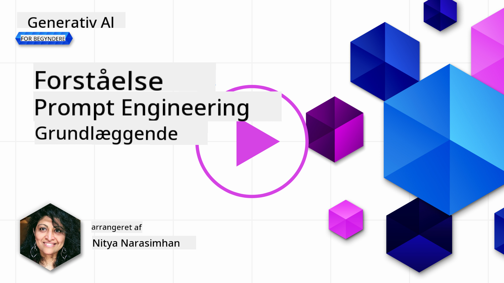
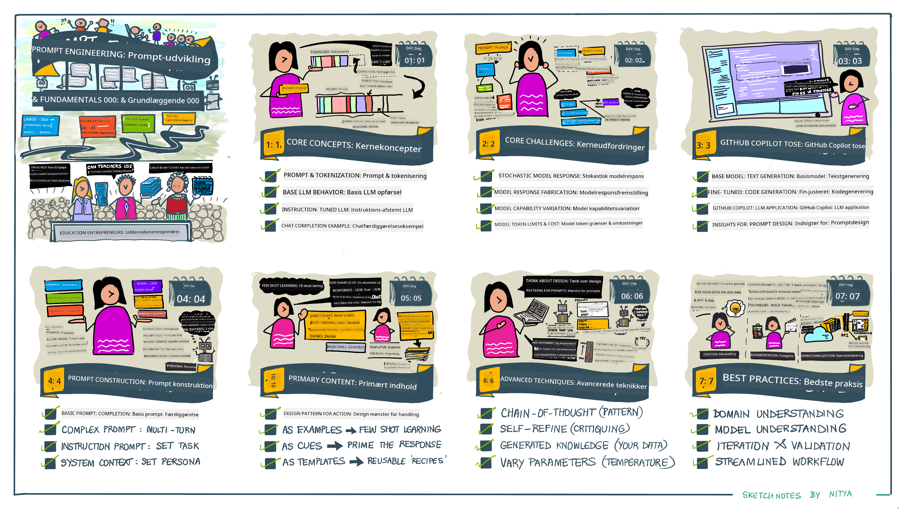
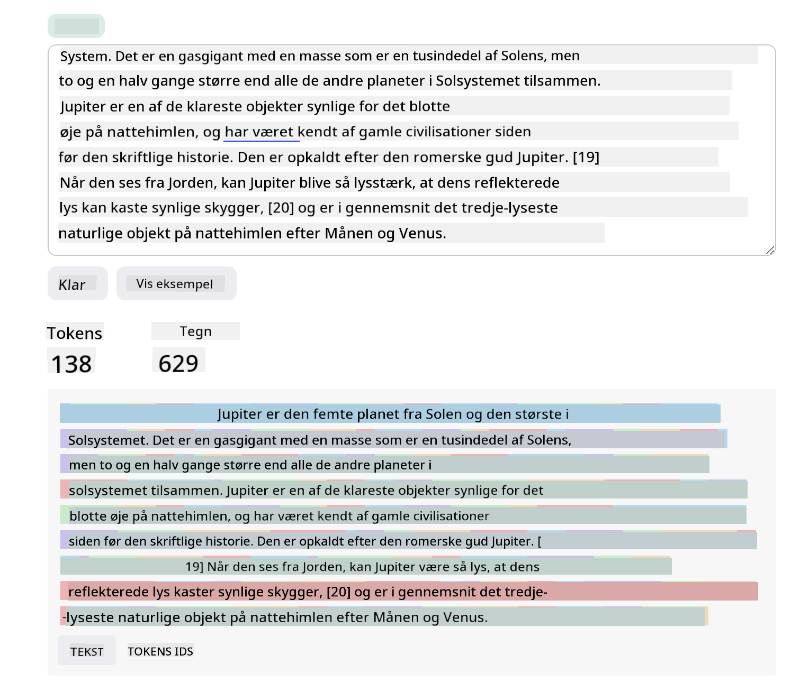
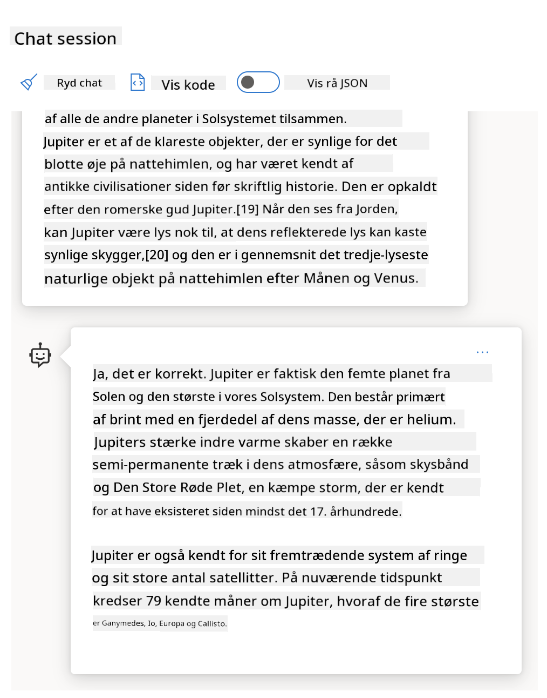
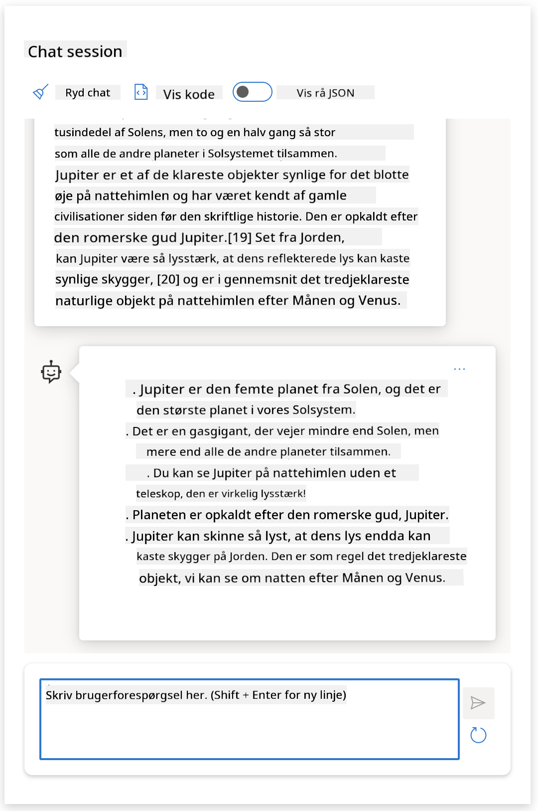
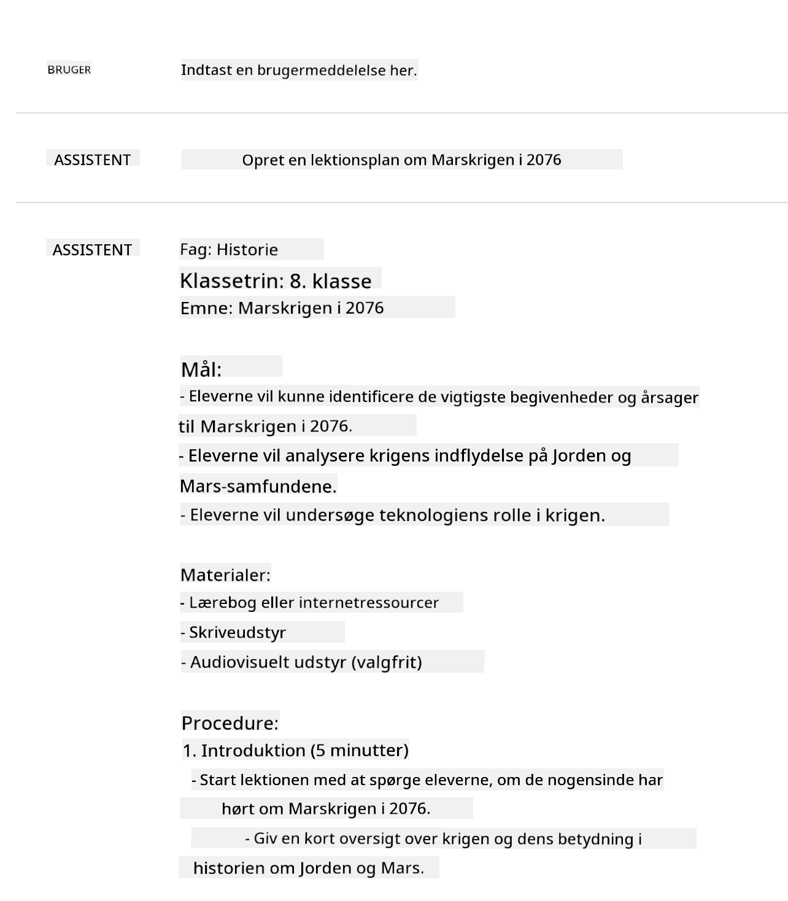
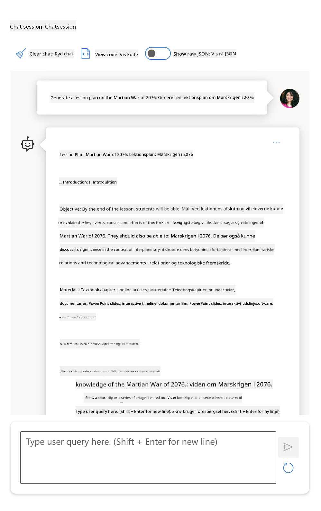
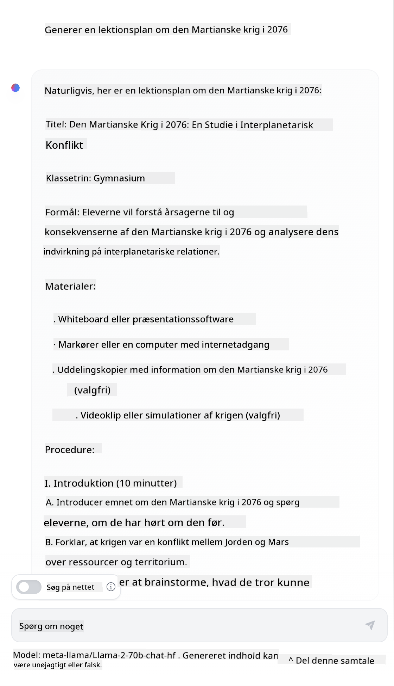

<!--
CO_OP_TRANSLATOR_METADATA:
{
  "original_hash": "dcbaaae026cb50fee071e690685b5843",
  "translation_date": "2025-08-26T17:29:14+00:00",
  "source_file": "04-prompt-engineering-fundamentals/README.md",
  "language_code": "da"
}
-->
# Grundlæggende om Prompt Engineering

[](https://aka.ms/gen-ai-lesson4-gh?WT.mc_id=academic-105485-koreyst)

## Introduktion
Dette modul dækker vigtige begreber og teknikker til at skabe effektive prompts til generative AI-modeller. Måden du formulerer din prompt til en LLM på, har også betydning. En omhyggeligt udformet prompt kan give et bedre svar. Men hvad betyder egentlig begreber som _prompt_ og _prompt engineering_? Og hvordan kan jeg forbedre det _input_, jeg sender til LLM’en? Det er de spørgsmål, vi prøver at besvare i dette kapitel og det næste.

_Generativ AI_ kan skabe nyt indhold (fx tekst, billeder, lyd, kode osv.) som svar på brugerens forespørgsler. Det sker ved hjælp af _Large Language Models_ som OpenAI’s GPT-serie ("Generative Pre-trained Transformer"), der er trænet til at bruge naturligt sprog og kode.

Brugere kan nu interagere med disse modeller via velkendte chat-lignende grænseflader, uden at have teknisk viden eller træning. Modellerne er _prompt-baserede_ – brugeren sender en tekst (prompt) og får et AI-svar (completion) tilbage. Man kan så "chatte med AI’en" i flere omgange, og forfine sin prompt, indtil svaret matcher ens forventninger.

"Prompts" er nu den primære _programmeringsgrænseflade_ for generative AI-apps, der fortæller modellerne, hvad de skal gøre, og påvirker kvaliteten af de svar, der kommer retur. "Prompt Engineering" er et hurtigt voksende felt, der fokuserer på _design og optimering_ af prompts for at levere konsistente og kvalitetsprægede svar i stor skala.

## Læringsmål

I denne lektion lærer vi, hvad Prompt Engineering er, hvorfor det er vigtigt, og hvordan vi kan udforme mere effektive prompts til en given model og et bestemt formål. Vi får styr på centrale begreber og bedste praksis for prompt engineering – og lærer om et interaktivt Jupyter Notebook "sandbox"-miljø, hvor vi kan se disse begreber anvendt på rigtige eksempler.

Når du er færdig med denne lektion, kan du:

1. Forklare hvad prompt engineering er, og hvorfor det er vigtigt.
2. Beskrive komponenterne i en prompt og hvordan de bruges.
3. Lære bedste praksis og teknikker for prompt engineering.
4. Anvende de lærte teknikker på rigtige eksempler, via et OpenAI-endpoint.

## Centrale begreber

Prompt Engineering: Praksis med at designe og forfine input for at guide AI-modeller til at producere ønskede output.
Tokenisering: Processen hvor tekst omdannes til mindre enheder, kaldet tokens, som en model kan forstå og behandle.
Instruction-Tuned LLMs: Store sprogmodeller (LLMs), der er finjusteret med specifikke instruktioner for at forbedre nøjagtighed og relevans i deres svar.

## Learning Sandbox

Prompt engineering er i dag mere en kunst end en videnskab. Den bedste måde at styrke sin intuition på er at _øve sig_ og bruge en trial-and-error tilgang, hvor man kombinerer domæneviden med anbefalede teknikker og model-specifikke optimeringer.

Jupyter Notebooken, der hører til denne lektion, giver dig et _sandbox_-miljø, hvor du kan afprøve det, du lærer – enten løbende eller som en del af kodeudfordringen til sidst. For at kunne udføre øvelserne skal du bruge:

1. **En Azure OpenAI API-nøgle** – service-endpoint for en udrullet LLM.
2. **Et Python-miljø** – hvor Notebooken kan køres.
3. **Lokale miljøvariabler** – _følg [SETUP](./../00-course-setup/02-setup-local.md?WT.mc_id=academic-105485-koreyst) trinnene nu, så du er klar_.

Notebooken indeholder _startøvelser_ – men du opfordres til at tilføje dine egne _Markdown_- (beskrivelse) og _Code_- (prompt-forespørgsler) sektioner for at prøve flere eksempler eller idéer – og styrke din intuition for prompt-design.

## Illustreret guide

Vil du have et overblik over, hvad denne lektion dækker, før du går i gang? Tjek denne illustrerede guide, som giver dig et indtryk af de vigtigste emner og pointer, du skal tænke over. Lektionens roadmap tager dig fra at forstå de centrale begreber og udfordringer til at tackle dem med relevante prompt engineering-teknikker og bedste praksis. Bemærk, at afsnittet "Advanced Techniques" i guiden refererer til indhold, der dækkes i _næste_ kapitel af dette kursus.



## Vores startup

Lad os nu se på, hvordan _dette emne_ hænger sammen med vores startup-mission om at [bringe AI-innovation til uddannelse](https://educationblog.microsoft.com/2023/06/collaborating-to-bring-ai-innovation-to-education?WT.mc_id=academic-105485-koreyst). Vi vil bygge AI-drevne applikationer til _personlig læring_ – så lad os tænke over, hvordan forskellige brugere af vores app kan "designe" prompts:

- **Administratorer** kan bede AI’en om at _analysere læseplansdata for at finde huller i dækningen_. AI’en kan opsummere resultater eller visualisere dem med kode.
- **Undervisere** kan bede AI’en om at _generere en lektionsplan til en bestemt målgruppe og emne_. AI’en kan bygge den personlige plan i et ønsket format.
- **Studerende** kan bede AI’en om at _hjælpe dem med et svært fag_. AI’en kan nu guide dem med lektioner, hints og eksempler tilpasset deres niveau.

Det er kun begyndelsen. Tjek [Prompts For Education](https://github.com/microsoft/prompts-for-edu/tree/main?WT.mc_id=academic-105485-koreyst) – et open source-bibliotek med prompts, kurateret af uddannelseseksperter – for at få et bredere indblik i mulighederne! _Prøv at køre nogle af disse prompts i sandkassen eller via OpenAI Playground og se, hvad der sker!_

<!--
LESSON TEMPLATE:
This unit should cover core concept #1.
Reinforce the concept with examples and references.

CONCEPT #1:
Prompt Engineering.
Define it and explain why it is needed.
-->

## Hvad er Prompt Engineering?

Vi startede denne lektion med at definere **Prompt Engineering** som processen med at _designe og optimere_ tekstinput (prompts) for at levere konsistente og kvalitetsprægede svar (completions) til et givent formål og en bestemt model. Man kan se det som en 2-trins proces:

- _designe_ den første prompt til en given model og formål
- _forfine_ prompten løbende for at forbedre kvaliteten af svaret

Det er nødvendigvis en trial-and-error proces, der kræver brugerens intuition og indsats for at opnå optimale resultater. Men hvorfor er det vigtigt? For at svare på det, skal vi først forstå tre begreber:

- _Tokenisering_ = hvordan modellen "ser" prompten
- _Base LLMs_ = hvordan grundmodellen "behandler" en prompt
- _Instruction-Tuned LLMs_ = hvordan modellen nu kan se "opgaver"

### Tokenisering

En LLM ser prompts som en _sekvens af tokens_, hvor forskellige modeller (eller versioner af en model) kan tokenisere den samme prompt på forskellige måder. Da LLMs er trænet på tokens (og ikke på rå tekst), har måden prompts tokeniseres på direkte indflydelse på kvaliteten af det genererede svar.

Vil du have en fornemmelse af, hvordan tokenisering fungerer? Prøv værktøjer som [OpenAI Tokenizer](https://platform.openai.com/tokenizer?WT.mc_id=academic-105485-koreyst) herunder. Kopiér din prompt ind – og se, hvordan den bliver omdannet til tokens, og læg mærke til, hvordan mellemrum og tegnsætning håndteres. Bemærk, at dette eksempel viser en ældre LLM (GPT-3) – så hvis du prøver med en nyere model, kan resultatet være anderledes.



### Begreb: Foundation Models

Når en prompt er tokeniseret, er hovedfunktionen for ["Base LLM"](https://blog.gopenai.com/an-introduction-to-base-and-instruction-tuned-large-language-models-8de102c785a6?WT.mc_id=academic-105485-koreyst) (eller Foundation model) at forudsige det næste token i sekvensen. Da LLMs er trænet på enorme tekstmængder, har de et godt kendskab til de statistiske relationer mellem tokens og kan lave den forudsigelse med en vis sikkerhed. Bemærk, at de ikke forstår _betydningen_ af ordene i prompten eller tokenet; de ser bare et mønster, de kan "fuldføre" med deres næste forudsigelse. De kan fortsætte med at forudsige sekvensen, indtil brugeren stopper dem eller en forudbestemt betingelse er opfyldt.

Vil du se, hvordan prompt-baseret completion fungerer? Indtast ovenstående prompt i Azure OpenAI Studio [_Chat Playground_](https://oai.azure.com/playground?WT.mc_id=academic-105485-koreyst) med standardindstillingerne. Systemet er sat op til at behandle prompts som informationsforespørgsler – så du bør se et svar, der matcher denne kontekst.

Men hvad hvis brugeren vil se noget specifikt, der opfylder et bestemt kriterium eller opgave? Her kommer _instruction-tuned_ LLMs ind i billedet.



### Begreb: Instruction Tuned LLMs

En [Instruction Tuned LLM](https://blog.gopenai.com/an-introduction-to-base-and-instruction-tuned-large-language-models-8de102c785a6?WT.mc_id=academic-105485-koreyst) starter med grundmodellen og finjusterer den med eksempler eller input/output-par (fx multi-turn "messages"), der kan indeholde klare instruktioner – og AI’ens svar forsøger at følge den instruktion.

Her bruges teknikker som Reinforcement Learning with Human Feedback (RLHF), der kan træne modellen til at _følge instruktioner_ og _lære af feedback_, så den leverer svar, der er bedre egnet til praktiske anvendelser og mere relevante for brugerens mål.

Lad os prøve det – gå tilbage til prompten ovenfor, men ændr nu _systembeskeden_ til at give følgende instruktion som kontekst:

> _Opsummer det indhold, du får, for en elev i 2. klasse. Hold resultatet til ét afsnit med 3-5 punktform._

Se hvordan resultatet nu er tilpasset det ønskede mål og format? En underviser kan nu direkte bruge dette svar i sine slides til klassen.



## Hvorfor har vi brug for Prompt Engineering?

Nu hvor vi ved, hvordan prompts behandles af LLMs, lad os tale om _hvorfor_ vi har brug for prompt engineering. Svaret ligger i, at de nuværende LLMs har en række udfordringer, der gør det _sværere at få pålidelige og konsistente svar_ uden at lægge arbejde i promptens opbygning og optimering. For eksempel:

1. **Modellens svar er stokastiske.** Den _samme prompt_ vil sandsynligvis give forskellige svar med forskellige modeller eller modelversioner. Og den kan endda give forskellige resultater med _samme model_ på forskellige tidspunkter. _Prompt engineering-teknikker kan hjælpe med at minimere disse variationer ved at give bedre rammer._

1. **Modeller kan opfinde svar.** Modellerne er trænet på _store, men begrænsede_ datasæt, hvilket betyder, at de mangler viden om emner uden for træningsdataene. Derfor kan de generere svar, der er unøjagtige, opdigtede eller direkte modstridende med kendte fakta. _Prompt engineering-teknikker hjælper brugere med at identificere og afbøde sådanne opdigtede svar, fx ved at bede AI’en om kilder eller begrundelser._

1. **Modellernes evner varierer.** Nyere modeller eller generationer har flere funktioner, men kan også have særlige særheder og kompromiser i pris og kompleksitet. _Prompt engineering kan hjælpe med at udvikle bedste praksis og arbejdsgange, der abstraherer forskellene og tilpasser sig model-specifikke krav på en skalerbar og smidig måde._

Lad os se det i praksis i OpenAI eller Azure OpenAI Playground:

- Brug den samme prompt med forskellige LLM-udrulninger (fx OpenAI, Azure OpenAI, Hugging Face) – så du variationerne?
- Brug den samme prompt gentagne gange med _samme_ LLM-udrulning (fx Azure OpenAI playground) – hvordan adskilte disse variationer sig?

### Eksempel på opdigtede svar

I dette kursus bruger vi begrebet **"opdigtning"** om det fænomen, hvor LLMs nogle gange genererer faktuelt forkerte oplysninger på grund af begrænsninger i deres træning eller andre forhold. Du har måske også hørt det omtalt som _"hallucinationer"_ i artikler eller forskningspapirer. Vi anbefaler dog at bruge _"opdigtning"_ som begreb, så vi undgår at tillægge maskinen menneskelige egenskaber. Det understøtter også [Responsible AI guidelines](https://www.microsoft.com/ai/responsible-ai?WT.mc_id=academic-105485-koreyst) fra et terminologisk perspektiv, og fjerner ord, der kan opfattes som stødende eller ikke-inkluderende i visse sammenhænge.

Vil du se, hvordan opdigtede svar opstår? Tænk på en prompt, der instruerer AI’en i at generere indhold om et ikke-eksisterende emne (så det ikke findes i træningsdataene). For eksempel – jeg prøvede denne prompt:
# Undervisningsplan: Den Marsianske Krig i 2076

## Introduktion
Denne lektion vil dække de vigtigste begivenheder, årsager og konsekvenser af Den Marsianske Krig i 2076. Eleverne vil undersøge, hvordan konflikten opstod, hvilke parter der var involveret, og hvordan krigen påvirkede både Mars og Jorden.

## Læringsmål
- Forstå de politiske og økonomiske årsager til krigen
- Identificere de vigtigste aktører og deres motivationer
- Analysere krigens forløb og dens indflydelse på samfundet
- Diskutere de langsigtede konsekvenser for Mars og Jorden

## Materialer
- Tidslinje over krigens begivenheder
- Kort over Mars og de vigtigste kolonier
- Øjenvidneberetninger og primære kilder
- Artikler om teknologiske fremskridt under krigen

## Lektionens forløb

### 1. Opvarmning (10 minutter)
- Kort diskussion: Hvad ved vi om Mars og dens kolonier?
- Brainstorm: Hvorfor kan der opstå konflikter mellem kolonier og moderplaneter?

### 2. Baggrund og årsager (15 minutter)
- Gennemgang af de politiske spændinger mellem Mars og Jorden
- Diskussion af ressourcemangel, selvstændighedsbevægelser og teknologisk udvikling

### 3. Krigens forløb (20 minutter)
- Præsentation af de vigtigste slag og strategier
- Analyse af de involverede parter: Mars’ uafhængighedsbevægelse, Jordens koalition, og neutrale kolonier
- Læsning af øjenvidneberetninger

### 4. Konsekvenser og efterspil (15 minutter)
- Diskussion af de sociale og økonomiske ændringer på Mars
- Hvordan krigen ændrede forholdet mellem Mars og Jorden
- Langsigtede effekter på teknologi og politik

### 5. Refleksion og debat (10 minutter)
- Eleverne diskuterer: Kunne krigen være undgået? Hvilke alternativer fandtes?
- Skriftlig refleksion: Hvilken indflydelse har krigen haft på fremtidens rumfart?

## Evaluering
- Deltagelse i diskussioner
- Kort skriftlig opgave om krigens betydning
- Gruppearbejde: Udarbejd en alternativ slutning på konflikten

## Ekstra ressourcer
- Links til dokumentarer og artikler om Mars’ historie
- Forslag til videre læsning om interplanetarisk politik

---

*Kommentar: Denne undervisningsplan kan tilpasses forskellige klassetrin og faglige niveauer. Brug gerne kreative opgaver for at engagere eleverne i emnet.*
Et web-søgning viste mig, at der findes fiktive beretninger (fx tv-serier eller bøger) om krige på Mars – men ingen i 2076. Sund fornuft fortæller os også, at 2076 ligger _i fremtiden_ og derfor ikke kan forbindes med en virkelig begivenhed.

Så hvad sker der, når vi kører denne prompt med forskellige LLM-udbydere?

> **Svar 1**: OpenAI Playground (GPT-35)



> **Svar 2**: Azure OpenAI Playground (GPT-35)



> **Svar 3**: Hugging Face Chat Playground (LLama-2)



Som forventet giver hver model (eller modelversion) lidt forskellige svar på grund af stokastisk adfærd og variationer i modellernes evner. For eksempel retter én model sig mod et publikum på 8. klassetrin, mens en anden antager, at brugeren er gymnasieelev. Men alle tre modeller genererede svar, der kunne overbevise en uinformeret bruger om, at begivenheden var virkelig.

Prompt engineering-teknikker som _metaprompting_ og _temperaturindstilling_ kan til en vis grad mindske modellens opfindsomhed. Nye prompt engineering-_arkitekturer_ integrerer også nye værktøjer og teknikker direkte i prompt-flowet for at afbøde eller reducere nogle af disse effekter.

## Case Study: GitHub Copilot

Lad os afslutte dette afsnit med at få en fornemmelse af, hvordan prompt engineering bruges i virkelige løsninger ved at se på et case study: [GitHub Copilot](https://github.com/features/copilot?WT.mc_id=academic-105485-koreyst).

GitHub Copilot er din "AI Pair Programmer" – den omsætter tekstprompter til kodeforslag og er integreret i dit udviklingsmiljø (fx Visual Studio Code) for en gnidningsfri brugeroplevelse. Som dokumenteret i blogserien nedenfor, var den tidligste version baseret på OpenAI Codex-modellen – hvor ingeniørerne hurtigt indså behovet for at finjustere modellen og udvikle bedre prompt engineering-teknikker for at forbedre kodekvaliteten. I juli [introducerede de en forbedret AI-model, der går ud over Codex](https://github.blog/2023-07-28-smarter-more-efficient-coding-github-copilot-goes-beyond-codex-with-improved-ai-model/?WT.mc_id=academic-105485-koreyst) for endnu hurtigere forslag.

Læs indlæggene i rækkefølge for at følge deres læringsrejse.

- **Maj 2023** | [GitHub Copilot bliver bedre til at forstå din kode](https://github.blog/2023-05-17-how-github-copilot-is-getting-better-at-understanding-your-code/?WT.mc_id=academic-105485-koreyst)
- **Maj 2023** | [Inde i GitHub: Arbejde med LLM'erne bag GitHub Copilot](https://github.blog/2023-05-17-inside-github-working-with-the-llms-behind-github-copilot/?WT.mc_id=academic-105485-koreyst).
- **Juni 2023** | [Sådan skriver du bedre prompts til GitHub Copilot](https://github.blog/2023-06-20-how-to-write-better-prompts-for-github-copilot/?WT.mc_id=academic-105485-koreyst).
- **Juli 2023** | [.. GitHub Copilot går ud over Codex med forbedret AI-model](https://github.blog/2023-07-28-smarter-more-efficient-coding-github-copilot-goes-beyond-codex-with-improved-ai-model/?WT.mc_id=academic-105485-koreyst)
- **Juli 2023** | [En udviklers guide til Prompt Engineering og LLM'er](https://github.blog/2023-07-17-prompt-engineering-guide-generative-ai-llms/?WT.mc_id=academic-105485-koreyst)
- **September 2023** | [Sådan bygger du en enterprise LLM-app: Lærdom fra GitHub Copilot](https://github.blog/2023-09-06-how-to-build-an-enterprise-llm-application-lessons-from-github-copilot/?WT.mc_id=academic-105485-koreyst)

Du kan også gennemse deres [Engineering-blog](https://github.blog/category/engineering/?WT.mc_id=academic-105485-koreyst) for flere indlæg som [dette](https://github.blog/2023-09-27-how-i-used-github-copilot-chat-to-build-a-reactjs-gallery-prototype/?WT.mc_id=academic-105485-koreyst), der viser, hvordan disse modeller og teknikker _anvendes_ til at drive virkelige applikationer.

---

## Promptkonstruktion

Vi har set, hvorfor prompt engineering er vigtigt – nu skal vi forstå, hvordan prompts _konstrueres_, så vi kan vurdere forskellige teknikker for mere effektiv promptdesign.

### Grundlæggende prompt

Lad os starte med den grundlæggende prompt: en tekstinput sendt til modellen uden anden kontekst. Her er et eksempel – når vi sender de første par ord af den amerikanske nationalsang til OpenAI [Completion API](https://platform.openai.com/docs/api-reference/completions?WT.mc_id=academic-105485-koreyst), _fuldender_ den straks svaret med de næste linjer, hvilket illustrerer den grundlæggende forudsigelsesadfærd.

| Prompt (Input)     | Completion (Output)                                                                                                                        |
| :----------------- | :----------------------------------------------------------------------------------------------------------------------------------------- |
| Oh say can you see | Det lyder som om du starter teksten til "The Star-Spangled Banner", USA's nationalsang. Hele teksten er ... |

### Kompleks prompt

Nu tilføjer vi kontekst og instruktioner til den grundlæggende prompt. [Chat Completion API](https://learn.microsoft.com/azure/ai-services/openai/how-to/chatgpt?WT.mc_id=academic-105485-koreyst) lader os konstruere en kompleks prompt som en samling af _beskeder_ med:

- Input/output-par, der afspejler _brugerinput_ og _assistentens_ svar.
- Systembesked, der sætter konteksten for assistentens adfærd eller personlighed.

Forespørgslen har nu nedenstående form, hvor _tokeniseringen_ effektivt indfanger relevant information fra kontekst og samtale. Nu kan ændring af systemkonteksten have lige så stor indflydelse på kvaliteten af svarene som de brugerinput, der gives.

```python
response = openai.chat.completions.create(
    model="gpt-3.5-turbo",
    messages=[
        {"role": "system", "content": "You are a helpful assistant."},
        {"role": "user", "content": "Who won the world series in 2020?"},
        {"role": "assistant", "content": "The Los Angeles Dodgers won the World Series in 2020."},
        {"role": "user", "content": "Where was it played?"}
    ]
)
```

### Instruktionsprompt

I eksemplerne ovenfor var brugerens prompt en simpel tekstforespørgsel, der kan tolkes som en anmodning om information. Med _instruktionsprompter_ kan vi bruge teksten til at specificere en opgave mere detaljeret og give AI'en bedre vejledning. Her er et eksempel:

| Prompt (Input)                                                                                                                                                                                                                         | Completion (Output)                                                                                                        | Instruction Type    |
| :------------------------------------------------------------------------------------------------------------------------------------------------------------------------------------------------------------------------------------- | :------------------------------------------------------------------------------------------------------------------------- | :------------------ |
| Skriv en beskrivelse af Borgerkrigen                                                                                                                                                                                                   | _returnerede et simpelt afsnit_                                                                                           | Simpel              |
| Skriv en beskrivelse af Borgerkrigen. Angiv vigtige datoer og begivenheder og beskriv deres betydning                                                                                                                                  | _returnerede et afsnit efterfulgt af en liste med vigtige datoer og beskrivelser_                                         | Kompleks             |
| Skriv en beskrivelse af Borgerkrigen i 1 afsnit. Giv 3 punktnedslag med vigtige datoer og deres betydning. Giv 3 yderligere punktnedslag med vigtige historiske personer og deres bidrag. Returnér outputtet som en JSON-fil             | _returnerer mere omfattende detaljer i en tekstboks, formateret som JSON, som du kan kopiere og validere efter behov_     | Kompleks. Formateret. |

## Primært indhold

I eksemplerne ovenfor var prompten stadig ret åben, hvilket lod LLM'en bestemme, hvilken del af dens fortrænede datasæt der var relevant. Med _primært indhold_-designet opdeles inputteksten i to dele:

- en instruktion (handling)
- relevant indhold (der påvirker handlingen)

Her er et eksempel, hvor instruktionen er "opsummer dette i 2 sætninger".

| Prompt (Input)                                                                                                                                                                                                                                                                                                                                                                                                                                                                                                                                                                                                                                                                                      | Completion (Output)                                                                                                                                                                                                                                                                             |
| :-------------------------------------------------------------------------------------------------------------------------------------------------------------------------------------------------------------------------------------------------------------------------------------------------------------------------------------------------------------------------------------------------------------------------------------------------------------------------------------------------------------------------------------------------------------------------------------------------------------------------------------------------------------------------------------------------- | :---------------------------------------------------------------------------------------------------------------------------------------------------------------------------------------------------------------------------------------------------------------------------------------------- |
| Jupiter er den femte planet fra Solen og den største i Solsystemet. Det er en gaskæmpe med en masse på en tusindedel af Solens, men to og en halv gange så stor som alle de andre planeter i Solsystemet tilsammen. Jupiter er et af de klareste objekter, der kan ses med det blotte øje på nattehimlen, og har været kendt af oldtidens civilisationer siden før historisk tid. Den er opkaldt efter den romerske gud Jupiter.[19] Set fra Jorden kan Jupiter være så lysstærk, at dens reflekterede lys kan kaste synlige skygger,[20] og den er i gennemsnit det tredjeklareste naturlige objekt på nattehimlen efter Månen og Venus. <br/> **Opsummer dette i 2 korte sætninger** | Jupiter, den femte planet fra Solen, er den største i Solsystemet og kendt for at være et af de klareste objekter på nattehimlen. Opkaldt efter den romerske gud Jupiter, er det en gaskæmpe, hvis masse er to og en halv gange større end alle de andre planeter tilsammen. |

Segmentet med primært indhold kan bruges på forskellige måder til at skabe mere effektive instruktioner:

- **Eksempler** – i stedet for at fortælle modellen, hvad den skal gøre med en eksplicit instruktion, giver du den eksempler på, hvad den skal gøre, og lader den udlede mønsteret.
- **Cues** – følg instruktionen med et "cue", der primet svaret og guider modellen mod mere relevante svar.
- **Skabeloner** – dette er gentagelige 'opskrifter' på prompts med pladsholdere (variabler), der kan tilpasses med data til specifikke brugsscenarier.

Lad os se nærmere på disse i praksis.

### Brug af eksempler

Dette er en tilgang, hvor du bruger det primære indhold til at "fodre modellen" med nogle eksempler på det ønskede output for en given instruktion og lader den udlede mønsteret for det ønskede output. Afhængigt af antallet af eksempler kan vi have zero-shot prompting, one-shot prompting, few-shot prompting osv.

Prompten består nu af tre komponenter:

- En opgavebeskrivelse
- Et par eksempler på det ønskede output
- Starten på et nyt eksempel (som bliver en implicit opgavebeskrivelse)

| Læringstype | Prompt (Input)                                                                                                                                        | Completion (Output)         |
| :---------- | :---------------------------------------------------------------------------------------------------------------------------------------------------- | :-------------------------- |
| Zero-shot   | "The Sun is Shining". Translate to Spanish                                                                                                            | "El Sol está brillando".    |
| One-shot    | "The Sun is Shining" => ""El Sol está brillando". <br> "It's a Cold and Windy Day" =>                                                                 | "Es un día frío y ventoso". |
| Few-shot    | The player ran the bases => Baseball <br/> The player hit an ace => Tennis <br/> The player hit a six => Cricket <br/> The player made a slam-dunk => | Basketball                  |
|             |                                                                                                                                                       |                             |

Bemærk, hvordan vi måtte give en eksplicit instruktion ("Translate to Spanish") i zero-shot prompting, men at den bliver udledt i one-shot eksemplet. Few-shot eksemplet viser, hvordan flere eksempler gør det muligt for modeller at lave mere præcise udledninger uden ekstra instruktioner.

### Prompt-cues

En anden teknik til at bruge primært indhold er at give _cues_ i stedet for eksempler. Her giver vi modellen et skub i den rigtige retning ved at _starte den_ med et uddrag, der afspejler det ønskede svarformat. Modellen "tager cue'et" og fortsætter i samme stil.

| Antal cues | Prompt (Input)                                                                                                                                                                                                                                                                                                                                                                                                                                               | Completion (Output)                                                                                                                                                                                                                                                                                       |
| :--------- | :----------------------------------------------------------------------------------------------------------------------------------------------------------------------------------------------------------------------------------------------------------------------------------------------------------------------------------------------------------------------------------------------------------------------------------------------------------- | :-------------------------------------------------------------------------------------------------------------------------------------------------------------------------------------------------------------------------------------------------------------------------------------------------------- |
| 0          | Jupiter er den femte planet fra Solen og den største i Solsystemet. Det er en gaskæmpe med en masse på en tusindedel af Solens, men to og en halv gange så stor som alle de andre planeter i Solsystemet tilsammen. Jupiter er et af de klareste objekter, der kan ses med det blotte øje på nattehimlen, og har været kendt af oldtidens civilisationer siden før historisk tid.

**Opsummer dette**                                       | Jupiter er den største planet i vores solsystem og den femte fra Solen. Det er en gaskæmpe med en masse på 1/1000 af Solens, men den er tungere end alle de andre planeter tilsammen. Gamle civilisationer har kendt til Jupiter i lang tid, og den er let synlig på nattehimlen. |
| 1              | Jupiter er den femte planet fra Solen og den største i solsystemet. Det er en gaskæmpe med en masse på en tusindedel af Solens, men to og en halv gange så stor som alle de andre planeter i solsystemet tilsammen. Jupiter er et af de klareste objekter, der kan ses med det blotte øje på nattehimlen, og har været kendt af gamle civilisationer siden før historisk tid. <br/>**Opsummer dette** <br/> Det vi har lært er, at Jupiter | er den femte planet fra Solen og den største i solsystemet. Det er en gaskæmpe med en masse på en tusindedel af Solens, men to og en halv gange så stor som alle de andre planeter tilsammen. Den er let synlig med det blotte øje og har været kendt siden oldtiden.                        |
| 2              | Jupiter er den femte planet fra Solen og den største i solsystemet. Det er en gaskæmpe med en masse på en tusindedel af Solens, men to og en halv gange så stor som alle de andre planeter i solsystemet tilsammen. Jupiter er et af de klareste objekter, der kan ses med det blotte øje på nattehimlen, og har været kendt af gamle civilisationer siden før historisk tid. <br/>**Opsummer dette** <br/> Top 3 ting vi lærte:         | 1. Jupiter er den femte planet fra Solen og den største i solsystemet. <br/> 2. Det er en gaskæmpe med en masse på en tusindedel af Solens...<br/> 3. Jupiter har været synlig med det blotte øje siden oldtiden ...                                                                       |
|                |                                                                                                                                                                                                                                                                                                                                                                                                                                                              |                                                                                                                                                                                                                                                                                                           |

### Promptskabeloner

En promptskabelon er en _foruddefineret opskrift på en prompt_, som kan gemmes og genbruges efter behov for at skabe mere ensartede brugeroplevelser i stor skala. I sin simpleste form er det blot en samling af prompteksempler som [dette fra OpenAI](https://platform.openai.com/examples?WT.mc_id=academic-105485-koreyst), der både indeholder de interaktive promptkomponenter (bruger- og systembeskeder) og det API-drevne forespørgselsformat – for at understøtte genbrug.

I en mere kompleks form som [dette eksempel fra LangChain](https://python.langchain.com/docs/concepts/prompt_templates/?WT.mc_id=academic-105485-koreyst) indeholder den _pladsholdere_, der kan udskiftes med data fra forskellige kilder (brugerinput, systemkontekst, eksterne datakilder osv.) for at generere en prompt dynamisk. Det gør det muligt at oprette et bibliotek af genanvendelige prompts, der kan bruges til at skabe ensartede brugeroplevelser **programmatisk** i stor skala.

Den reelle værdi af skabeloner ligger dog i muligheden for at oprette og udgive _promptbiblioteker_ til specifikke anvendelsesområder – hvor promptskabelonen nu er _optimeret_ til at afspejle applikationsspecifik kontekst eller eksempler, der gør svarene mere relevante og præcise for den tiltænkte brugergruppe. [Prompts For Edu](https://github.com/microsoft/prompts-for-edu?WT.mc_id=academic-105485-koreyst) er et godt eksempel på denne tilgang, hvor der samles et bibliotek af prompts til uddannelsesområdet med fokus på nøglemål som lektionsplanlægning, læseplansdesign, elevvejledning osv.

## Understøttende indhold

Hvis vi tænker på promptkonstruktion som at have en instruktion (opgave) og et mål (primært indhold), så er _sekundært indhold_ som ekstra kontekst, vi giver for at **påvirke outputtet på en eller anden måde**. Det kan være justeringsparametre, formateringsinstruktioner, emnetaksonomier osv., der kan hjælpe modellen med at _tilpasse_ sit svar, så det passer til de ønskede brugerbehov eller forventninger.

For eksempel: Givet et kursuskatalog med omfattende metadata (navn, beskrivelse, niveau, metadatatags, underviser osv.) på alle tilgængelige kurser i læseplanen:

- kan vi definere en instruktion om at "opsummere kursuskataloget for efteråret 2023"
- vi kan bruge det primære indhold til at give et par eksempler på det ønskede output
- vi kan bruge det sekundære indhold til at identificere de 5 vigtigste "tags" af interesse.

Nu kan modellen give et resumé i det format, der vises i eksemplerne – men hvis et resultat har flere tags, kan den prioritere de 5 tags, der er identificeret i det sekundære indhold.

---

<!--
LEKTIONSKABELON:
Denne enhed skal dække kernekoncept #1.
Understøt konceptet med eksempler og referencer.

KONCEPT #3:
Prompt Engineering-teknikker.
Hvilke grundlæggende teknikker findes der til prompt engineering?
Illustrer det med nogle øvelser.
-->

## Bedste praksis for prompt engineering

Nu hvor vi ved, hvordan prompts kan _konstrueres_, kan vi begynde at tænke over, hvordan vi _designer_ dem, så de afspejler bedste praksis. Vi kan tænke på det i to dele – at have den rette _tankegang_ og at anvende de rette _teknikker_.

### Tankegang for prompt engineering

Prompt engineering er en proces med forsøg og fejl, så husk tre brede retningslinjer:

1. **Domæneforståelse er vigtig.** Svarkvalitet og relevans afhænger af det _domæne_, som applikationen eller brugeren arbejder i. Brug din intuition og domæneekspertise til at **tilpasse teknikker** yderligere. For eksempel kan du definere _domænespecifikke personligheder_ i dine systemprompts eller bruge _domænespecifikke skabeloner_ i dine brugerprompts. Giv sekundært indhold, der afspejler domænespecifik kontekst, eller brug _domænespecifikke cues og eksempler_ til at guide modellen mod velkendte brugsmønstre.

2. **Model-forståelse er vigtig.** Vi ved, at modeller er stokastiske af natur. Men modelimplementeringer kan også variere i forhold til det træningsdatasæt, de bruger (forudtrænet viden), de funktioner, de tilbyder (f.eks. via API eller SDK), og den type indhold, de er optimeret til (f.eks. kode vs. billeder vs. tekst). Forstå styrker og begrænsninger ved den model, du bruger, og brug den viden til at _prioritere opgaver_ eller bygge _tilpassede skabeloner_, der er optimeret til modellens evner.

3. **Iteration & validering er vigtig.** Modeller udvikler sig hurtigt, og det samme gør teknikkerne til prompt engineering. Som domæneekspert kan du have anden kontekst eller kriterier for _din_ specifikke applikation, som ikke gælder for det brede fællesskab. Brug prompt engineering-værktøjer og -teknikker til at "kickstarte" promptkonstruktionen, og iterer og valider resultaterne med din egen intuition og domæneviden. Notér dine indsigter og opret en **vidensbase** (f.eks. promptbiblioteker), som andre kan bruge som nyt udgangspunkt for hurtigere iterationer i fremtiden.

## Bedste praksis

Lad os nu se på almindelige bedste praksisser, der anbefales af [OpenAI](https://help.openai.com/en/articles/6654000-best-practices-for-prompt-engineering-with-openai-api?WT.mc_id=academic-105485-koreyst) og [Azure OpenAI](https://learn.microsoft.com/azure/ai-services/openai/concepts/prompt-engineering#best-practices?WT.mc_id=academic-105485-koreyst)-praktikere.

| Hvad                              | Hvorfor                                                                                                                                                                                                                                               |
| :-------------------------------- | :----------------------------------------------------------------------------------------------------------------------------------------------------------------------------------------------------------------------------------------------------- |
| Evaluer de nyeste modeller.       | Nye modelgenerationer har sandsynligvis forbedrede funktioner og kvalitet – men kan også være dyrere. Vurder dem for effekt, og tag derefter beslutning om at migrere.                                                                                |
| Adskil instruktioner & kontekst   | Tjek om din model/udbyder definerer _afgrænsere_ til tydeligere at adskille instruktioner, primært og sekundært indhold. Det kan hjælpe modeller med at tildele vægt mere præcist til tokens.                                                         |
| Vær specifik og tydelig           | Giv flere detaljer om ønsket kontekst, resultat, længde, format, stil osv. Det vil forbedre både kvaliteten og konsistensen af svarene. Gem opskrifter i genanvendelige skabeloner.                                                                  |
| Vær beskrivende, brug eksempler   | Modeller reagerer ofte bedre på en "vis og fortæl"-tilgang. Start med en `zero-shot` tilgang, hvor du kun giver en instruktion (men ingen eksempler), og prøv derefter `few-shot` som en forbedring, hvor du giver et par eksempler på ønsket output. Brug analogier. |
| Brug cues til at kickstarte svar  | Skub modellen i retning af et ønsket resultat ved at give den nogle indledende ord eller sætninger, den kan bruge som udgangspunkt for svaret.                                                                                                         |
| Gentag instruktioner              | Nogle gange skal du gentage dig selv over for modellen. Giv instruktioner før og efter dit primære indhold, brug en instruktion og et cue osv. Iterer og valider for at se, hvad der virker.                                                          |
| Rækkefølge betyder noget          | Den rækkefølge, du præsenterer information for modellen i, kan påvirke outputtet, selv i læringseksempler, på grund af recency bias. Prøv forskellige muligheder for at se, hvad der fungerer bedst.                                                   |
| Giv modellen en “udvej”           | Giv modellen et _fallback_-svar, den kan give, hvis den ikke kan løse opgaven af en eller anden grund. Det kan mindske risikoen for, at modellen genererer forkerte eller opdigtede svar.                                                             |
|                                   |                                                                                                                                                                                                                                                       |

Som med enhver bedste praksis gælder det, at _dine resultater kan variere_ afhængigt af model, opgave og domæne. Brug disse som udgangspunkt, og iterer for at finde det, der fungerer bedst for dig. Genovervej løbende din prompt engineering-proces, efterhånden som nye modeller og værktøjer bliver tilgængelige, med fokus på skalerbarhed og svarkvalitet.

<!--
LEKTIONSKABELON:
Denne enhed skal give en kodeudfordring, hvis det er relevant

UDFORDRING:
Link til en Jupyter Notebook med kun kodekommentarer i instruktionerne (kodestykker er tomme).

LØSNING:
Link til en kopi af den Notebook med prompts udfyldt og kørt, så man kan se et eksempel.
-->

## Opgave

Tillykke! Du er nået til slutningen af lektionen! Nu er det tid til at afprøve nogle af de koncepter og teknikker med rigtige eksempler!

Til denne opgave bruger vi en Jupyter Notebook med øvelser, du kan løse interaktivt. Du kan også udvide Notebooken med dine egne Markdown- og kodeceller for at udforske idéer og teknikker på egen hånd.

### For at komme i gang, så fork repoet, og

- (Anbefalet) Start GitHub Codespaces
- (Alternativt) Klon repoet til din lokale enhed og brug det med Docker Desktop
- (Alternativt) Åbn Notebooken med din foretrukne Notebook-runtime.

### Konfigurer derefter dine miljøvariabler

- Kopiér `.env.copy`-filen i repo-roden til `.env` og udfyld `AZURE_OPENAI_API_KEY`, `AZURE_OPENAI_ENDPOINT` og `AZURE_OPENAI_DEPLOYMENT`. Gå tilbage til [Learning Sandbox-sektionen](../../../04-prompt-engineering-fundamentals/04-prompt-engineering-fundamentals) for at lære hvordan.

### Åbn derefter Jupyter Notebooken

- Vælg runtime-kernen. Hvis du bruger mulighed 1 eller 2, skal du blot vælge standard Python 3.10.x-kernen, som dev-containeren leverer.

Nu er du klar til at køre øvelserne. Bemærk, at der ikke er _rigtige eller forkerte_ svar her – det handler om at udforske muligheder gennem forsøg og fejl og opbygge intuition for, hvad der virker for en given model og applikationsdomæne.

_Derfor er der ingen kode-løsningsafsnit i denne lektion. I stedet vil Notebooken have Markdown-celler med titlen "Min løsning:", der viser et eksempeloutput til reference._

 <!--
LEKTIONSKABELON:
Afslut afsnittet med et resumé og ressourcer til selvstudium.
-->

## Videnscheck

Hvilken af følgende er en god prompt, der følger nogle rimelige bedste praksisser?

1. Vis mig et billede af en rød bil
2. Vis mig et billede af en rød bil af mærket Volvo og model XC90 parkeret ved en klippe med solen, der går ned
3. Vis mig et billede af en rød bil af mærket Volvo og model XC90

A: 2, det er den bedste prompt, da den giver detaljer om "hvad" og går i dybden (ikke bare en hvilken som helst bil, men et bestemt mærke og model) og beskriver også den overordnede scene. 3 er næstbedst, da den også indeholder mange beskrivelser.

## 🚀 Udfordring

Se om du kan bruge "cue"-teknikken med prompten: Fuldfør sætningen "Vis mig et billede af en rød bil af mærket Volvo og ". Hvad svarer den med, og hvordan ville du forbedre det?

## Godt arbejde! Fortsæt din læring

Vil du lære mere om forskellige Prompt Engineering-koncepter? Gå til [siden for videre læring](https://aka.ms/genai-collection?WT.mc_id=academic-105485-koreyst) for at finde flere gode ressourcer om dette emne.

Gå videre til Lektion 5, hvor vi ser på [avancerede prompting-teknikker](../05-advanced-prompts/README.md?WT.mc_id=academic-105485-koreyst)!

---

**Ansvarsfraskrivelse**:  
Dette dokument er blevet oversat ved hjælp af AI-oversættelsestjenesten [Co-op Translator](https://github.com/Azure/co-op-translator). Selvom vi bestræber os på nøjagtighed, skal du være opmærksom på, at automatiserede oversættelser kan indeholde fejl eller unøjagtigheder. Det originale dokument på dets oprindelige sprog bør betragtes som den autoritative kilde. For kritiske oplysninger anbefales professionel menneskelig oversættelse. Vi er ikke ansvarlige for misforståelser eller fejltolkninger, der opstår som følge af brugen af denne oversættelse.