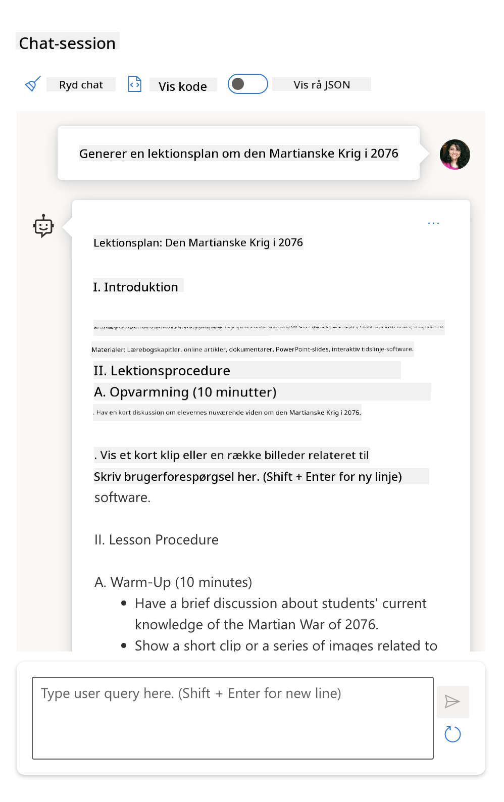
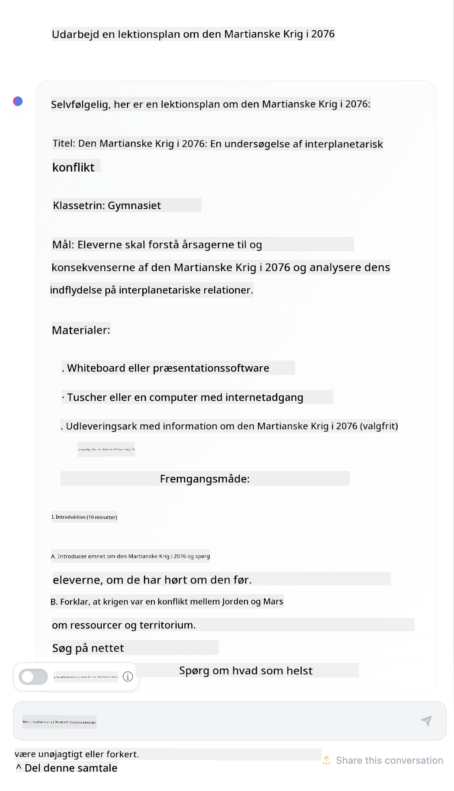

<!--
CO_OP_TRANSLATOR_METADATA:
{
  "original_hash": "8b3cb38518cf4fe7714d2f5e74dfa3eb",
  "translation_date": "2025-10-03T09:38:06+00:00",
  "source_file": "04-prompt-engineering-fundamentals/README.md",
  "language_code": "da"
}
-->
# Grundlæggende om Prompt Engineering

[](https://aka.ms/gen-ai-lesson4-gh?WT.mc_id=academic-105485-koreyst)

## Introduktion
Dette modul dækker essentielle begreber og teknikker til at skabe effektive prompts i generative AI-modeller. Den måde, du skriver din prompt til en LLM, har betydning. En omhyggeligt udformet prompt kan give en bedre kvalitet af svar. Men hvad betyder begreber som _prompt_ og _prompt engineering_ egentlig? Og hvordan kan jeg forbedre den _input-prompt_, jeg sender til LLM'en? Disse spørgsmål vil vi forsøge at besvare i dette kapitel og det næste.

_Generativ AI_ er i stand til at skabe nyt indhold (f.eks. tekst, billeder, lyd, kode osv.) som svar på brugerforespørgsler. Den opnår dette ved hjælp af _Large Language Models_ som OpenAI's GPT ("Generative Pre-trained Transformer") serie, der er trænet til at bruge naturligt sprog og kode.

Brugere kan nu interagere med disse modeller via velkendte paradigmer som chat, uden at have teknisk ekspertise eller træning. Modellerne er _prompt-baserede_ - brugere sender en tekstinput (prompt) og får et AI-svar (completion) tilbage. De kan derefter "chatte med AI'en" iterativt i samtaler med flere omgange og finjustere deres prompt, indtil svaret matcher deres forventninger.

"Prompts" bliver nu det primære _programmeringsinterface_ for generative AI-applikationer, der fortæller modellerne, hvad de skal gøre, og påvirker kvaliteten af de returnerede svar. "Prompt Engineering" er et hurtigt voksende studieområde, der fokuserer på _design og optimering_ af prompts for at levere konsistente og kvalitetspræstationer i stor skala.

## Læringsmål

I denne lektion lærer vi, hvad Prompt Engineering er, hvorfor det er vigtigt, og hvordan vi kan udforme mere effektive prompts til en given model og applikationsmål. Vi vil forstå kernebegreber og bedste praksis for prompt engineering - og lære om et interaktivt Jupyter Notebooks "sandbox"-miljø, hvor vi kan se disse begreber anvendt på virkelige eksempler.

Ved slutningen af denne lektion vil vi kunne:

1. Forklare, hvad prompt engineering er, og hvorfor det er vigtigt.
2. Beskrive komponenterne i en prompt og hvordan de bruges.
3. Lære bedste praksis og teknikker for prompt engineering.
4. Anvende lærte teknikker på virkelige eksempler ved hjælp af en OpenAI-endpoint.

## Nøglebegreber

Prompt Engineering: Praksis med at designe og finjustere inputs for at guide AI-modeller mod at producere ønskede outputs.  
Tokenization: Processen med at konvertere tekst til mindre enheder, kaldet tokens, som en model kan forstå og behandle.  
Instruction-Tuned LLMs: Store sprogmodeller (LLMs), der er blevet finjusteret med specifikke instruktioner for at forbedre deres svarnøjagtighed og relevans.

## Læringssandbox

Prompt engineering er i øjeblikket mere kunst end videnskab. Den bedste måde at forbedre vores intuition for det er at _øve mere_ og anvende en trial-and-error tilgang, der kombinerer ekspertise inden for applikationsdomænet med anbefalede teknikker og model-specifikke optimeringer.

Jupyter Notebook, der ledsager denne lektion, giver et _sandbox_-miljø, hvor du kan prøve det, du lærer - enten løbende eller som en del af kodeudfordringen i slutningen. For at udføre øvelserne skal du bruge:

1. **En Azure OpenAI API-nøgle** - serviceendpointet for en implementeret LLM.  
2. **En Python-runtime** - hvor Notebook kan udføres.  
3. **Lokale miljøvariabler** - _fuldfør [SETUP](./../00-course-setup/02-setup-local.md?WT.mc_id=academic-105485-koreyst) trin nu for at blive klar_.  

Notebooken kommer med _startøvelser_ - men du opfordres til at tilføje dine egne _Markdown_- (beskrivelse) og _Code_- (promptforespørgsler) sektioner for at prøve flere eksempler eller ideer - og opbygge din intuition for promptdesign.

## Illustreret guide

Vil du have det store overblik over, hvad denne lektion dækker, før du dykker ned? Tjek denne illustrerede guide, som giver dig en fornemmelse af de vigtigste emner, der dækkes, og de vigtigste pointer, du skal tænke over i hver enkelt. Lektionens roadmap tager dig fra at forstå kernebegreber og udfordringer til at adressere dem med relevante prompt engineering-teknikker og bedste praksis. Bemærk, at afsnittet "Avancerede teknikker" i denne guide refererer til indhold, der dækkes i det _næste_ kapitel af dette pensum.


## Vores startup

Lad os nu tale om, hvordan _dette emne_ relaterer til vores startup-mission om at [bringe AI-innovation til uddannelse](https://educationblog.microsoft.com/2023/06/collaborating-to-bring-ai-innovation-to-education?WT.mc_id=academic-105485-koreyst). Vi ønsker at bygge AI-drevne applikationer til _personlig læring_ - så lad os tænke over, hvordan forskellige brugere af vores applikation kan "designe" prompts:

- **Administratorer** kan bede AI om at _analysere pensumdata for at identificere huller i dækningen_. AI kan opsummere resultaterne eller visualisere dem med kode.  
- **Undervisere** kan bede AI om at _generere en lektionsplan for en målgruppe og et emne_. AI kan opbygge den personlige plan i et specificeret format.  
- **Studerende** kan bede AI om at _tutorere dem i et vanskeligt emne_. AI kan nu vejlede studerende med lektioner, hints og eksempler skræddersyet til deres niveau.  

Det er kun toppen af isbjerget. Tjek [Prompts For Education](https://github.com/microsoft/prompts-for-edu/tree/main?WT.mc_id=academic-105485-koreyst) - et open-source prompt-bibliotek kurateret af uddannelseseksperter - for at få en bredere fornemmelse af mulighederne! _Prøv at køre nogle af disse prompts i sandboxen eller ved hjælp af OpenAI Playground for at se, hvad der sker!_

<!--
LESSON TEMPLATE:
This unit should cover core concept #1.
Reinforce the concept with examples and references.

CONCEPT #1:
Prompt Engineering.
Define it and explain why it is needed.
-->

## Hvad er Prompt Engineering?

Vi startede denne lektion med at definere **Prompt Engineering** som processen med at _designe og optimere_ tekstinputs (prompts) for at levere konsistente og kvalitetspræstationer (completions) for en given applikationsmål og model. Vi kan tænke på dette som en 2-trins proces:

- _designe_ den oprindelige prompt til en given model og mål  
- _finjustere_ prompten iterativt for at forbedre kvaliteten af svaret  

Dette er nødvendigvis en trial-and-error proces, der kræver brugerens intuition og indsats for at opnå optimale resultater. Så hvorfor er det vigtigt? For at besvare det spørgsmål skal vi først forstå tre begreber:

- _Tokenization_ = hvordan modellen "ser" prompten  
- _Base LLMs_ = hvordan grundmodellen "behandler" en prompt  
- _Instruction-Tuned LLMs_ = hvordan modellen nu kan se "opgaver"  

### Tokenization

En LLM ser prompts som en _sekvens af tokens_, hvor forskellige modeller (eller versioner af en model) kan tokenisere den samme prompt på forskellige måder. Da LLM'er er trænet på tokens (og ikke på rå tekst), har måden, hvorpå prompts bliver tokeniseret, en direkte indvirkning på kvaliteten af det genererede svar.

For at få en intuition for, hvordan tokenization fungerer, kan du prøve værktøjer som [OpenAI Tokenizer](https://platform.openai.com/tokenizer?WT.mc_id=academic-105485-koreyst) vist nedenfor. Kopier din prompt ind - og se, hvordan den bliver konverteret til tokens, og vær opmærksom på, hvordan mellemrumstegn og tegnsætning håndteres. Bemærk, at dette eksempel viser en ældre LLM (GPT-3) - så at prøve dette med en nyere model kan give et andet resultat.


### Begreb: Grundmodeller

Når en prompt er blevet tokeniseret, er den primære funktion af ["Base LLM"](https://blog.gopenai.com/an-introduction-to-base-and-instruction-tuned-large-language-models-8de102c785a6?WT.mc_id=academic-105485-koreyst) (eller grundmodel) at forudsige token i den sekvens. Da LLM'er er trænet på massive tekstdatasæt, har de en god fornemmelse af de statistiske relationer mellem tokens og kan lave den forudsigelse med en vis sikkerhed. Bemærk, at de ikke forstår _betydningen_ af ordene i prompten eller token; de ser bare et mønster, de kan "fuldføre" med deres næste forudsigelse. De kan fortsætte med at forudsige sekvensen, indtil de bliver afbrudt af brugerintervention eller en forudbestemt betingelse.

Vil du se, hvordan prompt-baseret completion fungerer? Indtast ovenstående prompt i Azure OpenAI Studio [_Chat Playground_](https://oai.azure.com/playground?WT.mc_id=academic-105485-koreyst) med standardindstillingerne. Systemet er konfigureret til at behandle prompts som forespørgsler om information - så du bør se en completion, der tilfredsstiller denne kontekst.

Men hvad hvis brugeren ønskede at se noget specifikt, der opfyldte nogle kriterier eller opgavemål? Her kommer _instruction-tuned_ LLM'er ind i billedet.


### Begreb: Instruction-Tuned LLMs

En [Instruction-Tuned LLM](https://blog.gopenai.com/an-introduction-to-base-and-instruction-tuned-large-language-models-8de102c785a6?WT.mc_id=academic-105485-koreyst) starter med grundmodellen og finjusterer den med eksempler eller input/output-par (f.eks. multi-turn "beskeder"), der kan indeholde klare instruktioner - og svaret fra AI forsøger at følge den instruktion.

Dette bruger teknikker som Reinforcement Learning with Human Feedback (RLHF), der kan træne modellen til at _følge instruktioner_ og _lære af feedback_, så den producerer svar, der er bedre egnet til praktiske applikationer og mere relevante for brugerens mål.

Lad os prøve det - genbesøg ovenstående prompt, men ændr nu _systembeskeden_ for at give følgende instruktion som kontekst:

> _Opsummer indholdet, du får, for en andenklasses elev. Hold resultatet til ét afsnit med 3-5 punktlister._

Se, hvordan resultatet nu er tilpasset til at afspejle det ønskede mål og format? En underviser kan nu direkte bruge dette svar i sine slides til den klasse.


## Hvorfor har vi brug for Prompt Engineering?

Nu hvor vi ved, hvordan prompts behandles af LLM'er, lad os tale om _hvorfor_ vi har brug for prompt engineering. Svaret ligger i det faktum, at nuværende LLM'er udgør en række udfordringer, der gør _pålidelige og konsistente completions_ mere udfordrende at opnå uden at lægge indsats i promptkonstruktion og optimering. For eksempel:

1. **Modelresponser er stokastiske.** Den _samme prompt_ vil sandsynligvis producere forskellige svar med forskellige modeller eller modelversioner. Og den kan endda producere forskellige resultater med den _samme model_ på forskellige tidspunkter. _Prompt engineering-teknikker kan hjælpe os med at minimere disse variationer ved at give bedre rammer_.  

1. **Modeller kan fabrikere svar.** Modeller er forudtrænet med _store men begrænsede_ datasæt, hvilket betyder, at de mangler viden om begreber uden for den træningsramme. Som et resultat kan de producere completions, der er unøjagtige, imaginære eller direkte modstridende med kendte fakta. _Prompt engineering-teknikker hjælper brugere med at identificere og afbøde sådanne fabrikationer, f.eks. ved at bede AI om citater eller ræsonnement_.  

1. **Modellers kapaciteter vil variere.** Nyere modeller eller modelgenerationer vil have rigere kapaciteter, men også bringe unikke særheder og afvejninger i omkostninger og kompleksitet. _Prompt engineering kan hjælpe os med at udvikle bedste praksis og arbejdsgange, der abstraherer forskelle og tilpasser sig model-specifikke krav på skalerbare, problemfri måder_.  

Lad os se dette i aktion i OpenAI eller Azure OpenAI Playground:

- Brug den samme prompt med forskellige LLM-implementeringer (f.eks. OpenAI, Azure OpenAI, Hugging Face) - så du variationerne?  
- Brug den samme prompt gentagne gange med den _samme_ LLM-implementering (f.eks. Azure OpenAI Playground) - hvordan adskilte disse variationer sig?  

### Eksempel på fabrikationer

I dette kursus bruger vi udtrykket **"fabrikation"** til at referere til fænomenet, hvor LLM'er nogle gange genererer faktuelt ukorrekt information på grund af begrænsninger i deres træning eller andre begrænsninger. Du har måske også hørt dette omtalt som _"hallucinationer"_ i populære artikler eller forskningspapirer. Vi anbefaler dog stærkt at bruge _"fabrikation"_ som udtryk, så vi ikke utilsigtet antropomorfiserer adfærden ved at tilskrive en menneskelignende egenskab til et maskindrevet resultat. Dette understøtter også [Retningslinjer for ansvarlig AI](https://www.microsoft.com/ai/responsible-ai?WT.mc_id=academic-105485-koreyst) fra et terminologisk perspektiv, ved at fjerne udtryk, der også kan betragtes som stødende eller ikke-inkluderende i visse kontekster.

Vil du få en fornemmelse af, hvordan fabrikationer fungerer? Tænk på en prompt, der instruerer AI'en i at generere indhold for et ikke-eksisterende emne (for at sikre, at det ikke findes i træningsdatasættet). For eksempel - jeg prøvede denne prompt:

> **Prompt:** generer en lektionsplan om den Marskrig i 2076.
En web-søgning viste mig, at der findes fiktive beretninger (f.eks. tv-serier eller bøger) om krige på Mars - men ingen fra år 2076. Almindelig logik fortæller os også, at 2076 er _i fremtiden_ og derfor ikke kan forbindes med en virkelig begivenhed.

Så hvad sker der, når vi tester denne prompt med forskellige LLM-udbydere?

> **Svar 1**: OpenAI Playground (GPT-35)


> **Svar 2**: Azure OpenAI Playground (GPT-35)



> **Svar 3**: Hugging Face Chat Playground (LLama-2)



Som forventet producerer hver model (eller modelversion) lidt forskellige svar takket være stokastisk adfærd og variationer i modelkapacitet. For eksempel retter én model sig mod et publikum på 8. klasses niveau, mens en anden antager en gymnasieelev. Men alle tre modeller genererede svar, der kunne overbevise en uinformeret bruger om, at begivenheden var reel.

Prompt engineering-teknikker som _metaprompting_ og _temperature configuration_ kan reducere model-fabrikationer til en vis grad. Nye prompt engineering-_arkitekturer_ integrerer også nye værktøjer og teknikker problemfrit i prompt-flowet for at afbøde eller reducere nogle af disse effekter.

## Case Study: GitHub Copilot

Lad os afslutte denne sektion med at få en fornemmelse af, hvordan prompt engineering bruges i virkelige løsninger ved at se på en case study: [GitHub Copilot](https://github.com/features/copilot?WT.mc_id=academic-105485-koreyst).

GitHub Copilot er din "AI-parprogrammer" - den konverterer tekstprompter til kodeforslag og er integreret i dit udviklingsmiljø (f.eks. Visual Studio Code) for en problemfri brugeroplevelse. Som dokumenteret i serien af blogs nedenfor, var den tidligste version baseret på OpenAI Codex-modellen - med ingeniører, der hurtigt indså behovet for at finjustere modellen og udvikle bedre prompt engineering-teknikker for at forbedre kodekvaliteten. I juli [debuterede de en forbedret AI-model, der går ud over Codex](https://github.blog/2023-07-28-smarter-more-efficient-coding-github-copilot-goes-beyond-codex-with-improved-ai-model/?WT.mc_id=academic-105485-koreyst) for endnu hurtigere forslag.

Læs blogindlæggene i rækkefølge for at følge deres læringsrejse.

- **Maj 2023** | [GitHub Copilot bliver bedre til at forstå din kode](https://github.blog/2023-05-17-how-github-copilot-is-getting-better-at-understanding-your-code/?WT.mc_id=academic-105485-koreyst)
- **Maj 2023** | [Inde i GitHub: Arbejde med LLM'erne bag GitHub Copilot](https://github.blog/2023-05-17-inside-github-working-with-the-llms-behind-github-copilot/?WT.mc_id=academic-105485-koreyst).
- **Jun 2023** | [Sådan skriver du bedre prompts til GitHub Copilot](https://github.blog/2023-06-20-how-to-write-better-prompts-for-github-copilot/?WT.mc_id=academic-105485-koreyst).
- **Jul 2023** | [.. GitHub Copilot går ud over Codex med forbedret AI-model](https://github.blog/2023-07-28-smarter-more-efficient-coding-github-copilot-goes-beyond-codex-with-improved-ai-model/?WT.mc_id=academic-105485-koreyst)
- **Jul 2023** | [En udviklers guide til prompt engineering og LLM'er](https://github.blog/2023-07-17-prompt-engineering-guide-generative-ai-llms/?WT.mc_id=academic-105485-koreyst)
- **Sep 2023** | [Sådan bygger du en enterprise LLM-app: Lærdom fra GitHub Copilot](https://github.blog/2023-09-06-how-to-build-an-enterprise-llm-application-lessons-from-github-copilot/?WT.mc_id=academic-105485-koreyst)

Du kan også gennemse deres [Engineering blog](https://github.blog/category/engineering/?WT.mc_id=academic-105485-koreyst) for flere indlæg som [dette](https://github.blog/2023-09-27-how-i-used-github-copilot-chat-to-build-a-reactjs-gallery-prototype/?WT.mc_id=academic-105485-koreyst), der viser, hvordan disse modeller og teknikker _anvendes_ til at drive virkelige applikationer.

---

## Prompt Konstruktion

Vi har set, hvorfor prompt engineering er vigtigt - nu skal vi forstå, hvordan prompts _konstrueres_, så vi kan evaluere forskellige teknikker for mere effektiv prompt design.

### Grundlæggende Prompt

Lad os starte med den grundlæggende prompt: en tekstinput sendt til modellen uden anden kontekst. Her er et eksempel - når vi sender de første ord af den amerikanske nationalsang til OpenAI [Completion API](https://platform.openai.com/docs/api-reference/completions?WT.mc_id=academic-105485-koreyst), fuldfører den straks svaret med de næste linjer, hvilket illustrerer den grundlæggende forudsigelsesadfærd.

| Prompt (Input)     | Completion (Output)                                                                                                                        |
| :----------------- | :----------------------------------------------------------------------------------------------------------------------------------------- |
| Oh say can you see | Det lyder som om, du starter teksten til "The Star-Spangled Banner," USA's nationalsang. Den fulde tekst er ... |

### Kompleks Prompt

Nu tilføjer vi kontekst og instruktioner til den grundlæggende prompt. [Chat Completion API](https://learn.microsoft.com/azure/ai-services/openai/how-to/chatgpt?WT.mc_id=academic-105485-koreyst) giver os mulighed for at konstruere en kompleks prompt som en samling af _beskeder_ med:

- Input/output-par, der afspejler _bruger_-input og _assistent_-svar.
- Systembesked, der sætter konteksten for assistentens adfærd eller personlighed.

Forespørgslen er nu i nedenstående form, hvor _tokeniseringen_ effektivt fanger relevant information fra kontekst og samtale. Nu kan ændring af systemkonteksten være lige så afgørende for kvaliteten af svarene som de brugerinput, der gives.

```python
response = openai.chat.completions.create(
    model="gpt-3.5-turbo",
    messages=[
        {"role": "system", "content": "You are a helpful assistant."},
        {"role": "user", "content": "Who won the world series in 2020?"},
        {"role": "assistant", "content": "The Los Angeles Dodgers won the World Series in 2020."},
        {"role": "user", "content": "Where was it played?"}
    ]
)
```

### Instruktionsprompt

I ovenstående eksempler var brugerprompten en simpel tekstforespørgsel, der kan tolkes som en anmodning om information. Med _instruktions_-prompter kan vi bruge den tekst til at specificere en opgave mere detaljeret og give bedre vejledning til AI'en. Her er et eksempel:

| Prompt (Input)                                                                                                                                                                                                                         | Completion (Output)                                                                                                        | Instruktionstype    |
| :------------------------------------------------------------------------------------------------------------------------------------------------------------------------------------------------------------------------------------- | :------------------------------------------------------------------------------------------------------------------------- | :------------------ |
| Skriv en beskrivelse af den amerikanske borgerkrig                                                                                                                                                                                     | _returnerede et simpelt afsnit_                                                                                           | Simpel              |
| Skriv en beskrivelse af den amerikanske borgerkrig. Angiv nøgledatoer og begivenheder og beskriv deres betydning                                                                                                                       | _returnerede et afsnit efterfulgt af en liste over nøglebegivenheder med datoer og beskrivelser_                           | Kompleks            |
| Skriv en beskrivelse af den amerikanske borgerkrig i ét afsnit. Angiv 3 punktlister med nøgledatoer og deres betydning. Angiv 3 yderligere punktlister med nøglehistoriske personer og deres bidrag. Returner output som en JSON-fil      | _returnerede mere omfattende detaljer i en tekstboks, formateret som JSON, som du kan kopiere og indsætte i en fil_       | Kompleks. Formateret. |

## Primært Indhold

I ovenstående eksempler var prompten stadig ret åben, hvilket tillod LLM'en at beslutte, hvilken del af dens forudtrænede datasæt der var relevant. Med designmønsteret _primært indhold_ opdeles inputteksten i to dele:

- en instruktion (handling)
- relevant indhold (der påvirker handlingen)

Her er et eksempel, hvor instruktionen er "Opsummer dette i 2 sætninger".

| Prompt (Input)                                                                                                                                                                                                                                                                                                                                                                                                                                                                                                                                                                                                                                                                                      | Completion (Output)                                                                                                                                                                                                                                                                             |
| :-------------------------------------------------------------------------------------------------------------------------------------------------------------------------------------------------------------------------------------------------------------------------------------------------------------------------------------------------------------------------------------------------------------------------------------------------------------------------------------------------------------------------------------------------------------------------------------------------------------------------------------------------------------------------------------------------- | :---------------------------------------------------------------------------------------------------------------------------------------------------------------------------------------------------------------------------------------------------------------------------------------------- |
| Jupiter er den femte planet fra Solen og den største i Solsystemet. Det er en gasgigant med en masse, der er en tusindedel af Solens, men to og en halv gang så stor som alle de andre planeter i Solsystemet tilsammen. Jupiter er et af de lyseste objekter, der er synlige for det blotte øje på nattehimlen, og har været kendt af gamle civilisationer siden før den skrevne historie. Den er opkaldt efter den romerske gud Jupiter. Når den ses fra Jorden, kan Jupiter være så lysstærk, at dens reflekterede lys kan kaste synlige skygger og er i gennemsnit det tredje-lyseste naturlige objekt på nattehimlen efter Månen og Venus. <br/> **Opsummer dette i 2 korte sætninger** | Jupiter, den femte planet fra Solen, er den største i Solsystemet og kendt for at være et af de lyseste objekter på nattehimlen. Opkaldt efter den romerske gud Jupiter, er det en gasgigant med en masse, der er to og en halv gang så stor som alle de andre planeter tilsammen. |

Segmentet med primært indhold kan bruges på forskellige måder til at drive mere effektive instruktioner:

- **Eksempler** - i stedet for at fortælle modellen, hvad den skal gøre med en eksplicit instruktion, giv den eksempler på, hvad den skal gøre, og lad den udlede mønsteret.
- **Cues** - følg instruktionen med en "cue", der primært guider modellen mod mere relevante svar.
- **Templates** - disse er gentagelige 'opskrifter' for prompts med pladsholdere (variabler), der kan tilpasses med data til specifikke anvendelser.

Lad os udforske disse i praksis.

### Brug af Eksempler

Dette er en tilgang, hvor du bruger det primære indhold til at "fodre modellen" med nogle eksempler på det ønskede output for en given instruktion og lader den udlede mønsteret for det ønskede output. Baseret på antallet af eksempler, der gives, kan vi have zero-shot prompting, one-shot prompting, few-shot prompting osv.

Prompten består nu af tre komponenter:

- En opgavebeskrivelse
- Et par eksempler på det ønskede output
- Starten på et nyt eksempel (som bliver en implicit opgavebeskrivelse)

| Læringstype | Prompt (Input)                                                                                                                                        | Completion (Output)         |
| :---------- | :---------------------------------------------------------------------------------------------------------------------------------------------------- | :-------------------------- |
| Zero-shot   | "Solen skinner". Oversæt til spansk                                                                                                                  | "El Sol está brillando".    |
| One-shot    | "Solen skinner" => ""El Sol está brillando". <br> "Det er en kold og blæsende dag" =>                                                                | "Es un día frío y ventoso". |
| Few-shot    | Spilleren løb baserne => Baseball <br/> Spilleren slog et es => Tennis <br/> Spilleren slog en sekser => Cricket <br/> Spilleren lavede et slam-dunk => | Basketball                  |
|             |                                                                                                                                                       |                             |

Bemærk, hvordan vi måtte give eksplicit instruktion ("Oversæt til spansk") i zero-shot prompting, men det bliver udledt i one-shot prompting-eksemplet. Few-shot eksemplet viser, hvordan tilføjelse af flere eksempler tillader modeller at lave mere præcise udledninger uden yderligere instruktioner.

### Prompt Cues

En anden teknik til at bruge primært indhold er at give _cues_ i stedet for eksempler. I dette tilfælde giver vi modellen et skub i den rigtige retning ved _at starte den_ med et snippet, der afspejler det ønskede svarformat. Modellen "tager cue'et" og fortsætter i samme stil.

| Antal Cues | Prompt (Input)                                                                                                                                                                                                                                                                                                                                                                                                                                               | Completion (Output)                                                                                                                                                                                                                                                                                       |
| :--------- | :----------------------------------------------------------------------------------------------------------------------------------------------------------------------------------------------------------------------------------------------------------------------------------------------------------------------------------------------------------------------------------------------------------------------------------------------------------- | :-------------------------------------------------------------------------------------------------------------------------------------------------------------------------------------------------------------------------------------------------------------------------------------------------------- |
| 0          | Jupiter er den femte planet fra Solen og den største i Solsystemet. Det er en gasgigant med en masse, der er en tusindedel af Solens, men to og en halv gang så stor som alle de andre planeter i Solsystemet tilsammen. Jupiter er et af de lyseste objekter, der er synlige for det blotte øje på nattehimlen, og har været kendt af gamle civilisationer siden før den skrevne historie. <br/>**Opsummer Dette**                                       | Jupiter er den største planet i vores Solsystem og den femte fra Solen. Det er en gasgigant med en masse, der er 1/1000 af Solens, men den er tungere end alle de andre planeter tilsammen. Gamle civilisationer har kendt til Jupiter i lang tid, og den er let synlig på nattehimlen. |
| 1              | Jupiter er den femte planet fra Solen og den største i Solsystemet. Det er en gasgigant med en masse, der er en tusindedel af Solens, men to og en halv gang større end alle de andre planeter i Solsystemet tilsammen. Jupiter er et af de klareste objekter, der er synlige for det blotte øje på nattehimlen, og har været kendt af gamle civilisationer siden før historien blev nedskrevet. <br/>**Opsummer Dette** <br/> Det vi lærte er, at Jupiter | er den femte planet fra Solen og den største i Solsystemet. Det er en gasgigant med en masse, der er en tusindedel af Solens, men to og en halv gang større end alle de andre planeter tilsammen. Den er let synlig for det blotte øje og har været kendt siden oldtiden.                        |
| 2              | Jupiter er den femte planet fra Solen og den største i Solsystemet. Det er en gasgigant med en masse, der er en tusindedel af Solens, men to og en halv gang større end alle de andre planeter i Solsystemet tilsammen. Jupiter er et af de klareste objekter, der er synlige for det blotte øje på nattehimlen, og har været kendt af gamle civilisationer siden før historien blev nedskrevet. <br/>**Opsummer Dette** <br/> Top 3 Fakta Vi Lærte:         | 1. Jupiter er den femte planet fra Solen og den største i Solsystemet. <br/> 2. Det er en gasgigant med en masse, der er en tusindedel af Solens...<br/> 3. Jupiter har været synlig for det blotte øje siden oldtiden ...                                                                       |
|                |                                                                                                                                                                                                                                                                                                                                                                                                                                                              |                                                                                                                                                                                                                                                                                                           |

### Prompt Skabeloner

En prompt-skabelon er en _foruddefineret opskrift på en prompt_, som kan gemmes og genbruges efter behov for at skabe mere konsistente brugeroplevelser i stor skala. I sin enkleste form er det blot en samling af prompt-eksempler som [dette fra OpenAI](https://platform.openai.com/examples?WT.mc_id=academic-105485-koreyst), der indeholder både de interaktive prompt-komponenter (bruger- og systemmeddelelser) og det API-drevne anmodningsformat - for at understøtte genbrug.

I sin mere komplekse form, som [dette eksempel fra LangChain](https://python.langchain.com/docs/concepts/prompt_templates/?WT.mc_id=academic-105485-koreyst), indeholder den _pladsholdere_, der kan erstattes med data fra forskellige kilder (brugerinput, systemkontekst, eksterne datakilder osv.) for dynamisk at generere en prompt. Dette giver os mulighed for at skabe et bibliotek af genanvendelige prompts, der kan bruges til at skabe konsistente brugeroplevelser **programmatisk** i stor skala.

Endelig ligger den reelle værdi af skabeloner i evnen til at oprette og udgive _prompt-biblioteker_ for vertikale applikationsdomæner - hvor prompt-skabelonen nu er _optimeret_ til at afspejle applikationsspecifik kontekst eller eksempler, der gør svarene mere relevante og præcise for den målrettede brugergruppe. Repositoriet [Prompts For Edu](https://github.com/microsoft/prompts-for-edu?WT.mc_id=academic-105485-koreyst) er et godt eksempel på denne tilgang, hvor der kurateres et bibliotek af prompts til uddannelsesområdet med fokus på nøglemål som lektionsplanlægning, curriculum design, elevvejledning osv.

## Understøttende Indhold

Hvis vi tænker på prompt-konstruktion som at have en instruktion (opgave) og et mål (primært indhold), så er _sekundært indhold_ som yderligere kontekst, vi giver for at **påvirke output på en eller anden måde**. Det kan være justeringsparametre, formateringsinstruktioner, emnetaksonomier osv., der kan hjælpe modellen med at _tilpasse_ sit svar til at opfylde de ønskede brugerformål eller forventninger.

For eksempel: Givet en kursuskatalog med omfattende metadata (navn, beskrivelse, niveau, metadata-tags, instruktør osv.) om alle de tilgængelige kurser i pensum:

- vi kan definere en instruktion til "opsummer kursuskataloget for efteråret 2023"
- vi kan bruge det primære indhold til at give nogle eksempler på det ønskede output
- vi kan bruge det sekundære indhold til at identificere de 5 vigtigste "tags" af interesse.

Nu kan modellen give en opsummering i det format, der vises af de få eksempler - men hvis et resultat har flere tags, kan den prioritere de 5 tags, der er identificeret i det sekundære indhold.

---

<!--
LEKTIONS SKABELON:
Denne enhed bør dække kernekoncept #1.
Styrk konceptet med eksempler og referencer.

KONCEPT #3:
Prompt Engineering Teknikker.
Hvad er nogle grundlæggende teknikker til prompt engineering?
Illustrer det med nogle øvelser.
-->

## Bedste Fremgangsmåder for Prompting

Nu hvor vi ved, hvordan prompts kan _konstrueres_, kan vi begynde at tænke på, hvordan vi kan _designe_ dem til at afspejle bedste praksis. Vi kan tænke på dette i to dele - at have den rette _tankegang_ og anvende de rette _teknikker_.

### Tankegang for Prompt Engineering

Prompt Engineering er en proces med prøvning og fejl, så husk tre brede vejledende faktorer:

1. **Domæneforståelse er vigtigt.** Svarets nøjagtighed og relevans er en funktion af det _domæne_, hvor applikationen eller brugeren opererer. Brug din intuition og domæneekspertise til at **tilpasse teknikker** yderligere. For eksempel kan du definere _domænespecifikke personligheder_ i dine systemprompts eller bruge _domænespecifikke skabeloner_ i dine brugerprompts. Giv sekundært indhold, der afspejler domænespecifikke kontekster, eller brug _domænespecifikke cues og eksempler_ til at guide modellen mod velkendte brugsmønstre.

2. **Modelforståelse er vigtigt.** Vi ved, at modeller er stokastiske af natur. Men modelimplementeringer kan også variere med hensyn til det træningsdatasæt, de bruger (forudindlært viden), de funktioner, de tilbyder (f.eks. via API eller SDK), og den type indhold, de er optimeret til (f.eks. kode vs. billeder vs. tekst). Forstå styrkerne og begrænsningerne ved den model, du bruger, og brug den viden til at _prioritere opgaver_ eller bygge _tilpassede skabeloner_, der er optimeret til modellens kapaciteter.

3. **Iteration og validering er vigtigt.** Modeller udvikler sig hurtigt, og det samme gør teknikkerne til prompt engineering. Som domæneekspert kan du have anden kontekst eller kriterier for _din_ specifikke applikation, som måske ikke gælder for det bredere samfund. Brug værktøjer og teknikker til prompt engineering til at "springe i gang" med prompt-konstruktion, og iterer og valider resultaterne ved hjælp af din egen intuition og domæneekspertise. Registrer dine indsigter og opret en **vidensbase** (f.eks. prompt-biblioteker), der kan bruges som en ny baseline af andre for hurtigere iterationer i fremtiden.

## Bedste Fremgangsmåder

Lad os nu se på almindelige bedste praksis, der anbefales af [OpenAI](https://help.openai.com/en/articles/6654000-best-practices-for-prompt-engineering-with-openai-api?WT.mc_id=academic-105485-koreyst) og [Azure OpenAI](https://learn.microsoft.com/azure/ai-services/openai/concepts/prompt-engineering#best-practices?WT.mc_id=academic-105485-koreyst) praktikere.

| Hvad                              | Hvorfor                                                                                                                                                                                                                                               |
| :-------------------------------- | :------------------------------------------------------------------------------------------------------------------------------------------------------------------------------------------------------------------------------------------------ |
| Evaluer de nyeste modeller.       | Nye modelgenerationer har sandsynligvis forbedrede funktioner og kvalitet - men kan også medføre højere omkostninger. Evaluer dem for deres effekt, og træf derefter migrationsbeslutninger.                                                                                |
| Adskil instruktioner og kontekst   | Tjek om din model/udbyder definerer _afgrænsninger_ for tydeligere at skelne instruktioner, primært og sekundært indhold. Dette kan hjælpe modeller med mere præcist at tildele vægte til tokens.                                                         |
| Vær specifik og klar             | Giv flere detaljer om den ønskede kontekst, resultat, længde, format, stil osv. Dette vil forbedre både kvaliteten og konsistensen af svarene. Fang opskrifter i genanvendelige skabeloner.                                                          |
| Vær beskrivende, brug eksempler      | Modeller kan reagere bedre på en "vis og fortæl"-tilgang. Start med en `zero-shot` tilgang, hvor du giver en instruktion (men ingen eksempler), og prøv derefter `few-shot` som en forbedring, hvor du giver nogle eksempler på det ønskede output. Brug analogier. |
| Brug cues til at starte fuldførelser | Skub det mod et ønsket resultat ved at give det nogle ledende ord eller sætninger, som det kan bruge som udgangspunkt for svaret.                                                                                                               |
| Gentag dig selv                       | Nogle gange kan det være nødvendigt at gentage dig selv over for modellen. Giv instruktioner før og efter dit primære indhold, brug en instruktion og et cue osv. Iterer og valider for at se, hvad der fungerer.                                                         |
| Rækkefølge betyder noget                     | Den rækkefølge, du præsenterer information for modellen, kan påvirke outputtet, selv i læringseksemplerne, takket være recency bias. Prøv forskellige muligheder for at se, hvad der fungerer bedst.                                                               |
| Giv modellen en "udvej"           | Giv modellen et _fallback_-svar, den kan give, hvis den ikke kan fuldføre opgaven af en eller anden grund. Dette kan reducere chancerne for, at modeller genererer falske eller fabrikerede svar.                                                         |
|                                   |                                                                                                                                                                                                                                                   |

Som med enhver bedste praksis, husk at _din erfaring kan variere_ afhængigt af modellen, opgaven og domænet. Brug disse som et udgangspunkt, og iterer for at finde ud af, hvad der fungerer bedst for dig. Genovervej konstant din prompt engineering-proces, efterhånden som nye modeller og værktøjer bliver tilgængelige, med fokus på proces-skalerbarhed og svarkvalitet.

<!--
LEKTIONS SKABELON:
Denne enhed bør give en kodeudfordring, hvis det er relevant

UDFORDRING:
Link til en Jupyter Notebook med kun kodekommentarer i instruktionerne (kodeafsnit er tomme).

LØSNING:
Link til en kopi af den Notebook med prompts udfyldt og kørt, der viser, hvad et eksempel kunne være.
-->

## Opgave

Tillykke! Du nåede til slutningen af lektionen! Det er tid til at teste nogle af de begreber og teknikker med rigtige eksempler!

Til vores opgave vil vi bruge en Jupyter Notebook med øvelser, du kan gennemføre interaktivt. Du kan også udvide Notebooken med dine egne Markdown- og kodeceller for at udforske ideer og teknikker på egen hånd.

### For at komme i gang, fork repoen, og derefter

- (Anbefalet) Start GitHub Codespaces
- (Alternativt) Klon repoen til din lokale enhed og brug den med Docker Desktop
- (Alternativt) Åbn Notebooken med dit foretrukne Notebook runtime-miljø.

### Konfigurer derefter dine miljøvariabler

- Kopier `.env.copy`-filen i repo-roden til `.env` og udfyld værdierne for `AZURE_OPENAI_API_KEY`, `AZURE_OPENAI_ENDPOINT` og `AZURE_OPENAI_DEPLOYMENT`. Gå tilbage til [Learning Sandbox sektionen](../../../04-prompt-engineering-fundamentals/04-prompt-engineering-fundamentals) for at lære hvordan.

### Åbn derefter Jupyter Notebooken

- Vælg runtime-kernen. Hvis du bruger mulighed 1 eller 2, skal du blot vælge standard Python 3.10.x-kernen, der leveres af udviklingscontaineren.

Du er klar til at køre øvelserne. Bemærk, at der ikke er _rigtige og forkerte_ svar her - bare udforskning af muligheder gennem prøvning og fejl og opbygning af intuition for, hvad der fungerer for en given model og applikationsdomæne.

_Af denne grund er der ingen kode-løsningssegmenter i denne lektion. I stedet vil Notebooken have Markdown-celler med titlen "Min løsning:" der viser et eksempeloutput som reference._

 <!--
LEKTIONS SKABELON:
Afslut sektionen med en opsummering og ressourcer til selvstyret læring.
-->

## Videnscheck

Hvilket af følgende er en god prompt, der følger nogle rimelige bedste praksis?

1. Vis mig et billede af en rød bil
2. Vis mig et billede af en rød bil af mærket Volvo og model XC90 parkeret ved en klippe med solnedgang
3. Vis mig et billede af en rød bil af mærket Volvo og model XC90

A: 2, det er den bedste prompt, da den giver detaljer om "hvad" og går i detaljer (ikke bare en hvilken som helst bil, men et specifikt mærke og model), og den beskriver også den overordnede setting. 3 er næstbedst, da den også indeholder mange beskrivelser.

## 🚀 Udfordring

Se om du kan udnytte "cue"-teknikken med prompten: Fuldfør sætningen "Vis mig et billede af en rød bil af mærket Volvo og ". Hvad svarer den med, og hvordan ville du forbedre det?

## Godt Arbejde! Fortsæt Din Læring

Vil du lære mere om forskellige begreber inden for Prompt Engineering? Gå til [siden for fortsat læring](https://aka.ms/genai-collection?WT.mc_id=academic-105485-koreyst) for at finde andre gode ressourcer om dette emne.

Gå videre til Lektion 5, hvor vi vil se på [avancerede prompting-teknikker](../05-advanced-prompts/README.md?WT.mc_id=academic-105485-koreyst)!

---

**Ansvarsfraskrivelse**:  
Dette dokument er blevet oversat ved hjælp af AI-oversættelsestjenesten [Co-op Translator](https://github.com/Azure/co-op-translator). Selvom vi bestræber os på at opnå nøjagtighed, skal det bemærkes, at automatiserede oversættelser kan indeholde fejl eller unøjagtigheder. Det originale dokument på dets oprindelige sprog bør betragtes som den autoritative kilde. For kritisk information anbefales professionel menneskelig oversættelse. Vi påtager os ikke ansvar for misforståelser eller fejltolkninger, der måtte opstå som følge af brugen af denne oversættelse.