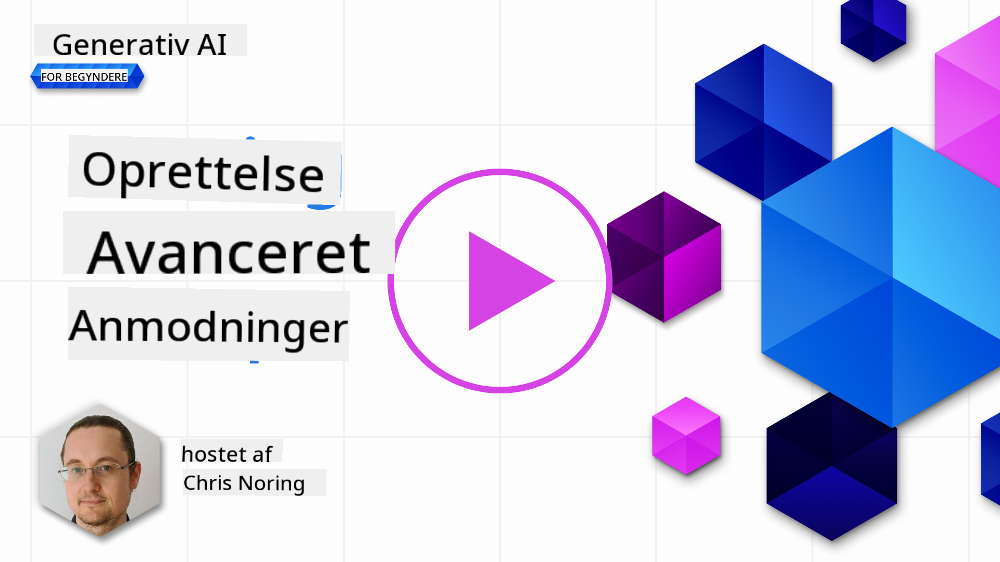

<!--
CO_OP_TRANSLATOR_METADATA:
{
  "original_hash": "b2651fb16bcfbc62b8e518751ed90fdb",
  "translation_date": "2025-10-17T19:07:17+00:00",
  "source_file": "05-advanced-prompts/README.md",
  "language_code": "da"
}
-->
# Oprettelse af avancerede prompts

[](https://youtu.be/BAjzkaCdRok?si=NmUIyRf7-cDgbjtt)

Lad os opsummere nogle af de ting, vi lærte i det forrige kapitel:

> Prompt _engineering_ er processen, hvor vi **leder modellen mod mere relevante svar** ved at give mere nyttige instruktioner eller kontekst.

Der er også to trin til at skrive prompts: at konstruere prompten ved at give relevant kontekst og _optimering_, hvordan man gradvist forbedrer prompten.

På nuværende tidspunkt har vi en grundlæggende forståelse af, hvordan man skriver prompts, men vi skal dykke dybere. I dette kapitel vil du gå fra at prøve forskellige prompts til at forstå, hvorfor én prompt er bedre end en anden. Du vil lære, hvordan man konstruerer prompts ved hjælp af nogle grundlæggende teknikker, der kan anvendes på enhver LLM.

## Introduktion

I dette kapitel vil vi dække følgende emner:

- Udvid din viden om prompt engineering ved at anvende forskellige teknikker på dine prompts.
- Konfigurér dine prompts til at variere output.

## Læringsmål

Efter at have gennemført denne lektion vil du kunne:

- Anvende prompt engineering-teknikker, der forbedrer resultatet af dine prompts.
- Udføre prompting, der enten er varieret eller deterministisk.

## Prompt engineering

Prompt engineering er processen med at skabe prompts, der vil producere det ønskede resultat. Der er mere til prompt engineering end blot at skrive en tekstprompt. Prompt engineering er ikke en ingeniørdisciplin, det er mere et sæt teknikker, du kan anvende for at opnå det ønskede resultat.

### Et eksempel på en prompt

Lad os tage en grundlæggende prompt som denne:

> Generér 10 spørgsmål om geografi.

I denne prompt anvender du faktisk et sæt forskellige prompt-teknikker.

Lad os bryde det ned.

- **Kontekst**, du specificerer, at det skal handle om "geografi".
- **Begrænsning af output**, du ønsker ikke mere end 10 spørgsmål.

### Begrænsninger ved simple prompts

Du får måske ikke det ønskede resultat. Du vil få dine spørgsmål genereret, men geografi er et stort emne, og du får måske ikke det, du ønsker, af følgende grunde:

- **Stort emne**, du ved ikke, om det vil handle om lande, hovedstæder, floder osv.
- **Format**, hvad hvis du ønskede, at spørgsmålene skulle være formateret på en bestemt måde?

Som du kan se, er der meget at overveje, når man skaber prompts.

Indtil videre har vi set et simpelt prompt-eksempel, men generativ AI er i stand til meget mere for at hjælpe folk i en række roller og industrier. Lad os udforske nogle grundlæggende teknikker næste.

### Teknikker til prompting

Først skal vi forstå, at prompting er en _emergent_ egenskab ved en LLM, hvilket betyder, at det ikke er en funktion, der er indbygget i modellen, men snarere noget, vi opdager, mens vi bruger modellen.

Der er nogle grundlæggende teknikker, vi kan bruge til at prompt en LLM. Lad os udforske dem.

- **Zero-shot prompting**, dette er den mest grundlæggende form for prompting. Det er en enkelt prompt, der anmoder om et svar fra LLM baseret udelukkende på dens træningsdata.
- **Few-shot prompting**, denne type prompting guider LLM ved at give 1 eller flere eksempler, den kan basere sig på for at generere sit svar.
- **Chain-of-thought**, denne type prompting fortæller LLM, hvordan man bryder et problem ned i trin.
- **Genereret viden**, for at forbedre svaret på en prompt kan du give genererede fakta eller viden som supplement til din prompt.
- **Mindst til mest**, ligesom chain-of-thought handler denne teknik om at bryde et problem ned i en række trin og derefter bede om, at disse trin udføres i rækkefølge.
- **Self-refine**, denne teknik handler om at kritisere LLM's output og derefter bede den om at forbedre det.
- **Maieutisk prompting**, her ønsker du at sikre, at LLM's svar er korrekt, og du beder den forklare forskellige dele af svaret. Dette er en form for self-refine.

### Zero-shot prompting

Denne stil af prompting er meget enkel, den består af en enkelt prompt. Denne teknik er sandsynligvis, hvad du bruger, når du begynder at lære om LLM'er. Her er et eksempel:

- Prompt: "Hvad er algebra?"
- Svar: "Algebra er en gren af matematik, der studerer matematiske symboler og reglerne for at manipulere disse symboler."

### Few-shot prompting

Denne stil af prompting hjælper modellen ved at give nogle få eksempler sammen med anmodningen. Den består af en enkelt prompt med yderligere opgavespecifikke data. Her er et eksempel:

- Prompt: "Skriv et digt i stil med Shakespeare. Her er nogle eksempler på Shakespeare-sonetter:
  Sonet 18: 'Skal jeg sammenligne dig med en sommerdag? Du er mere skøn og mere tempereret...'
  Sonet 116: 'Lad mig ikke til ægteskabet af sande sind Indrømme hindringer. Kærlighed er ikke kærlighed, Som ændrer sig, når den finder ændring...'
  Sonet 132: 'Dine øjne elsker jeg, og de, som har medlidenhed med mig, Ved dit hjerte plager mig med foragt,...'
  Nu, skriv en sonet om månens skønhed."
- Svar: "På himlen skinner månen blidt, I sølvlys, der kaster sin milde nåde,..."

Eksempler giver LLM konteksten, formatet eller stilen for det ønskede output. De hjælper modellen med at forstå den specifikke opgave og generere mere præcise og relevante svar.

### Chain-of-thought

Chain-of-thought er en meget interessant teknik, da den handler om at tage LLM gennem en række trin. Ideen er at instruere LLM på en sådan måde, at den forstår, hvordan man gør noget. Overvej følgende eksempel, med og uden chain-of-thought:

    - Prompt: "Alice har 5 æbler, kaster 3 æbler, giver 2 til Bob, og Bob giver et tilbage, hvor mange æbler har Alice?"
    - Svar: 5

LLM svarer med 5, hvilket er forkert. Det korrekte svar er 1 æble, givet beregningen (5 -3 -2 + 1 = 1).

Så hvordan kan vi lære LLM at gøre dette korrekt?

Lad os prøve chain-of-thought. Anvendelse af chain-of-thought betyder:

1. Giv LLM et lignende eksempel.
1. Vis beregningen, og hvordan man beregner det korrekt.
1. Giv den oprindelige prompt.

Her er hvordan:

- Prompt: "Lisa har 7 æbler, kaster 1 æble, giver 4 æbler til Bart, og Bart giver et tilbage:
  7 -1 = 6
  6 -4 = 2
  2 +1 = 3  
  Alice har 5 æbler, kaster 3 æbler, giver 2 til Bob, og Bob giver et tilbage, hvor mange æbler har Alice?"
  Svar: 1

Bemærk, hvordan vi skriver væsentligt længere prompts med et andet eksempel, en beregning og derefter den oprindelige prompt, og vi når frem til det korrekte svar 1.

Som du kan se, er chain-of-thought en meget kraftfuld teknik.

### Genereret viden

Mange gange, når du vil konstruere en prompt, ønsker du at gøre det ved hjælp af din egen virksomheds data. Du vil have en del af prompten til at komme fra virksomheden, og den anden del skal være den faktiske prompt, du er interesseret i.

Som et eksempel kan din prompt se sådan ud, hvis du er i forsikringsbranchen:

```text
{{company}}: {{company_name}}
{{products}}:
{{products_list}}
Please suggest an insurance given the following budget and requirements:
Budget: {{budget}}
Requirements: {{requirements}}
```

Ovenfor ser du, hvordan prompten er konstrueret ved hjælp af en skabelon. I skabelonen er der en række variabler, angivet med `{{variable}}`, som vil blive erstattet med faktiske værdier fra en virksomheds-API.

Her er et eksempel på, hvordan prompten kunne se ud, når variablerne er blevet erstattet med indhold fra din virksomhed:

```text
Insurance company: ACME Insurance
Insurance products (cost per month):
- Car, cheap, 500 USD
- Car, expensive, 1100 USD
- Home, cheap, 600 USD
- Home, expensive, 1200 USD
- Life, cheap, 100 USD

Please suggest an insurance given the following budget and requirements:
Budget: $1000
Requirements: Car, Home, and Life insurance
```

Når denne prompt køres gennem en LLM, vil den producere et svar som dette:

```output
Given the budget and requirements, we suggest the following insurance package from ACME Insurance:
- Car, cheap, 500 USD
- Home, cheap, 600 USD
- Life, cheap, 100 USD
Total cost: $1,200 USD
```

Som du kan se, foreslår den også livsforsikring, hvilket den ikke burde. Dette resultat er en indikation på, at vi skal optimere prompten ved at ændre den, så den er tydeligere om, hvad den kan tillade. Efter noget _trial and error_ når vi frem til følgende prompt:

```text
Insurance company: ACME Insurance
Insurance products (cost per month):
- type: Car, cheap, cost: 500 USD
- type: Car, expensive, cost: 1100 USD
- type: Home, cheap, cost: 600 USD
- type: Home, expensive, cost: 1200 USD
- type: Life, cheap, cost: 100 USD

Please suggest an insurance given the following budget and requirements:
Budget: $1000 restrict choice to types: Car, Home
```

Bemærk, hvordan tilføjelse af _type_ og _cost_ og også brugen af nøgleordet _restrict_ hjælper LLM med at forstå, hvad vi ønsker.

Nu får vi følgende svar:

```output
Given the budget and requirements, we suggest the Car, Cheap insurance product which costs 500 USD per month.
```

Pointen med dette eksempel var at vise, at selvom vi bruger en grundlæggende teknik som _genereret viden_, skal vi stadig optimere prompten i de fleste tilfælde for at få det ønskede resultat.

### Mindst til mest

Ideen med Mindst til mest prompting er at bryde et større problem ned i delproblemer. På den måde hjælper du med at guide LLM til at "erobre" det større problem. Et godt eksempel kunne være inden for data science, hvor du kan bede LLM om at dele et problem op som følger:

> Prompt: Hvordan udfører man data science i 5 trin?

Med din AI-assistent, der svarer med:

1. Indsamle data
1. Rense data
1. Analysere data
1. Visualisere data
1. Præsentere data

### Self-refine, kritiser resultaterne

Med generative AI'er og LLM'er kan du ikke stole blindt på output. Du skal verificere det. Trods alt præsenterer LLM'en dig kun det, der mest sandsynligt kommer næste, ikke nødvendigvis det, der er korrekt. Derfor er det en god idé at bede LLM om at kritisere sig selv, hvilket fører os til self-refine teknikken.

Sådan fungerer det:

1. Indledende prompt, der beder LLM om at løse et problem
1. LLM svarer
1. Du kritiserer svaret og beder AI'en om at forbedre det
1. LLM svarer igen, denne gang med hensyntagen til kritikken og foreslår løsninger, den er kommet frem til

Du kan gentage denne proces så mange gange, du vil.

Her er et eksempel, der bruger denne teknik:

> Prompt: "Opret en Python Web API med ruter for produkter og kunder"

AI-svar:

```python
import flask
app = Flask(__name__)

@app.route('/products')
def products():
    return 'Products'

@app.route('/customers')
def customers():
    return 'Customers'
```

> Prompt: foreslå 3 forbedringer af ovenstående kode

AI-svar:

```text
Sure, here are three suggestions to improve the code:

Import the correct module: The first line should import Flask instead of flask. The correct import statement should be from flask import Flask.

Add a main function: Add a if __name__ == '__main__': block to the end of the file to run the application when the file is executed.

Use f-strings: Use f-strings to format the return statements in the route functions. For example, return 'Products' can be changed to return f'This is the {request.path} page'.
```

```python
from flask import Flask, request

app = Flask(__name__)

@app.route('/products')
def products():
    return f'This is the {request.path} page'

@app.route('/customers')
def customers():
    return f'This is the {request.path} page'

if __name__ == '__main__':
    app.run()
```

Som du kan se, forbedrer det ovenstående AI-svar den første foreslåede kode takket være kritikken af det første svar.

### Maieutisk prompting

Maieutisk prompting er en teknik, der ligner self-refine, men det handler mere om at bede LLM om at forklare sig selv. Målet er at reducere inkonsistenser i LLM's output for at sikre, at det når frem til det korrekte svar. Arbejdsgangen, der skal følges, er:

1. Bed LLM om at besvare et spørgsmål
1. For hver del af svaret, bed LLM om at forklare det mere detaljeret.
1. Hvis der er inkonsistenser, kassér de dele, der er inkonsistente.

Gentag 2 og 3, indtil du har gennemgået alle dele og er tilfreds med svaret.

Her er et eksempel på en prompt:

> prompt: Hvordan kan jeg oprette en kriseplan for at afbøde en pandemi i 5 trin?
> LLM-svar:

```text
1. Identify the risks
1. Identify the stakeholders
1. Identify the resources
1. Identify the actions
1. Identify the communication channels
```

Den har identificeret 5 trin, men kan vi afgøre, om dette er korrekt? Lad os bede LLM om at forklare hvert trin mere detaljeret:

> prompt: Forklar det første trin mere detaljeret, hvad er risiciene i detaljer ved en pandemi?

```text
The risks are the following:

- Loss of life
- Loss of business
- Loss of reputation
- Loss of customers
- Loss of employees
```

På dette tidspunkt vil vi sikre os, at LLM er korrekt, så vi beder den om at forklare den første risiko mere detaljeret og håber, at det er konsistent med svaret ovenfor:

> prompt: I en pandemi, hvad er den største risiko og hvorfor?

```text
The biggest risk is loss of life because it's the most important thing to protect.
```

> Hvad er de to største risici i en pandemi?

```text
The two biggest risks are loss of life and loss of business.
```

På dette tidspunkt er LLM konsistent og nævner "liv" og "forretning" som de to største risici. Vi kan nu fortsætte til næste trin og føle os ret sikre. Men vi bør ikke stole blindt på LLM, vi bør altid verificere output.

## Variér dit output

LLM'er er ikke-deterministiske af natur, hvilket betyder, at du vil få forskellige resultater hver gang du kører den samme prompt. Prøv for eksempel følgende prompt:

> "Generér kode til en Python Web API"

```python
# Import necessary modules
import flask
from flask import request, jsonify

# Create a Flask app
app = flask.Flask(__name__)

# Create a route for the API
@app.route('/api', methods=['GET'])
def api():
    # Get the data from the request
    data = request.args

    # Process the data
    result = process_data(data)

    # Return the result as JSON
    return jsonify(result)

# Function to process the data
def process_data(data):
    # Do something with the data
    result = data + 1

    # Return the result
    return result

# Run the app
if __name__ == '__main__':
    app.run()

```

At køre den samme prompt igen genererer et lidt anderledes svar:

```python
#import necessary packages
import flask
from flask import request, jsonify

#create the Flask application
app = flask.Flask(__name__)
app.config["DEBUG"] = True

#create a list of books
books = [
    {'id': 0,
     'title': 'A Fire Upon the Deep',
     'author': 'Vernor Vinge',
     'first_sentence': 'The coldsleep itself was dreamless.',
     'year_published': '1992'},
    {'id': 1,
     'title': 'The Ones Who Walk Away From Omelas',
     'author': 'Ursula K. Le Guin',
     'first_sentence': 'With a clamor of bells that set the swallows soaring, the Festival of Summer came to the city Omelas, bright-towered by the sea.',
     'published': '1973'},
    {'id': 2,
     'title': 'Dhalgren',
     'author': 'Samuel R. Delany',
     'first_sentence': 'to wound the autumnal city.',
     'published': '1975'}
]

#create an endpoint for the API
@app.route('/', methods=['GET'])
def home():
    return '''<h1>Books API</h1>
<p>A prototype API for retrieving books.</p>'''

#create an endpoint to return all books
@app.route('/api/v1/resources/books/all', methods=['GET'])
def api_all():
    return jsonify(books)

#create an endpoint to return a single book
@app.route('/api/v1/resources/books', methods=['GET'])
def api_id():
    #check if an ID was provided as part of the URL
    #if ID is provided, assign it to a variable
    #if no ID is provided, display an error
    if 'id' in request.args:
        id = int(request.args['id'])
    else:
        return "Error: No id field provided. Please specify an id."

    #create an empty list for our results
    results = []

    #loop through the data and match results that fit the requested ID
    #IDs are unique, but other fields might return many results
    for book in books:
        if book['id'] == id:
            results.append(book)

    #use the jsonify function from Flask to convert our list of
    #Python dictionaries to the JSON format
    return jsonify(results)

app.run()
```

> Så er det varierede output et problem?

Det afhænger af, hvad du prøver at gøre. Hvis du ønsker et specifikt svar, er det et problem. Hvis du er okay med et varieret output som "Generér 3 spørgsmål om geografi", så er det ikke et problem.

### Brug af temperatur til at variere dit output

Okay, så vi har besluttet, at vi vil begrænse output til at være mere forudsigeligt, det vil sige mere deterministisk. Hvordan gør vi det?

Temperatur er en værdi mellem 0 og 1, hvor 0 er det mest deterministiske og 1 er det mest varierede. Standardværdien er 0.7. Lad os se, hvad der sker med to kørsel af den samme prompt med temperaturen sat til 0.1:

> "Generér kode til en Python Web API"

```python
#import necessary libraries
import flask
from flask import request, jsonify

#create an instance of the Flask class
app = flask.Flask(__name__)

#create an endpoint for the API
@app.route('/api/v1/endpoint', methods=['GET'])
def api_endpoint():
    #get the request data
    data = request.get_json()

    #process the data
    result = process_data(data)

    #return the result
    return jsonify(result)

#function to process the data
def process_data(data):
    #process the data
    result = {'result': 'success'}

    #return the result
    return result

#run the Flask app
if __name__ == '__main__':
    app.run()

```

At køre prompten igen giver os dette resultat:

```python
#import necessary libraries
import flask
from flask import request, jsonify

#create a Flask app
app = flask.Flask(__name__)

#create a route for the API
@app.route('/api', methods=['GET'])
def api_call():
    #get the data from the request
    data = request.get_json()

    #process the data
    result = process_data(data)

    #return the result
    return jsonify(result)

#define the process_data function
def process_data(data):
    #do something with the data
    result = data + 1

    #return the result
    return result

#run the app
if __name__ == '__main__':
    app.run()

```

Der er kun en lille forskel mellem disse to outputs. Lad os gøre det modsatte denne gang, lad os sætte temperaturen til 0.9:

```python
# Import necessary libraries
import flask
from flask import request, jsonify

# Create a Flask app
app = flask.Flask(__name__)

# Create a route for the API
@app.route('/api', methods=['GET'])
def api_call():
    # Get the data from the request
    data = request.args

    # Process the data
    result = process_data(data)

    # Return the result
    return jsonify(result)

# Function to process the data
def process_data(data):
    # Do something with the data
    result = data + 1

    # Return the result
    return result

# Run the app
if __name__ == '__main__':
    app.run()

```

og det andet forsøg med 0.9 som temperaturværdi:

```python
import flask
from flask import request, jsonify

# create the Flask app
app = flask.Flask(__name__)
app.config['DEBUG'] = True

# create some test data
books = [
    {'id': 0, 'title': 'A Fire Upon The Deep', 'author': 'Vernor Vinge', 'first_sentence': 'The coldsleep itself was dreamless.', 'year_published': '1992'},
    {'id': 1, 'title': 'The Ones Who Walk Away From Omelas', 'author': 'Ursula K. Le Guin', 'first_sentence': 'With a clamor of bells that set the swallows soaring, the Festival of Summer came to the city Omelas, bright-towered by the sea.', 'published': '1973'},
    {'id': 2, 'title': 'Dhalgren', 'author': 'Samuel R. Delany', 'first_sentence': 'to wound the autumnal city.', 'published': '1975'}
]

# create an endpoint
@app.route('/', methods=['GET'])
def home():
    return '''<h1>Welcome to our book API!</h1>'''

@app.route('/api/v1/resources/books

```

Som du kan se, kunne resultaterne ikke være mere forskellige.

> Bemærk, at der er flere parametre, du kan ændre for at variere output, såsom top-k, top-p, gentagelsesstraf, længdestraf og diversitetsstraf, men disse ligger uden for denne lektions omfang.

## Gode praksisser

Der er mange metoder, du kan anvende for at opnå det ønskede resultat. Du vil finde din egen stil, jo mere du bruger prompting.

Ud over de teknikker, vi har dækket, er der nogle gode praksisser at overveje, når du arbejder med en LLM.

Her er nogle gode praksisser at tage i betragtning:

- **Angiv kontekst**. Kontekst er vigtigt; jo mere du kan specificere som domæne, emne osv., jo bedre.
- Begræns output. Hvis du ønsker et specifikt antal elementer eller en bestemt længde, så angiv det.
- **Angiv både hvad og hvordan**. Husk at nævne både hvad du vil have, og hvordan du vil have det, for eksempel "Opret en Python Web API med ruter for produkter og kunder, del det op i 3 filer".
- **Brug skabeloner**. Ofte vil du berige dine prompts med data fra din virksomhed. Brug skabeloner til dette. Skabeloner kan have variabler, som du erstatter med faktiske data.
- **Stav korrekt**. LLM'er kan give dig et korrekt svar, men hvis du staver korrekt, får du et bedre svar.

## Opgave

Her er kode i Python, der viser, hvordan man bygger en simpel API ved hjælp af Flask:

```python
from flask import Flask, request

app = Flask(__name__)

@app.route('/')
def hello():
    name = request.args.get('name', 'World')
    return f'Hello, {name}!'

if __name__ == '__main__':
    app.run()
```

Brug en AI-assistent som GitHub Copilot eller ChatGPT og anvend "self-refine"-teknikken til at forbedre koden.

## Løsning

Prøv at løse opgaven ved at tilføje passende prompts til koden.

> [!TIP]
> Formuler en prompt for at bede om forbedringer; det er en god idé at begrænse, hvor mange forbedringer der skal laves. Du kan også bede om forbedringer på en bestemt måde, for eksempel arkitektur, ydeevne, sikkerhed osv.

[Løsning](../../../05-advanced-prompts/python/aoai-solution.py)

## Videnscheck

Hvorfor ville jeg bruge chain-of-thought prompting? Vis mig 1 korrekt svar og 2 forkerte svar.

1. For at lære LLM'en, hvordan man løser et problem.
1. B, For at lære LLM'en at finde fejl i kode.
1. C, For at instruere LLM'en i at komme med forskellige løsninger.

A: 1, fordi chain-of-thought handler om at vise LLM'en, hvordan man løser et problem ved at give den en række trin, og lignende problemer og hvordan de blev løst.

## 🚀 Udfordring

Du har lige brugt self-refine-teknikken i opgaven. Tag et hvilket som helst program, du har bygget, og overvej, hvilke forbedringer du gerne vil anvende på det. Brug nu self-refine-teknikken til at implementere de foreslåede ændringer. Hvad syntes du om resultatet, bedre eller dårligere?

## Godt arbejde! Fortsæt din læring

Efter at have afsluttet denne lektion, kan du tjekke vores [Generative AI Learning-samling](https://aka.ms/genai-collection?WT.mc_id=academic-105485-koreyst) for at fortsætte med at opbygge din viden om Generative AI!

Gå videre til Lektion 6, hvor vi vil anvende vores viden om Prompt Engineering ved [at bygge tekstgenereringsapps](../06-text-generation-apps/README.md?WT.mc_id=academic-105485-koreyst)

---

**Ansvarsfraskrivelse**:  
Dette dokument er blevet oversat ved hjælp af AI-oversættelsestjenesten [Co-op Translator](https://github.com/Azure/co-op-translator). Selvom vi bestræber os på nøjagtighed, skal det bemærkes, at automatiserede oversættelser kan indeholde fejl eller unøjagtigheder. Det originale dokument på dets oprindelige sprog bør betragtes som den autoritative kilde. For kritisk information anbefales professionel menneskelig oversættelse. Vi er ikke ansvarlige for eventuelle misforståelser eller fejltolkninger, der opstår som følge af brugen af denne oversættelse.