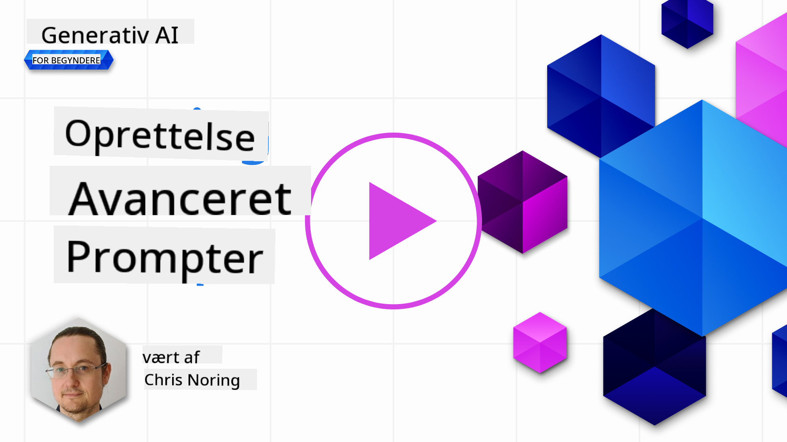

<!--
CO_OP_TRANSLATOR_METADATA:
{
  "original_hash": "b2651fb16bcfbc62b8e518751ed90fdb",
  "translation_date": "2025-10-17T19:07:17+00:00",
  "source_file": "05-advanced-prompts/README.md",
  "language_code": "da"
}
-->
# Oprettelse af avancerede prompts

[](https://youtu.be/BAjzkaCdRok?si=NmUIyRf7-cDgbjtt)

Lad os opsummere nogle af de ting, vi l칝rte i det forrige kapitel:

> Prompt _engineering_ er processen, hvor vi **leder modellen mod mere relevante svar** ved at give mere nyttige instruktioner eller kontekst.

Der er ogs친 to trin til at skrive prompts: at konstruere prompten ved at give relevant kontekst og _optimering_, hvordan man gradvist forbedrer prompten.

P친 nuv칝rende tidspunkt har vi en grundl칝ggende forst친else af, hvordan man skriver prompts, men vi skal dykke dybere. I dette kapitel vil du g친 fra at pr칮ve forskellige prompts til at forst친, hvorfor 칠n prompt er bedre end en anden. Du vil l칝re, hvordan man konstruerer prompts ved hj칝lp af nogle grundl칝ggende teknikker, der kan anvendes p친 enhver LLM.

## Introduktion

I dette kapitel vil vi d칝kke f칮lgende emner:

- Udvid din viden om prompt engineering ved at anvende forskellige teknikker p친 dine prompts.
- Konfigur칠r dine prompts til at variere output.

## L칝ringsm친l

Efter at have gennemf칮rt denne lektion vil du kunne:

- Anvende prompt engineering-teknikker, der forbedrer resultatet af dine prompts.
- Udf칮re prompting, der enten er varieret eller deterministisk.

## Prompt engineering

Prompt engineering er processen med at skabe prompts, der vil producere det 칮nskede resultat. Der er mere til prompt engineering end blot at skrive en tekstprompt. Prompt engineering er ikke en ingeni칮rdisciplin, det er mere et s칝t teknikker, du kan anvende for at opn친 det 칮nskede resultat.

### Et eksempel p친 en prompt

Lad os tage en grundl칝ggende prompt som denne:

> Gener칠r 10 sp칮rgsm친l om geografi.

I denne prompt anvender du faktisk et s칝t forskellige prompt-teknikker.

Lad os bryde det ned.

- **Kontekst**, du specificerer, at det skal handle om "geografi".
- **Begr칝nsning af output**, du 칮nsker ikke mere end 10 sp칮rgsm친l.

### Begr칝nsninger ved simple prompts

Du f친r m친ske ikke det 칮nskede resultat. Du vil f친 dine sp칮rgsm친l genereret, men geografi er et stort emne, og du f친r m친ske ikke det, du 칮nsker, af f칮lgende grunde:

- **Stort emne**, du ved ikke, om det vil handle om lande, hovedst칝der, floder osv.
- **Format**, hvad hvis du 칮nskede, at sp칮rgsm친lene skulle v칝re formateret p친 en bestemt m친de?

Som du kan se, er der meget at overveje, n친r man skaber prompts.

Indtil videre har vi set et simpelt prompt-eksempel, men generativ AI er i stand til meget mere for at hj칝lpe folk i en r칝kke roller og industrier. Lad os udforske nogle grundl칝ggende teknikker n칝ste.

### Teknikker til prompting

F칮rst skal vi forst친, at prompting er en _emergent_ egenskab ved en LLM, hvilket betyder, at det ikke er en funktion, der er indbygget i modellen, men snarere noget, vi opdager, mens vi bruger modellen.

Der er nogle grundl칝ggende teknikker, vi kan bruge til at prompt en LLM. Lad os udforske dem.

- **Zero-shot prompting**, dette er den mest grundl칝ggende form for prompting. Det er en enkelt prompt, der anmoder om et svar fra LLM baseret udelukkende p친 dens tr칝ningsdata.
- **Few-shot prompting**, denne type prompting guider LLM ved at give 1 eller flere eksempler, den kan basere sig p친 for at generere sit svar.
- **Chain-of-thought**, denne type prompting fort칝ller LLM, hvordan man bryder et problem ned i trin.
- **Genereret viden**, for at forbedre svaret p친 en prompt kan du give genererede fakta eller viden som supplement til din prompt.
- **Mindst til mest**, ligesom chain-of-thought handler denne teknik om at bryde et problem ned i en r칝kke trin og derefter bede om, at disse trin udf칮res i r칝kkef칮lge.
- **Self-refine**, denne teknik handler om at kritisere LLM's output og derefter bede den om at forbedre det.
- **Maieutisk prompting**, her 칮nsker du at sikre, at LLM's svar er korrekt, og du beder den forklare forskellige dele af svaret. Dette er en form for self-refine.

### Zero-shot prompting

Denne stil af prompting er meget enkel, den best친r af en enkelt prompt. Denne teknik er sandsynligvis, hvad du bruger, n친r du begynder at l칝re om LLM'er. Her er et eksempel:

- Prompt: "Hvad er algebra?"
- Svar: "Algebra er en gren af matematik, der studerer matematiske symboler og reglerne for at manipulere disse symboler."

### Few-shot prompting

Denne stil af prompting hj칝lper modellen ved at give nogle f친 eksempler sammen med anmodningen. Den best친r af en enkelt prompt med yderligere opgavespecifikke data. Her er et eksempel:

- Prompt: "Skriv et digt i stil med Shakespeare. Her er nogle eksempler p친 Shakespeare-sonetter:
  Sonet 18: 'Skal jeg sammenligne dig med en sommerdag? Du er mere sk칮n og mere tempereret...'
  Sonet 116: 'Lad mig ikke til 칝gteskabet af sande sind Indr칮mme hindringer. K칝rlighed er ikke k칝rlighed, Som 칝ndrer sig, n친r den finder 칝ndring...'
  Sonet 132: 'Dine 칮jne elsker jeg, og de, som har medlidenhed med mig, Ved dit hjerte plager mig med foragt,...'
  Nu, skriv en sonet om m친nens sk칮nhed."
- Svar: "P친 himlen skinner m친nen blidt, I s칮lvlys, der kaster sin milde n친de,..."

Eksempler giver LLM konteksten, formatet eller stilen for det 칮nskede output. De hj칝lper modellen med at forst친 den specifikke opgave og generere mere pr칝cise og relevante svar.

### Chain-of-thought

Chain-of-thought er en meget interessant teknik, da den handler om at tage LLM gennem en r칝kke trin. Ideen er at instruere LLM p친 en s친dan m친de, at den forst친r, hvordan man g칮r noget. Overvej f칮lgende eksempel, med og uden chain-of-thought:

    - Prompt: "Alice har 5 칝bler, kaster 3 칝bler, giver 2 til Bob, og Bob giver et tilbage, hvor mange 칝bler har Alice?"
    - Svar: 5

LLM svarer med 5, hvilket er forkert. Det korrekte svar er 1 칝ble, givet beregningen (5 -3 -2 + 1 = 1).

S친 hvordan kan vi l칝re LLM at g칮re dette korrekt?

Lad os pr칮ve chain-of-thought. Anvendelse af chain-of-thought betyder:

1. Giv LLM et lignende eksempel.
1. Vis beregningen, og hvordan man beregner det korrekt.
1. Giv den oprindelige prompt.

Her er hvordan:

- Prompt: "Lisa har 7 칝bler, kaster 1 칝ble, giver 4 칝bler til Bart, og Bart giver et tilbage:
  7 -1 = 6
  6 -4 = 2
  2 +1 = 3  
  Alice har 5 칝bler, kaster 3 칝bler, giver 2 til Bob, og Bob giver et tilbage, hvor mange 칝bler har Alice?"
  Svar: 1

Bem칝rk, hvordan vi skriver v칝sentligt l칝ngere prompts med et andet eksempel, en beregning og derefter den oprindelige prompt, og vi n친r frem til det korrekte svar 1.

Som du kan se, er chain-of-thought en meget kraftfuld teknik.

### Genereret viden

Mange gange, n친r du vil konstruere en prompt, 칮nsker du at g칮re det ved hj칝lp af din egen virksomheds data. Du vil have en del af prompten til at komme fra virksomheden, og den anden del skal v칝re den faktiske prompt, du er interesseret i.

Som et eksempel kan din prompt se s친dan ud, hvis du er i forsikringsbranchen:

```text
{{company}}: {{company_name}}
{{products}}:
{{products_list}}
Please suggest an insurance given the following budget and requirements:
Budget: {{budget}}
Requirements: {{requirements}}
```

Ovenfor ser du, hvordan prompten er konstrueret ved hj칝lp af en skabelon. I skabelonen er der en r칝kke variabler, angivet med `{{variable}}`, som vil blive erstattet med faktiske v칝rdier fra en virksomheds-API.

Her er et eksempel p친, hvordan prompten kunne se ud, n친r variablerne er blevet erstattet med indhold fra din virksomhed:

```text
Insurance company: ACME Insurance
Insurance products (cost per month):
- Car, cheap, 500 USD
- Car, expensive, 1100 USD
- Home, cheap, 600 USD
- Home, expensive, 1200 USD
- Life, cheap, 100 USD

Please suggest an insurance given the following budget and requirements:
Budget: $1000
Requirements: Car, Home, and Life insurance
```

N친r denne prompt k칮res gennem en LLM, vil den producere et svar som dette:

```output
Given the budget and requirements, we suggest the following insurance package from ACME Insurance:
- Car, cheap, 500 USD
- Home, cheap, 600 USD
- Life, cheap, 100 USD
Total cost: $1,200 USD
```

Som du kan se, foresl친r den ogs친 livsforsikring, hvilket den ikke burde. Dette resultat er en indikation p친, at vi skal optimere prompten ved at 칝ndre den, s친 den er tydeligere om, hvad den kan tillade. Efter noget _trial and error_ n친r vi frem til f칮lgende prompt:

```text
Insurance company: ACME Insurance
Insurance products (cost per month):
- type: Car, cheap, cost: 500 USD
- type: Car, expensive, cost: 1100 USD
- type: Home, cheap, cost: 600 USD
- type: Home, expensive, cost: 1200 USD
- type: Life, cheap, cost: 100 USD

Please suggest an insurance given the following budget and requirements:
Budget: $1000 restrict choice to types: Car, Home
```

Bem칝rk, hvordan tilf칮jelse af _type_ og _cost_ og ogs친 brugen af n칮gleordet _restrict_ hj칝lper LLM med at forst친, hvad vi 칮nsker.

Nu f친r vi f칮lgende svar:

```output
Given the budget and requirements, we suggest the Car, Cheap insurance product which costs 500 USD per month.
```

Pointen med dette eksempel var at vise, at selvom vi bruger en grundl칝ggende teknik som _genereret viden_, skal vi stadig optimere prompten i de fleste tilf칝lde for at f친 det 칮nskede resultat.

### Mindst til mest

Ideen med Mindst til mest prompting er at bryde et st칮rre problem ned i delproblemer. P친 den m친de hj칝lper du med at guide LLM til at "erobre" det st칮rre problem. Et godt eksempel kunne v칝re inden for data science, hvor du kan bede LLM om at dele et problem op som f칮lger:

> Prompt: Hvordan udf칮rer man data science i 5 trin?

Med din AI-assistent, der svarer med:

1. Indsamle data
1. Rense data
1. Analysere data
1. Visualisere data
1. Pr칝sentere data

### Self-refine, kritiser resultaterne

Med generative AI'er og LLM'er kan du ikke stole blindt p친 output. Du skal verificere det. Trods alt pr칝senterer LLM'en dig kun det, der mest sandsynligt kommer n칝ste, ikke n칮dvendigvis det, der er korrekt. Derfor er det en god id칠 at bede LLM om at kritisere sig selv, hvilket f칮rer os til self-refine teknikken.

S친dan fungerer det:

1. Indledende prompt, der beder LLM om at l칮se et problem
1. LLM svarer
1. Du kritiserer svaret og beder AI'en om at forbedre det
1. LLM svarer igen, denne gang med hensyntagen til kritikken og foresl친r l칮sninger, den er kommet frem til

Du kan gentage denne proces s친 mange gange, du vil.

Her er et eksempel, der bruger denne teknik:

> Prompt: "Opret en Python Web API med ruter for produkter og kunder"

AI-svar:

```python
import flask
app = Flask(__name__)

@app.route('/products')
def products():
    return 'Products'

@app.route('/customers')
def customers():
    return 'Customers'
```

> Prompt: foresl친 3 forbedringer af ovenst친ende kode

AI-svar:

```text
Sure, here are three suggestions to improve the code:

Import the correct module: The first line should import Flask instead of flask. The correct import statement should be from flask import Flask.

Add a main function: Add a if __name__ == '__main__': block to the end of the file to run the application when the file is executed.

Use f-strings: Use f-strings to format the return statements in the route functions. For example, return 'Products' can be changed to return f'This is the {request.path} page'.
```

```python
from flask import Flask, request

app = Flask(__name__)

@app.route('/products')
def products():
    return f'This is the {request.path} page'

@app.route('/customers')
def customers():
    return f'This is the {request.path} page'

if __name__ == '__main__':
    app.run()
```

Som du kan se, forbedrer det ovenst친ende AI-svar den f칮rste foresl친ede kode takket v칝re kritikken af det f칮rste svar.

### Maieutisk prompting

Maieutisk prompting er en teknik, der ligner self-refine, men det handler mere om at bede LLM om at forklare sig selv. M친let er at reducere inkonsistenser i LLM's output for at sikre, at det n친r frem til det korrekte svar. Arbejdsgangen, der skal f칮lges, er:

1. Bed LLM om at besvare et sp칮rgsm친l
1. For hver del af svaret, bed LLM om at forklare det mere detaljeret.
1. Hvis der er inkonsistenser, kass칠r de dele, der er inkonsistente.

Gentag 2 og 3, indtil du har gennemg친et alle dele og er tilfreds med svaret.

Her er et eksempel p친 en prompt:

> prompt: Hvordan kan jeg oprette en kriseplan for at afb칮de en pandemi i 5 trin?
> LLM-svar:

```text
1. Identify the risks
1. Identify the stakeholders
1. Identify the resources
1. Identify the actions
1. Identify the communication channels
```

Den har identificeret 5 trin, men kan vi afg칮re, om dette er korrekt? Lad os bede LLM om at forklare hvert trin mere detaljeret:

> prompt: Forklar det f칮rste trin mere detaljeret, hvad er risiciene i detaljer ved en pandemi?

```text
The risks are the following:

- Loss of life
- Loss of business
- Loss of reputation
- Loss of customers
- Loss of employees
```

P친 dette tidspunkt vil vi sikre os, at LLM er korrekt, s친 vi beder den om at forklare den f칮rste risiko mere detaljeret og h친ber, at det er konsistent med svaret ovenfor:

> prompt: I en pandemi, hvad er den st칮rste risiko og hvorfor?

```text
The biggest risk is loss of life because it's the most important thing to protect.
```

> Hvad er de to st칮rste risici i en pandemi?

```text
The two biggest risks are loss of life and loss of business.
```

P친 dette tidspunkt er LLM konsistent og n칝vner "liv" og "forretning" som de to st칮rste risici. Vi kan nu forts칝tte til n칝ste trin og f칮le os ret sikre. Men vi b칮r ikke stole blindt p친 LLM, vi b칮r altid verificere output.

## Vari칠r dit output

LLM'er er ikke-deterministiske af natur, hvilket betyder, at du vil f친 forskellige resultater hver gang du k칮rer den samme prompt. Pr칮v for eksempel f칮lgende prompt:

> "Gener칠r kode til en Python Web API"

```python
# Import necessary modules
import flask
from flask import request, jsonify

# Create a Flask app
app = flask.Flask(__name__)

# Create a route for the API
@app.route('/api', methods=['GET'])
def api():
    # Get the data from the request
    data = request.args

    # Process the data
    result = process_data(data)

    # Return the result as JSON
    return jsonify(result)

# Function to process the data
def process_data(data):
    # Do something with the data
    result = data + 1

    # Return the result
    return result

# Run the app
if __name__ == '__main__':
    app.run()

```

At k칮re den samme prompt igen genererer et lidt anderledes svar:

```python
#import necessary packages
import flask
from flask import request, jsonify

#create the Flask application
app = flask.Flask(__name__)
app.config["DEBUG"] = True

#create a list of books
books = [
    {'id': 0,
     'title': 'A Fire Upon the Deep',
     'author': 'Vernor Vinge',
     'first_sentence': 'The coldsleep itself was dreamless.',
     'year_published': '1992'},
    {'id': 1,
     'title': 'The Ones Who Walk Away From Omelas',
     'author': 'Ursula K. Le Guin',
     'first_sentence': 'With a clamor of bells that set the swallows soaring, the Festival of Summer came to the city Omelas, bright-towered by the sea.',
     'published': '1973'},
    {'id': 2,
     'title': 'Dhalgren',
     'author': 'Samuel R. Delany',
     'first_sentence': 'to wound the autumnal city.',
     'published': '1975'}
]

#create an endpoint for the API
@app.route('/', methods=['GET'])
def home():
    return '''<h1>Books API</h1>
<p>A prototype API for retrieving books.</p>'''

#create an endpoint to return all books
@app.route('/api/v1/resources/books/all', methods=['GET'])
def api_all():
    return jsonify(books)

#create an endpoint to return a single book
@app.route('/api/v1/resources/books', methods=['GET'])
def api_id():
    #check if an ID was provided as part of the URL
    #if ID is provided, assign it to a variable
    #if no ID is provided, display an error
    if 'id' in request.args:
        id = int(request.args['id'])
    else:
        return "Error: No id field provided. Please specify an id."

    #create an empty list for our results
    results = []

    #loop through the data and match results that fit the requested ID
    #IDs are unique, but other fields might return many results
    for book in books:
        if book['id'] == id:
            results.append(book)

    #use the jsonify function from Flask to convert our list of
    #Python dictionaries to the JSON format
    return jsonify(results)

app.run()
```

> S친 er det varierede output et problem?

Det afh칝nger af, hvad du pr칮ver at g칮re. Hvis du 칮nsker et specifikt svar, er det et problem. Hvis du er okay med et varieret output som "Gener칠r 3 sp칮rgsm친l om geografi", s친 er det ikke et problem.

### Brug af temperatur til at variere dit output

Okay, s친 vi har besluttet, at vi vil begr칝nse output til at v칝re mere forudsigeligt, det vil sige mere deterministisk. Hvordan g칮r vi det?

Temperatur er en v칝rdi mellem 0 og 1, hvor 0 er det mest deterministiske og 1 er det mest varierede. Standardv칝rdien er 0.7. Lad os se, hvad der sker med to k칮rsel af den samme prompt med temperaturen sat til 0.1:

> "Gener칠r kode til en Python Web API"

```python
#import necessary libraries
import flask
from flask import request, jsonify

#create an instance of the Flask class
app = flask.Flask(__name__)

#create an endpoint for the API
@app.route('/api/v1/endpoint', methods=['GET'])
def api_endpoint():
    #get the request data
    data = request.get_json()

    #process the data
    result = process_data(data)

    #return the result
    return jsonify(result)

#function to process the data
def process_data(data):
    #process the data
    result = {'result': 'success'}

    #return the result
    return result

#run the Flask app
if __name__ == '__main__':
    app.run()

```

At k칮re prompten igen giver os dette resultat:

```python
#import necessary libraries
import flask
from flask import request, jsonify

#create a Flask app
app = flask.Flask(__name__)

#create a route for the API
@app.route('/api', methods=['GET'])
def api_call():
    #get the data from the request
    data = request.get_json()

    #process the data
    result = process_data(data)

    #return the result
    return jsonify(result)

#define the process_data function
def process_data(data):
    #do something with the data
    result = data + 1

    #return the result
    return result

#run the app
if __name__ == '__main__':
    app.run()

```

Der er kun en lille forskel mellem disse to outputs. Lad os g칮re det modsatte denne gang, lad os s칝tte temperaturen til 0.9:

```python
# Import necessary libraries
import flask
from flask import request, jsonify

# Create a Flask app
app = flask.Flask(__name__)

# Create a route for the API
@app.route('/api', methods=['GET'])
def api_call():
    # Get the data from the request
    data = request.args

    # Process the data
    result = process_data(data)

    # Return the result
    return jsonify(result)

# Function to process the data
def process_data(data):
    # Do something with the data
    result = data + 1

    # Return the result
    return result

# Run the app
if __name__ == '__main__':
    app.run()

```

og det andet fors칮g med 0.9 som temperaturv칝rdi:

```python
import flask
from flask import request, jsonify

# create the Flask app
app = flask.Flask(__name__)
app.config['DEBUG'] = True

# create some test data
books = [
    {'id': 0, 'title': 'A Fire Upon The Deep', 'author': 'Vernor Vinge', 'first_sentence': 'The coldsleep itself was dreamless.', 'year_published': '1992'},
    {'id': 1, 'title': 'The Ones Who Walk Away From Omelas', 'author': 'Ursula K. Le Guin', 'first_sentence': 'With a clamor of bells that set the swallows soaring, the Festival of Summer came to the city Omelas, bright-towered by the sea.', 'published': '1973'},
    {'id': 2, 'title': 'Dhalgren', 'author': 'Samuel R. Delany', 'first_sentence': 'to wound the autumnal city.', 'published': '1975'}
]

# create an endpoint
@app.route('/', methods=['GET'])
def home():
    return '''<h1>Welcome to our book API!</h1>'''

@app.route('/api/v1/resources/books

```

Som du kan se, kunne resultaterne ikke v칝re mere forskellige.

> Bem칝rk, at der er flere parametre, du kan 칝ndre for at variere output, s친som top-k, top-p, gentagelsesstraf, l칝ngdestraf og diversitetsstraf, men disse ligger uden for denne lektions omfang.

## Gode praksisser

Der er mange metoder, du kan anvende for at opn친 det 칮nskede resultat. Du vil finde din egen stil, jo mere du bruger prompting.

Ud over de teknikker, vi har d칝kket, er der nogle gode praksisser at overveje, n친r du arbejder med en LLM.

Her er nogle gode praksisser at tage i betragtning:

- **Angiv kontekst**. Kontekst er vigtigt; jo mere du kan specificere som dom칝ne, emne osv., jo bedre.
- Begr칝ns output. Hvis du 칮nsker et specifikt antal elementer eller en bestemt l칝ngde, s친 angiv det.
- **Angiv b친de hvad og hvordan**. Husk at n칝vne b친de hvad du vil have, og hvordan du vil have det, for eksempel "Opret en Python Web API med ruter for produkter og kunder, del det op i 3 filer".
- **Brug skabeloner**. Ofte vil du berige dine prompts med data fra din virksomhed. Brug skabeloner til dette. Skabeloner kan have variabler, som du erstatter med faktiske data.
- **Stav korrekt**. LLM'er kan give dig et korrekt svar, men hvis du staver korrekt, f친r du et bedre svar.

## Opgave

Her er kode i Python, der viser, hvordan man bygger en simpel API ved hj칝lp af Flask:

```python
from flask import Flask, request

app = Flask(__name__)

@app.route('/')
def hello():
    name = request.args.get('name', 'World')
    return f'Hello, {name}!'

if __name__ == '__main__':
    app.run()
```

Brug en AI-assistent som GitHub Copilot eller ChatGPT og anvend "self-refine"-teknikken til at forbedre koden.

## L칮sning

Pr칮v at l칮se opgaven ved at tilf칮je passende prompts til koden.

> [!TIP]
> Formuler en prompt for at bede om forbedringer; det er en god id칠 at begr칝nse, hvor mange forbedringer der skal laves. Du kan ogs친 bede om forbedringer p친 en bestemt m친de, for eksempel arkitektur, ydeevne, sikkerhed osv.

[L칮sning](../../../05-advanced-prompts/python/aoai-solution.py)

## Videnscheck

Hvorfor ville jeg bruge chain-of-thought prompting? Vis mig 1 korrekt svar og 2 forkerte svar.

1. For at l칝re LLM'en, hvordan man l칮ser et problem.
1. B, For at l칝re LLM'en at finde fejl i kode.
1. C, For at instruere LLM'en i at komme med forskellige l칮sninger.

A: 1, fordi chain-of-thought handler om at vise LLM'en, hvordan man l칮ser et problem ved at give den en r칝kke trin, og lignende problemer og hvordan de blev l칮st.

## 游 Udfordring

Du har lige brugt self-refine-teknikken i opgaven. Tag et hvilket som helst program, du har bygget, og overvej, hvilke forbedringer du gerne vil anvende p친 det. Brug nu self-refine-teknikken til at implementere de foresl친ede 칝ndringer. Hvad syntes du om resultatet, bedre eller d친rligere?

## Godt arbejde! Forts칝t din l칝ring

Efter at have afsluttet denne lektion, kan du tjekke vores [Generative AI Learning-samling](https://aka.ms/genai-collection?WT.mc_id=academic-105485-koreyst) for at forts칝tte med at opbygge din viden om Generative AI!

G친 videre til Lektion 6, hvor vi vil anvende vores viden om Prompt Engineering ved [at bygge tekstgenereringsapps](../06-text-generation-apps/README.md?WT.mc_id=academic-105485-koreyst)

---

**Ansvarsfraskrivelse**:  
Dette dokument er blevet oversat ved hj칝lp af AI-overs칝ttelsestjenesten [Co-op Translator](https://github.com/Azure/co-op-translator). Selvom vi bestr칝ber os p친 n칮jagtighed, skal det bem칝rkes, at automatiserede overs칝ttelser kan indeholde fejl eller un칮jagtigheder. Det originale dokument p친 dets oprindelige sprog b칮r betragtes som den autoritative kilde. For kritisk information anbefales professionel menneskelig overs칝ttelse. Vi er ikke ansvarlige for eventuelle misforst친elser eller fejltolkninger, der opst친r som f칮lge af brugen af denne overs칝ttelse.