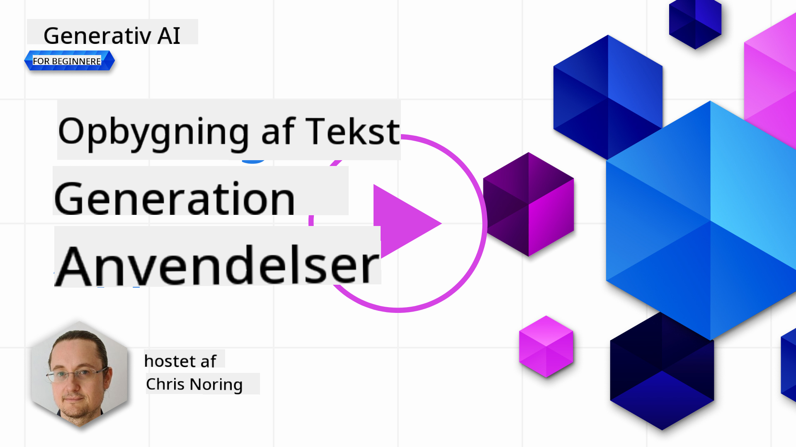

<!--
CO_OP_TRANSLATOR_METADATA:
{
  "original_hash": "5ec6c92b629564538ef397c550adb73e",
  "translation_date": "2025-05-19T17:00:41+00:00",
  "source_file": "06-text-generation-apps/README.md",
  "language_code": "da"
}
-->
# Bygning af Tekstgenereringsapplikationer

[](https://aka.ms/gen-ai-lesson6-gh?WT.mc_id=academic-105485-koreyst)

> _(Klik på billedet ovenfor for at se videoen af denne lektion)_

Indtil nu har du set gennem dette pensum, at der er kernekoncepter som prompts og endda en hel disciplin kaldet "prompt engineering". Mange værktøjer, som du kan interagere med, såsom ChatGPT, Office 365, Microsoft Power Platform og mere, understøtter brugen af prompts for at opnå noget.

For at tilføje en sådan oplevelse til en app, skal du forstå koncepter som prompts, completions og vælge et bibliotek at arbejde med. Det er præcis, hvad du vil lære i dette kapitel.

## Introduktion

I dette kapitel vil du:

- Lære om openai-biblioteket og dets kernekoncepter.
- Bygge en tekstgenereringsapp ved hjælp af openai.
- Forstå, hvordan man bruger koncepter som prompt, temperatur og tokens til at bygge en tekstgenereringsapp.

## Læringsmål

Ved slutningen af denne lektion vil du være i stand til at:

- Forklare, hvad en tekstgenereringsapp er.
- Bygge en tekstgenereringsapp ved hjælp af openai.
- Konfigurere din app til at bruge flere eller færre tokens og også ændre temperaturen for et varieret output.

## Hvad er en tekstgenereringsapp?

Normalt når du bygger en app, har den en form for interface som følgende:

- Kommando-baseret. Konsolapps er typiske apps, hvor du skriver en kommando, og den udfører en opgave. For eksempel er `git` en kommando-baseret app.
- Brugergrænseflade (UI). Nogle apps har grafiske brugergrænseflader (GUIs), hvor du klikker på knapper, indtaster tekst, vælger muligheder og mere.

### Konsol- og UI-apps er begrænsede

Sammenlign det med en kommando-baseret app, hvor du skriver en kommando:

- **Det er begrænset**. Du kan ikke bare skrive en hvilken som helst kommando, kun dem som appen understøtter.
- **Sprog specifikt**. Nogle apps understøtter mange sprog, men som standard er appen bygget til et specifikt sprog, selvom du kan tilføje mere sprogunderstøttelse.

### Fordele ved tekstgenereringsapps

Så hvordan adskiller en tekstgenereringsapp sig?

I en tekstgenereringsapp har du mere fleksibilitet, du er ikke begrænset til et sæt kommandoer eller et specifikt indgangssprog. I stedet kan du bruge naturligt sprog til at interagere med appen. En anden fordel er, at fordi du allerede interagerer med en datakilde, der er blevet trænet på et stort korpus af information, mens en traditionel app kan være begrænset til, hvad der er i en database.

### Hvad kan jeg bygge med en tekstgenereringsapp?

Der er mange ting, du kan bygge. For eksempel:

- **En chatbot**. En chatbot, der besvarer spørgsmål om emner som din virksomhed og dens produkter, kunne være en god match.
- **Hjælper**. LLM'er er gode til ting som at opsummere tekst, få indsigt fra tekst, producere tekst som CV'er og mere.
- **Kodeassistent**. Afhængigt af den sprogmodel du bruger, kan du bygge en kodeassistent, der hjælper dig med at skrive kode. For eksempel kan du bruge et produkt som GitHub Copilot samt ChatGPT til at hjælpe dig med at skrive kode.

## Hvordan kan jeg komme i gang?

Nå, du skal finde en måde at integrere med en LLM, hvilket normalt indebærer følgende to tilgange:

- Brug en API. Her konstruerer du webanmodninger med din prompt og får genereret tekst tilbage.
- Brug et bibliotek. Biblioteker hjælper med at kapsle API-kald ind og gøre dem lettere at bruge.

## Biblioteker/SDK'er

Der er nogle få velkendte biblioteker til at arbejde med LLM'er som:

- **openai**, dette bibliotek gør det nemt at forbinde til din model og sende prompts ind.

Der er også biblioteker, der opererer på et højere niveau som:

- **Langchain**. Langchain er velkendt og understøtter Python.
- **Semantic Kernel**. Semantic Kernel er et bibliotek fra Microsoft, der understøtter sprogene C#, Python og Java.

## Første app ved hjælp af openai

Lad os se, hvordan vi kan bygge vores første app, hvilke biblioteker vi har brug for, hvor meget der kræves og så videre.

### Installer openai

Der er mange biblioteker derude til at interagere med OpenAI eller Azure OpenAI. Det er muligt at bruge adskillige programmeringssprog som C#, Python, JavaScript, Java og mere. Vi har valgt at bruge `openai` Python-biblioteket, så vi bruger `pip` til at installere det.

```bash
pip install openai
```

### Opret en ressource

Du skal udføre følgende trin:

- Opret en konto på Azure [https://azure.microsoft.com/free/](https://azure.microsoft.com/free/?WT.mc_id=academic-105485-koreyst).
- Få adgang til Azure OpenAI. Gå til [https://learn.microsoft.com/azure/ai-services/openai/overview#how-do-i-get-access-to-azure-openai](https://learn.microsoft.com/azure/ai-services/openai/overview#how-do-i-get-access-to-azure-openai?WT.mc_id=academic-105485-koreyst) og anmod om adgang.

  > [!NOTE]
  > På tidspunktet for skrivningen skal du ansøge om adgang til Azure OpenAI.

- Installer Python <https://www.python.org/>
- Opret en Azure OpenAI Service-ressource. Se denne vejledning for hvordan man [opretter en ressource](https://learn.microsoft.com/azure/ai-services/openai/how-to/create-resource?pivots=web-portal?WT.mc_id=academic-105485-koreyst).

### Find API-nøgle og endpoint

På dette tidspunkt skal du fortælle dit `openai` bibliotek, hvilken API-nøgle der skal bruges. For at finde din API-nøgle, gå til "Keys and Endpoint" sektionen af din Azure OpenAI-ressource og kopier værdien "Key 1".


Nu hvor du har kopieret disse oplysninger, lad os instruere bibliotekerne til at bruge det.

> [!NOTE]
> Det er værd at adskille din API-nøgle fra din kode. Du kan gøre det ved at bruge miljøvariabler.
>
> - Sæt miljøvariablen `OPENAI_API_KEY` to your API key.
>   `export OPENAI_API_KEY='sk-...'`

### Opsætning af konfiguration Azure

Hvis du bruger Azure OpenAI, er her hvordan du opsætter konfigurationen:

```python
openai.api_type = 'azure'
openai.api_key = os.environ["OPENAI_API_KEY"]
openai.api_version = '2023-05-15'
openai.api_base = os.getenv("API_BASE")
```

Ovenfor indstiller vi følgende:

- `api_type` to `azure`. This tells the library to use Azure OpenAI and not OpenAI.
- `api_key`, this is your API key found in the Azure Portal.
- `api_version`, this is the version of the API you want to use. At the time of writing, the latest version is `2023-05-15`.
- `api_base`, this is the endpoint of the API. You can find it in the Azure Portal next to your API key.

> [!NOTE] > `os.getenv` is a function that reads environment variables. You can use it to read environment variables like `OPENAI_API_KEY` and `API_BASE`. Set these environment variables in your terminal or by using a library like `dotenv`.

## Generate text

The way to generate text is to use the `Completion` klasse. Her er et eksempel:

```python
prompt = "Complete the following: Once upon a time there was a"

completion = openai.Completion.create(model="davinci-002", prompt=prompt)
print(completion.choices[0].text)
```

I ovenstående kode opretter vi et completion-objekt og giver modellen, vi ønsker at bruge, og prompten. Derefter printer vi den genererede tekst.

### Chat completions

Indtil nu har du set, hvordan vi har brugt `Completion` to generate text. But there's another class called `ChatCompletion`, der er mere egnet til chatbots. Her er et eksempel på at bruge det:

```python
import openai

openai.api_key = "sk-..."

completion = openai.ChatCompletion.create(model="gpt-3.5-turbo", messages=[{"role": "user", "content": "Hello world"}])
print(completion.choices[0].message.content)
```

Mere om denne funktionalitet i et kommende kapitel.

## Øvelse - din første tekstgenereringsapp

Nu hvor vi har lært, hvordan man opsætter og konfigurerer openai, er det tid til at bygge din første tekstgenereringsapp. For at bygge din app skal du følge disse trin:

1. Opret et virtuelt miljø og installer openai:

   ```bash
   python -m venv venv
   source venv/bin/activate
   pip install openai
   ```

   > [!NOTE]
   > Hvis du bruger Windows, skriv `venv\Scripts\activate` instead of `source venv/bin/activate`.

   > [!NOTE]
   > Locate your Azure OpenAI key by going to [https://portal.azure.com/](https://portal.azure.com/?WT.mc_id=academic-105485-koreyst) and search for `Open AI` and select the `Open AI resource` and then select `Keys and Endpoint` and copy the `Key 1` værdi.

1. Opret en _app.py_-fil og giv den følgende kode:

   ```python
   import openai

   openai.api_key = "<replace this value with your open ai key or Azure OpenAI key>"

   openai.api_type = 'azure'
   openai.api_version = '2023-05-15'
   openai.api_base = "<endpoint found in Azure Portal where your API key is>"
   deployment_name = "<deployment name>"

   # add your completion code
   prompt = "Complete the following: Once upon a time there was a"
   messages = [{"role": "user", "content": prompt}]

   # make completion
   completion = openai.chat.completions.create(model=deployment_name, messages=messages)

   # print response
   print(completion.choices[0].message.content)
   ```

   > [!NOTE]
   > Hvis du bruger Azure OpenAI, skal du indstille `api_type` to `azure` and set the `api_key` til din Azure OpenAI-nøgle.

   Du bør se et output som følgende:

   ```output
    very unhappy _____.

   Once upon a time there was a very unhappy mermaid.
   ```

## Forskellige typer af prompts til forskellige ting

Nu har du set, hvordan man genererer tekst ved hjælp af en prompt. Du har endda et program kørende, som du kan ændre og tilpasse for at generere forskellige typer tekst.

Prompts kan bruges til alle mulige opgaver. For eksempel:

- **Generer en type tekst**. For eksempel kan du generere et digt, spørgsmål til en quiz osv.
- **Søg information**. Du kan bruge prompts til at søge efter information som det følgende eksempel 'Hvad betyder CORS i webudvikling?'.
- **Generer kode**. Du kan bruge prompts til at generere kode, for eksempel udvikle en regulær udtryk brugt til at validere e-mails eller hvorfor ikke generere et helt program, som en webapp?

## En mere praktisk anvendelse: en opskriftgenerator

Forestil dig, at du har ingredienser derhjemme, og du vil lave mad. For det har du brug for en opskrift. En måde at finde opskrifter på er at bruge en søgemaskine, eller du kan bruge en LLM til det.

Du kunne skrive en prompt som denne:

> "Vis mig 5 opskrifter til en ret med følgende ingredienser: kylling, kartofler og gulerødder. For hver opskrift, list alle de anvendte ingredienser"

Givet ovenstående prompt, kan du få et svar som:

```output
1. Roasted Chicken and Vegetables:
Ingredients:
- 4 chicken thighs
- 2 potatoes, cut into cubes
- 2 carrots, cut into cubes
- 2 tablespoons olive oil
- 2 cloves garlic, minced
- 1 teaspoon dried thyme
- 1 teaspoon dried oregano
- Salt and pepper, to taste

2. Chicken and Potato Stew:
Ingredients:
- 2 tablespoons olive oil
- 1 onion, diced
- 2 cloves garlic, minced
- 2 chicken breasts, cut into cubes
- 2 potatoes, cut into cubes
- 2 carrots, cut into cubes
- 1 teaspoon dried oregano
- 1 teaspoon dried thyme
- 1 cup chicken broth
- Salt and pepper, to taste

3. Chicken and Potato Bake:
Ingredients:
- 2 tablespoons olive oil
- 2 chicken breasts, cut into cubes
- 2 potatoes, cut into cubes
- 2 carrots, cut into cubes
- 1 onion, diced
- 2 cloves garlic, minced
- 1 teaspoon dried oregano
- 1 teaspoon dried thyme
- 1 cup chicken broth
- Salt and pepper, to taste

4. Chicken and Potato Soup:
Ingredients:
- 2 tablespoons olive oil
- 1 onion, diced
- 2 cloves garlic, minced
- 2 chicken breasts, cut into cubes
- 2 potatoes, cut into cubes
- 2 carrots, cut into cubes
- 1 teaspoon dried oregano
- 1 teaspoon dried thyme
- 4 cups chicken broth
- Salt and pepper, to taste

5. Chicken and Potato Hash:
Ingredients:
- 2 tablespoons olive oil
- 2 chicken breasts, cut into cubes
- 2 potatoes, cut into cubes
- 2 carrots, cut into cubes
- 1 onion, diced
- 2 cloves garlic, minced
- 1 teaspoon dried oregano
```

Dette resultat er fantastisk, jeg ved hvad jeg skal lave. På dette tidspunkt, hvad der kunne være nyttige forbedringer er:

- Filtrering af ingredienser, jeg ikke kan lide eller er allergisk over for.
- Lav en indkøbsliste, hvis jeg ikke har alle ingredienserne derhjemme.

For ovenstående tilfælde, lad os tilføje en ekstra prompt:

> "Fjern venligst opskrifter med hvidløg, da jeg er allergisk, og erstat det med noget andet. Lav også en indkøbsliste til opskrifterne, idet du tager højde for, at jeg allerede har kylling, kartofler og gulerødder derhjemme."

Nu har du et nyt resultat, nemlig:

```output
1. Roasted Chicken and Vegetables:
Ingredients:
- 4 chicken thighs
- 2 potatoes, cut into cubes
- 2 carrots, cut into cubes
- 2 tablespoons olive oil
- 1 teaspoon dried thyme
- 1 teaspoon dried oregano
- Salt and pepper, to taste

2. Chicken and Potato Stew:
Ingredients:
- 2 tablespoons olive oil
- 1 onion, diced
- 2 chicken breasts, cut into cubes
- 2 potatoes, cut into cubes
- 2 carrots, cut into cubes
- 1 teaspoon dried oregano
- 1 teaspoon dried thyme
- 1 cup chicken broth
- Salt and pepper, to taste

3. Chicken and Potato Bake:
Ingredients:
- 2 tablespoons olive oil
- 2 chicken breasts, cut into cubes
- 2 potatoes, cut into cubes
- 2 carrots, cut into cubes
- 1 onion, diced
- 1 teaspoon dried oregano
- 1 teaspoon dried thyme
- 1 cup chicken broth
- Salt and pepper, to taste

4. Chicken and Potato Soup:
Ingredients:
- 2 tablespoons olive oil
- 1 onion, diced
- 2 chicken breasts, cut into cubes
- 2 potatoes, cut into cubes
- 2 carrots, cut into cubes
- 1 teaspoon dried oregano
- 1 teaspoon dried thyme
- 4 cups chicken broth
- Salt and pepper, to taste

5. Chicken and Potato Hash:
Ingredients:
- 2 tablespoons olive oil
- 2 chicken breasts, cut into cubes
- 2 potatoes, cut into cubes
- 2 carrots, cut into cubes
- 1 onion, diced
- 1 teaspoon dried oregano

Shopping List:
- Olive oil
- Onion
- Thyme
- Oregano
- Salt
- Pepper
```

Det er dine fem opskrifter uden hvidløg nævnt, og du har også en indkøbsliste i betragtning af, hvad du allerede har derhjemme.

## Øvelse - byg en opskriftgenerator

Nu hvor vi har spillet et scenarie, lad os skrive kode, der matcher det viste scenarie. For at gøre det, følg disse trin:

1. Brug den eksisterende _app.py_-fil som udgangspunkt
1. Find `prompt`-variablen og ændr dens kode til følgende:

   ```python
   prompt = "Show me 5 recipes for a dish with the following ingredients: chicken, potatoes, and carrots. Per recipe, list all the ingredients used"
   ```

   Hvis du nu kører koden, skal du se et output, der ligner:

   ```output
   -Chicken Stew with Potatoes and Carrots: 3 tablespoons oil, 1 onion, chopped, 2 cloves garlic, minced, 1 carrot, peeled and chopped, 1 potato, peeled and chopped, 1 bay leaf, 1 thyme sprig, 1/2 teaspoon salt, 1/4 teaspoon black pepper, 1 1/2 cups chicken broth, 1/2 cup dry white wine, 2 tablespoons chopped fresh parsley, 2 tablespoons unsalted butter, 1 1/2 pounds boneless, skinless chicken thighs, cut into 1-inch pieces
   -Oven-Roasted Chicken with Potatoes and Carrots: 3 tablespoons extra-virgin olive oil, 1 tablespoon Dijon mustard, 1 tablespoon chopped fresh rosemary, 1 tablespoon chopped fresh thyme, 4 cloves garlic, minced, 1 1/2 pounds small red potatoes, quartered, 1 1/2 pounds carrots, quartered lengthwise, 1/2 teaspoon salt, 1/4 teaspoon black pepper, 1 (4-pound) whole chicken
   -Chicken, Potato, and Carrot Casserole: cooking spray, 1 large onion, chopped, 2 cloves garlic, minced, 1 carrot, peeled and shredded, 1 potato, peeled and shredded, 1/2 teaspoon dried thyme leaves, 1/4 teaspoon salt, 1/4 teaspoon black pepper, 2 cups fat-free, low-sodium chicken broth, 1 cup frozen peas, 1/4 cup all-purpose flour, 1 cup 2% reduced-fat milk, 1/4 cup grated Parmesan cheese

   -One Pot Chicken and Potato Dinner: 2 tablespoons olive oil, 1 pound boneless, skinless chicken thighs, cut into 1-inch pieces, 1 large onion, chopped, 3 cloves garlic, minced, 1 carrot, peeled and chopped, 1 potato, peeled and chopped, 1 bay leaf, 1 thyme sprig, 1/2 teaspoon salt, 1/4 teaspoon black pepper, 2 cups chicken broth, 1/2 cup dry white wine

   -Chicken, Potato, and Carrot Curry: 1 tablespoon vegetable oil, 1 large onion, chopped, 2 cloves garlic, minced, 1 carrot, peeled and chopped, 1 potato, peeled and chopped, 1 teaspoon ground coriander, 1 teaspoon ground cumin, 1/2 teaspoon ground turmeric, 1/2 teaspoon ground ginger, 1/4 teaspoon cayenne pepper, 2 cups chicken broth, 1/2 cup dry white wine, 1 (15-ounce) can chickpeas, drained and rinsed, 1/2 cup raisins, 1/2 cup chopped fresh cilantro
   ```

   > NOTE, din LLM er ikke-deterministisk, så du kan få forskellige resultater, hver gang du kører programmet.

   Fantastisk, lad os se, hvordan vi kan forbedre tingene. For at forbedre tingene vil vi sikre os, at koden er fleksibel, så ingredienser og antal opskrifter kan forbedres og ændres.

1. Lad os ændre koden på følgende måde:

   ```python
   no_recipes = input("No of recipes (for example, 5): ")

   ingredients = input("List of ingredients (for example, chicken, potatoes, and carrots): ")

   # interpolate the number of recipes into the prompt an ingredients
   prompt = f"Show me {no_recipes} recipes for a dish with the following ingredients: {ingredients}. Per recipe, list all the ingredients used"
   ```

   At tage koden til en testkørsel kunne se sådan ud:

   ```output
   No of recipes (for example, 5): 3
   List of ingredients (for example, chicken, potatoes, and carrots): milk,strawberries

   -Strawberry milk shake: milk, strawberries, sugar, vanilla extract, ice cubes
   -Strawberry shortcake: milk, flour, baking powder, sugar, salt, unsalted butter, strawberries, whipped cream
   -Strawberry milk: milk, strawberries, sugar, vanilla extract
   ```

### Forbedre ved at tilføje filter og indkøbsliste

Vi har nu en fungerende app, der kan producere opskrifter, og den er fleksibel, da den er afhængig af input fra brugeren, både med hensyn til antal opskrifter, men også de anvendte ingredienser.

For yderligere at forbedre den, ønsker vi at tilføje følgende:

- **Filtrér ingredienser**. Vi vil kunne filtrere ingredienser, vi ikke kan lide eller er allergiske over for. For at opnå denne ændring kan vi redigere vores eksisterende prompt og tilføje en filterbetingelse til slutningen af den som følger:

  ```python
  filter = input("Filter (for example, vegetarian, vegan, or gluten-free): ")

  prompt = f"Show me {no_recipes} recipes for a dish with the following ingredients: {ingredients}. Per recipe, list all the ingredients used, no {filter}"
  ```

  Ovenfor tilføjer vi `{filter}` til slutningen af prompten, og vi opfanger også filterværdien fra brugeren.

  Et eksempelinput på at køre programmet kan nu se sådan ud:

  ```output
  No of recipes (for example, 5): 3
  List of ingredients (for example, chicken, potatoes, and carrots): onion,milk
  Filter (for example, vegetarian, vegan, or gluten-free): no milk

  1. French Onion Soup

  Ingredients:

  -1 large onion, sliced
  -3 cups beef broth
  -1 cup milk
  -6 slices french bread
  -1/4 cup shredded Parmesan cheese
  -1 tablespoon butter
  -1 teaspoon dried thyme
  -1/4 teaspoon salt
  -1/4 teaspoon black pepper

  Instructions:

  1. In a large pot, sauté onions in butter until golden brown.
  2. Add beef broth, milk, thyme, salt, and pepper. Bring to a boil.
  3. Reduce heat and simmer for 10 minutes.
  4. Place french bread slices on soup bowls.
  5. Ladle soup over bread.
  6. Sprinkle with Parmesan cheese.

  2. Onion and Potato Soup

  Ingredients:

  -1 large onion, chopped
  -2 cups potatoes, diced
  -3 cups vegetable broth
  -1 cup milk
  -1/4 teaspoon black pepper

  Instructions:

  1. In a large pot, sauté onions in butter until golden brown.
  2. Add potatoes, vegetable broth, milk, and pepper. Bring to a boil.
  3. Reduce heat and simmer for 10 minutes.
  4. Serve hot.

  3. Creamy Onion Soup

  Ingredients:

  -1 large onion, chopped
  -3 cups vegetable broth
  -1 cup milk
  -1/4 teaspoon black pepper
  -1/4 cup all-purpose flour
  -1/2 cup shredded Parmesan cheese

  Instructions:

  1. In a large pot, sauté onions in butter until golden brown.
  2. Add vegetable broth, milk, and pepper. Bring to a boil.
  3. Reduce heat and simmer for 10 minutes.
  4. In a small bowl, whisk together flour and Parmesan cheese until smooth.
  5. Add to soup and simmer for an additional 5 minutes, or until soup has thickened.
  ```

  Som du kan se, er opskrifter med mælk i blevet filtreret ud. Men hvis du er laktoseintolerant, vil du måske også filtrere opskrifter med ost i, så der er behov for at være klar.

- **Lav en indkøbsliste**. Vi ønsker at lave en indkøbsliste, idet vi tager højde for, hvad vi allerede har derhjemme.

  For denne funktionalitet kunne vi enten forsøge at løse alt i en prompt, eller vi kunne opdele det i to prompts. Lad os prøve den sidstnævnte tilgang. Her foreslår vi at tilføje en ekstra prompt, men for at det skal fungere, skal vi tilføje resultatet af den tidligere prompt som kontekst til den senere prompt.

  Find den del af koden, der udskriver resultatet fra den første prompt, og tilføj følgende kode nedenfor:

  ```python
  old_prompt_result = completion.choices[0].message.content
  prompt = "Produce a shopping list for the generated recipes and please don't include ingredients that I already have."

  new_prompt = f"{old_prompt_result} {prompt}"
  messages = [{"role": "user", "content": new_prompt}]
  completion = openai.Completion.create(engine=deployment_name, messages=messages, max_tokens=1200)

  # print response
  print("Shopping list:")
  print(completion.choices[0].message.content)
  ```

  Bemærk følgende:

  1. Vi konstruerer en ny prompt ved at tilføje resultatet fra den første prompt til den nye prompt:

     ```python
     new_prompt = f"{old_prompt_result} {prompt}"
     ```

  1. Vi laver en ny anmodning, men også i betragtning af antallet af tokens, vi bad om i den første prompt, så denne gang siger vi, at `max_tokens` er 1200.

     ```python
     completion = openai.Completion.create(engine=deployment_name, prompt=new_prompt, max_tokens=1200)
     ```

     Når vi tager denne kode til en prøve, når vi nu frem til følgende output:

     ```output
     No of recipes (for example, 5): 2
     List of ingredients (for example, chicken, potatoes, and carrots): apple,flour
     Filter (for example, vegetarian, vegan, or gluten-free): sugar


     -Apple and flour pancakes: 1 cup flour, 1/2 tsp baking powder, 1/2 tsp baking soda, 1/4 tsp salt, 1 tbsp sugar, 1 egg, 1 cup buttermilk or sour milk, 1/4 cup melted butter, 1 Granny Smith apple, peeled and grated
     -Apple fritters: 1-1/2 cups flour, 1 tsp baking powder, 1/4 tsp salt, 1/4 tsp baking soda, 1/4 tsp nutmeg, 1/4 tsp cinnamon, 1/4 tsp allspice, 1/4 cup sugar, 1/4 cup vegetable shortening, 1/4 cup milk, 1 egg, 2 cups shredded, peeled apples
     Shopping list:
     -Flour, baking powder, baking soda, salt, sugar, egg, buttermilk, butter, apple, nutmeg, cinnamon, allspice
     ```

## Forbedr din opsætning

Hvad vi har indtil videre er kode, der virker, men der er nogle justeringer, vi bør gøre for at forbedre tingene yderligere. Nogle ting vi bør gøre er:

- **Adskil hemmeligheder fra kode**, som API-nøglen. Hemmeligheder hører ikke hjemme i kode og bør opbevares på et sikkert sted. For at adskille hemmeligheder fra kode kan vi bruge miljøvariabler og biblioteker som `python-dotenv` to load them from a file. Here's how that would look like in code:

  1. Create a `.env` fil med følgende indhold:

     ```bash
     OPENAI_API_KEY=sk-...
     ```

     > Bemærk, for Azure skal du indstille følgende miljøvariabler:

     ```bash
     OPENAI_API_TYPE=azure
     OPENAI_API_VERSION=2023-05-15
     OPENAI_API_BASE=<replace>
     ```

     I koden ville du indlæse miljøvariablerne som følger:

     ```python
     from dotenv import load_dotenv

     load_dotenv()

     openai.api_key = os.environ["OPENAI_API_KEY"]
     ```

- **Et ord om tokenlængde**. Vi bør overveje, hvor mange tokens vi har brug for for at generere den tekst, vi ønsker. Tokens koster penge, så hvor det er muligt, bør vi forsøge at være økonomiske med antallet af tokens, vi bruger. For eksempel, kan vi formulere prompten, så vi kan bruge færre tokens?

  For at ændre de brugte tokens kan du bruge `max_tokens` parameteren. For eksempel, hvis du vil bruge 100 tokens, ville du gøre:

  ```python
  completion = client.chat.completions.create(model=deployment, messages=messages, max_tokens=100)
  ```

- **Eksperimenter med temperatur**. Temperatur er noget, vi ikke har nævnt indtil nu, men det er en vigtig kontekst for, hvordan vores program præsterer. Jo højere temperaturværdi, jo mere tilfældig vil outputtet være. Omvendt, jo lavere temperaturværdi, jo mere forudsigelig vil outputtet være. Overvej om du ønsker variation i dit output eller ej.

  For at ændre temperaturen kan du bruge `temperature` parameteren. For eksempel, hvis du vil bruge en temperatur på 0,5, ville du gøre:

  ```python
  completion = client.chat.completions.create(model=deployment, messages=messages, temperature=0.5)
  ```

  > Bemærk, jo tættere på 1,0, jo mere varieret vil outputtet være.

## Opgave

For denne opgave kan du vælge, hvad du vil bygge.

Her er nogle forslag:

- Juster opskriftgeneratorappen for at forbedre den yderligere. Leg med temperaturværdierne og prompts for at se, hvad du kan finde på.
- Byg en "studiekammerat". Denne app skal kunne besvare spørgsmål om et emne, for eksempel Python, du kunne have prompts som "Hvad er et bestemt emne i Python?", eller du kunne have en prompt, der siger, vis mig kode for et bestemt emne osv.
- Historiebot, gør historien levende, instruer botten til at spille en bestemt historisk karakter og stil den spørgsmål om dens liv og tider.

## Løsning

### Studiekammerat

Nedenfor er en startprompt, se hvordan du kan bruge den og justere den til din smag.

```text
- "You're an expert on the Python language

    Suggest a beginner lesson for Python in the following format:

    Format:
    - concepts:
    - brief explanation of the lesson:
    - exercise in code with solutions"
```

### Historiebot

Her er nogle prompts, du kunne bruge:

```text
- "You are Abe Lincoln, tell me about yourself in 3 sentences, and respond using grammar and words like Abe would have used"
- "You are Abe Lincoln, respond using grammar and words like Abe would have used:

   Tell me about your greatest accomplishments, in 300 words"
```

## Videnstest

Hvad gør konceptet temperatur?

1.

**Ansvarsfraskrivelse**:  
Dette dokument er blevet oversat ved hjælp af AI-oversættelsestjenesten [Co-op Translator](https://github.com/Azure/co-op-translator). Selvom vi bestræber os på nøjagtighed, skal du være opmærksom på, at automatiserede oversættelser kan indeholde fejl eller unøjagtigheder. Det originale dokument på dets oprindelige sprog bør betragtes som den autoritative kilde. For kritisk information anbefales professionel menneskelig oversættelse. Vi er ikke ansvarlige for misforståelser eller fejltolkninger, der måtte opstå som følge af brugen af denne oversættelse.