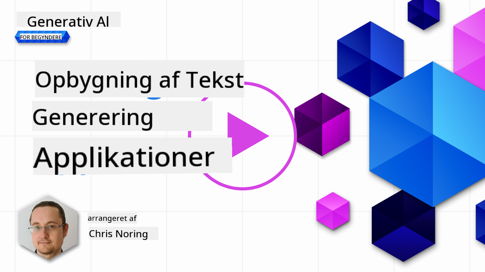

<!--
CO_OP_TRANSLATOR_METADATA:
{
  "original_hash": "ce8224073b86b728ed52b19bed7932fd",
  "translation_date": "2025-07-09T12:00:14+00:00",
  "source_file": "06-text-generation-apps/README.md",
  "language_code": "da"
}
-->
# Byg tekstgenereringsapplikationer

[](https://aka.ms/gen-ai-lesson6-gh?WT.mc_id=academic-105485-koreyst)

> _(Klik på billedet ovenfor for at se videoen til denne lektion)_

Du har indtil nu set i dette pensum, at der findes kernebegreber som prompts og endda en hel disciplin kaldet "prompt engineering". Mange værktøjer, du kan interagere med, som ChatGPT, Office 365, Microsoft Power Platform og flere, understøtter brugen af prompts for at opnå noget.

For at tilføje en sådan oplevelse til en app, skal du forstå begreber som prompts, completions og vælge et bibliotek at arbejde med. Det er præcis det, du vil lære i dette kapitel.

## Introduktion

I dette kapitel vil du:

- Lære om openai-biblioteket og dets kernebegreber.
- Bygge en tekstgenereringsapp ved hjælp af openai.
- Forstå, hvordan du bruger begreber som prompt, temperature og tokens til at bygge en tekstgenereringsapp.

## Læringsmål

I slutningen af denne lektion vil du kunne:

- Forklare, hvad en tekstgenereringsapp er.
- Bygge en tekstgenereringsapp ved hjælp af openai.
- Konfigurere din app til at bruge flere eller færre tokens og også ændre temperaturen for et varieret output.

## Hvad er en tekstgenereringsapp?

Normalt, når du bygger en app, har den en slags brugerflade som følgende:

- Kommando-baseret. Konsolapps er typiske apps, hvor du skriver en kommando, og den udfører en opgave. For eksempel er `git` en kommando-baseret app.
- Brugergrænseflade (UI). Nogle apps har grafiske brugergrænseflader (GUIs), hvor du klikker på knapper, indtaster tekst, vælger muligheder og mere.

### Konsol- og UI-apps er begrænsede

Sammenlign det med en kommando-baseret app, hvor du skriver en kommando:

- **Den er begrænset**. Du kan ikke bare skrive en hvilken som helst kommando, kun dem appen understøtter.
- **Sprog-specifik**. Nogle apps understøtter mange sprog, men som standard er appen bygget til et specifikt sprog, selvom du kan tilføje mere sprogunderstøttelse.

### Fordele ved tekstgenereringsapps

Hvordan adskiller en tekstgenereringsapp sig så?

I en tekstgenereringsapp har du mere fleksibilitet, du er ikke begrænset til et sæt kommandoer eller et specifikt input-sprog. I stedet kan du bruge naturligt sprog til at interagere med appen. En anden fordel er, at fordi du allerede interagerer med en datakilde, der er trænet på et enormt korpus af information, hvorimod en traditionel app kan være begrænset til, hvad der findes i en database.

### Hvad kan jeg bygge med en tekstgenereringsapp?

Der er mange ting, du kan bygge. For eksempel:

- **En chatbot**. En chatbot, der besvarer spørgsmål om emner som din virksomhed og dens produkter, kunne være et godt match.
- **Hjælper**. LLM'er er gode til ting som at opsummere tekst, få indsigt fra tekst, producere tekst som CV'er og mere.
- **Kodeassistent**. Afhængigt af det sprogmodel, du bruger, kan du bygge en kodeassistent, der hjælper dig med at skrive kode. For eksempel kan du bruge et produkt som GitHub Copilot samt ChatGPT til at hjælpe dig med at skrive kode.

## Hvordan kommer jeg i gang?

Du skal finde en måde at integrere med en LLM, hvilket normalt indebærer følgende to tilgange:

- Brug en API. Her konstruerer du webanmodninger med din prompt og får genereret tekst tilbage.
- Brug et bibliotek. Biblioteker hjælper med at indkapsle API-kald og gøre dem nemmere at bruge.

## Biblioteker/SDK'er

Der findes nogle velkendte biblioteker til at arbejde med LLM'er som:

- **openai**, dette bibliotek gør det nemt at forbinde til din model og sende prompts.

Derudover findes der biblioteker, der opererer på et højere niveau som:

- **Langchain**. Langchain er velkendt og understøtter Python.
- **Semantic Kernel**. Semantic Kernel er et bibliotek fra Microsoft, der understøtter sprogene C#, Python og Java.

## Første app med openai

Lad os se, hvordan vi kan bygge vores første app, hvilke biblioteker vi har brug for, hvor meget der kræves osv.

### Installer openai

Der findes mange biblioteker til at interagere med OpenAI eller Azure OpenAI. Det er også muligt at bruge mange programmeringssprog som C#, Python, JavaScript, Java og flere. Vi har valgt at bruge `openai` Python-biblioteket, så vi bruger `pip` til at installere det.

```bash
pip install openai
```

### Opret en ressource

Du skal udføre følgende trin:

- Opret en konto på Azure [https://azure.microsoft.com/free/](https://azure.microsoft.com/free/?WT.mc_id=academic-105485-koreyst).
- Få adgang til Azure OpenAI. Gå til [https://learn.microsoft.com/azure/ai-services/openai/overview#how-do-i-get-access-to-azure-openai](https://learn.microsoft.com/azure/ai-services/openai/overview#how-do-i-get-access-to-azure-openai?WT.mc_id=academic-105485-koreyst) og anmod om adgang.

  > [!NOTE]
  > På tidspunktet for skrivningen skal du ansøge om adgang til Azure OpenAI.

- Installer Python <https://www.python.org/>
- Opret en Azure OpenAI Service-ressource. Se denne vejledning for, hvordan du [opretter en ressource](https://learn.microsoft.com/azure/ai-services/openai/how-to/create-resource?pivots=web-portal?WT.mc_id=academic-105485-koreyst).

### Find API-nøgle og endpoint

På dette tidspunkt skal du fortælle dit `openai` bibliotek, hvilken API-nøgle der skal bruges. For at finde din API-nøgle, gå til sektionen "Keys and Endpoint" i din Azure OpenAI-ressource og kopier værdien for "Key 1".


Nu hvor du har kopieret denne information, lad os instruere bibliotekerne i at bruge den.

> [!NOTE]
> Det er værd at adskille din API-nøgle fra din kode. Det kan du gøre ved at bruge miljøvariabler.
>
> - Sæt miljøvariablen `OPENAI_API_KEY` til din API-nøgle.
>   `export OPENAI_API_KEY='sk-...'`

### Opsæt konfiguration for Azure

Hvis du bruger Azure OpenAI, er her hvordan du opsætter konfigurationen:

```python
openai.api_type = 'azure'
openai.api_key = os.environ["OPENAI_API_KEY"]
openai.api_version = '2023-05-15'
openai.api_base = os.getenv("API_BASE")
```

Ovenfor sætter vi følgende:

- `api_type` til `azure`. Dette fortæller biblioteket at bruge Azure OpenAI og ikke OpenAI.
- `api_key`, dette er din API-nøgle fundet i Azure-portalen.
- `api_version`, dette er versionen af API'en, du ønsker at bruge. På tidspunktet for skrivningen er den nyeste version `2023-05-15`.
- `api_base`, dette er endpointet for API'en. Du kan finde det i Azure-portalen ved siden af din API-nøgle.

> [!NOTE] > `os.getenv` er en funktion, der læser miljøvariabler. Du kan bruge den til at læse miljøvariabler som `OPENAI_API_KEY` og `API_BASE`. Sæt disse miljøvariabler i din terminal eller ved at bruge et bibliotek som `dotenv`.

## Generer tekst

Måden at generere tekst på er at bruge `Completion`-klassen. Her er et eksempel:

```python
prompt = "Complete the following: Once upon a time there was a"

completion = openai.Completion.create(model="davinci-002", prompt=prompt)
print(completion.choices[0].text)
```

I koden ovenfor opretter vi et completion-objekt og sender modellen, vi vil bruge, samt prompten. Derefter printer vi den genererede tekst.

### Chat completions

Indtil nu har du set, hvordan vi har brugt `Completion` til at generere tekst. Men der findes en anden klasse kaldet `ChatCompletion`, som er mere egnet til chatbots. Her er et eksempel på brug:

```python
import openai

openai.api_key = "sk-..."

completion = openai.ChatCompletion.create(model="gpt-3.5-turbo", messages=[{"role": "user", "content": "Hello world"}])
print(completion.choices[0].message.content)
```

Mere om denne funktionalitet i et kommende kapitel.

## Øvelse - din første tekstgenereringsapp

Nu hvor vi har lært, hvordan man opsætter og konfigurerer openai, er det tid til at bygge din første tekstgenereringsapp. Følg disse trin for at bygge din app:

1. Opret et virtuelt miljø og installer openai:

   ```bash
   python -m venv venv
   source venv/bin/activate
   pip install openai
   ```

   > [!NOTE]
   > Hvis du bruger Windows, skriv `venv\Scripts\activate` i stedet for `source venv/bin/activate`.

   > [!NOTE]
   > Find din Azure OpenAI-nøgle ved at gå til [https://portal.azure.com/](https://portal.azure.com/?WT.mc_id=academic-105485-koreyst), søg efter `Open AI`, vælg `Open AI resource`, og vælg derefter `Keys and Endpoint` og kopier værdien for `Key 1`.

1. Opret en fil _app.py_ og indsæt følgende kode:

   ```python
   import openai

   openai.api_key = "<replace this value with your open ai key or Azure OpenAI key>"

   openai.api_type = 'azure'
   openai.api_version = '2023-05-15'
   openai.api_base = "<endpoint found in Azure Portal where your API key is>"
   deployment_name = "<deployment name>"

   # add your completion code
   prompt = "Complete the following: Once upon a time there was a"
   messages = [{"role": "user", "content": prompt}]

   # make completion
   completion = openai.chat.completions.create(model=deployment_name, messages=messages)

   # print response
   print(completion.choices[0].message.content)
   ```

   > [!NOTE]
   > Hvis du bruger Azure OpenAI, skal du sætte `api_type` til `azure` og sætte `api_key` til din Azure OpenAI-nøgle.

   Du skulle gerne se et output som følgende:

   ```output
    very unhappy _____.

   Once upon a time there was a very unhappy mermaid.
   ```

## Forskellige typer prompts til forskellige formål

Nu har du set, hvordan man genererer tekst ved hjælp af en prompt. Du har endda et program kørende, som du kan ændre for at generere forskellige typer tekst.

Prompts kan bruges til alle mulige opgaver. For eksempel:

- **Generer en type tekst**. For eksempel kan du generere et digt, spørgsmål til en quiz osv.
- **Slå information op**. Du kan bruge prompts til at søge efter information som i eksemplet 'Hvad betyder CORS i webudvikling?'.
- **Generer kode**. Du kan bruge prompts til at generere kode, for eksempel udvikle et regulært udtryk til at validere e-mails eller hvorfor ikke generere et helt program, som en webapp?

## Et mere praktisk eksempel: en opskriftsgenerator

Forestil dig, at du har ingredienser derhjemme, og du vil lave mad. Til det har du brug for en opskrift. En måde at finde opskrifter på er at bruge en søgemaskine, eller du kan bruge en LLM til det.

Du kunne skrive en prompt som denne:

> "Vis mig 5 opskrifter på en ret med følgende ingredienser: kylling, kartofler og gulerødder. For hver opskrift, list alle ingredienserne, der bruges"

Givet ovenstående prompt, kan du få et svar, der ligner:

```output
1. Roasted Chicken and Vegetables:
Ingredients:
- 4 chicken thighs
- 2 potatoes, cut into cubes
- 2 carrots, cut into cubes
- 2 tablespoons olive oil
- 2 cloves garlic, minced
- 1 teaspoon dried thyme
- 1 teaspoon dried oregano
- Salt and pepper, to taste

2. Chicken and Potato Stew:
Ingredients:
- 2 tablespoons olive oil
- 1 onion, diced
- 2 cloves garlic, minced
- 2 chicken breasts, cut into cubes
- 2 potatoes, cut into cubes
- 2 carrots, cut into cubes
- 1 teaspoon dried oregano
- 1 teaspoon dried thyme
- 1 cup chicken broth
- Salt and pepper, to taste

3. Chicken and Potato Bake:
Ingredients:
- 2 tablespoons olive oil
- 2 chicken breasts, cut into cubes
- 2 potatoes, cut into cubes
- 2 carrots, cut into cubes
- 1 onion, diced
- 2 cloves garlic, minced
- 1 teaspoon dried oregano
- 1 teaspoon dried thyme
- 1 cup chicken broth
- Salt and pepper, to taste

4. Chicken and Potato Soup:
Ingredients:
- 2 tablespoons olive oil
- 1 onion, diced
- 2 cloves garlic, minced
- 2 chicken breasts, cut into cubes
- 2 potatoes, cut into cubes
- 2 carrots, cut into cubes
- 1 teaspoon dried oregano
- 1 teaspoon dried thyme
- 4 cups chicken broth
- Salt and pepper, to taste

5. Chicken and Potato Hash:
Ingredients:
- 2 tablespoons olive oil
- 2 chicken breasts, cut into cubes
- 2 potatoes, cut into cubes
- 2 carrots, cut into cubes
- 1 onion, diced
- 2 cloves garlic, minced
- 1 teaspoon dried oregano
```

Dette resultat er godt, jeg ved, hvad jeg skal lave. På dette tidspunkt kunne nyttige forbedringer være:

- Filtrere ingredienser, jeg ikke kan lide eller er allergisk overfor.
- Lave en indkøbsliste, hvis jeg ikke har alle ingredienserne derhjemme.

For ovenstående tilfælde, lad os tilføje en ekstra prompt:

> "Fjern venligst opskrifter med hvidløg, da jeg er allergisk, og erstat det med noget andet. Lav også en indkøbsliste for opskrifterne, idet jeg allerede har kylling, kartofler og gulerødder derhjemme."

Nu har du et nyt resultat, nemlig:

```output
1. Roasted Chicken and Vegetables:
Ingredients:
- 4 chicken thighs
- 2 potatoes, cut into cubes
- 2 carrots, cut into cubes
- 2 tablespoons olive oil
- 1 teaspoon dried thyme
- 1 teaspoon dried oregano
- Salt and pepper, to taste

2. Chicken and Potato Stew:
Ingredients:
- 2 tablespoons olive oil
- 1 onion, diced
- 2 chicken breasts, cut into cubes
- 2 potatoes, cut into cubes
- 2 carrots, cut into cubes
- 1 teaspoon dried oregano
- 1 teaspoon dried thyme
- 1 cup chicken broth
- Salt and pepper, to taste

3. Chicken and Potato Bake:
Ingredients:
- 2 tablespoons olive oil
- 2 chicken breasts, cut into cubes
- 2 potatoes, cut into cubes
- 2 carrots, cut into cubes
- 1 onion, diced
- 1 teaspoon dried oregano
- 1 teaspoon dried thyme
- 1 cup chicken broth
- Salt and pepper, to taste

4. Chicken and Potato Soup:
Ingredients:
- 2 tablespoons olive oil
- 1 onion, diced
- 2 chicken breasts, cut into cubes
- 2 potatoes, cut into cubes
- 2 carrots, cut into cubes
- 1 teaspoon dried oregano
- 1 teaspoon dried thyme
- 4 cups chicken broth
- Salt and pepper, to taste

5. Chicken and Potato Hash:
Ingredients:
- 2 tablespoons olive oil
- 2 chicken breasts, cut into cubes
- 2 potatoes, cut into cubes
- 2 carrots, cut into cubes
- 1 onion, diced
- 1 teaspoon dried oregano

Shopping List:
- Olive oil
- Onion
- Thyme
- Oregano
- Salt
- Pepper
```

Det er dine fem opskrifter uden hvidløg, og du har også en indkøbsliste, der tager højde for, hvad du allerede har derhjemme.

## Øvelse - byg en opskriftsgenerator

Nu hvor vi har gennemspillet et scenarie, lad os skrive kode, der matcher det viste scenarie. Følg disse trin:

1. Brug den eksisterende _app.py_ fil som udgangspunkt
1. Find variablen `prompt` og ændr dens kode til følgende:

   ```python
   prompt = "Show me 5 recipes for a dish with the following ingredients: chicken, potatoes, and carrots. Per recipe, list all the ingredients used"
   ```

   Hvis du nu kører koden, skulle du gerne se et output, der ligner:

   ```output
   -Chicken Stew with Potatoes and Carrots: 3 tablespoons oil, 1 onion, chopped, 2 cloves garlic, minced, 1 carrot, peeled and chopped, 1 potato, peeled and chopped, 1 bay leaf, 1 thyme sprig, 1/2 teaspoon salt, 1/4 teaspoon black pepper, 1 1/2 cups chicken broth, 1/2 cup dry white wine, 2 tablespoons chopped fresh parsley, 2 tablespoons unsalted butter, 1 1/2 pounds boneless, skinless chicken thighs, cut into 1-inch pieces
   -Oven-Roasted Chicken with Potatoes and Carrots: 3 tablespoons extra-virgin olive oil, 1 tablespoon Dijon mustard, 1 tablespoon chopped fresh rosemary, 1 tablespoon chopped fresh thyme, 4 cloves garlic, minced, 1 1/2 pounds small red potatoes, quartered, 1 1/2 pounds carrots, quartered lengthwise, 1/2 teaspoon salt, 1/4 teaspoon black pepper, 1 (4-pound) whole chicken
   -Chicken, Potato, and Carrot Casserole: cooking spray, 1 large onion, chopped, 2 cloves garlic, minced, 1 carrot, peeled and shredded, 1 potato, peeled and shredded, 1/2 teaspoon dried thyme leaves, 1/4 teaspoon salt, 1/4 teaspoon black pepper, 2 cups fat-free, low-sodium chicken broth, 1 cup frozen peas, 1/4 cup all-purpose flour, 1 cup 2% reduced-fat milk, 1/4 cup grated Parmesan cheese

   -One Pot Chicken and Potato Dinner: 2 tablespoons olive oil, 1 pound boneless, skinless chicken thighs, cut into 1-inch pieces, 1 large onion, chopped, 3 cloves garlic, minced, 1 carrot, peeled and chopped, 1 potato, peeled and chopped, 1 bay leaf, 1 thyme sprig, 1/2 teaspoon salt, 1/4 teaspoon black pepper, 2 cups chicken broth, 1/2 cup dry white wine

   -Chicken, Potato, and Carrot Curry: 1 tablespoon vegetable oil, 1 large onion, chopped, 2 cloves garlic, minced, 1 carrot, peeled and chopped, 1 potato, peeled and chopped, 1 teaspoon ground coriander, 1 teaspoon ground cumin, 1/2 teaspoon ground turmeric, 1/2 teaspoon ground ginger, 1/4 teaspoon cayenne pepper, 2 cups chicken broth, 1/2 cup dry white wine, 1 (15-ounce) can chickpeas, drained and rinsed, 1/2 cup raisins, 1/2 cup chopped fresh cilantro
   ```

   > NOTE, din LLM er ikke-deterministisk, så du kan få forskellige resultater hver gang, du kører programmet.

   Fantastisk, lad os se, hvordan vi kan forbedre tingene. For at forbedre tingene vil vi sikre, at koden er fleksibel, så både ingredienser og antal opskrifter kan ændres og forbedres.

1. Lad os ændre koden på følgende måde:

   ```python
   no_recipes = input("No of recipes (for example, 5): ")

   ingredients = input("List of ingredients (for example, chicken, potatoes, and carrots): ")

   # interpolate the number of recipes into the prompt an ingredients
   prompt = f"Show me {no_recipes} recipes for a dish with the following ingredients: {ingredients}. Per recipe, list all the ingredients used"
   ```

   En testkørsel af koden kunne se sådan ud:

   ```output
   No of recipes (for example, 5): 3
   List of ingredients (for example, chicken, potatoes, and carrots): milk,strawberries

   -Strawberry milk shake: milk, strawberries, sugar, vanilla extract, ice cubes
   -Strawberry shortcake: milk, flour, baking powder, sugar, salt, unsalted butter, strawberries, whipped cream
   -Strawberry milk: milk, strawberries, sugar, vanilla extract
   ```

### Forbedr ved at tilføje filter og indkøbsliste

Vi har nu en fungerende app, der kan producere opskrifter, og den er fleksibel, da den baserer sig på input fra brugeren, både antal opskrifter og ingredienser.

For at forbedre den yderligere vil vi tilføje følgende:

- **Filtrer ingredienser fra**. Vi vil kunne filtrere ingredienser, vi ikke kan lide eller er allergiske overfor. For at opnå denne ændring kan vi redigere vores eksisterende prompt og tilføje en filterbetingelse til slutningen af den, sådan her:

  ```python
  filter = input("Filter (for example, vegetarian, vegan, or gluten-free): ")

  prompt = f"Show me {no_recipes} recipes for a dish with the following ingredients: {ingredients}. Per recipe, list all the ingredients used, no {filter}"
  ```

  Ovenfor tilføjer vi `{filter}` til slutningen af prompten, og vi fanger også filterværdien fra brugeren.

  Et eksempel på input ved kørsel af programmet kan nu se sådan ud:

  ```output
  No of recipes (for example, 5): 3
  List of ingredients (for example, chicken, potatoes, and carrots): onion,milk
  Filter (for example, vegetarian, vegan, or gluten-free): no milk

  1. French Onion Soup

  Ingredients:

  -1 large onion, sliced
  -3 cups beef broth
  -1 cup milk
  -6 slices french bread
  -1/4 cup shredded Parmesan cheese
  -1 tablespoon butter
  -1 teaspoon dried thyme
  -1/4 teaspoon salt
  -1/4 teaspoon black pepper

  Instructions:

  1. In a large pot, sauté onions in butter until golden brown.
  2. Add beef broth, milk, thyme, salt, and pepper. Bring to a boil.
  3. Reduce heat and simmer for 10 minutes.
  4. Place french bread slices on soup bowls.
  5. Ladle soup over bread.
  6. Sprinkle with Parmesan cheese.

  2. Onion and Potato Soup

  Ingredients:

  -1 large onion, chopped
  -2 cups potatoes, diced
  -3 cups vegetable broth
  -1 cup milk
  -1/4 teaspoon black pepper

  Instructions:

  1. In a large pot, sauté onions in butter until golden brown.
  2. Add potatoes, vegetable broth, milk, and pepper. Bring to a boil.
  3. Reduce heat and simmer for 10 minutes.
  4. Serve hot.

  3. Creamy Onion Soup

  Ingredients:

  -1 large onion, chopped
  -3 cups vegetable broth
  -1 cup milk
  -1/4 teaspoon black pepper
  -1/4 cup all-purpose flour
  -1/2 cup shredded Parmesan cheese

  Instructions:

  1. In a large pot, sauté onions in butter until golden brown.
  2. Add vegetable broth, milk, and pepper. Bring to a boil.
  3. Reduce heat and simmer for 10 minutes.
  4. In a small bowl, whisk together flour and Parmesan cheese until smooth.
  5. Add to soup and simmer for an additional 5 minutes, or until soup has thickened.
  ```

  Som du kan se, er opskrifter med mælk blevet filtreret fra. Men hvis du er laktoseintolerant, vil du måske også filtrere opskrifter med ost, så det er vigtigt at være præcis.

- **Lav en indkøbsliste**. Vi vil lave en indkøbsliste, der tager højde for, hvad vi allerede har derhjemme.

  For denne funktionalitet kan vi enten prøve at løse det hele i én prompt, eller vi kan opdele det i to prompts. Lad os prøve den sidstnævnte tilgang. Her foreslår vi at tilføje en ekstra prompt, men for at det kan fungere, skal vi tilføje resultatet fra den første prompt som kontekst til den næste prompt.

  Find det sted i koden, hvor resultatet fra den første prompt printes, og tilføj følgende kode nedenunder:

  ```python
  old_prompt_result = completion.choices[0].message.content
  prompt = "Produce a shopping list for the generated recipes and please don't include ingredients that I already have."

  new_prompt = f"{old_prompt_result} {prompt}"
  messages = [{"role": "user", "content": new_prompt}]
  completion = openai.Completion.create(engine=deployment_name, messages=messages, max_tokens=1200)

  # print response
  print("Shopping list:")
  print(completion.choices[0].message.content)
  ```

  Bemærk følgende:

  1. Vi konstruerer en ny prompt ved at tilføje resultatet fra den første prompt til den nye prompt:

     ```python
     new_prompt = f"{old_prompt_result} {prompt}"
     ```
1. Vi laver en ny forespørgsel, men tager også højde for antallet af tokens, vi bad om i den første prompt, så denne gang sætter vi `max_tokens` til 1200.

```python
     completion = openai.Completion.create(engine=deployment_name, prompt=new_prompt, max_tokens=1200)
     ```

Når vi prøver denne kode, får vi nu følgende output:

```output
     No of recipes (for example, 5): 2
     List of ingredients (for example, chicken, potatoes, and carrots): apple,flour
     Filter (for example, vegetarian, vegan, or gluten-free): sugar


     -Apple and flour pancakes: 1 cup flour, 1/2 tsp baking powder, 1/2 tsp baking soda, 1/4 tsp salt, 1 tbsp sugar, 1 egg, 1 cup buttermilk or sour milk, 1/4 cup melted butter, 1 Granny Smith apple, peeled and grated
     -Apple fritters: 1-1/2 cups flour, 1 tsp baking powder, 1/4 tsp salt, 1/4 tsp baking soda, 1/4 tsp nutmeg, 1/4 tsp cinnamon, 1/4 tsp allspice, 1/4 cup sugar, 1/4 cup vegetable shortening, 1/4 cup milk, 1 egg, 2 cups shredded, peeled apples
     Shopping list:
     -Flour, baking powder, baking soda, salt, sugar, egg, buttermilk, butter, apple, nutmeg, cinnamon, allspice
     ```

## Forbedr din opsætning

Det vi har indtil videre, er kode der virker, men der er nogle justeringer, vi bør lave for at forbedre tingene yderligere. Nogle ting vi bør gøre er:

- **Adskil hemmeligheder fra koden**, som for eksempel API-nøglen. Hemmeligheder hører ikke hjemme i koden og bør gemmes et sikkert sted. For at adskille hemmeligheder fra koden kan vi bruge miljøvariabler og biblioteker som `python-dotenv` til at indlæse dem fra en fil. Sådan kunne det se ud i koden:

  1. Opret en `.env` fil med følgende indhold:

     ```bash
     OPENAI_API_KEY=sk-...
     ```

     
> Bemærk, for Azure skal du sætte følgende miljøvariabler:

     ```bash
     OPENAI_API_TYPE=azure
     OPENAI_API_VERSION=2023-05-15
     OPENAI_API_BASE=<replace>
     ```

     I koden indlæser du miljøvariablerne på denne måde:

     ```python
     from dotenv import load_dotenv

     load_dotenv()

     openai.api_key = os.environ["OPENAI_API_KEY"]
     ```

- **Et ord om token-længde**. Vi bør overveje, hvor mange tokens vi har brug for til at generere den tekst, vi ønsker. Tokens koster penge, så hvor det er muligt, bør vi prøve at være økonomiske med antallet af tokens, vi bruger. For eksempel, kan vi formulere prompten, så vi kan bruge færre tokens?

  For at ændre antallet af tokens, kan du bruge parameteren `max_tokens`. For eksempel, hvis du vil bruge 100 tokens, gør du:

  ```python
  completion = client.chat.completions.create(model=deployment, messages=messages, max_tokens=100)
  ```

- **Eksperimenter med temperature**. Temperature er noget, vi ikke har nævnt indtil nu, men det er en vigtig faktor for, hvordan vores program opfører sig. Jo højere temperature-værdien er, desto mere tilfældigt bliver outputtet. Omvendt, jo lavere temperature-værdien er, desto mere forudsigeligt bliver outputtet. Overvej om du ønsker variation i dit output eller ej.

  For at ændre temperature, kan du bruge parameteren `temperature`. For eksempel, hvis du vil sætte temperature til 0.5, gør du:

  ```python
  completion = client.chat.completions.create(model=deployment, messages=messages, temperature=0.5)
  ```

  > Bemærk, jo tættere på 1.0, desto mere varieret bliver outputtet.

## Opgave

Til denne opgave kan du selv vælge, hvad du vil bygge.

Her er nogle forslag:

- Juster opskriftsgenerator-appen for at forbedre den yderligere. Leg med temperature-værdier og prompts for at se, hvad du kan finde på.
- Byg en "studiepartner". Denne app skal kunne svare på spørgsmål om et emne, for eksempel Python. Du kan have prompts som "Hvad er et bestemt emne i Python?", eller en prompt der siger, vis mig kode for et bestemt emne osv.
- Historie-bot, få historien til at leve, instruer botten til at spille en bestemt historisk person og stil den spørgsmål om dens liv og tid.

## Løsning

### Studiepartner

Nedenfor er en start-prompt, se hvordan du kan bruge den og tilpasse den efter din smag.

```text
- "You're an expert on the Python language

    Suggest a beginner lesson for Python in the following format:

    Format:
    - concepts:
    - brief explanation of the lesson:
    - exercise in code with solutions"
```

### Historie-bot

Her er nogle prompts, du kan bruge:

```text
- "You are Abe Lincoln, tell me about yourself in 3 sentences, and respond using grammar and words like Abe would have used"
- "You are Abe Lincoln, respond using grammar and words like Abe would have used:

   Tell me about your greatest accomplishments, in 300 words"
```

## Videnstest

Hvad gør begrebet temperature?

1. Det styrer, hvor tilfældigt outputtet er.
1. Det styrer, hvor stort svaret er.
1. Det styrer, hvor mange tokens der bruges.

## 🚀 Udfordring

Når du arbejder på opgaven, prøv at variere temperature, prøv at sætte den til 0, 0.5 og 1. Husk at 0 er mindst varieret og 1 er mest. Hvilken værdi fungerer bedst for din app?

## Godt arbejde! Fortsæt din læring

Efter du har gennemført denne lektion, kan du tjekke vores [Generative AI Learning collection](https://aka.ms/genai-collection?WT.mc_id=academic-105485-koreyst) for at fortsætte med at udvikle din viden om Generativ AI!

Gå videre til Lektion 7, hvor vi ser på, hvordan man [bygger chat-applikationer](../07-building-chat-applications/README.md?WT.mc_id=academic-105485-koreyst)!

**Ansvarsfraskrivelse**:  
Dette dokument er blevet oversat ved hjælp af AI-oversættelsestjenesten [Co-op Translator](https://github.com/Azure/co-op-translator). Selvom vi bestræber os på nøjagtighed, bedes du være opmærksom på, at automatiserede oversættelser kan indeholde fejl eller unøjagtigheder. Det oprindelige dokument på dets oprindelige sprog bør betragtes som den autoritative kilde. For kritisk information anbefales professionel menneskelig oversættelse. Vi påtager os intet ansvar for misforståelser eller fejltolkninger, der opstår som følge af brugen af denne oversættelse.