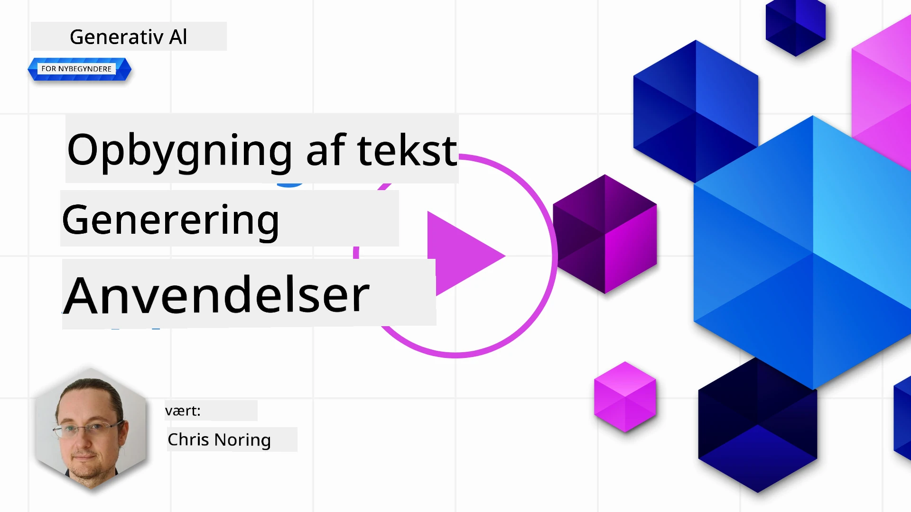

# Byg tekstgenereringsapplikationer

[](https://youtu.be/0Y5Luf5sRQA?si=t_xVg0clnAI4oUFZ)

> _(Klik på billedet ovenfor for at se videoen af denne lektion)_

Du har indtil nu set i dette kursus, at der findes kernebegreber som prompts og endda en hel disciplin kaldet "prompt engineering". Mange værktøjer, du kan interagere med, som ChatGPT, Office 365, Microsoft Power Platform og flere, understøtter brug af prompts til at opnå noget.

For at du kan tilføje en sådan oplevelse til en app, er det nødvendigt at forstå begreber som prompts, fuldførelser og vælge et bibliotek at arbejde med. Det er præcis, hvad du vil lære i dette kapitel.

## Introduktion

I dette kapitel vil du:

- Lære om openai-biblioteket og dets kernebegreber.
- Bygge en tekstgenereringsapp ved brug af openai.
- Forstå, hvordan man bruger begreber som prompt, temperatur og tokens til at bygge en tekstgenereringsapp.

## Læringsmål

Ved slutningen af denne lektion vil du kunne:

- Forklare hvad en tekstgenereringsapp er.
- Bygge en tekstgenereringsapp ved brug af openai.
- Konfigurere din app til at bruge flere eller færre tokens og også ændre temperaturen for et varieret output.

## Hvad er en tekstgenereringsapp?

Normalt når du bygger en app, har den en form for brugerflade som følgende:

- Kommando-baseret. Konsolapps er typiske apps, hvor du skriver en kommando, og den udfører en opgave. For eksempel er `git` en kommando-baseret app.
- Brugersnitflade (UI). Nogle apps har grafiske brugergrænseflader (GUIs), hvor du klikker på knapper, indtaster tekst, vælger muligheder og mere.

### Konsol- og UI-apps er begrænsede

Sammenlign det med en kommando-baseret app, hvor du skriver en kommando:

- **Den er begrænset**. Du kan ikke bare skrive en hvilken som helst kommando, kun dem som appen understøtter.
- **Sprog-specifik**. Nogle apps understøtter mange sprog, men som standard er appen bygget til et bestemt sprog, selvom du kan tilføje mere sprogunderstøttelse.

### Fordele ved tekstgenereringsapps

Så hvordan adskiller en tekstgenereringsapp sig?

I en tekstgenereringsapp har du mere fleksibilitet, du er ikke begrænset til et sæt kommandoer eller et specifikt input-sprog. I stedet kan du bruge naturligt sprog til at interagere med appen. En anden fordel er, at du allerede interagerer med en datakilde, der er trænet på et enormt korpus af information, mens en traditionel app måske er begrænset til, hvad der er i en database.

### Hvad kan jeg bygge med en tekstgenereringsapp?

Der er mange ting, du kan bygge. For eksempel:

- **En chatbot**. En chatbot der besvarer spørgsmål om emner, som dit firma og dets produkter, kunne være et godt match.
- **Hjælper**. LLM’er er gode til ting som at opsummere tekst, få indsigt fra tekst, producere tekst som CV’er og mere.
- **Kodeassistent**. Afhængigt af det sprogmodel, du bruger, kan du bygge en kodeassistent, der hjælper dig med at skrive kode. For eksempel kan du bruge et produkt som GitHub Copilot samt ChatGPT til at hjælpe dig med at skrive kode.

## Hvordan kommer jeg i gang?

Du skal finde en måde at integrere med en LLM, som normalt involverer følgende to tilgange:

- Brug en API. Her konstruerer du webanmodninger med din prompt og får genereret tekst tilbage.
- Brug et bibliotek. Biblioteker hjælper med at kapsle API-kald ind og gøre dem lettere at bruge.

## Biblioteker/SDK'er

Der findes et par velkendte biblioteker til at arbejde med LLM’er som:

- **openai**, dette bibliotek gør det nemt at forbinde til din model og sende prompts ind.

Så er der biblioteker, der arbejder på et højere niveau som:

- **Langchain**. Langchain er velkendt og understøtter Python.
- **Semantic Kernel**. Semantic Kernel er et bibliotek fra Microsoft, der understøtter sprogene C#, Python og Java.

## Første app ved brug af openai

Lad os se, hvordan vi bygger vores første app, hvilke biblioteker vi behøver, hvor meget der kræves osv.

### Installer openai

Der findes mange biblioteker til interaktion med OpenAI eller Azure OpenAI. Det er muligt at bruge mange programmeringssprog som C#, Python, JavaScript, Java og mere. Vi har valgt at bruge `openai` Python-biblioteket, så vi bruger `pip` til at installere det.

```bash
pip install openai
```

### Opret en ressource

Du skal udføre følgende trin:

- Opret en konto på Azure [https://azure.microsoft.com/free/](https://azure.microsoft.com/free/?WT.mc_id=academic-105485-koreyst).
- Få adgang til Azure OpenAI. Gå til [https://learn.microsoft.com/azure/ai-foundry/openai/overview#how-do-i-get-access-to-azure-openai](https://learn.microsoft.com/azure/ai-foundry/openai/overview#how-do-i-get-access-to-azure-openai?WT.mc_id=academic-105485-koreyst) og anmod om adgang.

  > [!NOTE]
  > På tidspunktet for skrivningen skal du ansøge om adgang til Azure OpenAI.

- Installer Python <https://www.python.org/>
- Opret en Azure OpenAI Service-ressource. Se denne vejledning om, hvordan man [opretter en ressource](https://learn.microsoft.com/azure/ai-foundry/openai/how-to/create-resource?pivots=web-portal?WT.mc_id=academic-105485-koreyst).

### Find API-nøgle og endpoint

På dette tidspunkt skal du fortælle dit `openai` bibliotek, hvilken API-nøgle det skal bruge. For at finde din API-nøgle, gå til sektionen "Keys and Endpoint" for din Azure OpenAI-ressource og kopier "Key 1"-værdien.


Nu hvor du har kopieret denne information, lad os instruere bibliotekerne i at bruge den.

> [!NOTE]
> Det er værd at adskille din API-nøgle fra din kode. Det kan du gøre ved at bruge miljøvariabler.
>
> - Sæt miljøvariablen `OPENAI_API_KEY` til din API-nøgle.
>   `export OPENAI_API_KEY='sk-...'`

### Konfigurer Azure

Hvis du bruger Azure OpenAI (nu en del af Microsoft Foundry), her er hvordan du konfigurerer opsætningen. Vi bruger standard `OpenAI` klienten, der peger på Azure OpenAI `/openai/v1/` endpointet, som fungerer med Responses API’et og ikke kræver `api_version`:

```python
import os
from openai import OpenAI

client = OpenAI(
    api_key=os.environ["AZURE_OPENAI_API_KEY"],
    base_url=f"{os.environ['AZURE_OPENAI_ENDPOINT'].rstrip('/')}/openai/v1/",
)
```

Ovenfor sætter vi følgende:

- `api_key`, det er din API-nøgle fundet i Azure-portalen eller Microsoft Foundry-portalen.
- `base_url`, det er din Foundry-ressources endpoint med `/openai/v1/` lagt til. Det stabile v1 endpoint virker på tværs af OpenAI og Azure OpenAI uden `api_version` styring.

> [!NOTE] > `os.environ` læser miljøvariabler. Du kan bruge den til at læse miljøvariabler som `AZURE_OPENAI_API_KEY` og `AZURE_OPENAI_ENDPOINT`. Sæt disse miljøvariabler i din terminal eller ved at bruge et bibliotek som `dotenv`.

## Generer tekst

Måden at generere tekst på er ved at bruge Responses API via `responses.create` metoden. Her er et eksempel:

```python
prompt = "Complete the following: Once upon a time there was a"

response = client.responses.create(
    model="gpt-5-mini",  # dette er navnet på din modeludrulning
    input=prompt,
    store=False,
)
print(response.output_text)
```

I ovenstående kode opretter vi et response og sender modellen, vi vil bruge, samt prompten ind. Så printer vi den genererede tekst via `response.output_text`.

### Multi-turn samtaler

Responses API er velegnet til både single-turn tekstgenerering og multi-turn chatbots - du leverer en liste af beskeder i `input` for at opbygge en samtale:

```python
from openai import OpenAI

client = OpenAI(api_key="sk-...")

response = client.responses.create(model="gpt-5-mini", input="Hello world", store=False)
print(response.output_text)
```

Mere om denne funktionalitet i et kommende kapitel.

## Øvelse - din første tekstgenereringsapp

Nu hvor vi har lært, hvordan man sætter openai op og konfigurerer det, er det tid til at bygge din første tekstgenereringsapp. Følg disse trin for at bygge din app:

1. Opret et virtuelt miljø og installer openai:

   ```bash
   python -m venv venv
   source venv/bin/activate
   pip install openai
   ```

   > [!NOTE]
   > Hvis du bruger Windows, skriv `venv\Scripts\activate` i stedet for `source venv/bin/activate`.

   > [!NOTE]
   > Find din Azure OpenAI-nøgle ved at gå til [https://portal.azure.com/](https://portal.azure.com/?WT.mc_id=academic-105485-koreyst), søg efter `Open AI`, vælg `Open AI resource`, derefter `Keys and Endpoint` og kopier `Key 1` værdien.

1. Opret en fil _app.py_ og indsæt følgende kode:

   ```python
   import os
   from openai import OpenAI

   client = OpenAI(
       api_key="<replace this value with your Azure OpenAI key>",
       base_url="<endpoint found in Azure Portal>/openai/v1/",
   )
   deployment_name = "<deployment name>"

   # tilføj din kompletteringskode
   prompt = "Complete the following: Once upon a time there was a"

   # lav en anmodning ved hjælp af Responses API
   response = client.responses.create(model=deployment_name, input=prompt, store=False)

   # udskriv svar
   print(response.output_text)
   ```

   > [!NOTE]
   > Hvis du bruger almindelig OpenAI (ikke Azure), brug `client = OpenAI(api_key="<replace this value with your OpenAI key>")` (ingen `base_url`) og angiv et modelnavn som `gpt-5-mini` i stedet for et deployeringsnavn.

   Du burde se en output som følgende:

   ```output
    very unhappy _____.

   Once upon a time there was a very unhappy mermaid.
   ```

## Forskellige typer prompts til forskellige ting

Nu har du set, hvordan man genererer tekst ved brug af en prompt. Du har endda et program oppe at køre, som du kan modificere og ændre for at generere forskellige typer tekst.

Prompts kan bruges til alle mulige opgaver. For eksempel:

- **Generere en type tekst**. For eksempel kan du generere et digt, spørgsmål til en quiz osv.
- **Opsøge information**. Du kan bruge prompts til at søge information som i følgende eksempel: ’Hvad betyder CORS i webudvikling?’.
- **Generere kode**. Du kan bruge prompts til at generere kode, for eksempel udvikle et regulært udtryk til at validere e-mails eller hvorfor ikke generere et helt program, som en webapp?

## Et mere praktisk eksempel: en opskriftgenerator

Forestil dig, at du har ingredienser derhjemme, og du vil lave noget mad. Til det behøver du en opskrift. En måde at finde opskrifter på er at bruge en søgemaskine, eller du kan bruge en LLM til det.

Du kunne skrive en prompt som:

> "Vis mig 5 opskrifter på en ret med følgende ingredienser: kylling, kartofler og gulerødder. For hver opskrift, list alle ingredienserne."

Givet ovenstående prompt, kan du få et svar lignende:

```output
1. Roasted Chicken and Vegetables:
Ingredients:
- 4 chicken thighs
- 2 potatoes, cut into cubes
- 2 carrots, cut into cubes
- 2 tablespoons olive oil
- 2 cloves garlic, minced
- 1 teaspoon dried thyme
- 1 teaspoon dried oregano
- Salt and pepper, to taste

2. Chicken and Potato Stew:
Ingredients:
- 2 tablespoons olive oil
- 1 onion, diced
- 2 cloves garlic, minced
- 2 chicken breasts, cut into cubes
- 2 potatoes, cut into cubes
- 2 carrots, cut into cubes
- 1 teaspoon dried oregano
- 1 teaspoon dried thyme
- 1 cup chicken broth
- Salt and pepper, to taste

3. Chicken and Potato Bake:
Ingredients:
- 2 tablespoons olive oil
- 2 chicken breasts, cut into cubes
- 2 potatoes, cut into cubes
- 2 carrots, cut into cubes
- 1 onion, diced
- 2 cloves garlic, minced
- 1 teaspoon dried oregano
- 1 teaspoon dried thyme
- 1 cup chicken broth
- Salt and pepper, to taste

4. Chicken and Potato Soup:
Ingredients:
- 2 tablespoons olive oil
- 1 onion, diced
- 2 cloves garlic, minced
- 2 chicken breasts, cut into cubes
- 2 potatoes, cut into cubes
- 2 carrots, cut into cubes
- 1 teaspoon dried oregano
- 1 teaspoon dried thyme
- 4 cups chicken broth
- Salt and pepper, to taste

5. Chicken and Potato Hash:
Ingredients:
- 2 tablespoons olive oil
- 2 chicken breasts, cut into cubes
- 2 potatoes, cut into cubes
- 2 carrots, cut into cubes
- 1 onion, diced
- 2 cloves garlic, minced
- 1 teaspoon dried oregano
```

Dette resultat er godt, jeg ved, hvad jeg skal lave. På dette punkt kunne nyttige forbedringer være:

- At filtrere ingredienser, jeg ikke kan lide eller er allergisk overfor.
- At lave en indkøbsliste, hvis jeg ikke har alle ingredienser derhjemme.

For ovenstående tilfælde, lad os tilføje en ekstra prompt:

> "Fjern venligst opskrifter med hvidløg, da jeg er allergisk og erstat det med noget andet. Lav også en indkøbsliste for opskrifterne, idet jeg allerede har kylling, kartofler og gulerødder derhjemme."

Nu har du et nyt resultat, nemlig:

```output
1. Roasted Chicken and Vegetables:
Ingredients:
- 4 chicken thighs
- 2 potatoes, cut into cubes
- 2 carrots, cut into cubes
- 2 tablespoons olive oil
- 1 teaspoon dried thyme
- 1 teaspoon dried oregano
- Salt and pepper, to taste

2. Chicken and Potato Stew:
Ingredients:
- 2 tablespoons olive oil
- 1 onion, diced
- 2 chicken breasts, cut into cubes
- 2 potatoes, cut into cubes
- 2 carrots, cut into cubes
- 1 teaspoon dried oregano
- 1 teaspoon dried thyme
- 1 cup chicken broth
- Salt and pepper, to taste

3. Chicken and Potato Bake:
Ingredients:
- 2 tablespoons olive oil
- 2 chicken breasts, cut into cubes
- 2 potatoes, cut into cubes
- 2 carrots, cut into cubes
- 1 onion, diced
- 1 teaspoon dried oregano
- 1 teaspoon dried thyme
- 1 cup chicken broth
- Salt and pepper, to taste

4. Chicken and Potato Soup:
Ingredients:
- 2 tablespoons olive oil
- 1 onion, diced
- 2 chicken breasts, cut into cubes
- 2 potatoes, cut into cubes
- 2 carrots, cut into cubes
- 1 teaspoon dried oregano
- 1 teaspoon dried thyme
- 4 cups chicken broth
- Salt and pepper, to taste

5. Chicken and Potato Hash:
Ingredients:
- 2 tablespoons olive oil
- 2 chicken breasts, cut into cubes
- 2 potatoes, cut into cubes
- 2 carrots, cut into cubes
- 1 onion, diced
- 1 teaspoon dried oregano

Shopping List:
- Olive oil
- Onion
- Thyme
- Oregano
- Salt
- Pepper
```

Det er dine fem opskrifter, uden hvidløg nævnt, og du har også en indkøbsliste i betragtning af, hvad du allerede har hjemme.

## Øvelse - byg en opskriftgenerator

Nu hvor vi har gennemspillet et scenarie, lad os skrive kode til at matche det demonstrerede scenarie. Følg disse trin:

1. Brug den eksisterende _app.py_-fil som udgangspunkt
1. Find `prompt`-variablen og ændr dens kode til følgende:

   ```python
   prompt = "Show me 5 recipes for a dish with the following ingredients: chicken, potatoes, and carrots. Per recipe, list all the ingredients used"
   ```

   Hvis du nu kører koden, burde du se en output lignende:

   ```output
   -Chicken Stew with Potatoes and Carrots: 3 tablespoons oil, 1 onion, chopped, 2 cloves garlic, minced, 1 carrot, peeled and chopped, 1 potato, peeled and chopped, 1 bay leaf, 1 thyme sprig, 1/2 teaspoon salt, 1/4 teaspoon black pepper, 1 1/2 cups chicken broth, 1/2 cup dry white wine, 2 tablespoons chopped fresh parsley, 2 tablespoons unsalted butter, 1 1/2 pounds boneless, skinless chicken thighs, cut into 1-inch pieces
   -Oven-Roasted Chicken with Potatoes and Carrots: 3 tablespoons extra-virgin olive oil, 1 tablespoon Dijon mustard, 1 tablespoon chopped fresh rosemary, 1 tablespoon chopped fresh thyme, 4 cloves garlic, minced, 1 1/2 pounds small red potatoes, quartered, 1 1/2 pounds carrots, quartered lengthwise, 1/2 teaspoon salt, 1/4 teaspoon black pepper, 1 (4-pound) whole chicken
   -Chicken, Potato, and Carrot Casserole: cooking spray, 1 large onion, chopped, 2 cloves garlic, minced, 1 carrot, peeled and shredded, 1 potato, peeled and shredded, 1/2 teaspoon dried thyme leaves, 1/4 teaspoon salt, 1/4 teaspoon black pepper, 2 cups fat-free, low-sodium chicken broth, 1 cup frozen peas, 1/4 cup all-purpose flour, 1 cup 2% reduced-fat milk, 1/4 cup grated Parmesan cheese

   -One Pot Chicken and Potato Dinner: 2 tablespoons olive oil, 1 pound boneless, skinless chicken thighs, cut into 1-inch pieces, 1 large onion, chopped, 3 cloves garlic, minced, 1 carrot, peeled and chopped, 1 potato, peeled and chopped, 1 bay leaf, 1 thyme sprig, 1/2 teaspoon salt, 1/4 teaspoon black pepper, 2 cups chicken broth, 1/2 cup dry white wine

   -Chicken, Potato, and Carrot Curry: 1 tablespoon vegetable oil, 1 large onion, chopped, 2 cloves garlic, minced, 1 carrot, peeled and chopped, 1 potato, peeled and chopped, 1 teaspoon ground coriander, 1 teaspoon ground cumin, 1/2 teaspoon ground turmeric, 1/2 teaspoon ground ginger, 1/4 teaspoon cayenne pepper, 2 cups chicken broth, 1/2 cup dry white wine, 1 (15-ounce) can chickpeas, drained and rinsed, 1/2 cup raisins, 1/2 cup chopped fresh cilantro
   ```

   > OBS, din LLM er ikke-deterministisk, så du kan få forskellige resultater hver gang du kører programmet.

   Fantastisk, lad os se, hvordan vi kan forbedre tingene. For at forbedre tingene, ønsker vi at gøre koden fleksibel, så både ingredienser og antal opskrifter kan forbedres og ændres.

1. Lad os ændre koden på følgende måde:

   ```python
   no_recipes = input("No of recipes (for example, 5): ")

   ingredients = input("List of ingredients (for example, chicken, potatoes, and carrots): ")

   # interpoler antallet af opskrifter i prompten og ingredienserne
   prompt = f"Show me {no_recipes} recipes for a dish with the following ingredients: {ingredients}. Per recipe, list all the ingredients used"
   ```

   At tage koden til en testrun, kunne se sådan ud:

   ```output
   No of recipes (for example, 5): 3
   List of ingredients (for example, chicken, potatoes, and carrots): milk,strawberries

   -Strawberry milk shake: milk, strawberries, sugar, vanilla extract, ice cubes
   -Strawberry shortcake: milk, flour, baking powder, sugar, salt, unsalted butter, strawberries, whipped cream
   -Strawberry milk: milk, strawberries, sugar, vanilla extract
   ```

### Forbedr ved at tilføje filter og indkøbsliste

Vi har nu en fungerende app, der kan producere opskrifter, og den er fleksibel, da den tager input fra brugeren både på antal opskrifter og ingredienser brugt.

For at forbedre den yderligere vil vi tilføje følgende:

- **Filtrer ingredienser fra**. Vi vil kunne filtrere ingredienser, vi ikke kan lide eller er allergiske overfor. For at opnå denne ændring, kan vi redigere vores eksisterende prompt og tilføje en filter-betingelse til slutningen af den sådan:

  ```python
  filter = input("Filter (for example, vegetarian, vegan, or gluten-free): ")

  prompt = f"Show me {no_recipes} recipes for a dish with the following ingredients: {ingredients}. Per recipe, list all the ingredients used, no {filter}"
  ```

  Ovenfor tilføjer vi `{filter}` til slutningen af prompten, og vi indfanger også filterværdien fra brugeren.

  Et eksempel på input ved kørsel af programmet kan nu se sådan ud:

  ```output
  No of recipes (for example, 5): 3
  List of ingredients (for example, chicken, potatoes, and carrots): onion,milk
  Filter (for example, vegetarian, vegan, or gluten-free): no milk

  1. French Onion Soup

  Ingredients:

  -1 large onion, sliced
  -3 cups beef broth
  -1 cup milk
  -6 slices french bread
  -1/4 cup shredded Parmesan cheese
  -1 tablespoon butter
  -1 teaspoon dried thyme
  -1/4 teaspoon salt
  -1/4 teaspoon black pepper

  Instructions:

  1. In a large pot, sauté onions in butter until golden brown.
  2. Add beef broth, milk, thyme, salt, and pepper. Bring to a boil.
  3. Reduce heat and simmer for 10 minutes.
  4. Place french bread slices on soup bowls.
  5. Ladle soup over bread.
  6. Sprinkle with Parmesan cheese.

  2. Onion and Potato Soup

  Ingredients:

  -1 large onion, chopped
  -2 cups potatoes, diced
  -3 cups vegetable broth
  -1 cup milk
  -1/4 teaspoon black pepper

  Instructions:

  1. In a large pot, sauté onions in butter until golden brown.
  2. Add potatoes, vegetable broth, milk, and pepper. Bring to a boil.
  3. Reduce heat and simmer for 10 minutes.
  4. Serve hot.

  3. Creamy Onion Soup

  Ingredients:

  -1 large onion, chopped
  -3 cups vegetable broth
  -1 cup milk
  -1/4 teaspoon black pepper
  -1/4 cup all-purpose flour
  -1/2 cup shredded Parmesan cheese

  Instructions:

  1. In a large pot, sauté onions in butter until golden brown.
  2. Add vegetable broth, milk, and pepper. Bring to a boil.
  3. Reduce heat and simmer for 10 minutes.
  4. In a small bowl, whisk together flour and Parmesan cheese until smooth.
  5. Add to soup and simmer for an additional 5 minutes, or until soup has thickened.
  ```

  Som du kan se, er opskrifter med mælk blevet filtreret fra. Men hvis du er laktoseintolerant, vil du måske også filtrere opskrifter med ost fra, så det skal tydeliggøres.


- **Lav en indkøbsliste**. Vi vil lave en indkøbsliste under hensyntagen til, hvad vi allerede har derhjemme.

  Til denne funktionalitet kunne vi enten forsøge at løse det hele i et prompt, eller vi kunne opdele det i to prompts. Lad os prøve den sidste tilgang. Her foreslår vi at tilføje et ekstra prompt, men for at det skal fungere, skal vi tilføje resultatet fra det første prompt som kontekst til det andet prompt.

  Find den del i koden, der udskriver resultatet fra det første prompt, og tilføj følgende kode nedenunder:

  ```python
  old_prompt_result = response.output_text
  prompt = "Produce a shopping list for the generated recipes and please don't include ingredients that I already have."

  new_prompt = f"{old_prompt_result} {prompt}"
  response = client.responses.create(model=deployment_name, input=new_prompt, max_output_tokens=1200, store=False)

  # udskriv svar
  print("Shopping list:")
  print(response.output_text)
  ```

  Bemærk følgende:

  1. Vi konstruerer et nyt prompt ved at tilføje resultatet fra det første prompt til det nye prompt:

     ```python
     new_prompt = f"{old_prompt_result} {prompt}"
     ```

  1. Vi laver en ny forespørgsel, men tager også højde for antallet af tokens, vi bad om i det første prompt, så denne gang siger vi, at `max_output_tokens` er 1200.

     ```python
     response = client.responses.create(model=deployment_name, input=new_prompt, max_output_tokens=1200, store=False)
     ```

     Når vi afprøver denne kode, får vi nu følgende output:

     ```output
     No of recipes (for example, 5): 2
     List of ingredients (for example, chicken, potatoes, and carrots): apple,flour
     Filter (for example, vegetarian, vegan, or gluten-free): sugar


     -Apple and flour pancakes: 1 cup flour, 1/2 tsp baking powder, 1/2 tsp baking soda, 1/4 tsp salt, 1 tbsp sugar, 1 egg, 1 cup buttermilk or sour milk, 1/4 cup melted butter, 1 Granny Smith apple, peeled and grated
     -Apple fritters: 1-1/2 cups flour, 1 tsp baking powder, 1/4 tsp salt, 1/4 tsp baking soda, 1/4 tsp nutmeg, 1/4 tsp cinnamon, 1/4 tsp allspice, 1/4 cup sugar, 1/4 cup vegetable shortening, 1/4 cup milk, 1 egg, 2 cups shredded, peeled apples
     Shopping list:
     -Flour, baking powder, baking soda, salt, sugar, egg, buttermilk, butter, apple, nutmeg, cinnamon, allspice
     ```

## Forbedr dit setup

Det, vi har indtil videre, er kode, der virker, men der er nogle justeringer, vi bør lave for at forbedre tingene yderligere. Nogle ting, vi bør gøre, er:

- **Adskil hemmeligheder fra kode**, som API-nøglen. Hemmeligheder hører ikke hjemme i kode og bør opbevares sikkert. For at adskille hemmeligheder fra kode kan vi bruge miljøvariabler og biblioteker som `python-dotenv` til at indlæse dem fra en fil. Sådan vil det se ud i koden:

  1. Opret en `.env`-fil med følgende indhold:

     ```bash
     OPENAI_API_KEY=sk-...
     ```

     > Bemærk, for Azure OpenAI i Microsoft Foundry skal du i stedet sætte følgende miljøvariabler:

     ```bash
     AZURE_OPENAI_API_KEY=<replace>
     AZURE_OPENAI_ENDPOINT=<replace>
     AZURE_OPENAI_API_VERSION=2024-10-21
     ```

     I koden vil du indlæse miljøvariablerne således:

     ```python
     import os
     from dotenv import load_dotenv
     from openai import OpenAI

     load_dotenv()

     client = OpenAI(api_key=os.environ["OPENAI_API_KEY"])
     ```

- **Et ord om token-længde**. Vi bør overveje, hvor mange tokens vi har brug for til at generere den ønskede tekst. Tokens koster penge, så hvor det er muligt, bør vi forsøge at være økonomiske med antallet af tokens, vi bruger. Kan vi eksempelvis formulere prompten, så vi kan bruge færre tokens?

  For at ændre de anvendte tokens kan du bruge parameteren `max_output_tokens`. Hvis du for eksempel vil bruge 100 tokens, gør du følgende:

  ```python
  response = client.responses.create(model=deployment, input=prompt, max_output_tokens=100, store=False)
  ```

- **Eksperimenter med temperatur**. Temperatur er noget, vi ikke har nævnt indtil nu, men det er en vigtig kontekst for, hvordan vores program opfører sig. Jo højere temperaturværdi, jo mere tilfældig bliver outputtet. Omvendt jo lavere temperaturværdi, jo mere forudsigeligt bliver outputtet. Overvej, om du ønsker variation i dit output eller ej.

  For at ændre temperaturen kan du bruge parameteren `temperature`. Hvis du for eksempel vil sætte temperaturen til 0,5, gør du følgende:

  ```python
  response = client.responses.create(model=deployment, input=prompt, temperature=0.5, store=False)
  ```

  > Bemærk, jo tættere på 1,0, jo mere varieret bliver outputtet.

- **Reasoning-modeller bruger ikke `temperature`**. Dette er et vigtigt skift i 2026. De nuværende, ikke-forældede modeller på Microsoft Foundry er **reasoning-modeller** (GPT-5 familien, o-serien) — og de **understøtter ikke `temperature` eller `top_p`** (heller ikke `max_tokens`; brug `max_output_tokens`). Hvis du sender `temperature` til `gpt-5-mini`, får du en fejl om "parameter ikke understøttet". Så for at prøve temperatur-eksemplet ovenfor, brug en model, der stadig understøtter sampling-kontroller — for eksempel en åben **Llama** model som `Llama-3.3-70B-Instruct` fra [Microsoft Foundry modelkataloget](https://ai.azure.com/catalog/models?WT.mc_id=academic-105485-koreyst), kaldt via Foundry Models / Azure AI Inference endpunktet (samme måde som `githubmodels-*` eksemplerne). For reasoning-modeller som GPT-5 styrer du output anderledes:
  - **Prompt engineering** - klare instruktioner, eksempler og struktureret output (se lektion [04 - Prompt Engineering](../04-prompt-engineering-fundamentals/README.md?WT.mc_id=academic-105485-koreyst)) tager sig af det, som sampling-kontroller plejer at gøre.
  - **Reasoning-kontroller** - parametre som reasoning effort/verbosity afvejer dybden af ræsonnement mod forsinkelse og omkostning.

  Kort sagt: `temperature`/`top_p` er stadig gyldige på mange modeller (Llama, Mistral, Phi og GPT-4.x familien — selvom GPT-4.x udfases), men kursen går mod prompt engineering + reasoning-kontroller på reasoning-modeller som GPT-5.

## Opgave

Til denne opgave kan du vælge, hvad du vil bygge.

Her er nogle forslag:

- Juster opskriftsgeneratoren for at forbedre den yderligere. Leg med temperaturværdier og prompts for at se, hvad du kan finde på.
- Byg en "studiekammerat". Denne app skal kunne besvare spørgsmål om et emne, for eksempel Python, hvor du kan have prompts som "Hvad er et bestemt emne i Python?", eller du kan have et prompt, der siger, vis mig kode til et bestemt emne osv.
- Historie-bot, få historien til at leve, instruer botten til at spille en bestemt historisk person og stil spørgsmål om dens liv og tid.

## Løsning

### Studiekammerat

Nedenfor er et startprompt; se, hvordan du kan bruge det og justere det efter din smag.

```text
- "You're an expert on the Python language

    Suggest a beginner lesson for Python in the following format:

    Format:
    - concepts:
    - brief explanation of the lesson:
    - exercise in code with solutions"
```

### Historie-bot

Her er nogle prompts, du kan bruge:

```text
- "You are Abe Lincoln, tell me about yourself in 3 sentences, and respond using grammar and words like Abe would have used"
- "You are Abe Lincoln, respond using grammar and words like Abe would have used:

   Tell me about your greatest accomplishments, in 300 words"
```

## Videnstest

Hvad gør begrebet temperatur?

1. Det styrer, hvor tilfældigt outputtet er.
1. Det styrer, hvor stort svaret er.
1. Det styrer, hvor mange tokens der bruges.

## 🚀 Udfordring

Når du arbejder med opgaven, prøv at variere temperaturen, prøv at sætte den til 0, 0,5 og 1. Husk, at 0 er mindst varierende, og 1 er mest. Hvilken værdi fungerer bedst for din app?

## Godt arbejde! Fortsæt din læring

Efter at have gennemført denne lektion, kan du tjekke vores [Generative AI Learning collection](https://aka.ms/genai-collection?WT.mc_id=academic-105485-koreyst) for at fortsætte med at udvikle din Generative AI viden!

Gå til lektion 7, hvor vi ser på, hvordan man [bygger chatapplikationer](../07-building-chat-applications/README.md?WT.mc_id=academic-105485-koreyst)!

---

<!-- CO-OP TRANSLATOR DISCLAIMER START -->
**Ansvarsfraskrivelse**:
Dette dokument er blevet oversat ved hjælp af AI-oversættelsestjenesten [Co-op Translator](https://github.com/Azure/co-op-translator). Selvom vi bestræber os på nøjagtighed, skal du være opmærksom på, at automatiserede oversættelser kan indeholde fejl eller unøjagtigheder. Det originale dokument på dets oprindelige sprog bør betragtes som den autoritative kilde. For kritisk information anbefales professionel menneskelig oversættelse. Vi påtager os intet ansvar for misforståelser eller fejltolkninger, der opstår som følge af brugen af denne oversættelse.
<!-- CO-OP TRANSLATOR DISCLAIMER END -->