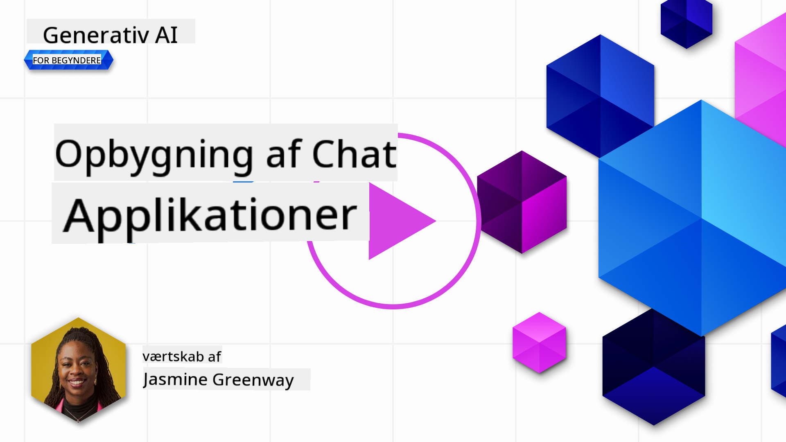
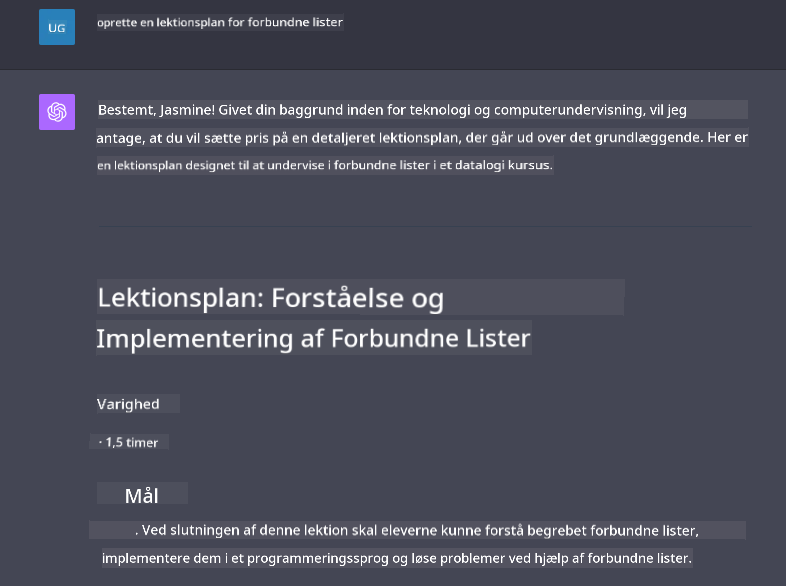

<!--
CO_OP_TRANSLATOR_METADATA:
{
  "original_hash": "ea4bbe640847aafbbba14dae4625e9af",
  "translation_date": "2025-05-19T17:54:14+00:00",
  "source_file": "07-building-chat-applications/README.md",
  "language_code": "da"
}
-->
# Bygning af chatapplikationer drevet af generativ AI

[](https://aka.ms/gen-ai-lessons7-gh?WT.mc_id=academic-105485-koreyst)

> _(Klik på billedet ovenfor for at se videoen af denne lektion)_

Nu hvor vi har set, hvordan vi kan bygge tekstgenererende apps, lad os se nærmere på chatapplikationer.

Chatapplikationer er blevet en integreret del af vores dagligdag og tilbyder mere end blot en måde at føre afslappede samtaler på. De er væsentlige dele af kundeservice, teknisk support og endda sofistikerede rådgivningssystemer. Det er sandsynligt, at du har fået hjælp fra en chatapplikation for nylig. Når vi integrerer mere avancerede teknologier som generativ AI i disse platforme, øges kompleksiteten og dermed også udfordringerne.

Nogle spørgsmål, vi skal have besvaret, er:

- **Bygning af appen**. Hvordan bygger vi effektivt og integrerer problemfrit disse AI-drevne applikationer til specifikke anvendelser?
- **Overvågning**. Når de er implementeret, hvordan kan vi overvåge og sikre, at applikationerne opererer på det højeste kvalitetsniveau, både med hensyn til funktionalitet og i overensstemmelse med de [seks principper for ansvarlig AI](https://www.microsoft.com/ai/responsible-ai?WT.mc_id=academic-105485-koreyst)?

Når vi bevæger os længere ind i en tid defineret af automatisering og problemfri interaktioner mellem mennesker og maskiner, bliver det essentielt at forstå, hvordan generativ AI transformerer rækkevidden, dybden og tilpasningsevnen af chatapplikationer. Denne lektion vil undersøge de arkitektoniske aspekter, der understøtter disse komplekse systemer, dykke ned i metoderne til finjustering af dem til domænespecifikke opgaver, og evaluere de metrikker og overvejelser, der er relevante for at sikre ansvarlig AI-implementering.

## Introduktion

Denne lektion dækker:

- Teknikker til effektivt at bygge og integrere chatapplikationer.
- Hvordan man anvender tilpasning og finjustering til applikationer.
- Strategier og overvejelser til effektivt at overvåge chatapplikationer.

## Læringsmål

Ved afslutningen af denne lektion vil du kunne:

- Beskrive overvejelser for bygning og integration af chatapplikationer i eksisterende systemer.
- Tilpasse chatapplikationer til specifikke anvendelser.
- Identificere nøglemetrikker og overvejelser til effektivt at overvåge og vedligeholde kvaliteten af AI-drevne chatapplikationer.
- Sikre, at chatapplikationer anvender AI ansvarligt.

## Integration af generativ AI i chatapplikationer

At løfte chatapplikationer gennem generativ AI handler ikke kun om at gøre dem klogere; det handler om at optimere deres arkitektur, ydeevne og brugergrænseflade for at levere en kvalitetsbrugeroplevelse. Dette involverer at undersøge de arkitektoniske fundamenter, API-integrationer og brugergrænsefladeovervejelser. Denne sektion har til formål at give dig en omfattende køreplan til at navigere i disse komplekse landskaber, uanset om du tilslutter dem til eksisterende systemer eller bygger dem som selvstændige platforme.

Ved afslutningen af denne sektion vil du være udstyret med den ekspertise, der er nødvendig for effektivt at konstruere og inkorporere chatapplikationer.

### Chatbot eller chatapplikation?

Før vi dykker ned i at bygge chatapplikationer, lad os sammenligne 'chatbots' med 'AI-drevne chatapplikationer', som tjener forskellige roller og funktioner. En chatbots hovedformål er at automatisere specifikke samtaleopgaver, såsom at besvare ofte stillede spørgsmål eller spore en pakke. Den styres typisk af regelbaseret logik eller komplekse AI-algoritmer. I kontrast er en AI-drevet chatapplikation et langt mere omfattende miljø designet til at facilitere forskellige former for digital kommunikation, såsom tekst-, tale- og videochats blandt menneskelige brugere. Dens definerende træk er integrationen af en generativ AI-model, der simulerer nuancerede, menneskelignende samtaler og genererer svar baseret på en bred vifte af input og kontekstuelle cues. En generativ AI-drevet chatapplikation kan engagere sig i åbne domænediskussioner, tilpasse sig udviklende samtalekontekster og endda producere kreative eller komplekse dialoger.

Tabellen nedenfor skitserer de vigtigste forskelle og ligheder for at hjælpe os med at forstå deres unikke roller i digital kommunikation.

| Chatbot                               | Generativ AI-drevet chatapplikation   |
| ------------------------------------- | -------------------------------------- |
| Opgavefokuseret og regelbaseret       | Kontekstbevidst                        |
| Ofte integreret i større systemer     | Kan være vært for en eller flere chatbots |
| Begrænset til programmerede funktioner | Inkorporerer generative AI-modeller    |
| Specialiserede og strukturerede interaktioner | I stand til åbne domænediskussioner   |

### Udnyttelse af forudbyggede funktionaliteter med SDK'er og API'er

Når man bygger en chatapplikation, er et godt første skridt at vurdere, hvad der allerede findes. At bruge SDK'er og API'er til at bygge chatapplikationer er en fordelagtig strategi af flere grunde. Ved at integrere veldokumenterede SDK'er og API'er positionerer du strategisk din applikation for langsigtet succes, adresserer skalerbarhed og vedligeholdelsesproblemer.

- **Fremskynder udviklingsprocessen og reducerer omkostninger**: At stole på forudbyggede funktionaliteter i stedet for den dyre proces med at bygge dem selv giver dig mulighed for at fokusere på andre aspekter af din applikation, som du måske finder vigtigere, såsom forretningslogik.
- **Bedre ydeevne**: Når man bygger funktionalitet fra bunden, vil man til sidst spørge sig selv "Hvordan skalerer det? Er denne applikation i stand til at håndtere en pludselig stigning i brugere?" Veldrevne SDK'er og API'er har ofte indbyggede løsninger til disse bekymringer.
- **Nem vedligeholdelse**: Opdateringer og forbedringer er lettere at administrere, da de fleste API'er og SDK'er blot kræver en opdatering af et bibliotek, når en nyere version frigives.
- **Adgang til banebrydende teknologi**: Udnyttelse af modeller, der er blevet finjusteret og trænet på omfattende datasæt, giver din applikation naturlige sprogfunktioner.

Adgang til funktionaliteten af en SDK eller API indebærer typisk at opnå tilladelse til at bruge de leverede tjenester, hvilket ofte sker gennem brugen af en unik nøgle eller autentificeringstoken. Vi vil bruge OpenAI Python Library til at udforske, hvordan dette ser ud. Du kan også prøve det selv i den følgende [notebook for OpenAI](../../../07-building-chat-applications/python/oai-assignment.ipynb) eller [notebook for Azure OpenAI Services](../../../07-building-chat-applications/python/aoai-assignment.ipynb) for denne lektion.

```python
import os
from openai import OpenAI

API_KEY = os.getenv("OPENAI_API_KEY","")

client = OpenAI(
    api_key=API_KEY
    )

chat_completion = client.chat.completions.create(model="gpt-3.5-turbo", messages=[{"role": "user", "content": "Suggest two titles for an instructional lesson on chat applications for generative AI."}])
```

Ovenstående eksempel bruger GPT-3.5 Turbo-modellen til at fuldføre prompten, men bemærk, at API-nøglen er sat før dette. Du ville modtage en fejl, hvis du ikke satte nøglen.

## Brugeroplevelse (UX)

Generelle UX-principper gælder for chatapplikationer, men her er nogle yderligere overvejelser, der bliver særligt vigtige på grund af de maskinlæringskomponenter, der er involveret.

- **Mekanisme til at adressere tvetydighed**: Generative AI-modeller genererer lejlighedsvis tvetydige svar. En funktion, der giver brugere mulighed for at bede om afklaring, kan være nyttig, hvis de støder på dette problem.
- **Kontekstbevarelse**: Avancerede generative AI-modeller har evnen til at huske kontekst inden for en samtale, hvilket kan være en nødvendig ressource for brugeroplevelsen. At give brugerne mulighed for at kontrollere og administrere kontekst forbedrer brugeroplevelsen, men introducerer risikoen for at bevare følsomme brugeroplysninger. Overvejelser for, hvor længe denne information opbevares, såsom at indføre en opbevaringspolitik, kan balancere behovet for kontekst mod privatliv.
- **Personalisering**: Med evnen til at lære og tilpasse sig tilbyder AI-modeller en individualiseret oplevelse for en bruger. Tilpasning af brugeroplevelsen gennem funktioner som brugerprofiler får ikke kun brugeren til at føle sig forstået, men det hjælper også deres søgen efter at finde specifikke svar, hvilket skaber en mere effektiv og tilfredsstillende interaktion.

Et sådant eksempel på personalisering er "Custom instructions"-indstillingerne i OpenAI's ChatGPT. Det giver dig mulighed for at give oplysninger om dig selv, der kan være vigtig kontekst for dine prompts. Her er et eksempel på en brugerdefineret instruktion.


Denne "profil" beder ChatGPT om at skabe en lektionsplan om linked lists. Bemærk, at ChatGPT tager højde for, at brugeren måske ønsker en mere dybdegående lektionsplan baseret på hendes erfaring.



### Microsofts Systemmeddelelsesramme for store sprogmodeller

[Microsoft har givet vejledning](https://learn.microsoft.com/azure/ai-services/openai/concepts/system-message#define-the-models-output-format?WT.mc_id=academic-105485-koreyst) til at skrive effektive systemmeddelelser, når der genereres svar fra LLM'er, opdelt i 4 områder:

1. Definere, hvem modellen er for, samt dens evner og begrænsninger.
2. Definere modellens outputformat.
3. Give specifikke eksempler, der demonstrerer modellens tilsigtede adfærd.
4. Give yderligere adfærdsmæssige sikkerhedsforanstaltninger.

### Tilgængelighed

Uanset om en bruger har syns-, høre-, motoriske eller kognitive handicap, bør en veludformet chatapplikation være brugbar for alle. Følgende liste nedbryder specifikke funktioner, der sigter mod at forbedre tilgængeligheden for forskellige brugerhandicap.

- **Funktioner for synshandicap**: Højkontrasttemaer og justerbar tekst, skærmlæserkompatibilitet.
- **Funktioner for hørehæmning**: Tekst-til-tale- og tale-til-tekst-funktioner, visuelle signaler for lydmeddelelser.
- **Funktioner for motorisk handicap**: Understøttelse af tastaturnavigation, stemmekommandoer.
- **Funktioner for kognitive handicap**: Forenklede sprogindstillinger.

## Tilpasning og finjustering for domænespecifikke sprogmodeller

Forestil dig en chatapplikation, der forstår dit virksomheds jargon og forudser de specifikke forespørgsler, som dens brugerbase ofte har. Der er et par tilgange, der er værd at nævne:

- **Udnyttelse af DSL-modeller**. DSL står for domænespecifikt sprog. Du kan udnytte en såkaldt DSL-model, der er trænet på et specifikt domæne til at forstå dets koncepter og scenarier.
- **Anvend finjustering**. Finjustering er processen med at træne din model yderligere med specifikke data.

## Tilpasning: Brug af en DSL

Udnyttelse af domænespecifikke sprogmodeller (DSL-modeller) kan forbedre brugerengagementet ved at levere specialiserede, kontekstuelt relevante interaktioner. Det er en model, der er trænet eller finjusteret til at forstå og generere tekst relateret til et specifikt felt, industri eller emne. Mulighederne for at bruge en DSL-model kan variere fra at træne en fra bunden til at bruge eksisterende gennem SDK'er og API'er. En anden mulighed er finjustering, som involverer at tage en eksisterende forudtrænet model og tilpasse den til et specifikt domæne.

## Tilpasning: Anvend finjustering

Finjustering overvejes ofte, når en forudtrænet model ikke lever op til forventningerne i et specialiseret domæne eller en specifik opgave.

For eksempel er medicinske forespørgsler komplekse og kræver meget kontekst. Når en medicinsk professionel diagnosticerer en patient, er det baseret på en række faktorer såsom livsstil eller allerede eksisterende tilstande og kan endda stole på nylige medicinske tidsskrifter for at validere deres diagnose. I sådanne nuancerede scenarier kan en generel AI-chatapplikation ikke være en pålidelig kilde.

### Scenario: en medicinsk applikation

Overvej en chatapplikation designet til at hjælpe medicinske fagfolk ved at give hurtige referencer til behandlingsretningslinjer, lægemiddelinteraktioner eller nylige forskningsresultater.

En generel model kan være tilstrækkelig til at besvare grundlæggende medicinske spørgsmål eller give generelle råd, men den kan have problemer med følgende:

- **Meget specifikke eller komplekse tilfælde**. For eksempel kan en neurolog spørge applikationen, "Hvad er de nuværende bedste praksis for håndtering af lægemiddelresistent epilepsi hos pædiatriske patienter?"
- **Manglende nylige fremskridt**. En generel model kan have svært ved at give et aktuelt svar, der inkorporerer de nyeste fremskridt inden for neurologi og farmakologi.

I tilfælde som disse kan finjustering af modellen med et specialiseret medicinsk datasæt betydeligt forbedre dens evne til at håndtere disse komplekse medicinske forespørgsler mere præcist og pålideligt. Dette kræver adgang til et stort og relevant datasæt, der repræsenterer de domænespecifikke udfordringer og spørgsmål, der skal adresseres.

## Overvejelser for en høj kvalitets AI-drevet chatoplevelse

Denne sektion skitserer kriterierne for "højkvalitets" chatapplikationer, som inkluderer indfangelse af handlingsrettede metrikker og overholdelse af en ramme, der ansvarligt udnytter AI-teknologi.

### Nøglemetrikker

For at opretholde den høje ydeevne for en applikation er det essentielt at holde styr på nøglemetrikker og overvejelser. Disse målinger sikrer ikke kun applikationens funktionalitet, men vurderer også kvaliteten af AI-modellen og brugeroplevelsen. Nedenfor er en liste, der dækker grundlæggende, AI- og brugeroplevelsesmetrikker, der skal overvejes.

| Metric                        | Definition                                                                                                             | Overvejelser for chatudvikler                                             |
| ----------------------------- | ---------------------------------------------------------------------------------------------------------------------- | ------------------------------------------------------------------------- |
| **Oppetid**                   | Måler den tid, applikationen er operationel og tilgængelig for brugere.                                                | Hvordan vil du minimere nedetid?                                          |
| **Svartid**                   | Den tid, applikationen tager at svare på en brugers forespørgsel.                                                      | Hvordan kan du optimere forespørgselsbehandlingen for at forbedre svartiden? |
| **Præcision**                 | Forholdet mellem sande positive forudsigelser og det samlede antal positive forudsigelser                              | Hvordan vil du validere modellens præcision?                              |
| **Recall (Sensitivitet)**     | Forholdet mellem sande positive forudsigelser og det faktiske antal positive                                           | Hvordan vil du måle og forbedre recall?                                   |
| **F1 Score**                  | Den harmoniske gennemsnit af præcision og recall, der balancerer kompromiset mellem begge.                             | Hvad er dit mål for F1 Score? Hvordan vil du balancere præcision og recall? |
| **Perpleksitet**              | Måler, hvor godt den sandsynlighedsfordeling, der er forudsagt af modellen, stemmer overens med dataens faktiske fordeling. | Hvordan vil du minimere perpleksitet?                                     |
| **Brugertilfredshedsmålinger**| Måler brugerens opfattelse af applikationen. Ofte fanget gennem undersøgelser.                                         | Hvor ofte vil du indsamle brugerfeedback? Hvordan vil du tilpasse dig baseret på det? |
| **Fejlfrekvens**              | Frekvensen, hvormed modellen laver fejl i forståelse eller output.                                                     | Hvilke strategier har du på plads for at reducere fejlfrekvenser?         |
| **Genoptræningscyklusser**    | Frekvensen, hvormed modellen opdateres for at inkorporere nye data og indsigter.                                      | Hvor ofte vil du genoptræne modellen? Hvad udløser en genoptræningscyklus? |
| **Anomal

**Ansvarsfraskrivelse**:  
Dette dokument er blevet oversat ved hjælp af AI-oversættelsestjenesten [Co-op Translator](https://github.com/Azure/co-op-translator). Selvom vi bestræber os på at opnå nøjagtighed, bedes du være opmærksom på, at automatiserede oversættelser kan indeholde fejl eller unøjagtigheder. Det originale dokument på dets oprindelige sprog bør betragtes som den autoritative kilde. For kritisk information anbefales professionel menneskelig oversættelse. Vi er ikke ansvarlige for misforståelser eller fejltolkninger, der opstår som følge af brugen af denne oversættelse.