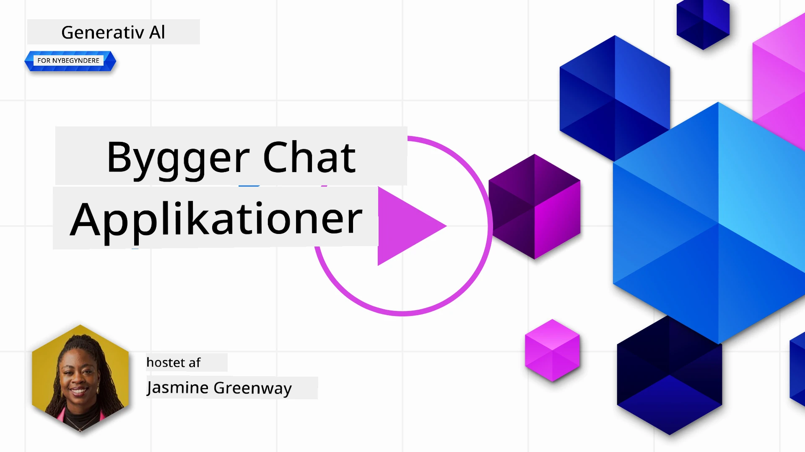
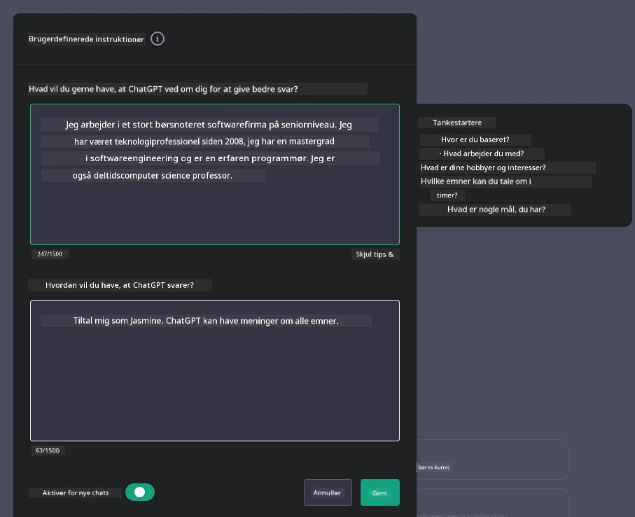
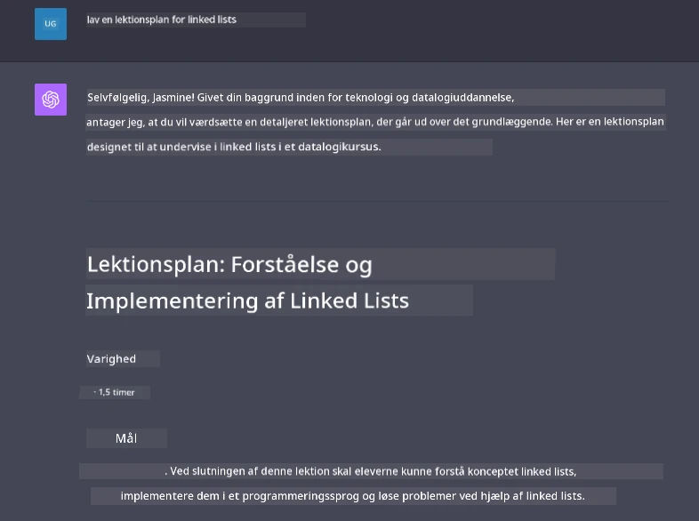

# Bygning af generative AI-drevne chatapplikationer

[](https://youtu.be/R9V0ZY1BEQo?si=IHuU-fS9YWT8s4sA)

> _(Klik på billedet ovenfor for at se videoen af denne lektion)_

Nu hvor vi har set, hvordan vi kan bygge tekstgenereringsapps, lad os se nærmere på chatapplikationer.

Chatapplikationer er blevet integreret i vores daglige liv og tilbyder mere end bare en måde at føre uformelle samtaler på. De er integrerede dele af kundeservice, teknisk support og endda sofistikerede rådgivningssystemer. Det er sandsynligt, at du har fået hjælp fra en chatapplikation for nylig. Når vi integrerer mere avancerede teknologier som generativ AI i disse platforme, øges kompleksiteten, og det samme gør udfordringerne.

Nogle spørgsmål, vi skal have besvaret, er:

- **Opbygning af appen**. Hvordan bygger vi effektivt og integrerer problemfrit disse AI-drevne applikationer til specifikke anvendelsestilfælde?
- **Overvågning**. Når de er implementeret, hvordan kan vi overvåge og sikre, at applikationerne fungerer på højeste kvalitetsniveau, både med hensyn til funktionalitet og overholdelse af de [seks principper for ansvarlig AI](https://www.microsoft.com/ai/responsible-ai?WT.mc_id=academic-105485-koreyst)?

Når vi bevæger os videre ind i en æra defineret af automatisering og sømløs menneske-maskine-interaktion, bliver forståelsen af, hvordan generativ AI forvandler omfanget, dybden og tilpasningsevnen af chatapplikationer, essentiel. Denne lektion vil undersøge arkitekturens aspekter, der understøtter disse komplekse systemer, dykke ned i metoder til finjustering til domænespecifikke opgaver og evaluere metrics og hensyn relevante for ansvarlig AI-implementering.

## Introduktion

Denne lektion dækker:

- Teknikker til effektivt at bygge og integrere chatapplikationer.
- Hvordan man anvender tilpasning og finjustering til applikationer.
- Strategier og overvejelser for effektiv overvågning af chatapplikationer.

## Læringsmål

Ved slutningen af denne lektion vil du kunne:

- Beskrive overvejelser ved opbygning og integration af chatapplikationer i eksisterende systemer.
- Tilpasse chatapplikationer til specifikke anvendelsestilfælde.
- Identificere nøglemetrics og overvejelser for effektivt at overvåge og opretholde kvaliteten af AI-drevne chatapplikationer.
- Sikre, at chatapplikationer bruger AI ansvarligt.

## Integration af generativ AI i chatapplikationer

At løfte chatapplikationer gennem generativ AI handler ikke kun om at gøre dem smartere; det handler om at optimere deres arkitektur, ydeevne og brugergrænseflade for at levere en kvalitetsbrugeroplevelse. Dette indebærer at undersøge de arkitektoniske fundamenter, API-integrationer og overvejelser vedrørende brugergrænsefladen. Dette afsnit har til formål at tilbyde dig en omfattende køreplan for at navigere i disse komplekse landskaber, hvad enten du kobler dem på eksisterende systemer eller bygger dem som selvstændige platforme.

Ved slutningen af dette afsnit vil du være udstyret med den ekspertise, der er nødvendig for effektivt at konstruere og inkorporere chatapplikationer.

### Chatbot eller chatapplikation?

Før vi dykker ned i at bygge chatapplikationer, lad os sammenligne 'chatbots' med 'AI-drevne chatapplikationer', som tjener forskellige roller og funktionaliteter. En chatbots hovedformål er at automatisere specifikke samtaleopgaver, såsom at besvare ofte stillede spørgsmål eller følge en pakke. Den styres typisk af regelbaseret logik eller komplekse AI-algoritmer. I kontrast er en AI-drevet chatapplikation et langt bredere miljø designet til at facilitere forskellige former for digital kommunikation, såsom tekst-, tale- og videochats blandt menneskelige brugere. Dens definerende træk er integrationen af en generativ AI-model, der simulerer nuancerede, menneskelige samtaler og genererer svar baseret på en bred vifte af input og kontekstuelle cues. En generativ AI-drevet chatapplikation kan engagere sig i åbne domænediskussioner, tilpasse sig udviklende samtalekontekster og endda producere kreative eller komplekse dialoger.

Tabellen nedenfor skitserer de vigtigste forskelle og ligheder for at hjælpe os med at forstå deres unikke roller i digital kommunikation.

| Chatbot                               | Generative AI-Drevet Chatapplikation   |
| ------------------------------------- | -------------------------------------- |
| Opgavefokuseret og regelbaseret       | Kontekstbevidst                        |
| Ofte integreret i større systemer     | Kan være vært for en eller flere chatbots |
| Begrænset til programmerede funktioner| Indeholder generative AI-modeller      |
| Specialiserede & strukturerede interaktioner | I stand til åbne domænediskussioner    |

### Udnyttelse af forudbyggede funktionaliteter med SDK'er og API'er

Når man bygger en chatapplikation, er et godt første trin at vurdere, hvad der allerede findes. Brug af SDK'er og API'er til at bygge chatapplikationer er en fordelagtig strategi af flere grunde. Ved at integrere vel-dokumenterede SDK'er og API'er positionerer du strategisk din applikation for langsigtet succes og tackler skalerbarheds- og vedligeholdelsesproblemer.

- **Fremmer udviklingsprocessen og reducerer overhead**: At stole på forudbyggede funktionaliteter i stedet for den dyre proces at bygge dem selv, giver dig mulighed for at fokusere på andre aspekter af din applikation, som du måske finder vigtigere, såsom forretningslogik.
- **Bedre ydeevne**: Når du bygger funktionalitet fra bunden, vil du til sidst spørge dig selv: "Hvordan skalerer det? Er denne applikation i stand til at håndtere et pludseligt tilstrømning af brugere?" Velholdte SDK'er og API'er har ofte indbyggede løsninger til disse problemstillinger.
- **Nemmere vedligeholdelse**: Opdateringer og forbedringer er lettere at håndtere, da de fleste API'er og SDK'er blot kræver en opdatering af biblioteket, når en nyere version udgives.
- **Adgang til banebrydende teknologi**: Udnyttelse af modeller, der er finjusteret og trænet på omfattende datasæt, giver din applikation naturlige sprogfunktioner.

Adgang til funktionalitet i en SDK eller API indebærer typisk at opnå tilladelse til at bruge de leverede tjenester, ofte via en unik nøgle eller autentifikationstoken. Vi vil bruge OpenAI Python-biblioteket til at udforske, hvordan det ser ud. Du kan også prøve det selv i følgende [notebook til OpenAI](./python/oai-assignment.ipynb?WT.mc_id=academic-105485-koreyst) eller [notebook til Azure OpenAI Services](./python/aoai-assignment.ipynb?WT.mc_id=academic-105485-koreys) til denne lektion.

```python
import os
from openai import OpenAI

API_KEY = os.getenv("OPENAI_API_KEY","")

client = OpenAI(
    api_key=API_KEY
    )

response = client.responses.create(model="gpt-4o-mini", input="Suggest two titles for an instructional lesson on chat applications for generative AI.", store=False)
print(response.output_text)
```

Ovenstående eksempel bruger GPT-4o mini-modellen med Responses API til at færdiggøre prompten, men bemærk at API-nøglen er sat inden. Du vil få en fejl, hvis du ikke sætter nøglen.

## Brugeroplevelse (UX)

Generelle UX-principper gælder for chatapplikationer, men her er nogle yderligere overvejelser, der bliver særligt vigtige på grund af de maskinlæringskomponenter, der er involveret.

- **Mekanisme til håndtering af tvetydighed**: Generative AI-modeller frembringer lejlighedsvis tvetydige svar. En funktion, der tillader brugere at bede om uddybning, kan være hjælpsom, hvis de støder på dette problem.
- **Kontekstbevarelse**: Avancerede generative AI-modeller har evnen til at huske kontekst inden for en samtale, hvilket kan være en nødvendig ressource for brugeroplevelsen. At give brugerne mulighed for at kontrollere og håndtere konteksten forbedrer brugeroplevelsen, men introducerer risikoen for at bevare følsomme brugerdata. Overvejelser om, hvor længe denne information gemmes, såsom at indføre en opbevaringspolitik, kan balancere behovet for kontekst mod privatliv.
- **Personaliseret oplevelse**: Med evnen til at lære og tilpasse sig tilbyder AI-modeller en individuel oplevelse for en bruger. Tilpasning af brugeroplevelsen gennem funktioner som brugerprofiler gør ikke kun brugeren føle sig forstået, men hjælper også med at finde specifikke svar, hvilket skaber en mere effektiv og tilfredsstillende interaktion.

Et eksempel på personalisering er "Custom instructions"-indstillingerne i OpenAI's ChatGPT. Det tillader dig at give oplysninger om dig selv, der kan være vigtig kontekst for dine prompts. Her er et eksempel på en brugerdefineret instruktion.



Denne "profil" instruerer ChatGPT til at lave en lektionsplan om linked lists. Bemærk, at ChatGPT tager hensyn til, at brugeren måske ønsker en mere dybdegående lektionsplan baseret på hendes erfaring.



### Microsofts systemmeddelelsesramme for store sprogmodeller

[Microsoft har givet vejledning](https://learn.microsoft.com/azure/ai-services/openai/concepts/system-message#define-the-models-output-format?WT.mc_id=academic-105485-koreyst) til effektiv skrivning af systemmeddelelser ved generering af svar fra LLM'er opdelt i 4 områder:

1. Definere, hvem modellen er for, samt dens kapaciteter og begrænsninger.
2. Definere modellens outputformat.
3. Give specifikke eksempler, der demonstrerer modellens tilsigtede adfærd.
4. Give yderligere adfærdsregulerende rammer.

### Tilgængelighed

Uanset om en bruger har syns-, hørelse-, motoriske eller kognitive funktionsnedsættelser, bør en veludformet chatapplikation kunne bruges af alle. Følgende liste nedbryder specifikke funktioner målrettet forbedring af tilgængelighed for forskellige brugernes funktionsnedsættelser.

- **Funktioner til synshandicap**: Højkontrasttemaer og tekst, der kan ændres i størrelse, skærmlæserkompatibilitet.
- **Funktioner til hørenedsættelse**: Tekst-til-tale og tale-til-tekst-funktioner, visuelle signaler for lydmeddelelser.
- **Funktioner til motoriske begrænsninger**: Understøttelse af tastaturnavigation, stemmekommandoer.
- **Funktioner til kognitive begrænsninger**: Forenklede sprogindstillinger.

## Tilpasning og finjustering af domænespecifikke sprogmodeller

Forestil dig en chatapplikation, som forstår dit firmas jargon og forudser de specifikke forespørgsler, som brugerne ofte har. Der er et par tilgange værd at nævne:

- **Udnyttelse af DSL-modeller**. DSL står for domænespecifikt sprog. Du kan bruge en såkaldt DSL-model trænet på et specifikt domæne for at forstå dets koncepter og scenarier.
- **Anvend finjustering**. Finjustering er processen med at træne din model yderligere med specifikke data.

## Tilpasning: Brug af en DSL

Udnyttelse af domænespecifikke sprogmodeller (DSL-modeller) kan øge brugerengagement ved at tilbyde specialiserede, kontekstuelt relevante interaktioner. Det er en model, der er trænet eller finjusteret til at forstå og generere tekst relateret til et specifikt felt, industri eller emne. Mulighederne for at bruge en DSL-model kan variere fra at træne en fra bunden til at bruge eksisterende gennem SDK'er og API'er. En anden mulighed er finjustering, som involverer at tage en eksisterende fortrænet model og tilpasse den til et specifikt domæne.

## Tilpasning: Anvend finjustering

Finjustering overvejes ofte, når en fortrænet model ikke er tilstrækkelig i et specialiseret domæne eller specifik opgave.

For eksempel er medicinske forespørgsler komplekse og kræver meget kontekst. Når en medicinsk professionel diagnosticerer en patient, baseres det på en række faktorer som livsstil eller eksisterende lidelser og kan endda støtte sig til nyere medicinske tidsskrifter for at validere diagnosen. I sådanne nuancerede scenarier kan en generel AI-chatapplikation ikke være en pålidelig kilde.

### Scenario: en medicinsk applikation

Overvej en chatapplikation designet til at hjælpe medicinske praktikere ved at give hurtige referencer til behandlingsretningslinjer, lægemiddelinteraktioner eller nyere forskningsresultater.

En generel model kan være tilstrækkelig til at besvare grundlæggende medicinske spørgsmål eller give generel rådgivning, men den kan have vanskeligheder med følgende:

- **Meget specifikke eller komplekse sager**. For eksempel kunne en neurolog spørge applikationen: "Hvad er de nuværende bedste praksisser for håndtering af medicinresistent epilepsi hos pædiatriske patienter?"
- **Manglende nyere fremskridt**. En generel model kan have vanskeligheder med at levere et aktuelt svar, der inkorporerer de nyeste fremskridt inden for neurologi og farmakologi.

I sådanne tilfælde kan en finjustering af modellen med et specialiseret medicinsk datasæt i betydelig grad forbedre dens evne til mere præcist og pålideligt at håndtere disse komplekse medicinske forespørgsler. Dette kræver adgang til et stort og relevant datasæt, der repræsenterer domænespecifikke udfordringer og spørgsmål, der skal adresseres.

## Overvejelser for en AI-drevet chatoplevelse af høj kvalitet

Dette afsnit skitserer kriterierne for "høj-kvalitets" chatapplikationer, som inkluderer indsamlingen af handlingsrettede metrics og overholdelse af en ramme, der ansvarligt udnytter AI-teknologi.

### Nøglemetrics

For at opretholde en applikations højtydende præstation er det væsentligt at holde styr på nøglemetrics og overvejelser. Disse målinger sikrer ikke kun funktionaliteten af applikationen, men vurderer også kvaliteten af AI-modellen og brugeroplevelsen. Nedenfor er en liste, der dækker basale, AI- og brugeroplevelsesmetrics, som bør overvejes.

| Metric                        | Definition                                                                                                             | Overvejelser for chatudvikler                                              |
| ----------------------------- | ---------------------------------------------------------------------------------------------------------------------- | ------------------------------------------------------------------------- |
| **Oppetid**                   | Måler den tid, applikationen er operationel og tilgængelig for brugere.                                               | Hvordan vil du minimere nedetid?                                           |
| **Responstid**                | Den tid, applikationen tager for at svare på en brugers forespørgsel.                                                  | Hvordan kan du optimere forespørgselsbehandling for at forbedre responstiden? |
| **Præcision**                 | Forholdet mellem sande positive forudsigelser og det totale antal positive forudsigelser                              | Hvordan vil du validere præcisionen af din model?                          |
| **Recall (Sensitivitet)**     | Forholdet mellem sande positive forudsigelser og det faktiske antal positives                                         | Hvordan vil du måle og forbedre recall?                                   |
| **F1 Score**                 | Det harmoniske gennemsnit af præcision og recall, som balancerer afvejningen mellem begge                              | Hvad er dit mål for F1 Score? Hvordan vil du balancere præcision og recall? |
| **Forvirringsgrad (Perplexity)** | Måler, hvor godt den sandsynlighedsfordeling, som modellen forudsiger, matcher den faktiske fordeling af dataen.      | Hvordan vil du minimere forvirringsgrad?                                  |
| **Brugertilfredshedsmetrics** | Måler brugerens opfattelse af applikationen. Ofte indsamlet via spørgeskemaer.                                         | Hvor ofte vil du indsamle brugerfeedback? Hvordan vil du tilpasse dig efter det? |
| **Fejlrate**                 | Satsen hvormed modellen laver fejl i forståelse eller output.                                                         | Hvilke strategier har du for at reducere fejlrater?                        |
| **Genoptræningscyklusser**   | Hyppigheden, hvormed modellen opdateres for at inkorporere nye data og indsigter.                                     | Hvor ofte vil du genoptræne modellen? Hvad udløser en genoptræningscyklus?  |

| **Anomaliopdagelse**        | Værktøjer og teknikker til at identificere usædvanlige mønstre, der ikke overholder forventet adfærd.                     | Hvordan vil du reagere på anomalier?                                      |

### Implementering af Ansvarlig AI i Chatapplikationer

Microsofts tilgang til Ansvarlig AI har identificeret seks principper, der bør guide AI-udvikling og -brug. Nedenfor er principperne, deres definition og ting, som en chatudvikler bør overveje, samt hvorfor de bør tage dem alvorligt.

| Principper            | Microsofts Definition                                | Overvejelser for Chatudvikler                                          | Hvorfor det er vigtigt                                                                |
| --------------------- | --------------------------------------------------- | ---------------------------------------------------------------------- | ------------------------------------------------------------------------------------- |
| Retfærdighed          | AI-systemer bør behandle alle mennesker retfærdigt. | Sørg for, at chatapplikationen ikke diskriminerer baseret på brugerdata. | For at opbygge tillid og inklusion blandt brugere; undgår juridiske konsekvenser.     |
| Pålidelighed og Sikkerhed | AI-systemer bør fungere pålideligt og sikkert.       | Implementer test og failsafes for at minimere fejl og risici.           | Sikrer brugertilfredshed og forebygger potentiel skade.                               |
| Privatliv og Sikkerhed | AI-systemer skal være sikre og respektere privatliv. | Implementer stærk kryptering og databeskyttelsesforanstaltninger.       | For at beskytte følsomme brugerdata og overholde privatlivslove.                      |
| Inklusion             | AI-systemer bør styrke alle og engagere mennesker.    | Design UI/UX, der er tilgængelig og nem at bruge for forskellige grupper. | Sikrer, at en bredere gruppe mennesker effektivt kan bruge applikationen.             |
| Gennemsigtighed       | AI-systemer bør være forståelige.                     | Giv klar dokumentation og begrundelse for AI-responser.                 | Brugere har større sandsynlighed for at stole på et system, hvis de kan forstå beslutningerne. |
| Ansvarlighed          | Mennesker bør være ansvarlige for AI-systemer.        | Etabler en klar proces for revision og forbedring af AI-beslutninger.   | Muliggør løbende forbedringer og korrigerende tiltag i tilfælde af fejl.              |

## Opgave

Se [assignment](../../../07-building-chat-applications/python). Den vil tage dig igennem en række øvelser fra at køre dine første chatprompter, til at klassificere og opsummere tekst og mere. Bemærk, at opgaverne findes i forskellige programmeringssprog!

## Godt arbejde! Fortsæt rejsen

Efter at have gennemført denne lektion, kan du tjekke vores [Generative AI Learning collection](https://aka.ms/genai-collection?WT.mc_id=academic-105485-koreyst) for at fortsætte med at øge din viden om Generativ AI!

Gå videre til Lektion 8 for at se, hvordan du kan begynde at [bygge søgeapplikationer](../08-building-search-applications/README.md?WT.mc_id=academic-105485-koreyst)!

---

<!-- CO-OP TRANSLATOR DISCLAIMER START -->
**Ansvarsfraskrivelse**:
Dette dokument er blevet oversat ved hjælp af AI-oversættelsestjenesten [Co-op Translator](https://github.com/Azure/co-op-translator). Selvom vi bestræber os på nøjagtighed, skal du være opmærksom på, at automatiserede oversættelser kan indeholde fejl eller unøjagtigheder. Det originale dokument på dets oprindelige sprog bør betragtes som den autoritative kilde. For kritisk information anbefales professionel menneskelig oversættelse. Vi påtager os intet ansvar for misforståelser eller fejltolkninger, der opstår som følge af brugen af denne oversættelse.
<!-- CO-OP TRANSLATOR DISCLAIMER END -->