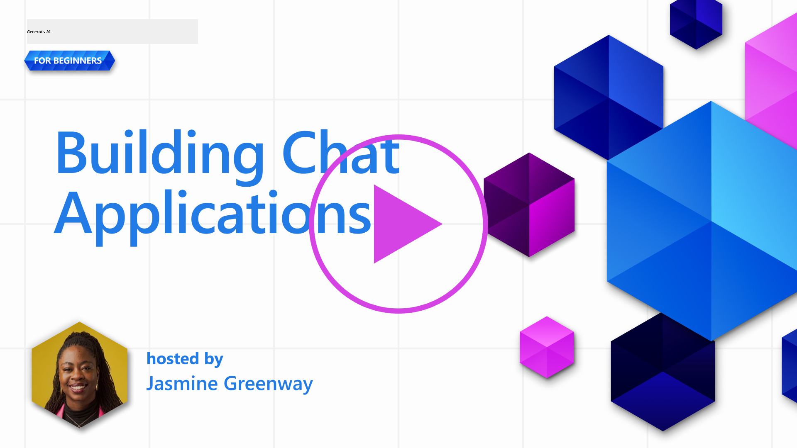

<!--
CO_OP_TRANSLATOR_METADATA:
{
  "original_hash": "ea4bbe640847aafbbba14dae4625e9af",
  "translation_date": "2025-07-09T12:31:12+00:00",
  "source_file": "07-building-chat-applications/README.md",
  "language_code": "da"
}
-->
# Bygning af Generative AI-Drevne Chatapplikationer

[](https://aka.ms/gen-ai-lessons7-gh?WT.mc_id=academic-105485-koreyst)

> _(Klik på billedet ovenfor for at se videoen til denne lektion)_

Nu hvor vi har set, hvordan vi kan bygge tekstgenererende apps, lad os kigge nærmere på chatapplikationer.

Chatapplikationer er blevet en integreret del af vores dagligdag og tilbyder mere end blot en måde at føre uformelle samtaler på. De er en væsentlig del af kundeservice, teknisk support og endda avancerede rådgivningssystemer. Det er sandsynligt, at du for nylig har fået hjælp fra en chatapplikation. Når vi integrerer mere avancerede teknologier som generativ AI i disse platforme, øges kompleksiteten – og det samme gør udfordringerne.

Nogle spørgsmål, vi skal have svar på, er:

- **Bygning af appen**. Hvordan bygger vi effektivt og integrerer disse AI-drevne applikationer problemfrit til specifikke anvendelsestilfælde?
- **Overvågning**. Når de er implementeret, hvordan kan vi så overvåge og sikre, at applikationerne fungerer på højeste kvalitetsniveau, både hvad angår funktionalitet og overholdelse af [de seks principper for ansvarlig AI](https://www.microsoft.com/ai/responsible-ai?WT.mc_id=academic-105485-koreyst)?

Efterhånden som vi bevæger os ind i en æra præget af automatisering og sømløse menneske-maskine-interaktioner, bliver det essentielt at forstå, hvordan generativ AI ændrer omfanget, dybden og tilpasningsevnen af chatapplikationer. Denne lektion vil undersøge arkitekturens aspekter, der understøtter disse komplekse systemer, dykke ned i metoder til finjustering for domænespecifikke opgaver og evaluere de målepunkter og overvejelser, der er relevante for ansvarlig AI-implementering.

## Introduktion

Denne lektion dækker:

- Teknikker til effektivt at bygge og integrere chatapplikationer.
- Hvordan man anvender tilpasning og finjustering på applikationer.
- Strategier og overvejelser for effektiv overvågning af chatapplikationer.

## Læringsmål

Når du har gennemført denne lektion, vil du kunne:

- Beskrive overvejelser ved opbygning og integration af chatapplikationer i eksisterende systemer.
- Tilpasse chatapplikationer til specifikke anvendelsestilfælde.
- Identificere nøglemålepunkter og overvejelser for effektiv overvågning og vedligeholdelse af kvaliteten i AI-drevne chatapplikationer.
- Sikre, at chatapplikationer anvender AI ansvarligt.

## Integration af Generativ AI i Chatapplikationer

At løfte chatapplikationer med generativ AI handler ikke kun om at gøre dem klogere; det handler om at optimere deres arkitektur, ydeevne og brugergrænseflade for at levere en kvalitetsoplevelse. Det indebærer at undersøge arkitektoniske fundamenter, API-integrationer og brugergrænsefladeovervejelser. Dette afsnit har til formål at give dig en omfattende køreplan til at navigere i disse komplekse landskaber, uanset om du integrerer dem i eksisterende systemer eller bygger dem som selvstændige platforme.

Når du er færdig med dette afsnit, vil du have den nødvendige ekspertise til effektivt at opbygge og integrere chatapplikationer.

### Chatbot eller Chatapplikation?

Før vi dykker ned i at bygge chatapplikationer, lad os sammenligne 'chatbots' med 'AI-drevne chatapplikationer', som tjener forskellige roller og funktionaliteter. En chatbots hovedformål er at automatisere specifikke samtaleopgaver, såsom at besvare ofte stillede spørgsmål eller spore en pakke. Den styres typisk af regelbaseret logik eller komplekse AI-algoritmer. Til sammenligning er en AI-drevet chatapplikation et langt mere omfattende miljø designet til at facilitere forskellige former for digital kommunikation, såsom tekst-, stemme- og videochats mellem menneskelige brugere. Dens kendetegn er integrationen af en generativ AI-model, der simulerer nuancerede, menneskelignende samtaler og genererer svar baseret på en bred vifte af input og kontekstuelle signaler. En generativ AI-drevet chatapplikation kan deltage i åbne diskussioner, tilpasse sig skiftende samtalekontekster og endda producere kreative eller komplekse dialoger.

Tabellen nedenfor skitserer de vigtigste forskelle og ligheder for at hjælpe os med at forstå deres unikke roller i digital kommunikation.

| Chatbot                               | Generativ AI-Drevet Chatapplikation   |
| ------------------------------------- | ------------------------------------ |
| Opgavefokuseret og regelbaseret       | Kontekstbevidst                      |
| Ofte integreret i større systemer     | Kan rumme en eller flere chatbots    |
| Begrænset til programmerede funktioner| Indarbejder generative AI-modeller  |
| Specialiserede & strukturerede interaktioner | I stand til åbne diskussioner         |

### Udnyttelse af færdigbyggede funktioner med SDK’er og API’er

Når man bygger en chatapplikation, er et godt første skridt at vurdere, hvad der allerede findes. At bruge SDK’er og API’er til at bygge chatapplikationer er en fordelagtig strategi af flere grunde. Ved at integrere veldokumenterede SDK’er og API’er positionerer du strategisk din applikation for langsigtet succes og tager højde for skalerbarhed og vedligeholdelse.

- **Fremskynder udviklingsprocessen og reducerer omkostninger**: Ved at stole på færdigbyggede funktioner i stedet for den dyre proces at bygge dem selv, kan du fokusere på andre aspekter af din applikation, som du måske finder vigtigere, såsom forretningslogik.
- **Bedre ydeevne**: Når du bygger funktionalitet fra bunden, vil du på et tidspunkt spørge dig selv: "Hvordan skalerer det? Kan denne applikation håndtere en pludselig stigning i brugere?" Velholdte SDK’er og API’er har ofte indbyggede løsninger til disse udfordringer.
- **Nemmere vedligeholdelse**: Opdateringer og forbedringer er lettere at håndtere, da de fleste API’er og SDK’er blot kræver en opdatering af et bibliotek, når en nyere version frigives.
- **Adgang til banebrydende teknologi**: Ved at udnytte modeller, der er finjusteret og trænet på omfattende datasæt, får din applikation naturlige sprogfunktioner.

Adgang til funktionalitet i et SDK eller API involverer typisk at få tilladelse til at bruge de leverede tjenester, hvilket ofte sker via en unik nøgle eller autentifikationstoken. Vi vil bruge OpenAI Python Library til at udforske, hvordan det ser ud. Du kan også prøve det selv i følgende [notebook for OpenAI](../../../07-building-chat-applications/python/oai-assignment.ipynb) eller [notebook for Azure OpenAI Services](../../../07-building-chat-applications/python/aoai-assignment.ipynb) til denne lektion.

```python
import os
from openai import OpenAI

API_KEY = os.getenv("OPENAI_API_KEY","")

client = OpenAI(
    api_key=API_KEY
    )

chat_completion = client.chat.completions.create(model="gpt-3.5-turbo", messages=[{"role": "user", "content": "Suggest two titles for an instructional lesson on chat applications for generative AI."}])
```

Eksemplet ovenfor bruger GPT-3.5 Turbo-modellen til at fuldføre prompten, men bemærk, at API-nøglen er sat, inden det sker. Du vil få en fejl, hvis du ikke sætter nøglen.

## Brugeroplevelse (UX)

Generelle UX-principper gælder for chatapplikationer, men her er nogle ekstra overvejelser, som bliver særligt vigtige på grund af de involverede maskinlæringskomponenter.

- **Mekanisme til håndtering af tvetydighed**: Generative AI-modeller kan nogle gange generere tvetydige svar. En funktion, der giver brugerne mulighed for at bede om uddybning, kan være nyttig, hvis de støder på dette problem.
- **Kontekstbevarelse**: Avancerede generative AI-modeller har evnen til at huske konteksten i en samtale, hvilket kan være en nødvendig fordel for brugeroplevelsen. At give brugerne mulighed for at kontrollere og styre konteksten forbedrer oplevelsen, men medfører også risiko for at bevare følsomme brugeroplysninger. Overvejelser om, hvor længe disse oplysninger opbevares, såsom at indføre en opbevaringspolitik, kan balancere behovet for kontekst med hensyn til privatliv.
- **Personalisering**: Med evnen til at lære og tilpasse sig tilbyder AI-modeller en individuel oplevelse for brugeren. At skræddersy brugeroplevelsen gennem funktioner som brugerprofiler får ikke kun brugeren til at føle sig forstået, men hjælper også med at finde specifikke svar, hvilket skaber en mere effektiv og tilfredsstillende interaktion.

Et eksempel på personalisering er "Custom instructions"-indstillingerne i OpenAI’s ChatGPT. Det giver dig mulighed for at give oplysninger om dig selv, som kan være vigtig kontekst for dine prompts. Her er et eksempel på en brugerdefineret instruktion.


Denne "profil" får ChatGPT til at lave en lektionsplan om linked lists. Bemærk, at ChatGPT tager højde for, at brugeren måske ønsker en mere dybdegående lektionsplan baseret på hendes erfaring.


### Microsofts System Message Framework for Large Language Models

[Microsoft har givet vejledning](https://learn.microsoft.com/azure/ai-services/openai/concepts/system-message#define-the-models-output-format?WT.mc_id=academic-105485-koreyst) til at skrive effektive systembeskeder, når man genererer svar fra LLM’er, opdelt i 4 områder:

1. Definere, hvem modellen er til, samt dens kapaciteter og begrænsninger.
2. Definere modellens outputformat.
3. Give specifikke eksempler, der demonstrerer modellens tilsigtede adfærd.
4. Give yderligere adfærdsregler.

### Tilgængelighed

Uanset om en bruger har syns-, hørelse-, motoriske eller kognitive udfordringer, bør en veludformet chatapplikation kunne bruges af alle. Følgende liste beskriver specifikke funktioner, der sigter mod at forbedre tilgængeligheden for forskellige brugerbegrænsninger.

- **Funktioner for synshandicap**: Højkontrasttemaer og justerbar tekststørrelse, kompatibilitet med skærmlæsere.
- **Funktioner for hørenedsættelse**: Tekst-til-tale og tale-til-tekst funktioner, visuelle signaler for lydnotifikationer.
- **Funktioner for motoriske handicap**: Tastaturnavigation, stemmekommandoer.
- **Funktioner for kognitive handicap**: Forenklet sprogvalg.

## Tilpasning og Finjustering af Domænespecifikke Sprogmodeller

Forestil dig en chatapplikation, der forstår din virksomheds jargon og forudser de specifikke spørgsmål, som dens brugere ofte stiller. Der er et par tilgange, der er værd at nævne:

- **Udnyttelse af DSL-modeller**. DSL står for domain specific language (domænespecifikt sprog). Du kan udnytte en såkaldt DSL-model, der er trænet på et specifikt domæne for at forstå dets begreber og scenarier.
- **Anvend finjustering**. Finjustering er processen med at træne din model yderligere med specifikke data.

## Tilpasning: Brug af en DSL

Udnyttelse af domænespecifikke sprogmodeller (DSL-modeller) kan øge brugerengagementet ved at tilbyde specialiserede, kontekstrelevante interaktioner. Det er en model, der er trænet eller finjusteret til at forstå og generere tekst relateret til et bestemt felt, industri eller emne. Mulighederne for at bruge en DSL-model kan variere fra at træne en fra bunden til at bruge eksisterende gennem SDK’er og API’er. En anden mulighed er finjustering, som indebærer at tage en eksisterende fortrænet model og tilpasse den til et specifikt domæne.

## Tilpasning: Anvend finjustering

Finjustering overvejes ofte, når en fortrænet model ikke er tilstrækkelig i et specialiseret domæne eller til en specifik opgave.

For eksempel er medicinske forespørgsler komplekse og kræver meget kontekst. Når en medicinsk fagperson stiller en diagnose, baseres det på en række faktorer som livsstil eller eksisterende sygdomme og kan endda bygge på nylige medicinske artikler for at validere diagnosen. I sådanne nuancerede scenarier kan en generel AI-chatapplikation ikke være en pålidelig kilde.

### Scenario: en medicinsk applikation

Forestil dig en chatapplikation designet til at hjælpe medicinske fagfolk ved at give hurtige referencer til behandlingsretningslinjer, lægemiddelinteraktioner eller nylige forskningsresultater.

En generel model kan være tilstrækkelig til at besvare grundlæggende medicinske spørgsmål eller give generel rådgivning, men den kan have svært ved følgende:

- **Meget specifikke eller komplekse tilfælde**. For eksempel kan en neurolog spørge applikationen: "Hvad er de nuværende bedste praksisser for håndtering af medicinresistent epilepsi hos børn?"
- **Manglende opdateringer om nyeste fremskridt**. En generel model kan have svært ved at give et aktuelt svar, der inkluderer de seneste fremskridt inden for neurologi og farmakologi.

I sådanne tilfælde kan finjustering af modellen med et specialiseret medicinsk datasæt markant forbedre dens evne til at håndtere disse komplekse medicinske forespørgsler mere præcist og pålideligt. Det kræver adgang til et stort og relevant datasæt, der repræsenterer de domænespecifikke udfordringer og spørgsmål, der skal adresseres.

## Overvejelser for en Højkvalitets AI-Drevet Chatoplevelse

Dette afsnit skitserer kriterierne for "højkvalitets" chatapplikationer, som inkluderer indsamling af handlingsrettede målepunkter og overholdelse af en ramme, der ansvarligt udnytter AI-teknologi.

### Nøglemålepunkter

For at opretholde en applikations høje ydeevne er det essentielt at holde styr på nøglemålepunkter og overvejelser. Disse målinger sikrer ikke kun applikationens funktionalitet, men vurderer også kvaliteten af AI-modellen og brugeroplevelsen. Nedenfor er en liste, der dækker grundlæggende, AI- og brugeroplevelsesmålepunkter, som bør overvejes.

| Målepunkt                    | Definition                                                                                                             | Overvejelser for Chatudvikler                                         |
| ---------------------------- | ---------------------------------------------------------------------------------------------------------------------- | --------------------------------------------------------------------- |
| **Oppetid**                  | Måler den tid, applikationen er operationel og tilgængelig for brugere.                                               | Hvordan vil du minimere nedetid?                                      |
| **Responstid**               | Den tid, applikationen bruger på at svare på en brugers forespørgsel.                                                  | Hvordan kan du optimere forespørgselsbehandlingen for at forbedre responstiden? |
| **Præcision**                | Forholdet mellem sande positive forudsigelser og det samlede antal positive forudsigelser.                            | Hvordan vil du validere modellens præcision?                          |
| **Recall (Sensitivitet)**    | Forholdet mellem sande positive forudsigelser og det faktiske antal positive tilfælde.                                | Hvordan vil du måle og forbedre recall?                               |
| **F1 Score**                 | Det harmoniske gennemsnit af præcision og recall, der balancerer kompromiset mellem begge.                            | Hvad er dit mål for F1 Score? Hvordan vil du balancere præcision og recall? |
| **Perplexity**               | Måler, hvor godt den sandsynlighedsfordeling, modellen forudsiger, stemmer overens med den faktiske datafordeling.    | Hvordan vil du minimere perplexity?                                   |
| **Brugertilfredshedsmålinger** | Måler brugerens opfattelse af applikationen. Ofte indsamlet via spørgeskemaer.                                         | Hvor ofte vil du indsamle brugerfeedback? Hvordan vil du tilpasse dig på baggrund af det? |
| **Fejlrate**                 | Hastigheden, hvormed modellen laver fejl i forståelse eller output.                                                   | Hvilke strategier har du for at reducere fejlrate?                    |
| **Gen-træningscyklusser**   | Hvor ofte modellen opdateres for at inkorporere nye data og indsigt.                                                  | Hvor ofte vil du gen-træne modellen? Hvad udløser en gen-træningscyklus? |
| **Anomali-detektion**         | Værktøjer og teknikker til at identificere usædvanlige mønstre, der ikke stemmer overens med forventet adfærd.                        | Hvordan vil du reagere på anomalier?                                        |

### Implementering af Ansvarlige AI-principper i Chat-applikationer

Microsofts tilgang til Ansvarlig AI har identificeret seks principper, der bør vejlede udvikling og brug af AI. Nedenfor er principperne, deres definition samt ting, en chat-udvikler bør overveje, og hvorfor de skal tages alvorligt.

| Principper             | Microsofts definition                                | Overvejelser for chat-udvikler                                      | Hvorfor det er vigtigt                                                                     |
| ---------------------- | ----------------------------------------------------- | ---------------------------------------------------------------------- | ------------------------------------------------------------------------------------------ |
| Fairness               | AI-systemer skal behandle alle mennesker retfærdigt. | Sørg for, at chat-applikationen ikke diskriminerer baseret på brugerdata.  | For at opbygge tillid og inklusion blandt brugere; undgår juridiske konsekvenser.          |
| Reliability and Safety | AI-systemer skal fungere pålideligt og sikkert.       | Implementer test og fejlsikringer for at minimere fejl og risici.         | Sikrer brugertilfredshed og forhindrer potentielle skader.                                |
| Privacy and Security   | AI-systemer skal være sikre og respektere privatliv.  | Implementer stærk kryptering og databeskyttelsesforanstaltninger.          | For at beskytte følsomme brugerdata og overholde privatlivslovgivning.                     |
| Inclusiveness          | AI-systemer skal styrke alle og engagere mennesker.   | Design UI/UX, der er tilgængeligt og nemt at bruge for forskellige brugere. | Sikrer, at en bredere gruppe mennesker kan bruge applikationen effektivt.                 |
| Transparency           | AI-systemer skal være forståelige.                     | Giv klar dokumentation og begrundelse for AI-svar.                         | Brugere har større tillid til et system, hvis de kan forstå, hvordan beslutninger træffes. |
| Accountability         | Mennesker skal være ansvarlige for AI-systemer.       | Etabler en klar proces for revision og forbedring af AI-beslutninger.      | Muliggør løbende forbedringer og korrigerende tiltag ved fejl.                            |

## Opgave

Se [assignment](../../../07-building-chat-applications/python) – den tager dig igennem en række øvelser fra at køre dine første chat-prompt, til at klassificere og opsummere tekst og mere. Bemærk, at opgaverne findes på forskellige programmeringssprog!

## Godt arbejde! Fortsæt rejsen

Efter at have gennemført denne lektion, kan du tjekke vores [Generative AI Learning collection](https://aka.ms/genai-collection?WT.mc_id=academic-105485-koreyst) for at fortsætte med at udvikle din viden om Generativ AI!

Gå videre til Lektion 8 for at se, hvordan du kan begynde at [bygge søgeapplikationer](../08-building-search-applications/README.md?WT.mc_id=academic-105485-koreyst)!

**Ansvarsfraskrivelse**:  
Dette dokument er blevet oversat ved hjælp af AI-oversættelsestjenesten [Co-op Translator](https://github.com/Azure/co-op-translator). Selvom vi bestræber os på nøjagtighed, bedes du være opmærksom på, at automatiserede oversættelser kan indeholde fejl eller unøjagtigheder. Det oprindelige dokument på dets oprindelige sprog bør betragtes som den autoritative kilde. For kritisk information anbefales professionel menneskelig oversættelse. Vi påtager os intet ansvar for misforståelser eller fejltolkninger, der opstår som følge af brugen af denne oversættelse.