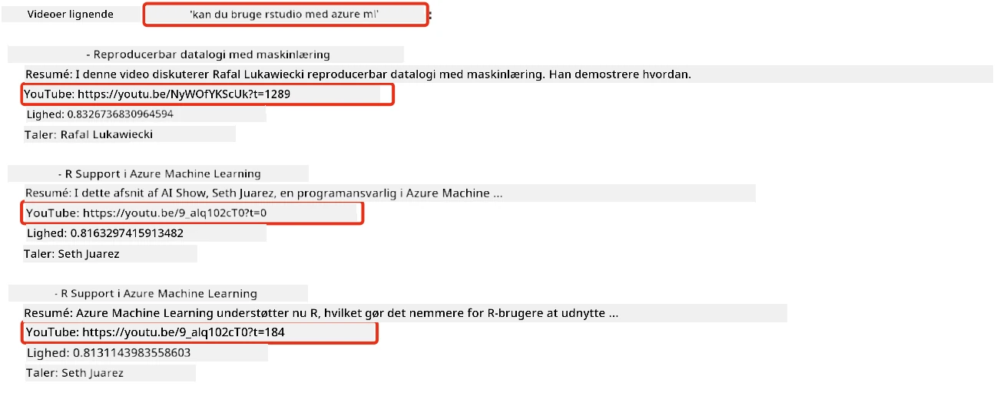
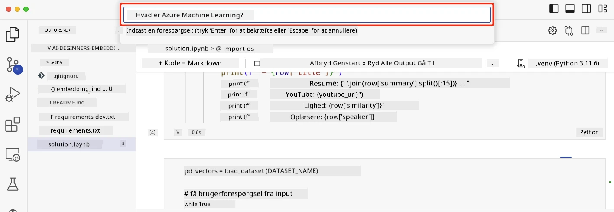

# Bygning af en søgeapplikation

[](https://youtu.be/W0-nzXjOjr0?si=GcsqiTTvd7RKbo7V)

> > _Klik på billedet ovenfor for at se video af denne lektion_

Der er mere i LLM'er end chatboter og tekstgenerering. Det er også muligt at bygge søgeapplikationer ved brug af Embeddings. Embeddings er numeriske repræsentationer af data, også kendt som vektorer, og kan bruges til semantisk søgning efter data.

I denne lektion skal du bygge en søgeapplikation til vores uddannelsesstart-up. Vores start-up er en non-profit organisation, der tilbyder gratis uddannelse til studerende i udviklingslande. Vores start-up har et stort antal YouTube-videoer, som studerende kan bruge til at lære om AI. Vores start-up ønsker at bygge en søgeapplikation, der tillader studerende at søge efter en YouTube-video ved at skrive et spørgsmål.

For eksempel kunne en studerende skrive 'Hvad er Jupyter Notebooks?' eller 'Hvad er Azure ML', og søgeapplikationen vil returnere en liste over YouTube-videoer, der er relevante for spørgsmålet, og endnu bedre, søgeapplikationen vil returnere et link til det sted i videoen, hvor svaret på spørgsmålet findes.

## Introduktion

I denne lektion vil vi dække:

- Semantisk vs nøgleordsøgning.
- Hvad er tekst-embeddings.
- Oprettelse af et indeks for tekst-embeddings.
- Søgning i et indeks for tekst-embeddings.

## Læringsmål

Efter at have gennemført denne lektion vil du kunne:

- Skelne mellem semantisk søgning og nøgleordsøgning.
- Forklare, hvad tekst-embeddings er.
- Oprette en applikation ved hjælp af embeddings til at søge efter data.

## Hvorfor bygge en søgeapplikation?

At bygge en søgeapplikation vil hjælpe dig med at forstå, hvordan man bruger embeddings til at søge efter data. Du vil også lære at bygge en søgeapplikation, som studerende kan bruge til hurtigt at finde information.

Lektionen inkluderer et embedding-indeks af YouTube-transskriptionerne for Microsofts [AI Show](https://www.youtube.com/playlist?list=PLlrxD0HtieHi0mwteKBOfEeOYf0LJU4O1) YouTube-kanal. AI Show er en YouTube-kanal, der underviser i AI og maskinlæring. Embedding-indekset indeholder embeddings for hver af YouTube-transskriptionerne frem til oktober 2023. Du vil bruge embedding-indekset til at bygge en søgeapplikation til vores start-up. Søgeapplikationen returnerer et link til det sted i videoen, hvor svaret på spørgsmålet findes. Dette er en fantastisk måde for studerende at finde den information, de har brug for, hurtigt.

Følgende er et eksempel på en semantisk søgning for spørgsmålet 'kan du bruge rstudio med azure ml?'. Tjek YouTube-URL'en, du vil se, at URL'en indeholder et tidsstempel, der tager dig til det sted i videoen, hvor svaret på spørgsmålet findes.



## Hvad er semantisk søgning?

Nu spekulerer du måske på, hvad semantisk søgning er? Semantisk søgning er en søgeteknik, der bruger semantik, eller betydningen, af ordene i en forespørgsel for at returnere relevante resultater.

Her er et eksempel på en semantisk søgning. Lad os sige, at du ville købe en bil, du kunne søge efter 'min drømmebil', semantisk søgning forstår, at du ikke `drømmer` om en bil, men snarere leder efter din `ideelle` bil. Semantisk søgning forstår din intention og returnerer relevante resultater. Alternativet er `nøgleordsøgning`, som bogstaveligt ville søge efter drømme om biler og ofte returnerer irrelevante resultater.

## Hvad er tekst-embeddings?

[Tekst-embeddings](https://en.wikipedia.org/wiki/Word_embedding?WT.mc_id=academic-105485-koreyst) er en teknik til tekstrepræsentation, som bruges i [naturlig sprogbehandling](https://en.wikipedia.org/wiki/Natural_language_processing?WT.mc_id=academic-105485-koreyst). Tekst-embeddings er semantiske numeriske repræsentationer af tekst. Embeddings bruges til at repræsentere data på en måde, der er let for en maskine at forstå. Der findes mange modeller til at bygge tekst-embeddings; i denne lektion fokuserer vi på at generere embeddings ved brug af OpenAI Embedding-modellen.

Her er et eksempel, forestil dig følgende tekst er fra en transskription af en af episoderne på AI Show YouTube-kanalen:

```text
Today we are going to learn about Azure Machine Learning.
```

Vi ville sende teksten til OpenAI Embedding API'en, og den ville returnere den følgende embedding, bestående af 1536 tal, også kaldet en vektor. Hvert tal i vektoren repræsenterer en forskellig aspekt af teksten. Af korthed vises her de første 10 tal i vektoren.

```python
[-0.006655829958617687, 0.0026128944009542465, 0.008792596869170666, -0.02446001023054123, -0.008540431968867779, 0.022071078419685364, -0.010703742504119873, 0.003311325330287218, -0.011632772162556648, -0.02187200076878071, ...]
```

## Hvordan oprettes embedding-indekset?

Embedding-indekset til denne lektion blev oprettet med en række Python-scripts. Du finder scripts sammen med instruktioner i [README](./scripts/README.md?WT.mc_id=academic-105485-koreyst) i 'scripts'-mappen til denne lektion. Du behøver ikke at køre disse scripts for at gennemføre lektionen, da embedding-indekset allerede er leveret til dig.

Scriptsene udfører følgende operationer:

1. Transskriptionen for hver YouTube-video i [AI Show](https://www.youtube.com/playlist?list=PLlrxD0HtieHi0mwteKBOfEeOYf0LJU4O1) playlisten downloades.
2. Ved brug af [OpenAI-funktioner](https://learn.microsoft.com/azure/ai-foundry/openai/how-to/function-calling?WT.mc_id=academic-105485-koreyst), forsøges det at udtrække talerens navn fra de første 3 minutter af YouTube-transskriptionen. Talernavnet for hver video gemmes i embedding-indekset med navnet `embedding_index_3m.json`.
3. Transskriptionsteksten opdeles derefter i **3-minutters tekstsegmenter**. Segmentet inkluderer cirka 20 overlappende ord fra næste segment for at sikre, at embedding for segmentet ikke afbrydes, og for at give bedre søgekontekst.
4. Hvert tekstsegment sendes derefter til OpenAI Chat API for at opsummere teksten til 60 ord. Resuméet gemmes også i embedding-indekset `embedding_index_3m.json`.
5. Endelig sendes segmentteksten til OpenAI Embedding API. Embedding API returnerer en vektor med 1536 tal, som repræsenterer den semantiske betydning af segmentet. Segmentet sammen med OpenAI-embedding-vektoren gemmes i embedding-indekset `embedding_index_3m.json`.

### Vektor-databaser

For lektionens enkelhed gemmes embedding-indekset i en JSON-fil med navnet `embedding_index_3m.json` og indlæses i en Pandas DataFrame. Men i produktion ville embedding-indekset blive gemt i en vektordatabase som [Azure Cognitive Search](https://learn.microsoft.com/training/modules/improve-search-results-vector-search?WT.mc_id=academic-105485-koreyst), [Redis](https://cookbook.openai.com/examples/vector_databases/redis/readme?WT.mc_id=academic-105485-koreyst), [Pinecone](https://cookbook.openai.com/examples/vector_databases/pinecone/readme?WT.mc_id=academic-105485-koreyst), [Weaviate](https://cookbook.openai.com/examples/vector_databases/weaviate/readme?WT.mc_id=academic-105485-koreyst), for at nævne nogle få.

## Forståelse af cosinus-similaritet

Vi har lært om tekst-embeddings, næste trin er at lære, hvordan man bruger tekst-embeddings til at søge efter data, og især finde de mest lignende embeddings til en given forespørgsel ved brug af cosinus-similaritet.

### Hvad er cosinus-similaritet?

Cosinus-similaritet er et mål for lighed mellem to vektorer, du vil også høre dette kaldt `nærmeste nabo-søgning`. For at udføre en cosinus-similaritetssøgning skal du _vektorisere_ for _forespørgsels_-tekst ved brug af OpenAI Embedding API. Derefter beregnes _cosinus-similariteten_ mellem forespørgselsvektoren og hver vektor i embedding-indekset. Husk, at embedding-indekset har en vektor for hvert YouTube-transskripttekstssegment. Til slut sorteres resultaterne efter cosinus-similaritet, og tekstsegmenterne med den højeste cosinus-similaritet er mest lig forespørgslen.

Fra et matematisk perspektiv måler cosinus-similaritet cosinus til vinklen mellem to vektorer projiceret i et multidimensionelt rum. Denne måling er fordelagtig, fordi hvis to dokumenter er langt fra hinanden efter euklidisk afstand på grund af størrelse, kan de stadig have en mindre vinkel mellem sig og derfor højere cosinus-similaritet. For mere information om formler for cosinus-similaritet, se [Cosine similarity](https://en.wikipedia.org/wiki/Cosine_similarity?WT.mc_id=academic-105485-koreyst).

## Byg din første søgeapplikation

Næste trin er at lære at bygge en søgeapplikation ved hjælp af embeddings. Søgeapplikationen vil tillade studerende at søge efter en video ved at skrive et spørgsmål. Søgeapplikationen vil returnere en liste over videoer, der er relevante for spørgsmålet. Søgeapplikationen vil også returnere et link til det sted i videoen, hvor svaret på spørgsmålet findes.

Denne løsning er bygget og testet på Windows 11, macOS og Ubuntu 22.04 ved brug af Python 3.10 eller senere. Du kan downloade Python fra [python.org](https://www.python.org/downloads/?WT.mc_id=academic-105485-koreyst).

## Opgave - byg en søgeapplikation, så studerende kan bruge den

Vi introducerede vores start-up i begyndelsen af denne lektion. Nu er det tid til at give de studerende mulighed for at bygge en søgeapplikation til deres opgaver.

I denne opgave skal du oprette Azure OpenAI-tjenesterne, som vil blive brugt til at bygge søgeapplikationen. Du skal oprette følgende Azure OpenAI-tjenester. Du skal have et Azure-abonnement for at kunne gennemføre denne opgave.

### Start Azure Cloud Shell

1. Log ind på [Azure-portalen](https://portal.azure.com/?WT.mc_id=academic-105485-koreyst).
2. Vælg Cloud Shell-ikonet øverst til højre i Azure-portalen.
3. Vælg **Bash** som miljøtype.

#### Opret en resource group

> Til disse instruktioner bruger vi resource-gruppen med navnet "semantic-video-search" i East US.
> Du kan ændre navnet på resource-gruppen, men når du ændrer placeringen af ressourcerne,
> tjek [modelltabel for tilgængelighed](https://aka.ms/oai/models?WT.mc_id=academic-105485-koreyst).

```shell
az group create --name semantic-video-search --location eastus
```

#### Opret en Azure OpenAI Service-ressource

Fra Azure Cloud Shell skal du køre følgende kommando for at oprette en Azure OpenAI Service-ressource.

```shell
az cognitiveservices account create --name semantic-video-openai --resource-group semantic-video-search \
    --location eastus --kind OpenAI --sku s0
```

#### Hent endpoint og nøgler til brug i denne applikation

Fra Azure Cloud Shell skal du køre følgende kommandoer for at hente endpoint og nøgler for Azure OpenAI Service-ressourcen.

```shell
az cognitiveservices account show --name semantic-video-openai \
   --resource-group  semantic-video-search | jq -r .properties.endpoint
az cognitiveservices account keys list --name semantic-video-openai \
   --resource-group semantic-video-search | jq -r .key1
```

#### Implementer OpenAI Embedding-modellen

Fra Azure Cloud Shell skal du køre følgende kommando for at implementere OpenAI Embedding-modellen.

```shell
az cognitiveservices account deployment create \
    --name semantic-video-openai \
    --resource-group  semantic-video-search \
    --deployment-name text-embedding-ada-002 \
    --model-name text-embedding-ada-002 \
    --model-version "2"  \
    --model-format OpenAI \
    --sku-capacity 100 --sku-name "Standard"
```

## Løsning

Åbn [løsningsnotebooken](./python/aoai-solution.ipynb?WT.mc_id=academic-105485-koreyst) i GitHub Codespaces og følg instruktionerne i Jupyter Notebook.

Når du kører notebooken, bliver du bedt om at indtaste en forespørgsel. Indtastningsboksen vil se sådan ud:



## Godt arbejde! Fortsæt din læring

Efter at have gennemført denne lektion, tjek vores [Generative AI læringskollektion](https://aka.ms/genai-collection?WT.mc_id=academic-105485-koreyst) for at fortsætte med at opgradere din viden om Generativ AI!

Gå videre til Lektion 9, hvor vi ser på, hvordan man [bygger applikationer til billedgenerering](../09-building-image-applications/README.md?WT.mc_id=academic-105485-koreyst)!

---

<!-- CO-OP TRANSLATOR DISCLAIMER START -->
**Ansvarsfraskrivelse**:
Dette dokument er blevet oversat ved hjælp af AI-oversættelsestjenesten [Co-op Translator](https://github.com/Azure/co-op-translator). Selvom vi bestræber os på nøjagtighed, skal du være opmærksom på, at automatiserede oversættelser kan indeholde fejl eller unøjagtigheder. Det originale dokument på dets oprindelige sprog bør betragtes som den autoritative kilde. For kritisk information anbefales professionel menneskelig oversættelse. Vi påtager os intet ansvar for misforståelser eller fejltolkninger, der opstår som følge af brugen af denne oversættelse.
<!-- CO-OP TRANSLATOR DISCLAIMER END -->