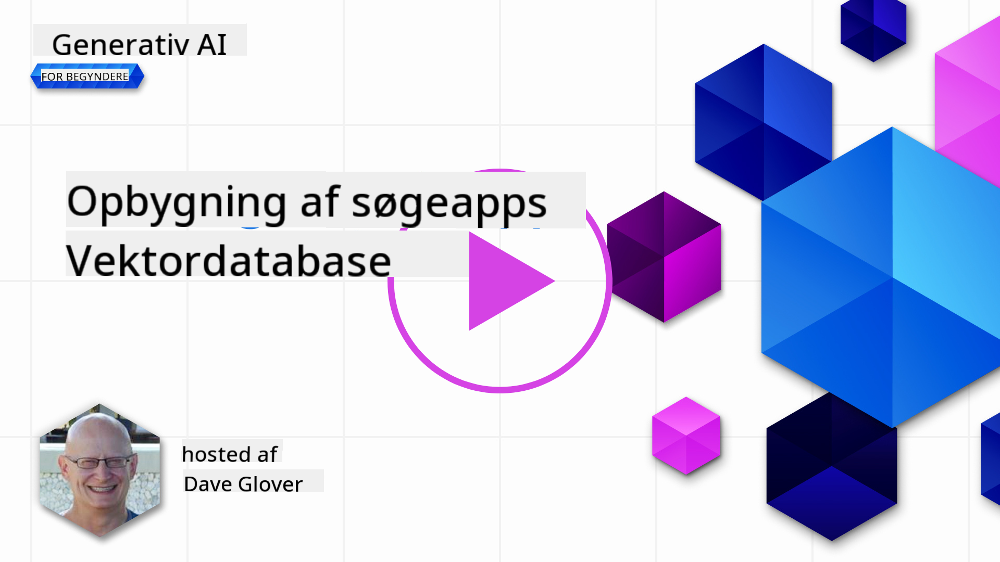
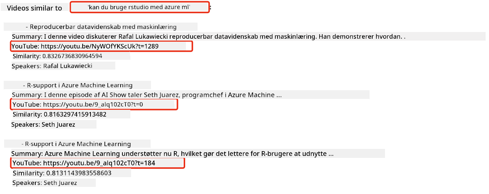
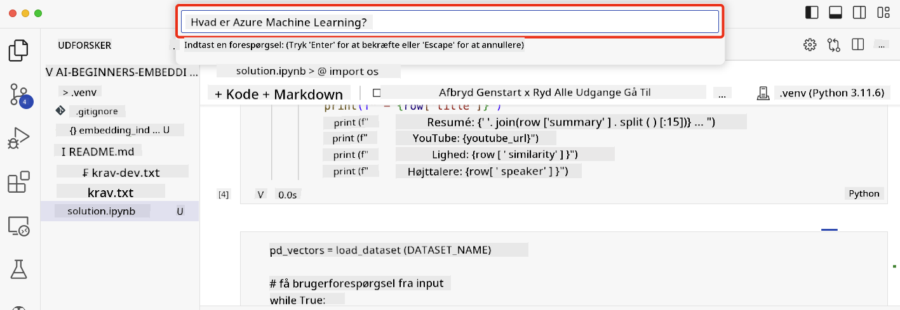

<!--
CO_OP_TRANSLATOR_METADATA:
{
  "original_hash": "d46aad0917a1a342d613e2c13d457da5",
  "translation_date": "2025-06-25T16:31:46+00:00",
  "source_file": "08-building-search-applications/README.md",
  "language_code": "da"
}
-->
# Bygning af søgeapplikationer

[](https://aka.ms/gen-ai-lesson8-gh?WT.mc_id=academic-105485-koreyst)

> > _Klik på billedet ovenfor for at se videoen af denne lektion_

Der er mere til LLM'er end chatbots og tekstgenerering. Det er også muligt at bygge søgeapplikationer ved hjælp af Embeddings. Embeddings er numeriske repræsentationer af data, også kendt som vektorer, og kan bruges til semantisk søgning efter data.

I denne lektion skal du bygge en søgeapplikation til vores uddannelsesstart-up. Vores start-up er en non-profit organisation, der tilbyder gratis uddannelse til studerende i udviklingslande. Vores start-up har et stort antal YouTube-videoer, som studerende kan bruge til at lære om AI. Vores start-up ønsker at bygge en søgeapplikation, der tillader studerende at søge efter en YouTube-video ved at skrive et spørgsmål.

For eksempel kan en studerende skrive 'Hvad er Jupyter Notebooks?' eller 'Hvad er Azure ML', og søgeapplikationen vil returnere en liste over YouTube-videoer, der er relevante for spørgsmålet, og endnu bedre, søgeapplikationen vil returnere et link til det sted i videoen, hvor svaret på spørgsmålet findes.

## Introduktion

I denne lektion vil vi dække:

- Semantisk vs Keyword søgning.
- Hvad er Tekst Embeddings.
- Oprettelse af en Tekst Embeddings Indeks.
- Søge i en Tekst Embeddings Indeks.

## Læringsmål

Efter at have gennemført denne lektion, vil du kunne:

- Skelne mellem semantisk og keyword søgning.
- Forklare, hvad Tekst Embeddings er.
- Oprette en applikation ved hjælp af Embeddings til at søge efter data.

## Hvorfor bygge en søgeapplikation?

At skabe en søgeapplikation vil hjælpe dig med at forstå, hvordan man bruger Embeddings til at søge efter data. Du vil også lære, hvordan man bygger en søgeapplikation, som studerende kan bruge til hurtigt at finde information.

Lektion inkluderer en Embedding Index af YouTube-transkriptionerne for Microsoft [AI Show](https://www.youtube.com/playlist?list=PLlrxD0HtieHi0mwteKBOfEeOYf0LJU4O1) YouTube-kanalen. AI Show er en YouTube-kanal, der lærer dig om AI og maskinlæring. Embedding Index indeholder Embeddings for hver af YouTube-transkriptionerne indtil oktober 2023. Du vil bruge Embedding Index til at bygge en søgeapplikation til vores start-up. Søgeapplikationen returnerer et link til det sted i videoen, hvor svaret på spørgsmålet findes. Dette er en fantastisk måde for studerende at finde den information, de har brug for hurtigt.

Følgende er et eksempel på en semantisk forespørgsel for spørgsmålet 'kan du bruge rstudio med azure ml?'. Tjek YouTube-url'en, du vil se, at url'en indeholder et tidsstempel, der tager dig til det sted i videoen, hvor svaret på spørgsmålet findes.



## Hvad er semantisk søgning?

Nu undrer du dig måske, hvad er semantisk søgning? Semantisk søgning er en søgeteknik, der bruger semantikken eller betydningen af ordene i en forespørgsel til at returnere relevante resultater.

Her er et eksempel på en semantisk søgning. Lad os sige, du ledte efter at købe en bil, du kunne søge efter 'min drømmebil', semantisk søgning forstår, at du ikke `dreaming` om en bil, men snarere søger at købe din `ideal` bil. Semantisk søgning forstår din intention og returnerer relevante resultater. Alternativet er `keyword search`, som bogstaveligt ville søge efter drømme om biler og ofte returnere irrelevante resultater.

## Hvad er Tekst Embeddings?

[Text embeddings](https://en.wikipedia.org/wiki/Word_embedding?WT.mc_id=academic-105485-koreyst) er en tekstrepræsentationsteknik, der bruges i [natural language processing](https://en.wikipedia.org/wiki/Natural_language_processing?WT.mc_id=academic-105485-koreyst). Tekst embeddings er semantiske numeriske repræsentationer af tekst. Embeddings bruges til at repræsentere data på en måde, der er let for en maskine at forstå. Der er mange modeller til at bygge tekst embeddings, i denne lektion vil vi fokusere på at generere embeddings ved hjælp af OpenAI Embedding Model.

Her er et eksempel, forestil dig, at følgende tekst er i en transskription fra en af episoderne på AI Show YouTube-kanalen:

```text
Today we are going to learn about Azure Machine Learning.
```

Vi ville sende teksten til OpenAI Embedding API, og den ville returnere følgende embedding bestående af 1536 tal, også kendt som en vektor. Hvert tal i vektoren repræsenterer et andet aspekt af teksten. For korthedens skyld er her de første 10 tal i vektoren.

```python
[-0.006655829958617687, 0.0026128944009542465, 0.008792596869170666, -0.02446001023054123, -0.008540431968867779, 0.022071078419685364, -0.010703742504119873, 0.003311325330287218, -0.011632772162556648, -0.02187200076878071, ...]
```

## Hvordan oprettes Embedding Index?

Embedding Index for denne lektion blev oprettet med en række Python-scripts. Du finder scriptsene sammen med instruktioner i [README](./scripts/README.md?WT.mc_id=academic-105485-koreyst) i 'scripts' mappen for denne lektion. Du behøver ikke køre disse scripts for at gennemføre denne lektion, da Embedding Index er leveret til dig.

Scriptsene udfører følgende operationer:

1. Transkriptionen for hver YouTube-video i [AI Show](https://www.youtube.com/playlist?list=PLlrxD0HtieHi0mwteKBOfEeOYf0LJU4O1) playlisten downloades.
2. Ved hjælp af [OpenAI Functions](https://learn.microsoft.com/azure/ai-services/openai/how-to/function-calling?WT.mc_id=academic-105485-koreyst), forsøges der at udtrække talerens navn fra de første 3 minutter af YouTube-transkriptionen. Talerens navn for hver video gemmes i Embedding Index navngivet `embedding_index_3m.json`.
3. Transkriptionsteksten opdeles derefter i **3 minutters tekstsegmenter**. Segmentet inkluderer omkring 20 ord, der overlapper fra det næste segment for at sikre, at Embedding for segmentet ikke afbrydes og for at give bedre søgekontekst.
4. Hvert tekstsegment sendes derefter til OpenAI Chat API for at opsummere teksten til 60 ord. Resuméet gemmes også i Embedding Index `embedding_index_3m.json`.
5. Endelig sendes segmentteksten til OpenAI Embedding API. Embedding API returnerer en vektor på 1536 tal, der repræsenterer den semantiske betydning af segmentet. Segmentet sammen med OpenAI Embedding vektoren gemmes i en Embedding Index `embedding_index_3m.json`.

### Vektor Databaser

For lektionssimplicitet er Embedding Index gemt i en JSON-fil navngivet `embedding_index_3m.json` og indlæst i en Pandas DataFrame. Men i produktion ville Embedding Index blive gemt i en vektordatabase såsom [Azure Cognitive Search](https://learn.microsoft.com/training/modules/improve-search-results-vector-search?WT.mc_id=academic-105485-koreyst), [Redis](https://cookbook.openai.com/examples/vector_databases/redis/readme?WT.mc_id=academic-105485-koreyst), [Pinecone](https://cookbook.openai.com/examples/vector_databases/pinecone/readme?WT.mc_id=academic-105485-koreyst), [Weaviate](https://cookbook.openai.com/examples/vector_databases/weaviate/readme?WT.mc_id=academic-105485-koreyst), for blot at nævne nogle få.

## Forståelse af cosinuslignende

Vi har lært om tekst embeddings, næste trin er at lære, hvordan man bruger tekst embeddings til at søge efter data og især finde de mest lignende embeddings til en given forespørgsel ved hjælp af cosinuslignende.

### Hvad er cosinuslignende?

Cosinuslignende er et mål for lighed mellem to vektorer, du vil også høre dette omtalt som `nearest neighbor search`. For at udføre en cosinuslignende søgning skal du _vektorisere_ for _forespørgsels_ tekst ved hjælp af OpenAI Embedding API. Beregn derefter _cosinuslignende_ mellem forespørgselsvektoren og hver vektor i Embedding Index. Husk, Embedding Index har en vektor for hver YouTube transkriptionstekstsegment. Sortér endelig resultaterne efter cosinuslignende, og de tekstsegmenter med den højeste cosinuslignende er de mest lignende til forespørgslen.

Fra et matematisk perspektiv måler cosinuslignende cosinus af vinklen mellem to vektorer projiceret i et multidimensionelt rum. Denne måling er gavnlig, fordi hvis to dokumenter er langt fra hinanden ved euklidisk afstand på grund af størrelse, kunne de stadig have en mindre vinkel mellem dem og derfor højere cosinuslignende. For mere information om cosinuslignende ligninger, se [Cosinuslignende](https://en.wikipedia.org/wiki/Cosine_similarity?WT.mc_id=academic-105485-koreyst).

## Bygning af din første søgeapplikation

Næste, vi skal lære, hvordan man bygger en søgeapplikation ved hjælp af Embeddings. Søgeapplikationen vil tillade studerende at søge efter en video ved at skrive et spørgsmål. Søgeapplikationen vil returnere en liste over videoer, der er relevante for spørgsmålet. Søgeapplikationen vil også returnere et link til det sted i videoen, hvor svaret på spørgsmålet findes.

Denne løsning blev bygget og testet på Windows 11, macOS og Ubuntu 22.04 ved hjælp af Python 3.10 eller senere. Du kan downloade Python fra [python.org](https://www.python.org/downloads/?WT.mc_id=academic-105485-koreyst).

## Opgave - bygning af en søgeapplikation, for at gøre det muligt for studerende

Vi introducerede vores start-up i begyndelsen af denne lektion. Nu er det tid til at gøre det muligt for de studerende at bygge en søgeapplikation til deres opgaver.

I denne opgave vil du oprette de Azure OpenAI Services, der vil blive brugt til at bygge søgeapplikationen. Du vil oprette følgende Azure OpenAI Services. Du skal bruge et Azure-abonnement for at gennemføre denne opgave.

### Start Azure Cloud Shell

1. Log ind på [Azure-portalen](https://portal.azure.com/?WT.mc_id=academic-105485-koreyst).
2. Vælg Cloud Shell-ikonet i øverste højre hjørne af Azure-portalen.
3. Vælg **Bash** for miljøtypen.

#### Opret en ressourcegruppe

> For disse instruktioner bruger vi ressourcegruppen navngivet "semantic-video-search" i East US.
> Du kan ændre navnet på ressourcegruppen, men når du ændrer placeringen for ressourcerne,
> tjek [modeltilgængelighedstabellen](https://aka.ms/oai/models?WT.mc_id=academic-105485-koreyst).

```shell
az group create --name semantic-video-search --location eastus
```

#### Opret en Azure OpenAI Service ressource

Fra Azure Cloud Shell, kør følgende kommando for at oprette en Azure OpenAI Service ressource.

```shell
az cognitiveservices account create --name semantic-video-openai --resource-group semantic-video-search \
    --location eastus --kind OpenAI --sku s0
```

#### Få endpoint og nøgler til brug i denne applikation

Fra Azure Cloud Shell, kør følgende kommandoer for at få endpoint og nøgler til Azure OpenAI Service ressourcen.

```shell
az cognitiveservices account show --name semantic-video-openai \
   --resource-group  semantic-video-search | jq -r .properties.endpoint
az cognitiveservices account keys list --name semantic-video-openai \
   --resource-group semantic-video-search | jq -r .key1
```

#### Udrul OpenAI Embedding modellen

Fra Azure Cloud Shell, kør følgende kommando for at udrulle OpenAI Embedding modellen.

```shell
az cognitiveservices account deployment create \
    --name semantic-video-openai \
    --resource-group  semantic-video-search \
    --deployment-name text-embedding-ada-002 \
    --model-name text-embedding-ada-002 \
    --model-version "2"  \
    --model-format OpenAI \
    --sku-capacity 100 --sku-name "Standard"
```

## Løsning

Åbn [løsningsnotebooken](../../../08-building-search-applications/python/aoai-solution.ipynb) i GitHub Codespaces og følg instruktionerne i Jupyter Notebook.

Når du kører notebooken, vil du blive bedt om at indtaste en forespørgsel. Inputboksen vil se sådan ud:



## Godt arbejde! Fortsæt din læring

Efter at have gennemført denne lektion, tjek vores [Generativ AI Læringssamling](https://aka.ms/genai-collection?WT.mc_id=academic-105485-koreyst) for at fortsætte med at opbygge din Generative AI viden!

Gå over til Lektion 9, hvor vi vil se på, hvordan man [bygger billedgenereringsapplikationer](../09-building-image-applications/README.md?WT.mc_id=academic-105485-koreyst)!

**Ansvarsfraskrivelse**:  
Dette dokument er blevet oversat ved hjælp af AI-oversættelsestjenesten [Co-op Translator](https://github.com/Azure/co-op-translator). Selvom vi bestræber os på nøjagtighed, skal du være opmærksom på, at automatiserede oversættelser kan indeholde fejl eller unøjagtigheder. Det originale dokument på dets oprindelige sprog bør betragtes som den autoritative kilde. For kritisk information anbefales professionel menneskelig oversættelse. Vi er ikke ansvarlige for eventuelle misforståelser eller fejltolkninger, der måtte opstå som følge af brugen af denne oversættelse.