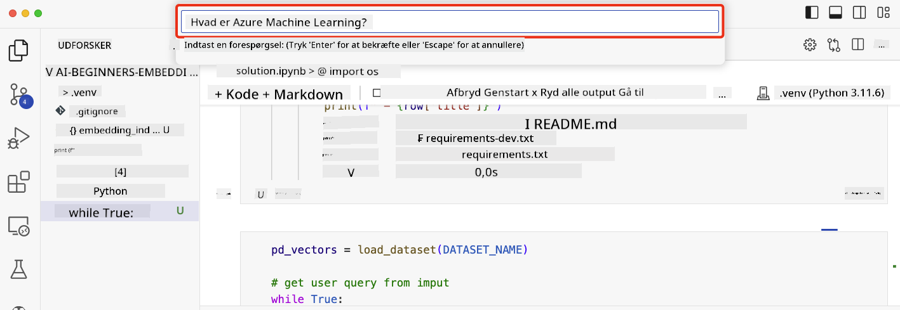

<!--
CO_OP_TRANSLATOR_METADATA:
{
  "original_hash": "58953c08b8ba7073b836d4270ea0fe86",
  "translation_date": "2025-10-17T19:08:39+00:00",
  "source_file": "08-building-search-applications/README.md",
  "language_code": "da"
}
-->
# Bygning af søgeapplikationer

[](https://youtu.be/W0-nzXjOjr0?si=GcsqiTTvd7RKbo7V)

> > _Klik på billedet ovenfor for at se videoen til denne lektion_

Der er mere til LLM'er end chatbots og tekstgenerering. Det er også muligt at bygge søgeapplikationer ved hjælp af Embeddings. Embeddings er numeriske repræsentationer af data, også kendt som vektorer, og kan bruges til semantisk søgning efter data.

I denne lektion skal du bygge en søgeapplikation til vores uddannelsesstartup. Vores startup er en non-profit organisation, der tilbyder gratis uddannelse til studerende i udviklingslande. Vores startup har et stort antal YouTube-videoer, som studerende kan bruge til at lære om AI. Vores startup ønsker at bygge en søgeapplikation, der giver studerende mulighed for at søge efter en YouTube-video ved at skrive et spørgsmål.

For eksempel kunne en studerende skrive 'Hvad er Jupyter Notebooks?' eller 'Hvad er Azure ML', og søgeapplikationen vil returnere en liste over YouTube-videoer, der er relevante for spørgsmålet, og endnu bedre, søgeapplikationen vil returnere et link til det sted i videoen, hvor svaret på spørgsmålet findes.

## Introduktion

I denne lektion vil vi dække:

- Semantisk vs nøgleordssøgning.
- Hvad er tekst-embeddings.
- Oprettelse af en tekst-embeddings-indeks.
- Søgning i en tekst-embeddings-indeks.

## Læringsmål

Efter at have gennemført denne lektion vil du kunne:

- Skelne mellem semantisk og nøgleordssøgning.
- Forklare, hvad tekst-embeddings er.
- Oprette en applikation ved hjælp af embeddings til at søge efter data.

## Hvorfor bygge en søgeapplikation?

At skabe en søgeapplikation vil hjælpe dig med at forstå, hvordan man bruger embeddings til at søge efter data. Du vil også lære, hvordan man bygger en søgeapplikation, som studerende kan bruge til hurtigt at finde information.

Lektionens Embedding Index indeholder YouTube-transkriptioner fra Microsoft [AI Show](https://www.youtube.com/playlist?list=PLlrxD0HtieHi0mwteKBOfEeOYf0LJU4O1) YouTube-kanalen. AI Show er en YouTube-kanal, der lærer dig om AI og maskinlæring. Embedding Index indeholder embeddings for hver af YouTube-transkriptionerne op til oktober 2023. Du vil bruge Embedding Index til at bygge en søgeapplikation til vores startup. Søgeapplikationen returnerer et link til det sted i videoen, hvor svaret på spørgsmålet findes. Dette er en fantastisk måde for studerende at finde den information, de har brug for, hurtigt.

Følgende er et eksempel på en semantisk forespørgsel for spørgsmålet 'kan du bruge rstudio med azure ml?'. Tjek YouTube-url'en, du vil se, at url'en indeholder et tidsstempel, der tager dig til det sted i videoen, hvor svaret på spørgsmålet findes.


## Hvad er semantisk søgning?

Nu undrer du dig måske over, hvad semantisk søgning er? Semantisk søgning er en søgeteknik, der bruger semantikken eller betydningen af ordene i en forespørgsel til at returnere relevante resultater.

Her er et eksempel på en semantisk søgning. Lad os sige, at du leder efter at købe en bil, du kunne søge efter 'min drømmebil', semantisk søgning forstår, at du ikke `drømmer` om en bil, men snarere leder efter at købe din `ideelle` bil. Semantisk søgning forstår din intention og returnerer relevante resultater. Alternativet er `nøgleordssøgning`, som bogstaveligt talt ville søge efter drømme om biler og ofte returnere irrelevante resultater.

## Hvad er tekst-embeddings?

[Text embeddings](https://en.wikipedia.org/wiki/Word_embedding?WT.mc_id=academic-105485-koreyst) er en tekstrepræsentationsteknik, der bruges i [natural language processing](https://en.wikipedia.org/wiki/Natural_language_processing?WT.mc_id=academic-105485-koreyst). Tekst-embeddings er semantiske numeriske repræsentationer af tekst. Embeddings bruges til at repræsentere data på en måde, der er nem for en maskine at forstå. Der findes mange modeller til at bygge tekst-embeddings, i denne lektion vil vi fokusere på at generere embeddings ved hjælp af OpenAI Embedding Model.

Her er et eksempel, forestil dig, at følgende tekst er i en transkription fra en af episoderne på AI Show YouTube-kanalen:

```text
Today we are going to learn about Azure Machine Learning.
```

Vi ville sende teksten til OpenAI Embedding API, og den ville returnere følgende embedding bestående af 1536 tal, også kendt som en vektor. Hvert tal i vektoren repræsenterer en anden aspekt af teksten. For korthedens skyld er her de første 10 tal i vektoren.

```python
[-0.006655829958617687, 0.0026128944009542465, 0.008792596869170666, -0.02446001023054123, -0.008540431968867779, 0.022071078419685364, -0.010703742504119873, 0.003311325330287218, -0.011632772162556648, -0.02187200076878071, ...]
```

## Hvordan oprettes Embedding Index?

Embedding Index for denne lektion blev oprettet med en række Python-scripts. Du finder scripts sammen med instruktioner i [README](./scripts/README.md?WT.mc_id=academic-105485-koreyst) i 'scripts'-mappen for denne lektion. Du behøver ikke at køre disse scripts for at fuldføre denne lektion, da Embedding Index er givet til dig.

Scripts udfører følgende operationer:

1. Transkriptionen for hver YouTube-video i [AI Show](https://www.youtube.com/playlist?list=PLlrxD0HtieHi0mwteKBOfEeOYf0LJU4O1)-afspilningslisten downloades.
2. Ved hjælp af [OpenAI Functions](https://learn.microsoft.com/azure/ai-services/openai/how-to/function-calling?WT.mc_id=academic-105485-koreyst) forsøges det at udtrække talerens navn fra de første 3 minutter af YouTube-transkriptionen. Talerens navn for hver video gemmes i Embedding Index med navnet `embedding_index_3m.json`.
3. Transkriptionsteksten opdeles derefter i **3 minutters tekstsegmenter**. Segmentet inkluderer cirka 20 ord, der overlapper fra det næste segment for at sikre, at embedding for segmentet ikke afbrydes og for at give bedre søgekontekst.
4. Hvert tekstsegment sendes derefter til OpenAI Chat API for at opsummere teksten til 60 ord. Resuméet gemmes også i Embedding Index `embedding_index_3m.json`.
5. Endelig sendes segmentteksten til OpenAI Embedding API. Embedding API returnerer en vektor med 1536 tal, der repræsenterer den semantiske betydning af segmentet. Segmentet sammen med OpenAI Embedding-vektoren gemmes i Embedding Index `embedding_index_3m.json`.

### Vektordatabaser

For lektionens enkelhed gemmes Embedding Index i en JSON-fil med navnet `embedding_index_3m.json` og indlæses i en Pandas DataFrame. Men i produktion ville Embedding Index blive gemt i en vektordatabase som [Azure Cognitive Search](https://learn.microsoft.com/training/modules/improve-search-results-vector-search?WT.mc_id=academic-105485-koreyst), [Redis](https://cookbook.openai.com/examples/vector_databases/redis/readme?WT.mc_id=academic-105485-koreyst), [Pinecone](https://cookbook.openai.com/examples/vector_databases/pinecone/readme?WT.mc_id=academic-105485-koreyst), [Weaviate](https://cookbook.openai.com/examples/vector_databases/weaviate/readme?WT.mc_id=academic-105485-koreyst), for blot at nævne nogle få.

## Forståelse af cosinus-similaritet

Vi har lært om tekst-embeddings, det næste skridt er at lære, hvordan man bruger tekst-embeddings til at søge efter data og især finde de mest lignende embeddings til en given forespørgsel ved hjælp af cosinus-similaritet.

### Hvad er cosinus-similaritet?

Cosinus-similaritet er et mål for lighed mellem to vektorer, du vil også høre dette omtalt som `nearest neighbor search`. For at udføre en cosinus-similaritetssøgning skal du _vektorisere_ for _forespørgsels_tekst ved hjælp af OpenAI Embedding API. Derefter beregnes _cosinus-similariteten_ mellem forespørgselsvektoren og hver vektor i Embedding Index. Husk, Embedding Index har en vektor for hver YouTube-transkriptionstekstsegment. Endelig sorteres resultaterne efter cosinus-similaritet, og tekstsegmenterne med den højeste cosinus-similaritet er de mest lignende til forespørgslen.

Fra et matematisk perspektiv måler cosinus-similaritet cosinus af vinklen mellem to vektorer projiceret i et multidimensionelt rum. Denne måling er fordelagtig, fordi hvis to dokumenter er langt fra hinanden i euklidisk afstand på grund af størrelse, kan de stadig have en mindre vinkel mellem dem og derfor højere cosinus-similaritet. For mere information om cosinus-similaritetsligninger, se [Cosine similarity](https://en.wikipedia.org/wiki/Cosine_similarity?WT.mc_id=academic-105485-koreyst).

## Bygning af din første søgeapplikation

Næste skridt er at lære, hvordan man bygger en søgeapplikation ved hjælp af embeddings. Søgeapplikationen vil give studerende mulighed for at søge efter en video ved at skrive et spørgsmål. Søgeapplikationen vil returnere en liste over videoer, der er relevante for spørgsmålet. Søgeapplikationen vil også returnere et link til det sted i videoen, hvor svaret på spørgsmålet findes.

Denne løsning blev bygget og testet på Windows 11, macOS og Ubuntu 22.04 ved hjælp af Python 3.10 eller nyere. Du kan downloade Python fra [python.org](https://www.python.org/downloads/?WT.mc_id=academic-105485-koreyst).

## Opgave - bygning af en søgeapplikation, for at hjælpe studerende

Vi introducerede vores startup i begyndelsen af denne lektion. Nu er det tid til at give de studerende mulighed for at bygge en søgeapplikation til deres opgaver.

I denne opgave vil du oprette Azure OpenAI Services, der vil blive brugt til at bygge søgeapplikationen. Du vil oprette følgende Azure OpenAI Services. Du skal bruge et Azure-abonnement for at fuldføre denne opgave.

### Start Azure Cloud Shell

1. Log ind på [Azure-portalen](https://portal.azure.com/?WT.mc_id=academic-105485-koreyst).
2. Vælg Cloud Shell-ikonet i øverste højre hjørne af Azure-portalen.
3. Vælg **Bash** som miljøtype.

#### Opret en ressourcegruppe

> For disse instruktioner bruger vi ressourcegruppen med navnet "semantic-video-search" i East US.
> Du kan ændre navnet på ressourcegruppen, men når du ændrer placeringen for ressourcerne,
> tjek [model availability table](https://aka.ms/oai/models?WT.mc_id=academic-105485-koreyst).

```shell
az group create --name semantic-video-search --location eastus
```

#### Opret en Azure OpenAI Service-ressource

Fra Azure Cloud Shell skal du køre følgende kommando for at oprette en Azure OpenAI Service-ressource.

```shell
az cognitiveservices account create --name semantic-video-openai --resource-group semantic-video-search \
    --location eastus --kind OpenAI --sku s0
```

#### Hent endpoint og nøgler til brug i denne applikation

Fra Azure Cloud Shell skal du køre følgende kommandoer for at hente endpoint og nøgler til Azure OpenAI Service-ressourcen.

```shell
az cognitiveservices account show --name semantic-video-openai \
   --resource-group  semantic-video-search | jq -r .properties.endpoint
az cognitiveservices account keys list --name semantic-video-openai \
   --resource-group semantic-video-search | jq -r .key1
```

#### Udrul OpenAI Embedding-modellen

Fra Azure Cloud Shell skal du køre følgende kommando for at udrulle OpenAI Embedding-modellen.

```shell
az cognitiveservices account deployment create \
    --name semantic-video-openai \
    --resource-group  semantic-video-search \
    --deployment-name text-embedding-ada-002 \
    --model-name text-embedding-ada-002 \
    --model-version "2"  \
    --model-format OpenAI \
    --sku-capacity 100 --sku-name "Standard"
```

## Løsning

Åbn [løsningsnotebooken](./python/aoai-solution.ipynb?WT.mc_id=academic-105485-koreyst) i GitHub Codespaces og følg instruktionerne i Jupyter Notebook.

Når du kører notebooken, vil du blive bedt om at indtaste en forespørgsel. Inputfeltet vil se sådan ud:



## Godt arbejde! Fortsæt din læring

Efter at have gennemført denne lektion, kan du tjekke vores [Generative AI Learning collection](https://aka.ms/genai-collection?WT.mc_id=academic-105485-koreyst) for at fortsætte med at opbygge din viden om Generativ AI!

Gå videre til Lektion 9, hvor vi vil se på, hvordan man [bygger applikationer til billedgenerering](../09-building-image-applications/README.md?WT.mc_id=academic-105485-koreyst)!

---

**Ansvarsfraskrivelse**:  
Dette dokument er blevet oversat ved hjælp af AI-oversættelsestjenesten [Co-op Translator](https://github.com/Azure/co-op-translator). Selvom vi bestræber os på nøjagtighed, skal du være opmærksom på, at automatiserede oversættelser kan indeholde fejl eller unøjagtigheder. Det originale dokument på dets oprindelige sprog bør betragtes som den autoritative kilde. For kritisk information anbefales professionel menneskelig oversættelse. Vi er ikke ansvarlige for eventuelle misforståelser eller fejltolkninger, der opstår som følge af brugen af denne oversættelse.