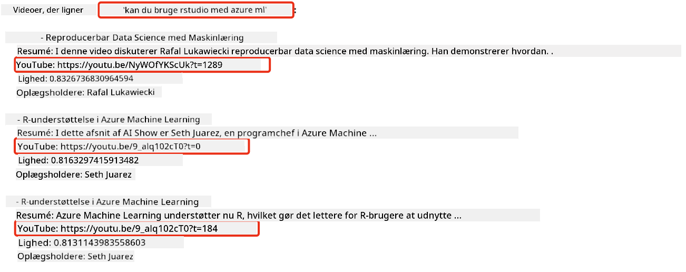

<!--
CO_OP_TRANSLATOR_METADATA:
{
  "original_hash": "d46aad0917a1a342d613e2c13d457da5",
  "translation_date": "2025-07-09T12:56:40+00:00",
  "source_file": "08-building-search-applications/README.md",
  "language_code": "da"
}
-->
# Byg en søgeapplikation

[](https://aka.ms/gen-ai-lesson8-gh?WT.mc_id=academic-105485-koreyst)

> > _Klik på billedet ovenfor for at se videoen til denne lektion_

LLM’er handler om mere end chatbots og tekstgenerering. Det er også muligt at bygge søgeapplikationer ved hjælp af Embeddings. Embeddings er numeriske repræsentationer af data, også kendt som vektorer, og kan bruges til semantisk søgning i data.

I denne lektion skal du bygge en søgeapplikation til vores uddannelsesstartup. Vores startup er en non-profit organisation, der tilbyder gratis uddannelse til studerende i udviklingslande. Vi har et stort antal YouTube-videoer, som studerende kan bruge til at lære om AI. Vores startup ønsker at bygge en søgeapplikation, der gør det muligt for studerende at søge efter en YouTube-video ved at skrive et spørgsmål.

For eksempel kan en studerende skrive 'Hvad er Jupyter Notebooks?' eller 'Hvad er Azure ML', og søgeapplikationen vil returnere en liste over relevante YouTube-videoer. Endnu bedre, søgeapplikationen vil returnere et link til det sted i videoen, hvor svaret på spørgsmålet findes.

## Introduktion

I denne lektion vil vi gennemgå:

- Semantisk vs. nøgleordssøgning.
- Hvad er Text Embeddings.
- Oprettelse af en Text Embeddings-indeks.
- Søgning i en Text Embeddings-indeks.

## Læringsmål

Efter at have gennemført denne lektion vil du kunne:

- Skelne mellem semantisk og nøgleordssøgning.
- Forklare hvad Text Embeddings er.
- Oprette en applikation, der bruger Embeddings til at søge i data.

## Hvorfor bygge en søgeapplikation?

At skabe en søgeapplikation hjælper dig med at forstå, hvordan man bruger Embeddings til at søge i data. Du lærer også, hvordan man bygger en søgeapplikation, som studerende kan bruge til hurtigt at finde information.

Lektionens Embedding-indeks indeholder YouTube-transskripterne for Microsoft [AI Show](https://www.youtube.com/playlist?list=PLlrxD0HtieHi0mwteKBOfEeOYf0LJU4O1) YouTube-kanal. AI Show er en kanal, der lærer dig om AI og maskinlæring. Embedding-indekset indeholder Embeddings for hver af YouTube-transskripterne frem til oktober 2023. Du vil bruge Embedding-indekset til at bygge en søgeapplikation for vores startup. Søgeapplikationen returnerer et link til det sted i videoen, hvor svaret på spørgsmålet findes. Det er en fantastisk måde for studerende at finde den information, de har brug for, hurtigt.

Her er et eksempel på en semantisk forespørgsel for spørgsmålet 'kan du bruge rstudio med azure ml?'. Se YouTube-URL’en, du vil bemærke, at URL’en indeholder et tidsstempel, der fører dig til det sted i videoen, hvor svaret findes.



## Hvad er semantisk søgning?

Du undrer dig måske over, hvad semantisk søgning er? Semantisk søgning er en søgeteknik, der bruger betydningen af ordene i en forespørgsel til at returnere relevante resultater.

Her er et eksempel på semantisk søgning. Forestil dig, at du vil købe en bil, og du søger efter 'min drømmebil'. Semantisk søgning forstår, at du ikke drømmer om en bil, men at du leder efter din ideelle bil. Semantisk søgning forstår din hensigt og returnerer relevante resultater. Alternativet er nøgleordssøgning, som bogstaveligt talt ville søge efter drømme om biler og ofte returnere irrelevante resultater.

## Hvad er Text Embeddings?

[Text embeddings](https://en.wikipedia.org/wiki/Word_embedding?WT.mc_id=academic-105485-koreyst) er en teknik til tekstrepræsentation, der bruges i [natural language processing](https://en.wikipedia.org/wiki/Natural_language_processing?WT.mc_id=academic-105485-koreyst). Text embeddings er semantiske numeriske repræsentationer af tekst. Embeddings bruges til at repræsentere data på en måde, der er let for en maskine at forstå. Der findes mange modeller til at bygge text embeddings; i denne lektion fokuserer vi på at generere embeddings ved hjælp af OpenAI Embedding Model.

Her er et eksempel: Forestil dig, at følgende tekst er fra en transskription af en episode på AI Show YouTube-kanalen:

```text
Today we are going to learn about Azure Machine Learning.
```

Vi sender teksten til OpenAI Embedding API, som returnerer følgende embedding bestående af 1536 tal, også kaldet en vektor. Hvert tal i vektoren repræsenterer en forskellig aspekt af teksten. For overskuelighedens skyld vises her de første 10 tal i vektoren.

```python
[-0.006655829958617687, 0.0026128944009542465, 0.008792596869170666, -0.02446001023054123, -0.008540431968867779, 0.022071078419685364, -0.010703742504119873, 0.003311325330287218, -0.011632772162556648, -0.02187200076878071, ...]
```

## Hvordan oprettes Embedding-indekset?

Embedding-indekset til denne lektion blev oprettet med en række Python-scripts. Du finder scripts og instruktioner i [README](./scripts/README.md?WT.mc_id=academic-105485-koreyst) i 'scripts'-mappen til denne lektion. Du behøver ikke køre disse scripts for at gennemføre lektionen, da Embedding-indekset allerede er tilgængeligt.

Scripts udfører følgende operationer:

1. Transskriptionen for hver YouTube-video i [AI Show](https://www.youtube.com/playlist?list=PLlrxD0HtieHi0mwteKBOfEeOYf0LJU4O1) playlisten downloades.
2. Ved hjælp af [OpenAI Functions](https://learn.microsoft.com/azure/ai-services/openai/how-to/function-calling?WT.mc_id=academic-105485-koreyst) forsøges det at udtrække talerens navn fra de første 3 minutter af YouTube-transskriptionen. Talernavnet for hver video gemmes i Embedding-indekset med navnet `embedding_index_3m.json`.
3. Transskriptionsteksten opdeles i **3-minutters tekstsegmenter**. Segmentet inkluderer cirka 20 ord, der overlapper med det næste segment for at sikre, at embedding for segmentet ikke afbrydes og for at give bedre søgekontekst.
4. Hvert tekstsegment sendes til OpenAI Chat API for at opsummere teksten til 60 ord. Resuméet gemmes også i Embedding-indekset `embedding_index_3m.json`.
5. Endelig sendes tekstsegmentet til OpenAI Embedding API. Embedding API returnerer en vektor med 1536 tal, der repræsenterer segmentets semantiske betydning. Segmentet sammen med OpenAI Embedding-vektoren gemmes i Embedding-indekset `embedding_index_3m.json`.

### Vektordatabaser

For enkelhedens skyld gemmes Embedding-indekset i en JSON-fil med navnet `embedding_index_3m.json` og indlæses i en Pandas DataFrame. I produktion ville Embedding-indekset dog blive gemt i en vektordatabase som for eksempel [Azure Cognitive Search](https://learn.microsoft.com/training/modules/improve-search-results-vector-search?WT.mc_id=academic-105485-koreyst), [Redis](https://cookbook.openai.com/examples/vector_databases/redis/readme?WT.mc_id=academic-105485-koreyst), [Pinecone](https://cookbook.openai.com/examples/vector_databases/pinecone/readme?WT.mc_id=academic-105485-koreyst), [Weaviate](https://cookbook.openai.com/examples/vector_databases/weaviate/readme?WT.mc_id=academic-105485-koreyst), for blot at nævne nogle få.

## Forståelse af cosinus-lighed

Vi har lært om text embeddings, næste skridt er at lære, hvordan man bruger text embeddings til at søge i data og især finde de mest lignende embeddings til en given forespørgsel ved hjælp af cosinus-lighed.

### Hvad er cosinus-lighed?

Cosinus-lighed er et mål for lighed mellem to vektorer, det kaldes også ofte `nearest neighbor search`. For at udføre en cosinus-lighedssøgning skal du _vektorisere_ _forespørgsels_-teksten ved hjælp af OpenAI Embedding API. Derefter beregnes _cosinus-ligheden_ mellem forespørgselsvektoren og hver vektor i Embedding-indekset. Husk, at Embedding-indekset har en vektor for hvert tekstsegment i YouTube-transskriptionen. Til sidst sorteres resultaterne efter cosinus-lighed, og de tekstsegmenter med den højeste cosinus-lighed er de mest lignende i forhold til forespørgslen.

Fra et matematisk perspektiv måler cosinus-lighed cosinus til vinklen mellem to vektorer projiceret i et flerdimensionelt rum. Denne måling er nyttig, fordi hvis to dokumenter er langt fra hinanden i den euklidiske afstand på grund af størrelse, kan de stadig have en mindre vinkel mellem sig og dermed højere cosinus-lighed. For mere information om cosinus-lighedsformler, se [Cosine similarity](https://en.wikipedia.org/wiki/Cosine_similarity?WT.mc_id=academic-105485-koreyst).

## Byg din første søgeapplikation

Nu skal vi lære, hvordan man bygger en søgeapplikation ved hjælp af Embeddings. Søgeapplikationen vil gøre det muligt for studerende at søge efter en video ved at skrive et spørgsmål. Applikationen returnerer en liste over videoer, der er relevante for spørgsmålet, og den returnerer også et link til det sted i videoen, hvor svaret findes.

Denne løsning er bygget og testet på Windows 11, macOS og Ubuntu 22.04 med Python 3.10 eller nyere. Du kan downloade Python fra [python.org](https://www.python.org/downloads/?WT.mc_id=academic-105485-koreyst).

## Opgave – byg en søgeapplikation, der hjælper studerende

Vi introducerede vores startup i starten af denne lektion. Nu er det tid til at give de studerende mulighed for at bygge en søgeapplikation til deres opgaver.

I denne opgave skal du oprette Azure OpenAI Services, som skal bruges til at bygge søgeapplikationen. Du skal oprette følgende Azure OpenAI Services. Du skal have et Azure-abonnement for at kunne gennemføre opgaven.

### Start Azure Cloud Shell

1. Log ind på [Azure-portalen](https://portal.azure.com/?WT.mc_id=academic-105485-koreyst).
2. Vælg Cloud Shell-ikonet øverst til højre i Azure-portalen.
3. Vælg **Bash** som miljøtype.

#### Opret en resource group

> I disse instruktioner bruger vi resource gruppen med navnet "semantic-video-search" i East US.
> Du kan ændre navnet på resource gruppen, men hvis du ændrer placeringen af ressourcerne,
> så tjek [model availability table](https://aka.ms/oai/models?WT.mc_id=academic-105485-koreyst).

```shell
az group create --name semantic-video-search --location eastus
```

#### Opret en Azure OpenAI Service-ressource

Fra Azure Cloud Shell skal du køre følgende kommando for at oprette en Azure OpenAI Service-ressource.

```shell
az cognitiveservices account create --name semantic-video-openai --resource-group semantic-video-search \
    --location eastus --kind OpenAI --sku s0
```

#### Hent endpoint og nøgler til brug i denne applikation

Fra Azure Cloud Shell skal du køre følgende kommandoer for at hente endpoint og nøgler til Azure OpenAI Service-ressourcen.

```shell
az cognitiveservices account show --name semantic-video-openai \
   --resource-group  semantic-video-search | jq -r .properties.endpoint
az cognitiveservices account keys list --name semantic-video-openai \
   --resource-group semantic-video-search | jq -r .key1
```

#### Udrul OpenAI Embedding-modellen

Fra Azure Cloud Shell skal du køre følgende kommando for at udrulle OpenAI Embedding-modellen.

```shell
az cognitiveservices account deployment create \
    --name semantic-video-openai \
    --resource-group  semantic-video-search \
    --deployment-name text-embedding-ada-002 \
    --model-name text-embedding-ada-002 \
    --model-version "2"  \
    --model-format OpenAI \
    --sku-capacity 100 --sku-name "Standard"
```

## Løsning

Åbn [løsningsnotebooken](python/aoai-solution.ipynb) i GitHub Codespaces og følg instruktionerne i Jupyter Notebook.

Når du kører notebooken, bliver du bedt om at indtaste en forespørgsel. Inputboksen ser sådan ud:


## Godt arbejde! Fortsæt din læring

Efter at have gennemført denne lektion, kan du tjekke vores [Generative AI Learning collection](https://aka.ms/genai-collection?WT.mc_id=academic-105485-koreyst) for at fortsætte med at udvikle din viden om Generative AI!

Gå videre til Lektion 9, hvor vi ser på, hvordan man [bygger applikationer til billedgenerering](../09-building-image-applications/README.md?WT.mc_id=academic-105485-koreyst)!

**Ansvarsfraskrivelse**:  
Dette dokument er blevet oversat ved hjælp af AI-oversættelsestjenesten [Co-op Translator](https://github.com/Azure/co-op-translator). Selvom vi bestræber os på nøjagtighed, bedes du være opmærksom på, at automatiserede oversættelser kan indeholde fejl eller unøjagtigheder. Det oprindelige dokument på dets oprindelige sprog bør betragtes som den autoritative kilde. For kritisk information anbefales professionel menneskelig oversættelse. Vi påtager os intet ansvar for misforståelser eller fejltolkninger, der opstår som følge af brugen af denne oversættelse.