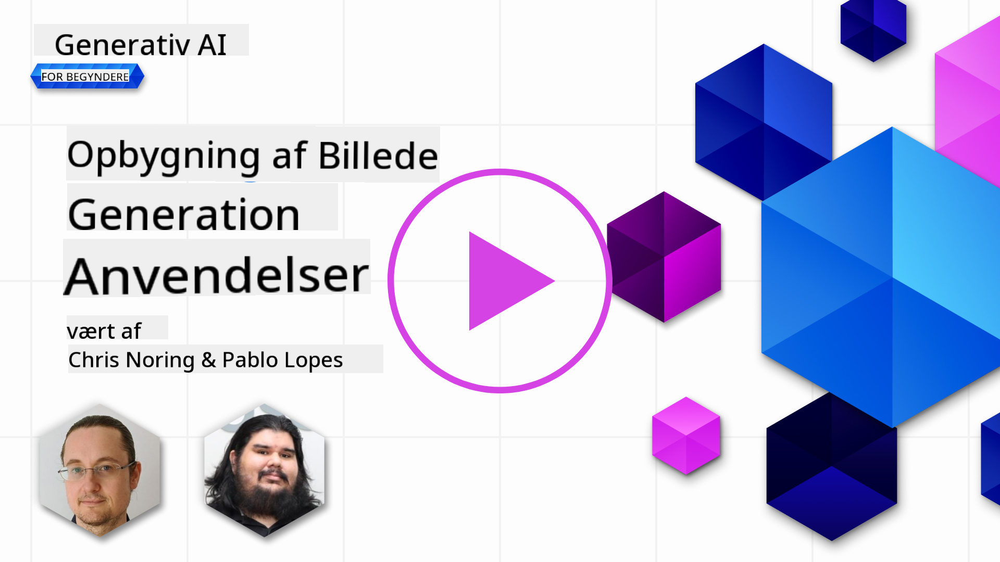

<!--
CO_OP_TRANSLATOR_METADATA:
{
  "original_hash": "1a7fd0f95f9eb673b79da47c0814f4d4",
  "translation_date": "2025-07-09T13:27:10+00:00",
  "source_file": "09-building-image-applications/README.md",
  "language_code": "da"
}
-->
# Byg applikationer til billedgenerering

[](https://aka.ms/gen-ai-lesson9-gh?WT.mc_id=academic-105485-koreyst)

LLM’er handler ikke kun om tekstgenerering. Det er også muligt at generere billeder ud fra tekstbeskrivelser. At have billeder som en modalitet kan være særdeles nyttigt inden for mange områder som MedTech, arkitektur, turisme, spiludvikling og mere. I dette kapitel vil vi se nærmere på de to mest populære billedgenereringsmodeller, DALL-E og Midjourney.

## Introduktion

I denne lektion vil vi gennemgå:

- Billedgenerering og hvorfor det er nyttigt.
- DALL-E og Midjourney, hvad de er, og hvordan de fungerer.
- Hvordan du kan bygge en applikation til billedgenerering.

## Læringsmål

Efter at have gennemført denne lektion vil du kunne:

- Bygge en applikation til billedgenerering.
- Definere grænser for din applikation med metaprompter.
- Arbejde med DALL-E og Midjourney.

## Hvorfor bygge en applikation til billedgenerering?

Applikationer til billedgenerering er en fantastisk måde at udforske mulighederne med Generativ AI på. De kan bruges til eksempelvis:

- **Billedredigering og syntese**. Du kan generere billeder til mange forskellige formål, som billedredigering og billedsyntese.

- **Anvendt i mange brancher**. De kan også bruges til at generere billeder til forskellige brancher som MedTech, turisme, spiludvikling og mere.

## Scenario: Edu4All

Som en del af denne lektion fortsætter vi med at arbejde med vores startup, Edu4All. Eleverne vil skabe billeder til deres opgaver; præcis hvilke billeder er op til eleverne, men det kan være illustrationer til deres egen eventyrfortælling, skabe en ny karakter til deres historie eller hjælpe dem med at visualisere deres idéer og koncepter.

Her er et eksempel på, hvad Edu4All’s elever kunne generere, hvis de arbejder med monumenter i klassen:


med en prompt som

> "Hund ved siden af Eiffeltårnet i det tidlige morgenglys"

## Hvad er DALL-E og Midjourney?

[DALL-E](https://openai.com/dall-e-2?WT.mc_id=academic-105485-koreyst) og [Midjourney](https://www.midjourney.com/?WT.mc_id=academic-105485-koreyst) er to af de mest populære modeller til billedgenerering, som giver dig mulighed for at bruge prompts til at skabe billeder.

### DALL-E

Lad os starte med DALL-E, som er en Generativ AI-model, der genererer billeder ud fra tekstbeskrivelser.

> [DALL-E er en kombination af to modeller, CLIP og diffused attention](https://towardsdatascience.com/openais-dall-e-and-clip-101-a-brief-introduction-3a4367280d4e?WT.mc_id=academic-105485-koreyst).

- **CLIP** er en model, der genererer embeddings, som er numeriske repræsentationer af data, fra billeder og tekst.

- **Diffused attention** er en model, der genererer billeder ud fra embeddings. DALL-E er trænet på et datasæt af billeder og tekst og kan bruges til at generere billeder ud fra tekstbeskrivelser. For eksempel kan DALL-E generere billeder af en kat med hat eller en hund med mohawk.

### Midjourney

Midjourney fungerer på samme måde som DALL-E; den genererer billeder ud fra tekstprompter. Midjourney kan også bruges til at skabe billeder med prompts som “en kat med hat” eller “en hund med mohawk”.

  
_Billedkredit Wikipedia, billede genereret af Midjourney_

## Hvordan fungerer DALL-E og Midjourney?

Først, [DALL-E](https://arxiv.org/pdf/2102.12092.pdf?WT.mc_id=academic-105485-koreyst). DALL-E er en Generativ AI-model baseret på transformer-arkitekturen med en _autoregressiv transformer_.

En _autoregressiv transformer_ definerer, hvordan en model genererer billeder ud fra tekstbeskrivelser; den genererer én pixel ad gangen og bruger de genererede pixels til at generere den næste pixel. Det sker gennem flere lag i et neuralt netværk, indtil billedet er færdigt.

Med denne proces kan DALL-E styre attributter, objekter, karakteristika og mere i det billede, den genererer. Dog har DALL-E 2 og 3 endnu mere kontrol over det genererede billede.

## Byg din første applikation til billedgenerering

Hvad kræver det at bygge en applikation til billedgenerering? Du skal bruge følgende biblioteker:

- **python-dotenv**, det anbefales kraftigt at bruge dette bibliotek til at holde dine hemmeligheder i en _.env_-fil væk fra koden.
- **openai**, dette bibliotek bruger du til at interagere med OpenAI API’en.
- **pillow**, til at arbejde med billeder i Python.
- **requests**, til at lave HTTP-forespørgsler.

1. Opret en fil _.env_ med følgende indhold:

   ```text
   AZURE_OPENAI_ENDPOINT=<your endpoint>
   AZURE_OPENAI_API_KEY=<your key>
   ```

   Find disse oplysninger i Azure Portal for din ressource under sektionen "Keys and Endpoint".

1. Saml ovenstående biblioteker i en fil kaldet _requirements.txt_ som følger:

   ```text
   python-dotenv
   openai
   pillow
   requests
   ```

1. Opret derefter et virtuelt miljø og installer bibliotekerne:

   ```bash
   python3 -m venv venv
   source venv/bin/activate
   pip install -r requirements.txt
   ```

   På Windows bruger du følgende kommandoer til at oprette og aktivere dit virtuelle miljø:

   ```bash
   python3 -m venv venv
   venv\Scripts\activate.bat
   ```

1. Tilføj følgende kode i en fil kaldet _app.py_:

   ```python
   import openai
   import os
   import requests
   from PIL import Image
   import dotenv

   # import dotenv
   dotenv.load_dotenv()

   # Get endpoint and key from environment variables
   openai.api_base = os.environ['AZURE_OPENAI_ENDPOINT']
   openai.api_key = os.environ['AZURE_OPENAI_API_KEY']

   # Assign the API version (DALL-E is currently supported for the 2023-06-01-preview API version only)
   openai.api_version = '2023-06-01-preview'
   openai.api_type = 'azure'


   try:
       # Create an image by using the image generation API
       generation_response = openai.Image.create(
           prompt='Bunny on horse, holding a lollipop, on a foggy meadow where it grows daffodils',    # Enter your prompt text here
           size='1024x1024',
           n=2,
           temperature=0,
       )
       # Set the directory for the stored image
       image_dir = os.path.join(os.curdir, 'images')

       # If the directory doesn't exist, create it
       if not os.path.isdir(image_dir):
           os.mkdir(image_dir)

       # Initialize the image path (note the filetype should be png)
       image_path = os.path.join(image_dir, 'generated-image.png')

       # Retrieve the generated image
       image_url = generation_response["data"][0]["url"]  # extract image URL from response
       generated_image = requests.get(image_url).content  # download the image
       with open(image_path, "wb") as image_file:
           image_file.write(generated_image)

       # Display the image in the default image viewer
       image = Image.open(image_path)
       image.show()

   # catch exceptions
   except openai.InvalidRequestError as err:
       print(err)

   ```

Lad os forklare denne kode:

- Først importerer vi de nødvendige biblioteker, inklusive OpenAI-biblioteket, dotenv-biblioteket, requests-biblioteket og Pillow-biblioteket.

  ```python
  import openai
  import os
  import requests
  from PIL import Image
  import dotenv
  ```

- Dernæst indlæser vi miljøvariablerne fra _.env_-filen.

  ```python
  # import dotenv
  dotenv.load_dotenv()
  ```

- Herefter sætter vi endpoint, nøgle til OpenAI API, version og type.

  ```python
  # Get endpoint and key from environment variables
  openai.api_base = os.environ['AZURE_OPENAI_ENDPOINT']
  openai.api_key = os.environ['AZURE_OPENAI_API_KEY']

  # add version and type, Azure specific
  openai.api_version = '2023-06-01-preview'
  openai.api_type = 'azure'
  ```

- Så genererer vi billedet:

  ```python
  # Create an image by using the image generation API
  generation_response = openai.Image.create(
      prompt='Bunny on horse, holding a lollipop, on a foggy meadow where it grows daffodils',    # Enter your prompt text here
      size='1024x1024',
      n=2,
      temperature=0,
  )
  ```

  Ovenstående kode svarer med et JSON-objekt, der indeholder URL’en til det genererede billede. Vi kan bruge URL’en til at downloade billedet og gemme det i en fil.

- Til sidst åbner vi billedet og bruger standard billedfremviser til at vise det:

  ```python
  image = Image.open(image_path)
  image.show()
  ```

### Flere detaljer om billedgenereringen

Lad os se nærmere på koden, der genererer billedet:

```python
generation_response = openai.Image.create(
        prompt='Bunny on horse, holding a lollipop, on a foggy meadow where it grows daffodils',    # Enter your prompt text here
        size='1024x1024',
        n=2,
        temperature=0,
    )
```

- **prompt** er tekstprompten, der bruges til at generere billedet. I dette tilfælde bruger vi prompten "Bunny on horse, holding a lollipop, on a foggy meadow where it grows daffodils".
- **size** er størrelsen på det genererede billede. Her genererer vi et billede på 1024x1024 pixels.
- **n** er antallet af billeder, der genereres. Her genererer vi to billeder.
- **temperature** er en parameter, der styrer tilfældigheden i outputtet fra en Generativ AI-model. Temperaturen er en værdi mellem 0 og 1, hvor 0 betyder, at outputtet er deterministisk, og 1 betyder, at outputtet er tilfældigt. Standardværdien er 0,7.

Der er flere ting, du kan gøre med billeder, som vi vil dække i næste afsnit.

## Yderligere muligheder med billedgenerering

Indtil nu har du set, hvordan vi kunne generere et billede med få linjer i Python. Men der er flere ting, du kan gøre med billeder.

Du kan også:

- **Foretage redigeringer**. Ved at give et eksisterende billede en maske og en prompt kan du ændre et billede. For eksempel kan du tilføje noget til en del af et billede. Forestil dig vores kaninbillede, hvor du kan tilføje en hat til kaninen. Det gør du ved at give billedet, en maske (der identificerer det område, der skal ændres) og en tekstprompt, der beskriver, hvad der skal gøres.

  ```python
  response = openai.Image.create_edit(
    image=open("base_image.png", "rb"),
    mask=open("mask.png", "rb"),
    prompt="An image of a rabbit with a hat on its head.",
    n=1,
    size="1024x1024"
  )
  image_url = response['data'][0]['url']
  ```

  Basisbilledet indeholder kun kaninen, men det endelige billede vil have hatten på kaninen.

- **Oprette variationer**. Ideen er, at du tager et eksisterende billede og beder om, at der laves variationer. For at skabe en variation giver du et billede og en tekstprompt samt kode som denne:

  ```python
  response = openai.Image.create_variation(
    image=open("bunny-lollipop.png", "rb"),
    n=1,
    size="1024x1024"
  )
  image_url = response['data'][0]['url']
  ```

  > Bemærk, dette understøttes kun på OpenAI

## Temperatur

Temperatur er en parameter, der styrer tilfældigheden i outputtet fra en Generativ AI-model. Temperaturen er en værdi mellem 0 og 1, hvor 0 betyder, at outputtet er deterministisk, og 1 betyder, at outputtet er tilfældigt. Standardværdien er 0,7.

Lad os se et eksempel på, hvordan temperatur fungerer, ved at køre denne prompt to gange:

> Prompt: "Bunny on horse, holding a lollipop, on a foggy meadow where it grows daffodils"


Lad os nu køre den samme prompt igen for at se, at vi ikke får det samme billede to gange:


Som du kan se, ligner billederne hinanden, men er ikke ens. Lad os prøve at ændre temperaturværdien til 0,1 og se, hvad der sker:

```python
 generation_response = openai.Image.create(
        prompt='Bunny on horse, holding a lollipop, on a foggy meadow where it grows daffodils',    # Enter your prompt text here
        size='1024x1024',
        n=2
    )
```

### Ændring af temperaturen

Lad os prøve at gøre outputtet mere deterministisk. Vi kunne se på de to billeder, vi genererede, at det første billede har en kanin, og det andet billede har en hest, så billederne varierer meget.

Lad os derfor ændre koden og sætte temperaturen til 0, sådan her:

```python
generation_response = openai.Image.create(
        prompt='Bunny on horse, holding a lollipop, on a foggy meadow where it grows daffodils',    # Enter your prompt text here
        size='1024x1024',
        n=2,
        temperature=0
    )
```

Når du kører denne kode, får du disse to billeder:

- 
- 

Her kan du tydeligt se, at billederne ligner hinanden mere.

## Hvordan definerer du grænser for din applikation med metaprompter?

Med vores demo kan vi allerede generere billeder til vores kunder. Men vi skal skabe nogle grænser for vores applikation.

For eksempel ønsker vi ikke at generere billeder, der ikke er arbejdspladsvenlige, eller som ikke er passende for børn.

Det kan vi gøre med _metaprompter_. Metaprompter er tekstprompter, der bruges til at kontrollere outputtet fra en Generativ AI-model. For eksempel kan vi bruge metaprompter til at sikre, at de genererede billeder er arbejdspladsvenlige eller passende for børn.

### Hvordan fungerer det?

Hvordan fungerer metaprompter?

Metaprompter er tekstprompter, der bruges til at styre outputtet fra en Generativ AI-model. De placeres før tekstprompten og bruges til at kontrollere modellens output. De indlejres i applikationer for at styre modellens output ved at samle promptinput og metapromptinput i en enkelt tekstprompt.

Et eksempel på en metaprompt kunne være:

```text
You are an assistant designer that creates images for children.

The image needs to be safe for work and appropriate for children.

The image needs to be in color.

The image needs to be in landscape orientation.

The image needs to be in a 16:9 aspect ratio.

Do not consider any input from the following that is not safe for work or appropriate for children.

(Input)

```

Lad os nu se, hvordan vi kan bruge metaprompter i vores demo.

```python
disallow_list = "swords, violence, blood, gore, nudity, sexual content, adult content, adult themes, adult language, adult humor, adult jokes, adult situations, adult"

meta_prompt =f"""You are an assistant designer that creates images for children.

The image needs to be safe for work and appropriate for children.

The image needs to be in color.

The image needs to be in landscape orientation.

The image needs to be in a 16:9 aspect ratio.

Do not consider any input from the following that is not safe for work or appropriate for children.
{disallow_list}
"""

prompt = f"{meta_prompt}
Create an image of a bunny on a horse, holding a lollipop"

# TODO add request to generate image
```

Ud fra ovenstående prompt kan du se, hvordan alle billeder, der bliver skabt, tager metaprompten i betragtning.

## Opgave – lad os give eleverne mulighed for at skabe

Vi introducerede Edu4All i starten af denne lektion. Nu er det tid til at give eleverne mulighed for at generere billeder til deres opgaver.

Eleverne skal skabe billeder til deres opgaver med monumenter; præcis hvilke monumenter er op til eleverne. Eleverne opfordres til at bruge deres kreativitet i denne opgave og placere monumenterne i forskellige kontekster.

## Løsning

Her er en mulig løsning:

```python
import openai
import os
import requests
from PIL import Image
import dotenv

# import dotenv
dotenv.load_dotenv()

# Get endpoint and key from environment variables
openai.api_base = "<replace with endpoint>"
openai.api_key = "<replace with api key>"

# Assign the API version (DALL-E is currently supported for the 2023-06-01-preview API version only)
openai.api_version = '2023-06-01-preview'
openai.api_type = 'azure'

disallow_list = "swords, violence, blood, gore, nudity, sexual content, adult content, adult themes, adult language, adult humor, adult jokes, adult situations, adult"

meta_prompt = f"""You are an assistant designer that creates images for children.

The image needs to be safe for work and appropriate for children.

The image needs to be in color.

The image needs to be in landscape orientation.

The image needs to be in a 16:9 aspect ratio.

Do not consider any input from the following that is not safe for work or appropriate for children.
{disallow_list}"""

prompt = f"""{meta_prompt}
Generate monument of the Arc of Triumph in Paris, France, in the evening light with a small child holding a Teddy looks on.
""""

try:
    # Create an image by using the image generation API
    generation_response = openai.Image.create(
        prompt=prompt,    # Enter your prompt text here
        size='1024x1024',
        n=2,
        temperature=0,
    )
    # Set the directory for the stored image
    image_dir = os.path.join(os.curdir, 'images')

    # If the directory doesn't exist, create it
    if not os.path.isdir(image_dir):
        os.mkdir(image_dir)

    # Initialize the image path (note the filetype should be png)
    image_path = os.path.join(image_dir, 'generated-image.png')

    # Retrieve the generated image
    image_url = generation_response["data"][0]["url"]  # extract image URL from response
    generated_image = requests.get(image_url).content  # download the image
    with open(image_path, "wb") as image_file:
        image_file.write(generated_image)

    # Display the image in the default image viewer
    image = Image.open(image_path)
    image.show()

# catch exceptions
except openai.InvalidRequestError as err:
    print(err)
```

## Godt arbejde! Fortsæt din læring

Efter at have gennemført denne lektion, kan du tjekke vores [Generative AI Learning collection](https://aka.ms/genai-collection?WT.mc_id=academic-105485-koreyst) for at fortsætte med at udvikle din viden om Generativ AI!

Gå videre til Lektion 10, hvor vi ser på, hvordan man [bygger AI-applikationer med low-code](../10-building-low-code-ai-applications/README.md?WT.mc_id=academic-105485-koreyst)

**Ansvarsfraskrivelse**:  
Dette dokument er blevet oversat ved hjælp af AI-oversættelsestjenesten [Co-op Translator](https://github.com/Azure/co-op-translator). Selvom vi bestræber os på nøjagtighed, bedes du være opmærksom på, at automatiserede oversættelser kan indeholde fejl eller unøjagtigheder. Det oprindelige dokument på dets oprindelige sprog bør betragtes som den autoritative kilde. For kritisk information anbefales professionel menneskelig oversættelse. Vi påtager os intet ansvar for misforståelser eller fejltolkninger, der opstår som følge af brugen af denne oversættelse.