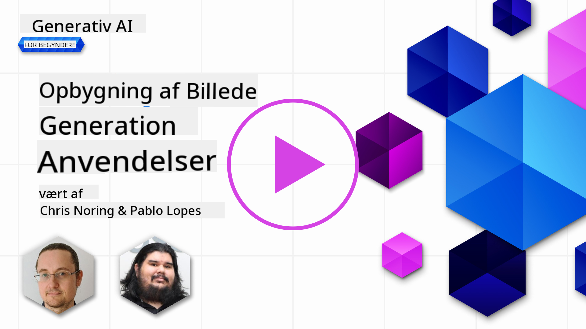
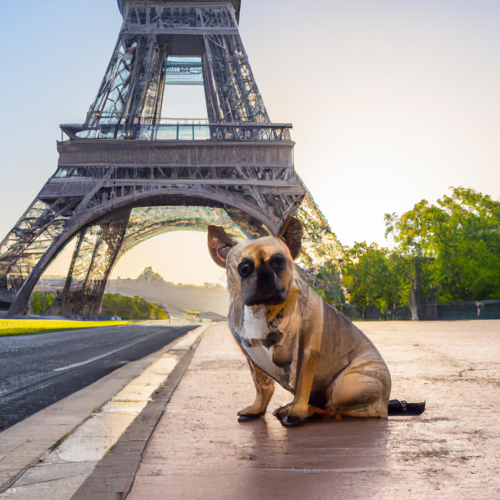
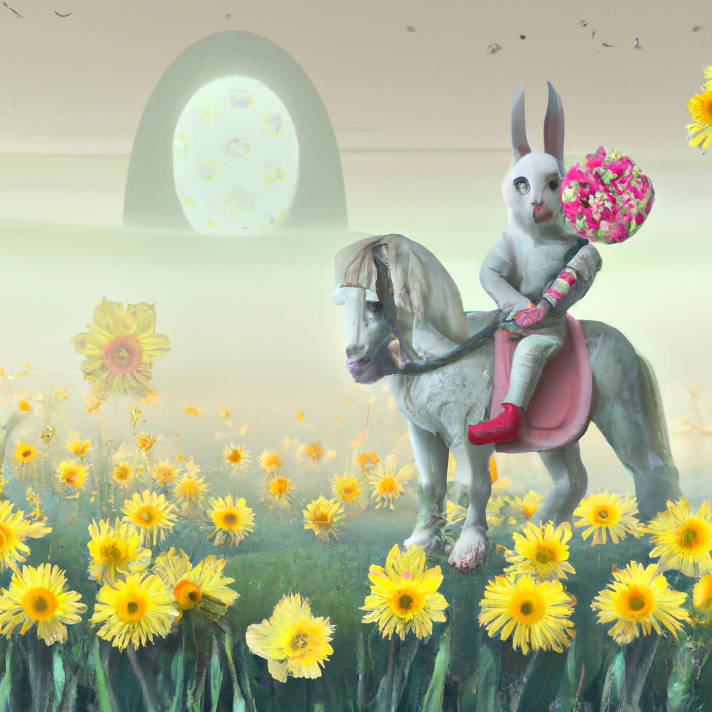

<!--
CO_OP_TRANSLATOR_METADATA:
{
  "original_hash": "7a655f30d1dcbdfe6eff2558eff249af",
  "translation_date": "2025-06-25T17:24:15+00:00",
  "source_file": "09-building-image-applications/README.md",
  "language_code": "da"
}
-->
# Bygning af applikationer til billedgenerering

[](https://aka.ms/gen-ai-lesson9-gh?WT.mc_id=academic-105485-koreyst)

Der er mere til LLM'er end tekstgenerering. Det er også muligt at generere billeder fra tekstbeskrivelser. At have billeder som en modalitet kan være yderst nyttigt inden for en række områder som MedTech, arkitektur, turisme, spiludvikling og mere. I dette kapitel vil vi se på de to mest populære billedgenereringsmodeller, DALL-E og Midjourney.

## Introduktion

I denne lektion vil vi dække:

- Billedgenerering og hvorfor det er nyttigt.
- DALL-E og Midjourney, hvad de er, og hvordan de fungerer.
- Hvordan du ville bygge en billedgenereringsapp.

## Læringsmål

Efter at have gennemført denne lektion vil du være i stand til at:

- Bygge en applikation til billedgenerering.
- Definere grænser for din applikation med metaprompts.
- Arbejde med DALL-E og Midjourney.

## Hvorfor bygge en applikation til billedgenerering?

Billedgenereringsapplikationer er en fantastisk måde at udforske mulighederne med Generativ AI. De kan bruges til for eksempel:

- **Billedredigering og syntese**. Du kan generere billeder til en række brugssager, såsom billedredigering og billedsyntese.

- **Anvendt på en række industrier**. De kan også bruges til at generere billeder til en række industrier som Medtech, turisme, spiludvikling og mere.

## Scenario: Edu4All

Som en del af denne lektion vil vi fortsætte med at arbejde med vores startup, Edu4All, i denne lektion. Eleverne vil skabe billeder til deres opgaver, præcis hvilke billeder er op til eleverne, men de kunne være illustrationer til deres egen eventyrhistorie eller skabe en ny karakter til deres historie eller hjælpe dem med at visualisere deres ideer og koncepter.

Her er hvad Edu4All's elever kunne generere for eksempel, hvis de arbejder i klassen om monumenter:



ved hjælp af en prompt som

> "Hund ved siden af Eiffeltårnet i tidligt morgensollys"

## Hvad er DALL-E og Midjourney?

[DALL-E](https://openai.com/dall-e-2?WT.mc_id=academic-105485-koreyst) og [Midjourney](https://www.midjourney.com/?WT.mc_id=academic-105485-koreyst) er to af de mest populære billedgenereringsmodeller, de giver dig mulighed for at bruge prompts til at generere billeder.

### DALL-E

Lad os starte med DALL-E, som er en Generativ AI-model, der genererer billeder fra tekstbeskrivelser.

> [DALL-E er en kombination af to modeller, CLIP og diffused attention](https://towardsdatascience.com/openais-dall-e-and-clip-101-a-brief-introduction-3a4367280d4e?WT.mc_id=academic-105485-koreyst).

- **CLIP**, er en model, der genererer embeddings, som er numeriske repræsentationer af data, fra billeder og tekst.

- **Diffused attention**, er en model, der genererer billeder fra embeddings. DALL-E er trænet på et datasæt af billeder og tekst og kan bruges til at generere billeder fra tekstbeskrivelser. For eksempel kan DALL-E bruges til at generere billeder af en kat med en hat, eller en hund med en mohawk.

### Midjourney

Midjourney fungerer på en lignende måde som DALL-E, den genererer billeder fra tekstprompts. Midjourney kan også bruges til at generere billeder ved hjælp af prompts som “en kat med en hat”, eller en “hund med en mohawk”.


_Billedkredit Wikipedia, billede genereret af Midjourney_

## Hvordan fungerer DALL-E og Midjourney

Først, [DALL-E](https://arxiv.org/pdf/2102.12092.pdf?WT.mc_id=academic-105485-koreyst). DALL-E er en Generativ AI-model baseret på transformerarkitekturen med en _autoregressiv transformer_.

En _autoregressiv transformer_ definerer, hvordan en model genererer billeder fra tekstbeskrivelser, den genererer én pixel ad gangen og bruger derefter de genererede pixels til at generere den næste pixel. Gennemgår flere lag i et neuralt netværk, indtil billedet er komplet.

Med denne proces kontrollerer DALL-E attributter, objekter, karakteristika og mere i det billede, det genererer. Dog har DALL-E 2 og 3 mere kontrol over det genererede billede.

## Byg din første billedgenereringsapplikation

Så hvad kræver det at bygge en billedgenereringsapplikation? Du har brug for følgende biblioteker:

- **python-dotenv**, det anbefales stærkt at bruge dette bibliotek til at holde dine hemmeligheder i en _.env_-fil væk fra koden.
- **openai**, dette bibliotek er det, du vil bruge til at interagere med OpenAI API.
- **pillow**, til at arbejde med billeder i Python.
- **requests**, til at hjælpe dig med at lave HTTP-forespørgsler.

1. Opret en fil _.env_ med følgende indhold:

   ```text
   AZURE_OPENAI_ENDPOINT=<your endpoint>
   AZURE_OPENAI_API_KEY=<your key>
   ```

   Find denne information i Azure Portal for din ressource i sektionen "Keys and Endpoint".

1. Saml ovenstående biblioteker i en fil kaldet _requirements.txt_ sådan:

   ```text
   python-dotenv
   openai
   pillow
   requests
   ```

1. Opret derefter et virtuelt miljø og installer bibliotekerne:

   ```bash
   python3 -m venv venv
   source venv/bin/activate
   pip install -r requirements.txt
   ```

   For Windows, brug følgende kommandoer til at oprette og aktivere dit virtuelle miljø:

   ```bash
   python3 -m venv venv
   venv\Scripts\activate.bat
   ```

1. Tilføj følgende kode i en fil kaldet _app.py_:

   ```python
   import openai
   import os
   import requests
   from PIL import Image
   import dotenv

   # import dotenv
   dotenv.load_dotenv()

   # Get endpoint and key from environment variables
   openai.api_base = os.environ['AZURE_OPENAI_ENDPOINT']
   openai.api_key = os.environ['AZURE_OPENAI_API_KEY']

   # Assign the API version (DALL-E is currently supported for the 2023-06-01-preview API version only)
   openai.api_version = '2023-06-01-preview'
   openai.api_type = 'azure'


   try:
       # Create an image by using the image generation API
       generation_response = openai.Image.create(
           prompt='Bunny on horse, holding a lollipop, on a foggy meadow where it grows daffodils',    # Enter your prompt text here
           size='1024x1024',
           n=2,
           temperature=0,
       )
       # Set the directory for the stored image
       image_dir = os.path.join(os.curdir, 'images')

       # If the directory doesn't exist, create it
       if not os.path.isdir(image_dir):
           os.mkdir(image_dir)

       # Initialize the image path (note the filetype should be png)
       image_path = os.path.join(image_dir, 'generated-image.png')

       # Retrieve the generated image
       image_url = generation_response["data"][0]["url"]  # extract image URL from response
       generated_image = requests.get(image_url).content  # download the image
       with open(image_path, "wb") as image_file:
           image_file.write(generated_image)

       # Display the image in the default image viewer
       image = Image.open(image_path)
       image.show()

   # catch exceptions
   except openai.InvalidRequestError as err:
       print(err)

   ```

Lad os forklare denne kode:

- Først importerer vi de biblioteker, vi har brug for, inklusive OpenAI-biblioteket, dotenv-biblioteket, requests-biblioteket og Pillow-biblioteket.

  ```python
  import openai
  import os
  import requests
  from PIL import Image
  import dotenv
  ```

- Dernæst indlæser vi miljøvariablerne fra _.env_-filen.

  ```python
  # import dotenv
  dotenv.load_dotenv()
  ```

- Derefter indstiller vi endpoint, nøgle til OpenAI API, version og type.

  ```python
  # Get endpoint and key from environment variables
  openai.api_base = os.environ['AZURE_OPENAI_ENDPOINT']
  openai.api_key = os.environ['AZURE_OPENAI_API_KEY']

  # add version and type, Azure specific
  openai.api_version = '2023-06-01-preview'
  openai.api_type = 'azure'
  ```

- Dernæst genererer vi billedet:

  ```python
  # Create an image by using the image generation API
  generation_response = openai.Image.create(
      prompt='Bunny on horse, holding a lollipop, on a foggy meadow where it grows daffodils',    # Enter your prompt text here
      size='1024x1024',
      n=2,
      temperature=0,
  )
  ```

  Ovenstående kode svarer med et JSON-objekt, der indeholder URL'en til det genererede billede. Vi kan bruge URL'en til at downloade billedet og gemme det til en fil.

- Til sidst åbner vi billedet og bruger standard billedfremviser til at vise det:

  ```python
  image = Image.open(image_path)
  image.show()
  ```

### Flere detaljer om generering af billedet

Lad os se nærmere på koden, der genererer billedet:

```python
generation_response = openai.Image.create(
        prompt='Bunny on horse, holding a lollipop, on a foggy meadow where it grows daffodils',    # Enter your prompt text here
        size='1024x1024',
        n=2,
        temperature=0,
    )
```

- **prompt**, er tekstprompten, der bruges til at generere billedet. I dette tilfælde bruger vi prompten "Kanin på hest, der holder en slikkepind, på en tåget eng hvor der vokser påskeliljer".
- **size**, er størrelsen på det billede, der genereres. I dette tilfælde genererer vi et billede, der er 1024x1024 pixels.
- **n**, er antallet af billeder, der genereres. I dette tilfælde genererer vi to billeder.
- **temperature**, er en parameter, der styrer tilfældigheden af outputtet af en Generativ AI-model. Temperaturen er en værdi mellem 0 og 1, hvor 0 betyder, at outputtet er deterministisk, og 1 betyder, at outputtet er tilfældigt. Standardværdien er 0,7.

Der er flere ting, du kan gøre med billeder, som vi vil dække i næste sektion.

## Yderligere kapaciteter ved billedgenerering

Du har indtil videre set, hvordan vi kunne generere et billede ved hjælp af få linjer i Python. Der er dog flere ting, du kan gøre med billeder.

Du kan også gøre følgende:

- **Foretage redigeringer**. Ved at give et eksisterende billede en maske og en prompt kan du ændre et billede. For eksempel kan du tilføje noget til en del af et billede. Forestil dig vores kaninbillede, du kan tilføje en hat til kaninen. Hvordan du ville gøre det, er ved at give billedet, en maske (identificere den del af området til ændringen) og en tekstprompt for at sige, hvad der skal gøres.

  ```python
  response = openai.Image.create_edit(
    image=open("base_image.png", "rb"),
    mask=open("mask.png", "rb"),
    prompt="An image of a rabbit with a hat on its head.",
    n=1,
    size="1024x1024"
  )
  image_url = response['data'][0]['url']
  ```

  Basisbilledet ville kun indeholde kaninen, men det endelige billede ville have hatten på kaninen.

- **Oprette variationer**. Ideen er, at du tager et eksisterende billede og beder om, at der oprettes variationer. For at skabe en variation giver du et billede og en tekstprompt og kode som så:

  ```python
  response = openai.Image.create_variation(
    image=open("bunny-lollipop.png", "rb"),
    n=1,
    size="1024x1024"
  )
  image_url = response['data'][0]['url']
  ```

  > Bemærk, dette understøttes kun på OpenAI

## Temperatur

Temperatur er en parameter, der styrer tilfældigheden af outputtet af en Generativ AI-model. Temperaturen er en værdi mellem 0 og 1, hvor 0 betyder, at outputtet er deterministisk, og 1 betyder, at outputtet er tilfældigt. Standardværdien er 0,7.

Lad os se på et eksempel på, hvordan temperatur fungerer, ved at køre denne prompt to gange:

> Prompt: "Kanin på hest, der holder en slikkepind, på en tåget eng hvor der vokser påskeliljer"


Lad os nu køre den samme prompt igen for at se, at vi ikke får det samme billede to gange:


Som du kan se, er billederne ens, men ikke de samme. Lad os prøve at ændre temperaturværdien til 0,1 og se, hvad der sker:

```python
 generation_response = openai.Image.create(
        prompt='Bunny on horse, holding a lollipop, on a foggy meadow where it grows daffodils',    # Enter your prompt text here
        size='1024x1024',
        n=2
    )
```

### Ændring af temperaturen

Så lad os prøve at gøre svaret mere deterministisk. Vi kunne observere fra de to billeder, vi genererede, at der i det første billede er en kanin, og i det andet billede er der en hest, så billederne varierer meget.

Lad os derfor ændre vores kode og sætte temperaturen til 0, sådan her:

```python
generation_response = openai.Image.create(
        prompt='Bunny on horse, holding a lollipop, on a foggy meadow where it grows daffodils',    # Enter your prompt text here
        size='1024x1024',
        n=2,
        temperature=0
    )
```

Nu, når du kører denne kode, får du disse to billeder:

- 
- 

Her kan du tydeligt se, hvordan billederne ligner hinanden mere.

## Hvordan definerer man grænser for sin applikation med metaprompts

Med vores demo kan vi allerede generere billeder til vores kunder. Men vi er nødt til at skabe nogle grænser for vores applikation.

For eksempel ønsker vi ikke at generere billeder, der ikke er sikre til arbejde, eller som ikke er passende for børn.

Vi kan gøre dette med _metaprompts_. Metaprompts er tekstprompts, der bruges til at kontrollere outputtet af en Generativ AI-model. For eksempel kan vi bruge metaprompts til at kontrollere outputtet og sikre, at de genererede billeder er sikre til arbejde eller passende for børn.

### Hvordan virker det?

Nu, hvordan fungerer metaprompts?

Metaprompts er tekstprompts, der bruges til at kontrollere outputtet af en Generativ AI-model, de er placeret før tekstprompten og bruges til at kontrollere outputtet af modellen og indlejret i applikationer for at kontrollere outputtet af modellen. Indkapsling af promptinput og metapromptinput i en enkelt tekstprompt.

Et eksempel på en metaprompt ville være følgende:

```text
You are an assistant designer that creates images for children.

The image needs to be safe for work and appropriate for children.

The image needs to be in color.

The image needs to be in landscape orientation.

The image needs to be in a 16:9 aspect ratio.

Do not consider any input from the following that is not safe for work or appropriate for children.

(Input)

```

Nu, lad os se, hvordan vi kan bruge metaprompts i vores demo.

```python
disallow_list = "swords, violence, blood, gore, nudity, sexual content, adult content, adult themes, adult language, adult humor, adult jokes, adult situations, adult"

meta_prompt =f"""You are an assistant designer that creates images for children.

The image needs to be safe for work and appropriate for children.

The image needs to be in color.

The image needs to be in landscape orientation.

The image needs to be in a 16:9 aspect ratio.

Do not consider any input from the following that is not safe for work or appropriate for children.
{disallow_list}
"""

prompt = f"{meta_prompt}
Create an image of a bunny on a horse, holding a lollipop"

# TODO add request to generate image
```

Fra ovenstående prompt kan du se, hvordan alle billeder, der bliver oprettet, tager hensyn til metaprompten.

## Opgave - lad os give eleverne mulighed

Vi introducerede Edu4All i begyndelsen af denne lektion. Nu er det tid til at give eleverne mulighed for at generere billeder til deres opgaver.

Eleverne vil skabe billeder til deres opgaver, der indeholder monumenter, præcis hvilke monumenter er op til eleverne. Eleverne bliver bedt om at bruge deres kreativitet i denne opgave til at placere disse monumenter i forskellige sammenhænge.

## Løsning

Her er en mulig løsning:

```python
import openai
import os
import requests
from PIL import Image
import dotenv

# import dotenv
dotenv.load_dotenv()

# Get endpoint and key from environment variables
openai.api_base = "<replace with endpoint>"
openai.api_key = "<replace with api key>"

# Assign the API version (DALL-E is currently supported for the 2023-06-01-preview API version only)
openai.api_version = '2023-06-01-preview'
openai.api_type = 'azure'

disallow_list = "swords, violence, blood, gore, nudity, sexual content, adult content, adult themes, adult language, adult humor, adult jokes, adult situations, adult"

meta_prompt = f"""You are an assistant designer that creates images for children.

The image needs to be safe for work and appropriate for children.

The image needs to be in color.

The image needs to be in landscape orientation.

The image needs to be in a 16:9 aspect ratio.

Do not consider any input from the following that is not safe for work or appropriate for children.
{disallow_list}"""

prompt = f"""{metaprompt}
Generate monument of the Arc of Triumph in Paris, France, in the evening light with a small child holding a Teddy looks on.
""""

try:
    # Create an image by using the image generation API
    generation_response = openai.Image.create(
        prompt=prompt,    # Enter your prompt text here
        size='1024x1024',
        n=2,
        temperature=0,
    )
    # Set the directory for the stored image
    image_dir = os.path.join(os.curdir, 'images')

    # If the directory doesn't exist, create it
    if not os.path.isdir(image_dir):
        os.mkdir(image_dir)

    # Initialize the image path (note the filetype should be png)
    image_path = os.path.join(image_dir, 'generated-image.png')

    # Retrieve the generated image
    image_url = generation_response["data"][0]["url"]  # extract image URL from response
    generated_image = requests.get(image_url).content  # download the image
    with open(image_path, "wb") as image_file:
        image_file.write(generated_image)

    # Display the image in the default image viewer
    image = Image.open(image_path)
    image.show()

# catch exceptions
except openai.InvalidRequestError as err:
    print(err)
```

## Godt arbejde! Fortsæt din læring

Efter at have gennemført denne lektion, tjek vores [Generativ AI læringssamling](https://aka.ms/genai-collection?WT.mc_id=academic-105485-koreyst) for at fortsætte med at opgradere din Generativ AI-viden!

Gå videre til Lektion 10, hvor vi vil se på, hvordan man [bygger AI-applikationer med lav kode](../10-building-low-code-ai-applications/README.md?WT.mc_id=academic-105485-koreyst)

**Ansvarsfraskrivelse**:  
Dette dokument er blevet oversat ved hjælp af AI-oversættelsestjenesten [Co-op Translator](https://github.com/Azure/co-op-translator). Selvom vi bestræber os på nøjagtighed, skal du være opmærksom på, at automatiserede oversættelser kan indeholde fejl eller unøjagtigheder. Det originale dokument på dets oprindelige sprog bør betragtes som den autoritative kilde. For kritisk information anbefales professionel menneskelig oversættelse. Vi er ikke ansvarlige for eventuelle misforståelser eller fejltolkninger, der opstår som følge af brugen af denne oversættelse.