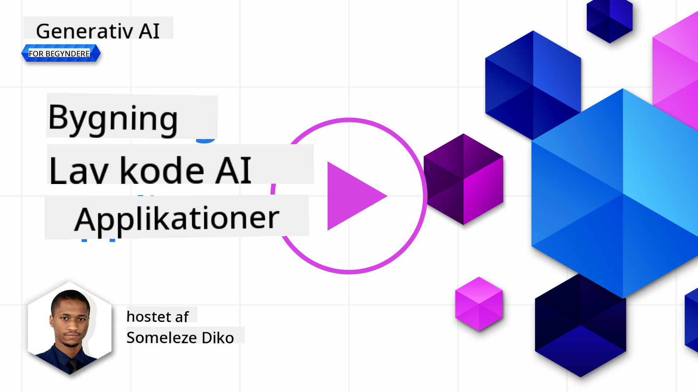
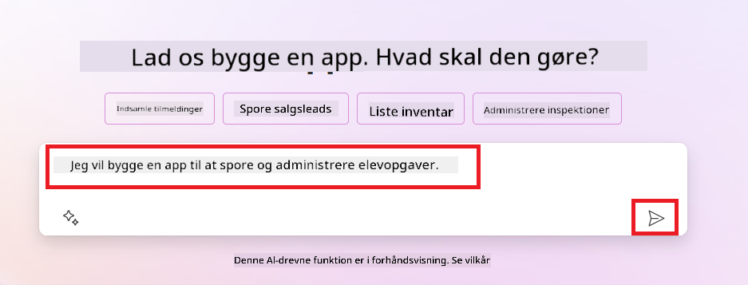
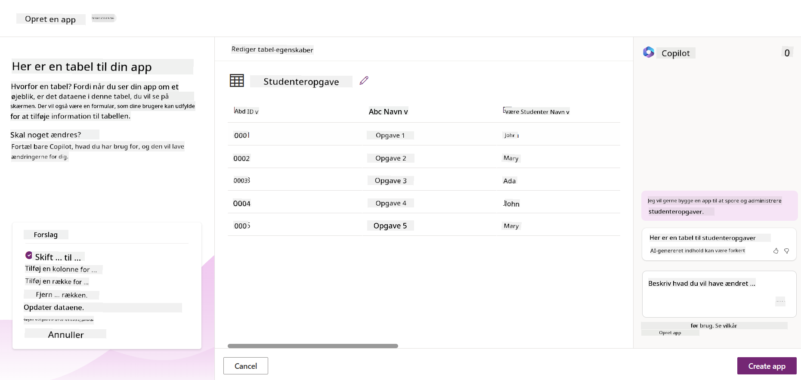
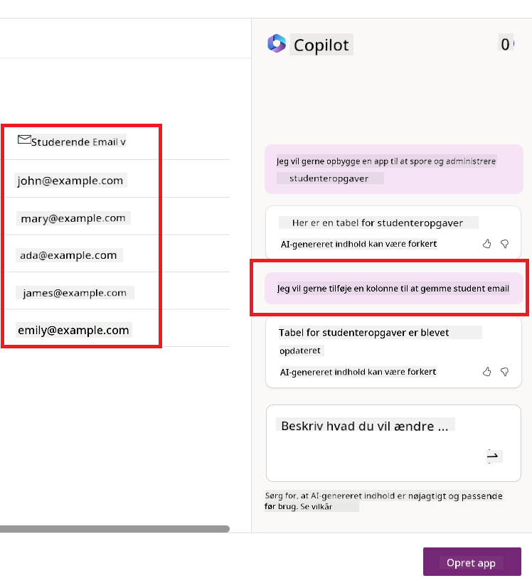
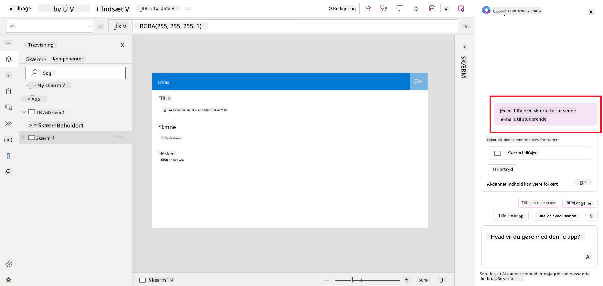
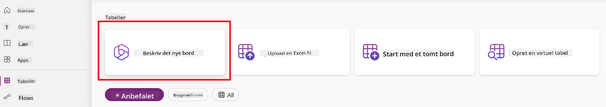
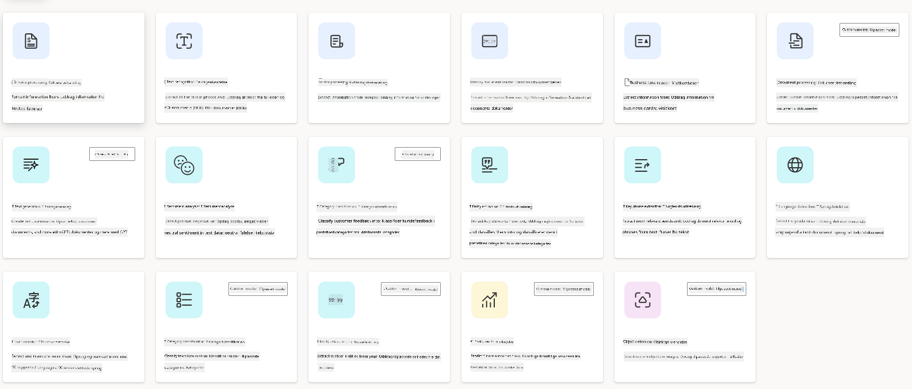
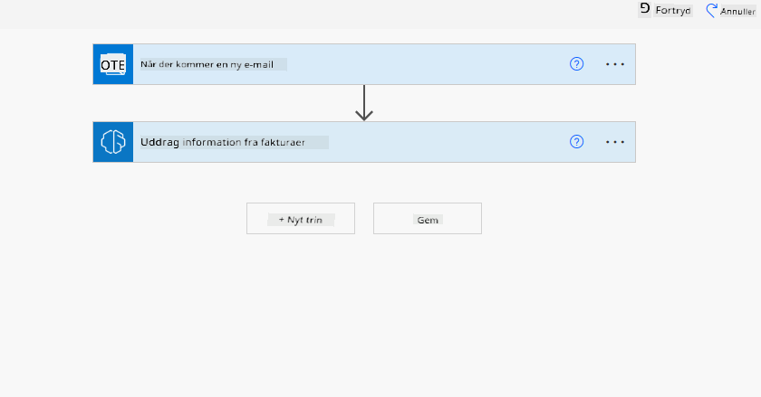
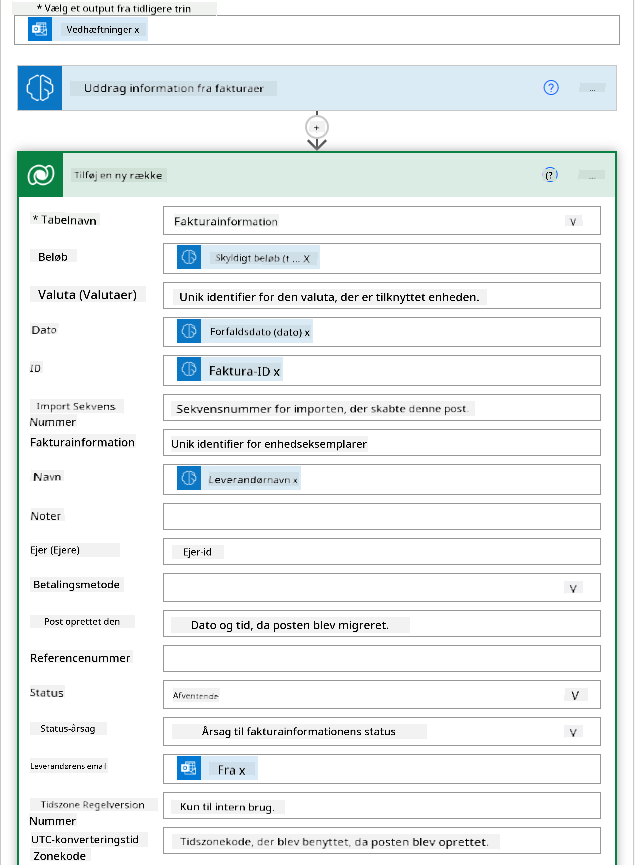
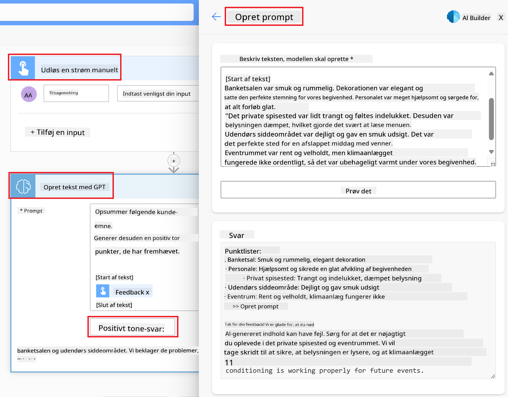

<!--
CO_OP_TRANSLATOR_METADATA:
{
  "original_hash": "f5ff3b6204a695a117d6f452403c95f7",
  "translation_date": "2025-05-19T20:30:48+00:00",
  "source_file": "10-building-low-code-ai-applications/README.md",
  "language_code": "da"
}
-->
# Bygge Low Code AI-applikationer

> _(Klik på billedet ovenfor for at se videoen af denne lektion)_

## Introduktion

Nu hvor vi har lært at bygge billedgenererende applikationer, lad os tale om low code. Generativ AI kan bruges i forskellige områder, herunder low code, men hvad er low code, og hvordan kan vi tilføje AI til det?

At bygge apps og løsninger er blevet lettere for både traditionelle udviklere og ikke-udviklere gennem brugen af Low Code Development Platforms. Low Code Development Platforms gør det muligt at bygge apps og løsninger med lidt eller ingen kode. Dette opnås ved at tilbyde et visuelt udviklingsmiljø, der giver dig mulighed for at trække og slippe komponenter for at bygge apps og løsninger. Dette gør det muligt at bygge apps og løsninger hurtigere og med færre ressourcer. I denne lektion dykker vi dybt ned i, hvordan man bruger Low Code og hvordan man forbedrer low code udvikling med AI ved hjælp af Power Platform.

Power Platform giver organisationer mulighed for at styrke deres teams til at bygge deres egne løsninger gennem et intuitivt low-code eller no-code miljø. Dette miljø hjælper med at forenkle processen med at bygge løsninger. Med Power Platform kan løsninger bygges på dage eller uger i stedet for måneder eller år. Power Platform består af fem nøgleprodukter: Power Apps, Power Automate, Power BI, Power Pages og Copilot Studio.

Denne lektion dækker:

- Introduktion til Generativ AI i Power Platform
- Introduktion til Copilot og hvordan man bruger det
- Brug af Generativ AI til at bygge apps og flows i Power Platform
- Forståelse af AI-modeller i Power Platform med AI Builder

## Læringsmål

Ved slutningen af denne lektion vil du være i stand til at:

- Forstå hvordan Copilot fungerer i Power Platform.

- Bygge en Studenteropgave Tracker App til vores uddannelsesstartup.

- Bygge et Fakturabehandlingsflow, der bruger AI til at udtrække information fra fakturaer.

- Anvende bedste praksis ved brug af Create Text med GPT AI Model.

De værktøjer og teknologier, du vil bruge i denne lektion, er:

- **Power Apps**, til Studenteropgave Tracker appen, som giver et low-code udviklingsmiljø til at bygge apps til at spore, administrere og interagere med data.

- **Dataverse**, til at lagre dataene for Studenteropgave Tracker appen, hvor Dataverse vil give en low-code dataplatform til lagring af appens data.

- **Power Automate**, til Fakturabehandlingsflowet, hvor du vil have et low-code udviklingsmiljø til at bygge workflows for at automatisere Fakturabehandlingsprocessen.

- **AI Builder**, til Fakturabehandlings AI-modellen, hvor du vil bruge forudbyggede AI-modeller til at behandle fakturaerne for vores startup.

## Generativ AI i Power Platform

At forbedre low-code udvikling og applikation med generativ AI er et nøglefokusområde for Power Platform. Målet er at give alle mulighed for at bygge AI-drevne apps, sites, dashboards og automatisere processer med AI, _uden at kræve nogen datavidenskabsekspertise_. Dette mål opnås ved at integrere generativ AI i low-code udviklingsoplevelsen i Power Platform i form af Copilot og AI Builder.

### Hvordan fungerer dette?

Copilot er en AI-assistent, der gør det muligt for dig at bygge Power Platform løsninger ved at beskrive dine krav i en række samtaletrin ved hjælp af naturligt sprog. Du kan for eksempel instruere din AI-assistent til at angive, hvilke felter din app vil bruge, og den vil oprette både appen og den underliggende datamodel, eller du kan specificere, hvordan man opsætter et flow i Power Automate.

Du kan bruge Copilot-drevne funktionaliteter som en funktion i dine appskærme for at give brugerne mulighed for at afdække indsigt gennem samtaleinteraktioner.

AI Builder er en low-code AI-kapabilitet tilgængelig i Power Platform, der gør det muligt for dig at bruge AI-modeller til at hjælpe dig med at automatisere processer og forudsige resultater. Med AI Builder kan du bringe AI til dine apps og flows, der forbinder til dine data i Dataverse eller i forskellige cloud-datakilder, såsom SharePoint, OneDrive eller Azure.

Copilot er tilgængelig i alle Power Platform-produkter: Power Apps, Power Automate, Power BI, Power Pages og Power Virtual Agents. AI Builder er tilgængelig i Power Apps og Power Automate. I denne lektion vil vi fokusere på, hvordan man bruger Copilot og AI Builder i Power Apps og Power Automate til at bygge en løsning til vores uddannelsesstartup.

### Copilot i Power Apps

Som en del af Power Platform, giver Power Apps et low-code udviklingsmiljø til at bygge apps til at spore, administrere og interagere med data. Det er en suite af appudviklingstjenester med en skalerbar dataplatform og evnen til at forbinde til cloud-tjenester og on-premises data. Power Apps giver dig mulighed for at bygge apps, der kører på browsere, tablets og telefoner, og som kan deles med kolleger. Power Apps gør det lettere for brugere at komme i gang med appudvikling med en simpel grænseflade, så enhver forretningsbruger eller pro-udvikler kan bygge brugerdefinerede apps. Appudviklingsoplevelsen forbedres også med Generativ AI gennem Copilot.

Copilot AI-assistentfunktionen i Power Apps gør det muligt for dig at beskrive, hvilken slags app du har brug for, og hvilken information du vil have, at din app skal spore, indsamle eller vise. Copilot genererer derefter en responsiv Canvas-app baseret på din beskrivelse. Du kan derefter tilpasse appen til at opfylde dine behov. AI Copilot genererer og foreslår også en Dataverse-tabel med de felter, du har brug for til at lagre de data, du vil spore, og nogle eksempler på data. Vi vil senere i denne lektion se på, hvad Dataverse er, og hvordan du kan bruge det i Power Apps. Du kan derefter tilpasse tabellen til at opfylde dine behov ved hjælp af AI Copilot-assistentfunktionen gennem samtaletrin. Denne funktion er let tilgængelig fra Power Apps-startskærmen.

### Copilot i Power Automate

Som en del af Power Platform, giver Power Automate brugerne mulighed for at oprette automatiserede workflows mellem applikationer og tjenester. Det hjælper med at automatisere gentagne forretningsprocesser som kommunikation, dataindsamling og beslutningsgodkendelser. Den enkle grænseflade giver brugere med enhver teknisk kompetence (fra begyndere til erfarne udviklere) mulighed for at automatisere arbejdstasks. Workflowudviklingsoplevelsen forbedres også med Generativ AI gennem Copilot.

Copilot AI-assistentfunktionen i Power Automate gør det muligt for dig at beskrive, hvilken slags flow du har brug for, og hvilke handlinger du vil have, at dit flow skal udføre. Copilot genererer derefter et flow baseret på din beskrivelse. Du kan derefter tilpasse flowet til at opfylde dine behov. AI Copilot genererer og foreslår også de handlinger, du har brug for til at udføre den opgave, du vil automatisere. Vi vil senere i denne lektion se på, hvad flows er, og hvordan du kan bruge dem i Power Automate. Du kan derefter tilpasse handlingerne til at opfylde dine behov ved hjælp af AI Copilot-assistentfunktionen gennem samtaletrin. Denne funktion er let tilgængelig fra Power Automate-startskærmen.

## Opgave: Administrer studenteropgaver og fakturaer for vores startup ved hjælp af Copilot

Vores startup tilbyder onlinekurser til studerende. Startuppen er vokset hurtigt og kæmper nu med at følge med efterspørgslen efter sine kurser. Startuppen har ansat dig som Power Platform-udvikler for at hjælpe dem med at bygge en low code-løsning til at hjælpe dem med at administrere deres studenteropgaver og fakturaer. Deres løsning skal kunne hjælpe dem med at spore og administrere studenteropgaver gennem en app og automatisere fakturabehandlingsprocessen gennem et workflow. Du er blevet bedt om at bruge Generativ AI til at udvikle løsningen.

Når du starter med at bruge Copilot, kan du bruge [Power Platform Copilot Prompt Library](https://github.com/pnp/powerplatform-prompts?WT.mc_id=academic-109639-somelezediko) til at komme i gang med promptene. Dette bibliotek indeholder en liste over prompts, som du kan bruge til at bygge apps og flows med Copilot. Du kan også bruge promptene i biblioteket til at få en idé om, hvordan du beskriver dine krav til Copilot.

### Byg en Studenteropgave Tracker App til vores startup

Underviserne hos vores startup har haft svært ved at holde styr på studenteropgaver. De har brugt et regneark til at spore opgaverne, men dette er blevet svært at administrere, da antallet af studerende er steget. De har bedt dig om at bygge en app, der vil hjælpe dem med at spore og administrere studenteropgaver. Appen skal give dem mulighed for at tilføje nye opgaver, se opgaver, opdatere opgaver og slette opgaver. Appen skal også give undervisere og studerende mulighed for at se de opgaver, der er blevet bedømt, og dem der ikke er blevet bedømt.

Du vil bygge appen ved hjælp af Copilot i Power Apps ved at følge nedenstående trin:

1. Naviger til [Power Apps](https://make.powerapps.com?WT.mc_id=academic-105485-koreyst) startskærmen.

1. Brug tekstområdet på startskærmen til at beskrive den app, du vil bygge. For eksempel, **_Jeg vil bygge en app til at spore og administrere studenteropgaver_**. Klik på **Send** knappen for at sende prompten til AI Copilot.

1. AI Copilot vil foreslå en Dataverse-tabel med de felter, du har brug for til at lagre de data, du vil spore, og nogle eksempler på data. Du kan derefter tilpasse tabellen til at opfylde dine behov ved hjælp af AI Copilot-assistentfunktionen gennem samtaletrin.

   > **Vigtigt**: Dataverse er den underliggende dataplatform for Power Platform. Det er en low-code dataplatform til lagring af appens data. Det er en fuldt administreret tjeneste, der sikkert lagrer data i Microsoft Cloud og er provisioneret inden for dit Power Platform-miljø. Det kommer med indbyggede datastyringsfunktioner, såsom dataklassifikation, datalinjeage, finkornet adgangskontrol og mere. Du kan lære mere om Dataverse [her](https://docs.microsoft.com/powerapps/maker/data-platform/data-platform-intro?WT.mc_id=academic-109639-somelezediko).

   

1. Undervisere ønsker at sende e-mails til de studerende, der har indsendt deres opgaver for at holde dem opdateret om deres opgavers fremskridt. Du kan bruge Copilot til at tilføje et nyt felt til tabellen for at lagre studenter-e-mailen. For eksempel kan du bruge følgende prompt til at tilføje et nyt felt til tabellen: **_Jeg vil tilføje en kolonne til at lagre studenter-e-mail_**. Klik på **Send** knappen for at sende prompten til AI Copilot.

1. AI Copilot vil generere et nyt felt, og du kan derefter tilpasse feltet til at opfylde dine behov.

1. Når du er færdig med tabellen, skal du klikke på **Opret app** knappen for at oprette appen.

1. AI Copilot vil generere en responsiv Canvas-app baseret på din beskrivelse. Du kan derefter tilpasse appen til at opfylde dine behov.

1. For at undervisere kan sende e-mails til studerende, kan du bruge Copilot til at tilføje en ny skærm til appen. For eksempel kan du bruge følgende prompt til at tilføje en ny skærm til appen: **_Jeg vil tilføje en skærm til at sende e-mails til studerende_**. Klik på **Send** knappen for at sende prompten til AI Copilot.

1. AI Copilot vil generere en ny skærm, og du kan derefter tilpasse skærmen til at opfylde dine behov.

1. Når du er færdig med appen, skal du klikke på **Gem** knappen for at gemme appen.

1. For at dele appen med underviserne, skal du klikke på **Del** knappen og derefter klikke på **Del** knappen igen. Du kan derefter dele appen med underviserne ved at indtaste deres e-mailadresser.

> **Din hjemmeopgave**: Appen, du lige har bygget, er et godt startpunkt, men kan forbedres. Med e-mail-funktionen kan undervisere kun sende e-mails til studerende manuelt ved at skulle indtaste deres e-mails. Kan du bruge Copilot til at bygge en automatisering, der gør det muligt for undervisere at sende e-mails til studerende automatisk, når de indsender deres opgaver? Dit hint er, at med den rigtige prompt kan du bruge Copilot i Power Automate til at bygge dette.

### Byg en Fakturainformationstabel til vores startup

Finansholdet i vores startup har haft svært ved at holde styr på fakturaer. De har brugt et regneark til at spore fakturaerne, men dette er blevet svært at administrere, da antallet af fakturaer er steget. De har bedt dig om at bygge en tabel, der vil hjælpe dem med at lagre, spore og administrere informationen om de fakturaer, de modtager. Tabellen skal bruges til at bygge en automatisering, der vil udtrække alle fakturainformationer og lagre dem i tabellen. Tabellen skal også gøre det muligt for finansholdet at se de fakturaer, der er betalt, og dem der ikke er betalt.

Power Platform har en underliggende dataplatform kaldet Dataverse, der gør det muligt for dig at lagre dataene for dine apps og løsninger. Dataverse giver en low-code dataplatform til lagring af appens data. Det er en fuldt administreret tjeneste, der sikkert lagrer data i Microsoft Cloud og er provisioneret inden for dit Power Platform-miljø. Det kommer med indbyggede datastyringsfunktioner, såsom dataklassifikation, datalinjeage, finkornet adgangskontrol og mere. Du kan lære mere [om Dataverse her](https://docs.microsoft.com/powerapps/maker/data-platform/data-platform-intro?WT.mc_id=academic-109639-somelezediko).

Hvorfor skal vi bruge Dataverse til vores startup? Standard- og brugerdefinerede tabeller i Dataverse giver en sikker og cloud-baseret lageroption til dine data. Tabeller gør det muligt at lagre forskellige typer data, svarende til hvordan du måske bruger flere regneark i en enkelt Excel-arbejdsbog. Du kan bruge tabeller til at lagre data, der er specifikke for din organisation eller forretningsbehov. Nogle af de fordele, vores startup vil få fra at bruge Dataverse, inkluderer men er ikke begrænset til:

- **Let at administrere**: Både metadata og data lagres i skyen, så du behøver ikke bekymre dig om detaljerne om, hvordan de lagres eller administreres. Du kan fokusere på at bygge dine apps og løsninger.

- **Sikker**: Dataverse giver en sikker og cloud-baseret lageroption til dine data. Du kan kontrollere, hvem der har adgang til dataene i dine tabeller, og hvordan de kan få adgang til det ved hjælp af rollebaseret sikkerhed.

- **Rig metadata**: Datatyper og relationer bruges direkte inden for Power Apps.

- **Logik og validering**: Du kan bruge forretningsregler, beregnede felter og valideringsregler til at håndhæve forretningslogik og opretholde datanøjagtighed.

Nu hvor du ved, hvad Dataverse er, og hvorfor du skal bruge det, lad os se på, hvordan du kan bruge Copilot til at oprette en tabel i Dataverse for at opfylde kravene fra vores finanshold.

> **Bemærk**: Du vil bruge denne tabel i næste afsnit til at bygge en automatisering, der vil udtrække alle fakturainformationer og lagre dem i tabellen.
For at oprette en tabel i Dataverse ved hjælp af Copilot, følg nedenstående trin: 1. Naviger til [Power Apps](https://make.powerapps.com?WT.mc_id=academic-105485-koreyst) startskærmen. 2. På venstre navigationsbjælke, vælg **Tabeller** og klik derefter på **Beskriv den nye tabel**.  1. På **Beskriv den nye tabel** skærmen, brug tekstområdet til at beskrive den tabel, du vil oprette. For eksempel
en tekst. - **Sentimentanalyse**: Denne model registrerer positiv, negativ, neutral eller blandet sentiment i tekst. - **Visitkortlæser**: Denne model udtrækker information fra visitkort. - **Tekstgenkendelse**: Denne model udtrækker tekst fra billeder. - **Objektdetektion**: Denne model registrerer og udtrækker objekter fra billeder. - **Dokumentbehandling**: Denne model udtrækker information fra formularer. - **Fakturabehandling**: Denne model udtrækker information fra fakturaer. Med Custom AI Models kan du bringe din egen model ind i AI Builder, så den kan fungere som enhver AI Builder custom model, hvilket giver dig mulighed for at træne modellen ved hjælp af dine egne data. Du kan bruge disse modeller til at automatisere processer og forudsige resultater i både Power Apps og Power Automate. Når du bruger din egen model, er der begrænsninger, der gælder. Læs mere om disse [begrænsninger](https://learn.microsoft.com/ai-builder/byo-model#limitations?WT.mc_id=academic-105485-koreyst). 

## Opgave #2 - Byg et fakturabehandlingsflow til vores startup

Finansafdelingen har haft svært ved at behandle fakturaer. De har brugt et regneark til at holde styr på fakturaerne, men det er blevet vanskeligt at håndtere, da antallet af fakturaer er steget. De har bedt dig om at bygge en arbejdsgang, der vil hjælpe dem med at behandle fakturaer ved hjælp af AI. Arbejdsgangen skal give dem mulighed for at udtrække information fra fakturaer og gemme informationen i en Dataverse-tabel. Arbejdsgangen skal også give dem mulighed for at sende en e-mail til finansafdelingen med den udtrukne information.

Nu hvor du ved, hvad AI Builder er, og hvorfor du bør bruge det, lad os se på, hvordan du kan bruge fakturabehandlingsmodellen i AI Builder, som vi dækkede tidligere, til at bygge en arbejdsgang, der vil hjælpe finansafdelingen med at behandle fakturaer. For at bygge en arbejdsgang, der vil hjælpe finansafdelingen med at behandle fakturaer ved hjælp af fakturabehandlingsmodellen i AI Builder, skal du følge nedenstående trin:

1. Naviger til [Power Automate](https://make.powerautomate.com?WT.mc_id=academic-105485-koreyst) startskærmen.
2. Brug tekstområdet på startskærmen til at beskrive den arbejdsgang, du vil bygge. For eksempel, **_Behandl en faktura, når den ankommer i min postkasse_**. Klik på **Send**-knappen for at sende prompten til AI Copilot. 
3. AI Copilot vil foreslå de handlinger, du skal udføre for at automatisere opgaven. Du kan klikke på **Næste**-knappen for at gå gennem de næste trin.
4. I det næste trin vil Power Automate bede dig om at opsætte de nødvendige forbindelser til flowet. Når du er færdig, klik på **Opret flow**-knappen for at oprette flowet.
5. AI Copilot vil generere et flow, og du kan derefter tilpasse flowet, så det passer til dine behov.
6. Opdater triggeren for flowet og indstil **Mappen** til den mappe, hvor fakturaerne vil blive gemt. For eksempel kan du indstille mappen til **Indbakke**. Klik på **Vis avancerede indstillinger** og indstil **Kun med vedhæftninger** til **Ja**. Dette vil sikre, at flowet kun kører, når en e-mail med en vedhæftning modtages i mappen.
7. Fjern følgende handlinger fra flowet: **HTML til tekst**, **Sammensæt**, **Sammensæt 2**, **Sammensæt 3** og **Sammensæt 4**, da du ikke vil bruge dem.
8. Fjern **Betingelse**-handlingen fra flowet, da du ikke vil bruge den. Det skal se ud som følgende skærmbillede: 
9. Klik på **Tilføj en handling**-knappen og søg efter **Dataverse**. Vælg **Tilføj en ny række**-handlingen.
10. På **Udtræk information fra fakturaer**-handlingen, opdater **Fakturafil** til at pege på **Vedhæftningsindhold** fra e-mailen. Dette vil sikre, at flowet udtrækker information fra fakturavedhæftningen.
11. Vælg den **Tabel**, du oprettede tidligere. For eksempel kan du vælge **Fakturainformation**-tabellen. Vælg det dynamiske indhold fra den forrige handling for at udfylde følgende felter:
    - ID
    - Beløb
    - Dato
    - Navn
    - Status
    - Indstil **Status** til **Afventer**.
    - Leverandør e-mail
    - Brug **Fra** dynamisk indhold fra **Når en ny e-mail ankommer** triggeren. 
12. Når du er færdig med flowet, klik på **Gem**-knappen for at gemme flowet. Du kan derefter teste flowet ved at sende en e-mail med en faktura til den mappe, du specificerede i triggeren.

> **Din hjemmearbejde**: Det flow, du lige har bygget, er en god start, nu skal du tænke over, hvordan du kan bygge en automatisering, der vil gøre det muligt for vores finansafdeling at sende en e-mail til leverandøren for at opdatere dem med den aktuelle status for deres faktura. Dit hint: flowet skal køre, når fakturaens status ændres.

## Brug en tekstgenererings-AI-model i Power Automate

Opret tekst med GPT AI Model i AI Builder gør det muligt at generere tekst baseret på en prompt og er drevet af Microsoft Azure OpenAI Service. Med denne kapacitet kan du inkorporere GPT (Generative Pre-Trained Transformer) teknologi i dine apps og flows for at bygge en række automatiserede flows og indsigtsfulde applikationer.

GPT-modeller gennemgår omfattende træning på store mængder data, hvilket gør dem i stand til at producere tekst, der tæt ligner menneskesprog, når de får en prompt. Når de integreres med arbejdsgangsautomatisering, kan AI-modeller som GPT udnyttes til at strømline og automatisere en bred vifte af opgaver.

For eksempel kan du bygge flows til automatisk at generere tekst til en række anvendelsestilfælde, såsom: udkast til e-mails, produktbeskrivelser og mere. Du kan også bruge modellen til at generere tekst til en række apps, såsom chatbots og kundeserviceapps, der gør det muligt for kundeservicemedarbejdere at reagere effektivt og effektivt på kundehenvendelser.

For at lære, hvordan du bruger denne AI Model i Power Automate, gennemgå [Tilføj intelligens med AI Builder og GPT](https://learn.microsoft.com/training/modules/ai-builder-text-generation/?WT.mc_id=academic-109639-somelezediko) modulet.

## Godt arbejde! Fortsæt din læring

Efter at have gennemført denne lektion, tjek vores [Generative AI Learning collection](https://aka.ms/genai-collection?WT.mc_id=academic-105485-koreyst) for at fortsætte med at opgradere din viden om Generativ AI!

Gå videre til Lektion 11, hvor vi vil se på, hvordan man [integrerer Generativ AI med funktionkald](../11-integrating-with-function-calling/README.md?WT.mc_id=academic-105485-koreyst)!

**Ansvarsfraskrivelse**:  
Dette dokument er blevet oversat ved hjælp af AI-oversættelsestjenesten [Co-op Translator](https://github.com/Azure/co-op-translator). Mens vi bestræber os på nøjagtighed, skal du være opmærksom på, at automatiske oversættelser kan indeholde fejl eller unøjagtigheder. Det originale dokument på dets oprindelige sprog bør betragtes som den autoritative kilde. For kritisk information anbefales professionel menneskelig oversættelse. Vi er ikke ansvarlige for eventuelle misforståelser eller fejltolkninger, der måtte opstå som følge af brugen af denne oversættelse.