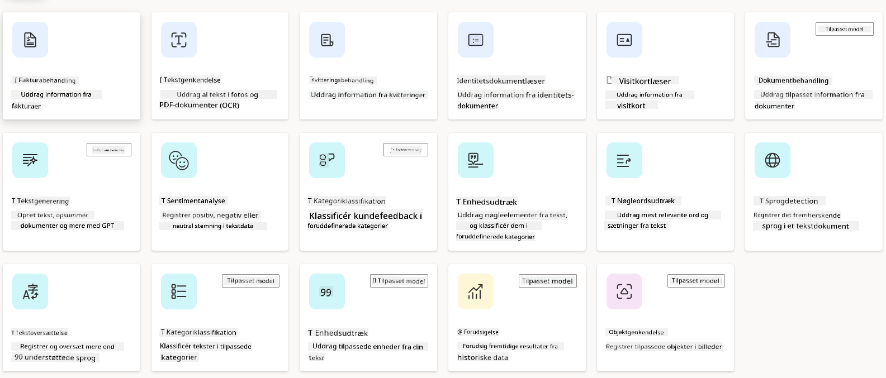
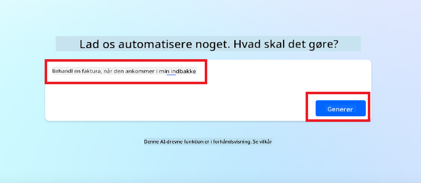
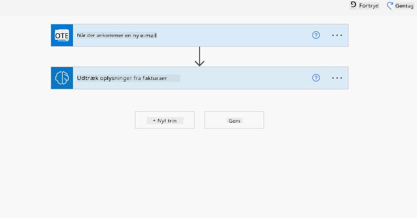
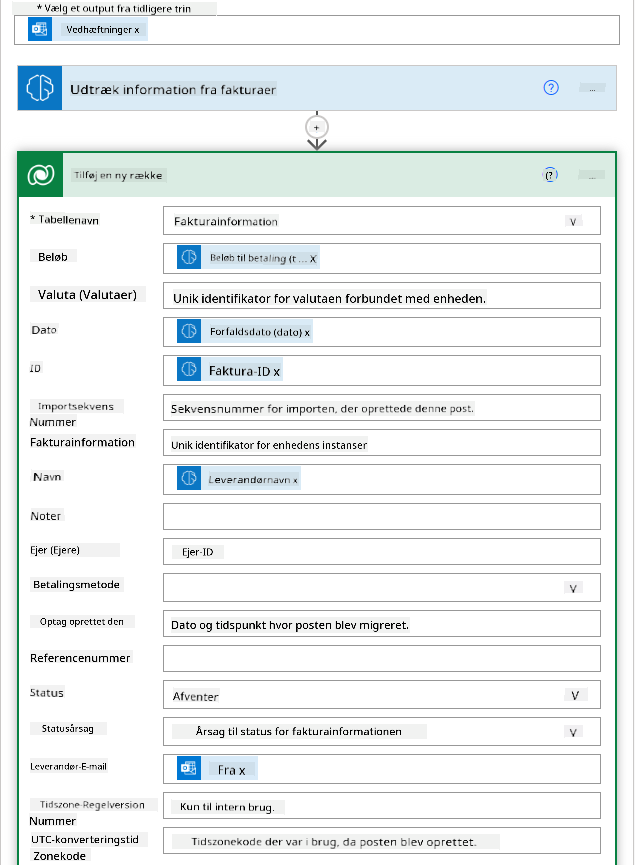
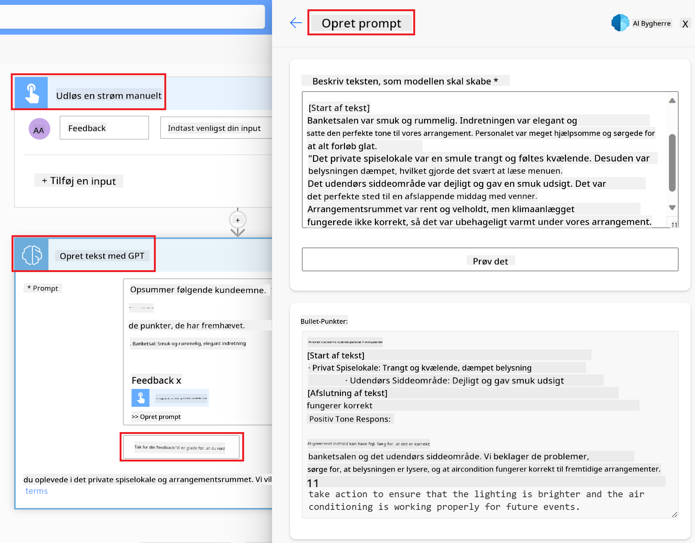

<!--
CO_OP_TRANSLATOR_METADATA:
{
  "original_hash": "f5ff3b6204a695a117d6f452403c95f7",
  "translation_date": "2025-06-25T18:50:50+00:00",
  "source_file": "10-building-low-code-ai-applications/README.md",
  "language_code": "da"
}
-->
# Bygge Lavkode AI-applikationer

> _(Klik på billedet ovenfor for at se videoen af denne lektion)_

## Introduktion

Nu hvor vi har lært at bygge billedgenererende applikationer, lad os tale om lavkode. Generativ AI kan bruges til en række forskellige områder, herunder lavkode, men hvad er lavkode, og hvordan kan vi tilføje AI til det?

At bygge apps og løsninger er blevet lettere for både traditionelle udviklere og ikke-udviklere gennem brugen af lavkodeudviklingsplatforme. Lavkodeudviklingsplatforme gør det muligt at bygge apps og løsninger med lidt eller ingen kode. Dette opnås ved at tilbyde et visuelt udviklingsmiljø, hvor du kan trække og slippe komponenter for at bygge apps og løsninger. Dette gør det muligt at bygge apps og løsninger hurtigere og med færre ressourcer. I denne lektion dykker vi dybt ned i, hvordan man bruger lavkode og hvordan man forbedrer lavkodeudvikling med AI ved hjælp af Power Platform.

Power Platform giver organisationer mulighed for at give deres teams mulighed for at bygge deres egne løsninger gennem et intuitivt lavkode eller ingen-kode miljø. Dette miljø hjælper med at forenkle processen med at bygge løsninger. Med Power Platform kan løsninger bygges på dage eller uger i stedet for måneder eller år. Power Platform består af fem nøgleprodukter: Power Apps, Power Automate, Power BI, Power Pages og Copilot Studio.

Denne lektion dækker:

- Introduktion til Generativ AI i Power Platform
- Introduktion til Copilot og hvordan man bruger det
- Brug af Generativ AI til at bygge apps og flows i Power Platform
- Forståelse af AI-modeller i Power Platform med AI Builder

## Læringsmål

Ved slutningen af denne lektion vil du være i stand til:

- Forstå hvordan Copilot fungerer i Power Platform.

- Bygge en Student Opgave Tracker App til vores uddannelsesstart-up.

- Bygge en Fakturabehandlingsflow der bruger AI til at udtrække information fra fakturaer.

- Anvende bedste praksis ved brug af Opret Tekst med GPT AI Model.

De værktøjer og teknologier, du vil bruge i denne lektion, er:

- **Power Apps**, til Student Opgave Tracker appen, som giver et lavkodeudviklingsmiljø til at bygge apps til at spore, administrere og interagere med data.

- **Dataverse**, til opbevaring af data for Student Opgave Tracker appen, hvor Dataverse vil give en lavkode dataplatform til opbevaring af appens data.

- **Power Automate**, til Fakturabehandlingsflowet, hvor du vil have et lavkodeudviklingsmiljø til at bygge workflows til at automatisere fakturabehandlingsprocessen.

- **AI Builder**, til Fakturabehandlings AI Model, hvor du vil bruge forudbyggede AI-modeller til at behandle fakturaerne for vores startup.

## Generativ AI i Power Platform

Forbedring af lavkodeudvikling og applikation med generativ AI er et centralt fokusområde for Power Platform. Målet er at gøre det muligt for alle at bygge AI-drevne apps, sites, dashboards og automatisere processer med AI, _uden at kræve nogen data science ekspertise_. Dette mål opnås ved at integrere generativ AI i lavkodeudviklingsoplevelsen i Power Platform i form af Copilot og AI Builder.

### Hvordan fungerer dette?

Copilot er en AI-assistent, der giver dig mulighed for at bygge Power Platform-løsninger ved at beskrive dine krav i en række samtale trin ved hjælp af naturligt sprog. Du kan for eksempel instruere din AI-assistent til at angive hvilke felter din app vil bruge, og den vil oprette både appen og den underliggende datamodel, eller du kunne specificere hvordan man opsætter et flow i Power Automate.

Du kan bruge Copilot-drevne funktioner som en funktion i dine app-skærme for at give brugere mulighed for at afdække indsigt gennem samtaleinteraktioner.

AI Builder er en lavkode AI-kapabilitet tilgængelig i Power Platform, der gør det muligt at bruge AI-modeller til at hjælpe dig med at automatisere processer og forudsige resultater. Med AI Builder kan du bringe AI til dine apps og flows, der forbinder til dine data i Dataverse eller i forskellige cloud-datakilder, såsom SharePoint, OneDrive eller Azure.

Copilot er tilgængelig i alle Power Platform-produkter: Power Apps, Power Automate, Power BI, Power Pages og Power Virtual Agents. AI Builder er tilgængelig i Power Apps og Power Automate. I denne lektion vil vi fokusere på, hvordan man bruger Copilot og AI Builder i Power Apps og Power Automate til at bygge en løsning til vores uddannelsesstart-up.

### Copilot i Power Apps

Som en del af Power Platform giver Power Apps et lavkodeudviklingsmiljø til at bygge apps til at spore, administrere og interagere med data. Det er en suite af app-udviklingstjenester med en skalerbar dataplatform og evnen til at forbinde til cloud-tjenester og on-premises data. Power Apps giver dig mulighed for at bygge apps, der kører på browsere, tablets og telefoner, og kan deles med kolleger. Power Apps gør det nemt for brugere at komme i gang med app-udvikling med et enkelt interface, så enhver virksomhed bruger eller pro-udvikler kan bygge brugerdefinerede apps. App-udviklingsoplevelsen er også forbedret med Generativ AI gennem Copilot.

Copilot AI-assistentfunktionen i Power Apps giver dig mulighed for at beskrive hvilken type app du har brug for, og hvilken information du ønsker din app skal spore, indsamle eller vise. Copilot genererer derefter en responsiv Canvas-app baseret på din beskrivelse. Du kan derefter tilpasse appen til at opfylde dine behov. AI Copilot genererer og foreslår også en Dataverse-tabel med de felter, du har brug for til at opbevare de data, du ønsker at spore, og nogle eksempler på data. Vi vil se på hvad Dataverse er, og hvordan du kan bruge det i Power Apps i denne lektion senere. Du kan derefter tilpasse tabellen til at opfylde dine behov ved hjælp af AI Copilot-assistentfunktionen gennem samtale trin. Denne funktion er let tilgængelig fra Power Apps-startskærmen.

### Copilot i Power Automate

Som en del af Power Platform giver Power Automate brugerne mulighed for at oprette automatiserede workflows mellem applikationer og tjenester. Det hjælper med at automatisere gentagne forretningsprocesser såsom kommunikation, dataindsamling og beslutningsgodkendelser. Dets enkle interface gør det muligt for brugere med enhver teknisk kompetence (fra begyndere til erfarne udviklere) at automatisere arbejdsopgaver. Workflow-udviklingsoplevelsen er også forbedret med Generativ AI gennem Copilot.

Copilot AI-assistentfunktionen i Power Automate giver dig mulighed for at beskrive hvilken type flow du har brug for, og hvilke handlinger du ønsker dit flow skal udføre. Copilot genererer derefter et flow baseret på din beskrivelse. Du kan derefter tilpasse flowet til at opfylde dine behov. AI Copilot genererer og foreslår også de handlinger, du har brug for til at udføre den opgave, du ønsker at automatisere. Vi vil se på hvad flows er, og hvordan du kan bruge dem i Power Automate i denne lektion senere. Du kan derefter tilpasse handlingerne til at opfylde dine behov ved hjælp af AI Copilot-assistentfunktionen gennem samtale trin. Denne funktion er let tilgængelig fra Power Automate-startskærmen.

## Opgave: Administrer elevopgaver og fakturaer for vores startup ved hjælp af Copilot

Vores startup tilbyder online kurser til studerende. Startuppen er vokset hurtigt og har nu svært ved at følge med efterspørgslen på sine kurser. Startuppen har ansat dig som Power Platform-udvikler for at hjælpe dem med at bygge en lavkode løsning til at hjælpe dem med at administrere deres elevopgaver og fakturaer. Deres løsning skal kunne hjælpe dem med at spore og administrere elevopgaver gennem en app og automatisere fakturabehandlingsprocessen gennem en workflow. Du er blevet bedt om at bruge Generativ AI til at udvikle løsningen.

Når du begynder at bruge Copilot, kan du bruge [Power Platform Copilot Prompt Library](https://github.com/pnp/powerplatform-prompts?WT.mc_id=academic-109639-somelezediko) til at komme i gang med prompts. Dette bibliotek indeholder en liste over prompts, du kan bruge til at bygge apps og flows med Copilot. Du kan også bruge prompts i biblioteket til at få en idé om, hvordan du beskriver dine krav til Copilot.

### Byg en Student Opgave Tracker App til vores startup

Underviserne hos vores startup har haft svært ved at holde styr på elevopgaver. De har brugt et regneark til at spore opgaverne, men det er blevet svært at administrere, da antallet af studerende er steget. De har bedt dig om at bygge en app, der vil hjælpe dem med at spore og administrere elevopgaver. Appen skal gøre det muligt for dem at tilføje nye opgaver, se opgaver, opdatere opgaver og slette opgaver. Appen skal også give undervisere og studerende mulighed for at se de opgaver, der er blevet bedømt, og dem der ikke er blevet bedømt.

Du vil bygge appen ved hjælp af Copilot i Power Apps ved at følge nedenstående trin:

1. Naviger til [Power Apps](https://make.powerapps.com?WT.mc_id=academic-105485-koreyst) startskærmen.

1. Brug tekstområdet på startskærmen til at beskrive den app, du vil bygge. For eksempel, **_Jeg vil bygge en app til at spore og administrere elevopgaver_**. Klik på **Send** knappen for at sende prompten til AI Copilot.

1. AI Copilot vil foreslå en Dataverse-tabel med de felter, du har brug for til at opbevare de data, du ønsker at spore, og nogle eksempler på data. Du kan derefter tilpasse tabellen til at opfylde dine behov ved hjælp af AI Copilot-assistentfunktionen gennem samtale trin.

   > **Vigtigt**: Dataverse er den underliggende dataplatform for Power Platform. Det er en lavkode dataplatform til opbevaring af appens data. Det er en fuldt administreret tjeneste, der sikkert opbevarer data i Microsoft Cloud og er provisioneret inden for dit Power Platform-miljø. Det kommer med indbyggede datastyringskapabiliteter, såsom dataklassifikation, datalinje, finmasket adgangskontrol og mere. Du kan lære mere om Dataverse [her](https://docs.microsoft.com/powerapps/maker/data-platform/data-platform-intro?WT.mc_id=academic-109639-somelezediko).

1. Undervisere ønsker at sende e-mails til de studerende, der har afleveret deres opgaver for at holde dem opdateret om deres opgavers fremgang. Du kan bruge Copilot til at tilføje et nyt felt til tabellen for at opbevare studerende e-mail. For eksempel, kan du bruge følgende prompt til at tilføje et nyt felt til tabellen: **_Jeg vil tilføje en kolonne til at opbevare studerende e-mail_**. Klik på **Send** knappen for at sende prompten til AI Copilot.

1. AI Copilot vil generere et nyt felt, og du kan derefter tilpasse feltet til at opfylde dine behov.

1. Når du er færdig med tabellen, klik på **Opret app** knappen for at oprette appen.

1. AI Copilot vil generere en responsiv Canvas-app baseret på din beskrivelse. Du kan derefter tilpasse appen til at opfylde dine behov.

1. For at undervisere kan sende e-mails til studerende, kan du bruge Copilot til at tilføje en ny skærm til appen. For eksempel, kan du bruge følgende prompt til at tilføje en ny skærm til appen: **_Jeg vil tilføje en skærm til at sende e-mails til studerende_**. Klik på **Send** knappen for at sende prompten til AI Copilot.

1. AI Copilot vil generere en ny skærm, og du kan derefter tilpasse skærmen til at opfylde dine behov.

1. Når du er færdig med appen, klik på **Gem** knappen for at gemme appen.

1. For at dele appen med underviserne, klik på **Del** knappen og derefter klik på **Del** knappen igen. Du kan derefter dele appen med underviserne ved at indtaste deres e-mail adresser.

> **Din hjemmeopgave**: Den app, du lige har bygget, er en god start, men kan forbedres. Med e-mail-funktionen kan undervisere kun sende e-mails til studerende manuelt ved at skulle skrive deres e-mails. Kan du bruge Copilot til at bygge en automatisering, der vil gøre det muligt for undervisere at sende e-mails til studerende automatisk, når de afleverer deres opgaver? Dit hint er med det rigtige prompt kan du bruge Copilot i Power Automate til at bygge dette.

### Byg en Fakturainformationstabel til vores startup

Finansholdet i vores startup har haft svært ved at holde styr på fakturaer. De har brugt et regneark til at spore fakturaerne, men det er blevet svært at administrere, da antallet af fakturaer er steget. De har bedt dig om at bygge en tabel, der vil hjælpe dem med at opbevare, spore og administrere informationen om de fakturaer, de modtager. Tabellen skal bruges til at bygge en automatisering, der vil udtrække al fakturainformation og opbevare det i tabellen. Tabellen skal også give finansholdet mulighed for at se de fakturaer, der er blevet betalt, og dem der ikke er blevet betalt.

Power Platform har en underliggende dataplatform kaldet Dataverse, der gør det muligt at opbevare data til dine apps og løsninger. Dataverse giver en lavkode dataplatform til opbevaring af appens data. Det er en fuldt administreret tjeneste, der sikkert opbevarer data i Microsoft Cloud og er provisioneret inden for dit Power Platform-miljø. Det kommer med indbyggede datastyringskapabiliteter, såsom dataklassifikation, datalinje, finmasket adgangskontrol og mere. Du kan lære mere [om Dataverse her](https://docs.microsoft.com/powerapps/maker/data-platform/data-platform-intro?WT.mc_id=academic-109639-somelezediko).

Hvorfor skal vi bruge Dataverse til vores startup? De standard- og brugerdefinerede tabeller inden for Dataverse giver en sikker og cloud-baseret opbevaringsmulighed for dine data. Tabeller gør det muligt at opbevare forskellige typer data, ligesom du måske bruger flere regneark i en enkelt Excel-arbejdsbog. Du kan bruge tabeller til at opbevare data, der er specifikke for dine organisation eller forretningsbehov. Nogle af de fordele vores startup vil få ved at bruge Dataverse inkluderer, men er ikke begrænset til:

- **Let at administrere**: Både metadata og data opbevares i skyen, så du behøver ikke bekymre dig om detaljerne om hvordan de opbevares eller administreres. Du kan fokusere på at bygge dine apps og løsninger.

- **Sikker**: Dataverse giver en sikker og cloud-baseret opbevaringsmulighed for dine data. Du kan kontrollere hvem der har adgang til dataene i dine tabeller og hvordan de kan få adgang til det ved hjælp af rollebaseret sikkerhed.

- **Rig metadata**: Datatyper og relationer bruges direkte inden for Power Apps

- **Logik og validering**: Du kan bruge forretningsregler, beregnede felter og valideringsregler til at håndhæve forretningslogik og opretholde datanøjagtighed.

Nu hvor du ved hvad Dataverse er og hvorfor du skal bruge det, lad os se på hvordan du kan bruge Copilot til at oprette en tabel i Dataverse for at opfylde kravene fra vores finanshold.

> **Bemærk**: Du vil bruge denne tabel i næste sektion til at bygge en automatisering, der vil udtrække al fakturainformation og opbevare det i tabellen. For at oprette en tabel i Dataverse ved hjælp af Copilot, følg nedenstående trin: 1. Naviger til [Power Apps](https://make.powerapps.com?WT.mc_id=academic-105485-koreyst) startskærmen. 2. På venstre navigationsbjælke, vælg **Tabeller** og klik derefter på **Beskriv den nye tabel**. 1. På **Beskriv den nye tabel** skærmen, brug tekstområdet til at beskrive den tabel, du vil oprette. For eksempel, **_Jeg vil oprette en tabel til at opbevare fakturainformation_**. Klik på **Send** knappen for at sende prompten til AI Copilot. 1. AI Copilot vil foreslå en Dataverse-tabel med de felter, du har brug for til at opbevare de data, du ønsker at spore, og nogle eksempler på data. Du kan derefter tilpasse tabellen til at opfylde dine behov ved hjælp af AI Copilot-assistentfunktionen gennem samtale trin. 1. Finansholdet ønsker at sende en e-mail til leverandøren for at opdatere dem med den aktuelle status for deres faktura. Du kan bruge Copilot til at tilføje et nyt felt til tabellen for at opbevare leverandørens e-mail. For eksempel, kan du bruge følgende prompt til at tilføje et nyt felt til tabellen: **_Jeg vil tilføje en kolonne til at opbevare leverandørens e-mail_**. Klik på **Send** knappen for at sende prompten til AI Copilot. 1. AI Copilot vil generere
et tekst. - **Sentimentanalyse**: Denne model registrerer positiv, negativ, neutral eller blandet følelse i tekst. - **Visitkortlæser**: Denne model udtrækker information fra visitkort. - **Tekstgenkendelse**: Denne model udtrækker tekst fra billeder. - **Objektdetektion**: Denne model registrerer og udtrækker objekter fra billeder. - **Dokumentbehandling**: Denne model udtrækker information fra formularer. - **Fakturabehandling**: Denne model udtrækker information fra fakturaer. Med Custom AI Models kan du bringe din egen model ind i AI Builder, så den kan fungere som enhver AI Builder tilpasset model, hvilket giver dig mulighed for at træne modellen ved hjælp af dine egne data. Du kan bruge disse modeller til at automatisere processer og forudsige resultater i både Power Apps og Power Automate. Når du bruger din egen model, er der begrænsninger, der gælder. Læs mere om disse [begrænsninger](https://learn.microsoft.com/ai-builder/byo-model#limitations?WT.mc_id=academic-105485-koreyst). 

## Opgave #2 - Byg et fakturabehandlingsflow til vores startup

Finansholdet har haft problemer med at behandle fakturaer. De har brugt et regneark til at holde styr på fakturaerne, men det er blevet svært at håndtere, da antallet af fakturaer er steget. De har bedt dig om at bygge en arbejdsgang, der vil hjælpe dem med at behandle fakturaer ved hjælp af AI. Arbejdsgangen skal give dem mulighed for at udtrække information fra fakturaer og gemme informationen i en Dataverse-tabel. Arbejdsgangen skal også give dem mulighed for at sende en e-mail til finansholdet med den udtrukne information.

Nu hvor du ved, hvad AI Builder er, og hvorfor du skal bruge det, lad os se på, hvordan du kan bruge Fakturabehandlings-AI-modellen i AI Builder, som vi dækkede tidligere, til at bygge en arbejdsgang, der vil hjælpe finansholdet med at behandle fakturaer.

For at bygge en arbejdsgang, der vil hjælpe finansholdet med at behandle fakturaer ved hjælp af Fakturabehandlings-AI-modellen i AI Builder, følg nedenstående trin:

1. Naviger til [Power Automate](https://make.powerautomate.com?WT.mc_id=academic-105485-koreyst) startskærmen.
2. Brug tekstområdet på startskærmen til at beskrive den arbejdsgang, du vil bygge. For eksempel, **_Behandl en faktura, når den ankommer i min postkasse_**. Klik på **Send**-knappen for at sende prompten til AI Copilot. 
3. AI Copilot vil foreslå de handlinger, du skal udføre for at automatisere den ønskede opgave. Du kan klikke på **Næste**-knappen for at gå videre til de næste trin.
4. I det næste trin vil Power Automate bede dig om at oprette de nødvendige forbindelser for flowet. Når du er færdig, klik på **Opret flow**-knappen for at oprette flowet.
5. AI Copilot vil generere et flow, og du kan derefter tilpasse flowet til dine behov.
6. Opdater udløseren af flowet og indstil **Folder** til den mappe, hvor fakturaerne vil blive gemt. For eksempel kan du indstille mappen til **Indbakke**. Klik på **Vis avancerede indstillinger** og indstil **Kun med vedhæftninger** til **Ja**. Dette vil sikre, at flowet kun kører, når en e-mail med en vedhæftning modtages i mappen.
7. Fjern følgende handlinger fra flowet: **HTML til tekst**, **Komponér**, **Komponér 2**, **Komponér 3** og **Komponér 4**, da du ikke vil bruge dem.
8. Fjern **Betingelse**-handlingen fra flowet, da du ikke vil bruge den. Det skal se ud som følgende skærmbillede: 
9. Klik på **Tilføj en handling**-knappen og søg efter **Dataverse**. Vælg **Tilføj en ny række**-handlingen.
10. På **Udtræk information fra fakturaer**-handlingen, opdater **Fakturafil** til at pege på **Vedhæftningsindhold** fra e-mailen. Dette vil sikre, at flowet udtrækker information fra fakturavedhæftningen.
11. Vælg den **Tabel**, du oprettede tidligere. For eksempel kan du vælge **Fakturainformation**-tabellen. Vælg det dynamiske indhold fra den forrige handling for at udfylde følgende felter:
   - ID
   - Beløb
   - Dato
   - Navn
   - Status
   - Indstil **Status** til **Afventer**.
   - Leverandør e-mail
   - Brug **Fra** dynamisk indhold fra **Når en ny e-mail ankommer**-udløseren. 
12. Når du er færdig med flowet, klik på **Gem**-knappen for at gemme flowet. Du kan derefter teste flowet ved at sende en e-mail med en faktura til den mappe, du angav i udløseren.

> **Din hjemmeopgave**: Flowet, du lige har bygget, er en god start. Nu skal du tænke på, hvordan du kan bygge en automatisering, der vil gøre det muligt for vores finanshold at sende en e-mail til leverandøren for at opdatere dem med den aktuelle status for deres faktura. Dit hint: flowet skal køre, når status for fakturaen ændres.

## Brug en tekstgenererings-AI-model i Power Automate

Opret tekst med GPT AI Model i AI Builder gør det muligt for dig at generere tekst baseret på en prompt og drives af Microsoft Azure OpenAI Service. Med denne funktion kan du inkorporere GPT (Generative Pre-Trained Transformer) teknologi i dine apps og flows for at bygge en række automatiserede flows og indsigtsfulde applikationer.

GPT-modeller gennemgår omfattende træning på store mængder data, hvilket gør dem i stand til at producere tekst, der tæt ligner menneskesprog, når de får en prompt. Når de integreres med arbejdsgangsautomatisering, kan AI-modeller som GPT udnyttes til at strømline og automatisere en bred vifte af opgaver.

For eksempel kan du bygge flows til automatisk at generere tekst til en række brugsscenarier, såsom: udkast til e-mails, produktbeskrivelser og mere. Du kan også bruge modellen til at generere tekst til en række apps, såsom chatbots og kundeserviceapps, der gør det muligt for kundeservicemedarbejdere at reagere effektivt og effektivt på kundehenvendelser.

For at lære, hvordan du bruger denne AI Model i Power Automate, gennemgå [Tilføj intelligens med AI Builder og GPT](https://learn.microsoft.com/training/modules/ai-builder-text-generation/?WT.mc_id=academic-109639-somelezediko) modulet.

## Godt arbejde! Fortsæt din læring

Efter at have gennemført denne lektion, tjek vores [Generativ AI Læringssamling](https://aka.ms/genai-collection?WT.mc_id=academic-105485-koreyst) for at fortsætte med at opbygge din viden om Generativ AI!

Gå til Lektion 11, hvor vi vil se på, hvordan man [integrerer Generativ AI med Funktionskald](../11-integrating-with-function-calling/README.md?WT.mc_id=academic-105485-koreyst)!

**Ansvarsfraskrivelse**:  
Dette dokument er blevet oversat ved hjælp af AI-oversættelsestjenesten [Co-op Translator](https://github.com/Azure/co-op-translator). Selvom vi bestræber os på nøjagtighed, skal du være opmærksom på, at automatiserede oversættelser kan indeholde fejl eller unøjagtigheder. Det originale dokument på dets oprindelige sprog bør betragtes som den autoritative kilde. For kritisk information anbefales professionel menneskelig oversættelse. Vi er ikke ansvarlige for eventuelle misforståelser eller fejltolkninger, der opstår som følge af brugen af denne oversættelse.