# Bygning af lavkode AI-applikationer

[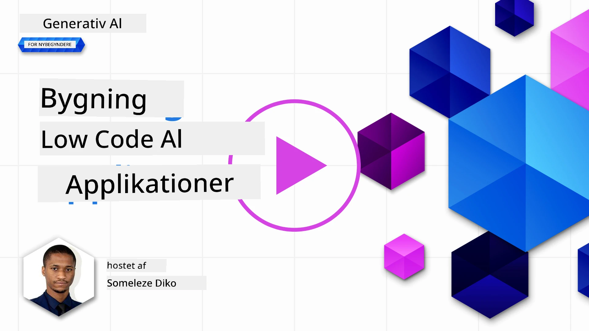](https://youtu.be/1vzq3Nd8GBA?si=h6LHWJXdmqf6mhDg)

> _(Klik på billedet ovenfor for at se videoen til denne lektion)_

## Introduktion

Nu hvor vi har lært at bygge billedgenererende applikationer, lad os tale om lavkode. Generativ AI kan bruges til forskellige områder, herunder lavkode, men hvad er lavkode, og hvordan kan vi tilføje AI til det?

Det er blevet lettere for både traditionelle udviklere og ikke-udviklere at bygge apps og løsninger via brugen af lavkodeudviklingsplatforme. Lavkodeudviklingsplatforme gør det muligt at bygge apps og løsninger med lidt eller ingen kode. Dette opnås ved at tilbyde et visuelt udviklingsmiljø, hvor du kan trække og slippe komponenter for at bygge apps og løsninger. Dette gør, at du kan bygge apps og løsninger hurtigere og med færre ressourcer. I denne lektion dykker vi dybt ned i, hvordan man bruger lavkode, og hvordan man forbedrer lavkodeudvikling med AI ved hjælp af Power Platform.

Power Platform giver organisationer mulighed for at sætte deres teams i stand til at bygge deres egne løsninger gennem et intuitivt lavkode- eller nogkode-miljø. Dette miljø hjælper med at forenkle processen med at bygge løsninger. Med Power Platform kan løsninger bygges på dage eller uger i stedet for måneder eller år. Power Platform består af fem centrale produkter: Power Apps, Power Automate, Power BI, Power Pages og Copilot Studio.

Denne lektion dækker:

- Introduktion til generativ AI i Power Platform
- Introduktion til Copilot og hvordan man bruger det
- Brug af generativ AI til at bygge apps og flows i Power Platform
- Forståelse af AI-modeller i Power Platform med AI Builder
- Bygning af intelligente agenter med Microsoft Copilot Studio

## Læringsmål

Ved slutningen af denne lektion vil du kunne:

- Forstå, hvordan Copilot fungerer i Power Platform.

- Byg en Student Assignment Tracker-app for vores uddannelsesstart-up.

- Byg en Invoice Processing Flow, der bruger AI til at udtrække oplysninger fra fakturaer.

- Anvende bedste praksis, når du bruger Create Text med GPT AI-modellen.

- Forstå, hvad Microsoft Copilot Studio er, og hvordan man bygger intelligente agenter med det.

De værktøjer og teknologier, du vil bruge i denne lektion, er:

- **Power Apps**, for Student Assignment Tracker-appen, som tilbyder et lavkodeudviklingsmiljø til at bygge apps til at spore, administrere og interagere med data.

- **Dataverse**, til lagring af data for Student Assignment Tracker-appen, hvor Dataverse leverer en lavkode dataplatform til lagring af appens data.

- **Power Automate**, til Invoice Processing flowet, hvor du får et lavkodeudviklingsmiljø til at bygge workflows, der automatiserer fakturabehandlingsprocessen.

- **AI Builder**, til Invoice Processing AI-modellen, hvor du bruger forbyggede AI-modeller til at behandle fakturaerne for vores startup.

## Generativ AI i Power Platform

Forbedring af lavkodeudvikling og applikation med generativ AI er et nøgleområde for Power Platform. Målet er at sætte alle i stand til at bygge AI-drevne apps, sites, dashboards og automatisere processer med AI, _uden at kræve nogen data science-ekspertise_. Dette mål opnås ved at integrere generativ AI i lavkodeudviklingsoplevelsen i Power Platform i form af Copilot og AI Builder.

### Hvordan fungerer dette?

Copilot er en AI-assistent, som gør det muligt for dig at bygge Power Platform-løsninger ved at beskrive dine krav i en række samtaletrin ved brug af naturligt sprog. Du kan for eksempel instruere din AI-assistent om at angive, hvilke felter din app vil bruge, og den vil skabe både appen og den underliggende datamodel, eller du kan specificere, hvordan du opsætter et flow i Power Automate.

Du kan bruge Copilot-drevne funktionaliteter som en funktion i dine appskærme for at hjælpe brugere med at afdække indsigt gennem samtaleinteraktioner.

AI Builder er en lavkode AI-funktion tilgængelig i Power Platform, som gør det muligt for dig at bruge AI-modeller til at hjælpe dig med at automatisere processer og forudsige resultater. Med AI Builder kan du bringe AI til dine apps og flows, som forbinder til dine data i Dataverse eller i forskellige cloud-datakilder som SharePoint, OneDrive eller Azure.

Copilot er tilgængelig i alle Power Platform-produkter: Power Apps, Power Automate, Power BI, Power Pages og Copilot Studio (tidligere Power Virtual Agents). AI Builder er tilgængelig i Power Apps og Power Automate. I denne lektion vil vi fokusere på, hvordan man bruger Copilot og AI Builder i Power Apps og Power Automate til at bygge en løsning for vores uddannelsesstartup.

### Copilot i Power Apps

Som en del af Power Platform tilbyder Power Apps et lavkodeudviklingsmiljø til at bygge apps, der sporer, administrerer og interagerer med data. Det er en suite af appudviklingstjenester med en skalerbar dataplatform og evnen til at forbinde til cloudtjenester og lokale data. Power Apps tillader dig at bygge apps, som kører på browsere, tablets og telefoner, og kan deles med kollegaer. Power Apps gør det nemt for brugere at komme i gang med app-udvikling via en simpel brugerflade, så enhver forretningsbruger eller professionel udvikler kan bygge brugerdefinerede apps. App-udviklingsoplevelsen forbedres også med generativ AI gennem Copilot.

Copilot AI-assistentfunktionen i Power Apps tillader dig at beskrive, hvilken slags app du har brug for, og hvilken information du vil have, at din app skal spore, indsamle eller vise. Copilot genererer derefter en responsiv Canvas-app baseret på din beskrivelse. Du kan derefter tilpasse appen, så den passer til dine behov. AI Copilot genererer og foreslår også en Dataverse-tabel med de felter, du skal bruge for at lagre de data, du vil spore, samt noget eksempeldata. Vi vil se på, hvad Dataverse er, og hvordan du kan bruge det i Power Apps senere i denne lektion. Du kan derpå tilpasse tabellen efter dine behov ved hjælp af AI Copilot-assistentfunktionen gennem samtaletrin. Denne funktion er let tilgængelig fra Power Apps startskærm.

### Copilot i Power Automate

Som en del af Power Platform giver Power Automate brugere mulighed for at skabe automatiserede workflows mellem applikationer og tjenester. Det hjælper med at automatisere gentagne forretningsprocesser såsom kommunikation, dataindsamling og godkendelse af beslutninger. Dens enkle brugerflade tillader brugere med alle tekniske kompetenceniveauer (fra begyndere til erfarne udviklere) at automatisere arbejdsopgaver. Workflow-udviklingsoplevelsen forbedres også med generativ AI via Copilot.

Copilot AI-assistentfunktionen i Power Automate tillader dig at beskrive, hvilken slags flow du har brug for, og hvilke handlinger du ønsker, at dit flow skal udføre. Copilot genererer derefter et flow baseret på din beskrivelse. Du kan så tilpasse flowet, så det opfylder dine behov. AI Copilot genererer og foreslår også de handlinger, du skal udføre for at automatisere den ønskede opgave. Vi vil se på, hvad flows er, og hvordan du kan bruge dem i Power Automate senere i denne lektion. Du kan derefter tilpasse handlingerne, så de opfylder dine behov vha. AI Copilot-assistentfunktionen gennem samtaletrin. Denne funktion er let tilgængelig fra Power Automate startskærm.

## Byg intelligente agenter med Microsoft Copilot Studio

[Microsoft Copilot Studio](https://learn.microsoft.com/microsoft-copilot-studio/fundamentals-what-is-copilot-studio?WT.mc_id=academic-105485-koreyst) (tidligere Power Virtual Agents) er lavkode-medlemmet af Power Platform til at bygge **AI-agenter** — konversationelle copiloter, som kan besvare spørgsmål, udføre handlinger og automatisere opgaver på vegne af dine brugere. Ligesom resten af Power Platform bygger du disse agenter i en visuel oplevelse, der prioriterer naturligt sprog: du beskriver, hvad du vil have agenten til at gøre, og Copilot Studio hjælper med at skitsere dens instruktioner, viden og handlinger.

For vores uddannelsesstartup kunne du bygge en agent, som besvarer studerendes spørgsmål om kurser, tjekker opgavefrister og endda sender e-mail til en underviser — alt sammen uden at skrive kode.

Her er nogle af de nyeste funktioner, som gør Copilot Studio kraftfuld:

- **Generative svar fra din viden**. I stedet for selv at forfatte hver samtale kan du forbinde **videnskilder** — offentlige hjemmesider, SharePoint, OneDrive, Dataverse, uploadede filer eller virksomhedens data via connectors — og agenten genererer funderede svar ud fra dem.

- **Generativ orkestrering**. I stedet for at stole på stive udløserfraser bruger agenten AI til at forstå en forespørgsel og dynamisk beslutte, hvilke viden, emner og handlinger der skal kombineres for at opfylde den, inklusive kædning af flere trin sammen.

- **Handlinger og connectors**. Agenter kan *gøre* ting, ikke bare chatte. Du kan give en agent handlinger bakket op af 1.500+ forbyggede Power Platform connectors, Power Automate flows, brugerdefinerede REST API’er, prompts eller **Model Context Protocol (MCP)**-servere.

- **Autonome agenter**. Agenter er ikke begrænset til svar i et chatvindue. Du kan bygge **autonome agenter**, som udløses af begivenheder — som en ny e-mail, en ny post i Dataverse eller en filupload — og derefter handler i baggrunden for at fuldføre en opgave.

- **Multi-agent orkestrering**. Agenter kan kalde andre agenter. En Copilot Studio-agent kan overgive til, eller udvides af, andre agenter, inklusive agenter udgivet til Microsoft 365 Copilot og agenter bygget i Microsoft Foundry.

- **Modelvalg**. Udover de indbyggede modeller kan du bringe modeller fra Microsoft Foundrys modelkatalog for at tilpasse, hvordan din agent ræsonnerer og svarer.

- **Publicer overalt**. Når en agent er bygget, kan den publiceres til flere kanaler — Microsoft Teams, Microsoft 365 Copilot, en hjemmeside eller en brugerdefineret app og mere — med sikkerhed, autentificering og analyse håndteret gennem Power Platform administrationsoplevelse.

Du kan begynde at bygge din første agent på [copilotstudio.microsoft.com](https://copilotstudio.microsoft.com?WT.mc_id=academic-105485-koreyst) og lære mere i [Microsoft Copilot Studio dokumentationen](https://learn.microsoft.com/microsoft-copilot-studio/?WT.mc_id=academic-105485-koreyst).

## Opgave: Administrer studerendes opgaver og fakturaer for vores startup ved brug af Copilot

Vores startup tilbyder onlinekurser til studerende. Startuppet er vokset hurtigt og har nu svært ved at følge med efterspørgslen på kurserne. Startupet har ansat dig som Power Platform-udvikler for at hjælpe med at bygge en lavkodeløsning til administration af studerendes opgaver og fakturaer. Deres løsning skal kunne hjælpe med at spore og administrere studerendes opgaver via en app og automatisere fakturabehandlingsprocessen via et workflow. Du skal bruge generativ AI til at udvikle løsningen.

Når du starter med at bruge Copilot, kan du bruge [Power Platform Copilot Prompt Library](https://github.com/pnp/powerplatform-prompts?WT.mc_id=academic-109639-somelezediko) for at komme i gang med prompts. Dette bibliotek indeholder en liste af prompts, du kan bruge til at bygge apps og flows med Copilot. Du kan også bruge prompts i biblioteket til at få en idé om, hvordan du beskriver dine krav til Copilot.

### Byg en Student Assignment Tracker-app for vores startup

Underviserne på vores startup har haft svært ved at holde styr på de studerendes opgaver. De har brugt et regneark til at spore opgaverne, men det er blevet svært at administrere, efterhånden som antallet af studerende er steget. De har bedt dig om at bygge en app, som kan hjælpe dem med at spore og administrere de studerendes opgaver. Appen skal gøre det muligt at tilføje nye opgaver, se opgaver, opdatere opgaver og slette opgaver. Appen skal også gøre det muligt for undervisere og studerende at se, hvilke opgaver der er blevet bedømt, og hvilke der ikke er.

Du vil bygge appen ved hjælp af Copilot i Power Apps ved at følge nedenstående trin:

1. Gå til [Power Apps](https://make.powerapps.com?WT.mc_id=academic-105485-koreyst) startskærm.

1. Brug tekstområdet på startskærmen til at beskrive den app, du vil bygge. For eksempel, **_Jeg vil bygge en app til at spore og administrere studerendes opgaver_**. Klik på **Send**-knappen for at sende prompten til AI Copilot.

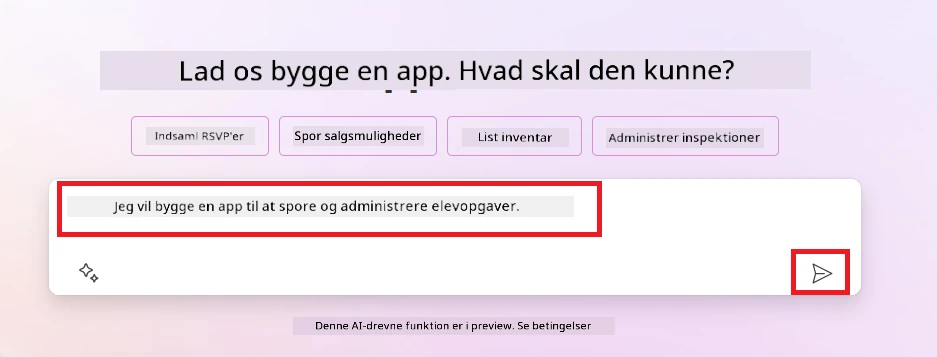

1. AI Copilot vil foreslå en Dataverse-tabel med felterne, du behøver for at gemme de data, du vil spore, samt noget eksempeldata. Du kan derefter tilpasse tabellen, så den passer til dine behov, ved hjælp af AI Copilot-assistentfunktionen gennem samtaletrin.

   > **Vigtigt**: Dataverse er den underliggende dataplatform for Power Platform. Det er en lavkode-dataplatform til lagring af appens data. Det er en fuldt administreret tjeneste, som sikkert lagrer data i Microsoft Cloud og er provisioneret inden for dit Power Platform-miljø. Den kommer med indbyggede datastyringsfunktioner, som dataklassifikation, datalog, finmasket adgangskontrol med mere. Du kan lære mere om Dataverse [her](https://docs.microsoft.com/powerapps/maker/data-platform/data-platform-intro?WT.mc_id=academic-109639-somelezediko).

   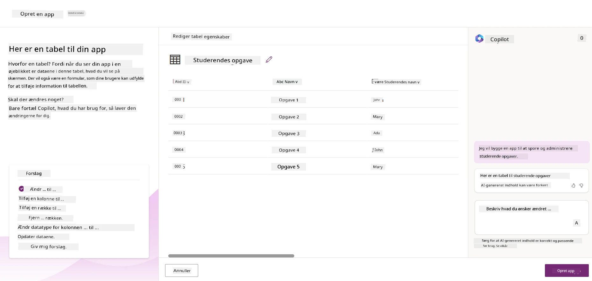

1. Underviserne ønsker at sende e-mails til de studerende, som har afleveret deres opgaver, for at holde dem opdaterede om deres opgavers status. Du kan bruge Copilot til at tilføje et nyt felt i tabellen til at gemme studerendes e-mail. For eksempel kan du bruge følgende prompt for at tilføje et nyt felt til tabellen: **_Jeg vil tilføje en kolonne til at gemme studerendes e-mail_**. Klik på **Send**-knappen for at sende prompten til AI Copilot.

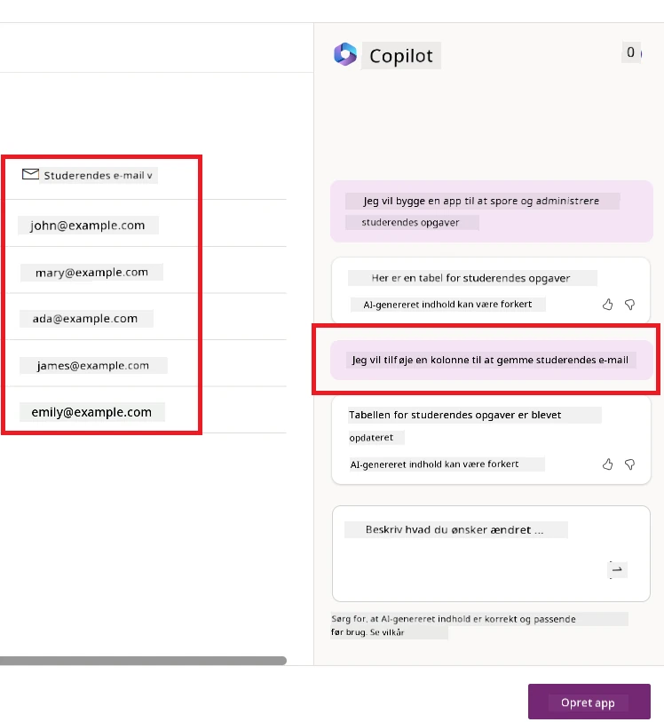

1. AI Copilot vil generere et nyt felt, som du derefter kan tilpasse, så det passer til dine behov.

1. Når du er færdig med tabellen, skal du klikke på knappen **Opret app** for at oprette appen.

1. AI Copilot vil generere en responsiv Canvas-app baseret på din beskrivelse. Du kan derefter tilpasse appen, så den passer til dine behov.

1. For undervisere, der skal sende e-mails til studerende, kan du bruge Copilot til at tilføje en ny skærm til appen. For eksempel kan du bruge følgende prompt til at tilføje en ny skærm til appen: **_Jeg vil tilføje en skærm til at sende emails til studerende_**. Klik på knappen **Send** for at sende prompten til AI Copilot.

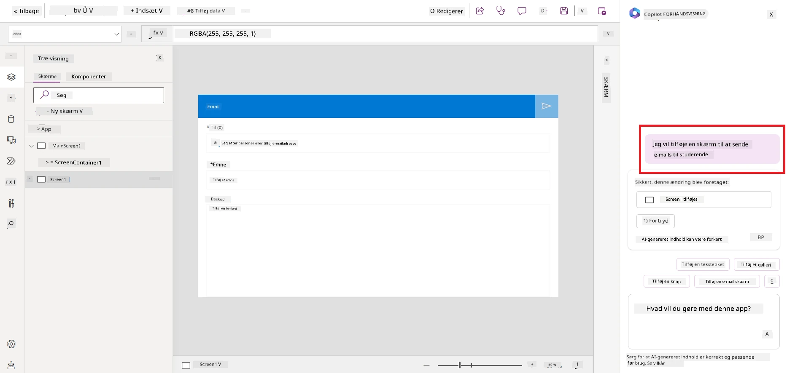

1. AI Copilot vil generere en ny skærm, og du kan derefter tilpasse skærmen, så den passer til dine behov.

1. Når du er færdig med appen, skal du klikke på knappen **Gem** for at gemme appen.

1. For at dele appen med underviserne skal du klikke på knappen **Del** og derefter klikke på knappen **Del** igen. Du kan derefter dele appen med underviserne ved at indtaste deres e-mailadresser.

> **Din opgave**: Appen, du lige har bygget, er en god start, men kan forbedres. Med e-mailfunktionen kan undervisere kun sende e-mails til studerende manuelt ved at skulle skrive deres e-mails. Kan du bruge Copilot til at bygge en automatisering, der gør det muligt for undervisere automatisk at sende e-mails til studerende, når de afleverer deres opgaver? Dit hint er, at med den rette prompt kan du bruge Copilot i Power Automate til at bygge dette.

### Byg en fakturainformationstabel til vores startup

Finansholdet i vores startup har haft problemer med at holde styr på fakturaer. De har brugt et regneark til at spore fakturaerne, men det er blevet svært at administrere, efterhånden som antallet af fakturaer er steget. De har bedt dig om at oprette en tabel, der hjælper dem med at lagre, spore og administrere oplysninger om de fakturaer, de har modtaget. Tabellen skal bruges til at bygge en automatisering, der udtrækker alle fakturainformationer og gemmer dem i tabellen. Tabellen skal også gøre det muligt for finansholdet at se fakturaer, der er betalt, og dem der ikke er betalt.

Power Platform har en underliggende dataplatform kaldet Dataverse, som giver dig mulighed for at gemme data til dine apps og løsninger. Dataverse tilbyder en lavkode-dataplatform til lagring af appens data. Det er en fuldt administreret service, der sikkert gemmer data i Microsoft Cloud og er provisioneret inden for dit Power Platform-miljø. Den kommer med indbyggede datastyringsfunktioner, såsom dataklassificering, datalinje, detaljeret adgangskontrol og mere. Du kan lære mere [om Dataverse her](https://docs.microsoft.com/powerapps/maker/data-platform/data-platform-intro?WT.mc_id=academic-109639-somelezediko).

Hvorfor skal vi bruge Dataverse til vores startup? Standard- og brugerdefinerede tabeller i Dataverse giver en sikker og cloud-baseret lagringsmulighed for dine data. Tabeller giver dig mulighed for at gemme forskellige typer data, ligesom du måske bruger flere regneark i en enkelt Excel-arbejdsbog. Du kan bruge tabeller til at gemme data, der er specifikke for din organisation eller forretningsbehov. Nogle af fordelene, vores startup vil få ved at bruge Dataverse, inkluderer, men er ikke begrænset til:

- **Let at administrere**: Både metadata og data gemmes i skyen, så du behøver ikke bekymre dig om detaljerne omkring, hvordan de gemmes eller administreres. Du kan fokusere på at bygge dine apps og løsninger.

- **Sikker**: Dataverse giver en sikker og cloud-baseret lagringsmulighed for dine data. Du kan kontrollere, hvem der har adgang til dataene i dine tabeller, og hvordan de kan få adgang ved hjælp af rollebaseret sikkerhed.

- **Rig metadata**: Datatyper og relationer bruges direkte i Power Apps

- **Logik og validering**: Du kan bruge forretningsregler, beregnede felter og valideringsregler til at håndhæve forretningslogik og opretholde datanøjagtighed.

Nu hvor du ved, hvad Dataverse er, og hvorfor du skal bruge det, lad os se på, hvordan du kan bruge Copilot til at oprette en tabel i Dataverse, der opfylder vores finansholds krav.

> **Bemærk**: Du vil bruge denne tabel i det næste afsnit til at bygge en automatisering, der udtrækker alle fakturainformationerne og gemmer dem i tabellen.

For at oprette en tabel i Dataverse ved hjælp af Copilot skal du følge nedenstående trin:

1. Naviger til [Power Apps](https://make.powerapps.com?WT.mc_id=academic-105485-koreyst) startskærm.

2. På venstre navigationsbjælke skal du vælge **Tabeller** og derefter klikke på **Beskriv den nye tabel**.

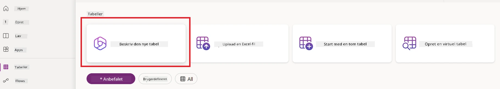

1. På skærmen **Beskriv den nye tabel** skal du bruge tekstfeltet til at beskrive den tabel, du ønsker at oprette. For eksempel, **_Jeg vil oprette en tabel til at gemme fakturainformation_**. Klik på knappen **Send** for at sende prompten til AI Copilot.

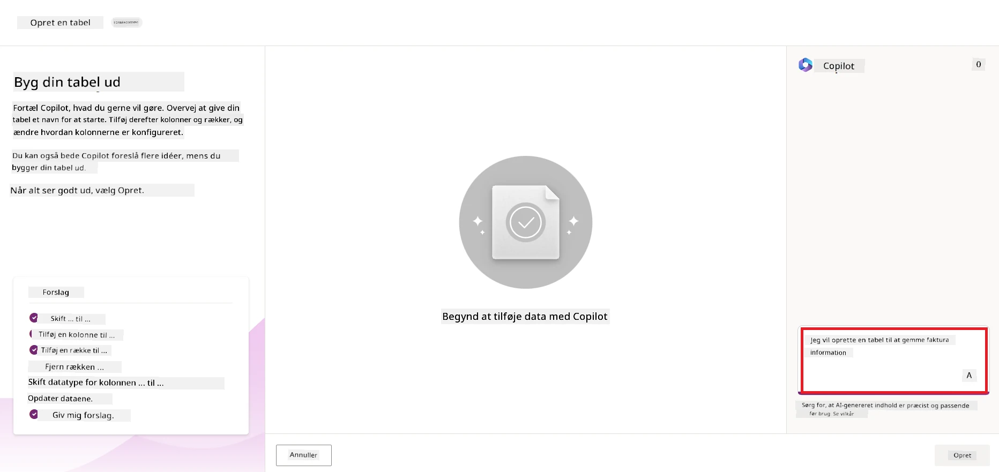

1. AI Copilot vil foreslå en Dataverse-tabel med de felter, du har brug for til at gemme de data, du vil spore, samt noget eksempeldata. Du kan derefter tilpasse tabellen til dine behov ved hjælp af AI Copilot-assistentfunktionen gennem samtaletrin.

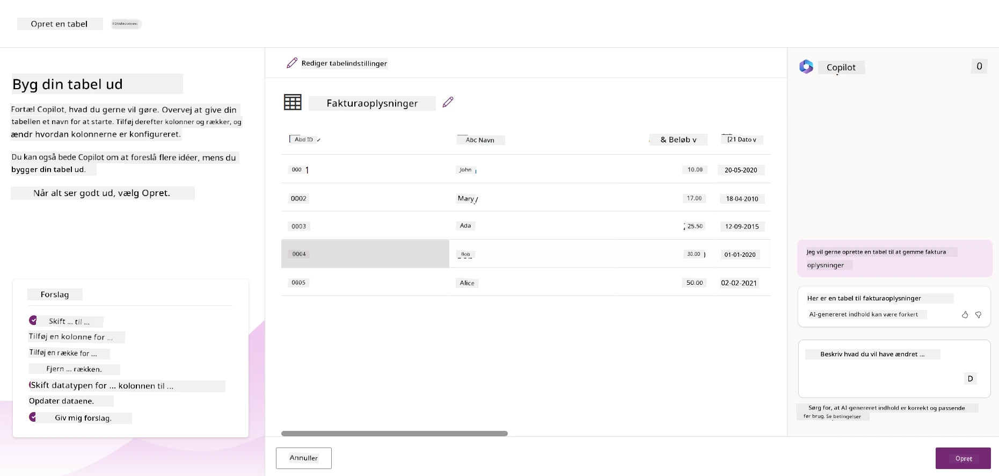

1. Finansholdet ønsker at sende en e-mail til leverandøren for at opdatere dem om den aktuelle status på deres faktura. Du kan bruge Copilot til at tilføje et nyt felt i tabellen til at gemme leverandørens e-mail. For eksempel kan du bruge følgende prompt til at tilføje et nyt felt til tabellen: **_Jeg vil tilføje en kolonne til at gemme leverandørens e-mail_**. Klik på knappen **Send** for at sende prompten til AI Copilot.

1. AI Copilot vil generere et nyt felt, og du kan derefter tilpasse feltet til dine behov.

1. Når du er færdig med tabellen, skal du klikke på knappen **Opret** for at oprette tabellen.

## AI-modeller i Power Platform med AI Builder

AI Builder er en lavkode-AI-funktion tilgængelig i Power Platform, som giver dig mulighed for at bruge AI-modeller til at hjælpe dig med at automatisere processer og forudsige resultater. Med AI Builder kan du bringe AI til dine apps og flows, der forbinder til dine data i Dataverse eller i forskellige clouddatakilder, såsom SharePoint, OneDrive eller Azure.

## Forbyggede AI-modeller vs brugerdefinerede AI-modeller

AI Builder tilbyder to typer AI-modeller: Forbyggede AI-modeller og Brugerdefinerede AI-modeller. Forbyggede AI-modeller er klar-til-brug AI-modeller, der er trænet af Microsoft og tilgængelige i Power Platform. Disse hjælper dig med at tilføje intelligens til dine apps og flows uden at skulle indsamle data og derefter bygge, træne og publicere dine egne modeller. Du kan bruge disse modeller til at automatisere processer og forudsige resultater.

Nogle af de forbyggede AI-modeller, der er tilgængelige i Power Platform inkluderer:

- **Nøglefraseudtrækning**: Denne model udtrækker nøglefraser fra tekst.
- **Sproggenkendelse**: Denne model genkender sproget i en tekst.
- **Følelsesanalyse**: Denne model registrerer positiv, negativ, neutral eller blandet stemning i tekst.
- **Visitkortlæser**: Denne model udtrækker oplysninger fra visitkort.
- **Tekstgenkendelse**: Denne model udtrækker tekst fra billeder.
- **Objektdetektion**: Denne model registrerer og udtrækker objekter fra billeder.
- **Dokumentbehandling**: Denne model udtrækker oplysninger fra formularer.
- **Fakturabehandling**: Denne model udtrækker oplysninger fra fakturaer.

Med brugerdefinerede AI-modeller kan du bringe din egen model ind i AI Builder, så den kan fungere som enhver anden brugerdefineret AI Builder-model, hvilket tillader dig at træne modellen med dine egne data. Du kan bruge disse modeller til at automatisere processer og forudsige resultater både i Power Apps og Power Automate. Når du bruger din egen model, gælder der nogle begrænsninger. Læs mere om disse [begrænsninger](https://learn.microsoft.com/ai-builder/byo-model#limitations?WT.mc_id=academic-105485-koreyst).

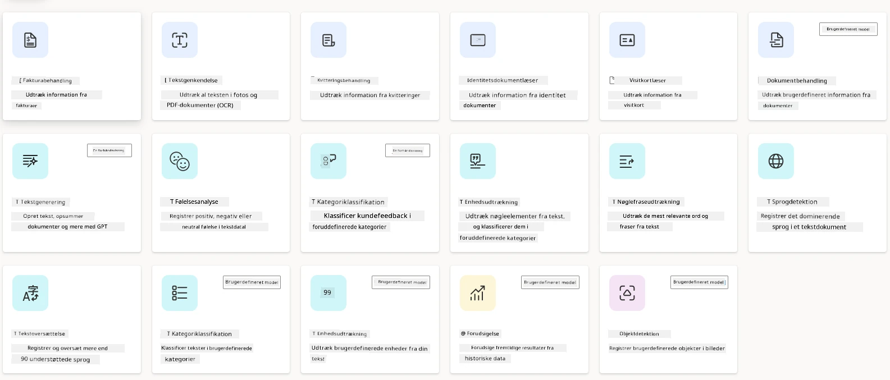

## Opgave #2 - Byg en fakturahåndteringsflow for vores startup

Finansholdet har haft problemer med at behandle fakturaer. De har brugt et regneark til at holde styr på fakturaerne, men det er blevet svært at administrere, efterhånden som antallet af fakturaer er steget. De har bedt dig om at bygge en arbejdsproces, der hjælper dem med at behandle fakturaer ved hjælp af AI. Arbejdsprocessen skal gøre det muligt for dem at udtrække oplysninger fra fakturaer og gemme oplysningerne i en Dataverse-tabel. Arbejdsprocessen skal også gøre det muligt for dem at sende en e-mail til finansholdet med de udtrukne oplysninger.

Nu hvor du ved, hvad AI Builder er, og hvorfor du skal bruge det, lad os se på, hvordan du kan bruge den fakturahåndterings AI-model i AI Builder, som vi dækkede tidligere, til at bygge en arbejdsproces, der hjælper finansholdet med at behandle fakturaer.

For at bygge en arbejdsproces, der hjælper finansholdet med at behandle fakturaer ved hjælp af fakturahåndterings AI-modellen i AI Builder, skal du følge nedenstående trin:

1. Naviger til [Power Automate](https://make.powerautomate.com?WT.mc_id=academic-105485-koreyst) startskærm.

2. Brug tekstfeltet på startskærmen til at beskrive den arbejdsproces, du vil bygge. For eksempel, **_Behandle en faktura, når den ankommer i min indbakke_**. Klik på knappen **Send** for at sende prompten til AI Copilot.

   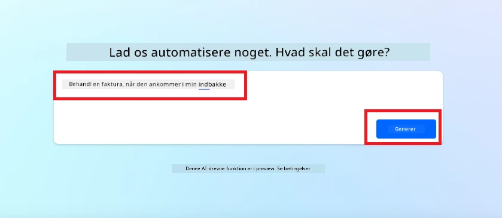

3. AI Copilot vil foreslå de handlinger, du skal udføre for at automatisere den ønskede opgave. Du kan klikke på knappen **Næste** for at gå gennem de næste trin.

4. På næste trin vil Power Automate bede dig om at opsætte de forbindelser, der kræves for flowet. Når du er færdig, skal du klikke på knappen **Opret flow** for at oprette flowet.

5. AI Copilot vil generere et flow, og du kan derefter tilpasse flowet, så det passer til dine behov.

6. Opdater triggeren for flowet og indstil **Mappe** til den mappe, hvor fakturaerne vil blive gemt. For eksempel kan du indstille mappen til **Indbakke**. Klik på **Vis avancerede indstillinger** og sæt **Kun med vedhæftninger** til **Ja**. Dette sikrer, at flowet kun kører, når en e-mail med en vedhæftning modtages i mappen.

7. Fjern følgende handlinger fra flowet: **HTML til tekst**, **Compose**, **Compose 2**, **Compose 3** og **Compose 4**, fordi du ikke vil bruge dem.

8. Fjern **Betingelse**-handlingen fra flowet, fordi du ikke vil bruge den. Det skal se ud som på følgende skærmbillede:

   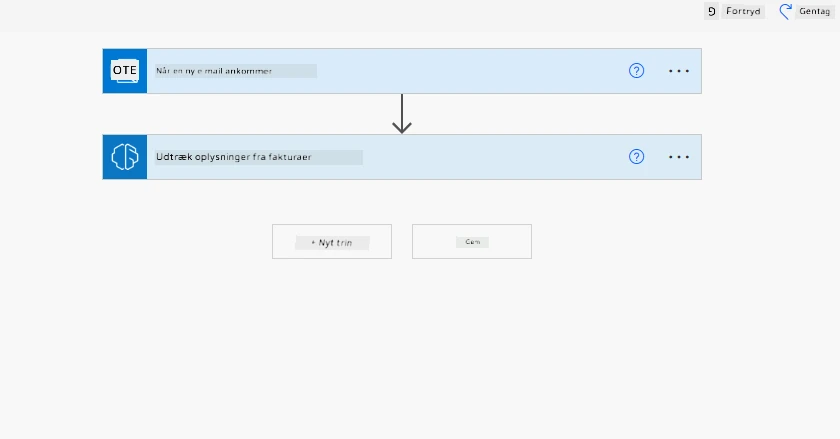

9. Klik på knappen **Tilføj en handling** og søg efter **Dataverse**. Vælg handlingen **Tilføj en ny række**.

10. På handlingen **Udtræk information fra fakturaer** skal du opdatere **Faktura-fil** til at pege på **Vedhæftningsindhold** fra e-mailen. Dette sikrer, at flowet udtrækker information fra fakturavedhæftningen.

11. Vælg den **Tabel**, du oprettede tidligere. For eksempel kan du vælge tabellen **Fakturaoplysninger**. Vælg det dynamiske indhold fra den foregående handling til at udfylde følgende felter:

    - ID
    - Beløb
    - Dato
    - Navn
    - Status - Sæt **Status** til **Afventer**.
    - Leverandørens e-mail - Brug det dynamiske indhold **Fra** fra triggeren **Når en ny e-mail ankommer**.

    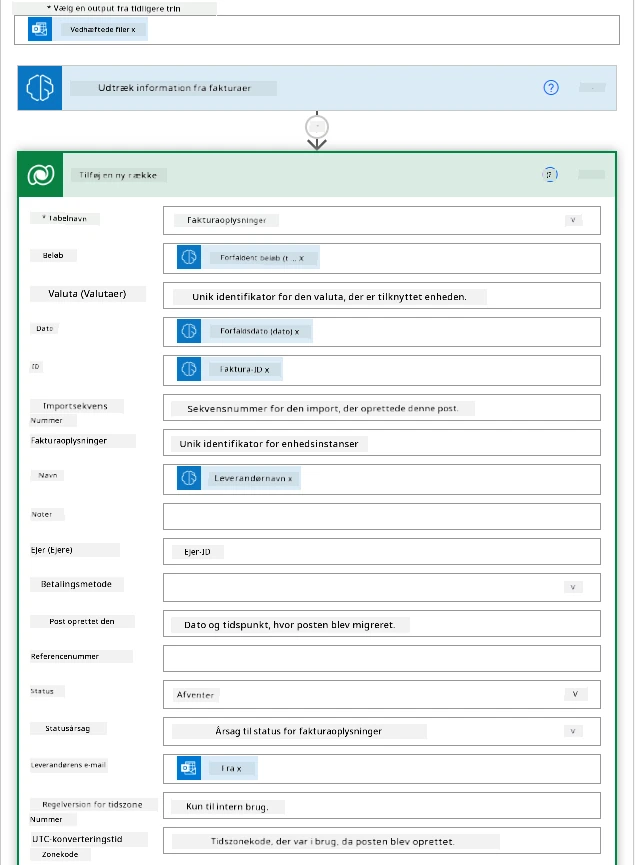

12. Når du er færdig med flowet, skal du klikke på knappen **Gem** for at gemme flowet. Du kan derefter teste flowet ved at sende en e-mail med en faktura til den mappe, du angav i triggeren.

> **Din opgave**: Flowet, du lige har bygget, er en god start, men nu skal du tænke på, hvordan du kan bygge en automatisering, der gør det muligt for vores finanshold at sende en e-mail til leverandøren for at opdatere dem om den aktuelle status på deres faktura. Dit hint: flowet skal køre, når status på fakturaen ændres.

## Brug en tekstgenererings-AI-model i Power Automate

Skab tekst med GPT AI-modellen i AI Builder giver dig mulighed for at generere tekst baseret på en prompt og drives af Microsoft Azure OpenAI Service. Med denne funktion kan du integrere GPT (Generative Pre-Trained Transformer)-teknologi i dine apps og flows til at bygge en række automatiserede flows og indsigtsfulde applikationer.

GPT-modeller gennemgår omfattende træning på enorme mængder data, hvilket gør dem i stand til at producere tekst, der ligner menneskesprog, når de får en prompt. Når de integreres med workflow-automatisering, kan AI-modeller som GPT bruges til at strømline og automatisere mange forskellige opgaver.

For eksempel kan du bygge flows til automatisk at generere tekst til forskellige brugstilfælde, såsom: kladder til e-mails, produktbeskrivelser og mere. Du kan også bruge modellen til at generere tekst til forskellige apps, såsom chatbots og kundeservice-apps, der gør det muligt for kundeserviceagenter effektivt og effektivt at besvare kundehenvendelser.

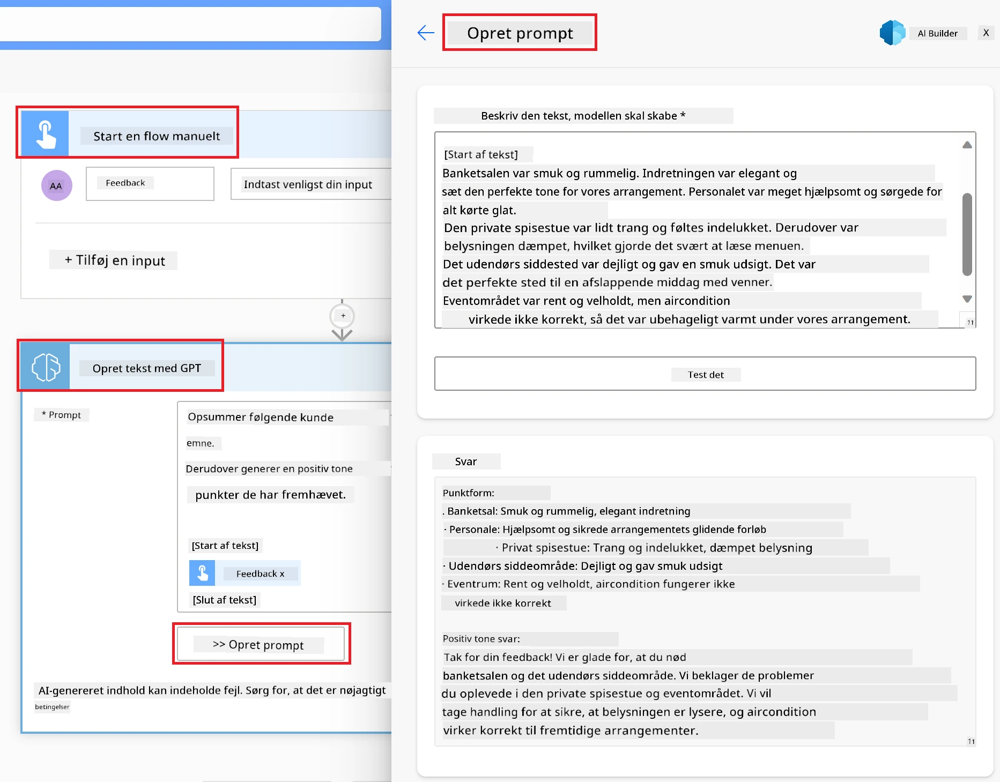

For at lære, hvordan du bruger denne AI-model i Power Automate, gennemgå [Tilføj intelligens med AI Builder og GPT](https://learn.microsoft.com/training/modules/ai-builder-text-generation/?WT.mc_id=academic-109639-somelezediko) modulet.

## Fremragende arbejde! Fortsæt din læring

Efter at have gennemført denne lektion, tjek vores [Generative AI læringssamling](https://aka.ms/genai-collection?WT.mc_id=academic-105485-koreyst) for at fortsætte med at styrke din viden om Generative AI!

Vil du tilpasse og få mere ud af Copilot? Udforsk [Awesome Copilot](https://github.com/github/awesome-copilot?WT.mc_id=academic-105485-koreyst) — en samling bidraget af fællesskabet med instruktioner, agenter, færdigheder og konfigurationer, som hjælper dig med at få mest muligt ud af GitHub Copilot.

Gå videre til Lektion 11, hvor vi ser på, hvordan man [integrerer Generative AI med Function Calling](../11-integrating-with-function-calling/README.md?WT.mc_id=academic-105485-koreyst)!

---

<!-- CO-OP TRANSLATOR DISCLAIMER START -->
**Ansvarsfraskrivelse**:
Dette dokument er blevet oversat ved hjælp af AI-oversættelsestjenesten [Co-op Translator](https://github.com/Azure/co-op-translator). Selvom vi bestræber os på nøjagtighed, skal du være opmærksom på, at automatiserede oversættelser kan indeholde fejl eller unøjagtigheder. Det originale dokument på dets oprindelige sprog bør betragtes som den autoritative kilde. For kritisk information anbefales professionel menneskelig oversættelse. Vi påtager os intet ansvar for misforståelser eller fejltolkninger, der opstår som følge af brugen af denne oversættelse.
<!-- CO-OP TRANSLATOR DISCLAIMER END -->