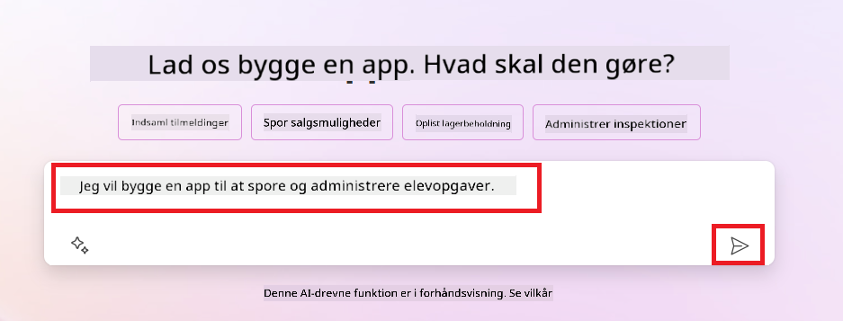
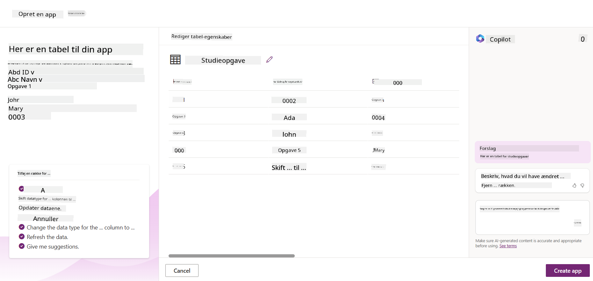
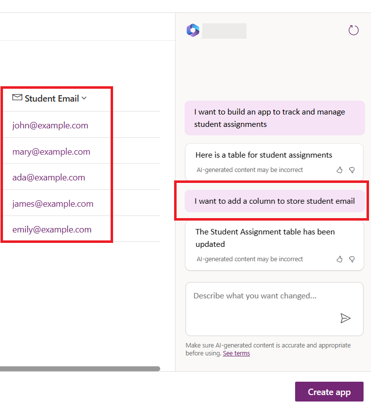
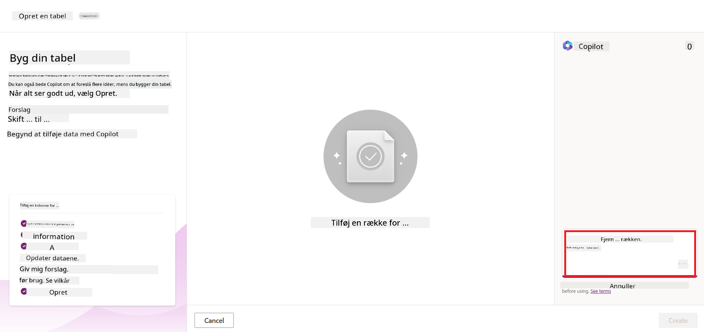

<!--
CO_OP_TRANSLATOR_METADATA:
{
  "original_hash": "f5ff3b6204a695a117d6f452403c95f7",
  "translation_date": "2025-07-09T14:02:15+00:00",
  "source_file": "10-building-low-code-ai-applications/README.md",
  "language_code": "da"
}
-->
# Bygning af Low Code AI-applikationer

> _(Klik på billedet ovenfor for at se videoen til denne lektion)_

## Introduktion

Nu hvor vi har lært at bygge applikationer, der genererer billeder, lad os tale om low code. Generativ AI kan bruges inden for mange forskellige områder, herunder low code, men hvad er low code, og hvordan kan vi tilføje AI til det?

At bygge apps og løsninger er blevet nemmere for både traditionelle udviklere og ikke-udviklere gennem brugen af Low Code Development Platforms. Low Code Development Platforms gør det muligt at bygge apps og løsninger med lidt eller ingen kode. Dette opnås ved at tilbyde et visuelt udviklingsmiljø, hvor du kan trække og slippe komponenter for at bygge apps og løsninger. Det gør det muligt at bygge apps og løsninger hurtigere og med færre ressourcer. I denne lektion dykker vi dybt ned i, hvordan man bruger Low Code, og hvordan man forbedrer low code-udvikling med AI ved hjælp af Power Platform.

Power Platform giver organisationer mulighed for at styrke deres teams til at bygge deres egne løsninger gennem et intuitivt low-code eller no-code miljø. Dette miljø hjælper med at forenkle processen med at bygge løsninger. Med Power Platform kan løsninger bygges på dage eller uger i stedet for måneder eller år. Power Platform består af fem nøgleprodukter: Power Apps, Power Automate, Power BI, Power Pages og Copilot Studio.

Denne lektion dækker:

- Introduktion til Generativ AI i Power Platform  
- Introduktion til Copilot og hvordan man bruger det  
- Brug af Generativ AI til at bygge apps og flows i Power Platform  
- Forståelse af AI-modeller i Power Platform med AI Builder  

## Læringsmål

Når du er færdig med denne lektion, vil du kunne:

- Forstå hvordan Copilot fungerer i Power Platform.

- Bygge en Student Assignment Tracker App til vores uddannelses-startup.

- Bygge et Invoice Processing Flow, der bruger AI til at udtrække information fra fakturaer.

- Anvende bedste praksis ved brug af Create Text med GPT AI Model.

De værktøjer og teknologier, du vil bruge i denne lektion, er:

- **Power Apps**, til Student Assignment Tracker appen, som tilbyder et low-code udviklingsmiljø til at bygge apps til at spore, administrere og interagere med data.

- **Dataverse**, til lagring af data for Student Assignment Tracker appen, hvor Dataverse vil levere en low-code dataplatform til at gemme appens data.

- **Power Automate**, til Invoice Processing flowet, hvor du får et low-code udviklingsmiljø til at bygge workflows, der automatiserer fakturabehandlingen.

- **AI Builder**, til Invoice Processing AI Model, hvor du bruger forbyggede AI-modeller til at behandle fakturaerne for vores startup.

## Generativ AI i Power Platform

At forbedre low-code udvikling og applikation med generativ AI er et centralt fokusområde for Power Platform. Målet er at gøre det muligt for alle at bygge AI-drevne apps, sites, dashboards og automatisere processer med AI, _uden at kræve nogen data science ekspertise_. Dette mål opnås ved at integrere generativ AI i low-code udviklingsoplevelsen i Power Platform i form af Copilot og AI Builder.

### Hvordan fungerer det?

Copilot er en AI-assistent, der gør det muligt for dig at bygge Power Platform-løsninger ved at beskrive dine krav i en række samtaletrin med naturligt sprog. Du kan for eksempel instruere din AI-assistent i at angive, hvilke felter din app skal bruge, og den vil skabe både appen og den underliggende datamodel, eller du kan specificere, hvordan et flow skal sættes op i Power Automate.

Du kan bruge Copilot-drevne funktioner som en feature i dine app-skærme for at give brugerne mulighed for at få indsigt gennem samtalebaserede interaktioner.

AI Builder er en low-code AI-funktion i Power Platform, der gør det muligt at bruge AI-modeller til at hjælpe med at automatisere processer og forudsige resultater. Med AI Builder kan du bringe AI til dine apps og flows, der forbinder til dine data i Dataverse eller i forskellige cloud-datakilder som SharePoint, OneDrive eller Azure.

Copilot er tilgængelig i alle Power Platform-produkter: Power Apps, Power Automate, Power BI, Power Pages og Power Virtual Agents. AI Builder er tilgængelig i Power Apps og Power Automate. I denne lektion fokuserer vi på, hvordan man bruger Copilot og AI Builder i Power Apps og Power Automate til at bygge en løsning til vores uddannelses-startup.

### Copilot i Power Apps

Som en del af Power Platform tilbyder Power Apps et low-code udviklingsmiljø til at bygge apps, der kan spore, administrere og interagere med data. Det er en samling af app-udviklingstjenester med en skalerbar dataplatform og mulighed for at forbinde til cloud-tjenester og lokale data. Power Apps gør det muligt at bygge apps, der kører på browsere, tablets og telefoner, og som kan deles med kolleger. Power Apps gør det nemt for brugere at komme i gang med app-udvikling via en simpel grænseflade, så både forretningsbrugere og professionelle udviklere kan bygge tilpassede apps. App-udviklingsoplevelsen forbedres også med Generativ AI gennem Copilot.

Copilot AI-assistentfunktionen i Power Apps gør det muligt for dig at beskrive, hvilken slags app du har brug for, og hvilken information din app skal spore, indsamle eller vise. Copilot genererer derefter en responsiv Canvas-app baseret på din beskrivelse. Du kan derefter tilpasse appen, så den passer til dine behov. AI Copilot genererer og foreslår også en Dataverse-tabel med de felter, du har brug for til at gemme de data, du vil spore, samt noget eksempeldata. Vi vil senere i denne lektion se nærmere på, hvad Dataverse er, og hvordan du kan bruge det i Power Apps. Du kan derefter tilpasse tabellen, så den passer til dine behov ved hjælp af AI Copilot-assistentfunktionen gennem samtaletrin. Denne funktion er let tilgængelig fra Power Apps startskærm.

### Copilot i Power Automate

Som en del af Power Platform giver Power Automate brugerne mulighed for at skabe automatiserede workflows mellem applikationer og tjenester. Det hjælper med at automatisere gentagne forretningsprocesser som kommunikation, dataindsamling og godkendelser. Dets enkle grænseflade gør det muligt for brugere på alle tekniske niveauer (fra begyndere til erfarne udviklere) at automatisere arbejdsopgaver. Workflow-udviklingsoplevelsen forbedres også med Generativ AI gennem Copilot.

Copilot AI-assistentfunktionen i Power Automate gør det muligt for dig at beskrive, hvilken slags flow du har brug for, og hvilke handlinger dit flow skal udføre. Copilot genererer derefter et flow baseret på din beskrivelse. Du kan derefter tilpasse flowet, så det passer til dine behov. AI Copilot genererer og foreslår også de handlinger, du skal bruge for at udføre den opgave, du ønsker at automatisere. Vi vil senere i denne lektion se nærmere på, hvad flows er, og hvordan du kan bruge dem i Power Automate. Du kan derefter tilpasse handlingerne, så de passer til dine behov ved hjælp af AI Copilot-assistentfunktionen gennem samtaletrin. Denne funktion er let tilgængelig fra Power Automate startskærm.

## Opgave: Håndter elevopgaver og fakturaer for vores startup ved hjælp af Copilot

Vores startup tilbyder onlinekurser til studerende. Startup’en er vokset hurtigt og har nu svært ved at følge med efterspørgslen på kurserne. Startup’en har ansat dig som Power Platform-udvikler for at hjælpe med at bygge en low code-løsning, der kan hjælpe med at håndtere elevopgaver og fakturaer. Deres løsning skal kunne hjælpe med at spore og administrere elevopgaver gennem en app og automatisere fakturabehandlingen gennem et workflow. Du er blevet bedt om at bruge Generativ AI til at udvikle løsningen.

Når du kommer i gang med at bruge Copilot, kan du bruge [Power Platform Copilot Prompt Library](https://github.com/pnp/powerplatform-prompts?WT.mc_id=academic-109639-somelezediko) til at komme i gang med prompts. Dette bibliotek indeholder en liste over prompts, som du kan bruge til at bygge apps og flows med Copilot. Du kan også bruge prompts i biblioteket til at få en idé om, hvordan du beskriver dine krav til Copilot.

### Byg en Student Assignment Tracker App til vores startup

Underviserne i vores startup har haft svært ved at holde styr på elevopgaver. De har brugt et regneark til at spore opgaverne, men det er blevet svært at administrere, efterhånden som antallet af studerende er steget. De har bedt dig om at bygge en app, der kan hjælpe dem med at spore og administrere elevopgaver. Appen skal gøre det muligt at tilføje nye opgaver, se opgaver, opdatere opgaver og slette opgaver. Appen skal også gøre det muligt for undervisere og studerende at se, hvilke opgaver der er blevet bedømt, og hvilke der ikke er.

Du bygger appen ved hjælp af Copilot i Power Apps efter nedenstående trin:

1. Gå til [Power Apps](https://make.powerapps.com?WT.mc_id=academic-105485-koreyst) startskærm.

1. Brug tekstfeltet på startskærmen til at beskrive den app, du vil bygge. For eksempel, **_Jeg vil bygge en app til at spore og administrere elevopgaver_**. Klik på **Send**-knappen for at sende prompten til AI Copilot.

1. AI Copilot vil foreslå en Dataverse-tabel med de felter, du har brug for til at gemme de data, du vil spore, samt noget eksempeldata. Du kan derefter tilpasse tabellen, så den passer til dine behov ved hjælp af AI Copilot-assistentfunktionen gennem samtaletrin.

   > **Vigtigt**: Dataverse er den underliggende dataplatform for Power Platform. Det er en low-code dataplatform til at gemme appens data. Det er en fuldt administreret tjeneste, der sikkert gemmer data i Microsoft Cloud og er provisioneret inden for dit Power Platform-miljø. Det har indbyggede datastyringsfunktioner som dataklassifikation, data lineage, detaljeret adgangskontrol og mere. Du kan lære mere om Dataverse [her](https://docs.microsoft.com/powerapps/maker/data-platform/data-platform-intro?WT.mc_id=academic-109639-somelezediko).

   

1. Underviserne ønsker at sende e-mails til de studerende, der har afleveret deres opgaver, for at holde dem opdateret om opgavernes status. Du kan bruge Copilot til at tilføje et nyt felt til tabellen til at gemme studerendes e-mail. For eksempel kan du bruge følgende prompt til at tilføje et nyt felt til tabellen: **_Jeg vil tilføje en kolonne til at gemme studerendes e-mail_**. Klik på **Send**-knappen for at sende prompten til AI Copilot.

1. AI Copilot vil generere et nyt felt, og du kan derefter tilpasse feltet, så det passer til dine behov.

1. Når du er færdig med tabellen, klik på **Create app**-knappen for at oprette appen.

1. AI Copilot vil generere en responsiv Canvas-app baseret på din beskrivelse. Du kan derefter tilpasse appen, så den passer til dine behov.

1. For at undervisere kan sende e-mails til studerende, kan du bruge Copilot til at tilføje en ny skærm til appen. For eksempel kan du bruge følgende prompt til at tilføje en ny skærm til appen: **_Jeg vil tilføje en skærm til at sende e-mails til studerende_**. Klik på **Send**-knappen for at sende prompten til AI Copilot.

1. AI Copilot vil generere en ny skærm, og du kan derefter tilpasse skærmen, så den passer til dine behov.

1. Når du er færdig med appen, klik på **Save**-knappen for at gemme appen.

1. For at dele appen med underviserne, klik på **Share**-knappen og derefter igen på **Share**. Du kan så dele appen med underviserne ved at indtaste deres e-mailadresser.

> **Din hjemmearbejde**: Den app, du lige har bygget, er et godt udgangspunkt, men kan forbedres. Med e-mail-funktionen kan underviserne kun sende e-mails manuelt ved at skulle indtaste e-mailadresser. Kan du bruge Copilot til at bygge en automatisering, der gør det muligt for underviserne automatisk at sende e-mails til studerende, når de afleverer deres opgaver? Dit hint er, at med den rette prompt kan du bruge Copilot i Power Automate til at bygge dette.

### Byg en fakturainformations-tabel til vores startup

Finansafdelingen i vores startup har haft svært ved at holde styr på fakturaer. De har brugt et regneark til at spore fakturaerne, men det er blevet svært at administrere, efterhånden som antallet af fakturaer er steget. De har bedt dig om at bygge en tabel, der kan hjælpe dem med at gemme, spore og administrere information om de modtagne fakturaer. Tabellen skal bruges til at bygge en automatisering, der udtrækker alle fakturainformationer og gemmer dem i tabellen. Tabellen skal også gøre det muligt for finansafdelingen at se, hvilke fakturaer der er betalt, og hvilke der ikke er.

Power Platform har en underliggende dataplatform kaldet Dataverse, som gør det muligt at gemme data til dine apps og løsninger. Dataverse tilbyder en low-code dataplatform til at gemme appens data. Det er en fuldt administreret tjeneste, der sikkert gemmer data i Microsoft Cloud og er provisioneret inden for dit Power Platform-miljø. Det har indbyggede datastyringsfunktioner som dataklassifikation, data lineage, detaljeret adgangskontrol og mere. Du kan lære mere [om Dataverse her](https://docs.microsoft.com/powerapps/maker/data-platform/data-platform-intro?WT.mc_id=academic-109639-somelezediko).

Hvorfor skal vi bruge Dataverse til vores startup? Standard- og brugerdefinerede tabeller i Dataverse giver en sikker og cloud-baseret lagringsmulighed for dine data. Tabeller lader dig gemme forskellige typer data, ligesom du måske bruger flere regneark i en enkelt Excel-projektmappe. Du kan bruge tabeller til at gemme data, der er specifikke for din organisation eller forretningsbehov. Nogle af fordelene, vores startup får ved at bruge Dataverse, inkluderer, men er ikke begrænset til:
- **Let at administrere**: Både metadata og data gemmes i skyen, så du behøver ikke bekymre dig om detaljerne omkring, hvordan de lagres eller administreres. Du kan fokusere på at bygge dine apps og løsninger.

- **Sikkert**: Dataverse tilbyder en sikker og skybaseret lagringsmulighed for dine data. Du kan styre, hvem der har adgang til dataene i dine tabeller, og hvordan de kan få adgang ved hjælp af rollebaseret sikkerhed.

- **Rige metadata**: Datatyper og relationer bruges direkte i Power Apps

- **Logik og validering**: Du kan bruge forretningsregler, beregnede felter og valideringsregler til at håndhæve forretningslogik og sikre datanøjagtighed.

Nu hvor du ved, hvad Dataverse er, og hvorfor du bør bruge det, lad os se på, hvordan du kan bruge Copilot til at oprette en tabel i Dataverse, der opfylder kravene fra vores økonomiteam.

> **Note** : Du vil bruge denne tabel i næste afsnit til at bygge en automatisering, der udtrækker alle fakturainformationer og gemmer dem i tabellen.

For at oprette en tabel i Dataverse ved hjælp af Copilot, følg trinene nedenfor:

1. Gå til [Power Apps](https://make.powerapps.com?WT.mc_id=academic-105485-koreyst) startskærm.

2. På venstre navigationsbjælke vælg **Tables** og klik derefter på **Describe the new Table**.

3. På skærmen **Describe the new Table** brug tekstfeltet til at beskrive den tabel, du ønsker at oprette. For eksempel, **_I want to create a table to store invoice information_**. Klik på **Send** knappen for at sende prompten til AI Copilot.

4. AI Copilot vil foreslå en Dataverse-tabel med de felter, du har brug for til at gemme de data, du vil spore, samt nogle eksempler på data. Du kan derefter tilpasse tabellen, så den passer til dine behov ved hjælp af AI Copilot-assistentfunktionen gennem samtaletrin.

5. Økonomiteamet ønsker at sende en e-mail til leverandøren for at opdatere dem om den aktuelle status på deres faktura. Du kan bruge Copilot til at tilføje et nyt felt til tabellen til at gemme leverandørens e-mail. For eksempel kan du bruge følgende prompt til at tilføje et nyt felt til tabellen: **_I want to add a column to store supplier email_**. Klik på **Send** knappen for at sende prompten til AI Copilot.

6. AI Copilot vil generere et nyt felt, og du kan derefter tilpasse feltet, så det passer til dine behov.

7. Når du er færdig med tabellen, klik på **Create** knappen for at oprette tabellen.

## AI Models in Power Platform with AI Builder

AI Builder er en low-code AI-funktion i Power Platform, der gør det muligt for dig at bruge AI Models til at automatisere processer og forudsige resultater. Med AI Builder kan du bringe AI ind i dine apps og flows, som forbinder til dine data i Dataverse eller i forskellige skybaserede datakilder som SharePoint, OneDrive eller Azure.

## Prebuilt AI Models vs Custom AI Models

AI Builder tilbyder to typer AI Models: Prebuilt AI Models og Custom AI Models. Prebuilt AI Models er færdigtrænede AI-modeller, som Microsoft har udviklet og gjort tilgængelige i Power Platform. Disse hjælper dig med at tilføje intelligens til dine apps og flows uden at skulle indsamle data og derefter bygge, træne og publicere dine egne modeller. Du kan bruge disse modeller til at automatisere processer og forudsige resultater.

Nogle af de Prebuilt AI Models, der er tilgængelige i Power Platform, inkluderer:

- **Key Phrase Extraction**: Denne model udtrækker nøglefraser fra tekst.
- **Language Detection**: Denne model registrerer sproget i en tekst.
- **Sentiment Analysis**: Denne model registrerer positiv, negativ, neutral eller blandet stemning i tekst.
- **Business Card Reader**: Denne model udtrækker information fra visitkort.
- **Text Recognition**: Denne model udtrækker tekst fra billeder.
- **Object Detection**: Denne model registrerer og udtrækker objekter fra billeder.
- **Document processing**: Denne model udtrækker information fra formularer.
- **Invoice Processing**: Denne model udtrækker information fra fakturaer.

Med Custom AI Models kan du bringe din egen model ind i AI Builder, så den kan fungere som enhver anden AI Builder custom model, hvilket giver dig mulighed for at træne modellen med dine egne data. Du kan bruge disse modeller til at automatisere processer og forudsige resultater i både Power Apps og Power Automate. Når du bruger din egen model, gælder der visse begrænsninger. Læs mere om disse [begrænsninger](https://learn.microsoft.com/ai-builder/byo-model#limitations?WT.mc_id=academic-105485-koreyst).

## Assignment #2 - Build an Invoice Processing Flow for Our Startup

Økonomiteamet har haft svært ved at behandle fakturaer. De har brugt et regneark til at holde styr på fakturaerne, men det er blevet svært at administrere, efterhånden som antallet af fakturaer er steget. De har bedt dig om at bygge en workflow, der kan hjælpe dem med at behandle fakturaer ved hjælp af AI. Workflowet skal gøre det muligt for dem at udtrække information fra fakturaer og gemme informationen i en Dataverse-tabel. Workflowet skal også gøre det muligt for dem at sende en e-mail til økonomiteamet med den udtrukne information.

Nu hvor du ved, hvad AI Builder er, og hvorfor du bør bruge det, lad os se på, hvordan du kan bruge Invoice Processing AI Model i AI Builder, som vi tidligere har gennemgået, til at bygge en workflow, der hjælper økonomiteamet med at behandle fakturaer.

For at bygge en workflow, der hjælper økonomiteamet med at behandle fakturaer ved hjælp af Invoice Processing AI Model i AI Builder, følg trinene nedenfor:

1. Gå til [Power Automate](https://make.powerautomate.com?WT.mc_id=academic-105485-koreyst) startskærm.

2. Brug tekstfeltet på startskærmen til at beskrive den workflow, du ønsker at bygge. For eksempel, **_Process an invoice when it arrives in my mailbox_**. Klik på **Send** knappen for at sende prompten til AI Copilot.

   

3. AI Copilot vil foreslå de handlinger, du skal udføre for at automatisere den ønskede opgave. Du kan klikke på **Next** knappen for at gå videre til næste trin.

4. I næste trin vil Power Automate bede dig om at opsætte de nødvendige forbindelser til flowet. Når du er færdig, klik på **Create flow** knappen for at oprette flowet.

5. AI Copilot vil generere et flow, og du kan derefter tilpasse flowet, så det passer til dine behov.

6. Opdater triggeren for flowet og sæt **Folder** til den mappe, hvor fakturaerne vil blive gemt. For eksempel kan du sætte mappen til **Inbox**. Klik på **Show advanced options** og sæt **Only with Attachments** til **Yes**. Dette sikrer, at flowet kun kører, når en e-mail med en vedhæftning modtages i mappen.

7. Fjern følgende handlinger fra flowet: **HTML to text**, **Compose**, **Compose 2**, **Compose 3** og **Compose 4**, da du ikke vil bruge dem.

8. Fjern **Condition** handlingen fra flowet, da du ikke vil bruge den. Det skal se ud som på følgende screenshot:

   

9. Klik på **Add an action** knappen og søg efter **Dataverse**. Vælg handlingen **Add a new row**.

10. På handlingen **Extract Information from invoices**, opdater **Invoice File** til at pege på **Attachment Content** fra e-mailen. Dette sikrer, at flowet udtrækker information fra fakturaens vedhæftning.

11. Vælg den **Table**, du oprettede tidligere. For eksempel kan du vælge tabellen **Invoice Information**. Vælg det dynamiske indhold fra den forrige handling til at udfylde følgende felter:

    - ID
    - Amount
    - Date
    - Name
    - Status - Sæt **Status** til **Pending**.
    - Supplier Email - Brug det dynamiske indhold **From** fra triggeren **When a new email arrives**.

    

12. Når du er færdig med flowet, klik på **Save** knappen for at gemme flowet. Du kan derefter teste flowet ved at sende en e-mail med en faktura til den mappe, du har angivet i triggeren.

> **Din lektie**: Det flow, du lige har bygget, er et godt udgangspunkt. Nu skal du tænke over, hvordan du kan bygge en automatisering, der gør det muligt for vores økonomiteam at sende en e-mail til leverandøren for at opdatere dem om den aktuelle status på deres faktura. Dit hint: flowet skal køre, når status på fakturaen ændres.

## Use a Text Generation AI Model in Power Automate

Create Text with GPT AI Model i AI Builder gør det muligt for dig at generere tekst baseret på en prompt og drives af Microsoft Azure OpenAI Service. Med denne funktion kan du integrere GPT (Generative Pre-Trained Transformer) teknologi i dine apps og flows for at bygge en række automatiserede flows og indsigtsskabende applikationer.

GPT-modeller gennemgår omfattende træning på store mængder data, hvilket gør dem i stand til at producere tekst, der ligner menneskelig sprogbrug, når de får en prompt. Når de integreres med workflow-automatisering, kan AI-modeller som GPT bruges til at effektivisere og automatisere mange forskellige opgaver.

For eksempel kan du bygge flows, der automatisk genererer tekst til forskellige formål, såsom udkast til e-mails, produktbeskrivelser og mere. Du kan også bruge modellen til at generere tekst til forskellige apps, såsom chatbots og kundeserviceapps, der hjælper kundeservicemedarbejdere med at svare effektivt og hurtigt på kundehenvendelser.

For at lære, hvordan du bruger denne AI Model i Power Automate, gennemgå modulet [Add intelligence with AI Builder and GPT](https://learn.microsoft.com/training/modules/ai-builder-text-generation/?WT.mc_id=academic-109639-somelezediko).

## Great Work! Continue Your Learning

Efter at have gennemført denne lektion, tjek vores [Generative AI Learning collection](https://aka.ms/genai-collection?WT.mc_id=academic-105485-koreyst) for at fortsætte med at udvikle din viden om Generative AI!

Gå videre til Lektion 11, hvor vi ser på, hvordan man [integrerer Generative AI med Function Calling](../11-integrating-with-function-calling/README.md?WT.mc_id=academic-105485-koreyst)!

**Ansvarsfraskrivelse**:  
Dette dokument er blevet oversat ved hjælp af AI-oversættelsestjenesten [Co-op Translator](https://github.com/Azure/co-op-translator). Selvom vi bestræber os på nøjagtighed, bedes du være opmærksom på, at automatiserede oversættelser kan indeholde fejl eller unøjagtigheder. Det oprindelige dokument på dets oprindelige sprog bør betragtes som den autoritative kilde. For kritisk information anbefales professionel menneskelig oversættelse. Vi påtager os intet ansvar for misforståelser eller fejltolkninger, der opstår som følge af brugen af denne oversættelse.