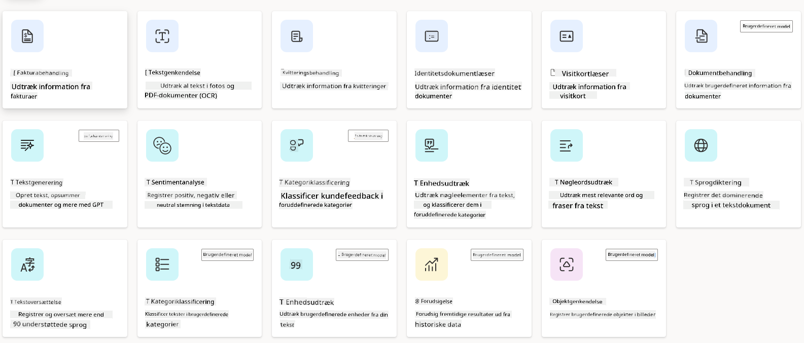
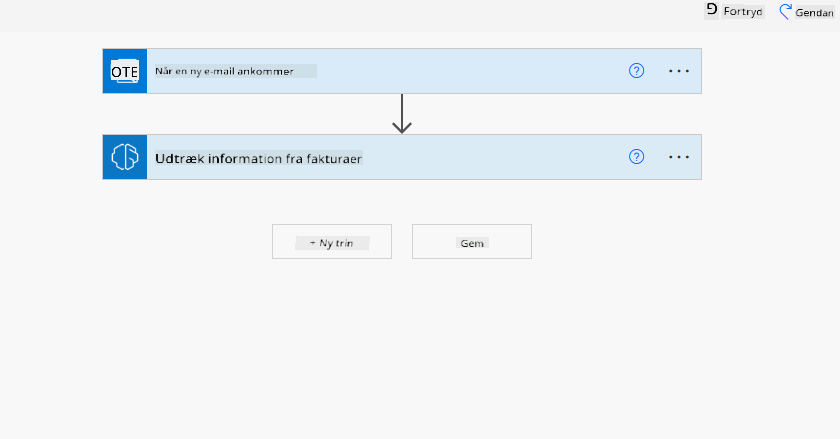
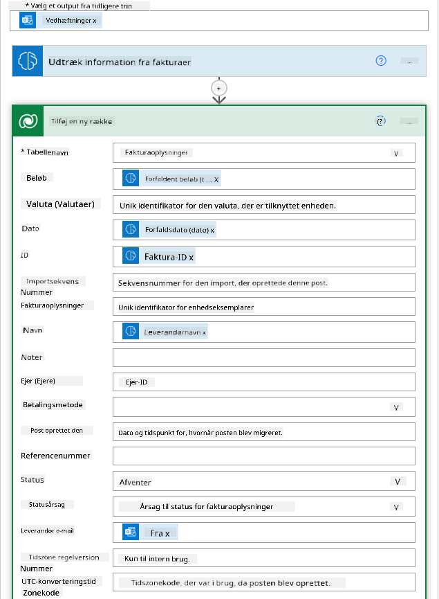
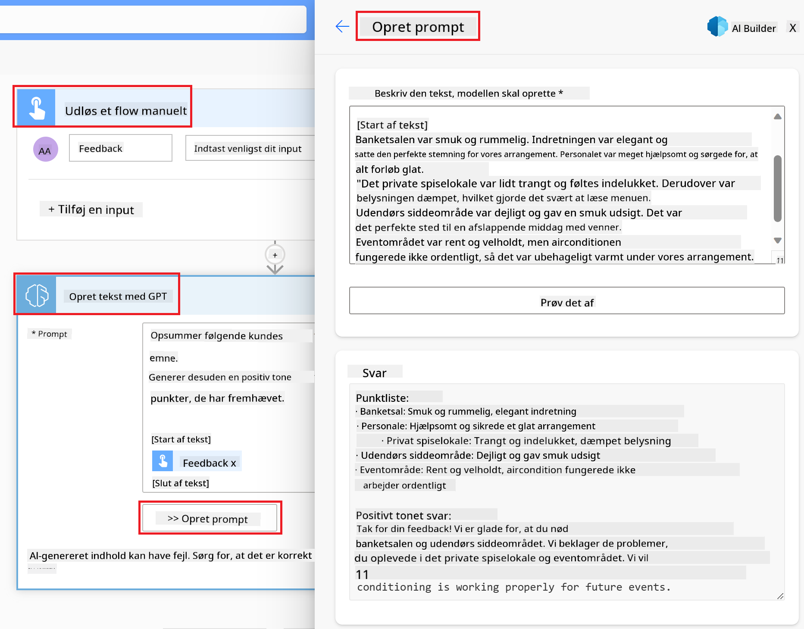

<!--
CO_OP_TRANSLATOR_METADATA:
{
  "original_hash": "846ac8e3b7dcfb697d3309fec05f0fea",
  "translation_date": "2025-10-17T19:11:56+00:00",
  "source_file": "10-building-low-code-ai-applications/README.md",
  "language_code": "da"
}
-->
# Bygning af lavkode AI-applikationer

> _(Klik på billedet ovenfor for at se videoen til denne lektion)_

## Introduktion

Nu hvor vi har lært at bygge applikationer til billedgenerering, lad os tale om lavkode. Generativ AI kan bruges til mange forskellige områder, herunder lavkode, men hvad er lavkode, og hvordan kan vi tilføje AI til det?

At bygge apps og løsninger er blevet lettere for både traditionelle udviklere og ikke-udviklere gennem brugen af lavkode udviklingsplatforme. Lavkode udviklingsplatforme gør det muligt at bygge apps og løsninger med meget lidt eller ingen kode. Dette opnås ved at tilbyde et visuelt udviklingsmiljø, hvor du kan trække og slippe komponenter for at bygge apps og løsninger. Dette gør det muligt at bygge apps og løsninger hurtigere og med færre ressourcer. I denne lektion dykker vi dybt ned i, hvordan man bruger lavkode og hvordan man forbedrer lavkode udvikling med AI ved hjælp af Power Platform.

Power Platform giver organisationer mulighed for at styrke deres teams til at bygge deres egne løsninger gennem et intuitivt lavkode- eller ingen kode-miljø. Dette miljø hjælper med at forenkle processen med at bygge løsninger. Med Power Platform kan løsninger bygges på dage eller uger i stedet for måneder eller år. Power Platform består af fem nøgleprodukter: Power Apps, Power Automate, Power BI, Power Pages og Copilot Studio.

Denne lektion dækker:

- Introduktion til generativ AI i Power Platform
- Introduktion til Copilot og hvordan man bruger det
- Brug af generativ AI til at bygge apps og flows i Power Platform
- Forståelse af AI-modeller i Power Platform med AI Builder

## Læringsmål

Ved afslutningen af denne lektion vil du kunne:

- Forstå, hvordan Copilot fungerer i Power Platform.

- Bygge en app til sporing af elevopgaver for vores uddannelsesstartup.

- Bygge et fakturabehandlingsflow, der bruger AI til at udtrække information fra fakturaer.

- Anvende bedste praksis ved brug af "Create Text with GPT AI Model".

De værktøjer og teknologier, du vil bruge i denne lektion, er:

- **Power Apps**, til appen til sporing af elevopgaver, som giver et lavkode udviklingsmiljø til at bygge apps til at spore, administrere og interagere med data.

- **Dataverse**, til at gemme dataene for appen til sporing af elevopgaver, hvor Dataverse vil give en lavkode dataplatform til at gemme appens data.

- **Power Automate**, til fakturabehandlingsflowet, hvor du vil have et lavkode udviklingsmiljø til at bygge workflows til at automatisere fakturabehandlingsprocessen.

- **AI Builder**, til fakturabehandlings AI-modellen, hvor du vil bruge forudbyggede AI-modeller til at behandle fakturaer for vores startup.

## Generativ AI i Power Platform

At forbedre lavkode udvikling og applikationer med generativ AI er et centralt fokusområde for Power Platform. Målet er at gøre det muligt for alle at bygge AI-drevne apps, hjemmesider, dashboards og automatisere processer med AI, _uden at kræve ekspertise inden for datavidenskab_. Dette mål opnås ved at integrere generativ AI i lavkode udviklingsoplevelsen i Power Platform i form af Copilot og AI Builder.

### Hvordan fungerer det?

Copilot er en AI-assistent, der gør det muligt at bygge Power Platform-løsninger ved at beskrive dine krav i en række samtaletrin ved hjælp af naturligt sprog. Du kan for eksempel instruere din AI-assistent i at angive, hvilke felter din app skal bruge, og den vil oprette både appen og den underliggende datamodel, eller du kan specificere, hvordan du vil opsætte et flow i Power Automate.

Du kan bruge Copilot-drevne funktioner som en feature i dine app-skærme for at give brugerne mulighed for at få indsigt gennem samtaleinteraktioner.

AI Builder er en lavkode AI-funktionalitet tilgængelig i Power Platform, der gør det muligt at bruge AI-modeller til at hjælpe dig med at automatisere processer og forudsige resultater. Med AI Builder kan du bringe AI til dine apps og flows, der er forbundet til dine data i Dataverse eller i forskellige cloud-datakilder, såsom SharePoint, OneDrive eller Azure.

Copilot er tilgængelig i alle Power Platform-produkter: Power Apps, Power Automate, Power BI, Power Pages og Power Virtual Agents. AI Builder er tilgængelig i Power Apps og Power Automate. I denne lektion vil vi fokusere på, hvordan man bruger Copilot og AI Builder i Power Apps og Power Automate til at bygge en løsning for vores uddannelsesstartup.

### Copilot i Power Apps

Som en del af Power Platform tilbyder Power Apps et lavkode udviklingsmiljø til at bygge apps til at spore, administrere og interagere med data. Det er en suite af appudviklingstjenester med en skalerbar dataplatform og evnen til at forbinde til cloud-tjenester og lokale data. Power Apps gør det muligt at bygge apps, der kører på browsere, tablets og telefoner, og som kan deles med kolleger. Power Apps gør det nemt for brugere at komme i gang med appudvikling med en enkel grænseflade, så enhver forretningsbruger eller professionel udvikler kan bygge skræddersyede apps. Appudviklingsoplevelsen forbedres også med generativ AI gennem Copilot.

Copilot AI-assistentfunktionen i Power Apps gør det muligt at beskrive, hvilken slags app du har brug for, og hvilken information du vil have, at din app skal spore, indsamle eller vise. Copilot genererer derefter en responsiv Canvas-app baseret på din beskrivelse. Du kan derefter tilpasse appen til dine behov. AI Copilot genererer og foreslår også en Dataverse-tabel med de felter, du har brug for til at gemme de data, du vil spore, samt nogle eksempler på data. Vi vil senere i denne lektion se på, hvad Dataverse er, og hvordan du kan bruge det i Power Apps. Du kan derefter tilpasse tabellen til dine behov ved hjælp af AI Copilot-assistentfunktionen gennem samtaletrin. Denne funktion er let tilgængelig fra Power Apps' startskærm.

### Copilot i Power Automate

Som en del af Power Platform giver Power Automate brugerne mulighed for at oprette automatiserede workflows mellem applikationer og tjenester. Det hjælper med at automatisere gentagne forretningsprocesser såsom kommunikation, dataindsamling og godkendelse af beslutninger. Den enkle grænseflade gør det muligt for brugere med enhver teknisk kompetence (fra begyndere til erfarne udviklere) at automatisere arbejdsgange. Workflow-udviklingsoplevelsen forbedres også med generativ AI gennem Copilot.

Copilot AI-assistentfunktionen i Power Automate gør det muligt at beskrive, hvilken slags flow du har brug for, og hvilke handlinger du vil have, at dit flow skal udføre. Copilot genererer derefter et flow baseret på din beskrivelse. Du kan derefter tilpasse flowet til dine behov. AI Copilot genererer og foreslår også de handlinger, du har brug for til at udføre den opgave, du vil automatisere. Vi vil senere i denne lektion se på, hvad flows er, og hvordan du kan bruge dem i Power Automate. Du kan derefter tilpasse handlingerne til dine behov ved hjælp af AI Copilot-assistentfunktionen gennem samtaletrin. Denne funktion er let tilgængelig fra Power Automates startskærm.

## Opgave: Administrer elevopgaver og fakturaer for vores startup ved hjælp af Copilot

Vores startup tilbyder onlinekurser til studerende. Startuppen er vokset hurtigt og har nu svært ved at følge med efterspørgslen på sine kurser. Startuppen har ansat dig som Power Platform-udvikler til at hjælpe dem med at bygge en lavkode-løsning til at hjælpe dem med at administrere deres elevopgaver og fakturaer. Deres løsning skal kunne hjælpe dem med at spore og administrere elevopgaver gennem en app og automatisere fakturabehandlingsprocessen gennem et workflow. Du er blevet bedt om at bruge generativ AI til at udvikle løsningen.

Når du begynder at bruge Copilot, kan du bruge [Power Platform Copilot Prompt Library](https://github.com/pnp/powerplatform-prompts?WT.mc_id=academic-109639-somelezediko) til at komme i gang med promptene. Dette bibliotek indeholder en liste over prompts, som du kan bruge til at bygge apps og flows med Copilot. Du kan også bruge promptene i biblioteket til at få en idé om, hvordan du beskriver dine krav til Copilot.

### Byg en app til sporing af elevopgaver for vores startup

Underviserne hos vores startup har haft svært ved at holde styr på elevopgaver. De har brugt et regneark til at spore opgaverne, men det er blevet svært at administrere, efterhånden som antallet af studerende er steget. De har bedt dig om at bygge en app, der vil hjælpe dem med at spore og administrere elevopgaver. Appen skal gøre det muligt for dem at tilføje nye opgaver, se opgaver, opdatere opgaver og slette opgaver. Appen skal også gøre det muligt for undervisere og studerende at se, hvilke opgaver der er blevet bedømt, og hvilke der ikke er blevet bedømt.

Du vil bygge appen ved hjælp af Copilot i Power Apps ved at følge nedenstående trin:

1. Gå til [Power Apps](https://make.powerapps.com?WT.mc_id=academic-105485-koreyst) startskærmen.

1. Brug tekstområdet på startskærmen til at beskrive den app, du vil bygge. For eksempel: **_Jeg vil bygge en app til at spore og administrere elevopgaver_**. Klik på **Send**-knappen for at sende prompten til AI Copilot.

1. AI Copilot vil foreslå en Dataverse-tabel med de felter, du har brug for til at gemme de data, du vil spore, samt nogle eksempler på data. Du kan derefter tilpasse tabellen til dine behov ved hjælp af AI Copilot-assistentfunktionen gennem samtaletrin.

   > **Vigtigt**: Dataverse er den underliggende dataplatform for Power Platform. Det er en lavkode dataplatform til at gemme appens data. Det er en fuldt administreret tjeneste, der sikkert gemmer data i Microsoft Cloud og er provisioneret inden for din Power Platform-miljø. Det kommer med indbyggede datastyringsfunktioner, såsom dataklassificering, dataafstamning, finmasket adgangskontrol og mere. Du kan lære mere om Dataverse [her](https://docs.microsoft.com/powerapps/maker/data-platform/data-platform-intro?WT.mc_id=academic-109639-somelezediko).

   

1. Undervisere ønsker at sende e-mails til de studerende, der har afleveret deres opgaver, for at holde dem opdateret om deres opgavers status. Du kan bruge Copilot til at tilføje et nyt felt til tabellen for at gemme elevens e-mail. For eksempel kan du bruge følgende prompt til at tilføje et nyt felt til tabellen: **_Jeg vil tilføje en kolonne til at gemme elevens e-mail_**. Klik på **Send**-knappen for at sende prompten til AI Copilot.

1. AI Copilot vil generere et nyt felt, og du kan derefter tilpasse feltet til dine behov.

1. Når du er færdig med tabellen, klik på **Opret app**-knappen for at oprette appen.

1. AI Copilot vil generere en responsiv Canvas-app baseret på din beskrivelse. Du kan derefter tilpasse appen til dine behov.

1. For at undervisere kan sende e-mails til studerende, kan du bruge Copilot til at tilføje en ny skærm til appen. For eksempel kan du bruge følgende prompt til at tilføje en ny skærm til appen: **_Jeg vil tilføje en skærm til at sende e-mails til studerende_**. Klik på **Send**-knappen for at sende prompten til AI Copilot.

1. AI Copilot vil generere en ny skærm, og du kan derefter tilpasse skærmen til dine behov.

1. Når du er færdig med appen, klik på **Gem**-knappen for at gemme appen.

1. For at dele appen med underviserne, klik på **Del**-knappen og derefter på **Del**-knappen igen. Du kan derefter dele appen med underviserne ved at indtaste deres e-mailadresser.

> **Din hjemmeopgave**: Den app, du lige har bygget, er et godt udgangspunkt, men kan forbedres. Med e-mail-funktionen kan undervisere kun sende e-mails til studerende manuelt ved at skulle indtaste deres e-mails. Kan du bruge Copilot til at bygge en automatisering, der gør det muligt for undervisere automatisk at sende e-mails til studerende, når de afleverer deres opgaver? Dit hint er, at med den rigtige prompt kan du bruge Copilot i Power Automate til at bygge dette.

### Byg en fakturainformationstabel for vores startup

Finansholdet i vores startup har haft svært ved at holde styr på fakturaer. De har brugt et regneark til at spore fakturaerne, men det er blevet svært at administrere, efterhånden som antallet af fakturaer er steget. De har bedt dig om at bygge en tabel, der vil hjælpe dem med at gemme, spore og administrere informationen om de fakturaer, de modtager. Tabellen skal bruges til at bygge en automatisering, der vil udtrække al fakturainformation og gemme den i tabellen. Tabellen skal også gøre det muligt for finansholdet at se, hvilke fakturaer der er blevet betalt, og hvilke der ikke er blevet betalt.

Power Platform har en underliggende dataplatform kaldet Dataverse, der gør det muligt at gemme dataene for dine apps og løsninger. Dataverse giver en lavkode dataplatform til at gemme appens data. Det er en fuldt administreret tjeneste, der sikkert gemmer data i Microsoft Cloud og er provisioneret inden for dit Power Platform-miljø. Det kommer med indbyggede datastyringsfunktioner, såsom dataklassificering, dataafstamning, finmasket adgangskontrol og mere. Du kan lære mere [om Dataverse her](https://docs.microsoft.com/powerapps/maker/data-platform/data-platform-intro?WT.mc_id=academic-109639-somelezediko).
Hvorfor skal vi bruge Dataverse til vores startup? Standard- og brugerdefinerede tabeller i Dataverse giver en sikker og cloud-baseret lagringsmulighed for dine data. Tabeller giver dig mulighed for at gemme forskellige typer data, ligesom du måske bruger flere regneark i en enkelt Excel-arbejdsbog. Du kan bruge tabeller til at gemme data, der er specifikke for din organisation eller forretningsbehov. Nogle af fordelene, som vores startup kan få ved at bruge Dataverse, inkluderer, men er ikke begrænset til:

- **Let at administrere**: Både metadata og data gemmes i skyen, så du behøver ikke bekymre dig om detaljerne i, hvordan de lagres eller administreres. Du kan fokusere på at bygge dine apps og løsninger.

- **Sikkert**: Dataverse giver en sikker og cloud-baseret lagringsmulighed for dine data. Du kan kontrollere, hvem der har adgang til dataene i dine tabeller, og hvordan de kan få adgang til dem ved hjælp af rollebaseret sikkerhed.

- **Rig metadata**: Datatyper og relationer bruges direkte i Power Apps.

- **Logik og validering**: Du kan bruge forretningsregler, beregnede felter og valideringsregler til at håndhæve forretningslogik og opretholde datanøjagtighed.

Nu hvor du ved, hvad Dataverse er, og hvorfor du bør bruge det, lad os se på, hvordan du kan bruge Copilot til at oprette en tabel i Dataverse, der opfylder kravene fra vores økonomiafdeling.

> **Note**: Du vil bruge denne tabel i næste afsnit til at bygge en automatisering, der vil udtrække alle fakturainformationer og gemme dem i tabellen.

For at oprette en tabel i Dataverse ved hjælp af Copilot, følg nedenstående trin:

1. Naviger til [Power Apps](https://make.powerapps.com?WT.mc_id=academic-105485-koreyst) startskærmen.

2. På venstre navigationsbjælke skal du vælge **Tabeller** og derefter klikke på **Beskriv den nye tabel**.

3. På skærmen **Beskriv den nye tabel** skal du bruge tekstområdet til at beskrive den tabel, du vil oprette. For eksempel **_Jeg vil oprette en tabel til at gemme fakturainformation_**. Klik på knappen **Send** for at sende prompten til AI Copilot.

4. AI Copilot vil foreslå en Dataverse-tabel med de felter, du har brug for, til at gemme de data, du ønsker at spore, samt nogle eksempler på data. Du kan derefter tilpasse tabellen, så den passer til dine behov ved hjælp af AI Copilot-assistentfunktionen gennem samtaletrin.

5. Økonomiafdelingen ønsker at sende en e-mail til leverandøren for at opdatere dem om den aktuelle status for deres faktura. Du kan bruge Copilot til at tilføje et nyt felt til tabellen for at gemme leverandørens e-mail. For eksempel kan du bruge følgende prompt til at tilføje et nyt felt til tabellen: **_Jeg vil tilføje en kolonne til at gemme leverandørens e-mail_**. Klik på knappen **Send** for at sende prompten til AI Copilot.

6. AI Copilot vil generere et nyt felt, og du kan derefter tilpasse feltet, så det passer til dine behov.

7. Når du er færdig med tabellen, skal du klikke på knappen **Opret** for at oprette tabellen.

## AI-modeller i Power Platform med AI Builder

AI Builder er en low-code AI-funktion, der er tilgængelig i Power Platform og giver dig mulighed for at bruge AI-modeller til at hjælpe dig med at automatisere processer og forudsige resultater. Med AI Builder kan du bringe AI til dine apps og flows, der forbinder til dine data i Dataverse eller i forskellige cloud-datakilder, såsom SharePoint, OneDrive eller Azure.

## Forudbyggede AI-modeller vs. Brugerdefinerede AI-modeller

AI Builder tilbyder to typer AI-modeller: Forudbyggede AI-modeller og Brugerdefinerede AI-modeller. Forudbyggede AI-modeller er klar-til-brug AI-modeller, der er trænet af Microsoft og tilgængelige i Power Platform. Disse hjælper dig med at tilføje intelligens til dine apps og flows uden at skulle indsamle data og derefter bygge, træne og publicere dine egne modeller. Du kan bruge disse modeller til at automatisere processer og forudsige resultater.

Nogle af de forudbyggede AI-modeller, der er tilgængelige i Power Platform, inkluderer:

- **Nøgleordsudtrækning**: Denne model udtrækker nøgleord fra tekst.
- **Sprogdetection**: Denne model registrerer sproget i en tekst.
- **Sentimentanalyse**: Denne model registrerer positiv, negativ, neutral eller blandet sentiment i tekst.
- **Visitkortlæser**: Denne model udtrækker information fra visitkort.
- **Tekstgenkendelse**: Denne model udtrækker tekst fra billeder.
- **Objektgenkendelse**: Denne model registrerer og udtrækker objekter fra billeder.
- **Dokumentbehandling**: Denne model udtrækker information fra formularer.
- **Fakturabehandling**: Denne model udtrækker information fra fakturaer.

Med brugerdefinerede AI-modeller kan du bringe din egen model ind i AI Builder, så den kan fungere som enhver AI Builder-brugerdefineret model, hvilket giver dig mulighed for at træne modellen ved hjælp af dine egne data. Du kan bruge disse modeller til at automatisere processer og forudsige resultater i både Power Apps og Power Automate. Når du bruger din egen model, gælder der begrænsninger. Læs mere om disse [begrænsninger](https://learn.microsoft.com/ai-builder/byo-model#limitations?WT.mc_id=academic-105485-koreyst).

## Opgave #2 - Byg en fakturabehandlingsflow for vores startup

Økonomiafdelingen har haft svært ved at behandle fakturaer. De har brugt et regneark til at spore fakturaerne, men det er blevet svært at administrere, da antallet af fakturaer er steget. De har bedt dig om at bygge et workflow, der vil hjælpe dem med at behandle fakturaer ved hjælp af AI. Workflowet skal gøre det muligt for dem at udtrække information fra fakturaer og gemme informationen i en Dataverse-tabel. Workflowet skal også gøre det muligt for dem at sende en e-mail til økonomiafdelingen med den udtrukne information.

Nu hvor du ved, hvad AI Builder er, og hvorfor du bør bruge det, lad os se på, hvordan du kan bruge fakturabehandlings-AI-modellen i AI Builder, som vi dækkede tidligere, til at bygge et workflow, der vil hjælpe økonomiafdelingen med at behandle fakturaer.

For at bygge et workflow, der vil hjælpe økonomiafdelingen med at behandle fakturaer ved hjælp af fakturabehandlings-AI-modellen i AI Builder, følg nedenstående trin:

1. Naviger til [Power Automate](https://make.powerautomate.com?WT.mc_id=academic-105485-koreyst) startskærmen.

2. Brug tekstområdet på startskærmen til at beskrive det workflow, du vil bygge. For eksempel **_Behandl en faktura, når den ankommer i min indbakke_**. Klik på knappen **Send** for at sende prompten til AI Copilot.

   

3. AI Copilot vil foreslå de handlinger, du skal udføre for at automatisere den opgave, du ønsker. Du kan klikke på knappen **Næste** for at gå videre til de næste trin.

4. I det næste trin vil Power Automate bede dig om at konfigurere de forbindelser, der kræves for flowet. Når du er færdig, skal du klikke på knappen **Opret flow** for at oprette flowet.

5. AI Copilot vil generere et flow, og du kan derefter tilpasse flowet, så det passer til dine behov.

6. Opdater triggeren for flowet og indstil **Folder** til den mappe, hvor fakturaerne vil blive gemt. For eksempel kan du indstille mappen til **Indbakke**. Klik på **Vis avancerede indstillinger** og indstil **Kun med vedhæftede filer** til **Ja**. Dette vil sikre, at flowet kun kører, når en e-mail med en vedhæftet fil modtages i mappen.

7. Fjern følgende handlinger fra flowet: **HTML til tekst**, **Compose**, **Compose 2**, **Compose 3** og **Compose 4**, da du ikke vil bruge dem.

8. Fjern **Condition**-handlingen fra flowet, da du ikke vil bruge den. Det bør se ud som følgende skærmbillede:

   

9. Klik på knappen **Tilføj en handling** og søg efter **Dataverse**. Vælg handlingen **Tilføj en ny række**.

10. På handlingen **Udtræk information fra fakturaer** skal du opdatere **Fakturafil** til at pege på **Vedhæftningsindhold** fra e-mailen. Dette vil sikre, at flowet udtrækker information fra fakturavedhæftningen.

11. Vælg den **Tabel**, du oprettede tidligere. For eksempel kan du vælge tabellen **Fakturainformation**. Vælg det dynamiske indhold fra den tidligere handling for at udfylde følgende felter:

    - ID
    - Beløb
    - Dato
    - Navn
    - Status - Indstil **Status** til **Afventer**.
    - Leverandørens e-mail - Brug det **Fra** dynamiske indhold fra triggeren **Når en ny e-mail ankommer**.

    

12. Når du er færdig med flowet, skal du klikke på knappen **Gem** for at gemme flowet. Du kan derefter teste flowet ved at sende en e-mail med en faktura til den mappe, du har angivet i triggeren.

> **Din hjemmeopgave**: Det flow, du lige har bygget, er en god start. Nu skal du tænke over, hvordan du kan bygge en automatisering, der gør det muligt for vores økonomiafdeling at sende en e-mail til leverandøren for at opdatere dem med den aktuelle status for deres faktura. Dit hint: flowet skal køre, når status for fakturaen ændres.

## Brug en tekstgenererings-AI-model i Power Automate

Create Text med GPT AI-modellen i AI Builder gør det muligt at generere tekst baseret på en prompt og er drevet af Microsoft Azure OpenAI Service. Med denne funktion kan du integrere GPT (Generative Pre-Trained Transformer)-teknologi i dine apps og flows for at bygge en række automatiserede flows og indsigtsfulde applikationer.

GPT-modeller gennemgår omfattende træning på store mængder data, hvilket gør dem i stand til at producere tekst, der tæt ligner menneskeligt sprog, når de får en prompt. Når de integreres med workflow-automatisering, kan AI-modeller som GPT udnyttes til at strømline og automatisere en bred vifte af opgaver.

For eksempel kan du bygge flows til automatisk at generere tekst til en række anvendelser, såsom: udkast til e-mails, produktbeskrivelser og mere. Du kan også bruge modellen til at generere tekst til en række apps, såsom chatbots og kundeserviceapps, der gør det muligt for kundeservicemedarbejdere at reagere effektivt og hurtigt på kundehenvendelser.

For at lære, hvordan du bruger denne AI-model i Power Automate, kan du gennemgå [Tilføj intelligens med AI Builder og GPT](https://learn.microsoft.com/training/modules/ai-builder-text-generation/?WT.mc_id=academic-109639-somelezediko)-modulet.

## Godt arbejde! Fortsæt din læring

Efter at have afsluttet denne lektion, kan du tjekke vores [Generative AI Learning-samling](https://aka.ms/genai-collection?WT.mc_id=academic-105485-koreyst) for at fortsætte med at opbygge din viden om Generative AI!

Gå videre til Lektion 11, hvor vi vil se på, hvordan man [integrerer Generative AI med funktionkald](../11-integrating-with-function-calling/README.md?WT.mc_id=academic-105485-koreyst)!

---

**Ansvarsfraskrivelse**:  
Dette dokument er blevet oversat ved hjælp af AI-oversættelsestjenesten [Co-op Translator](https://github.com/Azure/co-op-translator). Selvom vi bestræber os på nøjagtighed, skal du være opmærksom på, at automatiserede oversættelser kan indeholde fejl eller unøjagtigheder. Det originale dokument på dets oprindelige sprog bør betragtes som den autoritative kilde. For kritisk information anbefales professionel menneskelig oversættelse. Vi er ikke ansvarlige for eventuelle misforståelser eller fejltolkninger, der opstår som følge af brugen af denne oversættelse.