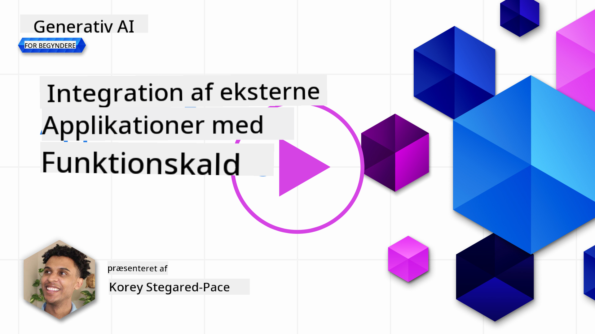
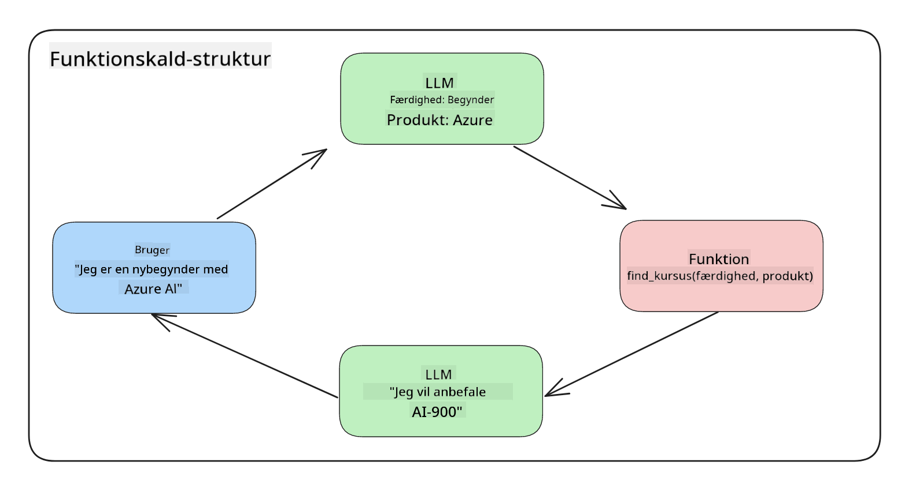
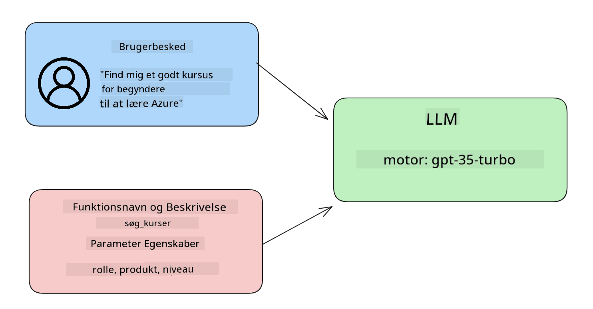

<!--
CO_OP_TRANSLATOR_METADATA:
{
  "original_hash": "77a48a201447be19aa7560706d6f93a0",
  "translation_date": "2025-07-09T14:35:52+00:00",
  "source_file": "11-integrating-with-function-calling/README.md",
  "language_code": "da"
}
-->
# Integration med function calling

[](https://aka.ms/gen-ai-lesson11-gh?WT.mc_id=academic-105485-koreyst)

Du har lært en del indtil nu i de tidligere lektioner. Men vi kan forbedre os yderligere. Nogle ting vi kan tage fat på, er hvordan vi kan få et mere ensartet svarformat, så det bliver nemmere at arbejde med svaret videre i processen. Derudover vil vi måske gerne tilføje data fra andre kilder for at berige vores applikation endnu mere.

De ovennævnte problemer er det, dette kapitel vil tage fat på.

## Introduktion

Denne lektion vil dække:

- Forklare hvad function calling er, og hvilke anvendelsestilfælde det har.
- Oprette et function call ved brug af Azure OpenAI.
- Hvordan man integrerer et function call i en applikation.

## Læringsmål

Når du er færdig med denne lektion, vil du kunne:

- Forklare formålet med at bruge function calling.
- Opsætte Function Call ved hjælp af Azure OpenAI Service.
- Designe effektive function calls til din applikations behov.

## Scenario: Forbedring af vores chatbot med funktioner

I denne lektion vil vi bygge en funktion til vores uddannelses-startup, som gør det muligt for brugere at bruge en chatbot til at finde tekniske kurser. Vi vil anbefale kurser, der passer til deres færdighedsniveau, nuværende rolle og teknologiinteresse.

For at gennemføre dette scenario vil vi bruge en kombination af:

- `Azure OpenAI` til at skabe en chatoplevelse for brugeren.
- `Microsoft Learn Catalog API` til at hjælpe brugere med at finde kurser baseret på deres forespørgsel.
- `Function Calling` til at tage brugerens forespørgsel og sende den til en funktion, som laver API-forespørgslen.

Lad os starte med at se på, hvorfor vi overhovedet vil bruge function calling:

## Hvorfor Function Calling

Før function calling var svarene fra en LLM ustrukturerede og inkonsistente. Udviklere var nødt til at skrive kompleks valideringskode for at kunne håndtere alle variationer af et svar. Brugere kunne ikke få svar på spørgsmål som "Hvad er vejret lige nu i Stockholm?". Det skyldes, at modellerne var begrænset til det tidspunkt, hvor dataene var trænet.

Function Calling er en funktion i Azure OpenAI Service, der hjælper med at overvinde følgende begrænsninger:

- **Ensartet svarformat**. Hvis vi bedre kan styre svarformatet, kan vi nemmere integrere svaret videre til andre systemer.
- **Eksterne data**. Mulighed for at bruge data fra andre kilder i applikationen i en chat-kontekst.

## Illustrering af problemet gennem et scenario

> Vi anbefaler, at du bruger [den medfølgende notebook](../../../11-integrating-with-function-calling/python/aoai-assignment.ipynb), hvis du vil køre nedenstående scenario. Du kan også bare læse med, da vi prøver at illustrere et problem, hvor funktioner kan hjælpe med at løse det.

Lad os se på et eksempel, der illustrerer problemet med svarformatet:

Forestil dig, at vi vil oprette en database med elevdata, så vi kan foreslå det rette kursus til dem. Nedenfor har vi to beskrivelser af elever, som er meget ens i de data, de indeholder.

1. Opret en forbindelse til vores Azure OpenAI-ressource:

   ```python
   import os
   import json
   from openai import AzureOpenAI
   from dotenv import load_dotenv
   load_dotenv()

   client = AzureOpenAI(
   api_key=os.environ['AZURE_OPENAI_API_KEY'],  # this is also the default, it can be omitted
   api_version = "2023-07-01-preview"
   )

   deployment=os.environ['AZURE_OPENAI_DEPLOYMENT']
   ```

   Nedenfor er noget Python-kode til at konfigurere vores forbindelse til Azure OpenAI, hvor vi sætter `api_type`, `api_base`, `api_version` og `api_key`.

1. Opret to elevbeskrivelser ved hjælp af variablerne `student_1_description` og `student_2_description`.

   ```python
   student_1_description="Emily Johnson is a sophomore majoring in computer science at Duke University. She has a 3.7 GPA. Emily is an active member of the university's Chess Club and Debate Team. She hopes to pursue a career in software engineering after graduating."

   student_2_description = "Michael Lee is a sophomore majoring in computer science at Stanford University. He has a 3.8 GPA. Michael is known for his programming skills and is an active member of the university's Robotics Club. He hopes to pursue a career in artificial intelligence after finishing his studies."
   ```

   Vi vil sende ovenstående elevbeskrivelser til en LLM for at parse dataene. Disse data kan senere bruges i vores applikation og sendes til en API eller gemmes i en database.

1. Lad os lave to identiske prompts, hvor vi instruerer LLM om, hvilken information vi er interesserede i:

   ```python
   prompt1 = f'''
   Please extract the following information from the given text and return it as a JSON object:

   name
   major
   school
   grades
   club

   This is the body of text to extract the information from:
   {student_1_description}
   '''

   prompt2 = f'''
   Please extract the following information from the given text and return it as a JSON object:

   name
   major
   school
   grades
   club

   This is the body of text to extract the information from:
   {student_2_description}
   '''
   ```

   Ovenstående prompts instruerer LLM om at udtrække information og returnere svaret i JSON-format.

1. Efter at have sat prompts og forbindelsen til Azure OpenAI op, sender vi nu prompts til LLM ved at bruge `openai.ChatCompletion`. Vi gemmer prompten i variablen `messages` og tildeler rollen `user`. Dette er for at efterligne en besked fra en bruger, der skrives til en chatbot.

   ```python
   # response from prompt one
   openai_response1 = client.chat.completions.create(
   model=deployment,
   messages = [{'role': 'user', 'content': prompt1}]
   )
   openai_response1.choices[0].message.content

   # response from prompt two
   openai_response2 = client.chat.completions.create(
   model=deployment,
   messages = [{'role': 'user', 'content': prompt2}]
   )
   openai_response2.choices[0].message.content
   ```

Nu kan vi sende begge forespørgsler til LLM og undersøge det svar, vi modtager, ved at finde det som `openai_response1['choices'][0]['message']['content']`.

1. Til sidst kan vi konvertere svaret til JSON-format ved at kalde `json.loads`:

   ```python
   # Loading the response as a JSON object
   json_response1 = json.loads(openai_response1.choices[0].message.content)
   json_response1
   ```

   Svar 1:

   ```json
   {
     "name": "Emily Johnson",
     "major": "computer science",
     "school": "Duke University",
     "grades": "3.7",
     "club": "Chess Club"
   }
   ```

   Svar 2:

   ```json
   {
     "name": "Michael Lee",
     "major": "computer science",
     "school": "Stanford University",
     "grades": "3.8 GPA",
     "club": "Robotics Club"
   }
   ```

   Selvom prompts er de samme, og beskrivelserne ligner hinanden, ser vi, at værdierne for `Grades`-egenskaben er formateret forskelligt, da vi nogle gange får formatet `3.7` eller `3.7 GPA` for eksempel.

   Dette resultat skyldes, at LLM tager ustrukturerede data i form af den skrevne prompt og også returnerer ustrukturerede data. Vi har brug for et struktureret format, så vi ved, hvad vi kan forvente, når vi gemmer eller bruger disse data.

Så hvordan løser vi så formateringsproblemet? Ved at bruge function calling kan vi sikre, at vi modtager strukturerede data tilbage. Når vi bruger function calling, kalder eller kører LLM faktisk ikke nogen funktioner. I stedet opretter vi en struktur, som LLM skal følge i sine svar. Vi bruger så disse strukturerede svar til at vide, hvilken funktion vi skal køre i vores applikationer.



Vi kan derefter tage det, der returneres fra funktionen, og sende det tilbage til LLM. LLM vil så svare med naturligt sprog for at besvare brugerens forespørgsel.

## Anvendelsestilfælde for function calls

Der findes mange forskellige anvendelsestilfælde, hvor function calls kan forbedre din app, såsom:

- **Kald af eksterne værktøjer**. Chatbots er gode til at give svar på spørgsmål fra brugere. Ved at bruge function calling kan chatbots bruge beskeder fra brugere til at udføre bestemte opgaver. For eksempel kan en studerende bede chatbotten om at "Sende en e-mail til min underviser og sige, at jeg har brug for mere hjælp til dette emne". Dette kan lave et function call til `send_email(to: string, body: string)`.

- **Opret API- eller databaseforespørgsler**. Brugere kan finde information ved hjælp af naturligt sprog, som konverteres til en formateret forespørgsel eller API-kald. Et eksempel kunne være en lærer, der spørger "Hvem er de studerende, der har afleveret den sidste opgave", hvilket kunne kalde en funktion ved navn `get_completed(student_name: string, assignment: int, current_status: string)`.

- **Oprettelse af strukturerede data**. Brugere kan tage et tekstafsnit eller CSV og bruge LLM til at udtrække vigtig information fra det. For eksempel kan en studerende konvertere en Wikipedia-artikel om fredsaftaler til AI-flashcards. Dette kan gøres ved at bruge en funktion kaldet `get_important_facts(agreement_name: string, date_signed: string, parties_involved: list)`.

## Oprettelse af dit første function call

Processen med at oprette et function call inkluderer 3 hovedtrin:

1. **Kald** Chat Completions API med en liste over dine funktioner og en brugermeddelelse.
2. **Læs** modellens svar for at udføre en handling, dvs. køre en funktion eller API-kald.
3. **Lav** et nyt kald til Chat Completions API med svaret fra din funktion for at bruge den information til at skabe et svar til brugeren.



### Trin 1 - oprette beskeder

Det første trin er at oprette en brugermeddelelse. Denne kan tildeles dynamisk ved at tage værdien fra et tekstinput, eller du kan tildele en værdi her. Hvis det er første gang, du arbejder med Chat Completions API, skal vi definere `role` og `content` i beskeden.

`role` kan være enten `system` (opretter regler), `assistant` (modellen) eller `user` (slutbrugeren). Til function calling tildeler vi denne som `user` og et eksempelspørgsmål.

```python
messages= [ {"role": "user", "content": "Find me a good course for a beginner student to learn Azure."} ]
```

Ved at tildele forskellige roller bliver det tydeligt for LLM, om det er systemet, der siger noget, eller brugeren, hvilket hjælper med at opbygge en samtalehistorik, som LLM kan bygge videre på.

### Trin 2 - oprette funktioner

Dernæst definerer vi en funktion og parametrene for den funktion. Vi bruger kun én funktion her kaldet `search_courses`, men du kan oprette flere funktioner.

> **Vigtigt**: Funktioner inkluderes i systembeskeden til LLM og tæller med i det antal tokens, du har til rådighed.

Nedenfor opretter vi funktionerne som et array af elementer. Hvert element er en funktion og har egenskaberne `name`, `description` og `parameters`:

```python
functions = [
   {
      "name":"search_courses",
      "description":"Retrieves courses from the search index based on the parameters provided",
      "parameters":{
         "type":"object",
         "properties":{
            "role":{
               "type":"string",
               "description":"The role of the learner (i.e. developer, data scientist, student, etc.)"
            },
            "product":{
               "type":"string",
               "description":"The product that the lesson is covering (i.e. Azure, Power BI, etc.)"
            },
            "level":{
               "type":"string",
               "description":"The level of experience the learner has prior to taking the course (i.e. beginner, intermediate, advanced)"
            }
         },
         "required":[
            "role"
         ]
      }
   }
]
```

Lad os beskrive hver funktion mere detaljeret nedenfor:

- `name` - Navnet på den funktion, vi ønsker skal kaldes.
- `description` - En beskrivelse af, hvordan funktionen virker. Her er det vigtigt at være specifik og klar.
- `parameters` - En liste over værdier og format, som du ønsker, at modellen skal producere i sit svar. Parameter-arrayet består af elementer, hvor hvert element har følgende egenskaber:
  1. `type` - Datatypen for de egenskaber, der skal gemmes.
  2. `properties` - Liste over de specifikke værdier, som modellen skal bruge i sit svar.
      1. `name` - Nøglen er navnet på egenskaben, som modellen skal bruge i sit formaterede svar, fx `product`.
      2. `type` - Datatypen for denne egenskab, fx `string`.
      3. `description` - Beskrivelse af den specifikke egenskab.

Der findes også en valgfri egenskab `required` - påkrævet egenskab for at function call kan gennemføres.

### Trin 3 - Udfør function call

Efter at have defineret en funktion, skal vi nu inkludere den i kaldet til Chat Completion API. Det gør vi ved at tilføje `functions` til forespørgslen. I dette tilfælde `functions=functions`.

Der er også en mulighed for at sætte `function_call` til `auto`. Det betyder, at vi lader LLM afgøre, hvilken funktion der skal kaldes baseret på brugermeddelelsen i stedet for at tildele det selv.

Her er noget kode nedenfor, hvor vi kalder `ChatCompletion.create`, bemærk hvordan vi sætter `functions=functions` og `function_call="auto"` og dermed giver LLM valget om, hvornår funktionerne skal kaldes:

```python
response = client.chat.completions.create(model=deployment,
                                        messages=messages,
                                        functions=functions,
                                        function_call="auto")

print(response.choices[0].message)
```

Svaret, der kommer tilbage, ser nu sådan ud:

```json
{
  "role": "assistant",
  "function_call": {
    "name": "search_courses",
    "arguments": "{\n  \"role\": \"student\",\n  \"product\": \"Azure\",\n  \"level\": \"beginner\"\n}"
  }
}
```

Her kan vi se, hvordan funktionen `search_courses` blev kaldt, og med hvilke argumenter, som angivet i `arguments`-egenskaben i JSON-svaret.

Konklusionen er, at LLM var i stand til at finde data, der passer til funktionens argumenter, da den udtrak det fra værdien, der blev givet til `messages`-parameteren i chat completion-kaldet. Nedenfor er en påmindelse om værdien af `messages`:

```python
messages= [ {"role": "user", "content": "Find me a good course for a beginner student to learn Azure."} ]
```

Som du kan se, blev `student`, `Azure` og `beginner` udtrukket fra `messages` og sat som input til funktionen. At bruge funktioner på denne måde er en god måde at udtrække information fra en prompt, men også at give struktur til LLM og have genanvendelig funktionalitet.

Næste skridt er at se, hvordan vi kan bruge dette i vores app.

## Integration af function calls i en applikation

Efter vi har testet det formaterede svar fra LLM, kan vi nu integrere dette i en applikation.

### Styring af flowet

For at integrere dette i vores applikation, lad os tage følgende trin:

1. Først laver vi kaldet til OpenAI-tjenesterne og gemmer beskeden i en variabel kaldet `response_message`.

   ```python
   response_message = response.choices[0].message
   ```

1. Nu definerer vi funktionen, der kalder Microsoft Learn API for at få en liste over kurser:

   ```python
   import requests

   def search_courses(role, product, level):
     url = "https://learn.microsoft.com/api/catalog/"
     params = {
        "role": role,
        "product": product,
        "level": level
     }
     response = requests.get(url, params=params)
     modules = response.json()["modules"]
     results = []
     for module in modules[:5]:
        title = module["title"]
        url = module["url"]
        results.append({"title": title, "url": url})
     return str(results)
   ```

   Bemærk, hvordan vi nu opretter en faktisk Python-funktion, der matcher funktionsnavnene, som vi har defineret i `functions`-variablen. Vi laver også rigtige eksterne API-kald for at hente de nødvendige data. I dette tilfælde kalder vi Microsoft Learn API for at søge efter træningsmoduler.

Ok, vi har oprettet `functions`-variablen og en tilsvarende Python-funktion, hvordan fortæller vi så LLM, hvordan de to hænger sammen, så vores Python-funktion bliver kaldt?

1. For at se, om vi skal kalde en Python-funktion, skal vi kigge i LLM-svaret og se, om `function_call` er en del af det, og så kalde den angivne funktion. Her er, hvordan du kan lave denne kontrol:

   ```python
   # Check if the model wants to call a function
   if response_message.function_call.name:
    print("Recommended Function call:")
    print(response_message.function_call.name)
    print()

    # Call the function.
    function_name = response_message.function_call.name

    available_functions = {
            "search_courses": search_courses,
    }
    function_to_call = available_functions[function_name]

    function_args = json.loads(response_message.function_call.arguments)
    function_response = function_to_call(**function_args)

    print("Output of function call:")
    print(function_response)
    print(type(function_response))


    # Add the assistant response and function response to the messages
    messages.append( # adding assistant response to messages
        {
            "role": response_message.role,
            "function_call": {
                "name": function_name,
                "arguments": response_message.function_call.arguments,
            },
            "content": None
        }
    )
    messages.append( # adding function response to messages
        {
            "role": "function",
            "name": function_name,
            "content":function_response,
        }
    )
   ```

   Disse tre linjer sikrer, at vi udtrækker funktionsnavnet, argumenterne og laver kaldet:

   ```python
   function_to_call = available_functions[function_name]

   function_args = json.loads(response_message.function_call.arguments)
   function_response = function_to_call(**function_args)
   ```

   Nedenfor er outputtet fra at køre vores kode:

   **Output**

   ```Recommended Function call:
   {
     "name": "search_courses",
     "arguments": "{\n  \"role\": \"student\",\n  \"product\": \"Azure\",\n  \"level\": \"beginner\"\n}"
   }

   Output of function call:
   [{'title': 'Describe concepts of cryptography', 'url': 'https://learn.microsoft.com/training/modules/describe-concepts-of-cryptography/?
   WT.mc_id=api_CatalogApi'}, {'title': 'Introduction to audio classification with TensorFlow', 'url': 'https://learn.microsoft.com/en-
   us/training/modules/intro-audio-classification-tensorflow/?WT.mc_id=api_CatalogApi'}, {'title': 'Design a Performant Data Model in Azure SQL
   Database with Azure Data Studio', 'url': 'https://learn.microsoft.com/training/modules/design-a-data-model-with-ads/?
   WT.mc_id=api_CatalogApi'}, {'title': 'Getting started with the Microsoft Cloud Adoption Framework for Azure', 'url':
   'https://learn.microsoft.com/training/modules/cloud-adoption-framework-getting-started/?WT.mc_id=api_CatalogApi'}, {'title': 'Set up the
   Rust development environment', 'url': 'https://learn.microsoft.com/training/modules/rust-set-up-environment/?WT.mc_id=api_CatalogApi'}]
   <class 'str'>
   ```

1. Nu sender vi den opdaterede besked, `messages`, til LLM, så vi kan modtage et svar i naturligt sprog i stedet for et API JSON-formateret svar.

   ```python
   print("Messages in next request:")
   print(messages)
   print()

   second_response = client.chat.completions.create(
      messages=messages,
      model=deployment,
      function_call="auto",
      functions=functions,
      temperature=0
         )  # get a new response from GPT where it can see the function response


   print(second_response.choices[0].message)
   ```

   **Output**

   ```python
   {
     "role": "assistant",
     "content": "I found some good courses for beginner students to learn Azure:\n\n1. [Describe concepts of cryptography] (https://learn.microsoft.com/training/modules/describe-concepts-of-cryptography/?WT.mc_id=api_CatalogApi)\n2. [Introduction to audio classification with TensorFlow](https://learn.microsoft.com/training/modules/intro-audio-classification-tensorflow/?WT.mc_id=api_CatalogApi)\n3. [Design a Performant Data Model in Azure SQL Database with Azure Data Studio](https://learn.microsoft.com/training/modules/design-a-data-model-with-ads/?WT.mc_id=api_CatalogApi)\n4. [Getting started with the Microsoft Cloud Adoption Framework for Azure](https://learn.microsoft.com/training/modules/cloud-adoption-framework-getting-started/?WT.mc_id=api_CatalogApi)\n5. [Set up the Rust development environment](https://learn.microsoft.com/training/modules/rust-set-up-environment/?WT.mc_id=api_CatalogApi)\n\nYou can click on the links to access the courses."
   }

   ```

## Opgave

For at fortsætte din læring om Azure OpenAI Function Calling kan du bygge:

- Flere parametre til funktionen, som kan hjælpe brugere med at finde flere kurser.
- Oprette et andet function call, der tager mere information fra brugeren, som deres modersmål.
- Oprette fejlhåndtering, når function call og/eller API-kald ikke returnerer passende kurser.
Hint: Følg siden [Learn API reference documentation](https://learn.microsoft.com/training/support/catalog-api-developer-reference?WT.mc_id=academic-105485-koreyst) for at se, hvordan og hvor disse data er tilgængelige.

## Godt arbejde! Fortsæt rejsen

Efter at have gennemført denne lektion, kan du tjekke vores [Generative AI Learning collection](https://aka.ms/genai-collection?WT.mc_id=academic-105485-koreyst) for at fortsætte med at opgradere din viden om Generative AI!

Gå videre til Lektion 12, hvor vi vil se på, hvordan man [designer UX til AI-applikationer](../12-designing-ux-for-ai-applications/README.md?WT.mc_id=academic-105485-koreyst)!

**Ansvarsfraskrivelse**:  
Dette dokument er blevet oversat ved hjælp af AI-oversættelsestjenesten [Co-op Translator](https://github.com/Azure/co-op-translator). Selvom vi bestræber os på nøjagtighed, bedes du være opmærksom på, at automatiserede oversættelser kan indeholde fejl eller unøjagtigheder. Det oprindelige dokument på dets oprindelige sprog bør betragtes som den autoritative kilde. For kritisk information anbefales professionel menneskelig oversættelse. Vi påtager os intet ansvar for misforståelser eller fejltolkninger, der opstår som følge af brugen af denne oversættelse.