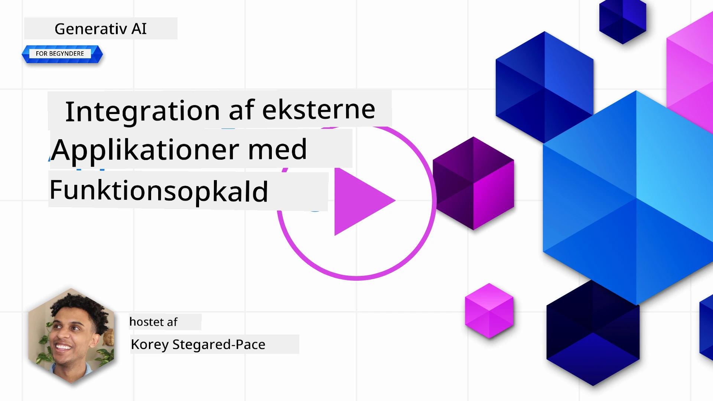
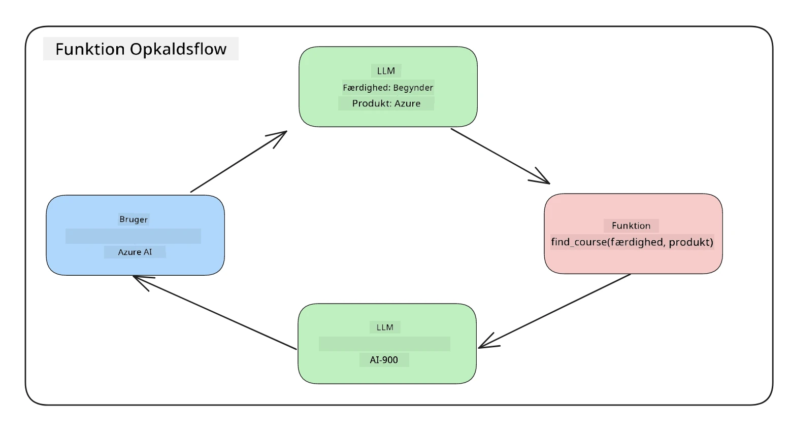
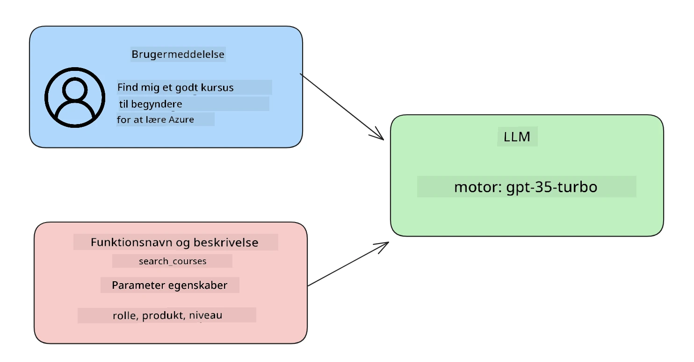

# Integration med funktionskald

[](https://youtu.be/DgUdCLX8qYQ?si=f1ouQU5HQx6F8Gl2)

Du har lært en del indtil videre i de tidligere lektioner. Men vi kan forbedre yderligere. Nogle ting, vi kan tage fat på, er hvordan vi kan få et mere konsistent svarformat for at gøre det nemmere at arbejde med svaret videre i processen. Derudover vil vi måske tilføje data fra andre kilder for at gøre vores applikation endnu mere rig.

De ovennævnte problemer er, hvad dette kapitel har til formål at adressere.

## Introduktion

Denne lektion vil dække:

- Forklare hvad funktionskald er, og dets anvendelsestilfælde.
- Oprettelse af et funktionskald ved brug af Azure OpenAI.
- Hvordan man integrerer et funktionskald i en applikation.

## Læringsmål

Ved slutningen af denne lektion vil du være i stand til at:

- Forklare formålet med at bruge funktionskald.
- Opsætte Funktionskald ved hjælp af Azure OpenAI Service.
- Designe effektive funktionskald til dit applikationsbrugstilfælde.

## Scenario: Forbedring af vores chatbot med funktioner

Til denne lektion ønsker vi at bygge en funktion til vores uddannelsesstartup, som tillader brugere at bruge en chatbot til at finde tekniske kurser. Vi vil anbefale kurser, der passer til deres færdighedsniveau, nuværende rolle og interesse inden for teknologi.

For at gennemføre dette scenario vil vi bruge en kombination af:

- `Azure OpenAI` for at skabe en chatoplevelse for brugeren.
- `Microsoft Learn Catalog API` for at hjælpe brugere med at finde kurser baseret på brugerens forespørgsel.
- `Funktionskald` til at tage brugerens forespørgsel og sende den til en funktion for at lave API-anmodningen.

For at komme i gang, lad os se på hvorfor vi ønsker at bruge funktionskald i første omgang:

## Hvorfor Funktionskald

Før funktionskald var svar fra et LLM ustrukturerede og inkonsistente. Udviklere var nødt til at skrive kompleks valideringskode for at sikre, at de kunne håndtere hver variation af et svar. Brugere kunne ikke få svar som "Hvad er vejret lige nu i Stockholm?". Det skyldes, at modeller var begrænsede til den tid, hvor dataene blev trænet.

Funktionskald er en funktion i Azure OpenAI Service til at overvinde følgende begrænsninger:

- **Konsistent svarformat**. Hvis vi bedre kan kontrollere svarformatet, kan vi nemmere integrere svaret videre til andre systemer.
- **Eksterne data**. Evnen til at bruge data fra andre kilder i en applikation i en chatkontekst.

## Illustrering af problemet gennem et scenario

> Vi anbefaler, at du bruger den [inkluderede notebook](./python/aoai-assignment.ipynb?WT.mc_id=academic-105485-koreyst), hvis du ønsker at køre nedenstående scenario. Du kan også blot læse med, da vi prøver at illustrere et problem, som funktioner kan hjælpe med at løse.

Lad os se på eksemplet, der illustrerer problemet med svarformat:

Lad os sige, at vi ønsker at oprette en database med elevdata, så vi kan foreslå det rigtige kursus til dem. Nedenfor har vi to beskrivelser af studerende, der er meget lignende i de data, de indeholder.

1. Opret en forbindelse til vores Azure OpenAI-ressource:

   ```python
   import os
   import json
   from openai import OpenAI
   from dotenv import load_dotenv
   load_dotenv()

   # Responses API'en leveres fra Azure OpenAI (Microsoft Foundry) v1
   # endepunktet, så vi peger OpenAI-klienten på <your-endpoint>/openai/v1/.
   endpoint = os.environ['AZURE_OPENAI_ENDPOINT']
   client = OpenAI(
   api_key=os.environ['AZURE_OPENAI_API_KEY'],
   base_url=f"{endpoint.rstrip('/')}/openai/v1/",
   )

   deployment=os.environ['AZURE_OPENAI_DEPLOYMENT']
   ```

   Nedenfor er noget Python-kode til at konfigurere vores forbindelse til Azure OpenAI. Fordi vi bruger v1-endpointet, behøver vi kun at angive `api_key` og `base_url` (ingen `api_version` er påkrævet).

1. Oprettelse af to elevbeskrivelser ved brug af variablerne `student_1_description` og `student_2_description`.

   ```python
   student_1_description="Emily Johnson is a sophomore majoring in computer science at Duke University. She has a 3.7 GPA. Emily is an active member of the university's Chess Club and Debate Team. She hopes to pursue a career in software engineering after graduating."

   student_2_description = "Michael Lee is a sophomore majoring in computer science at Stanford University. He has a 3.8 GPA. Michael is known for his programming skills and is an active member of the university's Robotics Club. He hopes to pursue a career in artificial intelligence after finishing his studies."
   ```

   Vi ønsker at sende ovenstående elevbeskrivelser til en LLM for at parse dataene. Disse data kan senere bruges i vores applikation og sendes til en API eller gemmes i en database.

1. Lad os oprette to identiske prompts, hvor vi instruerer LLM om, hvilke oplysninger vi er interesseret i:

   ```python
   prompt1 = f'''
   Please extract the following information from the given text and return it as a JSON object:

   name
   major
   school
   grades
   club

   This is the body of text to extract the information from:
   {student_1_description}
   '''

   prompt2 = f'''
   Please extract the following information from the given text and return it as a JSON object:

   name
   major
   school
   grades
   club

   This is the body of text to extract the information from:
   {student_2_description}
   '''
   ```

   Ovenstående prompts instruerer LLM om at udtrække information og returnere svaret i JSON-format.

1. Efter opsætningen af prompts og forbindelsen til Azure OpenAI, sender vi nu prompts til LLM ved at bruge `client.responses.create`. Vi gemmer prompten i variablen `input` og tildeler rollen `user`. Dette for at efterligne en besked fra en bruger skrevet til en chatbot.

   ```python
   # svar fra prompt et
   openai_response1 = client.responses.create(
   model=deployment,
   input = [{'role': 'user', 'content': prompt1}],
   store=False,
   )
   openai_response1.output_text

   # svar fra prompt to
   openai_response2 = client.responses.create(
   model=deployment,
   input = [{'role': 'user', 'content': prompt2}],
   store=False,
   )
   openai_response2.output_text
   ```

Nu kan vi sende begge forespørgsler til LLM og undersøge det svar, vi modtager, ved at finde det således `openai_response1.output_text`.

1. Til sidst kan vi konvertere svaret til JSON-format ved at kalde `json.loads`:

   ```python
   # Indlæser svaret som et JSON-objekt
   json_response1 = json.loads(openai_response1.output_text)
   json_response1
   ```

   Svar 1:

   ```json
   {
     "name": "Emily Johnson",
     "major": "computer science",
     "school": "Duke University",
     "grades": "3.7",
     "club": "Chess Club"
   }
   ```

   Svar 2:

   ```json
   {
     "name": "Michael Lee",
     "major": "computer science",
     "school": "Stanford University",
     "grades": "3.8 GPA",
     "club": "Robotics Club"
   }
   ```

   Selvom prompts er de samme, og beskrivelserne ligner hinanden, ser vi, at værdierne for `Grades`-egenskaben formateres forskelligt, da vi nogle gange får formatet `3.7` eller for eksempel `3.7 GPA`.

   Dette resultat skyldes, at LLM tager ustrukturerede data i form af den skrevne prompt og returnerer også ustrukturerede data. Vi har brug for at have et struktureret format, så vi ved, hvad vi kan forvente, når vi gemmer eller bruger disse data.

Så hvordan løser vi så formateringsproblemet? Ved hjælp af funktionskald kan vi sikre, at vi modtager strukturerede data tilbage. Når vi bruger funktionskald, kalder LLM faktisk ikke eller kører nogen funktioner. I stedet opretter vi en struktur, som LLM skal følge for sine svar. Vi bruger derefter disse strukturerede svar til at vide, hvilken funktion vi skal køre i vores applikationer.



Vi kan derefter tage det, der returneres fra funktionen, og sende dette tilbage til LLM. LLM vil så svare med naturligt sprog for at besvare brugerens forespørgsel.

## Anvendelsestilfælde for funktionskald

Der er mange forskellige brugstilfælde, hvor funktionskald kan forbedre din app, som:

- **Kald eksterne værktøjer**. Chatbots er gode til at give svar på brugerspørgsmål. Ved hjælp af funktionskald kan chatbots bruge beskeder fra brugerne til at udføre bestemte opgaver. For eksempel kan en studerende bede chatbotten om at "Sende en e-mail til min underviser og sige, at jeg har brug for mere hjælp med dette emne". Dette kan lave et funktionskald til `send_email(to: string, body: string)`

- **Oprette API- eller databaseforespørgsler**. Brugere kan finde information ved hjælp af naturligt sprog, som konverteres til en formateret forespørgsel eller API-anmodning. Et eksempel på dette kunne være en lærer, der spørger "Hvem er de studerende, der har færdiggjort den sidste opgave," hvilket kunne kalde en funktion kaldet `get_completed(student_name: string, assignment: int, current_status: string)`

- **Oprette strukturerede data**. Brugere kan tage en tekstblok eller CSV og bruge LLM til at udtrække vigtig information fra den. For eksempel kan en studerende konvertere en Wikipedia-artikel om fredsaftaler til AI-flashcards. Dette kan gøres ved at bruge en funktion kaldet `get_important_facts(agreement_name: string, date_signed: string, parties_involved: list)`

## Oprettelse af dit første funktionskald

Processen med at oprette et funktionskald inkluderer 3 hovedtrin:

1. **Kalde** Responses API med en liste over dine funktioner (værktøjer) og en brugermeddelelse.
2. **Læse** modellens svar for at udføre en handling, dvs. eksekvere en funktion eller API-kald.
3. **Foretage** et nyt kald til Responses API med svaret fra din funktion for at bruge denne information til at skabe et svar til brugeren.



### Trin 1 - oprette beskeder

Det første trin er at oprette en brugermeddelelse. Denne kan tildeles dynamisk ved at tage værdien af en tekstinput, eller du kan tildele en værdi her. Hvis dette er din første gang, du arbejder med Responses API, skal vi definere `role` og `content` af meddelelsen.

`role` kan enten være `system` (oprette regler), `assistant` (modellen) eller `user` (slutbrugeren). Til funktionskald vil vi tildele dette som `user` og et eksempelspørgsmål.

```python
messages= [ {"role": "user", "content": "Find me a good course for a beginner student to learn Azure."} ]
```

Ved at tildele forskellige roller bliver det klart for LLM, om det er systemet, der siger noget, eller brugeren, hvilket hjælper med at opbygge en samtalehistorik, som LLM kan bygge videre på.

### Trin 2 - oprette funktioner

Næste trin er at definere en funktion og parametrene for den funktion. Vi vil kun bruge én funktion her kaldet `search_courses`, men du kan lave flere funktioner.

> **Vigtigt** : Funktioner inkluderes i systembeskeden til LLM og vil tælle med i det antal tilgængelige tokens, du har til rådighed.

Nedenfor opretter vi funktionerne som en array af elementer. Hvert element er et værktøj i det flade Responses API-format med egenskaberne `type`, `name`, `description` og `parameters`:

```python
functions = [
   {
      "type":"function",
      "name":"search_courses",
      "description":"Retrieves courses from the search index based on the parameters provided",
      "parameters":{
         "type":"object",
         "properties":{
            "role":{
               "type":"string",
               "description":"The role of the learner (i.e. developer, data scientist, student, etc.)"
            },
            "product":{
               "type":"string",
               "description":"The product that the lesson is covering (i.e. Azure, Power BI, etc.)"
            },
            "level":{
               "type":"string",
               "description":"The level of experience the learner has prior to taking the course (i.e. beginner, intermediate, advanced)"
            }
         },
         "required":[
            "role"
         ]
      }
   }
]
```

Lad os beskrive hver funktionseksempel mere detaljeret nedenfor:

- `name` - Navnet på funktionen, der skal kaldes.
- `description` - En beskrivelse af, hvordan funktionen virker. Her er det vigtigt at være specifik og klar.
- `parameters` - En liste af værdier og format, som du ønsker modellen skal lave i sit svar. Parameter-array'et består af elementer, hvor elementerne har følgende egenskaber:
  1.  `type` - Datatypen for egenskaberne, der skal lagres i.
  1.  `properties` - Liste over de specifikke værdier, som modellen vil bruge i sit svar
      1. `name` - Nøglen er navnet på egenskaben, som modellen vil bruge i sit formaterede svar, for eksempel `product`.
      1. `type` - Datatypen for denne egenskab, eksempelvis `string`.
      1. `description` - Beskrivelse af den specifikke egenskab.

Der er også en valgfri egenskab `required` - påkrævet egenskab for at funktionskaldet kan gennemføres.

### Trin 3 - Foretage funktionskaldet

Efter at have defineret en funktion, skal vi nu inkludere den i kaldet til Responses API. Vi gør dette ved at tilføje `tools` til forespørgslen. I dette tilfælde `tools=functions`.

Der er også en mulighed for at sætte `tool_choice` til `auto`. Det betyder, at vi lader LLM bestemme, hvilken funktion der skal kaldes baseret på brugermeddelelsen i stedet for selv at tildele det.

Her er noget kode nedenfor, hvor vi kalder `client.responses.create`, bemærk hvordan vi sætter `tools=functions` og `tool_choice="auto"`, og dermed giver LLM valget om, hvornår funktionerne, vi leverer, skal kaldes:

```python
response = client.responses.create(model=deployment,
                                        input=messages,
                                        tools=functions,
                                        tool_choice="auto",
                                        store=False)

print(response.output)
```

Svaret, der kommer tilbage nu, inkluderer et `function_call` element i `response.output`, som ser således ud:

```json
{
  "type": "function_call",
  "name": "search_courses",
  "call_id": "call_abc123",
  "arguments": "{\n  \"role\": \"student\",\n  \"product\": \"Azure\",\n  \"level\": \"beginner\"\n}"
}
```

Her kan vi se, hvordan funktionen `search_courses` blev kaldt og med hvilke argumenter, som listet i `arguments` egenskaben i JSON-svaret.

Konklusionen er, at LLM var i stand til at finde de data, der passer til argumenterne i funktionen, da de blev udtrukket fra værdien angivet til `input` parameteren i API-kaldet til Responses. Nedenfor er en påmindelse om `messages` værdien:

```python
messages= [ {"role": "user", "content": "Find me a good course for a beginner student to learn Azure."} ]
```

Som du kan se, blev `student`, `Azure` og `beginner` udtrukket fra `messages` og sat som input til funktionen. At bruge funktioner på denne måde er en fremragende måde at udtrække information fra en prompt, men også at give struktur til LLM og have genanvendelig funktionalitet.

Herefter skal vi se, hvordan vi kan bruge dette i vores app.

## Integrering af funktionskald i en applikation

Når vi har testet det formaterede svar fra LLM, kan vi nu integrere dette i en applikation.

### Håndtering af flowet

For at integrere dette i vores applikation kan vi tage følgende trin:

1. Først foretager vi kaldet til OpenAI-services og udtrækker funktionskalds-elementerne fra svaret `output`.

   ```python
   response_items = response.output
   tool_calls = [item for item in response_items if item.type == "function_call"]
   ```

1. Nu definerer vi funktionen, der kalder Microsoft Learn API for at få en liste over kurser:

   ```python
   import requests

   def search_courses(role, product, level):
     url = "https://learn.microsoft.com/api/catalog/"
     params = {
        "role": role,
        "product": product,
        "level": level
     }
     response = requests.get(url, params=params)
     modules = response.json()["modules"]
     results = []
     for module in modules[:5]:
        title = module["title"]
        url = module["url"]
        results.append({"title": title, "url": url})
     return str(results)
   ```

   Bemærk, hvordan vi nu opretter en faktisk Python-funktion, der mapper til funktionsnavnene introduceret i `functions` variablen. Vi laver også reelle eksterne API-kald for at hente de data, vi har brug for. I dette tilfælde går vi mod Microsoft Learn API for at søge efter træningsmoduler.

Ok, så vi har oprettet `functions` variabel og en tilsvarende Python-funktion, hvordan fortæller vi LLM at mappe disse to sammen, så vores Python-funktion bliver kaldt?

1. For at se, om vi skal kalde en Python-funktion, skal vi kigge i LLM-svaret og se, om der er et `function_call` element, og kalde den angivne funktion. Her er, hvordan du kan lave denne kontrol nedenfor:

   ```python
   # Tjek om modellen ønsker at kalde en funktion
   if tool_calls:
    for tool_call in tool_calls:
     print("Recommended Function call:")
     print(tool_call.name)
     print()

     # Kald funktionen.
     function_name = tool_call.name

     available_functions = {
             "search_courses": search_courses,
     }
     function_to_call = available_functions[function_name]

     function_args = json.loads(tool_call.arguments)
     function_response = function_to_call(**function_args)

     print("Output of function call:")
     print(function_response)
     print(type(function_response))

     # Tilføj funktionsopkaldet og dets resultat tilbage til samtalen.
     # Modellen skal have sit function_call-element tilføjet før dens output.
     messages.append(tool_call)  # assistentens function_call-element
     messages.append( # funktionsresultatet
         {
             "type": "function_call_output",
             "call_id": tool_call.call_id,
             "output": function_response,
         }
     )
   ```

   Disse tre linjer sikrer, at vi udtrækker funktionsnavnet, argumenterne og foretager kaldet:

   ```python
   function_to_call = available_functions[function_name]

   function_args = json.loads(tool_call.arguments)
   function_response = function_to_call(**function_args)
   ```

   Nedenfor er outputtet fra at køre vores kode:

   **Output**

   ```Recommended Function call:
   {
     "name": "search_courses",
     "arguments": "{\n  \"role\": \"student\",\n  \"product\": \"Azure\",\n  \"level\": \"beginner\"\n}"
   }

   Output of function call:
   [{'title': 'Describe concepts of cryptography', 'url': 'https://learn.microsoft.com/training/modules/describe-concepts-of-cryptography/?
   WT.mc_id=api_CatalogApi'}, {'title': 'Introduction to audio classification with TensorFlow', 'url': 'https://learn.microsoft.com/en-
   us/training/modules/intro-audio-classification-tensorflow/?WT.mc_id=api_CatalogApi'}, {'title': 'Design a Performant Data Model in Azure SQL
   Database with Azure Data Studio', 'url': 'https://learn.microsoft.com/training/modules/design-a-data-model-with-ads/?
   WT.mc_id=api_CatalogApi'}, {'title': 'Getting started with the Microsoft Cloud Adoption Framework for Azure', 'url':
   'https://learn.microsoft.com/training/modules/cloud-adoption-framework-getting-started/?WT.mc_id=api_CatalogApi'}, {'title': 'Set up the
   Rust development environment', 'url': 'https://learn.microsoft.com/training/modules/rust-set-up-environment/?WT.mc_id=api_CatalogApi'}]
   <class 'str'>
   ```

1. Nu sender vi den opdaterede besked, `messages`, til LLM, så vi kan modtage et svar med naturligt sprog i stedet for et API-svar i JSON-format.

   ```python
   print("Messages in next request:")
   print(messages)
   print()

   second_response = client.responses.create(
      input=messages,
      model=deployment,
      tool_choice="auto",
      tools=functions,
      temperature=0,
      store=False,
         )  # få et nyt svar fra modellen, hvor den kan se funktionssvaret


   print(second_response.output_text)
   ```

   **Output**

   ```text
   I found some good courses for beginner students to learn Azure:

   1. [Describe concepts of cryptography](https://learn.microsoft.com/training/modules/describe-concepts-of-cryptography/?WT.mc_id=api_CatalogApi)
   2. [Introduction to audio classification with TensorFlow](https://learn.microsoft.com/training/modules/intro-audio-classification-tensorflow/?WT.mc_id=api_CatalogApi)
   3. [Design a Performant Data Model in Azure SQL Database with Azure Data Studio](https://learn.microsoft.com/training/modules/design-a-data-model-with-ads/?WT.mc_id=api_CatalogApi)
   4. [Getting started with the Microsoft Cloud Adoption Framework for Azure](https://learn.microsoft.com/training/modules/cloud-adoption-framework-getting-started/?WT.mc_id=api_CatalogApi)
   5. [Set up the Rust development environment](https://learn.microsoft.com/training/modules/rust-set-up-environment/?WT.mc_id=api_CatalogApi)

   You can click on the links to access the courses.
   ```

## Opgave

For at fortsætte din læring af Azure OpenAI Funktionskald kan du bygge:

- Flere parametre til funktionen, som kan hjælpe elever med at finde flere kurser.

- Opret et andet funktionskald, der tager mere information fra læreren, såsom deres modersmål
- Opret fejlhåndtering, når funktionskaldet og/eller API-kaldet ikke returnerer nogen egnede kurser

Hint: Følg [Learn API reference dokumentationen](https://learn.microsoft.com/training/support/catalog-api-developer-reference?WT.mc_id=academic-105485-koreyst) for at se, hvordan og hvor disse data er tilgængelige.

## Godt arbejde! Fortsæt rejsen

Efter at have gennemført denne lektion, kan du tjekke vores [Generative AI Learning samling](https://aka.ms/genai-collection?WT.mc_id=academic-105485-koreyst) for at fortsætte med at forbedre din viden om Generative AI!

Gå videre til lektion 12, hvor vi ser på, hvordan man [designer UX til AI-applikationer](../12-designing-ux-for-ai-applications/README.md?WT.mc_id=academic-105485-koreyst)!

---

<!-- CO-OP TRANSLATOR DISCLAIMER START -->
**Ansvarsfraskrivelse**:
Dette dokument er blevet oversat ved hjælp af AI-oversættelsestjenesten [Co-op Translator](https://github.com/Azure/co-op-translator). Selvom vi bestræber os på nøjagtighed, skal du være opmærksom på, at automatiserede oversættelser kan indeholde fejl eller unøjagtigheder. Det originale dokument på dets oprindelige sprog bør betragtes som den autoritative kilde. For kritisk information anbefales professionel menneskelig oversættelse. Vi påtager os intet ansvar for misforståelser eller fejltolkninger, der opstår som følge af brugen af denne oversættelse.
<!-- CO-OP TRANSLATOR DISCLAIMER END -->