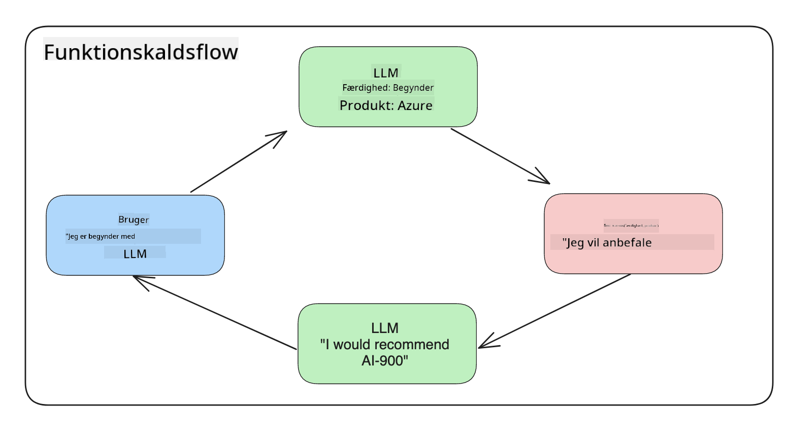
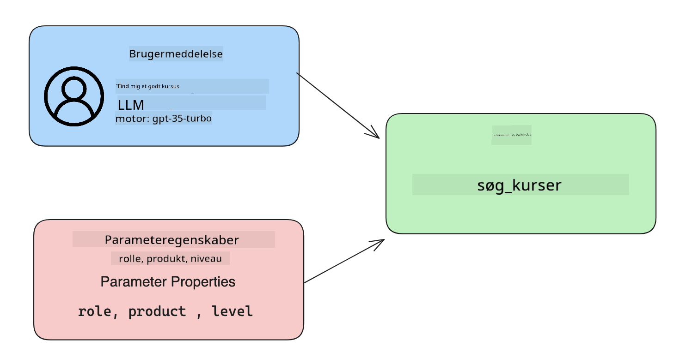

<!--
CO_OP_TRANSLATOR_METADATA:
{
  "original_hash": "f6f84f9ef2d066cd25850cab93580a50",
  "translation_date": "2025-10-17T19:08:58+00:00",
  "source_file": "11-integrating-with-function-calling/README.md",
  "language_code": "da"
}
-->
# Integration med funktionskald

[](https://youtu.be/DgUdCLX8qYQ?si=f1ouQU5HQx6F8Gl2)

Du har allerede lært en del i de tidligere lektioner. Men vi kan stadig forbedre os. Nogle ting, vi kan tage fat på, er hvordan vi kan få et mere konsistent svarformat, så det bliver lettere at arbejde med svaret senere. Derudover kunne vi ønske at tilføje data fra andre kilder for at berige vores applikation yderligere.

De ovennævnte problemer er, hvad dette kapitel sigter mod at løse.

## Introduktion

Denne lektion vil dække:

- Forklaring af, hvad funktionskald er, og dets anvendelsesmuligheder.
- Oprettelse af et funktionskald ved hjælp af Azure OpenAI.
- Hvordan man integrerer et funktionskald i en applikation.

## Læringsmål

Ved afslutningen af denne lektion vil du kunne:

- Forklare formålet med at bruge funktionskald.
- Opsætte Funktionskald ved hjælp af Azure OpenAI Service.
- Designe effektive funktionskald til din applikations brugsscenarie.

## Scenarie: Forbedring af vores chatbot med funktioner

I denne lektion ønsker vi at bygge en funktion til vores uddannelses-startup, der giver brugerne mulighed for at bruge en chatbot til at finde tekniske kurser. Vi vil anbefale kurser, der passer til deres færdighedsniveau, nuværende rolle og interesse for teknologi.

For at fuldføre dette scenarie vil vi bruge en kombination af:

- `Azure OpenAI` til at skabe en chatoplevelse for brugeren.
- `Microsoft Learn Catalog API` til at hjælpe brugerne med at finde kurser baseret på deres forespørgsel.
- `Funktionskald` til at tage brugerens forespørgsel og sende den til en funktion for at lave API-anmodningen.

Lad os starte med at se på, hvorfor vi overhovedet vil bruge funktionskald:

## Hvorfor Funktionskald

Før funktionskald var svar fra en LLM ustrukturerede og inkonsistente. Udviklere var nødt til at skrive kompleks valideringskode for at sikre, at de kunne håndtere hver variation af et svar. Brugere kunne ikke få svar som "Hvad er vejret i Stockholm lige nu?". Dette skyldes, at modellerne var begrænset til den tid, dataene blev trænet på.

Funktionskald er en funktion i Azure OpenAI Service, der overvinder følgende begrænsninger:

- **Konsistent svarformat**. Hvis vi kan kontrollere svarformatet bedre, kan vi lettere integrere svaret i andre systemer.
- **Eksterne data**. Mulighed for at bruge data fra andre kilder i en applikation i en chatkontekst.

## Illustrering af problemet gennem et scenarie

> Vi anbefaler, at du bruger den [inkluderede notebook](./python/aoai-assignment.ipynb?WT.mc_id=academic-105485-koreyst), hvis du vil køre nedenstående scenarie. Du kan også blot læse med, da vi forsøger at illustrere et problem, hvor funktioner kan hjælpe med at løse det.

Lad os se på et eksempel, der illustrerer problemet med svarformat:

Lad os sige, at vi vil oprette en database med studentdata, så vi kan foreslå det rigtige kursus til dem. Nedenfor har vi to beskrivelser af studerende, der er meget ens i de data, de indeholder.

1. Opret en forbindelse til vores Azure OpenAI-ressource:

   ```python
   import os
   import json
   from openai import AzureOpenAI
   from dotenv import load_dotenv
   load_dotenv()

   client = AzureOpenAI(
   api_key=os.environ['AZURE_OPENAI_API_KEY'],  # this is also the default, it can be omitted
   api_version = "2023-07-01-preview"
   )

   deployment=os.environ['AZURE_OPENAI_DEPLOYMENT']
   ```

   Nedenfor er noget Python-kode til at konfigurere vores forbindelse til Azure OpenAI, hvor vi sætter `api_type`, `api_base`, `api_version` og `api_key`.

1. Opret to studenterbeskrivelser ved hjælp af variablerne `student_1_description` og `student_2_description`.

   ```python
   student_1_description="Emily Johnson is a sophomore majoring in computer science at Duke University. She has a 3.7 GPA. Emily is an active member of the university's Chess Club and Debate Team. She hopes to pursue a career in software engineering after graduating."

   student_2_description = "Michael Lee is a sophomore majoring in computer science at Stanford University. He has a 3.8 GPA. Michael is known for his programming skills and is an active member of the university's Robotics Club. He hopes to pursue a career in artificial intelligence after finishing his studies."
   ```

   Vi ønsker at sende ovenstående studenterbeskrivelser til en LLM for at analysere dataene. Disse data kan senere bruges i vores applikation og sendes til en API eller gemmes i en database.

1. Lad os oprette to identiske prompts, hvor vi instruerer LLM om, hvilke oplysninger vi er interesserede i:

   ```python
   prompt1 = f'''
   Please extract the following information from the given text and return it as a JSON object:

   name
   major
   school
   grades
   club

   This is the body of text to extract the information from:
   {student_1_description}
   '''

   prompt2 = f'''
   Please extract the following information from the given text and return it as a JSON object:

   name
   major
   school
   grades
   club

   This is the body of text to extract the information from:
   {student_2_description}
   '''
   ```

   Ovenstående prompts instruerer LLM om at udtrække oplysninger og returnere svaret i JSON-format.

1. Efter at have opsat prompts og forbindelsen til Azure OpenAI, sender vi nu prompts til LLM ved hjælp af `openai.ChatCompletion`. Vi gemmer prompten i variablen `messages` og tildeler rollen `user`. Dette er for at efterligne en besked fra en bruger, der skriver til en chatbot.

   ```python
   # response from prompt one
   openai_response1 = client.chat.completions.create(
   model=deployment,
   messages = [{'role': 'user', 'content': prompt1}]
   )
   openai_response1.choices[0].message.content

   # response from prompt two
   openai_response2 = client.chat.completions.create(
   model=deployment,
   messages = [{'role': 'user', 'content': prompt2}]
   )
   openai_response2.choices[0].message.content
   ```

Nu kan vi sende begge anmodninger til LLM og undersøge det svar, vi modtager, ved at finde det som `openai_response1['choices'][0]['message']['content']`.

1. Til sidst kan vi konvertere svaret til JSON-format ved at kalde `json.loads`:

   ```python
   # Loading the response as a JSON object
   json_response1 = json.loads(openai_response1.choices[0].message.content)
   json_response1
   ```

   Svar 1:

   ```json
   {
     "name": "Emily Johnson",
     "major": "computer science",
     "school": "Duke University",
     "grades": "3.7",
     "club": "Chess Club"
   }
   ```

   Svar 2:

   ```json
   {
     "name": "Michael Lee",
     "major": "computer science",
     "school": "Stanford University",
     "grades": "3.8 GPA",
     "club": "Robotics Club"
   }
   ```

   Selvom prompts er de samme, og beskrivelserne er ens, ser vi værdierne for egenskaben `Grades` formateret forskelligt, da vi nogle gange får formatet `3.7` eller `3.7 GPA` for eksempel.

   Dette resultat skyldes, at LLM tager ustrukturerede data i form af den skrevne prompt og også returnerer ustrukturerede data. Vi har brug for et struktureret format, så vi ved, hvad vi kan forvente, når vi gemmer eller bruger disse data.

Så hvordan løser vi problemet med formatering? Ved at bruge funktionskald kan vi sikre, at vi modtager strukturerede data tilbage. Når vi bruger funktionskald, kalder eller kører LLM faktisk ikke nogen funktioner. I stedet opretter vi en struktur, som LLM skal følge for sine svar. Vi bruger derefter disse strukturerede svar til at vide, hvilken funktion der skal køres i vores applikationer.



Vi kan derefter tage det, der returneres fra funktionen, og sende det tilbage til LLM. LLM vil derefter svare ved hjælp af naturligt sprog for at besvare brugerens forespørgsel.

## Anvendelsesmuligheder for funktionskald

Der er mange forskellige anvendelsesmuligheder, hvor funktionskald kan forbedre din app, såsom:

- **Kalder eksterne værktøjer**. Chatbots er gode til at give svar på spørgsmål fra brugere. Ved at bruge funktionskald kan chatbots bruge beskeder fra brugere til at udføre visse opgaver. For eksempel kan en studerende bede chatbotten om "Send en e-mail til min underviser, hvor jeg siger, at jeg har brug for mere hjælp med dette emne". Dette kan lave et funktionskald til `send_email(to: string, body: string)`.

- **Opret API- eller databaseforespørgsler**. Brugere kan finde information ved hjælp af naturligt sprog, der konverteres til en formateret forespørgsel eller API-anmodning. Et eksempel på dette kunne være en lærer, der spørger "Hvem er de studerende, der har fuldført den sidste opgave", hvilket kunne kalde en funktion ved navn `get_completed(student_name: string, assignment: int, current_status: string)`.

- **Oprettelse af strukturerede data**. Brugere kan tage en tekstblok eller CSV og bruge LLM til at udtrække vigtige oplysninger fra den. For eksempel kan en studerende konvertere en Wikipedia-artikel om fredsaftaler til at skabe AI-flashkort. Dette kan gøres ved hjælp af en funktion kaldet `get_important_facts(agreement_name: string, date_signed: string, parties_involved: list)`.

## Oprettelse af dit første funktionskald

Processen med at oprette et funktionskald inkluderer 3 hovedtrin:

1. **Kalder** Chat Completions API med en liste over dine funktioner og en brugermeddelelse.
2. **Læser** modellens svar for at udføre en handling, dvs. udføre en funktion eller API-anmodning.
3. **Laver** endnu et kald til Chat Completions API med svaret fra din funktion for at bruge disse oplysninger til at skabe et svar til brugeren.



### Trin 1 - oprettelse af beskeder

Det første trin er at oprette en brugermeddelelse. Dette kan dynamisk tildeles ved at tage værdien af en tekstinput, eller du kan tildele en værdi her. Hvis det er første gang, du arbejder med Chat Completions API, skal vi definere `role` og `content` for beskeden.

`Role` kan enten være `system` (opretter regler), `assistant` (modellen) eller `user` (slutbrugeren). For funktionskald vil vi tildele dette som `user` og et eksempelspørgsmål.

```python
messages= [ {"role": "user", "content": "Find me a good course for a beginner student to learn Azure."} ]
```

Ved at tildele forskellige roller bliver det klart for LLM, om det er systemet, der siger noget, eller brugeren, hvilket hjælper med at opbygge en samtalehistorik, som LLM kan bygge videre på.

### Trin 2 - oprettelse af funktioner

Dernæst vil vi definere en funktion og parametrene for den funktion. Vi vil kun bruge én funktion her kaldet `search_courses`, men du kan oprette flere funktioner.

> **Vigtigt**: Funktioner inkluderes i systembeskeden til LLM og vil blive inkluderet i antallet af tilgængelige tokens, du har til rådighed.

Nedenfor opretter vi funktionerne som en array af elementer. Hvert element er en funktion og har egenskaberne `name`, `description` og `parameters`:

```python
functions = [
   {
      "name":"search_courses",
      "description":"Retrieves courses from the search index based on the parameters provided",
      "parameters":{
         "type":"object",
         "properties":{
            "role":{
               "type":"string",
               "description":"The role of the learner (i.e. developer, data scientist, student, etc.)"
            },
            "product":{
               "type":"string",
               "description":"The product that the lesson is covering (i.e. Azure, Power BI, etc.)"
            },
            "level":{
               "type":"string",
               "description":"The level of experience the learner has prior to taking the course (i.e. beginner, intermediate, advanced)"
            }
         },
         "required":[
            "role"
         ]
      }
   }
]
```

Lad os beskrive hver funktion mere detaljeret nedenfor:

- `name` - Navnet på den funktion, vi ønsker at få kaldt.
- `description` - Dette er beskrivelsen af, hvordan funktionen fungerer. Her er det vigtigt at være specifik og klar.
- `parameters` - En liste over værdier og format, som du ønsker, at modellen skal producere i sit svar. Parameters-arrayet består af elementer, hvor elementerne har følgende egenskaber:
  1.  `type` - Datatypen, som egenskaberne vil blive gemt i.
  1.  `properties` - Liste over de specifikke værdier, som modellen vil bruge til sit svar.
      1. `name` - Nøglen er navnet på egenskaben, som modellen vil bruge i sit formaterede svar, for eksempel `product`.
      1. `type` - Datatypen for denne egenskab, for eksempel `string`.
      1. `description` - Beskrivelse af den specifikke egenskab.

Der er også en valgfri egenskab `required` - påkrævet egenskab for at funktionskaldet kan fuldføres.

### Trin 3 - Udførelse af funktionskaldet

Efter at have defineret en funktion, skal vi nu inkludere den i kaldet til Chat Completion API. Dette gør vi ved at tilføje `functions` til anmodningen. I dette tilfælde `functions=functions`.

Der er også en mulighed for at sætte `function_call` til `auto`. Dette betyder, at vi lader LLM beslutte, hvilken funktion der skal kaldes baseret på brugermeddelelsen i stedet for selv at tildele den.

Her er noget kode nedenfor, hvor vi kalder `ChatCompletion.create`, bemærk hvordan vi sætter `functions=functions` og `function_call="auto"` og dermed giver LLM valget om, hvornår funktionerne, vi giver den, skal kaldes:

```python
response = client.chat.completions.create(model=deployment,
                                        messages=messages,
                                        functions=functions,
                                        function_call="auto")

print(response.choices[0].message)
```

Svaret, der kommer tilbage, ser nu sådan ud:

```json
{
  "role": "assistant",
  "function_call": {
    "name": "search_courses",
    "arguments": "{\n  \"role\": \"student\",\n  \"product\": \"Azure\",\n  \"level\": \"beginner\"\n}"
  }
}
```

Her kan vi se, hvordan funktionen `search_courses` blev kaldt og med hvilke argumenter, som angivet i egenskaben `arguments` i JSON-svaret.

Konklusionen er, at LLM var i stand til at finde dataene, der passer til funktionens argumenter, da den udtrak dem fra værdien, der blev givet til parameteren `messages` i chat completion-kaldet. Nedenfor er en påmindelse om værdien af `messages`:

```python
messages= [ {"role": "user", "content": "Find me a good course for a beginner student to learn Azure."} ]
```

Som du kan se, blev `student`, `Azure` og `beginner` udtrukket fra `messages` og sat som input til funktionen. At bruge funktioner på denne måde er en fantastisk måde at udtrække information fra en prompt, men også at give struktur til LLM og have genanvendelig funktionalitet.

Næste skridt er at se, hvordan vi kan bruge dette i vores app.

## Integration af funktionskald i en applikation

Efter at vi har testet det formaterede svar fra LLM, kan vi nu integrere dette i en applikation.

### Håndtering af flowet

For at integrere dette i vores applikation, lad os tage følgende trin:

1. Først lad os lave kaldet til OpenAI-tjenesterne og gemme beskeden i en variabel kaldet `response_message`.

   ```python
   response_message = response.choices[0].message
   ```

1. Nu vil vi definere funktionen, der vil kalde Microsoft Learn API for at få en liste over kurser:

   ```python
   import requests

   def search_courses(role, product, level):
     url = "https://learn.microsoft.com/api/catalog/"
     params = {
        "role": role,
        "product": product,
        "level": level
     }
     response = requests.get(url, params=params)
     modules = response.json()["modules"]
     results = []
     for module in modules[:5]:
        title = module["title"]
        url = module["url"]
        results.append({"title": title, "url": url})
     return str(results)
   ```

   Bemærk, hvordan vi nu opretter en faktisk Python-funktion, der matcher funktionsnavnene introduceret i variablen `functions`. Vi laver også reelle eksterne API-kald for at hente de data, vi har brug for. I dette tilfælde går vi mod Microsoft Learn API for at søge efter træningsmoduler.

Okay, så vi oprettede `functions`-variabler og en tilsvarende Python-funktion, hvordan fortæller vi LLM, hvordan man matcher disse to sammen, så vores Python-funktion bliver kaldt?

1. For at se, om vi skal kalde en Python-funktion, skal vi kigge i LLM-svaret og se, om `function_call` er en del af det og kalde den angivne funktion. Her er, hvordan du kan lave den nævnte kontrol nedenfor:

   ```python
   # Check if the model wants to call a function
   if response_message.function_call.name:
    print("Recommended Function call:")
    print(response_message.function_call.name)
    print()

    # Call the function.
    function_name = response_message.function_call.name

    available_functions = {
            "search_courses": search_courses,
    }
    function_to_call = available_functions[function_name]

    function_args = json.loads(response_message.function_call.arguments)
    function_response = function_to_call(**function_args)

    print("Output of function call:")
    print(function_response)
    print(type(function_response))


    # Add the assistant response and function response to the messages
    messages.append( # adding assistant response to messages
        {
            "role": response_message.role,
            "function_call": {
                "name": function_name,
                "arguments": response_message.function_call.arguments,
            },
            "content": None
        }
    )
    messages.append( # adding function response to messages
        {
            "role": "function",
            "name": function_name,
            "content":function_response,
        }
    )
   ```

   Disse tre linjer sikrer, at vi udtrækker funktionsnavnet, argumenterne og foretager kaldet:

   ```python
   function_to_call = available_functions[function_name]

   function_args = json.loads(response_message.function_call.arguments)
   function_response = function_to_call(**function_args)
   ```

   Nedenfor er output fra at køre vores kode:

   **Output**

   ```Recommended Function call:
   {
     "name": "search_courses",
     "arguments": "{\n  \"role\": \"student\",\n  \"product\": \"Azure\",\n  \"level\": \"beginner\"\n}"
   }

   Output of function call:
   [{'title': 'Describe concepts of cryptography', 'url': 'https://learn.microsoft.com/training/modules/describe-concepts-of-cryptography/?
   WT.mc_id=api_CatalogApi'}, {'title': 'Introduction to audio classification with TensorFlow', 'url': 'https://learn.microsoft.com/en-
   us/training/modules/intro-audio-classification-tensorflow/?WT.mc_id=api_CatalogApi'}, {'title': 'Design a Performant Data Model in Azure SQL
   Database with Azure Data Studio', 'url': 'https://learn.microsoft.com/training/modules/design-a-data-model-with-ads/?
   WT.mc_id=api_CatalogApi'}, {'title': 'Getting started with the Microsoft Cloud Adoption Framework for Azure', 'url':
   'https://learn.microsoft.com/training/modules/cloud-adoption-framework-getting-started/?WT.mc_id=api_CatalogApi'}, {'title': 'Set up the
   Rust development environment', 'url': 'https://learn.microsoft.com/training/modules/rust-set-up-environment/?WT.mc_id=api_CatalogApi'}]
   <class 'str'>
   ```

1. Nu vil vi sende den opdaterede besked, `messages`, til LLM, så vi kan modtage et naturligt sprog-svar i stedet for et API JSON-formateret svar.

   ```python
   print("Messages in next request:")
   print(messages)
   print()

   second_response = client.chat.completions.create(
      messages=messages,
      model=deployment,
      function_call="auto",
      functions=functions,
      temperature=0
         )  # get a new response from GPT where it can see the function response


   print(second_response.choices[0].message)
   ```

   **Output**

   ```python
   {
     "role": "assistant",
     "content": "I found some good courses for beginner students to learn Azure:\n\n1. [Describe concepts of cryptography] (https://learn.microsoft.com/training/modules/describe-concepts-of-cryptography/?WT.mc_id=api_CatalogApi)\n2. [Introduction to audio classification with TensorFlow](https://learn.microsoft.com/training/modules/intro-audio-classification-tensorflow/?WT.mc_id=api_CatalogApi)\n3. [Design a Performant Data Model in Azure SQL Database with Azure Data Studio](https://learn.microsoft.com/training/modules/design-a-data-model-with-ads/?WT.mc_id=api_CatalogApi)\n4. [Getting started with the Microsoft Cloud Adoption Framework for Azure](https://learn.microsoft.com/training/modules/cloud-adoption-framework-getting-started/?WT.mc_id=api_CatalogApi)\n5. [Set up the Rust development environment](https://learn.microsoft.com/training/modules/rust-set-up-environment/?WT.mc_id=api_CatalogApi)\n\nYou can click on the links to access the courses."
   }

   ```

## Opgave

For at fortsætte din læring om Azure OpenAI Funktionskald kan du bygge:

- Flere parametre for funktionen, der kan hjælpe elever med at finde flere kurser.
- Oprette et andet funktionskald, der tager mere information fra eleven, som deres modersmål.
- Opret fejlhåndtering, når funktionskaldet og/eller API-kaldet ikke returnerer nogen passende kurser

Tip: Følg siden [Learn API reference documentation](https://learn.microsoft.com/training/support/catalog-api-developer-reference?WT.mc_id=academic-105485-koreyst) for at se, hvordan og hvor disse data er tilgængelige.

## Godt arbejde! Fortsæt rejsen

Efter at have afsluttet denne lektion, kan du tjekke vores [Generative AI Learning collection](https://aka.ms/genai-collection?WT.mc_id=academic-105485-koreyst) for at fortsætte med at opbygge din viden om Generativ AI!

Gå videre til Lektion 12, hvor vi vil se på, hvordan man [designer UX til AI-applikationer](../12-designing-ux-for-ai-applications/README.md?WT.mc_id=academic-105485-koreyst)!

---

**Ansvarsfraskrivelse**:  
Dette dokument er blevet oversat ved hjælp af AI-oversættelsestjenesten [Co-op Translator](https://github.com/Azure/co-op-translator). Selvom vi bestræber os på nøjagtighed, skal du være opmærksom på, at automatiserede oversættelser kan indeholde fejl eller unøjagtigheder. Det originale dokument på dets oprindelige sprog bør betragtes som den autoritative kilde. For kritisk information anbefales professionel menneskelig oversættelse. Vi er ikke ansvarlige for eventuelle misforståelser eller fejltolkninger, der opstår som følge af brugen af denne oversættelse.