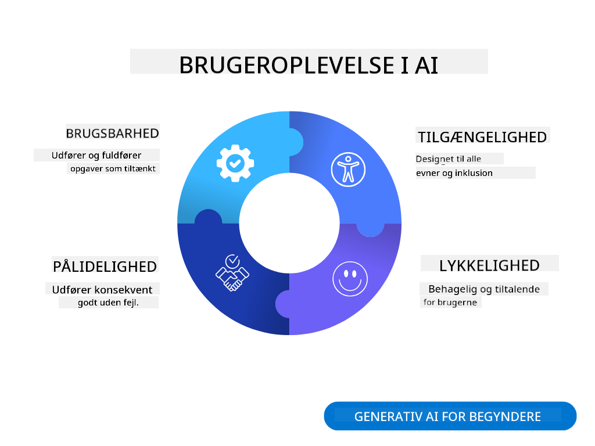
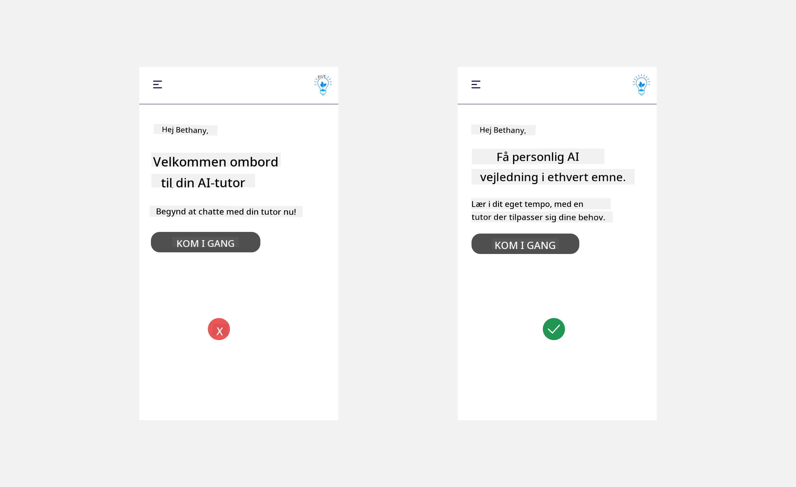
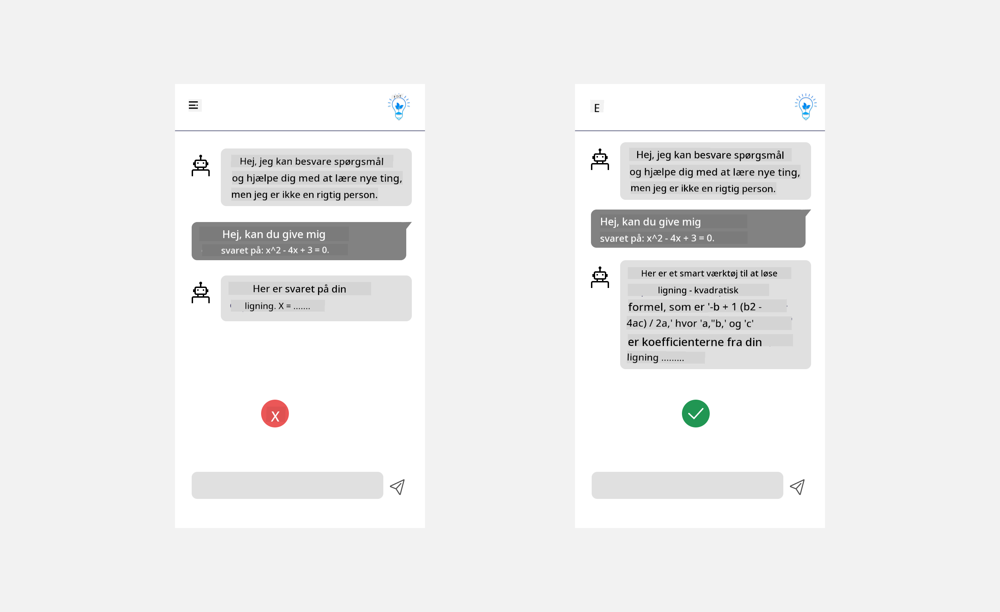
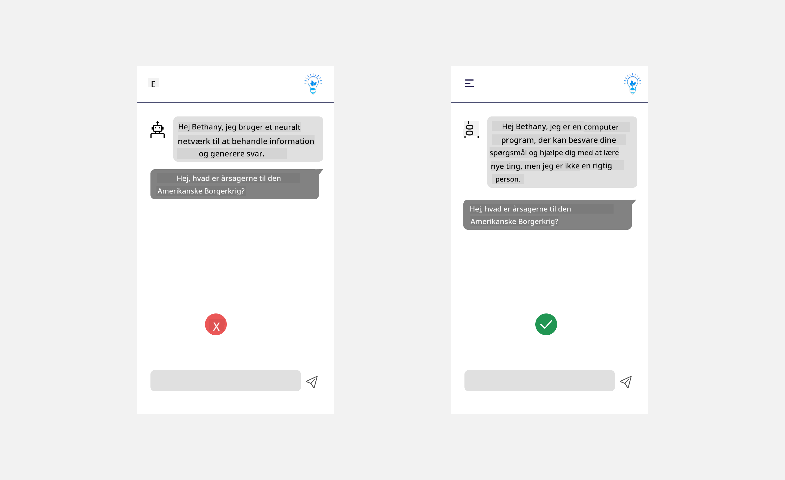
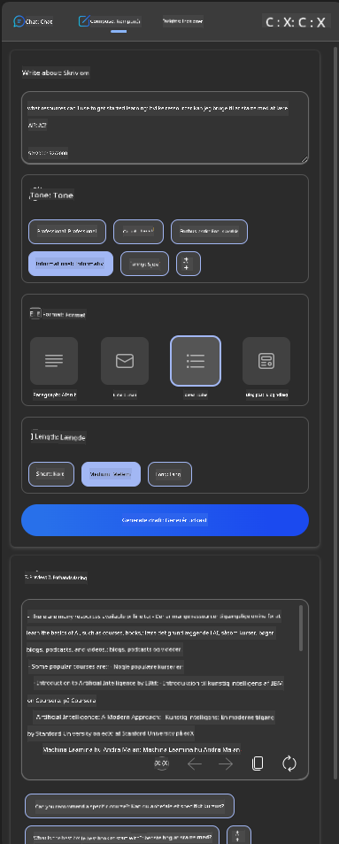
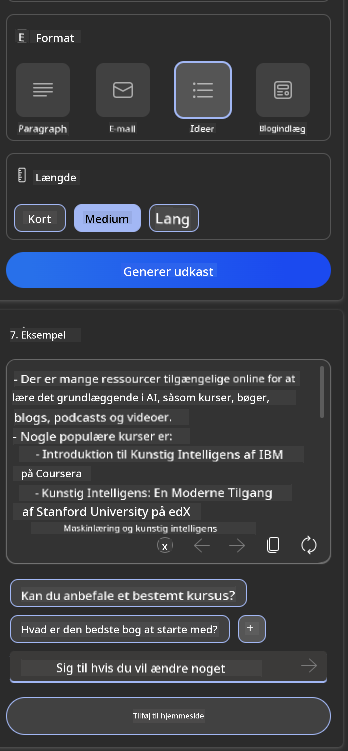
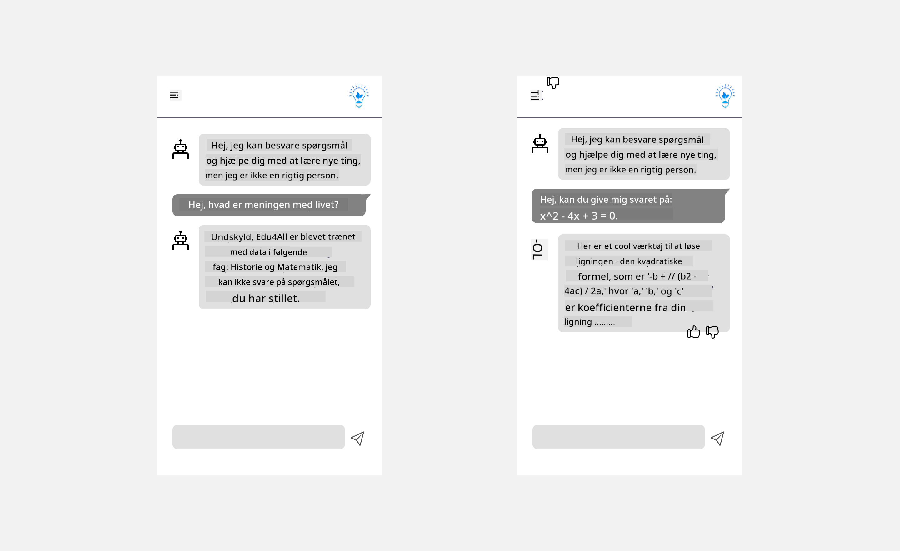

<!--
CO_OP_TRANSLATOR_METADATA:
{
  "original_hash": "747668e4c53d067369f06e9ec2e6313e",
  "translation_date": "2025-08-26T17:32:22+00:00",
  "source_file": "12-designing-ux-for-ai-applications/README.md",
  "language_code": "da"
}
-->
# Design af brugeroplevelse til AI-applikationer

> _(Klik på billedet ovenfor for at se videoen til denne lektion)_

Brugeroplevelse er en meget vigtig del af at bygge apps. Brugerne skal kunne bruge din app effektivt til at udføre opgaver. Det er én ting at være effektiv, men du skal også designe apps, så de kan bruges af alle, og gøre dem _tilgængelige_. Dette kapitel fokuserer på dette område, så du forhåbentlig ender med at designe en app, som folk kan og har lyst til at bruge.

## Introduktion

Brugeroplevelse handler om, hvordan en bruger interagerer med og bruger et bestemt produkt eller en tjeneste, uanset om det er et system, et værktøj eller et design. Når man udvikler AI-applikationer, fokuserer udviklere ikke kun på at sikre, at brugeroplevelsen er effektiv, men også etisk. I denne lektion gennemgår vi, hvordan man bygger kunstig intelligens (AI)-applikationer, der imødekommer brugernes behov.

Lektionens indhold:

- Introduktion til brugeroplevelse og forståelse af brugerbehov
- Design af AI-applikationer med fokus på tillid og gennemsigtighed
- Design af AI-applikationer med fokus på samarbejde og feedback

## Læringsmål

Når du har gennemført denne lektion, kan du:

- Forstå, hvordan man bygger AI-applikationer, der opfylder brugerens behov.
- Designe AI-applikationer, der fremmer tillid og samarbejde.

### Forudsætning

Tag dig tid til at læse mere om [brugeroplevelse og design thinking.](https://learn.microsoft.com/training/modules/ux-design?WT.mc_id=academic-105485-koreyst)

## Introduktion til brugeroplevelse og forståelse af brugerbehov

I vores fiktive uddannelses-startup har vi to primære brugere: lærere og elever. Hver af de to brugere har unikke behov. Et brugercentreret design prioriterer brugeren og sikrer, at produkterne er relevante og gavnlige for dem, de er tiltænkt.

Applikationen skal være **nyttig, pålidelig, tilgængelig og behagelig** for at give en god brugeroplevelse.

### Brugervenlighed

At være nyttig betyder, at applikationen har funktioner, der matcher dens formål, som f.eks. at automatisere bedømmelsesprocessen eller generere flashcards til repetition. En applikation, der automatiserer bedømmelse, skal kunne tildele karakterer til elevernes arbejde præcist og effektivt ud fra foruddefinerede kriterier. Tilsvarende skal en applikation, der genererer flashcards, kunne skabe relevante og varierede spørgsmål ud fra sine data.

### Pålidelighed

At være pålidelig betyder, at applikationen kan udføre sin opgave konsekvent og uden fejl. Men AI er, ligesom mennesker, ikke perfekt og kan lave fejl. Applikationer kan støde på fejl eller uventede situationer, der kræver menneskelig indgriben eller korrektion. Hvordan håndterer du fejl? I sidste del af denne lektion ser vi på, hvordan AI-systemer og -applikationer designes til samarbejde og feedback.

### Tilgængelighed

At være tilgængelig betyder, at brugeroplevelsen udvides til brugere med forskellige evner, herunder personer med handicap, så ingen bliver udeladt. Ved at følge retningslinjer og principper for tilgængelighed bliver AI-løsninger mere inkluderende, brugbare og gavnlige for alle brugere.

### Behagelig

At være behagelig betyder, at applikationen er rar at bruge. En indbydende brugeroplevelse kan have en positiv effekt på brugeren, opmuntre dem til at vende tilbage til applikationen og øge virksomhedens indtjening.

Ikke alle udfordringer kan løses med AI. AI bruges til at forbedre brugeroplevelsen, f.eks. ved at automatisere manuelle opgaver eller personalisere brugeroplevelser.

## Design af AI-applikationer med fokus på tillid og gennemsigtighed

At opbygge tillid er afgørende, når man designer AI-applikationer. Tillid sikrer, at brugeren er tryg ved, at applikationen løser opgaven, leverer resultater konsekvent, og at resultaterne er relevante for brugeren. En risiko her er mistillid og overdreven tillid. Mistillid opstår, når en bruger har lidt eller ingen tillid til et AI-system, hvilket kan føre til, at brugeren afviser din applikation. Overdreven tillid opstår, når en bruger overvurderer AI-systemets evner og stoler for meget på det. For eksempel kan et automatiseret bedømmelsessystem ved overdreven tillid føre til, at læreren ikke gennemgår nogle af opgaverne for at sikre, at systemet fungerer korrekt. Det kan resultere i uretfærdige eller upræcise karakterer til eleverne eller mistede muligheder for feedback og forbedring.

To måder at sikre, at tillid er i centrum for designet, er forklarbarhed og kontrol.

### Forklarbarhed

Når AI hjælper med at træffe beslutninger, som f.eks. at give viden til kommende generationer, er det vigtigt, at lærere og forældre forstår, hvordan AI-beslutninger træffes. Det er forklarbarhed – at forstå, hvordan AI-applikationer træffer beslutninger. At designe for forklarbarhed indebærer at tilføje detaljer, der viser, hvordan AI er nået frem til resultatet. Publikum skal være klar over, at resultatet er genereret af AI og ikke af et menneske. For eksempel, i stedet for at sige "Start chat med din tutor nu", kan du sige "Brug AI-tutoren, der tilpasser sig dine behov og hjælper dig med at lære i dit eget tempo."

Et andet eksempel er, hvordan AI bruger bruger- og persondata. For eksempel kan en bruger med personaen "elev" have begrænsninger baseret på sin rolle. AI'en må måske ikke afsløre svar på spørgsmål, men kan hjælpe brugeren med at tænke over, hvordan de kan løse et problem.

En sidste vigtig del af forklarbarhed er at gøre forklaringerne enkle. Elever og lærere er måske ikke AI-eksperter, så forklaringer om, hvad applikationen kan og ikke kan, bør være enkle og lette at forstå.

### Kontrol

Generativ AI skaber et samarbejde mellem AI og brugeren, hvor brugeren f.eks. kan ændre prompts for at få forskellige resultater. Når et output er genereret, skal brugeren også kunne ændre resultatet, så de har en følelse af kontrol. For eksempel kan du, når du bruger Bing, tilpasse din prompt ud fra format, tone og længde. Du kan også tilføje ændringer til dit output og justere resultatet, som vist nedenfor:

En anden funktion i Bing, der giver brugeren kontrol over applikationen, er muligheden for at vælge, om AI må bruge ens data. I en skoleapplikation kan en elev f.eks. vælge at bruge sine egne noter samt lærerens ressourcer som repetitionsmateriale.

> Når du designer AI-applikationer, er det vigtigt at være bevidst om, at brugerne ikke får en overdreven tillid og sætter urealistiske forventninger til AI'ens evner. En måde at gøre dette på er ved at skabe friktion mellem prompt og resultat. Mind brugeren om, at dette er AI og ikke et menneske.

## Design af AI-applikationer med fokus på samarbejde og feedback

Som nævnt tidligere skaber generativ AI et samarbejde mellem brugeren og AI. De fleste interaktioner sker ved, at brugeren indtaster en prompt, og AI'en genererer et output. Hvad hvis outputtet er forkert? Hvordan håndterer applikationen fejl, hvis de opstår? Skylder AI'en skylden på brugeren, eller tager den sig tid til at forklare fejlen?

AI-applikationer bør bygges til at modtage og give feedback. Det hjælper ikke kun AI-systemet med at blive bedre, men opbygger også tillid hos brugerne. En feedback-loop bør indgå i designet, f.eks. en simpel tommel op eller ned på outputtet.

En anden måde at håndtere dette på er at kommunikere systemets muligheder og begrænsninger tydeligt. Når en bruger laver en fejl og beder om noget, der ligger uden for AI'ens evner, bør der også være en måde at håndtere dette på, som vist nedenfor.

Systemfejl er almindelige i applikationer, hvor brugeren kan have brug for hjælp til information uden for AI'ens område, eller applikationen kan have en grænse for, hvor mange spørgsmål/emner en bruger kan få opsummeret. For eksempel kan en AI-applikation, der kun er trænet med data om bestemte fag, f.eks. historie og matematik, ikke svare på spørgsmål om geografi. For at håndtere dette kan AI-systemet svare: "Beklager, vores produkt er trænet med data inden for følgende fag....., jeg kan ikke svare på det spørgsmål, du har stillet."

AI-applikationer er ikke perfekte, og de vil lave fejl. Når du designer dine applikationer, skal du sørge for at skabe mulighed for feedback fra brugerne og håndtering af fejl på en enkel og letforståelig måde.

## Opgave

Tag en af de AI-apps, du har bygget indtil nu, og overvej at implementere nedenstående trin i din app:

- **Behagelig:** Overvej, hvordan du kan gøre din app mere behagelig. Tilføjer du forklaringer alle steder? Opmuntrer du brugeren til at udforske? Hvordan formulerer du dine fejlmeddelelser?

- **Brugervenlighed:** Hvis du bygger en webapp, så sørg for, at din app kan navigeres både med mus og tastatur.

- **Tillid og gennemsigtighed:** Stol ikke blindt på AI og dens output, overvej hvordan du kan inddrage et menneske i processen for at verificere outputtet. Overvej og implementer også andre måder at opnå tillid og gennemsigtighed på.

- **Kontrol:** Giv brugeren kontrol over de data, de giver til applikationen. Implementer en måde, hvor brugeren kan vælge at deltage eller fravælge dataindsamling i AI-applikationen.

## Fortsæt din læring!

Når du har gennemført denne lektion, kan du tage et kig på vores [Generativ AI læringssamling](https://aka.ms/genai-collection?WT.mc_id=academic-105485-koreyst) for at fortsætte med at styrke din viden om generativ AI!

Gå videre til Lektion 13, hvor vi ser på, hvordan man [sikrer AI-applikationer](../13-securing-ai-applications/README.md?WT.mc_id=academic-105485-koreyst)!

---

**Ansvarsfraskrivelse**:  
Dette dokument er blevet oversat ved hjælp af AI-oversættelsestjenesten [Co-op Translator](https://github.com/Azure/co-op-translator). Selvom vi bestræber os på nøjagtighed, skal du være opmærksom på, at automatiserede oversættelser kan indeholde fejl eller unøjagtigheder. Det originale dokument på dets oprindelige sprog bør betragtes som den autoritative kilde. For kritiske oplysninger anbefales professionel menneskelig oversættelse. Vi er ikke ansvarlige for misforståelser eller fejltolkninger, der måtte opstå ved brug af denne oversættelse.