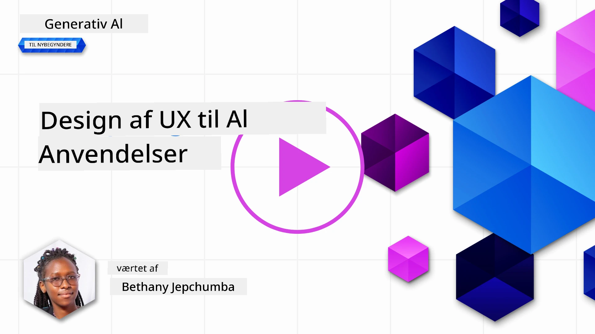
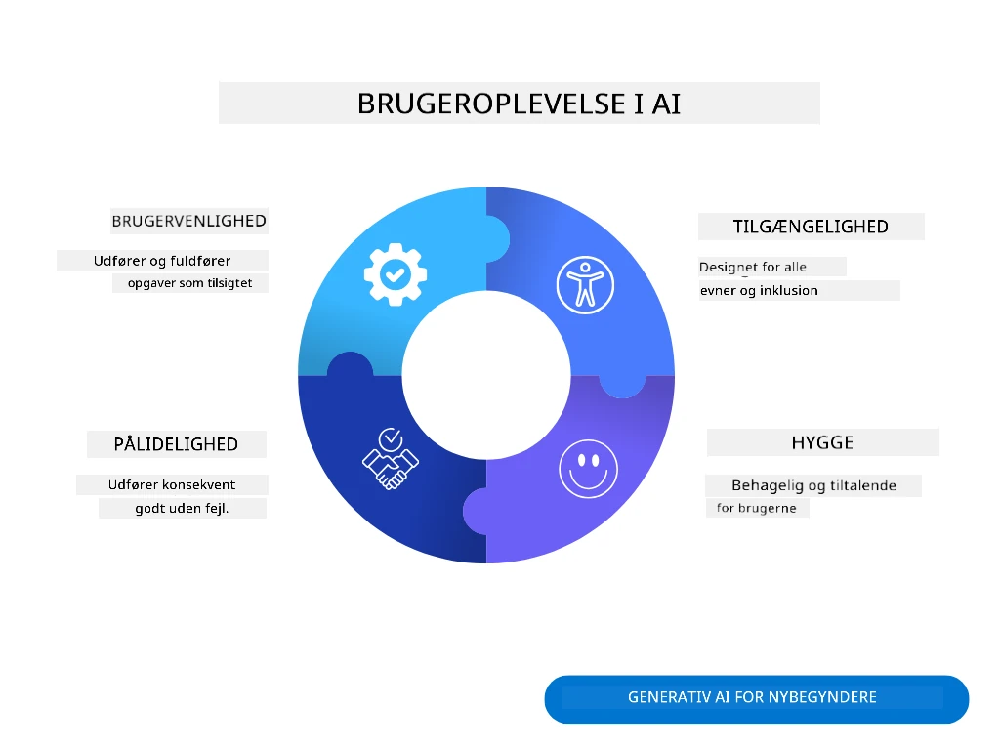
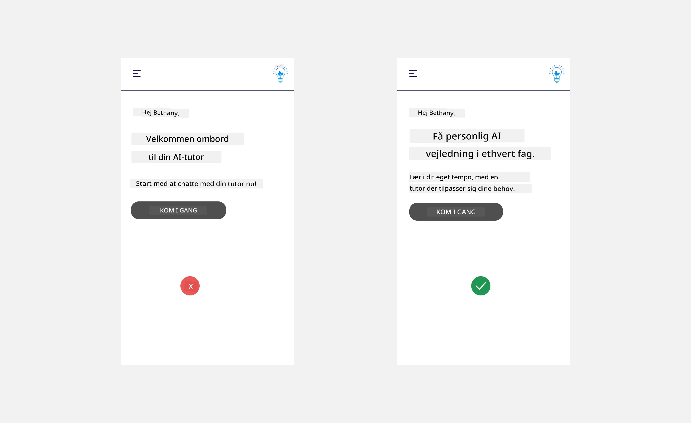
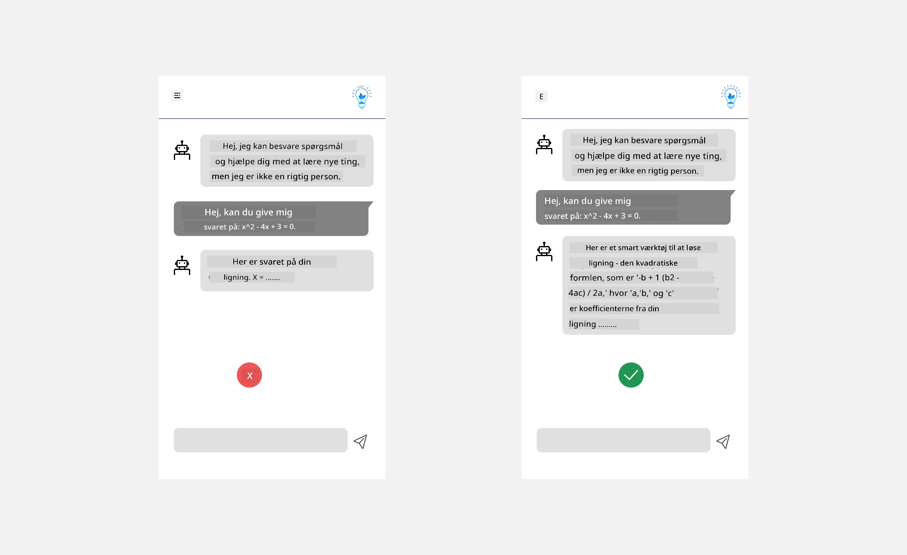
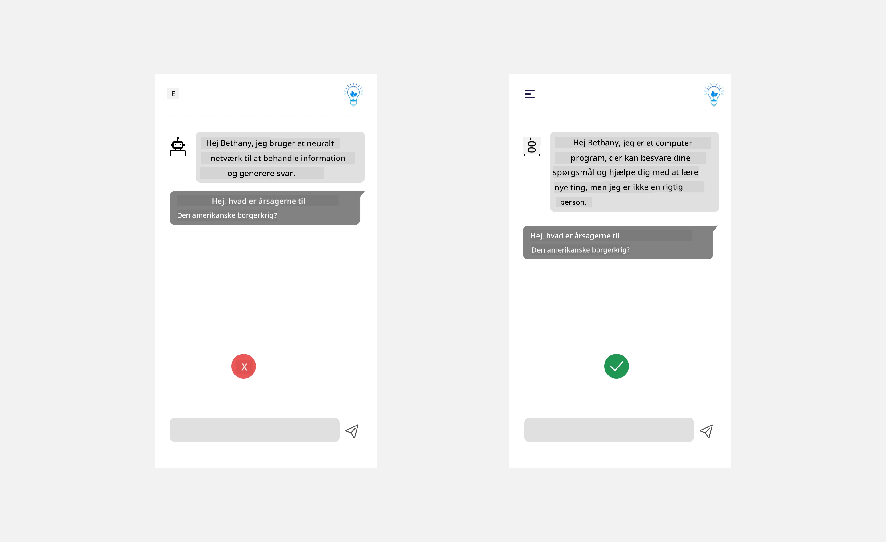
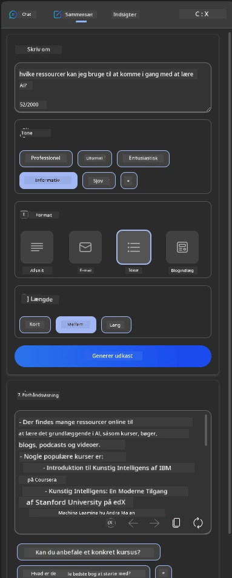
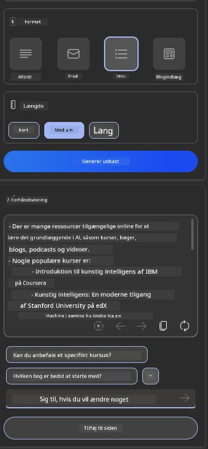
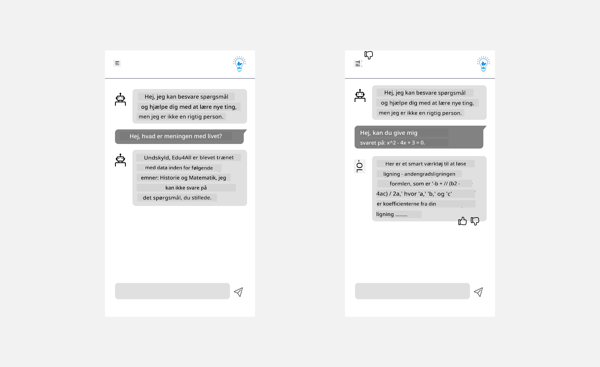

# Design af UX til AI-applikationer

> _(Klik på billedet ovenfor for at se video af denne lektion)_

Brugeroplevelse er et meget vigtigt aspekt ved opbygning af apps. Brugerne skal kunne bruge din app på en effektiv måde for at udføre opgaver. At være effektiv er én ting, men du skal også designe apps, så de kan bruges af alle, for at gøre dem _tilgængelige_. Dette kapitel vil fokusere på dette område, så du forhåbentlig ender med at designe en app, som folk kan og vil bruge.

## Introduktion

Brugeroplevelse er, hvordan en bruger interagerer med og bruger et specifikt produkt eller en tjeneste, uanset om det er et system, et værktøj eller et design. Når man udvikler AI-applikationer, fokuserer udviklere ikke kun på at sikre, at brugeroplevelsen er effektiv, men også etisk. I denne lektion gennemgår vi, hvordan man bygger kunstig intelligens (AI)-applikationer, der imødekommer brugerbehov.

Lektionen vil dække følgende områder:

- Introduktion til brugeroplevelse og forståelse af brugerbehov
- Design af AI-applikationer for tillid og gennemsigtighed
- Design af AI-applikationer for samarbejde og feedback

## Læringsmål

Efter at have taget denne lektion vil du kunne:

- Forstå, hvordan man bygger AI-applikationer, som opfylder brugerbehov.
- Designe AI-applikationer, der fremmer tillid og samarbejde.

### Forudsætning

Tag dig tid til at læse mere om [brugeroplevelse og design thinking.](https://learn.microsoft.com/training/modules/ux-design?WT.mc_id=academic-105485-koreyst)

## Introduktion til brugeroplevelse og forståelse af brugerbehov

I vores fiktive uddannelses-startup har vi to primære brugere, lærere og studerende. Hver af de to brugere har unikke behov. Et brugerdrevet design prioriterer brugeren og sikrer, at produkterne er relevante og gavnlige for dem, det er tiltænkt.

Applikationen bør være **nyttig, pålidelig, tilgængelig og behagelig** for at give en god brugeroplevelse.

### Brugervenlighed

At være nyttig betyder, at applikationen har funktionalitet, der matcher dens tiltænkte formål, som for eksempel at automatisere bedømmelsesprocessen eller generere flashcards til repetition. En applikation, der automatiserer bedømmelsesprocessen, skal kunne tildele karakterer til elevernes arbejde præcist og effektivt baseret på foruddefinerede kriterier. På samme måde skal en applikation, der genererer repetitionsflashcards, kunne skabe relevante og varierede spørgsmål baseret på dens data.

### Pålidelighed

At være pålidelig betyder, at applikationen kan udføre sin opgave konsekvent og uden fejl. Men AI er ligesom mennesker ikke perfekt og kan være tilbøjelig til fejl. Applikationerne kan støde på fejl eller uventede situationer, som kræver menneskelig indgriben eller korrektion. Hvordan håndterer du fejl? I den sidste del af denne lektion gennemgår vi, hvordan AI-systemer og applikationer er designet til samarbejde og feedback.

### Tilgængelighed

At være tilgængelig betyder at udvide brugeroplevelsen til brugere med forskellige evner, inklusive dem med handicap, så ingen bliver udeladt. Ved at følge tilgængelighedsguidelines og principper bliver AI-løsninger mere inkluderende, brugbare og gavnlige for alle brugere.

### Behagelig

At være behagelig betyder, at applikationen er fornøjelig at bruge. En tiltalende brugeroplevelse kan have en positiv indflydelse på brugeren ved at opmuntre dem til at vende tilbage til applikationen og øge forretningens indtægter.

Ikke alle udfordringer kan løses med AI. AI kommer ind for at supplere din brugeroplevelse, hvad enten det er ved at automatisere manuelle opgaver eller personliggøre brugeroplevelser.

## Design af AI-applikationer for tillid og gennemsigtighed

At skabe tillid er afgørende, når man designer AI-applikationer. Tillid sikrer, at en bruger har tillid til, at applikationen får arbejdet gjort, leverer resultater konsekvent, og at resultaterne er, hvad brugeren har brug for. En risiko på dette område er mistillid og overtrust. Mistillid opstår, når en bruger har ringe eller ingen tillid til et AI-system, hvilket fører til, at brugeren afviser din applikation. Overtrust opstår, når en bruger overvurderer kapaciteten af et AI-system, hvilket fører til, at brugerne stoler for meget på AI-systemet. For eksempel kan et automatiseret bedømmelsessystem i tilfælde af overtrust føre til, at læreren ikke korrekturlæser nogle af opgaverne for at sikre, at bedømmelsessystemet fungerer godt. Dette kan resultere i uretfærdige eller unøjagtige karakterer til eleverne eller mistede muligheder for feedback og forbedring.

To måder at sikre, at tillid placeres i centrum for designet, er forklarbarhed og kontrol.

### Forklarbarhed

Når AI hjælper med at informere beslutninger som at videreformidle viden til kommende generationer, er det vigtigt for lærere og forældre at forstå, hvordan AI-beslutninger træffes. Dette er forklarbarhed - forståelse af, hvordan AI-applikationer træffer beslutninger. Design med henblik på forklarbarhed inkluderer at tilføje detaljer, der fremhæver, hvordan AI nåede frem til outputtet. Publikum skal være klar over, at outputtet genereres af AI og ikke af et menneske. For eksempel, i stedet for at sige "Start med at chatte med din tutor nu", sig "Brug AI-tutor, der tilpasser sig dine behov og hjælper dig med at lære i dit tempo."

Et andet eksempel er, hvordan AI bruger bruger- og personlige data. For eksempel kan en bruger med rollen som studerende have begrænsninger baseret på deres persona. AI'en kan muligvis ikke afsløre svar på spørgsmål, men kan hjælpe med at guide brugeren til at tænke over, hvordan de kan løse et problem.

En sidste vigtig del af forklarbarhed er forenklingen af forklaringer. Elever og lærere er måske ikke AI-eksperter, derfor bør forklaringer af, hvad applikationen kan eller ikke kan gøre, være forenklede og letforståelige.

### Kontrol

Generativ AI skaber et samarbejde mellem AI og brugeren, hvor for eksempel en bruger kan modificere prompts for forskellige resultater. Derudover, når et output er genereret, bør brugerne kunne ændre resultaterne, hvilket giver dem en følelse af kontrol. For eksempel, når du bruger Microsoft Copilot (tidligere Bing Chat), kan du tilpasse din prompt baseret på format, tone og længde. Derudover kan du tilføje ændringer til dit output og modificere outputtet som vist nedenfor:

En anden funktion i Microsoft Copilot, der giver brugeren kontrol over applikationen, er muligheden for at til- og fravælge den data, som AI'en bruger. For en skoleapplikation kan en studerende ønske at bruge deres noter såvel som lærernes ressourcer som repetitionsmateriale.

> Når AI-applikationer designes, er intentionen afgørende for at sikre, at brugerne ikke overtror og opstiller urealistiske forventninger til dens kapaciteter. En måde at gøre dette på er ved at skabe friktion mellem prompts og resultater. At minde brugeren om, at dette er AI og ikke et medmenneske.

## Design af AI-applikationer for samarbejde og feedback

Som tidligere nævnt skaber generativ AI et samarbejde mellem brugeren og AI. Det meste af interaktionen er med en bruger, der indtaster et prompt, og AI'en der genererer et output. Hvad hvis outputtet er forkert? Hvordan håndterer applikationen fejl, hvis de opstår? Skyder AI'en skylden på brugeren, eller tager den sig tid til at forklare fejlen?

AI-applikationer bør bygges til at modtage og give feedback. Dette hjælper ikke kun AI-systemet med at forbedre sig, men opbygger også tillid hos brugerne. En feedbacksløkke bør inkluderes i designet, et eksempel kan være en simpel tommel op eller ned på outputtet.

En anden måde at håndtere dette på er klart at kommunikere systemets kapaciteter og begrænsninger. Når en bruger laver en fejl ved at anmode om noget ud over AI'ens kapaciteter, burde der også være en måde at håndtere dette på, som vist nedenfor.

Systemfejl er almindelige i applikationer, hvor brugeren måske har brug for hjælp med information uden for AI'ens rækkevidde, eller applikationen kan have en begrænsning på, hvor mange spørgsmål/emner en bruger kan generere sammenfatninger om. For eksempel kan en AI-applikation, der er trænet med data om begrænsede emner som Historie og Matematik, måske ikke kunne håndtere spørgsmål om Geografi. For at afbøde dette kan AI-systemet give et svar som: "Beklager, vores produkt er trænet med data inden for følgende fag....., jeg kan ikke svare på det spørgsmål, du stillede."

AI-applikationer er ikke perfekte, derfor vil de uundgåeligt lave fejl. Når du designer dine applikationer, bør du sikre, at der skabes plads til feedback fra brugerne og fejlhåndtering på en måde, der er enkel og let at forklare.

## Opgave

Tag alle AI-apps, du har bygget indtil nu, og overvej at implementere nedenstående trin i din app:

- **Behagelig:** Overvej, hvordan du kan gøre din app mere behagelig. Tilføjer du forklaringer overalt? Opmuntrer du brugeren til at udforske? Hvordan formulerer du dine fejlmeddelelser?

- **Brugervenlighed:** Hvis du bygger en webapp: Sørg for, at din app kan navigeres både med mus og tastatur.

- **Tillid og gennemsigtighed:** Stol ikke fuldstændigt på AI og dens output; overvej, hvordan du kan tilføje et menneske i processen til at verificere outputtet. Overvej også og implementer andre måder at opnå tillid og gennemsigtighed på.

- **Kontrol:** Giv brugeren kontrol over de data, de leverer til applikationen. Implementer en måde, hvorpå en bruger kan til- og fravælge dataindsamling i AI-applikationen.

<!-- ## [Post-lecture quiz](../../../12-designing-ux-for-ai-applications/quiz-url) -->

## Fortsæt din læring!

Efter at have gennemført denne lektion kan du tjekke vores [Generative AI Learning collection](https://aka.ms/genai-collection?WT.mc_id=academic-105485-koreyst) for at fortsætte med at styrke din viden om generativ AI!

Gå videre til Lektion 13, hvor vi ser på, hvordan man [sikrer AI-applikationer](../13-securing-ai-applications/README.md?WT.mc_id=academic-105485-koreyst)!

---

<!-- CO-OP TRANSLATOR DISCLAIMER START -->
**Ansvarsfraskrivelse**:
Dette dokument er blevet oversat ved hjælp af AI-oversættelsestjenesten [Co-op Translator](https://github.com/Azure/co-op-translator). Selvom vi bestræber os på nøjagtighed, skal du være opmærksom på, at automatiserede oversættelser kan indeholde fejl eller unøjagtigheder. Det originale dokument på dets oprindelige sprog bør betragtes som den autoritative kilde. For kritisk information anbefales professionel menneskelig oversættelse. Vi påtager os intet ansvar for misforståelser eller fejltolkninger, der opstår som følge af brugen af denne oversættelse.
<!-- CO-OP TRANSLATOR DISCLAIMER END -->