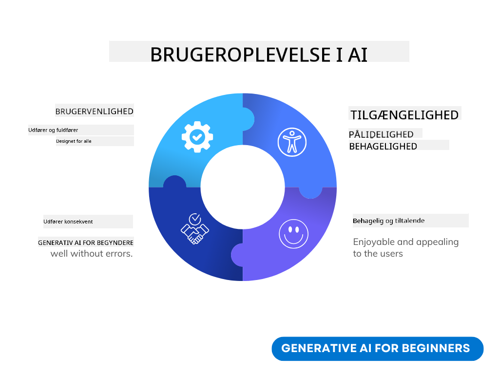
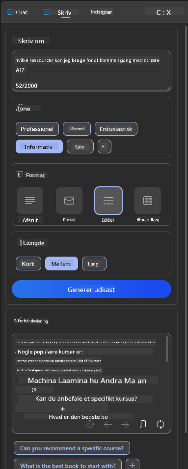
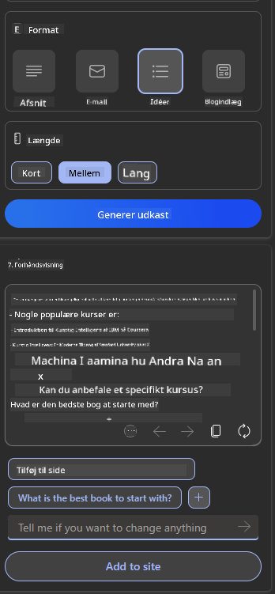

<!--
CO_OP_TRANSLATOR_METADATA:
{
  "original_hash": "ec385b41ee50579025d50cc03bfb3a25",
  "translation_date": "2025-07-09T14:59:06+00:00",
  "source_file": "12-designing-ux-for-ai-applications/README.md",
  "language_code": "da"
}
-->
# Design af UX til AI-applikationer

> _(Klik på billedet ovenfor for at se videoen til denne lektion)_

Brugeroplevelse er en meget vigtig del af at bygge apps. Brugere skal kunne bruge din app på en effektiv måde for at udføre opgaver. At være effektiv er én ting, men du skal også designe apps, så de kan bruges af alle, for at gøre dem _tilgængelige_. Dette kapitel vil fokusere på dette område, så du forhåbentlig ender med at designe en app, som folk både kan og vil bruge.

## Introduktion

Brugeroplevelse handler om, hvordan en bruger interagerer med og bruger et specifikt produkt eller en tjeneste, hvad enten det er et system, værktøj eller design. Når man udvikler AI-applikationer, fokuserer udviklere ikke kun på at sikre, at brugeroplevelsen er effektiv, men også etisk. I denne lektion gennemgår vi, hvordan man bygger kunstig intelligens (AI) applikationer, der imødekommer brugerens behov.

Lektionens indhold omfatter:

- Introduktion til brugeroplevelse og forståelse af brugerbehov
- Design af AI-applikationer med fokus på tillid og gennemsigtighed
- Design af AI-applikationer til samarbejde og feedback

## Læringsmål

Efter at have gennemført denne lektion vil du kunne:

- Forstå, hvordan man bygger AI-applikationer, der opfylder brugerens behov.
- Designe AI-applikationer, der fremmer tillid og samarbejde.

### Forudsætning

Tag dig tid til at læse mere om [brugeroplevelse og design thinking.](https://learn.microsoft.com/training/modules/ux-design?WT.mc_id=academic-105485-koreyst)

## Introduktion til brugeroplevelse og forståelse af brugerbehov

I vores fiktive uddannelses-startup har vi to primære brugere: lærere og elever. Hver af disse brugere har unikke behov. Et brugercentreret design prioriterer brugeren og sikrer, at produkterne er relevante og gavnlige for dem, de er tiltænkt.

Applikationen bør være **nyttig, pålidelig, tilgængelig og behagelig** for at give en god brugeroplevelse.

### Brugervenlighed

At være nyttig betyder, at applikationen har funktioner, der matcher dens tiltænkte formål, som for eksempel at automatisere bedømmelsesprocessen eller generere flashcards til repetition. En applikation, der automatiserer bedømmelsen, skal kunne tildele karakterer til elevernes arbejde præcist og effektivt baseret på foruddefinerede kriterier. På samme måde skal en applikation, der genererer flashcards, kunne skabe relevante og varierede spørgsmål baseret på dens data.

### Pålidelighed

At være pålidelig betyder, at applikationen kan udføre sin opgave konsekvent og uden fejl. Men AI, ligesom mennesker, er ikke perfekt og kan lave fejl. Applikationerne kan støde på fejl eller uventede situationer, der kræver menneskelig indgriben eller korrektion. Hvordan håndterer du fejl? I den sidste del af denne lektion vil vi gennemgå, hvordan AI-systemer og applikationer er designet til samarbejde og feedback.

### Tilgængelighed

At være tilgængelig betyder at udvide brugeroplevelsen til brugere med forskellige evner, inklusive personer med handicap, så ingen bliver udelukket. Ved at følge retningslinjer og principper for tilgængelighed bliver AI-løsninger mere inkluderende, brugbare og gavnlige for alle brugere.

### Behagelig

At være behagelig betyder, at applikationen er fornøjelig at bruge. En tiltalende brugeroplevelse kan have en positiv effekt på brugeren, opmuntre dem til at vende tilbage til applikationen og øge virksomhedens indtægter.

Ikke alle udfordringer kan løses med AI. AI kommer til for at forbedre din brugeroplevelse, hvad enten det er ved at automatisere manuelle opgaver eller personalisere brugeroplevelser.

## Design af AI-applikationer med fokus på tillid og gennemsigtighed

At opbygge tillid er afgørende, når man designer AI-applikationer. Tillid sikrer, at brugeren er tryg ved, at applikationen får arbejdet gjort, leverer resultater konsekvent, og at resultaterne er, hvad brugeren har brug for. En risiko i dette område er mistillid og overdreven tillid. Mistillid opstår, når en bruger har lidt eller ingen tillid til et AI-system, hvilket fører til, at brugeren afviser din applikation. Overdreven tillid opstår, når en bruger overvurderer et AI-systems kapacitet, hvilket får brugerne til at stole for meget på AI-systemet. For eksempel kan et automatiseret bedømmelsessystem ved overdreven tillid føre til, at læreren ikke gennemgår nogle af opgaverne for at sikre, at bedømmelsessystemet fungerer korrekt. Dette kan resultere i uretfærdige eller unøjagtige karakterer for eleverne eller mistede muligheder for feedback og forbedring.

To måder at sikre, at tillid placeres centralt i designet, er forklarbarhed og kontrol.

### Forklarbarhed

Når AI hjælper med at informere beslutninger, som for eksempel at formidle viden til kommende generationer, er det vigtigt, at lærere og forældre forstår, hvordan AI-beslutninger træffes. Det kaldes forklarbarhed – at forstå, hvordan AI-applikationer træffer beslutninger. Design for forklarbarhed inkluderer at tilføje detaljer og eksempler på, hvad en AI-applikation kan gøre. For eksempel, i stedet for "Kom i gang med AI-lærer", kan systemet bruge: "Opsummer dine noter for nemmere repetition ved hjælp af AI."

Et andet eksempel er, hvordan AI bruger bruger- og persondata. For eksempel kan en bruger med personaen elev have begrænsninger baseret på deres persona. AI’en kan måske ikke afsløre svar på spørgsmål, men kan hjælpe med at guide brugeren til at tænke over, hvordan de kan løse et problem.

En sidste vigtig del af forklarbarhed er forenkling af forklaringer. Elever og lærere er måske ikke AI-eksperter, derfor bør forklaringer på, hvad applikationen kan eller ikke kan gøre, være forenklede og lette at forstå.

### Kontrol

Generativ AI skaber et samarbejde mellem AI og brugeren, hvor en bruger for eksempel kan ændre prompts for at få forskellige resultater. Derudover bør brugere kunne ændre resultaterne, når de først er genereret, hvilket giver dem en følelse af kontrol. For eksempel, når du bruger Bing, kan du tilpasse din prompt baseret på format, tone og længde. Derudover kan du tilføje ændringer til dit output og justere det, som vist nedenfor:

En anden funktion i Bing, der giver brugeren kontrol over applikationen, er muligheden for at til- og fravælge de data, AI’en bruger. For en skoleapplikation kan en elev ønske at bruge både sine egne noter og lærernes ressourcer som repetitionsmateriale.

> Når du designer AI-applikationer, er intentionen afgørende for at sikre, at brugerne ikke får overdreven tillid og dermed urealistiske forventninger til systemets kapaciteter. En måde at gøre dette på er ved at skabe friktion mellem prompts og resultater. Mind brugeren om, at dette er AI og ikke et andet menneske.

## Design af AI-applikationer til samarbejde og feedback

Som nævnt tidligere skaber generativ AI et samarbejde mellem bruger og AI. De fleste interaktioner består i, at brugeren indtaster en prompt, og AI’en genererer et output. Hvad hvis outputtet er forkert? Hvordan håndterer applikationen fejl, hvis de opstår? Skyder AI’en skylden på brugeren, eller tager den sig tid til at forklare fejlen?

AI-applikationer bør bygges til at modtage og give feedback. Det hjælper ikke kun AI-systemet med at blive bedre, men opbygger også tillid hos brugerne. En feedback-loop bør indgå i designet, for eksempel en simpel tommel op eller ned på outputtet.

En anden måde at håndtere dette på er at kommunikere systemets kapaciteter og begrænsninger klart. Når en bruger laver en fejl ved at anmode om noget, der ligger uden for AI’ens kapaciteter, bør der også være en måde at håndtere dette på, som vist nedenfor.

Systemfejl er almindelige i applikationer, hvor brugeren måske har brug for hjælp med information uden for AI’ens rækkevidde, eller hvor applikationen har en grænse for, hvor mange spørgsmål/emner en bruger kan generere opsummeringer for. For eksempel kan en AI-applikation, der er trænet med data inden for begrænsede fag som Historie og Matematik, ikke kunne håndtere spørgsmål om Geografi. For at afbøde dette kan AI-systemet give et svar som: "Beklager, vores produkt er trænet med data inden for følgende fag..., jeg kan ikke besvare det spørgsmål, du stillede."

AI-applikationer er ikke perfekte, og derfor vil de uundgåeligt lave fejl. Når du designer dine applikationer, bør du sikre, at der er plads til brugerfeedback og fejlhåndtering på en måde, der er enkel og let at forklare.

## Opgave

Tag de AI-apps, du har bygget indtil nu, og overvej at implementere følgende trin i din app:

- **Behagelig:** Overvej, hvordan du kan gøre din app mere behagelig at bruge. Tilføjer du forklaringer overalt? Opmuntrer du brugeren til at udforske? Hvordan formulerer du dine fejlmeddelelser?

- **Brugervenlighed:** Når du bygger en webapp, skal du sikre, at den kan navigeres både med mus og tastatur.

- **Tillid og gennemsigtighed:** Stol ikke blindt på AI og dets output. Overvej, hvordan du kan inddrage et menneske i processen til at verificere outputtet. Overvej og implementer også andre måder at opnå tillid og gennemsigtighed på.

- **Kontrol:** Giv brugeren kontrol over de data, de leverer til applikationen. Implementer en måde, hvorpå brugeren kan til- og fravælge dataindsamling i AI-applikationen.

## Fortsæt din læring!

Efter at have gennemført denne lektion, kan du tjekke vores [Generative AI Learning collection](https://aka.ms/genai-collection?WT.mc_id=academic-105485-koreyst) for at fortsætte med at udvikle din viden om Generativ AI!

Gå videre til Lektion 13, hvor vi ser på, hvordan man [sikrer AI-applikationer](../13-securing-ai-applications/README.md?WT.mc_id=academic-105485-koreyst)!

**Ansvarsfraskrivelse**:  
Dette dokument er blevet oversat ved hjælp af AI-oversættelsestjenesten [Co-op Translator](https://github.com/Azure/co-op-translator). Selvom vi bestræber os på nøjagtighed, bedes du være opmærksom på, at automatiserede oversættelser kan indeholde fejl eller unøjagtigheder. Det oprindelige dokument på dets modersmål bør betragtes som den autoritative kilde. For kritisk information anbefales professionel menneskelig oversættelse. Vi påtager os intet ansvar for misforståelser eller fejltolkninger, der opstår som følge af brugen af denne oversættelse.