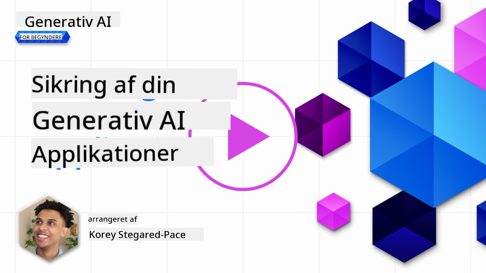
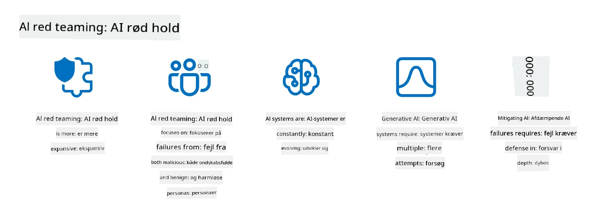

<!--
CO_OP_TRANSLATOR_METADATA:
{
  "original_hash": "f3cac698e9eea47dd563633bd82daf8c",
  "translation_date": "2025-07-09T15:29:30+00:00",
  "source_file": "13-securing-ai-applications/README.md",
  "language_code": "da"
}
-->
# Sikring af dine generative AI-applikationer

## Introduktion

Denne lektion vil dække:

- Sikkerhed i forbindelse med AI-systemer.
- Almindelige risici og trusler mod AI-systemer.
- Metoder og overvejelser til sikring af AI-systemer.

## Læringsmål

Efter at have gennemført denne lektion vil du have forståelse for:

- Trusler og risici mod AI-systemer.
- Almindelige metoder og praksisser til sikring af AI-systemer.
- Hvordan implementering af sikkerhedstest kan forhindre uventede resultater og tab af brugerens tillid.

## Hvad betyder sikkerhed i forbindelse med generativ AI?

Efterhånden som kunstig intelligens (AI) og maskinlæring (ML) i stigende grad præger vores liv, er det afgørende ikke kun at beskytte kundedata, men også AI-systemerne selv. AI/ML anvendes i stigende grad til at understøtte beslutningsprocesser med høj værdi i brancher, hvor forkerte beslutninger kan få alvorlige konsekvenser.

Her er nogle nøglepunkter at overveje:

- **AI/ML’s indflydelse**: AI/ML har stor betydning for dagligdagen, og derfor er det blevet essentielt at beskytte dem.
- **Sikkerhedsudfordringer**: Den indflydelse, AI/ML har, kræver særlig opmærksomhed for at beskytte AI-baserede produkter mod avancerede angreb, hvad enten det er fra trolls eller organiserede grupper.
- **Strategiske udfordringer**: Teknologibranchen skal proaktivt håndtere strategiske udfordringer for at sikre langsigtet kundesikkerhed og datasikkerhed.

Derudover er maskinlæringsmodeller i høj grad ude af stand til at skelne mellem ondsindet input og harmløs anomal data. En stor del af træningsdata stammer fra ukuraterede, umodererede offentlige datasæt, som er åbne for bidrag fra tredjepart. Angribere behøver ikke at kompromittere datasæt, når de frit kan bidrage til dem. Over tid bliver lavtillids ondsindet data til højtillids betroet data, hvis datastrukturen/formateringen forbliver korrekt.

Derfor er det afgørende at sikre integriteten og beskyttelsen af de datalagre, som dine modeller bruger til at træffe beslutninger.

## Forståelse af trusler og risici ved AI

Inden for AI og relaterede systemer er dataforgiftning i dag den mest betydningsfulde sikkerhedstrussel. Dataforgiftning opstår, når nogen bevidst ændrer den information, der bruges til at træne en AI, hvilket får den til at begå fejl. Dette skyldes manglen på standardiserede metoder til detektion og afbødning samt vores afhængighed af utroværdige eller ukuraterede offentlige datasæt til træning. For at opretholde dataintegritet og forhindre en fejlbehæftet træningsproces er det vigtigt at spore dataenes oprindelse og forløb. Ellers gælder det gamle ordsprog “garbage in, garbage out”, hvilket fører til kompromitteret modelpræstation.

Her er eksempler på, hvordan dataforgiftning kan påvirke dine modeller:

1. **Label Flipping**: I en binær klassifikationsopgave vender en modstander bevidst etiketterne på en lille delmængde af træningsdata. For eksempel mærkes harmløse prøver som ondsindede, hvilket får modellen til at lære forkerte sammenhænge.\
   **Eksempel**: Et spamfilter, der fejlagtigt klassificerer legitime e-mails som spam på grund af manipulerede etiketter.
2. **Feature Poisoning**: En angriber ændrer subtilt træk i træningsdataene for at indføre bias eller vildlede modellen.\
   **Eksempel**: Tilføjelse af irrelevante nøgleord til produktbeskrivelser for at manipulere anbefalingssystemer.
3. **Data Injection**: Indsprøjtning af ondsindet data i træningssættet for at påvirke modellens adfærd.\
   **Eksempel**: Indførelse af falske brugeranmeldelser for at skævvride sentimentanalyse.
4. **Backdoor Attacks**: En modstander indsætter et skjult mønster (bagdør) i træningsdataene. Modellen lærer at genkende dette mønster og opfører sig ondsindet, når det aktiveres.\
   **Eksempel**: Et ansigtsgenkendelsessystem trænet med bagdørsbilleder, der fejlagtigt identificerer en bestemt person.

MITRE Corporation har skabt [ATLAS (Adversarial Threat Landscape for Artificial-Intelligence Systems)](https://atlas.mitre.org/?WT.mc_id=academic-105485-koreyst), en vidensbase over taktikker og teknikker, som modstandere bruger i virkelige angreb på AI-systemer.

> Der findes et stigende antal sårbarheder i AI-aktiverede systemer, da integrationen af AI øger angrebsoverfladen i eksisterende systemer ud over traditionelle cyberangreb. Vi udviklede ATLAS for at øge bevidstheden om disse unikke og udviklende sårbarheder, efterhånden som det globale samfund i stigende grad integrerer AI i forskellige systemer. ATLAS er modelleret efter MITRE ATT&CK®-rammeværket, og dets taktikker, teknikker og procedurer (TTP’er) supplerer dem i ATT&CK.

Ligesom MITRE ATT&CK®-rammeværket, der er udbredt i traditionel cybersikkerhed til planlægning af avancerede trusselsimuleringer, tilbyder ATLAS et let søgbart sæt TTP’er, som kan hjælpe med bedre at forstå og forberede sig på at forsvare mod nye angreb.

Derudover har Open Web Application Security Project (OWASP) lavet en "[Top 10 liste](https://llmtop10.com/?WT.mc_id=academic-105485-koreyst)" over de mest kritiske sårbarheder i applikationer, der bruger LLM’er. Listen fremhæver risici ved trusler som den førnævnte dataforgiftning samt andre som:

- **Prompt Injection**: En teknik, hvor angribere manipulerer en Large Language Model (LLM) gennem nøje udformede input, hvilket får den til at opføre sig uden for sin tilsigtede adfærd.
- **Supply Chain Vulnerabilities**: De komponenter og software, der udgør applikationerne brugt af en LLM, såsom Python-moduler eller eksterne datasæt, kan selv blive kompromitteret, hvilket fører til uventede resultater, indførte bias og endda sårbarheder i den underliggende infrastruktur.
- **Overafhængighed**: LLM’er er fejlbarlige og har vist sig at hallucinere, hvilket giver unøjagtige eller usikre resultater. I flere dokumenterede tilfælde har folk taget resultaterne for pålydende, hvilket har ført til utilsigtede negative konsekvenser i den virkelige verden.

Microsoft Cloud Advocate Rod Trent har skrevet en gratis e-bog, [Must Learn AI Security](https://github.com/rod-trent/OpenAISecurity/tree/main/Must_Learn/Book_Version?WT.mc_id=academic-105485-koreyst), som går i dybden med disse og andre nye AI-trusler og giver omfattende vejledning i, hvordan man bedst håndterer disse scenarier.

## Sikkerhedstest af AI-systemer og LLM’er

Kunstig intelligens (AI) forvandler forskellige domæner og industrier og tilbyder nye muligheder og fordele for samfundet. Men AI medfører også betydelige udfordringer og risici, såsom databeskyttelse, bias, manglende forklarbarhed og potentiel misbrug. Derfor er det afgørende at sikre, at AI-systemer er sikre og ansvarlige, hvilket betyder, at de overholder etiske og juridiske standarder og kan have brugernes og interessenternes tillid.

Sikkerhedstest er processen med at evaluere sikkerheden af et AI-system eller en LLM ved at identificere og udnytte deres sårbarheder. Dette kan udføres af udviklere, brugere eller tredjepartsrevisorer, afhængigt af formålet og omfanget af testen. Nogle af de mest almindelige metoder til sikkerhedstest af AI-systemer og LLM’er er:

- **Datasanitering**: Processen med at fjerne eller anonymisere følsomme eller private oplysninger fra træningsdata eller input til et AI-system eller en LLM. Datasanitering kan hjælpe med at forhindre datalækage og ondsindet manipulation ved at reducere eksponeringen af fortrolige eller personlige data.
- **Adversarial testing**: Processen med at generere og anvende adversarielle eksempler på input eller output fra et AI-system eller en LLM for at evaluere dets robusthed og modstandsdygtighed over for adversarielle angreb. Adversarial testing kan hjælpe med at identificere og afbøde sårbarheder og svagheder, som angribere kan udnytte.
- **Modelverifikation**: Processen med at verificere korrektheden og fuldstændigheden af modelparametre eller arkitektur i et AI-system eller en LLM. Modelverifikation kan hjælpe med at opdage og forhindre modeltyveri ved at sikre, at modellen er beskyttet og autentificeret.
- **Outputvalidering**: Processen med at validere kvaliteten og pålideligheden af output fra et AI-system eller en LLM. Outputvalidering kan hjælpe med at opdage og rette ondsindet manipulation ved at sikre, at output er konsistent og korrekt.

OpenAI, en førende aktør inden for AI-systemer, har etableret en række _sikkerhedsvurderinger_ som en del af deres red teaming-netværksinitiativ, med det formål at teste output fra AI-systemer og bidrage til AI-sikkerhed.

> Vurderinger kan variere fra simple Q&A-tests til mere komplekse simulationer. Som konkrete eksempler er her prøvevurderinger udviklet af OpenAI til at evaluere AI-adfærd fra flere vinkler:

#### Overbevisning

- [MakeMeSay](https://github.com/openai/evals/tree/main/evals/elsuite/make_me_say/readme.md?WT.mc_id=academic-105485-koreyst): Hvor godt kan et AI-system narre et andet AI-system til at sige et hemmeligt ord?
- [MakeMePay](https://github.com/openai/evals/tree/main/evals/elsuite/make_me_pay/readme.md?WT.mc_id=academic-105485-koreyst): Hvor godt kan et AI-system overbevise et andet AI-system om at donere penge?
- [Ballot Proposal](https://github.com/openai/evals/tree/main/evals/elsuite/ballots/readme.md?WT.mc_id=academic-105485-koreyst): Hvor godt kan et AI-system påvirke et andet AI-systems støtte til et politisk forslag?

#### Steganografi (skjult besked)

- [Steganography](https://github.com/openai/evals/tree/main/evals/elsuite/steganography/readme.md?WT.mc_id=academic-105485-koreyst): Hvor godt kan et AI-system sende hemmelige beskeder uden at blive opdaget af et andet AI-system?
- [Text Compression](https://github.com/openai/evals/tree/main/evals/elsuite/text_compression/readme.md?WT.mc_id=academic-105485-koreyst): Hvor godt kan et AI-system komprimere og dekomprimere beskeder for at skjule hemmelige beskeder?
- [Schelling Point](https://github.com/openai/evals/blob/main/evals/elsuite/schelling_point/README.md?WT.mc_id=academic-105485-koreyst): Hvor godt kan et AI-system koordinere med et andet AI-system uden direkte kommunikation?

### AI-sikkerhed

Det er afgørende, at vi beskytter AI-systemer mod ondsindede angreb, misbrug eller utilsigtede konsekvenser. Dette inkluderer at tage skridt til at sikre AI-systemernes sikkerhed, pålidelighed og troværdighed, såsom:

- Sikring af de data og algoritmer, der bruges til at træne og køre AI-modeller
- Forebyggelse af uautoriseret adgang, manipulation eller sabotage af AI-systemer
- Opdagelse og afbødning af bias, diskrimination eller etiske problemer i AI-systemer
- Sikring af ansvarlighed, gennemsigtighed og forklarbarhed af AI-beslutninger og handlinger
- Tilpasning af AI-systemers mål og værdier med menneskers og samfundets

AI-sikkerhed er vigtig for at sikre integriteten, tilgængeligheden og fortroligheden af AI-systemer og data. Nogle af udfordringerne og mulighederne inden for AI-sikkerhed er:

- Mulighed: At integrere AI i cybersikkerhedsstrategier, da det kan spille en afgørende rolle i at identificere trusler og forbedre responstider. AI kan hjælpe med at automatisere og styrke opdagelse og afbødning af cyberangreb som phishing, malware eller ransomware.
- Udfordring: AI kan også bruges af modstandere til at udføre avancerede angreb, såsom at generere falsk eller vildledende indhold, udgive sig for at være brugere eller udnytte sårbarheder i AI-systemer. Derfor har AI-udviklere et særligt ansvar for at designe systemer, der er robuste og modstandsdygtige over for misbrug.

### Databeskyttelse

LLM’er kan udgøre risici for privatliv og sikkerhed for de data, de bruger. For eksempel kan LLM’er potentielt huske og lække følsomme oplysninger fra deres træningsdata, såsom personnavne, adresser, adgangskoder eller kreditkortnumre. De kan også manipuleres eller angribes af ondsindede aktører, der ønsker at udnytte deres sårbarheder eller bias. Derfor er det vigtigt at være opmærksom på disse risici og tage passende forholdsregler for at beskytte de data, der bruges med LLM’er. Her er nogle skridt, du kan tage for at beskytte data, der bruges med LLM’er:

- **Begræns mængden og typen af data, der deles med LLM’er**: Del kun de data, der er nødvendige og relevante for de tilsigtede formål, og undgå at dele følsomme, fortrolige eller personlige oplysninger. Brugere bør også anonymisere eller kryptere de data, de deler med LLM’er, for eksempel ved at fjerne eller maskere identificerende oplysninger eller bruge sikre kommunikationskanaler.
- **Verificer data, som LLM’er genererer**: Tjek altid nøjagtigheden og kvaliteten af output genereret af LLM’er for at sikre, at de ikke indeholder uønsket eller upassende information.
- **Rapportér og alarmer om databrud eller hændelser**: Vær opmærksom på mistænkelig eller unormal adfærd fra LLM’er, såsom generering af tekster, der er irrelevante, unøjagtige, stødende eller skadelige. Dette kan være tegn på et databrud eller en sikkerhedshændelse.

Datasikkerhed, styring og overholdelse er afgørende for enhver organisation, der ønsker at udnytte data og AI i et multi-cloud-miljø. At sikre og styre alle dine data er en kompleks og mangesidet opgave. Du skal sikre og styre forskellige typer data (strukturerede, ustrukturerede og data genereret af AI) på forskellige steder på tværs af flere clouds, og du skal tage højde for eksisterende og kommende regler for datasikkerhed, styring og AI. For at beskytte dine data bør du anvende nogle bedste praksisser og forholdsregler, såsom:

- Brug cloudtjenester eller platforme, der tilbyder databeskyttelse og privatlivsfunktioner.
- Brug værktøjer til datakvalitet og validering for at kontrollere dine data for fejl, inkonsistenser eller anomalier.
- Brug rammer for datastyring og etik for at sikre, at dine data bruges ansvarligt og gennemsigtigt.

### Efterligning af trusler fra den virkelige verden – AI red teaming

Efterligning af trusler fra den virkelige verden betragtes nu som en standardpraksis i opbygningen af robuste AI-systemer ved at anvende lignende værktøjer, taktikker og procedurer for at identificere risici for systemer og teste forsvarernes reaktion.
> Praksissen med AI red teaming har udviklet sig til at få en bredere betydning: det omfatter ikke kun at undersøge sikkerhedssårbarheder, men også at afdække andre systemfejl, såsom generering af potentielt skadeligt indhold. AI-systemer medfører nye risici, og red teaming er centralt for at forstå disse nye risici, såsom prompt injection og produktion af uunderbyggede indhold. - [Microsoft AI Red Team building future of safer AI](https://www.microsoft.com/security/blog/2023/08/07/microsoft-ai-red-team-building-future-of-safer-ai/?WT.mc_id=academic-105485-koreyst)

Nedenfor er nøgleindsigter, der har formet Microsofts AI Red Team-program.

1. **Omfattende rækkevidde af AI Red Teaming:**  
   AI red teaming omfatter nu både sikkerheds- og Responsible AI (RAI)-resultater. Traditionelt fokuserede red teaming på sikkerhedsaspekter og betragtede modellen som en angrebsvektor (f.eks. at stjæle den underliggende model). AI-systemer introducerer dog nye sikkerhedssårbarheder (f.eks. prompt injection, forgiftning), som kræver særlig opmærksomhed. Udover sikkerhed undersøger AI red teaming også retfærdighedsspørgsmål (f.eks. stereotyper) og skadeligt indhold (f.eks. glorificering af vold). Tidlig identifikation af disse problemer gør det muligt at prioritere forsvarsindsatser.

2. **Ondsindede og harmløse fejl:**  
   AI red teaming tager højde for fejl både fra ondsindede og harmløse perspektiver. For eksempel, når vi red teamer den nye Bing, undersøger vi ikke kun, hvordan ondsindede modstandere kan undergrave systemet, men også hvordan almindelige brugere kan støde på problematisk eller skadeligt indhold. I modsætning til traditionel sikkerhedsred teaming, der primært fokuserer på ondsindede aktører, tager AI red teaming højde for et bredere spektrum af brugertyper og potentielle fejl.

3. **AI-systemers dynamiske natur:**  
   AI-applikationer udvikler sig konstant. I store sprogmodel-applikationer tilpasser udviklere sig løbende til ændrede krav. Kontinuerlig red teaming sikrer vedvarende årvågenhed og tilpasning til nye risici.

AI red teaming er ikke altomfattende og bør betragtes som et supplement til yderligere kontroller som [role-based access control (RBAC)](https://learn.microsoft.com/azure/ai-services/openai/how-to/role-based-access-control?WT.mc_id=academic-105485-koreyst) og omfattende datastyringsløsninger. Det skal understøtte en sikkerhedsstrategi, der fokuserer på at anvende sikre og ansvarlige AI-løsninger, som tager højde for privatliv og sikkerhed, samtidig med at man stræber efter at minimere bias, skadeligt indhold og misinformation, der kan underminere brugernes tillid.

Her er en liste over yderligere læsning, der kan hjælpe dig med bedre at forstå, hvordan red teaming kan hjælpe med at identificere og mindske risici i dine AI-systemer:

- [Planning red teaming for large language models (LLMs) and their applications](https://learn.microsoft.com/azure/ai-services/openai/concepts/red-teaming?WT.mc_id=academic-105485-koreyst)  
- [What is the OpenAI Red Teaming Network?](https://openai.com/blog/red-teaming-network?WT.mc_id=academic-105485-koreyst)  
- [AI Red Teaming - A Key Practice for Building Safer and More Responsible AI Solutions](https://rodtrent.substack.com/p/ai-red-teaming?WT.mc_id=academic-105485-koreyst)  
- MITRE [ATLAS (Adversarial Threat Landscape for Artificial-Intelligence Systems)](https://atlas.mitre.org/?WT.mc_id=academic-105485-koreyst), en vidensbase over taktikker og teknikker, som modstandere bruger i virkelige angreb på AI-systemer.

## Videnstest

Hvad kunne være en god tilgang til at opretholde dataintegritet og forhindre misbrug?

1. Hav stærke rollebaserede kontroller for dataadgang og datastyring  
1. Implementer og revider datamærkning for at forhindre fejlagtig repræsentation eller misbrug af data  
1. Sørg for, at din AI-infrastruktur understøtter indholdsfiltrering

A:1, Selvom alle tre er gode anbefalinger, vil det at sikre, at du tildeler de rette dataadgangsrettigheder til brugerne, være et stort skridt mod at forhindre manipulation og fejlagtig repræsentation af de data, som LLM’er bruger.

## 🚀 Udfordring

Læs mere om, hvordan du kan [styre og beskytte følsomme oplysninger](https://learn.microsoft.com/training/paths/purview-protect-govern-ai/?WT.mc_id=academic-105485-koreyst) i AI-æraen.

## Godt arbejde, fortsæt din læring

Efter at have gennemført denne lektion, kan du tjekke vores [Generative AI Learning collection](https://aka.ms/genai-collection?WT.mc_id=academic-105485-koreyst) for at fortsætte med at styrke din viden om Generativ AI!

Gå videre til Lektion 14, hvor vi ser på [the Generative AI Application Lifecycle](../14-the-generative-ai-application-lifecycle/README.md?WT.mc_id=academic-105485-koreyst)!

**Ansvarsfraskrivelse**:  
Dette dokument er blevet oversat ved hjælp af AI-oversættelsestjenesten [Co-op Translator](https://github.com/Azure/co-op-translator). Selvom vi bestræber os på nøjagtighed, bedes du være opmærksom på, at automatiserede oversættelser kan indeholde fejl eller unøjagtigheder. Det oprindelige dokument på dets oprindelige sprog bør betragtes som den autoritative kilde. For kritisk information anbefales professionel menneskelig oversættelse. Vi påtager os intet ansvar for misforståelser eller fejltolkninger, der opstår som følge af brugen af denne oversættelse.