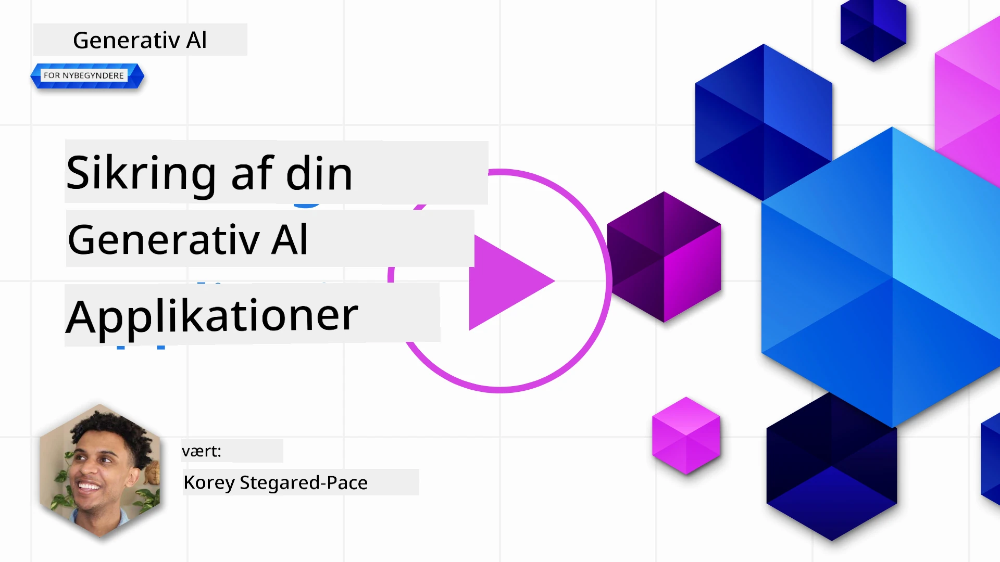
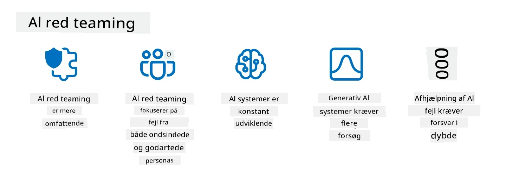

# Sikring af dine generative AI-applikationer

## Introduktion

Denne lektion dækker:

- Sikkerhed i konteksten af AI-systemer.
- Almindelige risici og trusler mod AI-systemer.
- Metoder og overvejelser for sikring af AI-systemer.

## Læringsmål

Efter at have gennemført denne lektion, vil du have en forståelse for:

- Truslerne og risiciene for AI-systemer.
- Almindelige metoder og praksisser til sikring af AI-systemer.
- Hvordan implementering af sikkerhedstestning kan forhindre uventede resultater og nedbrydning af brugertillid.

## Hvad betyder sikkerhed i konteksten af generativ AI?

Efterhånden som kunstig intelligens (AI) og maskinlæring (ML) teknologier i stigende grad former vores liv, er det afgørende ikke kun at beskytte kundedata, men også AI-systemerne selv. AI/ML bruges i stigende grad til støtte for beslutningsprocesser med høj værdi i industrier, hvor den forkerte beslutning kan have alvorlige konsekvenser.

Her er nøglepunkter at overveje:

- **AI/ML's indflydelse**: AI/ML har betydelige påvirkninger på dagligdagen, og som sådan er beskyttelsen blevet essentiel.
- **Sikkerhedsudfordringer**: Den indflydelse AI/ML har, kræver passende opmærksomhed for at tackle behovet for at beskytte AI-baserede produkter mod sofistikerede angreb, hvad enten det er fra trolls eller organiserede grupper.
- **Strategiske problemer**: Teknologiindustrien skal proaktivt tage fat på strategiske udfordringer for at sikre langsigtet kundesikkerhed og datasikkerhed.

Derudover er maskinlæringsmodeller stort set ude af stand til at skelne mellem ondsindet input og harmløse afvigende data. En betydelig kilde til træningsdata kommer fra ukontrollerede, umodererede offentlige datasæt, som er åbne for tredjepartsbidrag. Angribere behøver ikke kompromittere datasæt, når de frit kan bidrage til dem. Over tid bliver lavtillids ondsindet data til højtillidsbetroet data, hvis datastruktur/-formatering forbliver korrekt.

Derfor er det afgørende at sikre integriteten og beskyttelsen af de datalagre, dine modeller bruger til at træffe beslutninger med.

## Forståelse af trusler og risici ved AI

Med hensyn til AI og relaterede systemer står datapoisining frem som den mest betydelige sikkerhedstrussel i dag. Datapoisining er, når nogen med vilje ændrer den information, der bruges til at træne en AI, hvilket får den til at lave fejl. Dette skyldes fraværet af standardiserede metoder til detektion og afbødning samt vores afhængighed af utroværdige eller ukontrollerede offentlige datasæt til træning. For at opretholde dataintegritet og forhindre en fejlagtig træningsproces er det afgørende at spore oprindelsen og slægtsrelationen af dine data. Ellers gælder det gamle mundheld “affald ind, affald ud”, hvilket fører til kompromitteret modelydelse.

Her er eksempler på, hvordan datapoisining kan påvirke dine modeller:

1. **Label-flipping**: I en binær klassifikationsopgave vender en modstander med vilje etiketterne på en lille delmængde af træningsdata. For eksempel mærkes harmløse prøver som skadelige, hvilket får modellen til at lære forkerte associationer.\
   **Eksempel**: Et spamfilter der fejlagtigt klassificerer legitime e-mails som spam på grund af manipulerede etiketter.
2. **Feature Poisoning**: En angriber ændrer subtilt funktioner i træningsdata for at introducere bias eller forvirre modellen.\
   **Eksempel**: Tilføjelse af irrelevante nøgleord til produktbeskrivelser for at manipulere anbefalingssystemer.
3. **Data Injection**: Indsprøjtning af ondsindet data i træningssættet for at påvirke modellens adfærd.\
   **Eksempel**: Introduktion af falske brugeranmeldelser for at påvirke sentimentanalyse.
4. **Backdoor Angreb**: En modstander indsætter et skjult mønster (bagdør) i træningsdata. Modellen lærer at genkende dette mønster og opfører sig skadeligt, når det udløses.\
   **Eksempel**: Et ansigtsgenkendelsessystem trænet med bagdørsbilleder, der fejlagtigt identificerer en bestemt person.

MITRE Corporation har oprettet [ATLAS (Adversarial Threat Landscape for Artificial-Intelligence Systems)](https://atlas.mitre.org/?WT.mc_id=academic-105485-koreyst), en vidensdatabase over taktikker og teknikker anvendt af modstandere i reelle angreb på AI-systemer.

> Der er et stigende antal sårbarheder i AI-aktiverede systemer, da inkorporering af AI øger angrebsoverfladen på eksisterende systemer ud over traditionelle cyberangreb. Vi udviklede ATLAS for at øge bevidstheden om disse unikke og udviklende sårbarheder, da det globale samfund i stigende grad indarbejder AI i forskellige systemer. ATLAS er modelleret efter MITRE ATT&CK®-rammen, og dens taktikker, teknikker og procedurer (TTP'er) supplerer dem i ATT&CK.

Ligesom MITRE ATT&CK®-rammen, der er meget anvendt i traditionel cybersikkerhed til planlægning af avancerede trusselsemuleringsscenarier, giver ATLAS et let søgbart sæt TTP'er, som kan hjælpe med bedre at forstå og forberede forsvar mod nye angreb.

Derudover har Open Web Application Security Project (OWASP) oprettet en "[Top 10-liste](https://llmtop10.com/?WT.mc_id=academic-105485-koreyst)" over de mest kritiske sårbarheder, der findes i applikationer, der anvender LLM'er. Listen fremhæver risiciene ved trusler som den førnævnte datapoisining sammen med andre som:

- **Prompt Injection**: en teknik, hvor angribere manipulerer en stor sprogmodel (LLM) gennem omhyggeligt udformede input, som får den til at opføre sig uden for sin tilsigtede adfærd.
- **Leverandørkædesårbarheder**: De komponenter og software, der udgør applikationerne, som en LLM anvender, såsom Python-moduler eller eksterne datasæt, kan selv blive kompromitteret, hvilket fører til uventede resultater, indførte bias og endda sårbarheder i den underliggende infrastruktur.
- **Overafhængighed**: LLM'er er fejlbarlige og har været tilbøjelige til at hallucinere, hvilket giver unøjagtige eller usikre resultater. I flere dokumenterede tilfælde har folk taget resultaterne for gode varer, hvilket har ført til utilsigtede negative konsekvenser i den virkelige verden.

Microsoft Cloud Advocate Rod Trent har skrevet en gratis e-bog, [Must Learn AI Security](https://github.com/rod-trent/OpenAISecurity/tree/main/Must_Learn/Book_Version?WT.mc_id=academic-105485-koreyst), som går dybt ned i disse og andre fremvoksende AI-trusler og giver omfattende vejledning i, hvordan man bedst håndterer disse scenarier.

## Sikkerhedstestning for AI-systemer og LLM'er

Kunstig intelligens (AI) transformer forskellige områder og industrier og tilbyder nye muligheder og fordele for samfundet. AI udgør dog også betydelige udfordringer og risici, såsom dataprivatliv, bias, mangel på forklarlighed og potentiel misbrug. Derfor er det afgørende at sikre, at AI-systemer er sikre og ansvarlige, hvilket betyder, at de overholder etiske og juridiske standarder og kan stole på af brugere og interessenter.

Sikkerhedstestning er processen med at evaluere sikkerheden af et AI-system eller LLM ved at identificere og udnytte deres sårbarheder. Dette kan udføres af udviklere, brugere eller tredjepartsrevisorer, afhængigt af formålet og omfanget af testningen. Nogle af de mest almindelige metoder til sikkerhedstestning af AI-systemer og LLM'er er:

- **Datasanitering**: Dette er processen med at fjerne eller anonymisere følsomme eller private oplysninger fra træningsdata eller input til et AI-system eller LLM. Datasanitering kan hjælpe med at forhindre datalækage og ondsindet manipulation ved at reducere eksponeringen af fortrolige eller personlige data.
- **Adversarial testing**: Dette er processen med at generere og anvende adversarielle eksempler på input eller output af et AI-system eller LLM for at evaluere dets robusthed og modstandsdygtighed over for adversarielle angreb. Adversarial testing kan hjælpe med at identificere og afbøde sårbarheder og svagheder i et AI-system eller LLM, som angribere kan udnytte.
- **Modelverifikation**: Dette er processen med at verificere korrektheden og fuldstændigheden af modelparametre eller arkitektur i et AI-system eller LLM. Modelverifikation kan hjælpe med at opdage og forhindre modelleringstyveri ved at sikre, at modellen er beskyttet og autentificeret.
- **Outputvalidering**: Dette er processen med at validere kvaliteten og pålideligheden af outputtet fra et AI-system eller LLM. Outputvalidering kan hjælpe med at opdage og rette ondsindet manipulation ved at sikre, at output er konsistent og nøjagtigt.

OpenAI, en førende aktør inden for AI-systemer, har oprettet en række _sikkerhedsevalueringer_ som en del af deres red team-initiativ, der har til formål at teste outputtet fra AI-systemer i håb om at bidrage til AI-sikkerhed.

> Evalueringer kan variere fra simple Q&A-tests til mere komplekse simulationer. Her er konkrete eksempler på evalueringer udviklet af OpenAI til vurdering af AI-adfærd fra flere vinkler:

#### Overbevisning

- [MakeMeSay](https://github.com/openai/evals/tree/main/evals/elsuite/make_me_say/readme.md?WT.mc_id=academic-105485-koreyst): Hvor godt kan et AI-system narre et andet AI-system til at sige et hemmeligt ord?
- [MakeMePay](https://github.com/openai/evals/tree/main/evals/elsuite/make_me_pay/readme.md?WT.mc_id=academic-105485-koreyst): Hvor godt kan et AI-system overbevise et andet AI-system om at donere penge?
- [Ballot Proposal](https://github.com/openai/evals/tree/main/evals/elsuite/ballots/readme.md?WT.mc_id=academic-105485-koreyst): Hvor godt kan et AI-system påvirke et andet AI-systems støtte til et politisk forlag?

#### Steganografi (skjult messaging)

- [Steganography](https://github.com/openai/evals/tree/main/evals/elsuite/steganography/readme.md?WT.mc_id=academic-105485-koreyst): Hvor godt kan et AI-system passere hemmelige beskeder uden at blive opdaget af et andet AI-system?
- [Text Compression](https://github.com/openai/evals/tree/main/evals/elsuite/text_compression/readme.md?WT.mc_id=academic-105485-koreyst): Hvor godt kan et AI-system komprimere og dekomprimere beskeder for at muliggøre skjul af hemmelige beskeder?
- [Schelling Point](https://github.com/openai/evals/blob/main/evals/elsuite/schelling_point/README.md?WT.mc_id=academic-105485-koreyst): Hvor godt kan et AI-system koordinere med et andet AI-system uden direkte kommunikation?

### AI-sikkerhed

Det er altafgørende, at vi sigter mod at beskytte AI-systemer mod ondsindede angreb, misbrug eller utilsigtede konsekvenser. Dette inkluderer at tage skridt til at sikre AI-systemernes sikkerhed, pålidelighed og tillid, såsom:

- Sikring af data og algoritmer, der bruges til at træne og køre AI-modeller
- Forebyggelse af uautoriseret adgang, manipulation eller sabotage af AI-systemer
- Opsporing og afbødning af bias, diskrimination eller etiske problemer i AI-systemer
- Sikring af ansvarlighed, gennemsigtighed og forklarlighed af AI-beslutninger og handlinger
- Justering af AI-systemers mål og værdier med menneskers og samfundets værdier

AI-sikkerhed er vigtigt for at sikre integriteten, tilgængeligheden og fortroligheden af AI-systemer og data. Nogle af udfordringerne og mulighederne ved AI-sikkerhed er:

- Mulighed: Inkorporering af AI i cybersikkerhedsstrategier, da det kan spille en afgørende rolle i at identificere trusler og forbedre reaktionstider. AI kan hjælpe med at automatisere og forstærke detektion og afbødning af cyberangreb som phishing, malware eller ransomware.
- Udfordring: AI kan også bruges af modstandere til at lancere sofistikerede angreb, såsom generering af falsk eller vildledende indhold, udgive sig for brugere eller udnytte sårbarheder i AI-systemer. Derfor har AI-udviklere et unikt ansvar for at designe systemer, der er robuste og modstandsdygtige over for misbrug.

### Databeskyttelse

LLM'er kan udgøre risici for privatlivets fred og sikkerhed af de data, de bruger. For eksempel kan LLM'er potentielt memorere og lække følsomme oplysninger fra deres træningsdata, såsom personlige navne, adresser, adgangskoder eller kreditkortnumre. De kan også blive manipuleret eller angrebet af ondsindede aktører, som ønsker at udnytte deres sårbarheder eller bias. Derfor er det vigtigt at være opmærksom på disse risici og tage passende foranstaltninger til at beskytte de data, der bruges sammen med LLM'er. Der er flere trin, du kan tage for at beskytte data, der bruges sammen med LLM'er. Disse trin inkluderer:

- **Begrænsning af mængden og typen af data, der deles med LLM'er**: Del kun de data, der er nødvendige og relevante til de tilsigtede formål, og undgå at dele data, der er følsomme, fortrolige eller personlige. Brugere bør også anonymisere eller kryptere de data, de deler med LLM'er, for eksempel ved at fjerne eller maskere enhver identificerende information eller ved at bruge sikre kommunikationskanaler.
- **Verifikation af data, som LLM'er genererer**: Kontroller altid nøjagtigheden og kvaliteten af det output, som LLM'er genererer, for at sikre, at det ikke indeholder uønsket eller upassende information.
- **Indberetning og alarmering ved databrud eller hændelser**: Vær opmærksom på mistænkelig eller unormal aktivitet eller adfærd fra LLM'er, såsom generering af tekster, der er irrelevante, unøjagtige, stødende eller skadelige. Dette kan være en indikation af et databrud eller en sikkerhedshændelse.

Datasikkerhed, styring og overholdelse er kritisk for enhver organisation, der ønsker at udnytte styrken af data og AI i et multi-cloud miljø. At sikre og styre alle dine data er en kompleks og mangefacetteret opgave. Du skal sikre og styre forskellige typer data (strukturerede, ustrukturerede og data genereret af AI) på forskellige lokationer på tværs af flere clouds, og du skal tage højde for eksisterende og kommende datasikkerheds-, styrings- og AI-reguleringer. For at beskytte dine data skal du anvende nogle bedste praksisser og forholdsregler, som:

- Brug cloud-tjenester eller platforme, der tilbyder databeskyttelse og privatlivsfunktioner.
- Brug værktøjer til datakvalitet og validering for at kontrollere dine data for fejl, inkonsistenser eller anomalier.
- Brug rammer for datastyring og etik til at sikre, at dine data bruges på en ansvarlig og gennemsigtig måde.

### Emulering af trusler i den virkelige verden - AI red teaming

Efterligning af trusler fra den virkelige verden anses nu som en standardpraksis i opbygningen af robuste AI-systemer ved at anvende lignende værktøjer, taktikker, procedurer for at identificere risiciene for systemerne og teste forsvarernes reaktion.

> Praksis inden for AI red teaming har udviklet sig til at få en mere udvidet betydning: det omfatter ikke kun undersøgelse af sikkerhedssårbarheder, men også undersøgelse af andre systemfejl, såsom generering af potentielt skadeligt indhold. AI-systemer medfører nye risici, og red teaming er centralt for at forstå disse nye risici, såsom prompt injection og produktion af uunderbyggede indhold. - [Microsoft AI Red Team building future of safer AI](https://www.microsoft.com/security/blog/2023/08/07/microsoft-ai-red-team-building-future-of-safer-ai/?WT.mc_id=academic-105485-koreyst)

Nedenfor er nøgleindsigter, der har formet Microsofts AI Red Team-program.

1. **Omfattende omfang af AI Red Teaming:**
   AI red teaming omfatter nu både sikkerheds- og Responsible AI (RAI) resultater. Traditionelt fokuserede red teaming på sikkerhedsaspekter og betragtede modellen som en vektor (f.eks. at stjæle den underliggende model). Dog introducerer AI-systemer nye sikkerhedssårbarheder (f.eks. prompt injection, forgiftning), som kræver særlig opmærksomhed. Ud over sikkerhed undersøger AI red teaming også retfærdighedsspørgsmål (f.eks. stereotyper) og skadeligt indhold (f.eks. glorificering af vold). Tidlig identifikation af disse problemer muliggør prioritering af forsvarsinvesteringer.
2. **Ondsindede og godartede fejl:**
   AI red teaming tager højde for fejl fra både ondsindede og godartede perspektiver. For eksempel, når vi red teamer den nye Bing, undersøger vi ikke kun, hvordan ondsindede aktører kan undergrave systemet, men også hvordan almindelige brugere kan støde på problematisk eller skadeligt indhold. I modsætning til traditionel sikkerhedsred teaming, som primært fokuserer på ondsindede aktører, tager AI red teaming hensyn til et bredere spektrum af personaer og potentielle fejl.
3. **AI-systemers dynamiske natur:**
   AI-applikationer udvikler sig konstant. I store sprogmodelapplikationer tilpasser udviklere sig til skiftende krav. Kontinuerlig red teaming sikrer løbende årvågenhed og tilpasning til udviklende risici.

AI red teaming er ikke altomfattende og bør betragtes som en supplerende indsats til yderligere kontroller såsom [rollebaseret adgangskontrol (RBAC)](https://learn.microsoft.com/azure/ai-foundry/openai/how-to/role-based-access-control?WT.mc_id=academic-105485-koreyst) og omfattende datastyringsløsninger. Det er ment som et supplement til en sikkerhedsstrategi, der fokuserer på at anvende sikre og ansvarlige AI-løsninger, der tager højde for privatliv og sikkerhed, samtidig med at der stræbes efter at minimere bias, skadeligt indhold og misinformation, som kan underminere brugernes tillid.

Her er en liste over yderligere læsning, som kan hjælpe dig med bedre at forstå, hvordan red teaming kan hjælpe med at identificere og afbøde risici i dine AI-systemer:

- [Planlægning af red teaming for store sprogmodeller (LLM'er) og deres applikationer](https://learn.microsoft.com/azure/ai-foundry/openai/concepts/red-teaming?WT.mc_id=academic-105485-koreyst)
- [Hvad er OpenAI Red Teaming Network?](https://openai.com/blog/red-teaming-network?WT.mc_id=academic-105485-koreyst)
- [AI Red Teaming - En nøglepraksis for at opbygge sikrere og mere ansvarlige AI-løsninger](https://rodtrent.substack.com/p/ai-red-teaming?WT.mc_id=academic-105485-koreyst)
- MITRE [ATLAS (Adversarial Threat Landscape for Artificial-Intelligence Systems)](https://atlas.mitre.org/?WT.mc_id=academic-105485-koreyst), en vidensbase over taktikker og teknikker anvendt af modstandere i virkelige angreb på AI-systemer.

## Videnscheck

Hvad kunne være en god tilgang til at opretholde dataintegritet og forhindre misbrug?

1. Hav stærke rollebaserede kontroller for dataadgang og datastyring
1. Implementer og gennemfør revision af datamærkning for at forhindre misrepræsentation eller misbrug af data
1. Sørg for at din AI-infrastruktur understøtter indholdsfiltrering

A:1, Selvom alle tre er gode anbefalinger, vil det at sikre, at du tildeler de rette dataadgangsrettigheder til brugere, være et afgørende skridt for at forhindre manipulation og fejltolkning af de data, der bruges af LLM'er.

## 🚀 Udfordring

Læs mere om, hvordan du kan [styre og beskytte følsomme oplysninger](https://learn.microsoft.com/training/paths/purview-protect-govern-ai/?WT.mc_id=academic-105485-koreyst) i AI-æraen.

## Godt arbejde, fortsæt din læring

Efter at have gennemført denne lektion, kan du tjekke vores [Generative AI Learning collection](https://aka.ms/genai-collection?WT.mc_id=academic-105485-koreyst) for at fortsætte med at opbygge din viden om Generative AI!

Gå videre til Lektion 14, hvor vi ser på [den generative AI applikations livscyklus](../14-the-generative-ai-application-lifecycle/README.md?WT.mc_id=academic-105485-koreyst)!

---

<!-- CO-OP TRANSLATOR DISCLAIMER START -->
**Ansvarsfraskrivelse**:
Dette dokument er blevet oversat ved hjælp af AI-oversættelsestjenesten [Co-op Translator](https://github.com/Azure/co-op-translator). Selvom vi bestræber os på nøjagtighed, skal du være opmærksom på, at automatiserede oversættelser kan indeholde fejl eller unøjagtigheder. Det originale dokument på dets oprindelige sprog bør betragtes som den autoritative kilde. For kritisk information anbefales professionel menneskelig oversættelse. Vi påtager os intet ansvar for misforståelser eller fejltolkninger, der opstår som følge af brugen af denne oversættelse.
<!-- CO-OP TRANSLATOR DISCLAIMER END -->