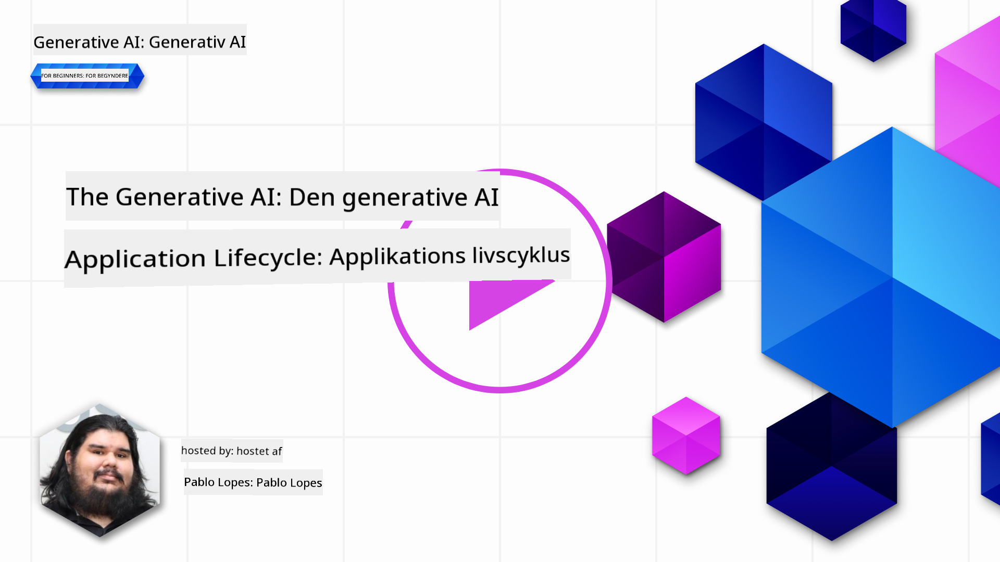
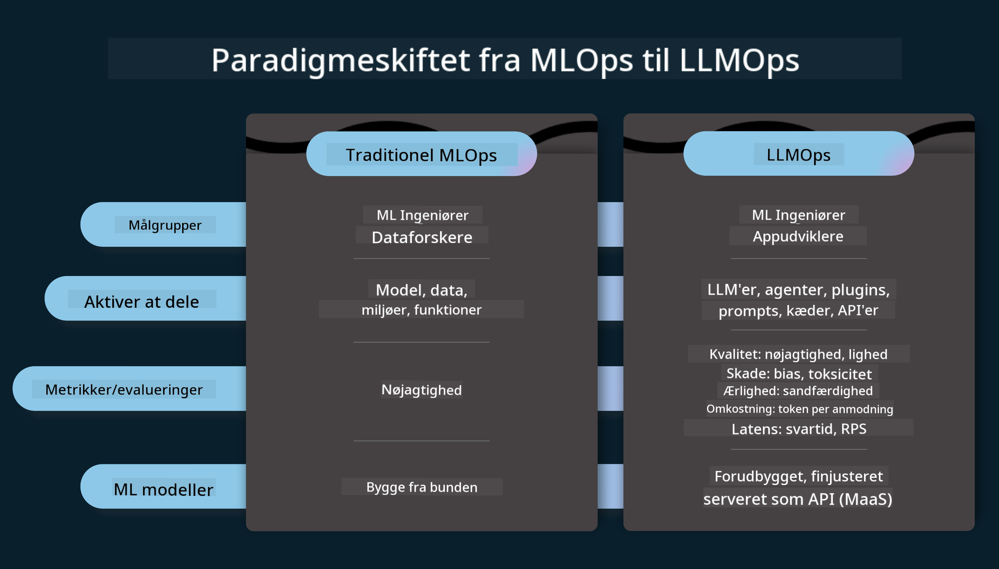
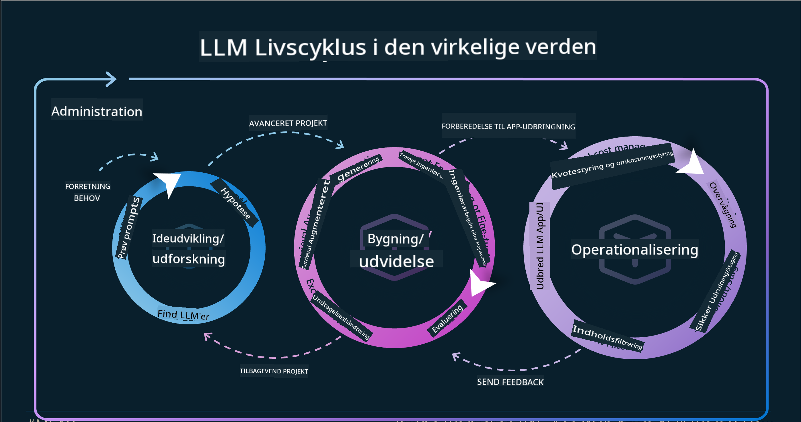
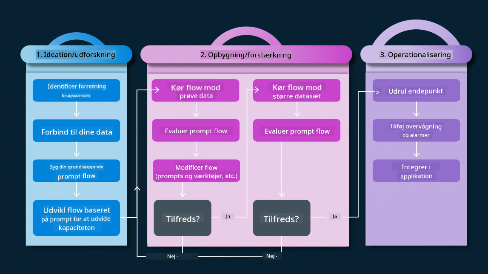
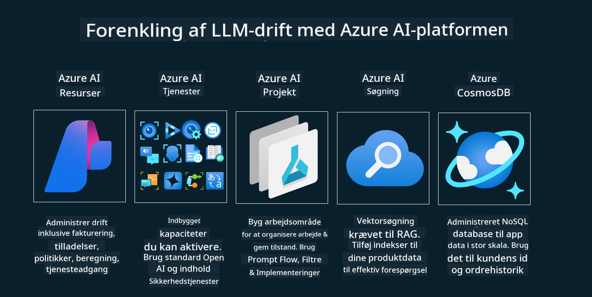
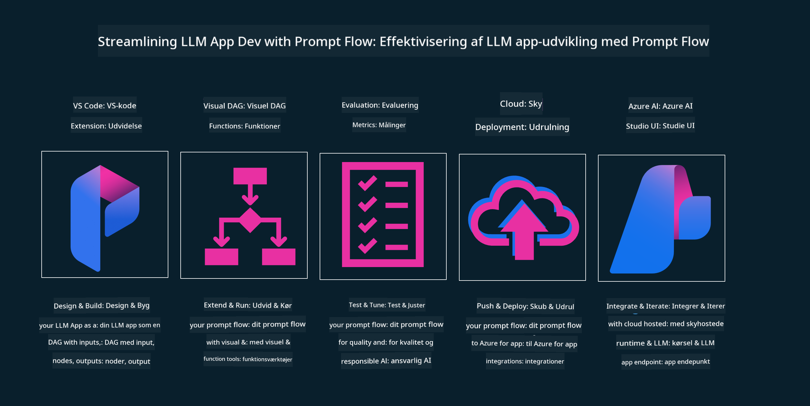

<!--
CO_OP_TRANSLATOR_METADATA:
{
  "original_hash": "27a5347a5022d5ef0a72ab029b03526a",
  "translation_date": "2025-05-19T23:29:08+00:00",
  "source_file": "14-the-generative-ai-application-lifecycle/README.md",
  "language_code": "da"
}
-->

# Den Generative AI Applikationslivscyklus

Et vigtigt spørgsmål for alle AI-applikationer er relevansen af AI-funktioner, da AI er et hurtigt udviklende felt. For at sikre, at din applikation forbliver relevant, pålidelig og robust, skal du overvåge, evaluere og forbedre den kontinuerligt. Det er her, den generative AI-livscyklus kommer ind i billedet.

Den generative AI-livscyklus er en ramme, der guider dig gennem faserne af udvikling, implementering og vedligeholdelse af en generativ AI-applikation. Den hjælper dig med at definere dine mål, måle din præstation, identificere dine udfordringer og implementere dine løsninger. Den hjælper dig også med at tilpasse din applikation til de etiske og juridiske standarder inden for dit domæne og dine interessenter. Ved at følge den generative AI-livscyklus kan du sikre, at din applikation altid leverer værdi og tilfredsstiller dine brugere.

## Introduktion

I dette kapitel vil du:

- Forstå paradigmeskiftet fra MLOps til LLMOps
- LLM Livscyklus
- Livscyklusværktøjer
- Livscyklusmetrik og evaluering

## Forstå paradigmeskiftet fra MLOps til LLMOps

LLM'er er et nyt værktøj i kunstig intelligens-arsenalet. De er utroligt kraftfulde i analyse- og generationopgaver for applikationer, men denne kraft har nogle konsekvenser for, hvordan vi effektiviserer AI- og klassiske maskinlæringsopgaver.

Med dette har vi brug for et nyt paradigme for at tilpasse dette værktøj på en dynamisk måde med de rigtige incitamenter. Vi kan kategorisere ældre AI-apps som "ML Apps" og nyere AI-apps som "GenAI Apps" eller blot "AI Apps", hvilket afspejler den mainstream-teknologi og de teknikker, der blev brugt på det tidspunkt. Dette ændrer vores fortælling på flere måder, se følgende sammenligning.

Bemærk, at i LLMOps er vi mere fokuserede på appudviklere, der bruger integrationer som et nøglepunkt, bruger "Models-as-a-Service" og tænker på følgende punkter for metrik.

- Kvalitet: Responskvalitet
- Skade: Ansvarlig AI
- Ærlighed: Responsens forankring (Giver det mening? Er det korrekt?)
- Omkostninger: Løsningens budget
- Latens: Gennemsnitlig tid for tokenrespons

## LLM Livscyklus

Først, for at forstå livscyklussen og ændringerne, lad os bemærke den næste infografik.

Som du måske bemærker, er dette anderledes end de sædvanlige livscyklusser fra MLOps. LLM'er har mange nye krav, som prompting, forskellige teknikker til at forbedre kvaliteten (Fine-Tuning, RAG, Meta-Prompts), forskellige vurderinger og ansvar med ansvarlig AI, og endelig nye evalueringsmetrikker (Kvalitet, Skade, Ærlighed, Omkostninger og Latens).

For eksempel, se på hvordan vi ideer. Brug af prompt engineering til at eksperimentere med forskellige LLM'er for at udforske muligheder for at teste, om deres hypotese kunne være korrekt.

Bemærk, at dette ikke er lineært, men integrerede sløjfer, iterative og med en overordnet cyklus.

Hvordan kunne vi udforske disse trin? Lad os gå i detaljer om, hvordan vi kunne bygge en livscyklus.

Dette kan se lidt kompliceret ud, lad os fokusere på de tre store trin først.

1. Idégenerering/Udforskning: Udforskning, her kan vi udforske i henhold til vores forretningsbehov. Prototyping, oprettelse af en [PromptFlow](https://microsoft.github.io/promptflow/index.html?WT.mc_id=academic-105485-koreyst) og test om det er effektivt nok til vores hypotese.
2. Bygning/Forstærkning: Implementering, nu begynder vi at evaluere for større datasæt, implementere teknikker som Fine-tuning og RAG for at kontrollere robustheden af vores løsning. Hvis det ikke gør det, kan det hjælpe at genimplementere det, tilføje nye trin i vores flow eller omstrukturere dataene. Efter at have testet vores flow og vores skala, hvis det fungerer og tjekker vores metrikker, er det klar til næste trin.
3. Operationalisering: Integration, nu tilføjer vi overvågnings- og alarmsystemer til vores system, implementering og applikationsintegration til vores applikation.

Derefter har vi den overordnede cyklus af ledelse, med fokus på sikkerhed, overholdelse og styring.

Tillykke, nu har du din AI-app klar til at gå og operationel. For en praktisk oplevelse, tag et kig på [Contoso Chat Demo.](https://nitya.github.io/contoso-chat/?WT.mc_id=academic-105485-koreys)

Hvilke værktøjer kunne vi nu bruge?

## Livscyklusværktøjer

For værktøjer tilbyder Microsoft [Azure AI Platform](https://azure.microsoft.com/solutions/ai/?WT.mc_id=academic-105485-koreys) og [PromptFlow](https://microsoft.github.io/promptflow/index.html?WT.mc_id=academic-105485-koreyst) for at lette og gøre din cyklus nem at implementere og klar til brug.

[Azure AI Platform](https://azure.microsoft.com/solutions/ai/?WT.mc_id=academic-105485-koreys) giver dig mulighed for at bruge [AI Studio](https://ai.azure.com/?WT.mc_id=academic-105485-koreys). AI Studio er en webportal, der giver dig mulighed for at udforske modeller, prøver og værktøjer. Administrer dine ressourcer, UI-udviklingsflows og SDK/CLI-muligheder for kode-først udvikling.

Azure AI giver dig mulighed for at bruge flere ressourcer til at administrere dine operationer, tjenester, projekter, vektorsøgning og databasebehov.

Konstruer fra Proof-of-Concept (POC) til store skala applikationer med PromptFlow:

- Design og byg apps fra VS Code med visuelle og funktionelle værktøjer
- Test og finjuster dine apps for kvalitets-AI med lethed.
- Brug Azure AI Studio til at integrere og iterere med skyen, push og implementer for hurtig integration.

## Fantastisk! Fortsæt din læring!

Fantastisk, nu kan du lære mere om, hvordan vi strukturerer en applikation til at bruge koncepterne med [Contoso Chat App](https://nitya.github.io/contoso-chat/?WT.mc_id=academic-105485-koreyst) for at se, hvordan Cloud Advocacy tilføjer disse koncepter i demonstrationer. For mere indhold, tjek vores [Ignite breakout session!
](https://www.youtube.com/watch?v=DdOylyrTOWg)

Nu, tjek Lektion 15 for at forstå, hvordan [Retrieval Augmented Generation og Vektordatabaser](../15-rag-and-vector-databases/README.md?WT.mc_id=academic-105485-koreyst) påvirker generativ AI og skaber mere engagerende applikationer!

**Ansvarsfraskrivelse**:  
Dette dokument er blevet oversat ved hjælp af AI-oversættelsestjenesten [Co-op Translator](https://github.com/Azure/co-op-translator). Selvom vi bestræber os på nøjagtighed, skal du være opmærksom på, at automatiserede oversættelser kan indeholde fejl eller unøjagtigheder. Det originale dokument på dets oprindelige sprog bør betragtes som den autoritative kilde. For kritisk information anbefales professionel menneskelig oversættelse. Vi er ikke ansvarlige for eventuelle misforståelser eller fejltolkninger, der opstår ved brugen af denne oversættelse.