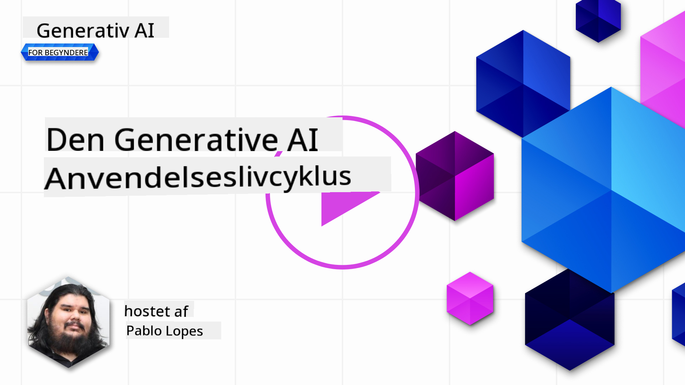
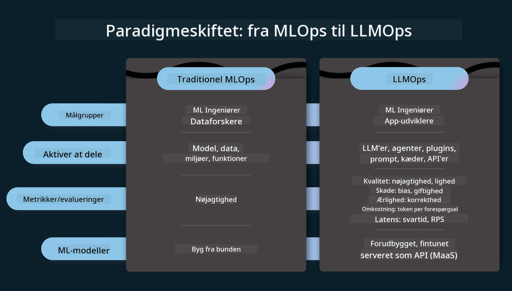
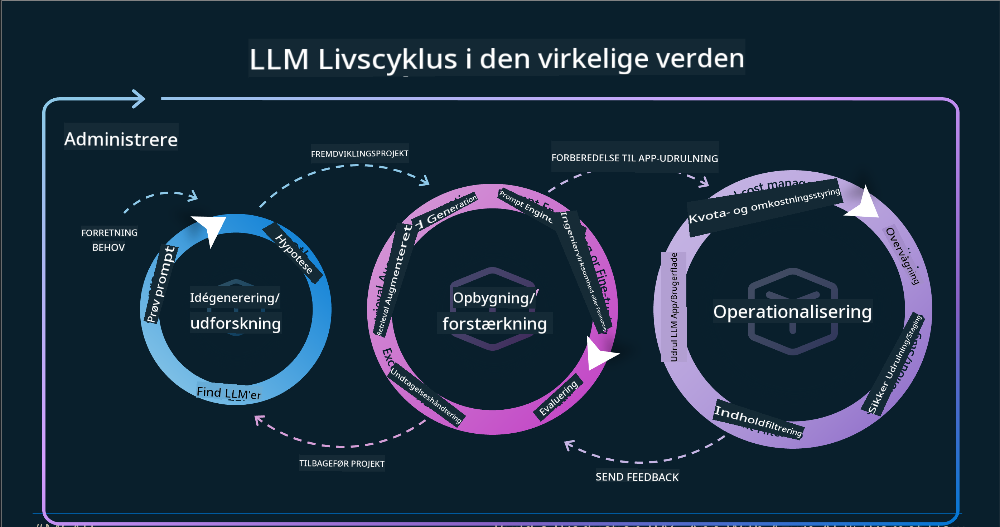
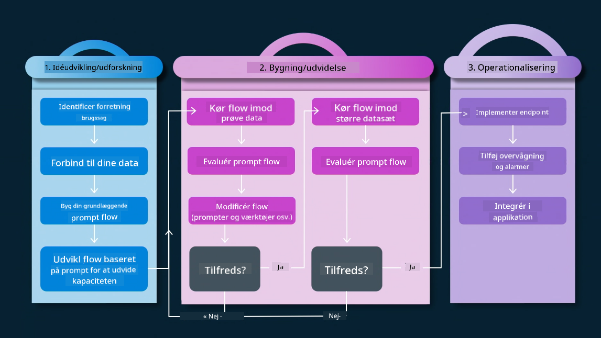
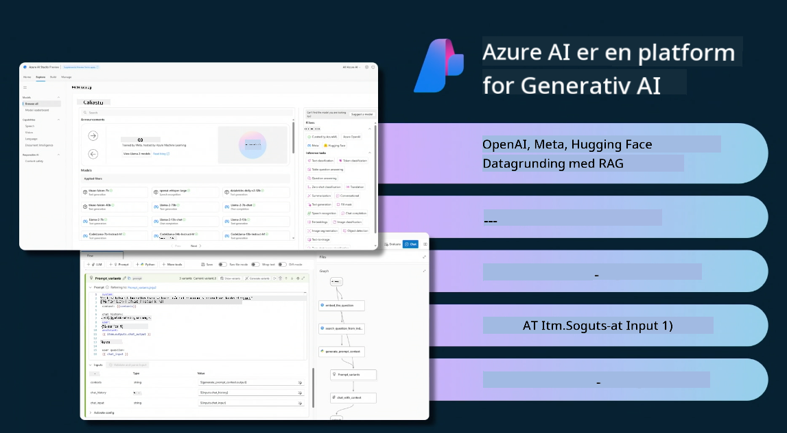
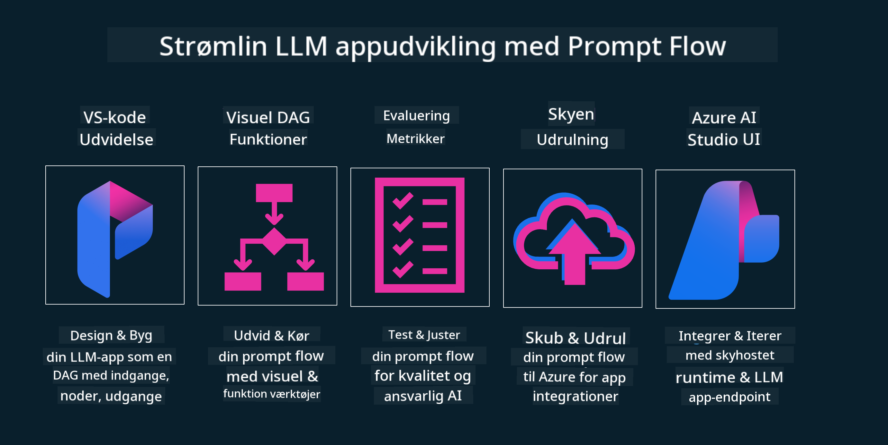

<!--
CO_OP_TRANSLATOR_METADATA:
{
  "original_hash": "27a5347a5022d5ef0a72ab029b03526a",
  "translation_date": "2025-06-25T22:04:49+00:00",
  "source_file": "14-the-generative-ai-application-lifecycle/README.md",
  "language_code": "da"
}
-->

# Livscyklussen for Generativ AI-applikationer

Et vigtigt spørgsmål for alle AI-applikationer er relevansen af AI-funktioner, da AI er et hurtigt udviklende felt. For at sikre, at din applikation forbliver relevant, pålidelig og robust, skal du overvåge, evaluere og forbedre den løbende. Det er her, den generative AI-livscyklus kommer ind i billedet.

Den generative AI-livscyklus er en ramme, der guider dig gennem faserne af udvikling, implementering og vedligeholdelse af en generativ AI-applikation. Den hjælper dig med at definere dine mål, måle din præstation, identificere dine udfordringer og implementere dine løsninger. Den hjælper dig også med at tilpasse din applikation til de etiske og juridiske standarder i dit domæne og for dine interessenter. Ved at følge den generative AI-livscyklus kan du sikre, at din applikation altid leverer værdi og tilfredsstiller dine brugere.

## Introduktion

I dette kapitel vil du:

- Forstå paradigmeskiftet fra MLOps til LLMOps
- LLM-livscyklussen
- Værktøjer til livscyklus
- Metrik og evaluering af livscyklus

## Forstå paradigmeskiftet fra MLOps til LLMOps

LLM'er er et nyt værktøj i kunstig intelligens-arsenalet, de er utroligt kraftfulde i analyse- og genereringsopgaver for applikationer, men denne kraft har nogle konsekvenser for, hvordan vi strømliner AI- og klassiske maskinlæringsopgaver.

Med dette har vi brug for et nyt paradigme til at tilpasse dette værktøj i en dynamik med de korrekte incitamenter. Vi kan kategorisere ældre AI-apps som "ML Apps" og nyere AI-apps som "GenAI Apps" eller blot "AI Apps", hvilket afspejler den mainstream teknologi og de teknikker, der blev brugt på det tidspunkt. Dette skifter vores fortælling på flere måder, se følgende sammenligning.

Bemærk, at i LLMOps fokuserer vi mere på appudviklere, ved at bruge integrationer som et nøglepunkt, ved at bruge "Models-as-a-Service" og tænker på følgende punkter for metrik.

- Kvalitet: Svar kvalitet
- Skade: Ansvarlig AI
- Ærlighed: Svar begrundelse (Giver det mening? Er det korrekt?)
- Omkostninger: Løsningsbudget
- Latens: Gennemsnitlig tid for token-svar

## LLM-livscyklussen

For det første, for at forstå livscyklussen og ændringerne, lad os bemærke den næste infografik.

Som du måske bemærker, er dette anderledes end de sædvanlige livscyklusser fra MLOps. LLM'er har mange nye krav, såsom Prompting, forskellige teknikker til at forbedre kvaliteten (Fine-Tuning, RAG, Meta-Prompts), forskellige vurderinger og ansvar med ansvarlig AI, og endelig nye evalueringsmetrikker (Kvalitet, Skade, Ærlighed, Omkostninger og Latens).

For eksempel, se på, hvordan vi ideer. Ved at bruge prompt engineering til at eksperimentere med forskellige LLM'er for at udforske mulighederne for at teste, om deres hypotese kunne være korrekt.

Bemærk, at dette ikke er lineært, men integrerede loops, iterative og med en overordnet cyklus.

Hvordan kunne vi udforske disse trin? Lad os gå i detaljer om, hvordan vi kunne bygge en livscyklus.

Dette kan se lidt kompliceret ud, lad os fokusere på de tre store trin først.

1. Idéudvikling/Udforskning: Udforskning, her kan vi udforske i henhold til vores forretningsbehov. Prototyping, skabe en [PromptFlow](https://microsoft.github.io/promptflow/index.html?WT.mc_id=academic-105485-koreyst) og teste om det er effektivt nok til vores hypotese.
1. Bygning/Forstærkning: Implementering, nu begynder vi at evaluere for større datasæt implementere teknikker, som Fine-tuning og RAG, for at kontrollere robustheden af vores løsning. Hvis det ikke gør det, kan det hjælpe at genimplementere det, tilføje nye trin i vores flow eller omstrukturere dataene. Efter at have testet vores flow og vores skala, hvis det virker og tjekker vores metrik, er det klar til næste trin.
1. Operationalisering: Integration, nu tilføjer vi overvågnings- og alarmsystemer til vores system, implementering og applikationsintegration til vores applikation.

Derefter har vi den overordnede cyklus af ledelse, der fokuserer på sikkerhed, overholdelse og styring.

Tillykke, nu har du din AI-app klar til at gå og operationel. For en praktisk oplevelse, se på [Contoso Chat Demo.](https://nitya.github.io/contoso-chat/?WT.mc_id=academic-105485-koreys)

Nu, hvilke værktøjer kunne vi bruge?

## Værktøjer til livscyklus

Til værktøjer tilbyder Microsoft [Azure AI Platform](https://azure.microsoft.com/solutions/ai/?WT.mc_id=academic-105485-koreys) og [PromptFlow](https://microsoft.github.io/promptflow/index.html?WT.mc_id=academic-105485-koreyst) for at lette og gøre din cyklus nem at implementere og klar til brug.

[Azure AI Platform](https://azure.microsoft.com/solutions/ai/?WT.mc_id=academic-105485-koreys) giver dig mulighed for at bruge [AI Studio](https://ai.azure.com/?WT.mc_id=academic-105485-koreys). AI Studio er en webportal, der giver dig mulighed for at udforske modeller, eksempler og værktøjer. Administrere dine ressourcer, UI-udviklingsflows og SDK/CLI-muligheder for kode-først udvikling.

Azure AI giver dig mulighed for at bruge flere ressourcer til at administrere dine operationer, tjenester, projekter, vektorsøgning og databasebehov.

Byg, fra Proof-of-Concept (POC) til store skala applikationer med PromptFlow:

- Design og byg apps fra VS Code, med visuelle og funktionelle værktøjer
- Test og finjuster dine apps for kvalitet AI, med lethed.
- Brug Azure AI Studio til at integrere og iterere med skyen, push og implementere for hurtig integration.

## Fantastisk! Fortsæt din læring!

Fantastisk, nu lær mere om, hvordan vi strukturerer en applikation til at bruge koncepterne med [Contoso Chat App](https://nitya.github.io/contoso-chat/?WT.mc_id=academic-105485-koreyst), for at se hvordan Cloud Advocacy tilføjer disse koncepter i demonstrationer. For mere indhold, se vores [Ignite breakout session!
](https://www.youtube.com/watch?v=DdOylyrTOWg)

Nu, tjek lektion 15, for at forstå hvordan [Retrieval Augmented Generation og Vector Databases](../15-rag-and-vector-databases/README.md?WT.mc_id=academic-105485-koreyst) påvirker Generativ AI og for at lave mere engagerende applikationer!

**Ansvarsfraskrivelse**:  
Dette dokument er blevet oversat ved hjælp af AI-oversættelsestjenesten [Co-op Translator](https://github.com/Azure/co-op-translator). Selvom vi bestræber os på nøjagtighed, skal du være opmærksom på, at automatiserede oversættelser kan indeholde fejl eller unøjagtigheder. Det originale dokument på dets oprindelige sprog bør betragtes som den autoritative kilde. For kritisk information anbefales professionel menneskelig oversættelse. Vi er ikke ansvarlige for eventuelle misforståelser eller fejltolkninger, der måtte opstå som følge af brugen af denne oversættelse.