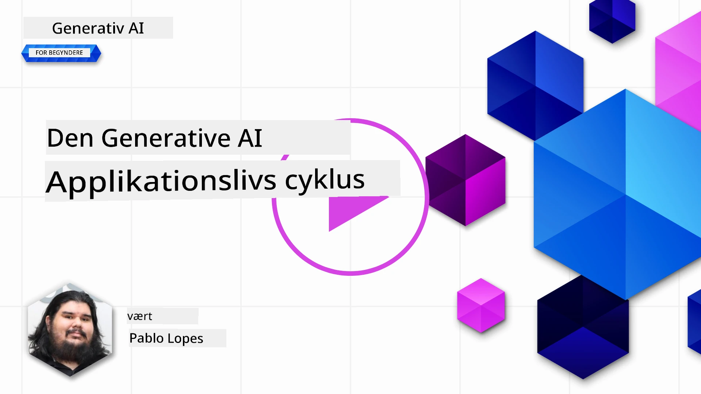
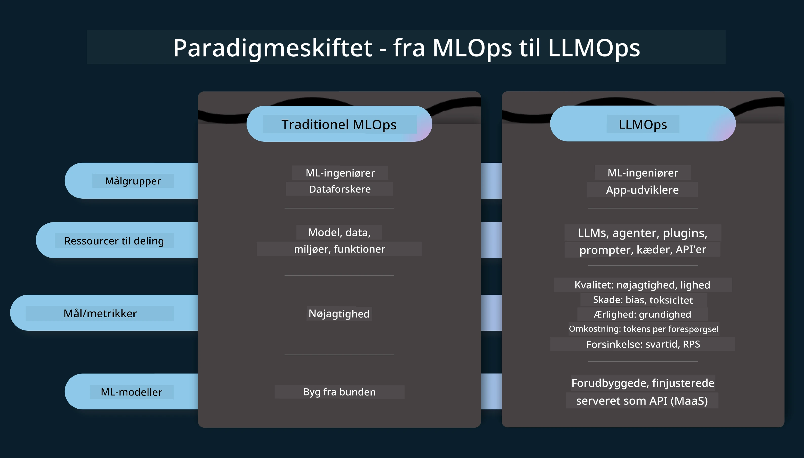
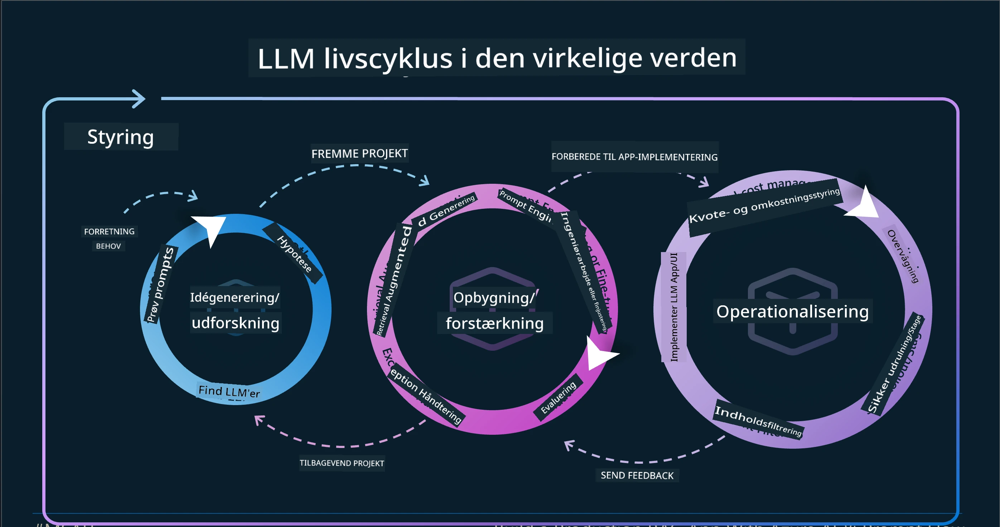
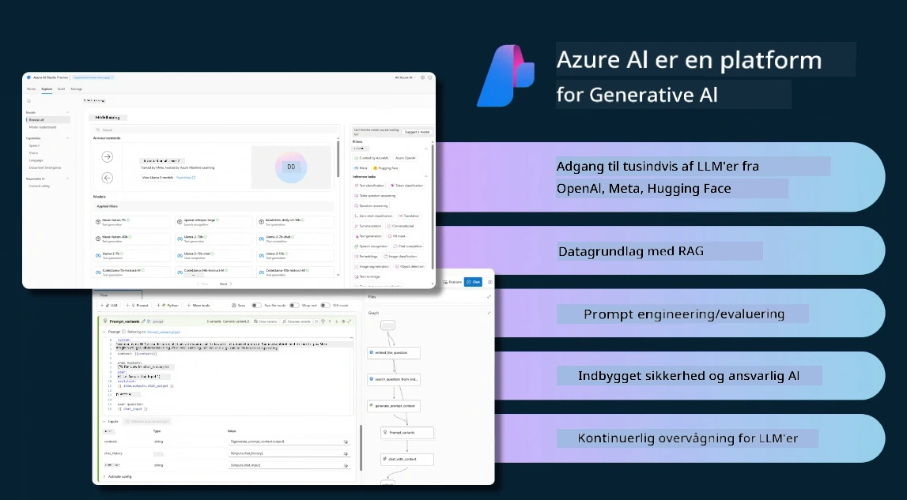
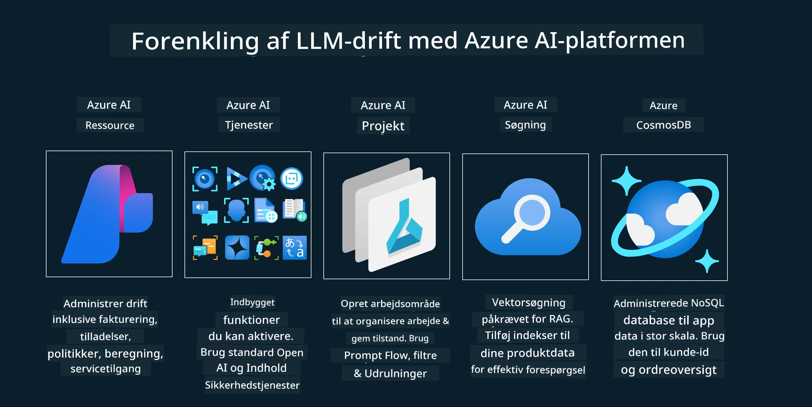
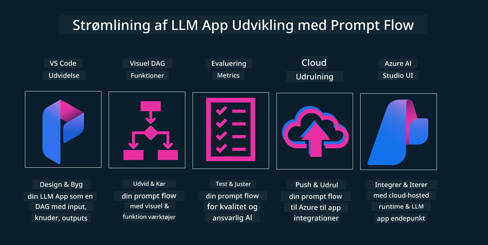

# Livscyklussen for Generative AI-applikationer

Et vigtigt spørgsmål for alle AI-applikationer er relevansen af AI-funktioner, da AI er et hastigt udviklende felt. For at sikre, at din applikation forbliver relevant, pålidelig og robust, skal du overvåge, evaluere og forbedre den løbende. Her kommer livscyklussen for generativ AI ind i billedet.

Livscyklussen for generativ AI er en ramme, der guider dig gennem stadierne for udvikling, implementering og vedligeholdelse af en generativ AI-applikation. Den hjælper dig med at definere dine mål, måle din ydeevne, identificere dine udfordringer og implementere dine løsninger. Den hjælper dig også med at tilpasse din applikation til de etiske og juridiske standarder inden for dit domæne og for dine interessenter. Ved at følge livscyklussen for generativ AI kan du sikre, at din applikation altid skaber værdi og tilfredsstiller dine brugere.

## Introduktion

I dette kapitel vil du:

- Forstå paradigmeskiftet fra MLOps til LLMOps
- LLM-livscyklussen
- Livscyklusværktøjer
- Livscyklusmetrikker og evaluering

## Forstå paradigmeskiftet fra MLOps til LLMOps

LLM'er er et nyt værktøj i den kunstige intelligens værktøjskasse, de er utrolig kraftfulde til analyse- og genereringsopgaver for applikationer, men denne kraft har nogle konsekvenser for, hvordan vi strømliner AI og klassiske maskinlæringsopgaver.

Derfor har vi brug for et nyt paradigme til at tilpasse dette værktøj dynamisk, med de rette incitamenter. Vi kan kategorisere ældre AI-apps som "ML Apps" og nyere AI-apps som "GenAI Apps" eller blot "AI Apps", hvilket afspejler den dominerende teknologi og teknik på det givne tidspunkt. Dette skifter vores fortælling på flere måder, se på følgende sammenligning.

Bemærk, at i LLMOps fokuserer vi mere på app-udviklerne, bruger integrationer som et nøglepunkt, anvender "Models-as-a-Service" og tænker på følgende punkter for metrikker.

- Kvalitet: Responskvalitet
- Skade: Ansvarlig AI
- Ærlighed: Responsens forankring (Giver det mening? Er det korrekt?)
- Omkostning: Løsningsbudget
- Latens: Gennemsnitlig tid for tokenrespons

## LLM-livscyklussen

Først, for at forstå livscyklussen og ændringerne, skal vi notere den næste infografik.

Som du måske bemærker, er dette anderledes end de sædvanlige livscyklusser fra MLOps. LLM'er har mange nye krav, såsom Prompting, forskellige teknikker til at forbedre kvaliteten (Fine-Tuning, RAG, Meta-Prompts), anden vurdering og ansvar med ansvarlig AI, og endelig nye evalueringsmetrikker (Kvalitet, Skade, Ærlighed, Omkostning og Latens).

For eksempel, se på hvordan vi idéudvikler. Vi bruger prompt engineering til at eksperimentere med forskellige LLM'er for at udforske muligheder og teste, om deres hypotese kunne være korrekt.

Bemærk, at dette ikke er lineært, men integrerede løkker, iterative og med en overordnet cyklus.

Hvordan kunne vi udforske disse trin? Lad os gå i detaljer i, hvordan vi kan opbygge en livscyklus.

Dette kan se lidt kompliceret ud, lad os fokusere på de tre store trin først.

1. Idégenerering/Eksploration: Udforskning, her kan vi udforske ud fra vores forretningsbehov. Prototype, oprette en [PromptFlow](https://microsoft.github.io/promptflow/index.html?WT.mc_id=academic-105485-koreyst) og teste, om den er effektiv nok til vores hypotese.
1. Opbygning/Augmentering: Implementering, nu begynder vi at evaluere for større datasæt, implementere teknikker som Fine-tuning og RAG for at tjekke robustheden af vores løsning. Hvis den ikke gør, kan ændring, tilføjelse af nye trin i vores flow eller omstrukturering af data hjælpe. Efter test af vores flow og skala, hvis det virker og opfylder vores metrikker, er det klar til næste trin.
1. Operationalisering: Integration, nu tilføjes overvågning og alarm-systemer til vores system, implementering og applikationsintegration til vores applikation.

Derefter har vi den overordnede cyklus for ledelse, der fokuserer på sikkerhed, overholdelse og styring.

Tillykke, nu har du din AI-app klar til at køre og være operationel. For en praktisk oplevelse, se på [Contoso Chat Demo.](https://nitya.github.io/contoso-chat/?WT.mc_id=academic-105485-koreyst)

Hvilke værktøjer kan vi så bruge?

## Livscyklusværktøjer

Til værktøj tilbyder Microsoft [Azure AI Platform](https://azure.microsoft.com/solutions/ai/?WT.mc_id=academic-105485-koreyst) og [PromptFlow](https://microsoft.github.io/promptflow/index.html?WT.mc_id=academic-105485-koreyst), som gør din cyklus nem at implementere og klar til brug.

[Azure AI Platform](https://azure.microsoft.com/solutions/ai/?WT.mc_id=academic-105485-koreyst), giver dig mulighed for at bruge [AI Studio](https://ai.azure.com/?WT.mc_id=academic-105485-koreyst). AI Studio er en webportal, der giver dig mulighed for at udforske modeller, eksempler og værktøjer. Administrere dine ressourcer, UI-udviklingsflows og SDK/CLI-muligheder til kode-først-udvikling.

Azure AI gør det muligt at bruge flere ressourcer til at styre dine operationer, tjenester, projekter, vektorsøgning og databasebehov.

Byg fra Proof-of-Concept(POC) til storskala-applikationer med PromptFlow:

- Design og byg apps fra VS Code med visuelle og funktionelle værktøjer
- Test og finjuster dine apps for kvalitets-AI med lethed.
- Brug Azure AI Studio til at integrere og iterere med cloud, push og deploy for hurtig integration.

## Fantastisk! Fortsæt din læring!

Fantastisk, lær nu mere om, hvordan vi strukturerer en applikation for at bruge koncepterne med [Contoso Chat App](https://nitya.github.io/contoso-chat/?WT.mc_id=academic-105485-koreyst), for at se, hvordan Cloud Advocacy tilføjer disse koncepter i demonstrationer. For mere indhold, tjek vores [Ignite breakout session!
](https://www.youtube.com/watch?v=DdOylyrTOWg)

Tjek nu Lektion 15, for at forstå hvordan [Retrieval Augmented Generation og Vector Databases](../15-rag-and-vector-databases/README.md?WT.mc_id=academic-105485-koreyst) påvirker Generativ AI og gør applikationer mere engagerende!

---

<!-- CO-OP TRANSLATOR DISCLAIMER START -->
**Ansvarsfraskrivelse**:
Dette dokument er blevet oversat ved hjælp af AI-oversættelsestjenesten [Co-op Translator](https://github.com/Azure/co-op-translator). Selvom vi bestræber os på nøjagtighed, skal du være opmærksom på, at automatiserede oversættelser kan indeholde fejl eller unøjagtigheder. Det oprindelige dokument på dets modersmål bør betragtes som den autoritative kilde. For kritisk information anbefales professionel menneskelig oversættelse. Vi påtager os intet ansvar for misforståelser eller fejltolkninger, der opstår som følge af brugen af denne oversættelse.
<!-- CO-OP TRANSLATOR DISCLAIMER END -->