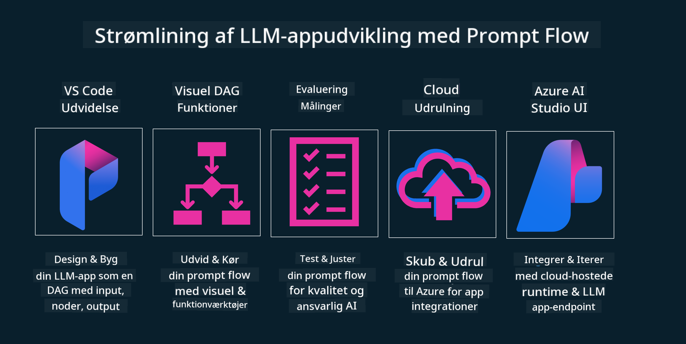

<!--
CO_OP_TRANSLATOR_METADATA:
{
  "original_hash": "b9d32511b27373a1b21b5789d4fda057",
  "translation_date": "2025-10-17T19:13:03+00:00",
  "source_file": "14-the-generative-ai-application-lifecycle/README.md",
  "language_code": "da"
}
-->

# Livscyklussen for Generativ AI-applikationer

Et vigtigt spørgsmål for alle AI-applikationer er relevansen af AI-funktioner, da AI er et hurtigt udviklende felt. For at sikre, at din applikation forbliver relevant, pålidelig og robust, skal du løbende overvåge, evaluere og forbedre den. Det er her, livscyklussen for generativ AI kommer ind i billedet.

Livscyklussen for generativ AI er en ramme, der guider dig gennem stadierne af udvikling, implementering og vedligeholdelse af en generativ AI-applikation. Den hjælper dig med at definere dine mål, måle din præstation, identificere dine udfordringer og implementere dine løsninger. Den hjælper dig også med at tilpasse din applikation til de etiske og juridiske standarder inden for dit område og blandt dine interessenter. Ved at følge livscyklussen for generativ AI kan du sikre, at din applikation altid leverer værdi og tilfredsstiller dine brugere.

## Introduktion

I dette kapitel vil du:

- Forstå paradigmeskiftet fra MLOps til LLMOps
- LLM-livscyklussen
- Værktøjer til livscyklussen
- Metrik og evaluering af livscyklussen

## Forstå paradigmeskiftet fra MLOps til LLMOps

LLM'er er et nyt værktøj i arsenalet for kunstig intelligens. De er utroligt kraftfulde til analyse- og genereringsopgaver for applikationer, men denne styrke har nogle konsekvenser for, hvordan vi strømliner AI- og klassiske maskinlæringsopgaver.

Derfor har vi brug for et nyt paradigme for at tilpasse dette værktøj dynamisk med de rette incitamenter. Vi kan kategorisere ældre AI-applikationer som "ML Apps" og nyere AI-applikationer som "GenAI Apps" eller blot "AI Apps", hvilket afspejler den mainstream teknologi og de teknikker, der blev brugt på det tidspunkt. Dette ændrer vores narrativ på flere måder. Se følgende sammenligning.

Bemærk, at vi i LLMOps fokuserer mere på app-udviklere, bruger integrationer som et nøglepunkt, anvender "Models-as-a-Service" og tænker på følgende punkter for metrikker:

- Kvalitet: Responskvalitet
- Skade: Ansvarlig AI
- Ærlighed: Responsens grundlag (Giver det mening? Er det korrekt?)
- Omkostninger: Løsningsbudget
- Latens: Gennemsnitlig tid for token-respons

## LLM-livscyklussen

For at forstå livscyklussen og ændringerne, lad os se på følgende infografik.

Som du måske bemærker, er dette anderledes end de sædvanlige livscyklusser fra MLOps. LLM'er har mange nye krav, såsom prompting, forskellige teknikker til at forbedre kvaliteten (Fine-Tuning, RAG, Meta-Prompts), forskellige vurderinger og ansvar med ansvarlig AI, og endelig nye evalueringsmetrikker (Kvalitet, Skade, Ærlighed, Omkostninger og Latens).

For eksempel, se på hvordan vi ideer. Ved at bruge prompt engineering til at eksperimentere med forskellige LLM'er for at udforske muligheder og teste, om deres hypotese kunne være korrekt.

Bemærk, at dette ikke er lineært, men integrerede loops, iterative og med en overordnet cyklus.

Hvordan kan vi udforske disse trin? Lad os gå i detaljer om, hvordan vi kan bygge en livscyklus.

Dette kan se lidt kompliceret ud, lad os fokusere på de tre store trin først.

1. Ideation/Udforskning: Udforskning, her kan vi udforske i henhold til vores forretningsbehov. Prototyping, oprette en [PromptFlow](https://microsoft.github.io/promptflow/index.html?WT.mc_id=academic-105485-koreyst) og teste, om det er effektivt nok til vores hypotese.
2. Bygning/Forbedring: Implementering, nu begynder vi at evaluere større datasæt og implementere teknikker som Fine-tuning og RAG for at kontrollere robustheden af vores løsning. Hvis det ikke fungerer, kan genimplementering, tilføjelse af nye trin i vores flow eller omstrukturering af data hjælpe. Efter test af vores flow og skala, hvis det fungerer og opfylder vores metrikker, er det klar til næste trin.
3. Operationalisering: Integration, nu tilføjer vi overvågnings- og alarmsystemer til vores system, implementering og applikationsintegration til vores applikation.

Derefter har vi den overordnede cyklus af ledelse, med fokus på sikkerhed, overholdelse og styring.

Tillykke, nu har du din AI-applikation klar til brug og operationel. For en praktisk oplevelse, se [Contoso Chat Demo.](https://nitya.github.io/contoso-chat/?WT.mc_id=academic-105485-koreys)

Hvilke værktøjer kan vi så bruge?

## Værktøjer til livscyklussen

Til værktøjer tilbyder Microsoft [Azure AI Platform](https://azure.microsoft.com/solutions/ai/?WT.mc_id=academic-105485-koreys) og [PromptFlow](https://microsoft.github.io/promptflow/index.html?WT.mc_id=academic-105485-koreyst) for at lette og gøre din cyklus nem at implementere og klar til brug.

[Azure AI Platform](https://azure.microsoft.com/solutions/ai/?WT.mc_id=academic-105485-koreys) giver dig mulighed for at bruge [AI Studio](https://ai.azure.com/?WT.mc_id=academic-105485-koreys). AI Studio er en webportal, der giver dig mulighed for at udforske modeller, eksempler og værktøjer. Administrere dine ressourcer, UI-udviklingsflows og SDK/CLI-muligheder for kode-først udvikling.

Azure AI giver dig mulighed for at bruge flere ressourcer til at administrere dine operationer, tjenester, projekter, vektorsøgning og databasebehov.

Byg fra Proof-of-Concept (POC) til applikationer i stor skala med PromptFlow:

- Design og byg apps fra VS Code med visuelle og funktionelle værktøjer
- Test og finjuster dine apps for kvalitets-AI med lethed.
- Brug Azure AI Studio til at integrere og iterere med cloud, push og implementere for hurtig integration.

## Fantastisk! Fortsæt din læring!

Fantastisk, lær nu mere om, hvordan vi strukturerer en applikation til at bruge koncepterne med [Contoso Chat App](https://nitya.github.io/contoso-chat/?WT.mc_id=academic-105485-koreyst) for at se, hvordan Cloud Advocacy tilføjer disse koncepter i demonstrationer. For mere indhold, se vores [Ignite breakout session!
](https://www.youtube.com/watch?v=DdOylyrTOWg)

Gå nu videre til Lektion 15 for at forstå, hvordan [Retrieval Augmented Generation og vektordatabaser](../15-rag-and-vector-databases/README.md?WT.mc_id=academic-105485-koreyst) påvirker generativ AI og skaber mere engagerende applikationer!

---

**Ansvarsfraskrivelse**:  
Dette dokument er blevet oversat ved hjælp af AI-oversættelsestjenesten [Co-op Translator](https://github.com/Azure/co-op-translator). Selvom vi bestræber os på nøjagtighed, skal det bemærkes, at automatiserede oversættelser kan indeholde fejl eller unøjagtigheder. Det originale dokument på dets oprindelige sprog bør betragtes som den autoritative kilde. For kritisk information anbefales professionel menneskelig oversættelse. Vi er ikke ansvarlige for eventuelle misforståelser eller fejltolkninger, der opstår som følge af brugen af denne oversættelse.