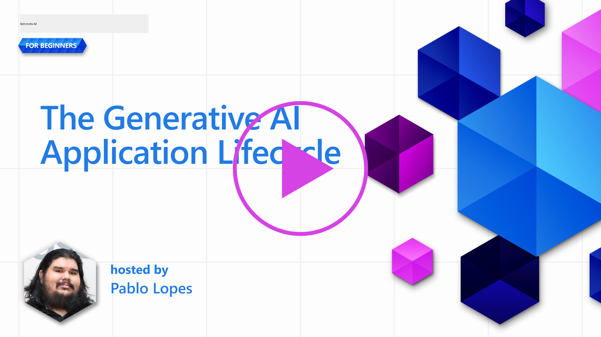
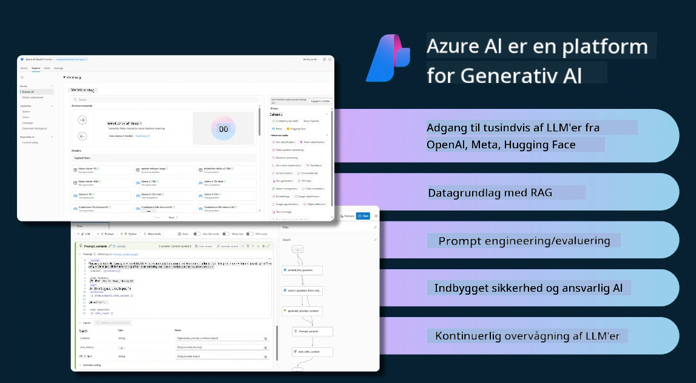

<!--
CO_OP_TRANSLATOR_METADATA:
{
  "original_hash": "27a5347a5022d5ef0a72ab029b03526a",
  "translation_date": "2025-07-09T15:54:42+00:00",
  "source_file": "14-the-generative-ai-application-lifecycle/README.md",
  "language_code": "da"
}
-->

# Livscyklussen for Generativ AI-applikationer

Et vigtigt spørgsmål for alle AI-applikationer er relevansen af AI-funktioner, da AI er et hurtigt udviklende felt. For at sikre, at din applikation forbliver relevant, pålidelig og robust, skal du løbende overvåge, evaluere og forbedre den. Her kommer livscyklussen for generativ AI ind i billedet.

Livscyklussen for generativ AI er en ramme, der guider dig gennem faserne i udvikling, implementering og vedligeholdelse af en generativ AI-applikation. Den hjælper dig med at definere dine mål, måle din ydeevne, identificere dine udfordringer og implementere dine løsninger. Den hjælper dig også med at tilpasse din applikation til de etiske og juridiske standarder i dit domæne og hos dine interessenter. Ved at følge livscyklussen for generativ AI kan du sikre, at din applikation altid leverer værdi og tilfredsstiller dine brugere.

## Introduktion

I dette kapitel vil du:

- Forstå paradigmeskiftet fra MLOps til LLMOps  
- LLM-livscyklussen  
- Værktøjer til livscyklussen  
- Metrificering og evaluering af livscyklussen  

## Forstå paradigmeskiftet fra MLOps til LLMOps

LLM’er er et nyt værktøj i kunstig intelligens’ arsenal; de er utroligt kraftfulde til analyse- og genereringsopgaver i applikationer, men denne kraft har også konsekvenser for, hvordan vi effektiviserer AI- og klassiske maskinlæringsopgaver.

Derfor har vi brug for et nyt paradigme til at tilpasse dette værktøj dynamisk med de rette incitamenter. Vi kan kategorisere ældre AI-apps som "ML Apps" og nyere AI-apps som "GenAI Apps" eller blot "AI Apps", hvilket afspejler den dominerende teknologi og de teknikker, der blev brugt på det tidspunkt. Dette ændrer vores fortælling på flere måder, se følgende sammenligning.

Bemærk, at i LLMOps er fokus mere på app-udviklerne, hvor integrationer er et nøglepunkt, brugen af "Models-as-a-Service" og følgende punkter for metrikker:

- Kvalitet: Svarenes kvalitet  
- Skade: Ansvarlig AI  
- Ærlighed: Svarenes forankring (Giver det mening? Er det korrekt?)  
- Omkostning: Løsningsbudget  
- Latens: Gennemsnitlig tid for tokensvar  

## LLM-livscyklussen

Først, for at forstå livscyklussen og ændringerne, lad os se på følgende infografik.

Som du kan se, adskiller denne sig fra de sædvanlige livscyklusser i MLOps. LLM’er har mange nye krav, såsom Prompting, forskellige teknikker til at forbedre kvaliteten (Fine-Tuning, RAG, Meta-Prompts), forskellige vurderinger og ansvar med ansvarlig AI, og endelig nye evalueringsmetrikker (Kvalitet, Skade, Ærlighed, Omkostning og Latens).

For eksempel, se på hvordan vi idéudvikler. Vi bruger prompt engineering til at eksperimentere med forskellige LLM’er for at udforske muligheder og teste, om deres hypotese kan være korrekt.

Bemærk, at dette ikke er lineært, men integrerede loops, iterative og med en overordnet cyklus.

Hvordan kan vi udforske disse trin? Lad os gå i detaljer med, hvordan vi kan opbygge en livscyklus.

Det kan se lidt kompliceret ud, så lad os først fokusere på de tre store trin.

1. Idégenerering/udforskning: Her kan vi udforske ud fra vores forretningsbehov. Prototyping, oprette en [PromptFlow](https://microsoft.github.io/promptflow/index.html?WT.mc_id=academic-105485-koreyst) og teste, om den er effektiv nok til vores hypotese.  
1. Opbygning/forstærkning: Implementering, nu begynder vi at evaluere større datasæt og implementere teknikker som Fine-tuning og RAG for at tjekke robustheden af vores løsning. Hvis den ikke fungerer, kan genimplementering, tilføjelse af nye trin i vores flow eller omstrukturering af data hjælpe. Efter test af flow og skala, hvis det virker og vores metrikker er i orden, er det klar til næste trin.  
1. Operationalisering: Integration, nu tilføjer vi overvågning og alarmsystemer til vores system, implementering og applikationsintegration til vores applikation.  

Dernæst har vi den overordnede cyklus for ledelse, med fokus på sikkerhed, overholdelse og governance.

Tillykke, nu har du din AI-app klar til brug og drift. For en praktisk oplevelse, tag et kig på [Contoso Chat Demo.](https://nitya.github.io/contoso-chat/?WT.mc_id=academic-105485-koreys)

Hvilke værktøjer kan vi så bruge?

## Værktøjer til livscyklussen

Til værktøjer tilbyder Microsoft [Azure AI Platform](https://azure.microsoft.com/solutions/ai/?WT.mc_id=academic-105485-koreys) og [PromptFlow](https://microsoft.github.io/promptflow/index.html?WT.mc_id=academic-105485-koreyst), som gør din cyklus nem at implementere og klar til brug.

[Azure AI Platform](https://azure.microsoft.com/solutions/ai/?WT.mc_id=academic-105485-koreys) giver dig adgang til [AI Studio](https://ai.azure.com/?WT.mc_id=academic-105485-koreys). AI Studio er en webportal, der giver dig mulighed for at udforske modeller, eksempler og værktøjer. Administrere dine ressourcer, UI-udviklingsflows og SDK/CLI-muligheder til Code-First udvikling.

Azure AI giver dig mulighed for at bruge flere ressourcer til at styre dine operationer, tjenester, projekter, vektorsøgning og databasebehov.

Byg fra Proof-of-Concept (POC) til store applikationer med PromptFlow:

- Design og byg apps fra VS Code med visuelle og funktionelle værktøjer  
- Test og finjuster dine apps for kvalitets-AI, nemt og hurtigt  
- Brug Azure AI Studio til at integrere og iterere med cloud, push og deploy for hurtig integration  

## Fantastisk! Fortsæt din læring!

Fantastisk, lær nu mere om, hvordan vi strukturerer en applikation for at bruge koncepterne med [Contoso Chat App](https://nitya.github.io/contoso-chat/?WT.mc_id=academic-105485-koreyst), for at se, hvordan Cloud Advocacy anvender disse koncepter i demonstrationer. For mere indhold, se vores [Ignite breakout session!](https://www.youtube.com/watch?v=DdOylyrTOWg)

Tjek nu Lektion 15 for at forstå, hvordan [Retrieval Augmented Generation og Vector Databases](../15-rag-and-vector-databases/README.md?WT.mc_id=academic-105485-koreyst) påvirker Generativ AI og gør applikationer mere engagerende!

**Ansvarsfraskrivelse**:  
Dette dokument er blevet oversat ved hjælp af AI-oversættelsestjenesten [Co-op Translator](https://github.com/Azure/co-op-translator). Selvom vi bestræber os på nøjagtighed, bedes du være opmærksom på, at automatiserede oversættelser kan indeholde fejl eller unøjagtigheder. Det oprindelige dokument på dets oprindelige sprog bør betragtes som den autoritative kilde. For kritisk information anbefales professionel menneskelig oversættelse. Vi påtager os intet ansvar for misforståelser eller fejltolkninger, der opstår som følge af brugen af denne oversættelse.