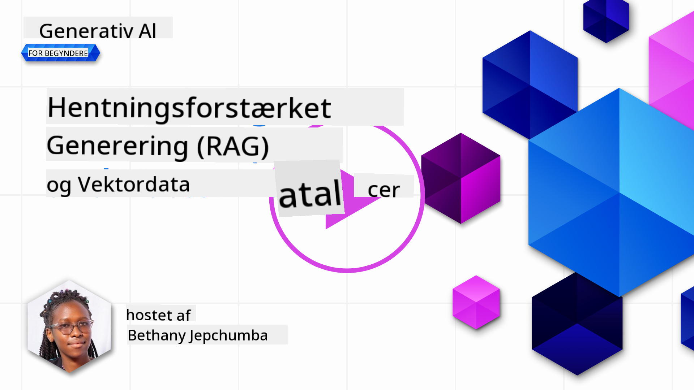
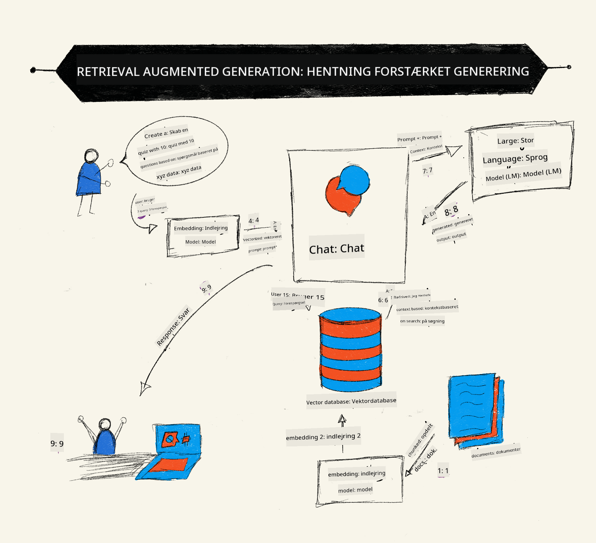
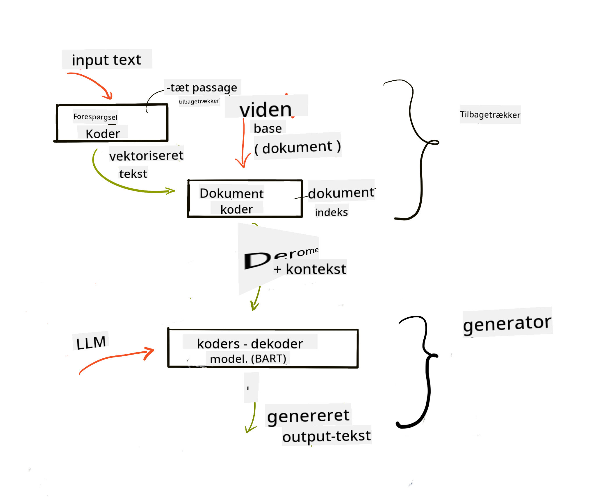
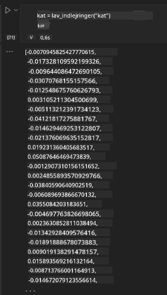

<!--
CO_OP_TRANSLATOR_METADATA:
{
  "original_hash": "e2861bbca91c0567ef32bc77fe054f9e",
  "translation_date": "2025-05-20T01:21:03+00:00",
  "source_file": "15-rag-and-vector-databases/README.md",
  "language_code": "da"
}
-->
# Retrieval Augmented Generation (RAG) og Vektordatabaser

[](https://aka.ms/gen-ai-lesson15-gh?WT.mc_id=academic-105485-koreyst)

I lektionen om søgeapplikationer lærte vi kort, hvordan man integrerer sine egne data i Store Sproglige Modeller (LLMs). I denne lektion vil vi dykke dybere ned i begreberne om at forankre dine data i din LLM-applikation, processens mekanik og metoder til at lagre data, herunder både embeddings og tekst.

> **Video kommer snart**

## Introduktion

I denne lektion vil vi dække følgende:

- En introduktion til RAG, hvad det er, og hvorfor det bruges i AI (kunstig intelligens).

- Forståelse af, hvad vektordatabaser er, og hvordan man opretter en til vores applikation.

- Et praktisk eksempel på, hvordan man integrerer RAG i en applikation.

## Læringsmål

Efter at have gennemført denne lektion, vil du være i stand til at:

- Forklare betydningen af RAG i datahentning og -behandling.

- Opsætte en RAG-applikation og forankre dine data til en LLM.

- Effektiv integration af RAG og Vektordatabaser i LLM-applikationer.

## Vores scenarie: forbedring af vores LLM'er med vores egne data

For denne lektion ønsker vi at tilføje vores egne noter til uddannelsesstartuppen, hvilket giver chatbotten mulighed for at få mere information om de forskellige emner. Ved at bruge de noter, vi har, vil eleverne kunne studere bedre og forstå de forskellige emner, hvilket gør det lettere at repetere til deres eksamener. For at skabe vores scenarie vil vi bruge:

- `Azure OpenAI:` den LLM, vi vil bruge til at skabe vores chatbot

- `AI for beginners' lesson on Neural Networks`: dette vil være de data, vi forankrer vores LLM på

- `Azure AI Search` og `Azure Cosmos DB:` vektordatabase til at lagre vores data og skabe et søgeindeks

Brugerne vil kunne lave øvelsesquizzer fra deres noter, revisionsflashkort og opsummere dem til præcise oversigter. For at komme i gang, lad os se på, hvad RAG er, og hvordan det fungerer:

## Retrieval Augmented Generation (RAG)

En LLM-drevet chatbot behandler brugerens forespørgsler for at generere svar. Den er designet til at være interaktiv og engagerer sig med brugere om en bred vifte af emner. Dog er dens svar begrænset til den kontekst, der gives, og dens grundlæggende træningsdata. For eksempel er GPT-4's vidensafskæring september 2021, hvilket betyder, at den mangler viden om begivenheder, der er sket efter denne periode. Derudover udelukker de data, der bruges til at træne LLM'er, fortrolige oplysninger som personlige noter eller en virksomheds produktmanual.

### Hvordan RAGs (Retrieval Augmented Generation) fungerer



Antag, at du vil implementere en chatbot, der laver quizzer fra dine noter, så har du brug for en forbindelse til vidensbasen. Det er her, RAG kommer til undsætning. RAGs fungerer som følger:

- **Vidensbase:** Før hentning skal disse dokumenter indtages og forbehandles, typisk ved at nedbryde store dokumenter i mindre stykker, omdanne dem til tekstembedding og lagre dem i en database.

- **Brugerforespørgsel:** brugeren stiller et spørgsmål

- **Hentning:** Når en bruger stiller et spørgsmål, henter embedding-modellen relevant information fra vores vidensbase for at give mere kontekst, der vil blive indarbejdet i prompten.

- **Forstærket generering:** LLM'en forbedrer sit svar baseret på de hentede data. Det gør det muligt for det genererede svar ikke kun at være baseret på fortrænede data, men også relevant information fra den tilføjede kontekst. De hentede data bruges til at forstærke LLM'ens svar. LLM'en returnerer derefter et svar på brugerens spørgsmål.



Arkitekturen for RAGs implementeres ved hjælp af transformere, der består af to dele: en encoder og en decoder. For eksempel, når en bruger stiller et spørgsmål, 'encodes' inputteksten til vektorer, der fanger betydningen af ordene, og vektorerne 'decodes' til vores dokumentindeks og genererer ny tekst baseret på brugerens forespørgsel. LLM'en bruger både en encoder-decoder-model til at generere output.

To tilgange ved implementering af RAG ifølge det foreslåede papir: [Retrieval-Augmented Generation for Knowledge intensive NLP (natural language processing software) Tasks](https://arxiv.org/pdf/2005.11401.pdf?WT.mc_id=academic-105485-koreyst) er:

- **_RAG-Sequence_** bruger hentede dokumenter til at forudsige det bedst mulige svar på en brugerforespørgsel

- **RAG-Token** bruger dokumenter til at generere den næste token og derefter hente dem for at besvare brugerens forespørgsel

### Hvorfor ville du bruge RAGs?

- **Informationsrigdom:** sikrer, at tekstsvar er opdaterede og aktuelle. Det forbedrer derfor ydeevnen på domænespecifikke opgaver ved at få adgang til den interne vidensbase.

- Reducerer fabrikation ved at bruge **verificerbare data** i vidensbasen til at give kontekst til brugerforespørgsler.

- Det er **omkostningseffektivt**, da de er mere økonomiske sammenlignet med at finjustere en LLM.

## Oprettelse af en vidensbase

Vores applikation er baseret på vores personlige data, dvs. lektionen om Neurale Netværk i AI For Beginners-kurset.

### Vektordatabaser

En vektordatabase, i modsætning til traditionelle databaser, er en specialiseret database designet til at lagre, administrere og søge i indlejrede vektorer. Den lagrer numeriske repræsentationer af dokumenter. Nedbrydning af data til numeriske embeddings gør det lettere for vores AI-system at forstå og behandle dataene.

Vi lagrer vores embeddings i vektordatabaser, da LLM'er har en grænse for antallet af tokens, de accepterer som input. Da du ikke kan sende hele embeddings til en LLM, bliver vi nødt til at opdele dem i stykker, og når en bruger stiller et spørgsmål, returneres de embeddings, der ligner spørgsmålet, sammen med prompten. Chunking reducerer også omkostningerne ved antallet af tokens, der sendes gennem en LLM.

Nogle populære vektordatabaser inkluderer Azure Cosmos DB, Clarifyai, Pinecone, Chromadb, ScaNN, Qdrant og DeepLake. Du kan oprette en Azure Cosmos DB-model ved hjælp af Azure CLI med følgende kommando:

```bash
az login
az group create -n <resource-group-name> -l <location>
az cosmosdb create -n <cosmos-db-name> -r <resource-group-name>
az cosmosdb list-keys -n <cosmos-db-name> -g <resource-group-name>
```

### Fra tekst til embeddings

Før vi lagrer vores data, skal vi konvertere dem til vektorembeddings, inden de lagres i databasen. Hvis du arbejder med store dokumenter eller lange tekster, kan du opdele dem baseret på de forespørgsler, du forventer. Chunking kan gøres på sætningsniveau eller på afsnitsniveau. Da chunking afleder betydninger fra ordene omkring dem, kan du tilføje en anden kontekst til et stykke, for eksempel ved at tilføje dokumenttitlen eller inkludere noget tekst før eller efter stykket. Du kan opdele dataene som følger:

```python
def split_text(text, max_length, min_length):
    words = text.split()
    chunks = []
    current_chunk = []

    for word in words:
        current_chunk.append(word)
        if len(' '.join(current_chunk)) < max_length and len(' '.join(current_chunk)) > min_length:
            chunks.append(' '.join(current_chunk))
            current_chunk = []

    # If the last chunk didn't reach the minimum length, add it anyway
    if current_chunk:
        chunks.append(' '.join(current_chunk))

    return chunks
```

Når de er opdelt, kan vi derefter embedde vores tekst ved hjælp af forskellige embedding-modeller. Nogle modeller, du kan bruge, inkluderer: word2vec, ada-002 fra OpenAI, Azure Computer Vision og mange flere. Valget af model afhænger af de sprog, du bruger, typen af indhold, der kodes (tekst/billeder/lyd), størrelsen af inputtet, det kan kode, og længden af embedding-outputtet.

Et eksempel på embedded tekst ved hjælp af OpenAI's `text-embedding-ada-002` model er:


## Hentning og vektorsøgning

Når en bruger stiller et spørgsmål, omdanner retrieveren det til en vektor ved hjælp af forespørgselsencoderen, og den søger derefter gennem vores dokumentsøgeindeks efter relevante vektorer i dokumentet, der er relateret til inputtet. Når det er gjort, konverterer den både inputvektoren og dokumentvektorerne til tekst og sender det gennem LLM'en.

### Hentning

Hentning sker, når systemet forsøger hurtigt at finde dokumenterne fra indekset, der opfylder søgekriterierne. Retrieverens mål er at få dokumenter, der vil blive brugt til at give kontekst og forankre LLM'en på dine data.

Der er flere måder at udføre søgning inden for vores database, såsom:

- **Nøgleordssøgning** - bruges til tekstsøgninger

- **Semantisk søgning** - bruger den semantiske betydning af ord

- **Vektorsøgning** - konverterer dokumenter fra tekst til vektorrepræsentationer ved hjælp af embedding-modeller. Hentning vil ske ved at forespørge dokumenterne, hvis vektorrepræsentationer er tættest på brugerens spørgsmål.

- **Hybrid** - en kombination af både nøgleord og vektorsøgning.

En udfordring ved hentning opstår, når der ikke er noget lignende svar på forespørgslen i databasen, vil systemet derefter returnere den bedste information, de kan få. Dog kan du bruge taktikker som at indstille den maksimale afstand for relevans eller bruge hybrid søgning, der kombinerer både nøgleord og vektorsøgning. I denne lektion vil vi bruge hybrid søgning, en kombination af både vektor- og nøgleordssøgning. Vi vil lagre vores data i en dataframe med kolonner, der indeholder stykkerne samt embeddings.

### Vektorsimilaritet

Retrieveren vil søge gennem vidensdatabasen efter embeddings, der er tæt sammen, den nærmeste nabo, da de er tekster, der er ens. I scenariet, hvor en bruger stiller en forespørgsel, bliver den først embeddet og derefter matchet med lignende embeddings. Den almindelige måling, der bruges til at finde ud af, hvor ens forskellige vektorer er, er cosinus-similaritet, der er baseret på vinklen mellem to vektorer.

Vi kan måle similaritet ved hjælp af andre alternativer, vi kan bruge, er euklidisk afstand, som er den lige linje mellem vektorens endepunkter og prikprodukt, der måler summen af produkterne af de tilsvarende elementer i to vektorer.

### Søgeindeks

Når vi foretager hentning, skal vi opbygge et søgeindeks for vores vidensbase, før vi udfører søgning. Et indeks vil lagre vores embeddings og hurtigt kunne hente de mest lignende stykker, selv i en stor database. Vi kan oprette vores indeks lokalt ved hjælp af:

```python
from sklearn.neighbors import NearestNeighbors

embeddings = flattened_df['embeddings'].to_list()

# Create the search index
nbrs = NearestNeighbors(n_neighbors=5, algorithm='ball_tree').fit(embeddings)

# To query the index, you can use the kneighbors method
distances, indices = nbrs.kneighbors(embeddings)
```

### Re-ranking

Når du har forespurgt databasen, kan du muligvis have brug for at sortere resultaterne fra de mest relevante. En reranking LLM bruger maskinlæring til at forbedre relevansen af søgeresultaterne ved at ordne dem fra de mest relevante. Ved hjælp af Azure AI Search udføres reranking automatisk for dig ved hjælp af en semantisk reranker. Et eksempel på, hvordan reranking fungerer ved hjælp af nærmeste naboer:

```python
# Find the most similar documents
distances, indices = nbrs.kneighbors([query_vector])

index = []
# Print the most similar documents
for i in range(3):
    index = indices[0][i]
    for index in indices[0]:
        print(flattened_df['chunks'].iloc[index])
        print(flattened_df['path'].iloc[index])
        print(flattened_df['distances'].iloc[index])
    else:
        print(f"Index {index} not found in DataFrame")
```

## At samle det hele

Det sidste trin er at tilføje vores LLM til blandingen for at kunne få svar, der er forankret i vores data. Vi kan implementere det som følger:

```python
user_input = "what is a perceptron?"

def chatbot(user_input):
    # Convert the question to a query vector
    query_vector = create_embeddings(user_input)

    # Find the most similar documents
    distances, indices = nbrs.kneighbors([query_vector])

    # add documents to query  to provide context
    history = []
    for index in indices[0]:
        history.append(flattened_df['chunks'].iloc[index])

    # combine the history and the user input
    history.append(user_input)

    # create a message object
    messages=[
        {"role": "system", "content": "You are an AI assistant that helps with AI questions."},
        {"role": "user", "content": history[-1]}
    ]

    # use chat completion to generate a response
    response = openai.chat.completions.create(
        model="gpt-4",
        temperature=0.7,
        max_tokens=800,
        messages=messages
    )

    return response.choices[0].message

chatbot(user_input)
```

## Evaluering af vores applikation

### Evalueringsmetrikker

- Kvaliteten af de leverede svar sikrer, at det lyder naturligt, flydende og menneskeligt

- Forankring af dataene: evaluering af, om svaret kom fra de leverede dokumenter

- Relevans: evaluering af, om svaret matcher og er relateret til det stillede spørgsmål

- Flydende - om svaret giver mening grammatisk

## Anvendelsestilfælde for brug af RAG (Retrieval Augmented Generation) og vektordatabaser

Der er mange forskellige anvendelsestilfælde, hvor funktionskald kan forbedre din app, såsom:

- Spørgsmål og svar: forankring af dine virksomhedsdata til en chat, der kan bruges af medarbejdere til at stille spørgsmål.

- Anbefalingssystemer: hvor du kan skabe et system, der matcher de mest lignende værdier, f.eks. film, restauranter og mange flere.

- Chatbot-tjenester: du kan gemme chathistorik og personalisere samtalen baseret på brugerdata.

- Billedsøgning baseret på vektorembeddings, nyttig ved billedgenkendelse og anomalidetektion.

## Resumé

Vi har dækket de grundlæggende områder af RAG fra at tilføje vores data til applikationen, brugerforespørgslen og output. For at forenkle oprettelsen af RAG kan du bruge rammer som Semanti Kernel, Langchain eller Autogen.

## Opgave

For at fortsætte din læring om Retrieval Augmented Generation (RAG) kan du bygge:

- Byg en front-end til applikationen ved hjælp af den ramme, du vælger

- Brug en ramme, enten LangChain eller Semantic Kernel, og genskab din applikation.

Tillykke med at have gennemført lektionen 👏.

## Læring stopper ikke her, fortsæt rejsen

Efter at have gennemført denne lektion, tjek vores [Generative AI Learning collection](https://aka.ms/genai-collection?WT.mc_id=academic-105485-koreyst) for at fortsætte med at forbedre din viden om Generativ AI!

**Ansvarsfraskrivelse**:  
Dette dokument er blevet oversat ved hjælp af AI-oversættelsestjenesten [Co-op Translator](https://github.com/Azure/co-op-translator). Selvom vi bestræber os på nøjagtighed, skal du være opmærksom på, at automatiserede oversættelser kan indeholde fejl eller unøjagtigheder. Det originale dokument på dets oprindelige sprog bør betragtes som den autoritative kilde. For kritisk information anbefales professionel menneskelig oversættelse. Vi er ikke ansvarlige for misforståelser eller fejltolkninger, der måtte opstå som følge af brugen af denne oversættelse.