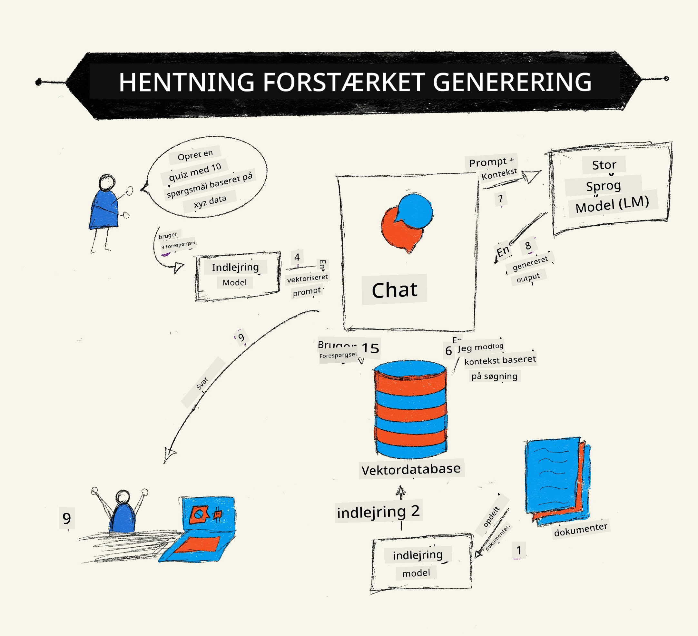
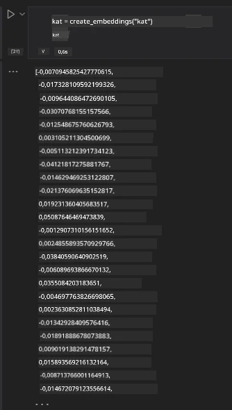

# Retrieval Augmented Generation (RAG) og Vektordatabaser

[](https://youtu.be/4l8zhHUBeyI?si=BmvDmL1fnHtgQYkL)

I søgeapplikationslektionen lærte vi kort, hvordan man integrerer egne data i Large Language Models (LLMs). I denne lektion vil vi dykke dybere ned i begreberne omkring at forankre dine data i din LLM-applikation, mekanikkerne i processen og metoderne til lagring af data, herunder både embeddings og tekst.

> **Video Kommer Snart**

## Introduktion

I denne lektion vil vi dække følgende:

- En introduktion til RAG, hvad det er, og hvorfor det bruges inden for AI (kunstig intelligens).

- Forståelse af, hvad vektordatabaser er, og hvordan man opretter en til vores applikation.

- Et praktisk eksempel på, hvordan man integrerer RAG i en applikation.

## Læringsmål

Efter at have gennemført denne lektion vil du kunne:

- Forklare betydningen af RAG i dataudtræk og behandling.

- Opsætte en RAG-applikation og forankre dine data til en LLM.

- Effektiv integration af RAG og vektordatabaser i LLM-applikationer.

## Vores scenarie: forbedring af vores LLMs med egne data

Til denne lektion ønsker vi at tilføje vores egne notater til uddannelsesstartuppen, hvilket gør det muligt for chatbotten at få mere information om de forskellige emner. Brug af de notater, vi har, vil elever kunne studere bedre og forstå de forskellige emner, hvilket gør det nemmere at forberede sig til deres eksamener. For at skabe vores scenarie vil vi bruge:

- `Azure OpenAI:` den LLM, vi vil bruge til at oprette vores chatbot

- `AI for beginners' lesson on Neural Networks:` dette vil være de data, vi forankrer vores LLM på

- `Azure AI Search` og `Azure Cosmos DB:` vektordatabaser til at gemme vores data og oprette et søgeindeks

Brugere vil kunne oprette øvequizzer ud fra deres notater, revisionsflashkort og opsummere det til koncise overblik. For at komme i gang, lad os se på, hvad RAG er, og hvordan det fungerer:

## Retrieval Augmented Generation (RAG)

En LLM-drevet chatbot behandler brugerens prompts for at generere svar. Den er designet til at være interaktiv og engagerer sig med brugere om en bred vifte af emner. Dog er dens svar begrænset til den kontekst, der er givet, og det grundlæggende træningsdata. For eksempel har GPT-4 en vidensafskæring i september 2021, hvilket betyder, at den mangler viden om begivenheder, der er sket efter denne periode. Derudover udelukker dataene, som bruges til at træne LLM'er, fortrolig information som personlige notater eller en virksomheds produktmanual.

### Hvordan RAG (Retrieval Augmented Generation) fungerer



Antag, at du ønsker at implementere en chatbot, der laver quizzer ud fra dine notater; du vil have brug for en forbindelse til vidensbasen. Dette er, hvor RAG kommer til undsætning. RAG’er fungerer som følger:

- **Vidensbase:** Før udtrækning skal disse dokumenter indtastes og forbehandles, typisk ved at opdele store dokumenter i mindre bidder, omdanne dem til tekstembedding og gemme dem i en database.

- **Brugerforespørgsel:** brugeren stiller et spørgsmål

- **Udtrækning:** Når en bruger stiller et spørgsmål, henter embeddings-modellen relevant information fra vores vidensbase for at give mere kontekst, som inkorporeres i prompten.

- **Forstærket generering:** LLM’en forbedrer sit svar baseret på de hentede data. Det gør det muligt, at det genererede svar ikke kun baseres på forudtrænede data men også relevant information fra den tilføjede kontekst. De hentede data bruges til at forstærke LLM’ens svar. LLM’en returnerer derefter et svar på brugerens spørgsmål.


Arkitekturen for RAG’er implementeres ved hjælp af transformere bestående af to dele: en encoder og en decoder. For eksempel, når en bruger stiller et spørgsmål, 'kodes' inputteksten til vektorer, der fanger ordenes betydning, og vektorerne 'afkodes' i vores dokumentindeks og genererer ny tekst baseret på brugerens forespørgsel. LLM’en bruger både en encoder-decoder-model til at generere output.

To tilgange ved implementering af RAG ifølge det foreslåede papir: [Retrieval-Augmented Generation for Knowledge intensive NLP (natural language processing software) Tasks](https://arxiv.org/pdf/2005.11401.pdf?WT.mc_id=academic-105485-koreyst) er:

- **_RAG-Sequence_** bruger hentede dokumenter til at forudsige det bedst mulige svar på en brugerspørgsel

- **RAG-Token** bruger dokumenter til at generere den næste token, og henter derefter flere for at besvare brugerens forespørgsel

### Hvorfor skulle du bruge RAG?

- **Informationsrigdom:** sikrer, at tekstsvar er opdaterede og aktuelle. Det forbedrer derfor præstationen på domænespecifikke opgaver ved at få adgang til intern vidensbase.

- Reducerer fabrikation ved at bruge **verificerbare data** i vidensbasen til at give kontekst til brugerforespørgsler.

- Det er **omkostningseffektivt**, da de er mere økonomiske sammenlignet med at finjustere en LLM.

## Oprettelse af en vidensbase

Vores applikation baseres på vores personlige data, dvs. Neural Network-lektionen i AI For Beginners pensum.

### Vektordatabaser

En vektordatabase er, i modsætning til traditionelle databaser, en specialiseret database designet til at lagre, håndtere og søge i indlejrede vektorer. Den lagrer numeriske repræsentationer af dokumenter. Opdeling af data til numeriske embeddings gør det lettere for vores AI-system at forstå og behandle dataene.

Vi gemmer vores embeddings i vektordatabaser, da LLM’er har en begrænsning på antallet af tokens, de accepterer som input. Da du ikke kan give hele embeddings til en LLM, skal vi opdele dem i bidder, og når en bruger stiller et spørgsmål, returneres de embeddings, der mest ligner spørgsmålet, sammen med prompten. Opdeling reducerer også omkostningerne ved antallet af tokens, der passerer gennem en LLM.

Nogle populære vektordatabaser inkluderer Azure Cosmos DB, Clarifyai, Pinecone, Chromadb, ScaNN, Qdrant og DeepLake. Du kan oprette en Azure Cosmos DB-model ved hjælp af Azure CLI med følgende kommando:

```bash
az login
az group create -n <resource-group-name> -l <location>
az cosmosdb create -n <cosmos-db-name> -r <resource-group-name>
az cosmosdb list-keys -n <cosmos-db-name> -g <resource-group-name>
```

### Fra tekst til embeddings

Før vi lagrer vores data, skal vi konvertere det til vektor-embeddings, før det gemmes i databasen. Hvis du arbejder med store dokumenter eller lange tekster, kan du opdele dem baseret på forventede forespørgsler. Opdeling kan ske på sætningsniveau eller afsnitsniveau. Da opdeling udleder betydninger fra ordene omkring dem, kan du tilføje anden kontekst til en bid, for eksempel ved at tilføje dokumentets titel eller inkludere noget tekst før eller efter bidet. Du kan opdele dataene som følger:

```python
def split_text(text, max_length, min_length):
    words = text.split()
    chunks = []
    current_chunk = []

    for word in words:
        current_chunk.append(word)
        if len(' '.join(current_chunk)) < max_length and len(' '.join(current_chunk)) > min_length:
            chunks.append(' '.join(current_chunk))
            current_chunk = []

    # Hvis det sidste stykke ikke nåede den minimale længde, tilføj det alligevel
    if current_chunk:
        chunks.append(' '.join(current_chunk))

    return chunks
```

Når de er opdelt, kan vi indlejre vores tekst ved hjælp af forskellige embedding-modeller. Nogle modeller, du kan bruge, inkluderer: word2vec, ada-002 fra OpenAI, Azure Computer Vision og mange flere. Valget af model afhænger af de sprog, du bruger, typen af indkodet indhold (tekst/billeder/lyd), størrelsen på input, den kan kode, og længden på embedding-outputtet.

Et eksempel på embedded tekst ved hjælp af OpenAI’s `text-embedding-ada-002` model er:


## Udtrækning og vektorsøgning

Når en bruger stiller et spørgsmål, omdanner retrieveren det til en vektor ved hjælp af forespørgselsencoderen, den søger derefter gennem vores dokument-søgeindeks efter relevante vektorer i dokumentet, der relaterer til input. Når det er gjort, konverterer den både inputvektoren og dokumentvektorerne til tekst og sender det gennem LLM’en.

### Udtrækning

Udtrækning sker, når systemet prøver hurtigt at finde de dokumenter i indekset, der opfylder søgekriterierne. Målet med retrieveren er at hente dokumenter, som vil blive brugt til at give kontekst og forankre LLM’en på dine data.

Der er flere måder at udføre søgning i vores database på, såsom:

- **Søgning efter nøgleord** – bruges til tekstsøgninger

- **Vektorsøgning** – konverterer dokumenter fra tekst til vektorrepræsentationer ved hjælp af embedding-modeller, hvilket tillader en **semantisk søgning** baseret på ordenes betydning. Udtrækning sker ved at forespørge de dokumenter, hvis vektorrepræsentationer er tættest på brugerens spørgsmål.

- **Hybrid** – en kombination af både søgning efter nøgleord og vektorsøgning.

En udfordring ved udtrækning opstår, når der ikke er noget tilsvarende svar på forespørgslen i databasen; systemet vil så returnere den bedst mulige information, det kan finde. Du kan dog bruge taktikker som at sætte den maksimale afstand for relevans eller bruge hybrid søgning, der kombinerer både nøgleords- og vektorsøgning. I denne lektion vil vi bruge hybrid søgning, en kombination af både vektor- og nøgleordssøgning. Vi gemmer vores data i en dataframe med kolonner, der indeholder både bidder og embeddings.

### Vektorligning

Retrieveren søger igennem vidensdatabasen efter embeddings, der ligger tæt på hinanden, den nærmeste nabo, da de er tekster, der ligner hinanden. I scenariet hvor en bruger stiller en forespørgsel, bliver den først embedded og derefter matchet med lignende embeddings. Den mest almindelige måling til at finde, hvor ens forskellige vektorer er, er cosinus-lighed, som baseres på vinklen mellem to vektorer.

Vi kan måle lighed ved hjælp af andre alternativer såsom Euklidisk afstand, som er den direkte linje mellem de to vektors endepunkter, og prikprodukt, som måler summen af produkterne af tilsvarende elementer i to vektorer.

### Søgeindeks

Når vi udtrækker, skal vi bygge et søgeindeks for vores vidensbase, før vi udfører søgning. Et indeks gemmer vores embeddings og kan hurtigt finde de mest lignende bidder, selv i en stor database. Vi kan oprette vores indeks lokalt ved hjælp af:

```python
from sklearn.neighbors import NearestNeighbors

embeddings = flattened_df['embeddings'].to_list()

# Opret søgeindekset
nbrs = NearestNeighbors(n_neighbors=5, algorithm='ball_tree').fit(embeddings)

# For at forespørge indekset kan du bruge kneighbors-metoden
distances, indices = nbrs.kneighbors(embeddings)
```

### Omrangering

Når du har forespurgt databasen, kan det være nødvendigt at sortere resultaterne fra de mest relevante. En omrangering LLM bruger maskinlæring til at forbedre relevansen af søgeresultater ved at ordne dem fra mest relevante. Ved brug af Azure AI Search sker omrangering automatisk ved hjælp af en semantisk omrangering. Et eksempel på, hvordan omrangering fungerer ved brug af nærmeste naboer:

```python
# Find de mest lignende dokumenter
distances, indices = nbrs.kneighbors([query_vector])

index = []
# Udskriv de mest lignende dokumenter
for i in range(3):
    index = indices[0][i]
    for index in indices[0]:
        print(flattened_df['chunks'].iloc[index])
        print(flattened_df['path'].iloc[index])
        print(flattened_df['distances'].iloc[index])
    else:
        print(f"Index {index} not found in DataFrame")
```

## At samle det hele

Det sidste trin er at tilføje vores LLM i blandingen for at kunne få svar, der er forankret i vores data. Vi kan implementere det som følger:

```python
user_input = "what is a perceptron?"

def chatbot(user_input):
    # Konverter spørgsmålet til en forespørgselsvektor
    query_vector = create_embeddings(user_input)

    # Find de mest lignende dokumenter
    distances, indices = nbrs.kneighbors([query_vector])

    # tilføj dokumenter til forespørgslen for at give kontekst
    history = []
    for index in indices[0]:
        history.append(flattened_df['chunks'].iloc[index])

    # kombiner historikken og brugerens input
    history.append(user_input)

    # opret et beskedobjekt
    messages=[
        {"role": "system", "content": "You are an AI assistant that helps with AI questions."},
        {"role": "user", "content": "\n\n".join(history) }
    ]

    # brug chatfærdiggørelse til at generere et svar
    response = openai.chat.completions.create(
        model="gpt-4",
        temperature=0.7,
        max_tokens=800,
        messages=messages
    )

    return response.choices[0].message

chatbot(user_input)
```

## Evaluering af vores applikation

### Evalueringsmål

- Kvalitet af leverede svar med sikring af, at det lyder naturligt, flydende og menneskeligt

- Forankring i data: evaluere om svaret kom fra leverede dokumenter

- Relevans: evaluering af om svaret matcher og er relateret til det stillede spørgsmål

- Flydende – om svaret giver grammatisk mening

## Brugstilfælde for brug af RAG (Retrieval Augmented Generation) og vektordatabaser

Der findes mange forskellige brugstilfælde, hvor funktionskald kan forbedre din app såsom:

- Spørgsmål og svar: forankring af virksomhedens data til en chat, som kan bruges af medarbejdere til at stille spørgsmål.

- Anbefalingssystemer: hvor du kan oprette et system, der matcher de mest lignende værdier, f.eks. film, restauranter og meget mere.

- Chatbot-tjenester: du kan gemme chat-historik og personliggøre samtalen baseret på brugerdata.

- Billedsøgning baseret på vektor-embeddings, nyttigt ved billedgenkendelse og anomaliesøgning.

## Resumé

Vi har dækket de grundlæggende områder af RAG fra tilføjelse af vores data til applikationen, brugerforespørgslen og output. For at forenkle oprettelsen af RAG kan du bruge frameworks som Semanti Kernel, Langchain eller Autogen.

## Opgave

For at fortsætte din læring om Retrieval Augmented Generation (RAG) kan du bygge:

- Opbygge et frontend til applikationen ved hjælp af det framework, du foretrækker

- Benytte et framework, enten LangChain eller Semantic Kernel, og genskabe din applikation.

Tillykke med at have gennemført lektionen 👏.

## Læringen stopper ikke her, fortsæt rejsen

Efter at have gennemført denne lektion, se vores [Generative AI Learning collection](https://aka.ms/genai-collection?WT.mc_id=academic-105485-koreyst) for at fortsætte med at forbedre din viden om Generativ AI!

---

<!-- CO-OP TRANSLATOR DISCLAIMER START -->
**Ansvarsfraskrivelse**:
Dette dokument er blevet oversat ved hjælp af AI-oversættelsestjenesten [Co-op Translator](https://github.com/Azure/co-op-translator). Selvom vi bestræber os på nøjagtighed, bedes du være opmærksom på, at automatiserede oversættelser kan indeholde fejl eller unøjagtigheder. Det oprindelige dokument på dets modersmål bør betragtes som den autoritative kilde. For vigtig information anbefales professionel menneskelig oversættelse. Vi påtager os intet ansvar for eventuelle misforståelser eller fejltolkninger, der opstår som følge af brugen af denne oversættelse.
<!-- CO-OP TRANSLATOR DISCLAIMER END -->