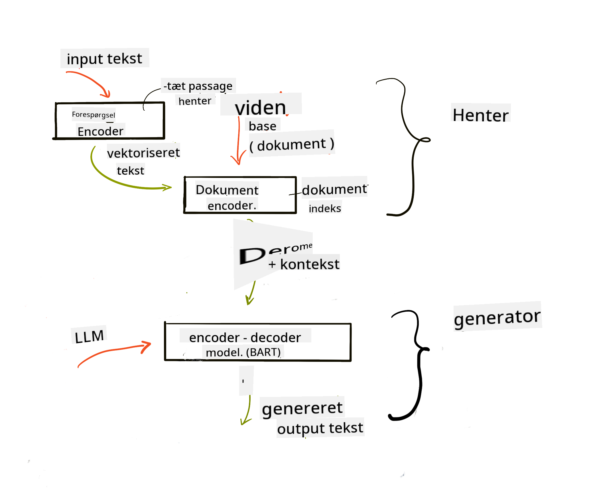
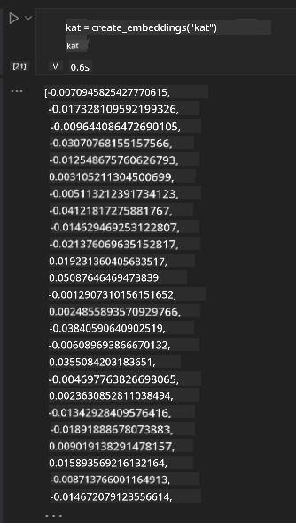

<!--
CO_OP_TRANSLATOR_METADATA:
{
  "original_hash": "e2861bbca91c0567ef32bc77fe054f9e",
  "translation_date": "2025-07-09T16:14:04+00:00",
  "source_file": "15-rag-and-vector-databases/README.md",
  "language_code": "da"
}
-->
# Retrieval Augmented Generation (RAG) og vektordatabaser

[](https://aka.ms/gen-ai-lesson15-gh?WT.mc_id=academic-105485-koreyst)

I lektionen om søgeapplikationer lærte vi kort, hvordan du kan integrere dine egne data i Large Language Models (LLMs). I denne lektion dykker vi dybere ned i begreberne omkring at forankre dine data i din LLM-applikation, mekanismerne i processen og metoderne til at gemme data, herunder både embeddings og tekst.

> **Video kommer snart**

## Introduktion

I denne lektion vil vi gennemgå følgende:

- En introduktion til RAG, hvad det er, og hvorfor det bruges inden for AI (kunstig intelligens).

- Forståelse af, hvad vektordatabaser er, og hvordan man opretter en til vores applikation.

- Et praktisk eksempel på, hvordan man integrerer RAG i en applikation.

## Læringsmål

Efter at have gennemført denne lektion vil du kunne:

- Forklare betydningen af RAG i datahentning og -behandling.

- Opsætte en RAG-applikation og forankre dine data til en LLM.

- Effektivt integrere RAG og vektordatabaser i LLM-applikationer.

## Vores scenarie: forbedring af vores LLM’er med egne data

I denne lektion ønsker vi at tilføje vores egne noter til uddannelsesstartuppen, hvilket gør det muligt for chatbotten at få mere information om de forskellige emner. Ved at bruge de noter, vi har, vil eleverne kunne studere bedre og forstå de forskellige emner, hvilket gør det nemmere at forberede sig til eksamener. Til at skabe vores scenarie vil vi bruge:

- `Azure OpenAI:` den LLM, vi bruger til at skabe vores chatbot

- `AI for beginners' lesson on Neural Networks:` dette bliver de data, vi forankrer vores LLM på

- `Azure AI Search` og `Azure Cosmos DB:` vektordatabaser til at gemme vores data og oprette et søgeindeks

Brugere vil kunne lave øvequizzer ud fra deres noter, repetitionsflashcards og opsummere det til korte oversigter. For at komme i gang, lad os se på, hvad RAG er, og hvordan det fungerer:

## Retrieval Augmented Generation (RAG)

En LLM-drevet chatbot behandler brugerforespørgsler for at generere svar. Den er designet til at være interaktiv og engagerer sig med brugere om mange forskellige emner. Dog er dens svar begrænset til den kontekst, der gives, og dens grundlæggende træningsdata. For eksempel har GPT-4 en vidensgrænse i september 2021, hvilket betyder, at den ikke kender til begivenheder, der er sket efter denne dato. Derudover udelukker de data, der bruges til at træne LLM’er, fortrolige oplysninger som personlige noter eller en virksomheds produktmanual.

### Hvordan RAGs (Retrieval Augmented Generation) fungerer


Antag, at du vil implementere en chatbot, der laver quizzer ud fra dine noter; så har du brug for en forbindelse til vidensbasen. Her kommer RAG til undsætning. RAGs fungerer på følgende måde:

- **Vidensbase:** Før hentning skal disse dokumenter indtastes og forbehandles, typisk ved at opdele store dokumenter i mindre bidder, omdanne dem til tekst-embedding og gemme dem i en database.

- **Brugerforespørgsel:** brugeren stiller et spørgsmål

- **Hentning:** Når en bruger stiller et spørgsmål, henter embeddings-modellen relevant information fra vores vidensbase for at give mere kontekst, som indgår i prompten.

- **Forstærket generering:** LLM’en forbedrer sit svar baseret på de hentede data. Det gør, at det genererede svar ikke kun baseres på forudtrænede data, men også på relevant information fra den tilføjede kontekst. De hentede data bruges til at forstærke LLM’ens svar. LLM’en returnerer derefter et svar på brugerens spørgsmål.



Arkitekturen for RAGs implementeres ved hjælp af transformers, der består af to dele: en encoder og en decoder. For eksempel, når en bruger stiller et spørgsmål, bliver inputteksten 'kodet' til vektorer, der fanger betydningen af ordene, og vektorerne 'afkodes' til vores dokumentindeks og genererer ny tekst baseret på brugerens forespørgsel. LLM’en bruger både en encoder-decoder-model til at generere output.

To tilgange til implementering af RAG ifølge den foreslåede artikel: [Retrieval-Augmented Generation for Knowledge intensive NLP (natural language processing software) Tasks](https://arxiv.org/pdf/2005.11401.pdf?WT.mc_id=academic-105485-koreyst) er:

- **_RAG-Sequence_** bruger hentede dokumenter til at forudsige det bedst mulige svar på en brugerforespørgsel

- **RAG-Token** bruger dokumenter til at generere det næste token og henter dem derefter for at besvare brugerens forespørgsel

### Hvorfor bruge RAGs?

- **Informationsrigdom:** sikrer, at tekstsvar er opdaterede og aktuelle. Det forbedrer derfor præstationen på domænespecifikke opgaver ved at få adgang til den interne vidensbase.

- Reducerer fabrikation ved at bruge **verificerbare data** i vidensbasen til at give kontekst til brugerforespørgsler.

- Det er **omkostningseffektivt**, da det er billigere end at finjustere en LLM.

## Oprettelse af en vidensbase

Vores applikation er baseret på vores personlige data, dvs. lektionen om neurale netværk i AI For Beginners-kurset.

### Vektordatabaser

En vektordatabase er, i modsætning til traditionelle databaser, en specialiseret database designet til at gemme, håndtere og søge i indlejrede vektorer. Den gemmer numeriske repræsentationer af dokumenter. Ved at opdele data til numeriske embeddings bliver det lettere for vores AI-system at forstå og behandle dataene.

Vi gemmer vores embeddings i vektordatabaser, da LLM’er har en grænse for, hvor mange tokens de kan modtage som input. Da du ikke kan sende hele embedding’en til en LLM, skal vi opdele dem i bidder, og når en bruger stiller et spørgsmål, returneres de embeddings, der bedst matcher spørgsmålet, sammen med prompten. Opdeling i bidder reducerer også omkostningerne ved antallet af tokens, der sendes gennem en LLM.

Nogle populære vektordatabaser inkluderer Azure Cosmos DB, Clarifyai, Pinecone, Chromadb, ScaNN, Qdrant og DeepLake. Du kan oprette en Azure Cosmos DB-model ved hjælp af Azure CLI med følgende kommando:

```bash
az login
az group create -n <resource-group-name> -l <location>
az cosmosdb create -n <cosmos-db-name> -r <resource-group-name>
az cosmosdb list-keys -n <cosmos-db-name> -g <resource-group-name>
```

### Fra tekst til embeddings

Før vi gemmer vores data, skal vi konvertere dem til vektor-embeddings, inden de gemmes i databasen. Hvis du arbejder med store dokumenter eller lange tekster, kan du opdele dem i bidder baseret på de forespørgsler, du forventer. Opdeling kan ske på sætningsniveau eller afsnitsniveau. Da opdeling udleder betydning fra de omkringliggende ord, kan du tilføje ekstra kontekst til en bid, for eksempel ved at tilføje dokumentets titel eller inkludere noget tekst før eller efter bidet. Du kan opdele dataene som følger:

```python
def split_text(text, max_length, min_length):
    words = text.split()
    chunks = []
    current_chunk = []

    for word in words:
        current_chunk.append(word)
        if len(' '.join(current_chunk)) < max_length and len(' '.join(current_chunk)) > min_length:
            chunks.append(' '.join(current_chunk))
            current_chunk = []

    # If the last chunk didn't reach the minimum length, add it anyway
    if current_chunk:
        chunks.append(' '.join(current_chunk))

    return chunks
```

Når de er opdelt, kan vi derefter indlejre vores tekst ved hjælp af forskellige embedding-modeller. Nogle modeller, du kan bruge, inkluderer: word2vec, ada-002 fra OpenAI, Azure Computer Vision og mange flere. Valget af model afhænger af de sprog, du bruger, typen af indhold (tekst/billeder/lyd), størrelsen af input, den kan kode, og længden af embedding-outputtet.

Et eksempel på indlejret tekst ved brug af OpenAI’s `text-embedding-ada-002` model er:


## Hentning og vektorsøgning

Når en bruger stiller et spørgsmål, omdanner retrieveren det til en vektor ved hjælp af query-encoderen, hvorefter den søger i vores dokumentindeks efter relevante vektorer i dokumentet, der relaterer til inputtet. Når det er gjort, konverterer den både inputvektoren og dokumentvektorerne til tekst og sender det gennem LLM’en.

### Hentning

Hentning sker, når systemet hurtigt prøver at finde dokumenter i indekset, der opfylder søgekriterierne. Målet med retrieveren er at finde dokumenter, der kan bruges til at give kontekst og forankre LLM’en i dine data.

Der er flere måder at udføre søgning i vores database på, såsom:

- **Nøgleordssøgning** – bruges til tekstsøgninger

- **Semantisk søgning** – bruger den semantiske betydning af ord

- **Vektorsøgning** – konverterer dokumenter fra tekst til vektorrepræsentationer ved hjælp af embedding-modeller. Hentning sker ved at forespørge dokumenter, hvis vektorrepræsentationer er tættest på brugerens spørgsmål.

- **Hybrid** – en kombination af både nøgleordssøgning og vektorsøgning.

En udfordring ved hentning opstår, når der ikke findes et lignende svar på forespørgslen i databasen; systemet vil så returnere den bedste information, det kan finde. Du kan dog bruge taktikker som at sætte en maksimal afstand for relevans eller bruge hybrid søgning, der kombinerer både nøgleord og vektorsøgning. I denne lektion bruger vi hybrid søgning, en kombination af både vektor- og nøgleordssøgning. Vi gemmer vores data i en dataframe med kolonner, der indeholder både bidder og embeddings.

### Vektorlignelighed

Retrieveren søger i vidensdatabasen efter embeddings, der ligger tæt på hinanden, den nærmeste nabo, da det er tekster, der ligner hinanden. I scenariet, hvor en bruger stiller et spørgsmål, bliver det først embedded og derefter matchet med lignende embeddings. Den mest almindelige måling, der bruges til at finde, hvor ens forskellige vektorer er, er cosinuslignelighed, som baseres på vinklen mellem to vektorer.

Vi kan også måle lighed ved hjælp af andre metoder som Euclidean distance, der er den lige linje mellem vektorendepunkter, og dot product, som måler summen af produkterne af tilsvarende elementer i to vektorer.

### Søgeindeks

Når vi laver hentning, skal vi opbygge et søgeindeks for vores vidensbase, før vi udfører søgning. Et indeks gemmer vores embeddings og kan hurtigt hente de mest lignende bidder, selv i en stor database. Vi kan oprette vores indeks lokalt ved hjælp af:

```python
from sklearn.neighbors import NearestNeighbors

embeddings = flattened_df['embeddings'].to_list()

# Create the search index
nbrs = NearestNeighbors(n_neighbors=5, algorithm='ball_tree').fit(embeddings)

# To query the index, you can use the kneighbors method
distances, indices = nbrs.kneighbors(embeddings)
```

### Omrangering

Når du har forespurgt databasen, kan det være nødvendigt at sortere resultaterne efter relevans. En omrangering-LLM bruger maskinlæring til at forbedre relevansen af søgeresultater ved at sortere dem fra mest til mindst relevant. Ved brug af Azure AI Search sker omrangering automatisk for dig ved hjælp af en semantisk omrangering. Et eksempel på, hvordan omrangering fungerer ved brug af nærmeste naboer:

```python
# Find the most similar documents
distances, indices = nbrs.kneighbors([query_vector])

index = []
# Print the most similar documents
for i in range(3):
    index = indices[0][i]
    for index in indices[0]:
        print(flattened_df['chunks'].iloc[index])
        print(flattened_df['path'].iloc[index])
        print(flattened_df['distances'].iloc[index])
    else:
        print(f"Index {index} not found in DataFrame")
```

## At samle det hele

Det sidste skridt er at tilføje vores LLM i processen for at kunne få svar, der er forankret i vores data. Vi kan implementere det som følger:

```python
user_input = "what is a perceptron?"

def chatbot(user_input):
    # Convert the question to a query vector
    query_vector = create_embeddings(user_input)

    # Find the most similar documents
    distances, indices = nbrs.kneighbors([query_vector])

    # add documents to query  to provide context
    history = []
    for index in indices[0]:
        history.append(flattened_df['chunks'].iloc[index])

    # combine the history and the user input
    history.append(user_input)

    # create a message object
    messages=[
        {"role": "system", "content": "You are an AI assistant that helps with AI questions."},
        {"role": "user", "content": history[-1]}
    ]

    # use chat completion to generate a response
    response = openai.chat.completions.create(
        model="gpt-4",
        temperature=0.7,
        max_tokens=800,
        messages=messages
    )

    return response.choices[0].message

chatbot(user_input)
```

## Evaluering af vores applikation

### Evalueringsmetrikker

- Kvaliteten af de leverede svar, der sikrer, at de lyder naturlige, flydende og menneskelige

- Forankring af data: vurdering af, om svaret stammer fra de leverede dokumenter

- Relevans: vurdering af, om svaret matcher og relaterer til det stillede spørgsmål

- Flydende sprog – om svaret giver grammatisk mening

## Anvendelsestilfælde for RAG (Retrieval Augmented Generation) og vektordatabaser

Der findes mange forskellige anvendelsestilfælde, hvor funktionskald kan forbedre din app, såsom:

- Spørgsmål og svar: forankring af virksomhedens data til en chat, som medarbejdere kan bruge til at stille spørgsmål.

- Anbefalingssystemer: hvor du kan skabe et system, der matcher de mest lignende værdier, f.eks. film, restauranter og meget mere.

- Chatbot-tjenester: du kan gemme chat-historik og personliggøre samtalen baseret på brugerdata.

- Billedsøgning baseret på vektor-embeddings, nyttigt ved billedgenkendelse og anomalidetektion.

## Resumé

Vi har dækket de grundlæggende områder af RAG fra tilføjelse af vores data til applikationen, brugerforespørgslen og output. For at forenkle oprettelsen af RAG kan du bruge frameworks som Semantic Kernel, Langchain eller Autogen.

## Opgave

For at fortsætte din læring om Retrieval Augmented Generation (RAG) kan du bygge:

- Byg et front-end til applikationen ved hjælp af det framework, du foretrækker

- Brug et framework, enten LangChain eller Semantic Kernel, og genskab din applikation.

Tillykke med at have gennemført lektionen 👏.

## Læringen stopper ikke her, fortsæt rejsen

Efter at have gennemført denne lektion, kan du tjekke vores [Generative AI Learning collection](https://aka.ms/genai-collection?WT.mc_id=academic-105485-koreyst) for at fortsætte med at udvikle din viden om Generativ AI!

**Ansvarsfraskrivelse**:  
Dette dokument er blevet oversat ved hjælp af AI-oversættelsestjenesten [Co-op Translator](https://github.com/Azure/co-op-translator). Selvom vi bestræber os på nøjagtighed, bedes du være opmærksom på, at automatiserede oversættelser kan indeholde fejl eller unøjagtigheder. Det oprindelige dokument på dets oprindelige sprog bør betragtes som den autoritative kilde. For kritisk information anbefales professionel menneskelig oversættelse. Vi påtager os intet ansvar for misforståelser eller fejltolkninger, der opstår som følge af brugen af denne oversættelse.