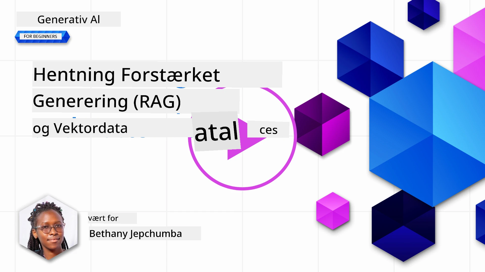
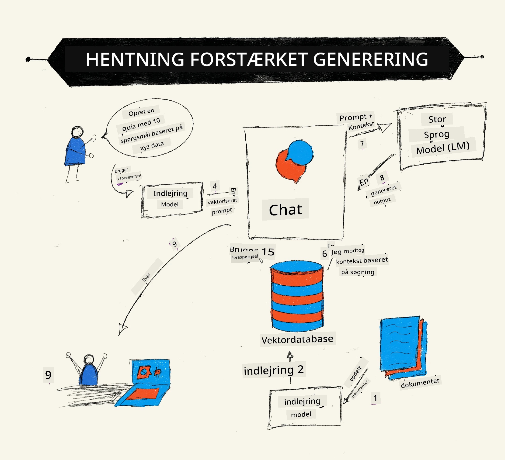
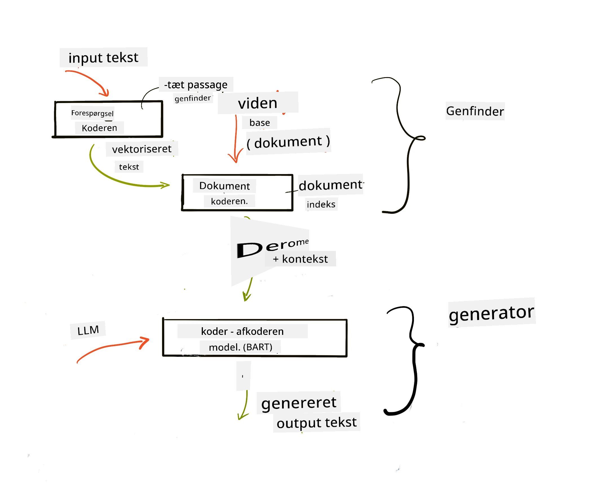
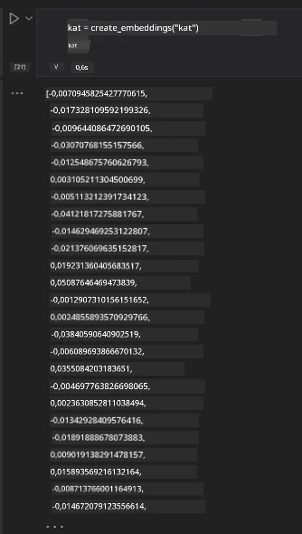

# Retrieval Augmented Generation (RAG) og Vektordatabaser

[](https://youtu.be/4l8zhHUBeyI?si=BmvDmL1fnHtgQYkL)

I lektionen om søgeapplikationer lærte vi kort, hvordan man integrerer dine egne data i Large Language Models (LLMs). I denne lektion vil vi dykke dybere ned i begreberne om at forankre dine data i din LLM-applikation, processens mekanik og metoderne til at gemme data, inklusive både embeddings og tekst.

> **Video kommer snart**

## Introduktion

I denne lektion vil vi dække følgende:

- En introduktion til RAG, hvad det er, og hvorfor det bruges i AI (kunstig intelligens).

- Forståelse af, hvad vektordatabaser er, og oprettelse af en til vores applikation.

- Et praktisk eksempel på, hvordan man integrerer RAG i en applikation.

## Læringsmål

Efter at have gennemført denne lektion vil du kunne:

- Forklare betydningen af RAG i dataindhentning og -behandling.

- Opsætte en RAG-applikation og forankre dine data til en LLM

- Effektiv integration af RAG og vektordatabaser i LLM-applikationer.

## Vores scenarie: forbedring af vores LLM'er med vores egne data

Til denne lektion ønsker vi at tilføje vores egne noter til uddannelsesstartuppet, som tillader chatbotten at få mere information om de forskellige emner. Ved hjælp af de noter, vi har, vil elever kunne studere bedre og forstå de forskellige emner, hvilket gør det nemmere at gennemgå til deres eksamener. For at skabe vores scenarie vil vi bruge:

- `Azure OpenAI:` den LLM vi vil bruge til at skabe vores chatbot

- `AI for beginners' lektion om neurale netværk`: dette vil være de data, vi forankrer vores LLM på

- `Azure AI Search` og `Azure Cosmos DB:` vektordatabaser til at gemme vores data og oprette et søgeindeks

Brugere vil kunne oprette øvelsesquizzer fra deres noter, revisionsflashcards og opsummere det til korte oversigter. For at komme i gang lad os se på, hvad RAG er, og hvordan det fungerer:

## Retrieval Augmented Generation (RAG)

En LLM-drevet chatbot behandler brugerprompter for at generere svar. Den er designet til at være interaktiv og engagerer sig med brugere om et bredt spektrum af emner. Dog er dens svar begrænset til den givne kontekst og dens grundlæggende træningsdata. For eksempel er GPT-4’s vidensafgrænsning i september 2021, hvilket betyder, at den ikke har viden om begivenheder, der er sket efter denne periode. Derudover udelukker de data, der bruges til at træne LLM'er, fortrolig information som personlige noter eller virksomheders produktmanualer.

### Hvordan RAGs (Retrieval Augmented Generation) fungerer



Antag, at du vil implementere en chatbot, der skaber quizzer fra dine noter, så vil du kræve en forbindelse til vidensbasen. Her kommer RAG til undsætning. RAGs fungerer som følger:

- **Vidensbase:** Før indhentning skal disse dokumenter indtastes og forbehandles, typisk ved at opdele store dokumenter i mindre bidder, transformere dem til tekstembedding og gemme dem i en database.

- **Brugerforespørgsel:** brugeren stiller et spørgsmål

- **Indhentning:** Når en bruger stiller et spørgsmål, henter embeddingsmodellen relevant information fra vores vidensbase for at give mere kontekst, som inkorporeres i prompten.

- **Forstærket generering:** LLM’en forbedrer sit svar baseret på de indhentede data. Det tillader, at det genererede svar ikke kun bygger på forudtrænede data, men også relevant information fra den tilføjede kontekst. De hentede data bruges til at forstærke LLM’s svar. LLM’en returnerer derefter et svar på brugerens spørgsmål.



Arkitekturen for RAGs implementeres ved hjælp af transformere bestående af to dele: en encoder og en decoder. For eksempel, når en bruger stiller et spørgsmål, 'encodes' inputtekst til vektorer, der fanger meningen med ordene, og vektorerne 'decodes' i vores dokumentindeks og genererer ny tekst baseret på brugerforespørgslen. LLM’en bruger både en encoder-decoder-model til at generere output.

To tilgange ved implementering af RAG ifølge den foreslåede artikel: [Retrieval-Augmented Generation for Knowledge intensive NLP (natural language processing software) Tasks](https://arxiv.org/pdf/2005.11401.pdf?WT.mc_id=academic-105485-koreyst) er:

- **_RAG-Sequence_** bruger hentede dokumenter til at forudsige det bedst mulige svar på en brugerforespørgsel

- **RAG-Token** bruger dokumenter til at generere det næste token, derefter hente dem til at svare på brugerens forespørgsel

### Hvorfor skulle du bruge RAGs?

- **Informationsrigdom:** sikrer, at tekstsvar er opdaterede og aktuelle. Det forbedrer dermed præstationen på domænespecifikke opgaver ved at få adgang til den interne vidensbase.

- Reducerer fabrikation ved at bruge **verificerbare data** i vidensbasen til at give kontekst til brugerforespørgsler.

- Det er **omkostningseffektivt**, da det er mere økonomisk sammenlignet med finjustering af en LLM

## Oprettelse af en vidensbase

Vores applikation er baseret på vores personlige data, dvs. lektionen om neurale netværk i AI For Beginners pensum.

### Vektordatabaser

En vektordatabasen, i modsætning til traditionelle databaser, er en specialiseret database designet til at gemme, håndtere og søge i indlejrede vektorer. Den gemmer numeriske repræsentationer af dokumenter. At nedbryde data til numeriske embeddings gør det lettere for vores AI-system at forstå og behandle data.

Vi gemmer vores embeddings i vektordatabaser, da LLM'er har en grænse for det antal tokens, de accepterer som input. Da du ikke kan sende hele embeddingene til en LLM, skal vi opdele dem i bidder, og når en bruger stiller et spørgsmål, vil de embedding-bidder, der mest ligner spørgsmålet, blive returneret sammen med prompten. Opdeling i bidder reducerer også omkostningerne på antallet af tokens, der sendes gennem en LLM.

Nogle populære vektordatabaser inkluderer Azure Cosmos DB, Clarifyai, Pinecone, Chromadb, ScaNN, Qdrant og DeepLake. Du kan oprette en Azure Cosmos DB-model ved hjælp af Azure CLI med følgende kommando:

```bash
az login
az group create -n <resource-group-name> -l <location>
az cosmosdb create -n <cosmos-db-name> -r <resource-group-name>
az cosmosdb list-keys -n <cosmos-db-name> -g <resource-group-name>
```

### Fra tekst til embeddings

Før vi gemmer vores data, skal vi konvertere dem til vektorembeddings, inden de gemmes i databasen. Hvis du arbejder med store dokumenter eller lange tekster, kan du opdele dem efter de forespørgsler, du forventer. Opdeling kan ske på sætningsniveau eller afsnitsniveau. Da opdeling udleder mening fra de omkringliggende ord, kan du tilføje noget anden kontekst til en bid, for eksempel ved at tilføje dokumenttitel eller inkludere noget tekst før eller efter biddet. Du kan opdele dataene som følger:

```python
def split_text(text, max_length, min_length):
    words = text.split()
    chunks = []
    current_chunk = []

    for word in words:
        current_chunk.append(word)
        if len(' '.join(current_chunk)) < max_length and len(' '.join(current_chunk)) > min_length:
            chunks.append(' '.join(current_chunk))
            current_chunk = []

    # Hvis det sidste stykke ikke nåede den minimale længde, tilføj det alligevel
    if current_chunk:
        chunks.append(' '.join(current_chunk))

    return chunks
```

Når de er opdelt, kan vi derefter indlejre vores tekst ved hjælp af forskellige embeddingsmodeller. Nogle modeller, du kan bruge, inkluderer: word2vec, ada-002 af OpenAI, Azure Computer Vision og mange flere. Valg af model afhænger af de sprog, du bruger, typen af indkodet indhold (tekst/billeder/lyd), størrelsen på input den kan indkode, og længden af embedding-output.

Et eksempel på embedded tekst ved hjælp af OpenAI’s `text-embedding-ada-002` model er:


## Indhentning og Vektorsøgning

Når en bruger stiller et spørgsmål, omdanner retrieveren det til en vektor ved hjælp af forespørgselsencoderen, og den søger derefter igennem vores dokument-søgeindeks efter relevante vektorer i dokumentet, der relaterer til input. Når det er gjort, omdanner den både inputvektoren og dokumentvektorerne til tekst og sender det gennem LLM.

### Indhentning

Indhentning sker, når systemet prøver hurtigt at finde dokumenterne i indekset, der opfylder søgekriterierne. Retrieverens mål er at hente dokumenter, som skal bruges til at give kontekst og forankre LLM på dine data.

Der er flere måder at udføre søgning i vores database på, såsom:

- **Nøgleordssøgning** - bruges til tekstsøgninger

- **Vektorsøgning** - omdanner dokumenter fra tekst til vektorrepræsentationer ved hjælp af embeddingsmodeller, hvilket tillader en **semantisk søgning** ved hjælp af ords betydning. Indhentning sker ved at spørge de dokumenter, hvis vektorrepræsentationer er tættest på brugerens spørgsmål.

- **Hybrid** - en kombination af både nøgleordssøgning og vektorsøgning.

En udfordring med indhentning opstår, når der ikke findes et lignende svar på forespørgslen i databasen; systemet vil så returnere den bedste information, det kan finde. Du kan dog bruge taktikker som at sætte maksimal afstand for relevans eller bruge hybridsøgning, som kombinerer både nøgleord og vektorsøgning. I denne lektion vil vi bruge hybridsøgning, en kombination af både vektor- og nøgleordssøgning. Vi vil gemme vores data i en dataframe med kolonner, der indeholder både bidder og embeddings.

### Vektorsimilartet

Retrieveren vil søge i vidensdatabasen efter embeddings, der ligger tæt, de nærmeste naboer, da de er tekster, der ligner hinanden. I scenariet spørger en bruger, først indlejres forespørgslen, og derefter matches den med lignende embeddings. Den mest almindelige måling, der bruges til at finde ud af, hvor lignende forskellige vektorer er, er cosinuslighed, som er baseret på vinklen mellem to vektorer.

Vi kan måle lighed med andre alternativer, f.eks. Euklidisk afstand, som er den lige linje mellem vektorendepunkter, og prikprodukt, som måler summen af produkterne af tilsvarende elementer i to vektorer.

### Søgeindeks

Når vi udfører indhentning, skal vi opbygge et søgeindeks til vores vidensbase, inden vi udfører søgning. Et indeks vil gemme vores embeddings og hurtigt kunne hente de mest lignende bidder, selv i en stor database. Vi kan skabe vores indeks lokalt ved hjælp af:

```python
from sklearn.neighbors import NearestNeighbors

embeddings = flattened_df['embeddings'].to_list()

# Opret søgeindekset
nbrs = NearestNeighbors(n_neighbors=5, algorithm='ball_tree').fit(embeddings)

# For at forespørge indekset kan du bruge kneighbors-metoden
distances, indices = nbrs.kneighbors(embeddings)
```

### Genranking

Når du har forespurgt i databasen, kan det være nødvendigt at sortere resultaterne fra det mest relevante. En genrankende LLM benytter maskinlæring til at forbedre relevansen af søgeresultater ved at ordne dem fra det mest relevante. Ved brug af Azure AI Search sker genrangeringen automatisk med en semantisk genranker. Et eksempel på, hvordan genrangering virker ved nærmeste naboer:

```python
# Find de mest lignende dokumenter
distances, indices = nbrs.kneighbors([query_vector])

index = []
# Udskriv de mest lignende dokumenter
for i in range(3):
    index = indices[0][i]
    for index in indices[0]:
        print(flattened_df['chunks'].iloc[index])
        print(flattened_df['path'].iloc[index])
        print(flattened_df['distances'].iloc[index])
    else:
        print(f"Index {index} not found in DataFrame")
```

## Sammenføring af det hele

Det sidste trin er at tilføje vores LLM i blandingen for at få svar, som er forankret i vores data. Vi kan implementere det som følger:

```python
user_input = "what is a perceptron?"

def chatbot(user_input):
    # Konverter spørgsmålet til en forespørgselsvektor
    query_vector = create_embeddings(user_input)

    # Find de mest lignende dokumenter
    distances, indices = nbrs.kneighbors([query_vector])

    # tilføj dokumenter til forespørgslen for at give kontekst
    history = []
    for index in indices[0]:
        history.append(flattened_df['chunks'].iloc[index])

    # kombiner historikken og brugerinputtet
    history.append(user_input)

    # opret et meddelelsesobjekt
    messages=[
        {"role": "system", "content": "You are an AI assistant that helps with AI questions."},
        {"role": "user", "content": "\n\n".join(history) }
    ]

    # brug Responses API'en til at generere et svar
    response = client.responses.create(
        model="gpt-4o-mini",
        temperature=0.7,
        max_output_tokens=800,
        input=messages,
        store=False,
    )

    return response.output_text

chatbot(user_input)
```

## Evaluering af vores applikation

### Evalueringsmål

- Kvaliteten af de leverede svar, der sikrer, at de lyder naturlige, flydende og menneskelige

- Forankring af data: evaluering af om svaret stammer fra de leverede dokumenter

- Relevans: evaluering af om svaret matcher og er relateret til det stillede spørgsmål

- Flydende - om svaret giver grammatisk mening

## Anvendelsestilfælde for brug af RAG (Retrieval Augmented Generation) og vektordatabaser

Der findes mange forskellige brugssituationer, hvor funktionskald kan forbedre din app, såsom:

- Spørgsmål og svar: forankre din virksomheds data til en chat, som medarbejdere kan bruge til at stille spørgsmål.

- Anbefalingssystemer: hvor du kan skabe et system, der matcher de mest lignende værdier f.eks. film, restauranter og mange flere.

- Chatbot-tjenester: du kan gemme chat-historik og personliggøre samtalen baseret på brugerdata.

- Billedsøgning baseret på vektorembeddings, nyttigt ved billedgenkendelse og anomalidetektion.

## Resumé

Vi har dækket de grundlæggende områder af RAG fra at tilføje vores data til applikationen, brugerforespørgslen og outputtet. For at forenkle skabelsen af RAG kan du bruge frameworks som Semantic Kernel, Langchain eller Autogen.

## Opgave

For at fortsætte din læring om Retrieval Augmented Generation (RAG) kan du bygge:

- Byg et frontend til applikationen ved hjælp af det framework, du vælger

- Udnyt et framework, enten LangChain eller Semantic Kernel, og genskab din applikation.

Tillykke med at have gennemført lektionen 👏.

## Læringen stopper ikke her, fortsæt rejsen

Efter at have gennemført denne lektion, tjek vores [Generative AI Learning collection](https://aka.ms/genai-collection?WT.mc_id=academic-105485-koreyst) for at fortsætte med at opgradere din viden om Generativ AI!

---

<!-- CO-OP TRANSLATOR DISCLAIMER START -->
**Ansvarsfraskrivelse**:
Dette dokument er blevet oversat ved hjælp af AI-oversættelsestjenesten [Co-op Translator](https://github.com/Azure/co-op-translator). Selvom vi bestræber os på nøjagtighed, skal du være opmærksom på, at automatiserede oversættelser kan indeholde fejl eller unøjagtigheder. Det originale dokument på dets oprindelige sprog bør betragtes som den autoritative kilde. For kritisk information anbefales professionel menneskelig oversættelse. Vi påtager os intet ansvar for misforståelser eller fejltolkninger, der opstår som følge af brugen af denne oversættelse.
<!-- CO-OP TRANSLATOR DISCLAIMER END -->