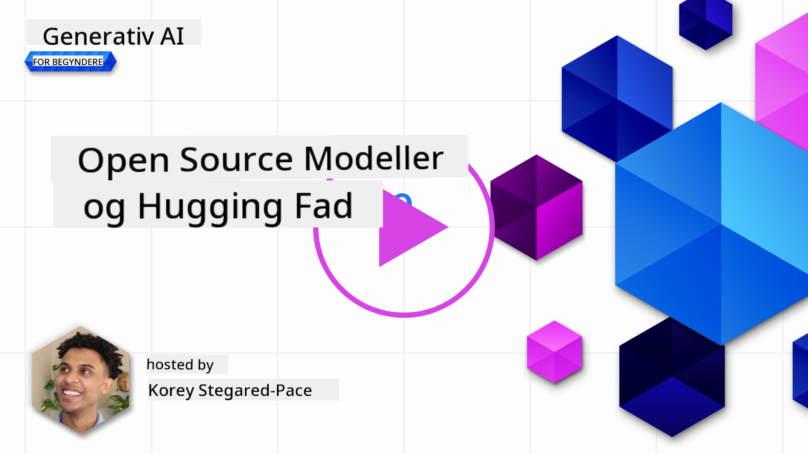
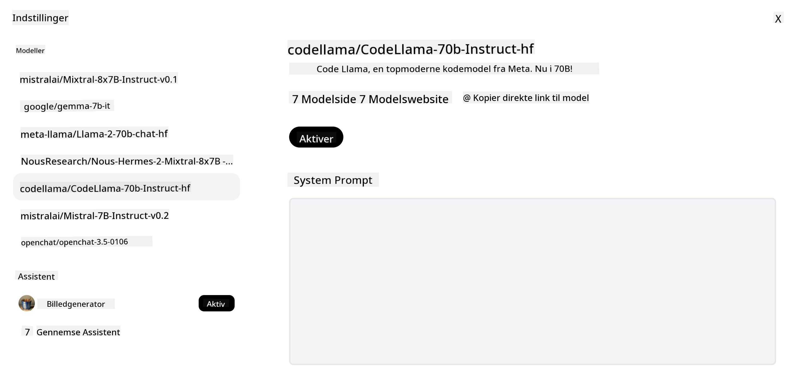

<!--
CO_OP_TRANSLATOR_METADATA:
{
  "original_hash": "0bba96e53ab841d99db731892a51fab8",
  "translation_date": "2025-05-20T06:57:20+00:00",
  "source_file": "16-open-source-models/README.md",
  "language_code": "da"
}
-->

## Introduktion

Verden af open-source LLM'er er spændende og konstant i udvikling. Denne lektion har til formål at give et dybdegående kig på open source-modeller. Hvis du leder efter information om, hvordan proprietære modeller sammenlignes med open source-modeller, gå til lektionen ["Exploring and Comparing Different LLMs"](../02-exploring-and-comparing-different-llms/README.md?WT.mc_id=academic-105485-koreyst). Denne lektion vil også dække emnet finjustering, men en mere detaljeret forklaring kan findes i lektionen ["Fine-Tuning LLMs"](../18-fine-tuning/README.md?WT.mc_id=academic-105485-koreyst).

## Læringsmål

- Få en forståelse af open source-modeller
- Forstå fordelene ved at arbejde med open source-modeller
- Udforske de åbne modeller tilgængelige på Hugging Face og Azure AI Studio

## Hvad er Open Source-modeller?

Open source-software har spillet en afgørende rolle i teknologiens vækst på tværs af forskellige felter. Open Source Initiative (OSI) har defineret [10 kriterier for software](https://web.archive.org/web/20241126001143/https://opensource.org/osd?WT.mc_id=academic-105485-koreyst) for at blive klassificeret som open source. Kildekoden skal være åbent delt under en licens godkendt af OSI.

Mens udviklingen af LLM'er har lignende elementer som udvikling af software, er processen ikke helt den samme. Dette har bragt meget diskussion i fællesskabet om definitionen af open source i sammenhæng med LLM'er. For at en model skal være i overensstemmelse med den traditionelle definition af open source, bør følgende information være offentligt tilgængelig:

- Datasæt brugt til at træne modellen.
- Fuld modelvægte som en del af træningen.
- Evalueringskoden.
- Finjusteringskoden.
- Fuld modelvægte og træningsmetrikker.

Der er i øjeblikket kun få modeller, der opfylder disse kriterier. [OLMo-modellen skabt af Allen Institute for Artificial Intelligence (AllenAI)](https://huggingface.co/allenai/OLMo-7B?WT.mc_id=academic-105485-koreyst) er en, der passer ind i denne kategori.

For denne lektion vil vi referere til modellerne som "åbne modeller" fremadrettet, da de muligvis ikke matcher kriterierne ovenfor på tidspunktet for skrivningen.

## Fordele ved åbne modeller

**Meget tilpasselig** - Da åbne modeller frigives med detaljeret træningsinformation, kan forskere og udviklere ændre modellens indre. Dette muliggør skabelsen af meget specialiserede modeller, der er finjusteret til en bestemt opgave eller studieområde. Nogle eksempler på dette er kodegenerering, matematiske operationer og biologi.

**Omkostninger** - Omkostningerne pr. token for brug og implementering af disse modeller er lavere end for proprietære modeller. Når du bygger Generative AI-applikationer, bør du se på ydeevne vs pris, når du arbejder med disse modeller på din brugssag.

  
Kilde: Artificial Analysis

**Fleksibilitet** - Arbejde med åbne modeller giver dig mulighed for at være fleksibel med hensyn til at bruge forskellige modeller eller kombinere dem. Et eksempel på dette er [HuggingChat Assistants](https://huggingface.co/chat?WT.mc_id=academic-105485-koreyst), hvor en bruger kan vælge den model, der bruges direkte i brugergrænsefladen:

## Udforskning af forskellige åbne modeller

### Llama 2

[LLama2](https://huggingface.co/meta-llama?WT.mc_id=academic-105485-koreyst), udviklet af Meta, er en åben model, der er optimeret til chatbaserede applikationer. Dette skyldes dens finjusteringsmetode, som inkluderede en stor mængde dialog og menneskelig feedback. Med denne metode producerer modellen flere resultater, der er i overensstemmelse med menneskelige forventninger, hvilket giver en bedre brugeroplevelse.

Nogle eksempler på finjusterede versioner af Llama inkluderer [Japanese Llama](https://huggingface.co/elyza/ELYZA-japanese-Llama-2-7b?WT.mc_id=academic-105485-koreyst), der specialiserer sig i japansk, og [Llama Pro](https://huggingface.co/TencentARC/LLaMA-Pro-8B?WT.mc_id=academic-105485-koreyst), som er en forbedret version af basismodellen.

### Mistral

[Mistral](https://huggingface.co/mistralai?WT.mc_id=academic-105485-koreyst) er en åben model med et stærkt fokus på høj ydeevne og effektivitet. Den bruger Mixture-of-Experts-tilgangen, som kombinerer en gruppe af specialiserede ekspertmodeller til ét system, hvor afhængigt af input vælges visse modeller til brug. Dette gør beregningen mere effektiv, da modellerne kun adresserer de inputs, de er specialiserede i.

Nogle eksempler på finjusterede versioner af Mistral inkluderer [BioMistral](https://huggingface.co/BioMistral/BioMistral-7B?text=Mon+nom+est+Thomas+et+mon+principal?WT.mc_id=academic-105485-koreyst), der fokuserer på det medicinske område, og [OpenMath Mistral](https://huggingface.co/nvidia/OpenMath-Mistral-7B-v0.1-hf?WT.mc_id=academic-105485-koreyst), som udfører matematiske beregninger.

### Falcon

[Falcon](https://huggingface.co/tiiuae?WT.mc_id=academic-105485-koreyst) er en LLM skabt af Technology Innovation Institute (**TII**). Falcon-40B blev trænet på 40 milliarder parametre, hvilket har vist sig at præstere bedre end GPT-3 med mindre beregningsbudget. Dette skyldes brugen af FlashAttention-algoritmen og multiquery attention, der gør det muligt at reducere hukommelseskravene ved inferenstidspunktet. Med denne reducerede inferenstid er Falcon-40B velegnet til chatapplikationer.

Nogle eksempler på finjusterede versioner af Falcon er [OpenAssistant](https://huggingface.co/OpenAssistant/falcon-40b-sft-top1-560?WT.mc_id=academic-105485-koreyst), en assistent bygget på åbne modeller, og [GPT4ALL](https://huggingface.co/nomic-ai/gpt4all-falcon?WT.mc_id=academic-105485-koreyst), der leverer højere ydeevne end basismodellen.

## Hvordan vælger man

Der er ikke ét svar på, hvordan man vælger en åben model. Et godt sted at starte er ved at bruge Azure AI Studios filter efter opgave-funktion. Dette vil hjælpe dig med at forstå, hvilke typer opgaver modellen er trænet til. Hugging Face vedligeholder også en LLM Leaderboard, der viser dig de bedst præsterende modeller baseret på visse metrikker.

Når du ønsker at sammenligne LLM'er på tværs af de forskellige typer, er [Artificial Analysis](https://artificialanalysis.ai/?WT.mc_id=academic-105485-koreyst) en anden god ressource:

  
Kilde: Artificial Analysis

Hvis du arbejder på en specifik brugssag, kan det være effektivt at søge efter finjusterede versioner, der fokuserer på det samme område. At eksperimentere med flere åbne modeller for at se, hvordan de præsterer i forhold til dine og dine brugeres forventninger, er en anden god praksis.

## Næste skridt

Det bedste ved åbne modeller er, at du kan komme i gang med at arbejde med dem ret hurtigt. Tjek [Azure AI Studio Model Catalog](https://ai.azure.com?WT.mc_id=academic-105485-koreyst), som har en specifik Hugging Face-samling med de modeller, vi diskuterede her.

## Læring stopper ikke her, fortsæt rejsen

Efter at have gennemført denne lektion, tjek vores [Generative AI Learning collection](https://aka.ms/genai-collection?WT.mc_id=academic-105485-koreyst) for at fortsætte med at opbygge din viden om Generative AI!

**Ansvarsfraskrivelse**:  
Dette dokument er blevet oversat ved hjælp af AI-oversættelsestjenesten [Co-op Translator](https://github.com/Azure/co-op-translator). Mens vi bestræber os på at opnå nøjagtighed, skal du være opmærksom på, at automatiserede oversættelser kan indeholde fejl eller unøjagtigheder. Det originale dokument på dets oprindelige sprog bør betragtes som den autoritative kilde. For kritisk information anbefales professionel menneskelig oversættelse. Vi er ikke ansvarlige for misforståelser eller fejltolkninger, der opstår som følge af brugen af denne oversættelse.