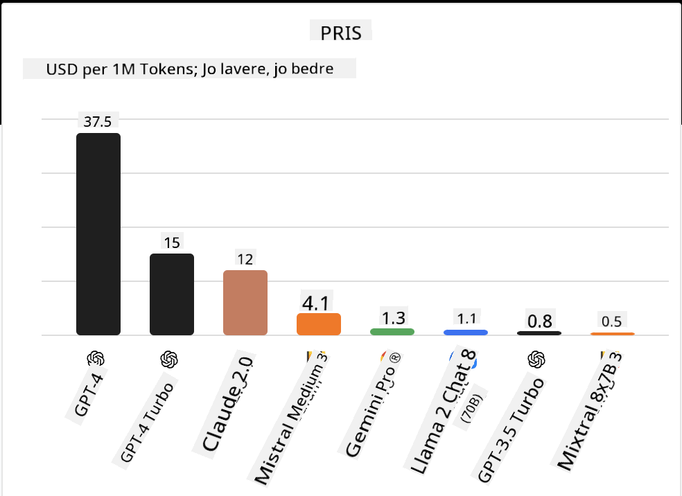
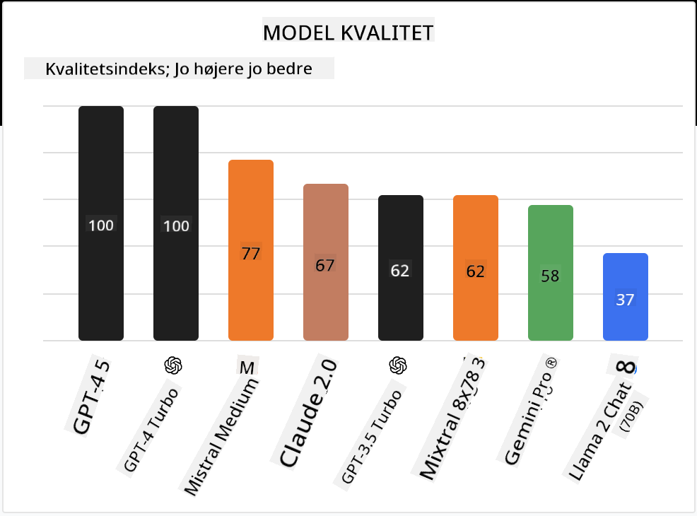

<!--
CO_OP_TRANSLATOR_METADATA:
{
  "original_hash": "a8b2d4bb727c877ebf9edff8623d16b9",
  "translation_date": "2025-09-06T10:19:12+00:00",
  "source_file": "16-open-source-models/README.md",
  "language_code": "da"
}
-->

## Introduktion

Verdenen af open source LLM'er er spændende og konstant under udvikling. Denne lektion har til formål at give et dybdegående kig på open source-modeller. Hvis du leder efter information om, hvordan proprietære modeller sammenlignes med open source-modeller, kan du gå til lektionen ["Udforskning og Sammenligning af Forskellige LLM'er"](../02-exploring-and-comparing-different-llms/README.md?WT.mc_id=academic-105485-koreyst). Denne lektion vil også berøre emnet finjustering, men en mere detaljeret forklaring kan findes i lektionen ["Finjustering af LLM'er"](../18-fine-tuning/README.md?WT.mc_id=academic-105485-koreyst).

## Læringsmål

- Få en forståelse af open source-modeller
- Forstå fordelene ved at arbejde med open source-modeller
- Udforske de åbne modeller, der er tilgængelige på Hugging Face og Azure AI Studio

## Hvad er Open Source-modeller?

Open source-software har spillet en afgørende rolle i teknologiens vækst på tværs af forskellige områder. Open Source Initiative (OSI) har defineret [10 kriterier for software](https://web.archive.org/web/20241126001143/https://opensource.org/osd?WT.mc_id=academic-105485-koreyst) for at blive klassificeret som open source. Kildekoden skal deles åbent under en licens godkendt af OSI.

Selvom udviklingen af LLM'er har lignende elementer som udvikling af software, er processen ikke helt den samme. Dette har skabt meget diskussion i fællesskabet om definitionen af open source i konteksten af LLM'er. For at en model kan være i overensstemmelse med den traditionelle definition af open source, skal følgende information være offentligt tilgængelig:

- Datasæt brugt til at træne modellen.
- Fulde modelvægte som en del af træningen.
- Evalueringskode.
- Finjusteringskode.
- Fulde modelvægte og træningsmetrikker.

Der er i øjeblikket kun få modeller, der opfylder disse kriterier. [OLMo-modellen skabt af Allen Institute for Artificial Intelligence (AllenAI)](https://huggingface.co/allenai/OLMo-7B?WT.mc_id=academic-105485-koreyst) er en af dem, der passer til denne kategori.

I denne lektion vil vi fremover referere til modellerne som "åbne modeller", da de muligvis ikke opfylder ovenstående kriterier på tidspunktet for skrivningen.

## Fordele ved Åbne Modeller

**Højt tilpasselige** - Da åbne modeller frigives med detaljeret træningsinformation, kan forskere og udviklere ændre modellens interne funktioner. Dette muliggør skabelsen af meget specialiserede modeller, der er finjusteret til en specifik opgave eller studieområde. Nogle eksempler på dette er kodegenerering, matematiske operationer og biologi.

**Omkostninger** - Omkostningerne pr. token for brug og implementering af disse modeller er lavere end for proprietære modeller. Når man bygger Generative AI-applikationer, bør man overveje ydeevne kontra pris i forhold til ens brugsscenarie.

  
Kilde: Artificial Analysis

**Fleksibilitet** - Arbejde med åbne modeller giver mulighed for fleksibilitet i forhold til at bruge forskellige modeller eller kombinere dem. Et eksempel på dette er [HuggingChat Assistants](https://huggingface.co/chat?WT.mc_id=academic-105485-koreyst), hvor en bruger kan vælge den model, der bruges direkte i brugergrænsefladen:

## Udforskning af Forskellige Åbne Modeller

### Llama 2

[LLama2](https://huggingface.co/meta-llama?WT.mc_id=academic-105485-koreyst), udviklet af Meta, er en åben model, der er optimeret til chatbaserede applikationer. Dette skyldes dens finjusteringsmetode, som inkluderede en stor mængde dialog og menneskelig feedback. Med denne metode producerer modellen flere resultater, der er i overensstemmelse med menneskelige forventninger, hvilket giver en bedre brugeroplevelse.

Nogle eksempler på finjusterede versioner af Llama inkluderer [Japanese Llama](https://huggingface.co/elyza/ELYZA-japanese-Llama-2-7b?WT.mc_id=academic-105485-koreyst), som specialiserer sig i japansk, og [Llama Pro](https://huggingface.co/TencentARC/LLaMA-Pro-8B?WT.mc_id=academic-105485-koreyst), som er en forbedret version af basismodellen.

### Mistral

[Mistral](https://huggingface.co/mistralai?WT.mc_id=academic-105485-koreyst) er en åben model med stærkt fokus på høj ydeevne og effektivitet. Den bruger Mixture-of-Experts-tilgangen, som kombinerer en gruppe af specialiserede ekspertmodeller i ét system, hvor afhængigt af input vælges visse modeller til brug. Dette gør beregningen mere effektiv, da modeller kun adresserer de inputs, de er specialiserede i.

Nogle eksempler på finjusterede versioner af Mistral inkluderer [BioMistral](https://huggingface.co/BioMistral/BioMistral-7B?text=Mon+nom+est+Thomas+et+mon+principal?WT.mc_id=academic-105485-koreyst), som fokuserer på det medicinske område, og [OpenMath Mistral](https://huggingface.co/nvidia/OpenMath-Mistral-7B-v0.1-hf?WT.mc_id=academic-105485-koreyst), som udfører matematiske beregninger.

### Falcon

[Falcon](https://huggingface.co/tiiuae?WT.mc_id=academic-105485-koreyst) er en LLM skabt af Technology Innovation Institute (**TII**). Falcon-40B blev trænet på 40 milliarder parametre, hvilket har vist sig at præstere bedre end GPT-3 med mindre beregningsbudget. Dette skyldes dens brug af FlashAttention-algoritmen og multiquery attention, der gør det muligt at reducere hukommelseskravene ved inferenstid. Med denne reducerede inferenstid er Falcon-40B velegnet til chatapplikationer.

Nogle eksempler på finjusterede versioner af Falcon er [OpenAssistant](https://huggingface.co/OpenAssistant/falcon-40b-sft-top1-560?WT.mc_id=academic-105485-koreyst), en assistent bygget på åbne modeller, og [GPT4ALL](https://huggingface.co/nomic-ai/gpt4all-falcon?WT.mc_id=academic-105485-koreyst), som leverer højere ydeevne end basismodellen.

## Hvordan Vælger Man?

Der findes ikke ét svar på, hvordan man vælger en åben model. Et godt sted at starte er ved at bruge Azure AI Studios filter efter opgave-funktion. Dette vil hjælpe dig med at forstå, hvilke typer opgaver modellen er trænet til. Hugging Face opretholder også en LLM Leaderboard, som viser de bedst præsterende modeller baseret på visse metrikker.

Når man ønsker at sammenligne LLM'er på tværs af forskellige typer, er [Artificial Analysis](https://artificialanalysis.ai/?WT.mc_id=academic-105485-koreyst) en anden fantastisk ressource:

  
Kilde: Artificial Analysis

Hvis du arbejder på et specifikt brugsscenarie, kan det være effektivt at søge efter finjusterede versioner, der fokuserer på det samme område. At eksperimentere med flere åbne modeller for at se, hvordan de præsterer i forhold til dine og dine brugeres forventninger, er også en god praksis.

## Næste Skridt

Det bedste ved åbne modeller er, at du hurtigt kan komme i gang med at arbejde med dem. Tjek [Azure AI Foundry Model Catalog](https://ai.azure.com?WT.mc_id=academic-105485-koreyst), som indeholder en specifik Hugging Face-samling med de modeller, vi har diskuteret her.

## Læring stopper ikke her, fortsæt rejsen

Efter at have gennemført denne lektion, kan du tjekke vores [Generative AI Learning collection](https://aka.ms/genai-collection?WT.mc_id=academic-105485-koreyst) for at fortsætte med at opbygge din viden om Generative AI!

---

**Ansvarsfraskrivelse**:  
Dette dokument er blevet oversat ved hjælp af AI-oversættelsestjenesten [Co-op Translator](https://github.com/Azure/co-op-translator). Selvom vi bestræber os på at opnå nøjagtighed, skal du være opmærksom på, at automatiserede oversættelser kan indeholde fejl eller unøjagtigheder. Det originale dokument på dets oprindelige sprog bør betragtes som den autoritative kilde. For kritisk information anbefales professionel menneskelig oversættelse. Vi er ikke ansvarlige for eventuelle misforståelser eller fejltolkninger, der måtte opstå som følge af brugen af denne oversættelse.