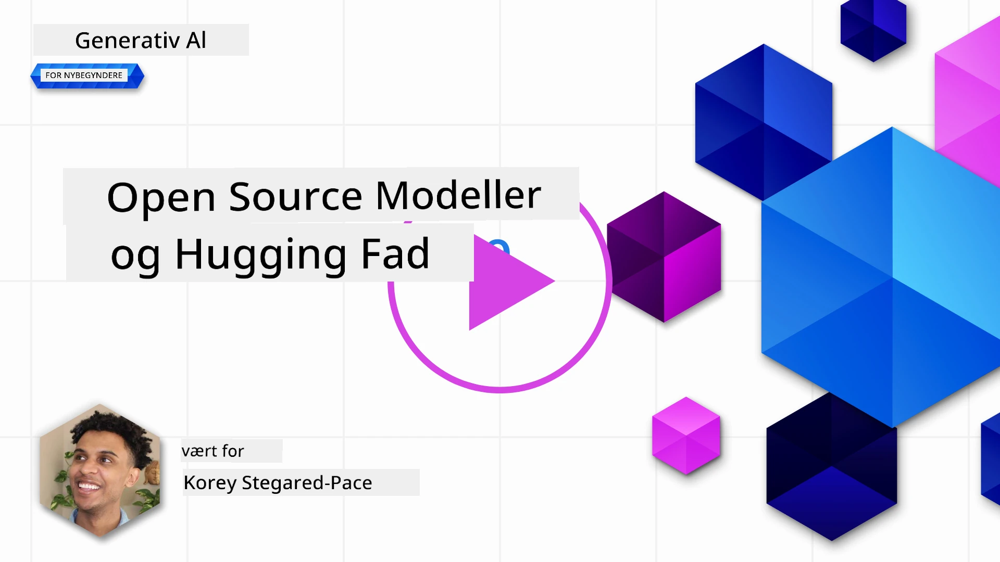
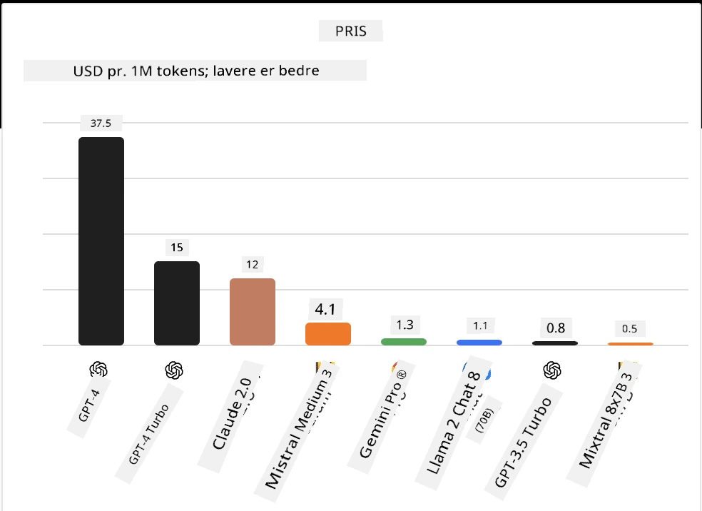
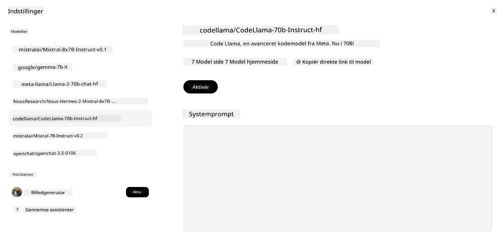
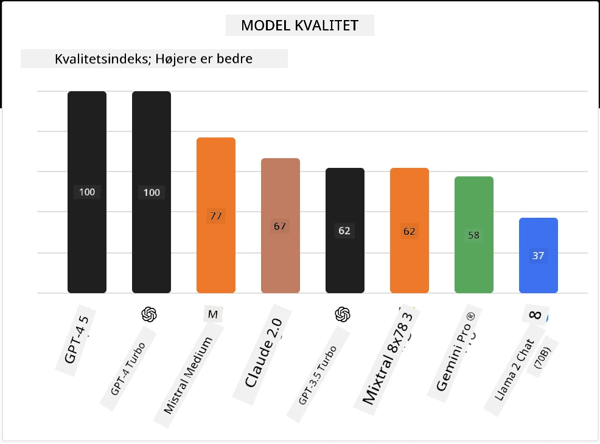

## Introduktion

Verdenen af open-source LLM'er er spændende og konstant i udvikling. Denne lektion sigter mod at give et dybdegående kig på open source-modeller. Hvis du søger information om, hvordan proprietære modeller sammenlignes med open source-modeller, gå til ["Exploring and Comparing Different LLMs" lektionen](../02-exploring-and-comparing-different-llms/README.md?WT.mc_id=academic-105485-koreyst). Denne lektion vil også dække emnet finjustering, men en mere detaljeret forklaring kan findes i ["Fine-Tuning LLMs" lektionen](../18-fine-tuning/README.md?WT.mc_id=academic-105485-koreyst).

## Læringsmål

- Få en forståelse af open source-modeller
- Forstå fordelene ved at arbejde med open source-modeller
- Udforske de åbne modeller, der er tilgængelige på Hugging Face og Microsoft Foundry modelkataloget

## Hvad er Open Source Modeller?

Open source-software har spillet en afgørende rolle i teknologiens vækst på tværs af forskellige felter. Open Source Initiative (OSI) har defineret [10 kriterier for software](https://web.archive.org/web/20241126001143/https://opensource.org/osd?WT.mc_id=academic-105485-koreyst) for at blive klassificeret som open source. Kildekoden skal være åbent delt under en licens, der er godkendt af OSI.

Selvom udviklingen af LLM'er har lignende elementer som softwareudvikling, er processen ikke helt den samme. Dette har ført til meget diskussion i fællesskabet om definitionen af open source i konteksten af LLM'er. For at en model skal være i overensstemmelse med den traditionelle definition af open source, bør følgende oplysninger være offentligt tilgængelige:

- Datasæt brugt til at træne modellen.
- Fuldstændige modelvægte som en del af træningen.
- Evalueringskoden.
- Finjusteringskoden.
- Fuldstændige modelvægte og træningsmålinger.

Der findes i øjeblikket kun få modeller, der opfylder disse kriterier. [OLMo-modellen, oprettet af Allen Institute for Artificial Intelligence (AllenAI)](https://huggingface.co/allenai/OLMo-7B?WT.mc_id=academic-105485-koreyst) er en model, der passer ind i denne kategori.

For denne lektion vil vi fremover referere til modellerne som "åbne modeller", da de måske ikke opfylder ovenstående kriterier på tidspunktet for skrivningen.

## Fordele ved Åbne Modeller

**Meget Tilpasningsdygtige** - Da åbne modeller frigives med detaljerede træningsoplysninger, kan forskere og udviklere ændre modellens interne strukturer. Dette muliggør oprettelsen af stærkt specialiserede modeller, der er finjusteret til en specifik opgave eller studieområde. Nogle eksempler på dette er kodegenerering, matematiske operationer og biologi.

**Omkostninger** - Omkostningen per token for at bruge og implementere disse modeller er lavere end for proprietære modeller. Når du bygger Generative AI-applikationer, bør du vurdere ydelse i forhold til pris, når du arbejder med disse modeller til din brugssag.

Kilde: Artificial Analysis

**Fleksibilitet** - At arbejde med åbne modeller giver dig fleksibilitet i forhold til at bruge forskellige modeller eller kombinere dem. Et eksempel på dette er [HuggingChat Assistants](https://huggingface.co/chat?WT.mc_id=academic-105485-koreyst), hvor en bruger kan vælge den model, der bruges direkte i brugergrænsefladen:

## Udforskning af Forskellige Åbne Modeller

### Llama 2

[LLama2](https://huggingface.co/meta-llama?WT.mc_id=academic-105485-koreyst), udviklet af Meta, er en åben model, der er optimeret til chatbaserede applikationer. Dette skyldes dens finjusteringsmetode, som inkluderede en stor mængde dialog og menneskelig feedback. Med denne metode producerer modellen resultater, der er mere i overensstemmelse med menneskelige forventninger, hvilket giver en bedre brugeroplevelse.

Nogle eksempler på finjusterede versioner af Llama inkluderer [Japanese Llama](https://huggingface.co/elyza/ELYZA-japanese-Llama-2-7b?WT.mc_id=academic-105485-koreyst), som specialiserer sig i japansk, og [Llama Pro](https://huggingface.co/TencentARC/LLaMA-Pro-8B?WT.mc_id=academic-105485-koreyst), som er en forbedret version af basismodellen.

### Mistral

[Mistral](https://huggingface.co/mistralai?WT.mc_id=academic-105485-koreyst) er en åben model med fokus på høj ydelse og effektivitet. Den bruger Mixture-of-Experts tilgangen, som kombinerer en gruppe af specialiserede ekspertmodeller til ét system, hvor visse modeller vælges afhængigt af inputtet. Dette gør beregningen mere effektiv, da modeller kun behandler de inputs, de er specialiserede i.

Nogle eksempler på finjusterede versioner af Mistral inkluderer [BioMistral](https://huggingface.co/BioMistral/BioMistral-7B?text=Mon+nom+est+Thomas+et+mon+principal?WT.mc_id=academic-105485-koreyst), som fokuserer på medicinsk domæne, og [OpenMath Mistral](https://huggingface.co/nvidia/OpenMath-Mistral-7B-v0.1-hf?WT.mc_id=academic-105485-koreyst), som udfører matematiske beregninger.

### Falcon

[Falcon](https://huggingface.co/tiiuae?WT.mc_id=academic-105485-koreyst) er en LLM skabt af Technology Innovation Institute (**TII**). Falcon-40B blev trænet på 40 milliarder parametre, hvilket har vist sig at præstere bedre end GPT-3 med mindre beregningsbudget. Dette skyldes brugen af FlashAttention-algoritmen og multiquery attention, som reducerer hukommelsesbehovet under inferens. Med denne reducerede inferenstid er Falcon-40B velegnet til chatapplikationer.

Nogle eksempler på finjusterede versioner af Falcon er [OpenAssistant](https://huggingface.co/OpenAssistant/falcon-40b-sft-top1-560?WT.mc_id=academic-105485-koreyst), en assistent bygget på åbne modeller, og [GPT4ALL](https://huggingface.co/nomic-ai/gpt4all-falcon?WT.mc_id=academic-105485-koreyst), som leverer højere ydelse end basismodellen.

## Hvordan man vælger

Der findes ikke ét svar på valg af en åben model. Et godt sted at starte er ved at bruge Microsoft Foundry modelkatalogets filter efter opgave-funktion. Dette vil hjælpe dig med at forstå, hvilke typer opgaver modellen er trænet til. Hugging Face vedligeholder også en LLM Leaderboard, som viser de bedst præsterende modeller baseret på visse målinger.

Når du vil sammenligne LLM'er på tværs af forskellige typer, er [Artificial Analysis](https://artificialanalysis.ai/?WT.mc_id=academic-105485-koreyst) en anden god ressource:

Kilde: Artificial Analysis

Hvis du arbejder med en specifik brugssag, kan det være effektivt at søge efter finjusterede versioner, der fokuserer på samme område. At eksperimentere med flere åbne modeller for at se, hvordan de præsterer i forhold til dine og dine brugeres forventninger, er også en god praksis.

## Næste skridt

Det bedste ved åbne modeller er, at du kan komme i gang med at arbejde med dem ret hurtigt. Tjek [Microsoft Foundry modelkataloget](https://ai.azure.com?WT.mc_id=academic-105485-koreyst), som har en specifik Hugging Face-samling med de modeller, vi har diskuteret her.

## Læringen stopper ikke her, fortsæt rejsen

Efter at have gennemført denne lektion, kan du tjekke vores [Generative AI Learning collection](https://aka.ms/genai-collection?WT.mc_id=academic-105485-koreyst) for at fortsætte med at øge din viden om Generative AI!

---

<!-- CO-OP TRANSLATOR DISCLAIMER START -->
**Ansvarsfraskrivelse**:
Dette dokument er blevet oversat ved hjælp af AI-oversættelsestjenesten [Co-op Translator](https://github.com/Azure/co-op-translator). Selvom vi bestræber os på nøjagtighed, skal du være opmærksom på, at automatiserede oversættelser kan indeholde fejl eller unøjagtigheder. Det originale dokument på dets oprindelige sprog bør betragtes som den autoritative kilde. For kritisk information anbefales professionel menneskelig oversættelse. Vi påtager os intet ansvar for misforståelser eller fejltolkninger, der opstår som følge af brugen af denne oversættelse.
<!-- CO-OP TRANSLATOR DISCLAIMER END -->