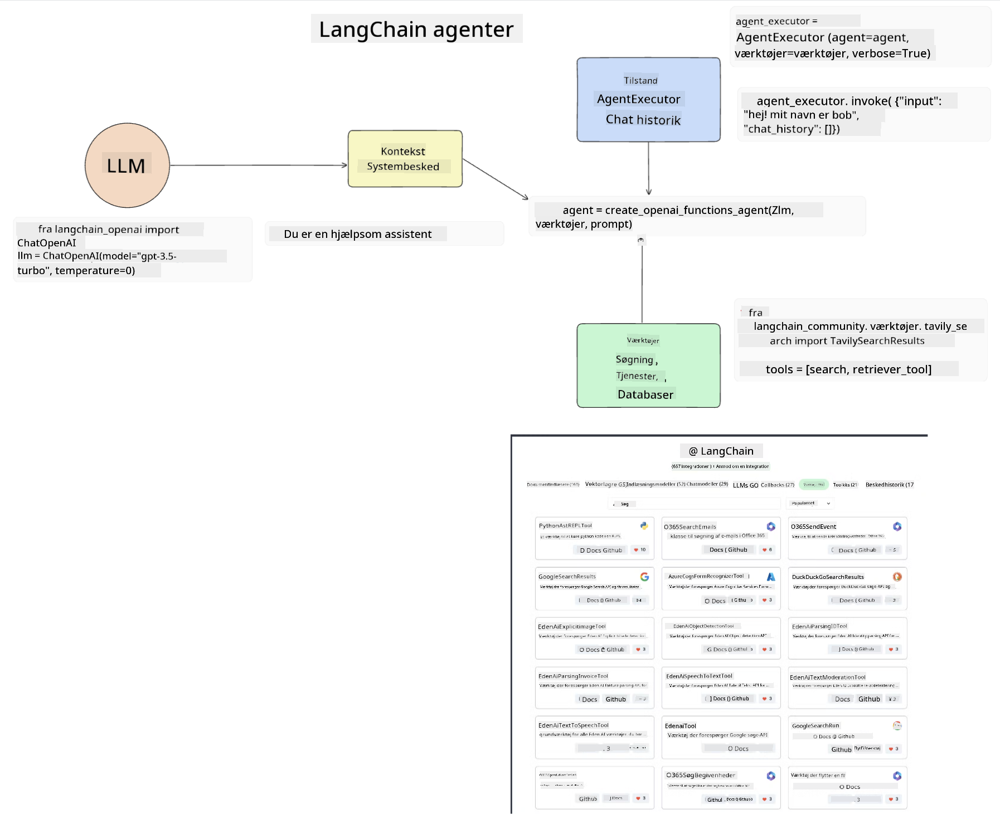
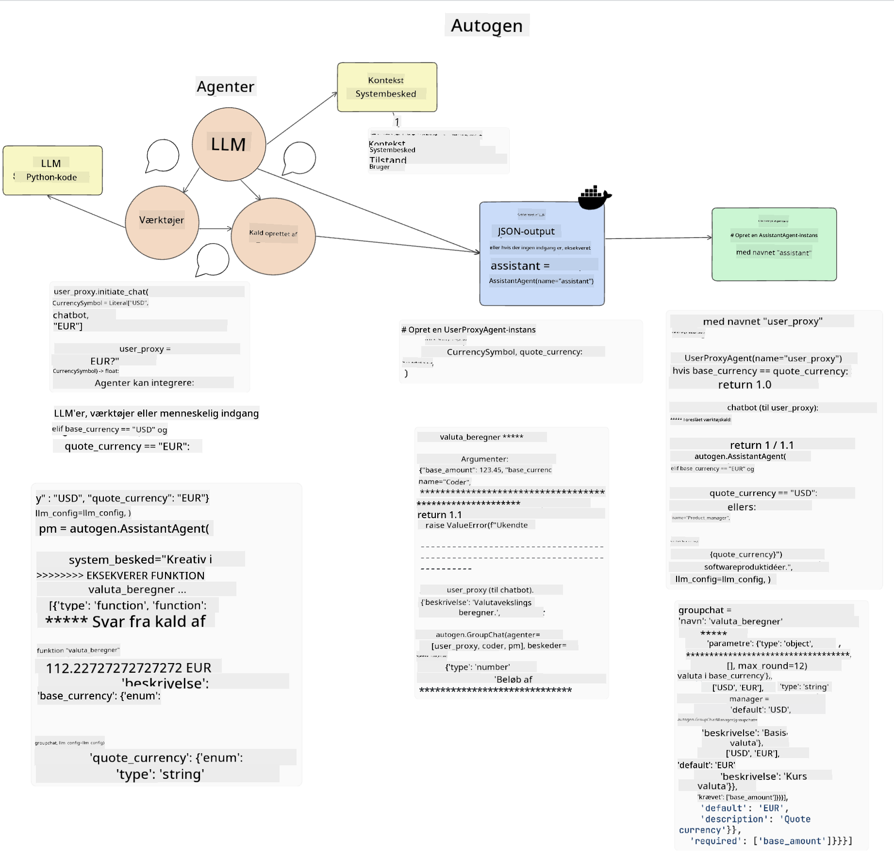

<!--
CO_OP_TRANSLATOR_METADATA:
{
  "original_hash": "11f03c81f190d9cbafd0f977dcbede6c",
  "translation_date": "2025-05-20T07:25:13+00:00",
  "source_file": "17-ai-agents/README.md",
  "language_code": "da"
}
-->
[](https://aka.ms/gen-ai-lesson17-gh?WT.mc_id=academic-105485-koreyst)

## Introduktion

AI-agenter repræsenterer en spændende udvikling inden for Generativ AI, hvor store sprogmodeller (LLMs) kan udvikle sig fra assistenter til agenter, der er i stand til at tage handlinger. AI-agent frameworks gør det muligt for udviklere at skabe applikationer, der giver LLMs adgang til værktøjer og tilstandsadministration. Disse frameworks forbedrer også synligheden, hvilket giver brugere og udviklere mulighed for at overvåge de handlinger, LLMs planlægger, og dermed forbedre oplevelsesstyringen.

Lektion vil dække følgende områder:

- Forståelse af hvad en AI-agent er - Hvad er en AI-agent præcist?
- Udforskning af fire forskellige AI-agent frameworks - Hvad gør dem unikke?
- Anvendelse af disse AI-agenter til forskellige anvendelsesområder - Hvornår bør vi bruge AI-agenter?

## Læringsmål

Efter at have taget denne lektion, vil du være i stand til at:

- Forklare hvad AI-agenter er, og hvordan de kan bruges.
- Have en forståelse af forskellene mellem nogle af de populære AI-agent frameworks, og hvordan de adskiller sig.
- Forstå hvordan AI-agenter fungerer for at kunne bygge applikationer med dem.

## Hvad er AI-agenter?

AI-agenter er et meget spændende felt inden for Generativ AI. Med denne spænding kommer nogle gange en forvirring omkring termer og deres anvendelse. For at holde tingene enkle og inkluderende for de fleste værktøjer, der henviser til AI-agenter, vil vi bruge denne definition:

AI-agenter giver store sprogmodeller (LLMs) mulighed for at udføre opgaver ved at give dem adgang til en **tilstand** og **værktøjer**.


Lad os definere disse termer:

**Store sprogmodeller** - Dette er de modeller, der henvises til i hele dette kursus, såsom GPT-3.5, GPT-4, Llama-2, osv.

**Tilstand** - Dette refererer til den kontekst, som LLM arbejder i. LLM bruger konteksten af sine tidligere handlinger og den aktuelle kontekst, som guider dens beslutningstagning for efterfølgende handlinger. AI-agent frameworks gør det lettere for udviklere at vedligeholde denne kontekst.

**Værktøjer** - For at fuldføre den opgave, som brugeren har anmodet om, og som LLM har planlagt, har LLM brug for adgang til værktøjer. Nogle eksempler på værktøjer kan være en database, en API, en ekstern applikation eller endda en anden LLM!

Disse definitioner vil forhåbentlig give dig et godt grundlag fremadrettet, når vi ser på, hvordan de implementeres. Lad os udforske nogle forskellige AI-agent frameworks:

## LangChain Agents

[LangChain Agents](https://python.langchain.com/docs/how_to/#agents?WT.mc_id=academic-105485-koreyst) er en implementering af de definitioner, vi gav ovenfor.

For at administrere **tilstanden** bruger den en indbygget funktion kaldet `AgentExecutor`. Denne accepterer den definerede `agent` og de `tools`, der er tilgængelige for den.

`Agent Executor` gemmer også chathistorikken for at give konteksten af chatten.



LangChain tilbyder et [katalog af værktøjer](https://integrations.langchain.com/tools?WT.mc_id=academic-105485-koreyst), der kan importeres til din applikation, hvor LLM kan få adgang til dem. Disse er lavet af fællesskabet og af LangChain-teamet.

Du kan derefter definere disse værktøjer og sende dem til `Agent Executor`.

Synlighed er et andet vigtigt aspekt, når man taler om AI-agenter. Det er vigtigt for applikationsudviklere at forstå, hvilket værktøj LLM bruger og hvorfor. For det har teamet hos LangChain udviklet LangSmith.

## AutoGen

Det næste AI-agent framework, vi vil diskutere, er [AutoGen](https://microsoft.github.io/autogen/?WT.mc_id=academic-105485-koreyst). Hovedfokus for AutoGen er samtaler. Agenter er både **samtalebare** og **tilpasningsdygtige**.

**Samtalebare -** LLMs kan starte og fortsætte en samtale med en anden LLM for at fuldføre en opgave. Dette gøres ved at oprette `AssistantAgents` og give dem en specifik systemmeddelelse.

```python

autogen.AssistantAgent( name="Coder", llm_config=llm_config, ) pm = autogen.AssistantAgent( name="Product_manager", system_message="Creative in software product ideas.", llm_config=llm_config, )

```

**Tilpasningsdygtige** - Agenter kan defineres ikke kun som LLMs, men også som en bruger eller et værktøj. Som udvikler kan du definere en `UserProxyAgent`, som er ansvarlig for at interagere med brugeren for feedback i forbindelse med at fuldføre en opgave. Denne feedback kan enten fortsætte udførelsen af opgaven eller stoppe den.

```python
user_proxy = UserProxyAgent(name="user_proxy")
```

### Tilstand og værktøjer

For at ændre og administrere tilstanden genererer en assistentagent Python-kode for at fuldføre opgaven.

Her er et eksempel på processen:



#### LLM defineret med en systemmeddelelse

```python
system_message="For weather related tasks, only use the functions you have been provided with. Reply TERMINATE when the task is done."
```

Denne systemmeddelelse leder denne specifikke LLM til, hvilke funktioner der er relevante for dens opgave. Husk, med AutoGen kan du have flere definerede AssistantAgents med forskellige systemmeddelelser.

#### Chat initieres af bruger

```python
user_proxy.initiate_chat( chatbot, message="I am planning a trip to NYC next week, can you help me pick out what to wear? ", )

```

Denne meddelelse fra user_proxy (menneske) er det, der vil starte processen for agenten til at udforske de mulige funktioner, den bør udføre.

#### Funktion udføres

```bash
chatbot (to user_proxy):

***** Suggested tool Call: get_weather ***** Arguments: {"location":"New York City, NY","time_periond:"7","temperature_unit":"Celsius"} ******************************************************** --------------------------------------------------------------------------------

>>>>>>>> EXECUTING FUNCTION get_weather... user_proxy (to chatbot): ***** Response from calling function "get_weather" ***** 112.22727272727272 EUR ****************************************************************

```

Når den indledende chat er behandlet, vil agenten sende det foreslåede værktøj til at kalde. I dette tilfælde er det en funktion kaldet `get_weather`. Depending on your configuration, this function can be automatically executed and read by the Agent or can be executed based on user input.

You can find a list of [AutoGen code samples](https://microsoft.github.io/autogen/docs/Examples/?WT.mc_id=academic-105485-koreyst) to further explore how to get started building.

## Taskweaver

The next agent framework we will explore is [Taskweaver](https://microsoft.github.io/TaskWeaver/?WT.mc_id=academic-105485-koreyst). It is known as a "code-first" agent because instead of working strictly with `strings` , it can work with DataFrames in Python. This becomes extremely useful for data analysis and generation tasks. This can be things like creating graphs and charts or generating random numbers.

### State and Tools

To manage the state of the conversation, TaskWeaver uses the concept of a `Planner`. The `Planner` is a LLM that takes the request from the users and maps out the tasks that need to be completed to fulfill this request.

To complete the tasks the `Planner` is exposed to the collection of tools called `Plugins`. Dette kan være Python-klasser eller en generel kodefortolker. Disse plugins gemmes som embeddings, så LLM bedre kan søge efter det korrekte plugin.


Her er et eksempel på et plugin til håndtering af anomali-detektion:

```python
class AnomalyDetectionPlugin(Plugin): def __call__(self, df: pd.DataFrame, time_col_name: str, value_col_name: str):
```

Koden verificeres før udførelse. En anden funktion til at administrere kontekst i Taskweaver er `experience`. Experience allows for the context of a conversation to be stored over to the long term in a YAML file. This can be configured so that the LLM improves over time on certain tasks given that it is exposed to prior conversations.

## JARVIS

The last agent framework we will explore is [JARVIS](https://github.com/microsoft/JARVIS?tab=readme-ov-file?WT.mc_id=academic-105485-koreyst). What makes JARVIS unique is that it uses an LLM to manage the `state` af samtalen, og `tools` er andre AI-modeller. Hver af AI-modellerne er specialiserede modeller, der udfører bestemte opgaver såsom objektgenkendelse, transkription eller billedtekstning.


LLM, som er en generel model, modtager anmodningen fra brugeren og identificerer den specifikke opgave og eventuelle argumenter/data, der er nødvendige for at fuldføre opgaven.

```python
[{"task": "object-detection", "id": 0, "dep": [-1], "args": {"image": "e1.jpg" }}]
```

LLM formaterer derefter anmodningen på en måde, som den specialiserede AI-model kan fortolke, såsom JSON. Når AI-modellen har returneret sin forudsigelse baseret på opgaven, modtager LLM svaret.

Hvis flere modeller er nødvendige for at fuldføre opgaven, vil den også fortolke svaret fra disse modeller, før de bringes sammen for at generere svaret til brugeren.

Eksemplet nedenfor viser, hvordan dette ville fungere, når en bruger anmoder om en beskrivelse og tælling af objekterne i et billede:

## Opgave

For at fortsætte din læring om AI-agenter kan du bygge med AutoGen:

- En applikation, der simulerer et forretningsmøde med forskellige afdelinger i en uddannelsesstartup.
- Opret systemmeddelelser, der guider LLMs i at forstå forskellige personligheder og prioriteter og gør det muligt for brugeren at præsentere en ny produktidé.
- LLM bør derefter generere opfølgende spørgsmål fra hver afdeling for at forfine og forbedre præsentationen og produktideen.

## Læring stopper ikke her, fortsæt rejsen

Efter at have afsluttet denne lektion, tjek vores [Generative AI Learning collection](https://aka.ms/genai-collection?WT.mc_id=academic-105485-koreyst) for at fortsætte med at opgradere din viden om Generativ AI!

**Ansvarsfraskrivelse**:  
Dette dokument er blevet oversat ved hjælp af AI-oversættelsestjenesten [Co-op Translator](https://github.com/Azure/co-op-translator). Selvom vi bestræber os på at sikre nøjagtighed, skal du være opmærksom på, at automatiserede oversættelser kan indeholde fejl eller unøjagtigheder. Det originale dokument på dets oprindelige sprog bør betragtes som den autoritative kilde. For kritisk information anbefales professionel menneskelig oversættelse. Vi er ikke ansvarlige for eventuelle misforståelser eller fejltolkninger, der måtte opstå som følge af brugen af denne oversættelse.