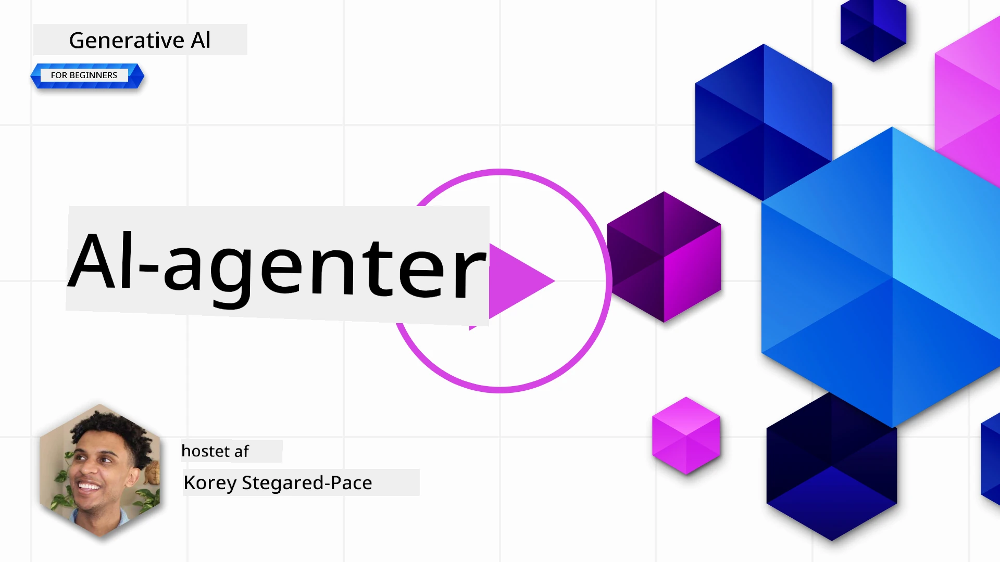
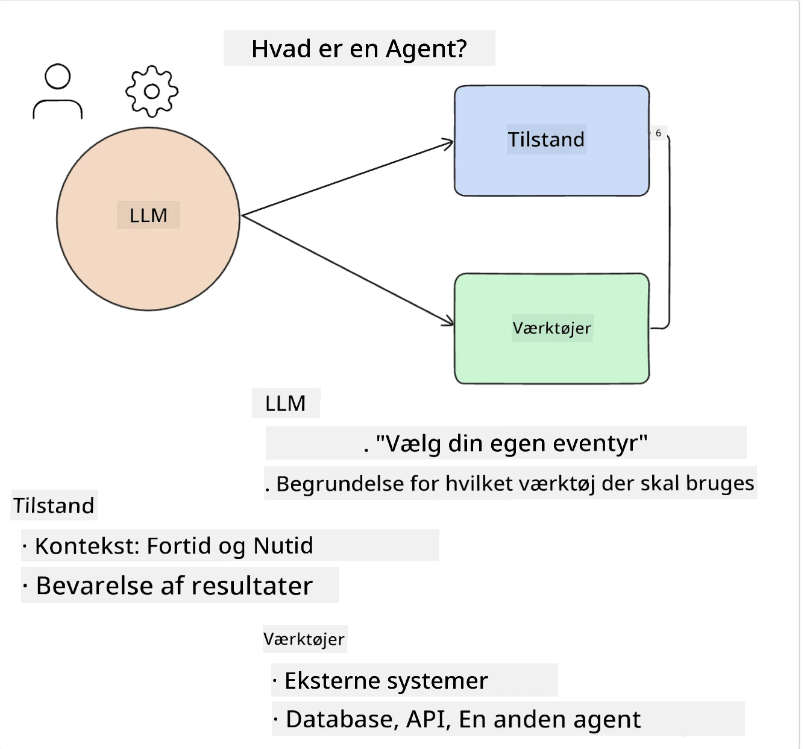
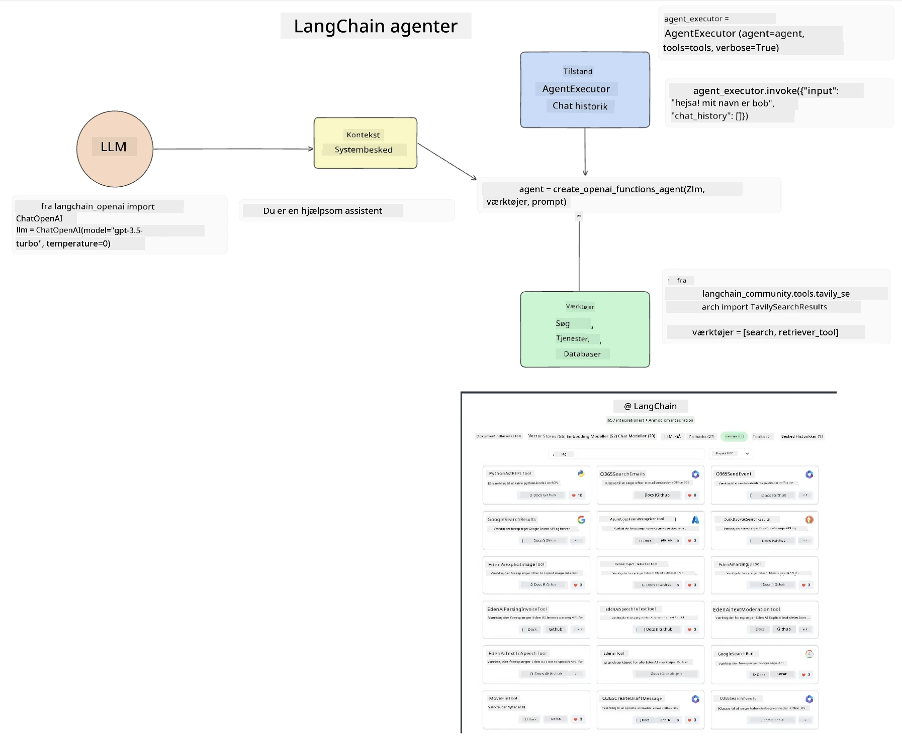
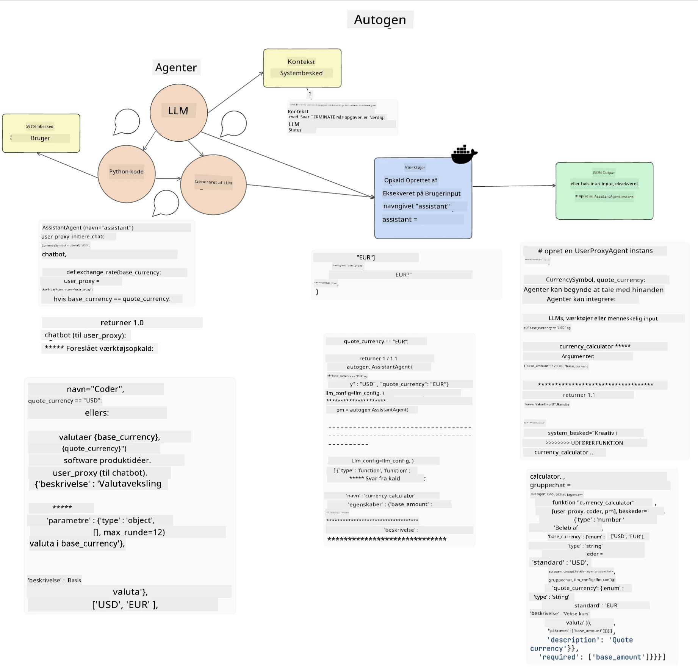
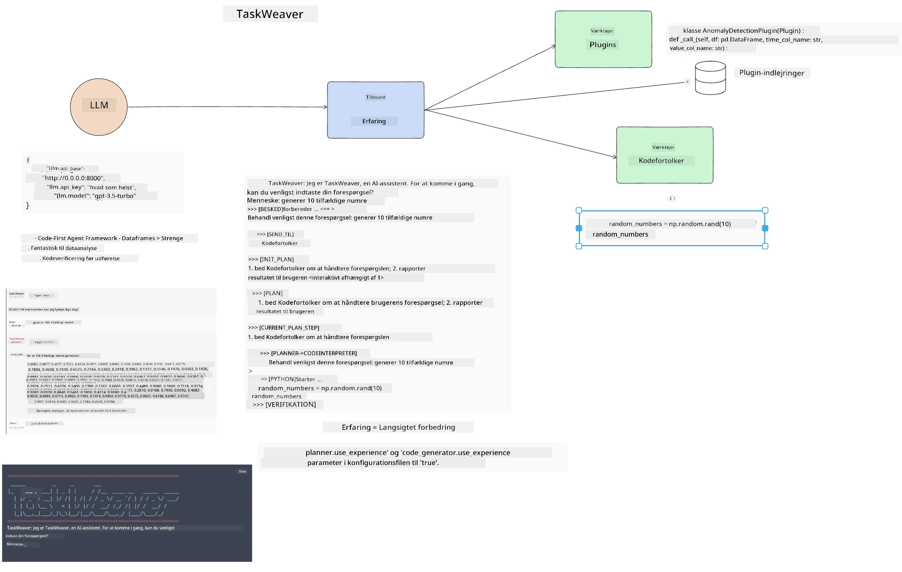
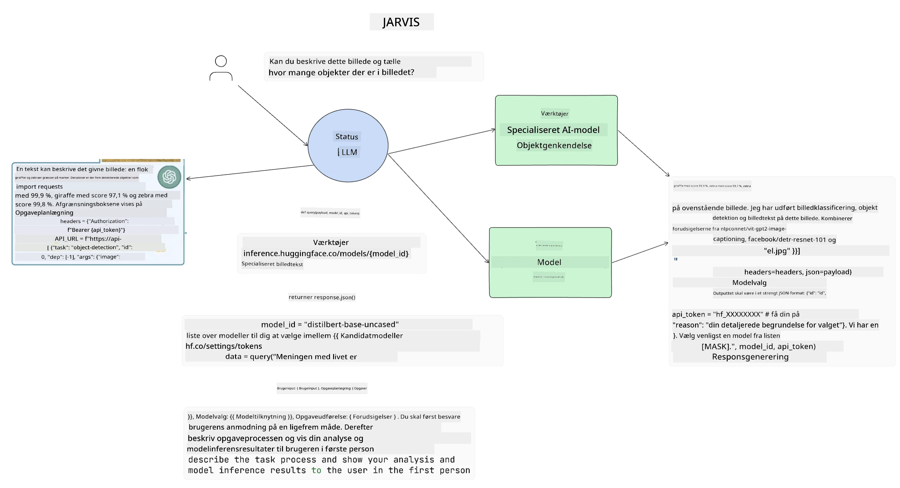

[](https://youtu.be/yAXVW-lUINc?si=bOtW9nL6jc3XJgOM)

## Introduktion

AI-agenter repræsenterer en spændende udvikling inden for Generativ AI, der gør det muligt for Store Sprogsmodeller (LLMs) at udvikle sig fra assistenter til agenter, der kan tage handlinger. AI Agent-rammeværker giver udviklere mulighed for at skabe applikationer, der giver LLM'erne adgang til værktøjer og tilstandsadministration. Disse rammeværker øger også synligheden, så brugere og udviklere kan overvåge de handlinger, som LLM'erne planlægger, hvilket forbedrer oplevelsesstyringen.

Lektionen vil dække følgende områder:

- Forstå hvad en AI Agent er - Hvad er en AI Agent egentlig?
- Udforske fire forskellige AI Agent-rammeværker - Hvad gør dem unikke?
- Anvende disse AI-agenter til forskellige anvendelsestilfælde - Hvornår skal vi bruge AI-agenter?

## Læringsmål

Efter at have gennemført denne lektion vil du være i stand til at:

- Forklare hvad AI-agenter er, og hvordan de kan bruges.
- Have en forståelse af forskellene mellem nogle af de populære AI Agent-rammeværker, og hvordan de adskiller sig.
- Forstå hvordan AI Agent fungerer for at bygge applikationer med dem.

## Hvad er AI-agenter?

AI-agenter er et meget spændende område inden for Generativ AI. Med denne spænding følger nogle gange forvirring omkring begreber og deres anvendelse. For at holde det simpelt og inklusivt for de fleste af de værktøjer, der omtaler AI-agenter, vil vi bruge denne definition:

AI-agenter giver Store Sprogsmodeller (LLMs) mulighed for at udføre opgaver ved at give dem adgang til en **tilstand** og **værktøjer**.



Lad os definere disse termer:

**Store Sprogsmodeller** – Dette er de modeller, der omtales i hele dette kursus såsom GPT-3.5, GPT-4, Llama-2 osv.

**Tilstand** – Dette henviser til den kontekst, som LLM arbejder i. LLM bruger konteksten fra sine tidligere handlinger og den nuværende kontekst, hvilket styrer dens beslutningstagning for efterfølgende handlinger. AI Agent-rammeværker gør det lettere for udviklere at vedligeholde denne kontekst.

**Værktøjer** – For at fuldføre den opgave, som brugeren har anmodet om, og som LLM har planlagt, har LLM brug for adgang til værktøjer. Nogle eksempler på værktøjer kan være en database, en API, en ekstern applikation eller endda en anden LLM!

Disse definitioner vil forhåbentlig give dig et godt fundament fremadrettet, når vi ser på, hvordan de implementeres. Lad os udforske nogle forskellige AI Agent-rammeværker:

## LangChain Agents

[LangChain Agents](https://python.langchain.com/docs/how_to/#agents?WT.mc_id=academic-105485-koreyst) er en implementering af de definitioner, vi gav ovenfor.

For at håndtere **tilstanden** bruger det en indbygget funktion kaldet `AgentExecutor`. Denne accepterer den definerede `agent` og de `værktøjer`, der er tilgængelige for den.

`AgentExecutor` gemmer også chat-historikken for at give kontekst til chatten.



LangChain tilbyder et [katalog over værktøjer](https://integrations.langchain.com/tools?WT.mc_id=academic-105485-koreyst), der kan importeres til din applikation, som LLM herefter kan få adgang til. Disse er lavet af fællesskabet og LangChain-teamet.

Du kan derefter definere disse værktøjer og sende dem til `AgentExecutor`.

Synlighed er et andet vigtigt aspekt, når vi taler om AI-agenter. Det er vigtigt for applikationsudviklere at forstå, hvilket værktøj LLM bruger og hvorfor. Derfor har teamet bag LangChain udviklet LangSmith.

## AutoGen

Det næste AI Agent-rammeværk vi vil diskutere er [AutoGen](https://microsoft.github.io/autogen/?WT.mc_id=academic-105485-koreyst). Hovedfokus for AutoGen er samtaler. Agenter er både **samtalebare** og **tilpasselige**.

**Samtalebare –** LLM'er kan starte og fortsætte en samtale med en anden LLM for at fuldføre en opgave. Dette gøres ved at oprette `AssistantAgents` og give dem en specifik systembesked.

```python

autogen.AssistantAgent( name="Coder", llm_config=llm_config, ) pm = autogen.AssistantAgent( name="Product_manager", system_message="Creative in software product ideas.", llm_config=llm_config, )

```

**Tilpasselige** – Agenter kan defineres ikke kun som LLM'er, men også som en bruger eller et værktøj. Som udvikler kan du definere en `UserProxyAgent`, der er ansvarlig for at interagere med brugeren for feedback i udførelsen af en opgave. Denne feedback kan enten fortsætte eller stoppe udførelsen af opgaven.

```python
user_proxy = UserProxyAgent(name="user_proxy")
```

### Tilstand og værktøjer

For at ændre og håndtere tilstanden genererer en assistentagent Python-kode for at fuldføre opgaven.

Her er et eksempel på processen:



#### LLM defineret med en systembesked

```python
system_message="For weather related tasks, only use the functions you have been provided with. Reply TERMINATE when the task is done."
```

Denne systembesked dirigerer denne specifikke LLM til hvilke funktioner, der er relevante for dens opgave. Husk, med AutoGen kan du have flere definerede AssistantAgents med forskellige systembeskeder.

#### Chatten initieres af brugeren

```python
user_proxy.initiate_chat( chatbot, message="I am planning a trip to NYC next week, can you help me pick out what to wear? ", )

```

Denne besked fra user_proxy (menneske) er det, som starter agentens proces med at undersøge de mulige funktioner, den bør udføre.

#### Funktionen udføres

```bash
chatbot (to user_proxy):

***** Suggested tool Call: get_weather ***** Arguments: {"location":"New York City, NY","time_periond:"7","temperature_unit":"Celsius"} ******************************************************** --------------------------------------------------------------------------------

>>>>>>>> EXECUTING FUNCTION get_weather... user_proxy (to chatbot): ***** Response from calling function "get_weather" ***** 112.22727272727272 EUR ****************************************************************

```

Når den indledende chat er behandlet, sender agenten det foreslåede værktøj til kald. I dette tilfælde er det en funktion kaldet `get_weather`. Afhængigt af din konfiguration kan denne funktion automatiseres og læses af agenten eller udføres baseret på brugerinput.

Du kan finde en liste over [AutoGen kodeeksempler](https://microsoft.github.io/autogen/docs/Examples/?WT.mc_id=academic-105485-koreyst) for yderligere at udforske, hvordan du kommer i gang med at bygge.

## Taskweaver

Det næste agent-rammeværk, vi vil udforske, er [Taskweaver](https://microsoft.github.io/TaskWeaver/?WT.mc_id=academic-105485-koreyst). Det er kendt som en "code-first" agent, fordi den i stedet for kun at arbejde med `strings`, kan arbejde med DataFrames i Python. Dette bliver yderst nyttigt til dataanalyse og genereringsopgaver. Dette kan være ting som at skabe grafer og diagrammer eller generere tilfældige tal.

### Tilstand og værktøjer

For at håndtere tilstanden i samtalen bruger TaskWeaver konceptet med en `Planner`. `Planner` er en LLM, der tager brugerens forespørgsel og planlægger de opgaver, der skal udføres for at opfylde denne anmodning.

For at fuldføre opgaverne eksponeres `Planner` for samlingen af værktøjer kaldet `Plugins`. Dette kan være Python-klasser eller en generel kodefortolker. Disse plugins gemmes som embeddings, så LLM kan søge bedre efter det korrekte plugin.



Her er et eksempel på et plugin til håndtering af anomalidetektion:

```python
class AnomalyDetectionPlugin(Plugin): def __call__(self, df: pd.DataFrame, time_col_name: str, value_col_name: str):
```

Koden verificeres før udførelse. En anden funktion til at håndtere kontekst i Taskweaver er `experience`. Experience tillader, at konteksten af en samtale gemmes over tid i en YAML-fil. Dette kan konfigureres, så LLM forbedres over tid i visse opgaver, fordi den eksponeres for tidligere samtaler.

## JARVIS

Det sidste agent-rammeværk, vi vil udforske, er [JARVIS](https://github.com/microsoft/JARVIS?tab=readme-ov-file&WT.mc_id=academic-105485-koreyst). Det, der gør JARVIS unikt, er at det bruger en LLM til at styre `tilstanden` af samtalen, og `værktøjerne` er andre AI-modeller. Hver af AI-modellerne er specialiserede modeller, der udfører bestemte opgaver såsom objektgenkendelse, transskribering eller billedtekstning.



LLM, som er en generel model, modtager brugerens anmodning og identificerer den specifikke opgave og eventuelle argumenter/data, der er nødvendige for at udføre opgaven.

```python
[{"task": "object-detection", "id": 0, "dep": [-1], "args": {"image": "e1.jpg" }}]
```

LLM formaterer herefter anmodningen på en måde, som den specialiserede AI-model kan fortolke, såsom JSON. Når AI-modellen har returneret sin forudsigelse baseret på opgaven, modtager LLM svaret.

Hvis flere modeller er nødvendige for at fuldføre opgaven, vil den også fortolke svarene fra disse modeller, før den samler dem for at generere svaret til brugeren.

Eksemplet nedenfor viser, hvordan dette ville fungere, når en bruger anmoder om en beskrivelse og tælling af objekterne i et billede:

## Opgave

For at fortsætte din læring om AI-agenter kan du bygge med AutoGen:

- En applikation, der simulerer et forretningsmøde med forskellige afdelinger i en uddannelsesstartup.
- Opret systembeskeder, der guider LLM'er i at forstå forskellige personaer og prioriteter, og gør det muligt for brugeren at pitche en ny produktidé.
- LLM'en skal derefter generere opfølgende spørgsmål fra hver afdeling for at forbedre og forfine pitchet og produktideen.

## Læringen stopper ikke her, fortsæt rejsen

Efter at have gennemført denne lektion, tjek vores [Generative AI Learning collection](https://aka.ms/genai-collection?WT.mc_id=academic-105485-koreyst) for at fortsætte med at styrke din viden om Generativ AI!

---

<!-- CO-OP TRANSLATOR DISCLAIMER START -->
**Ansvarsfraskrivelse**:
Dette dokument er blevet oversat ved hjælp af AI-oversættelsestjenesten [Co-op Translator](https://github.com/Azure/co-op-translator). Selvom vi bestræber os på nøjagtighed, bedes du være opmærksom på, at automatiserede oversættelser kan indeholde fejl eller unøjagtigheder. Det oprindelige dokument på dets oprindelige sprog bør betragtes som den autoritative kilde. For kritisk information anbefales professionel menneskelig oversættelse. Vi påtager os intet ansvar for eventuelle misforståelser eller fejltolkninger som følge af brugen af denne oversættelse.
<!-- CO-OP TRANSLATOR DISCLAIMER END -->