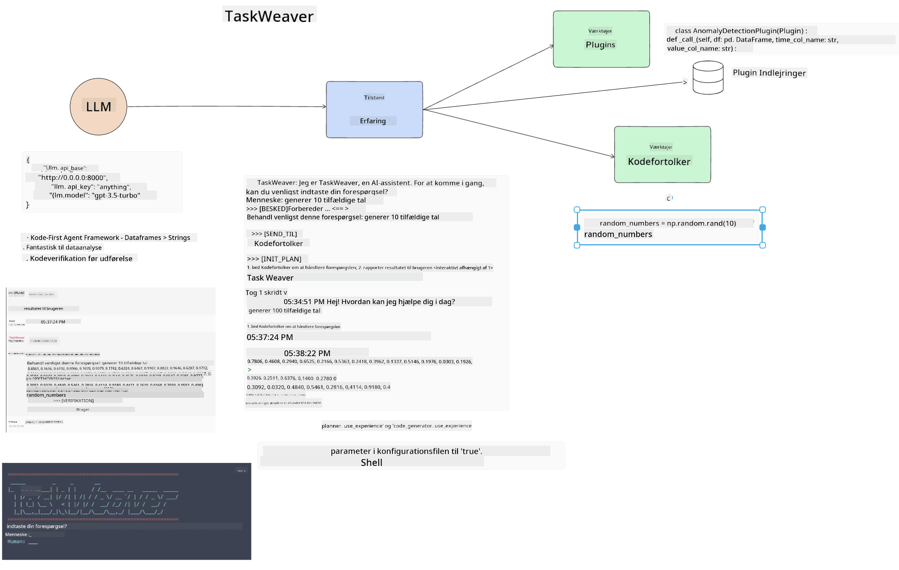

<!--
CO_OP_TRANSLATOR_METADATA:
{
  "original_hash": "8e8d1f6a63da606af7176a87ff8e92b6",
  "translation_date": "2025-10-17T19:15:55+00:00",
  "source_file": "17-ai-agents/README.md",
  "language_code": "da"
}
-->
[](https://youtu.be/yAXVW-lUINc?si=bOtW9nL6jc3XJgOM)

## Introduktion

AI-agenter repræsenterer en spændende udvikling inden for Generativ AI, hvor store sprogmodeller (LLMs) udvikler sig fra assistenter til agenter, der kan tage handlinger. AI-agentrammer gør det muligt for udviklere at skabe applikationer, der giver LLMs adgang til værktøjer og tilstandsstyring. Disse rammer forbedrer også synligheden, så brugere og udviklere kan overvåge de handlinger, som LLMs planlægger, og dermed forbedre oplevelsesstyringen.

Lektionens indhold vil dække følgende områder:

- Forståelse af, hvad en AI-agent er - Hvad er en AI-agent egentlig?
- Udforskning af fire forskellige AI-agentrammer - Hvad gør dem unikke?
- Anvendelse af disse AI-agenter til forskellige brugsscenarier - Hvornår skal vi bruge AI-agenter?

## Læringsmål

Efter denne lektion vil du kunne:

- Forklare, hvad AI-agenter er, og hvordan de kan bruges.
- Få en forståelse af forskellene mellem nogle af de populære AI-agentrammer, og hvordan de adskiller sig.
- Forstå, hvordan AI-agenter fungerer, så du kan bygge applikationer med dem.

## Hvad er AI-agenter?

AI-agenter er et meget spændende område inden for Generativ AI. Med denne spænding følger ofte en forvirring omkring begreber og deres anvendelse. For at holde det enkelt og inkluderende for de fleste værktøjer, der refererer til AI-agenter, vil vi bruge denne definition:

AI-agenter giver store sprogmodeller (LLMs) mulighed for at udføre opgaver ved at give dem adgang til en **tilstand** og **værktøjer**.


Lad os definere disse begreber:

**Store sprogmodeller** - Dette er de modeller, der omtales i hele kurset, såsom GPT-3.5, GPT-4, Llama-2 osv.

**Tilstand** - Dette refererer til den kontekst, som LLM arbejder i. LLM bruger konteksten fra sine tidligere handlinger og den aktuelle kontekst til at guide beslutningstagningen for efterfølgende handlinger. AI-agentrammer gør det lettere for udviklere at opretholde denne kontekst.

**Værktøjer** - For at fuldføre den opgave, som brugeren har anmodet om, og som LLM har planlagt, har LLM brug for adgang til værktøjer. Eksempler på værktøjer kan være en database, en API, en ekstern applikation eller endda en anden LLM!

Disse definitioner vil forhåbentlig give dig et godt grundlag, når vi ser på, hvordan de implementeres. Lad os udforske nogle forskellige AI-agentrammer:

## LangChain-agenter

[LangChain-agenter](https://python.langchain.com/docs/how_to/#agents?WT.mc_id=academic-105485-koreyst) er en implementering af de definitioner, vi har givet ovenfor.

For at administrere **tilstanden** bruger den en indbygget funktion kaldet `AgentExecutor`. Denne accepterer den definerede `agent` og de `værktøjer`, der er tilgængelige for den.

`AgentExecutor` gemmer også chat-historikken for at give konteksten af chatten.


LangChain tilbyder en [katalog over værktøjer](https://integrations.langchain.com/tools?WT.mc_id=academic-105485-koreyst), der kan importeres til din applikation, hvor LLM kan få adgang til dem. Disse er lavet af fællesskabet og LangChain-teamet.

Du kan derefter definere disse værktøjer og videregive dem til `AgentExecutor`.

Synlighed er et andet vigtigt aspekt, når man taler om AI-agenter. Det er vigtigt for applikationsudviklere at forstå, hvilket værktøj LLM bruger og hvorfor. Til dette har LangChain-teamet udviklet LangSmith.

## AutoGen

Den næste AI-agentramme, vi vil diskutere, er [AutoGen](https://microsoft.github.io/autogen/?WT.mc_id=academic-105485-koreyst). AutoGen fokuserer primært på samtaler. Agenter er både **samtalebare** og **tilpasselige**.

**Samtalebare -** LLMs kan starte og fortsætte en samtale med en anden LLM for at fuldføre en opgave. Dette gøres ved at oprette `AssistantAgents` og give dem en specifik systemmeddelelse.

```python

autogen.AssistantAgent( name="Coder", llm_config=llm_config, ) pm = autogen.AssistantAgent( name="Product_manager", system_message="Creative in software product ideas.", llm_config=llm_config, )

```

**Tilpasselige** - Agenter kan defineres ikke kun som LLMs, men også som en bruger eller et værktøj. Som udvikler kan du definere en `UserProxyAgent`, som er ansvarlig for at interagere med brugeren for feedback i forbindelse med fuldførelsen af en opgave. Denne feedback kan enten fortsætte udførelsen af opgaven eller stoppe den.

```python
user_proxy = UserProxyAgent(name="user_proxy")
```

### Tilstand og værktøjer

For at ændre og administrere tilstanden genererer en assistentagent Python-kode for at fuldføre opgaven.

Her er et eksempel på processen:


#### LLM defineret med en systemmeddelelse

```python
system_message="For weather related tasks, only use the functions you have been provided with. Reply TERMINATE when the task is done."
```

Denne systemmeddelelse instruerer denne specifikke LLM om, hvilke funktioner der er relevante for dens opgave. Husk, at du med AutoGen kan have flere definerede AssistantAgents med forskellige systemmeddelelser.

#### Chat initieres af brugeren

```python
user_proxy.initiate_chat( chatbot, message="I am planning a trip to NYC next week, can you help me pick out what to wear? ", )

```

Denne meddelelse fra user_proxy (menneske) er det, der starter processen, hvor agenten udforsker de mulige funktioner, den skal udføre.

#### Funktion udføres

```bash
chatbot (to user_proxy):

***** Suggested tool Call: get_weather ***** Arguments: {"location":"New York City, NY","time_periond:"7","temperature_unit":"Celsius"} ******************************************************** --------------------------------------------------------------------------------

>>>>>>>> EXECUTING FUNCTION get_weather... user_proxy (to chatbot): ***** Response from calling function "get_weather" ***** 112.22727272727272 EUR ****************************************************************

```

Når den indledende chat er behandlet, vil agenten foreslå det værktøj, der skal kaldes. I dette tilfælde er det en funktion kaldet `get_weather`. Afhængigt af din konfiguration kan denne funktion automatisk udføres og læses af agenten eller udføres baseret på brugerinput.

Du kan finde en liste over [AutoGen kodeeksempler](https://microsoft.github.io/autogen/docs/Examples/?WT.mc_id=academic-105485-koreyst) for yderligere at udforske, hvordan du kommer i gang med at bygge.

## Taskweaver

Den næste agentramme, vi vil udforske, er [Taskweaver](https://microsoft.github.io/TaskWeaver/?WT.mc_id=academic-105485-koreyst). Den er kendt som en "kode-først" agent, fordi den i stedet for at arbejde strengt med `strings` kan arbejde med DataFrames i Python. Dette bliver ekstremt nyttigt til dataanalyse og genereringsopgaver. Det kan være ting som at lave grafer og diagrammer eller generere tilfældige tal.

### Tilstand og værktøjer

For at administrere samtalens tilstand bruger TaskWeaver konceptet `Planner`. `Planner` er en LLM, der tager anmodningen fra brugerne og kortlægger de opgaver, der skal udføres for at opfylde denne anmodning.

For at fuldføre opgaverne eksponeres `Planner` for en samling af værktøjer kaldet `Plugins`. Dette kan være Python-klasser eller en generel kodefortolker. Disse plugins gemmes som embeddings, så LLM bedre kan søge efter det korrekte plugin.



Her er et eksempel på et plugin til håndtering af anomali-detektion:

```python
class AnomalyDetectionPlugin(Plugin): def __call__(self, df: pd.DataFrame, time_col_name: str, value_col_name: str):
```

Koden verificeres, før den udføres. En anden funktion til at administrere kontekst i Taskweaver er `experience`. Experience gør det muligt at gemme konteksten af en samtale på lang sigt i en YAML-fil. Dette kan konfigureres, så LLM forbedrer sig over tid på visse opgaver, da den eksponeres for tidligere samtaler.

## JARVIS

Den sidste agentramme, vi vil udforske, er [JARVIS](https://github.com/microsoft/JARVIS?tab=readme-ov-file?WT.mc_id=academic-105485-koreyst). Det, der gør JARVIS unik, er, at den bruger en LLM til at administrere samtalens `tilstand`, og `værktøjerne` er andre AI-modeller. Hver af AI-modellerne er specialiserede modeller, der udfører bestemte opgaver såsom objektdetektion, transskription eller billedbeskrivelse.


LLM, som er en generel model, modtager anmodningen fra brugeren og identificerer den specifikke opgave og eventuelle argumenter/data, der er nødvendige for at fuldføre opgaven.

```python
[{"task": "object-detection", "id": 0, "dep": [-1], "args": {"image": "e1.jpg" }}]
```

LLM formaterer derefter anmodningen på en måde, som den specialiserede AI-model kan fortolke, såsom JSON. Når AI-modellen har returneret sin forudsigelse baseret på opgaven, modtager LLM svaret.

Hvis flere modeller er nødvendige for at fuldføre opgaven, vil den også fortolke svaret fra disse modeller, før den samler dem for at generere et svar til brugeren.

Eksemplet nedenfor viser, hvordan dette ville fungere, når en bruger anmoder om en beskrivelse og optælling af objekterne i et billede:

## Opgave

For at fortsætte din læring om AI-agenter kan du bygge med AutoGen:

- En applikation, der simulerer et forretningsmøde med forskellige afdelinger i en uddannelsesstart-up.
- Opret systemmeddelelser, der guider LLMs i at forstå forskellige personligheder og prioriteter, og gør det muligt for brugeren at præsentere en ny produktidé.
- LLM skal derefter generere opfølgende spørgsmål fra hver afdeling for at forbedre og raffinere præsentationen og produktidéen.

## Læringen stopper ikke her, fortsæt rejsen

Efter at have afsluttet denne lektion, kan du tjekke vores [Generative AI Learning collection](https://aka.ms/genai-collection?WT.mc_id=academic-105485-koreyst) for at fortsætte med at opbygge din viden om Generativ AI!

---

**Ansvarsfraskrivelse**:  
Dette dokument er blevet oversat ved hjælp af AI-oversættelsestjenesten [Co-op Translator](https://github.com/Azure/co-op-translator). Selvom vi bestræber os på nøjagtighed, skal du være opmærksom på, at automatiserede oversættelser kan indeholde fejl eller unøjagtigheder. Det originale dokument på dets oprindelige sprog bør betragtes som den autoritative kilde. For kritisk information anbefales professionel menneskelig oversættelse. Vi er ikke ansvarlige for eventuelle misforståelser eller fejltolkninger, der opstår som følge af brugen af denne oversættelse.